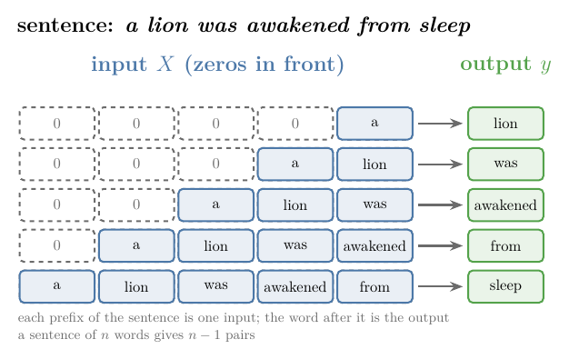

## 1. Overview

> **Key point:** A next-word predictor turns text generation into supervised learning: every beginning of a sentence is an input, and the word that follows it is the output. An Embedding layer, an LSTM and a softmax layer then learn to pick the most likely next word from the vocabulary.

A **next-word predictor** takes some text and suggests the word that comes next. Phone keyboards that suggest the next word while we type, e-mail tools that suggest how to finish a sentence and code completion tools all do this.

Repeated, it becomes a **text generator**: predict a word, add it to the text, predict the next one, and so on. This Note builds one with an LSTM in Keras, on a small real text: the first 48 of Aesop's fables.

{width=100%}

Figure 1 shows the whole model. The rest of the Note builds the training data for it, trains it, and makes it write.

## 2. Prerequisites

- The [LSTM Note](../1061-lstm/note.md) and the [LSTM architecture Note](../1062-lstm-architecture/note.md): what an LSTM layer computes, and how its parameters are counted.
- The [RNN sentiment analysis Note](../1057-rnn-sentiment-analysis/note.md): integer encoding with `TextVectorization`, padding with `pad_sequences`, and the `Embedding` layer.
- The [types of RNN Note](../1058-types-of-rnn/note.md): a many-to-one RNN reads a sequence and gives one output.
- The [loss functions Note](../1014-dl-loss-functions/note.md): categorical cross-entropy for several classes.
- The [one-hot encoding Note](../27-one-hot-encoding/note.md): a category becomes a vector with a single 1.

## 3. Text generation as a supervised learning problem

> **Key point:** We cannot train a model on raw text, but we can cut the text into pairs: the first words of a sentence (input) and the word right after them (output). A model trained on these pairs learns to predict the next word.

### 3.1 Supervised learning needs input-output pairs

> **Key point:** Supervised learning trains a model on data where every input comes with its correct output. Plain text has no such pairs, so we make them.

In supervised learning, every **observation** (one record of the data) has an input and a **target** (the output we predict). The model learns the mapping from input to target, then predicts the target for new inputs. A text is only a list of sentences. To use supervised learning, we must create the pairs from the text itself.

### 3.2 Every prefix predicts its next word

> **Key point:** A sentence of $n$ words gives $n - 1$ pairs: the first word predicts the second, the first two predict the third, and so on.

Take the sentence "a lion was awakened from sleep". We read it word by word:

- input "a", output "lion";
- input "a lion", output "was";
- input "a lion was", output "awakened";
- and so on, until input "a lion was awakened from", output "sleep".

Each input is a **prefix** of the sentence (its first few words), and its output is the next word. We repeat this for every sentence of the text and collect all the pairs into one dataset.

{width=95%}

Figure 2 shows the pairs. A prefix is also called an **n-gram**: a sequence of $n$ consecutive words.

## 4. Preparing the data

> **Key point:** Four steps: give every word a number, make the prefix pairs, pad them to one length with zeros in front, and split each row into input (all but the last number) and output (the last number).

### 4.1 The text

> **Key point:** The first 48 of Aesop's fables, about 4,900 words. Fables 1 to 40 are for training; fables 41 to 48 are kept aside to test the model on text it has never seen.

The text is Aesop's fables in G. F. Townsend's translation, a public-domain book from Project Gutenberg (eBook 21). The Note uses the first 48 fables, 4,868 words, about the length of a few pages; the folder's `data/fables.txt` holds them, one fable per line. A small text keeps training short, and a good model would need much more text.

We split every fable into sentences at a full stop, question mark or exclamation mark followed by a space. Fables 1 to 40 give 159 training sentences, and fables 41 to 48 give 40 sentences held out for validation.

### 4.2 A number for every word

> **Key point:** `TextVectorization` builds the vocabulary from the training sentences and replaces every word by its index: 1,159 entries, including index 0 for padding and index 1 for unknown words.

A model needs numbers, so every word gets an integer, as in the [RNN sentiment analysis Note](../1057-rnn-sentiment-analysis/note.md). We build the vocabulary from the training sentences only. It has 1,159 entries: index 0 is the padding value, index 1 is `[UNK]` for any word outside the vocabulary, and the words follow, most frequent first ("the" is 2, "a" is 3).

The first sentence, "A LION was awakened from sleep by a Mouse running over his face.", becomes

$$[3, 34, 15, 1107, 38, 281, 19, 3, 82, 292, 143, 8, 931]$$

since `TextVectorization` lower-cases the text and removes punctuation first.

### 4.3 The prefix pairs

> **Key point:** A loop over each sentence's integers keeps the first $i + 1$ numbers for $i = 1, 2, \dots$: 3,809 training sequences.

For each sentence, a loop takes the first 2 integers, then the first 3, and so on up to the whole sentence. The last number of each slice is the output; the others are the input.

| Sequence | Input | Output |
|---|---|---|
| $[3, 34]$ | a | lion |
| $[3, 34, 15]$ | a lion | was |
| $[3, 34, 15, 1107]$ | a lion was | awakened |

The training sentences give 3,809 such sequences, and the validation sentences 859.

> **Python:** Building the sequences. `to_ids` turns a sentence into its list of integers.
>
> ```python
> sequences = []
> for s in train_sentences:
>     ids = to_ids(s)
>     for i in range(1, len(ids)):
>         sequences.append(ids[:i + 1])
> ```

### 4.4 Padding with zeros in front

> **Key point:** The sequences have different lengths, so we pad them with zeros to the longest one, 90. The zeros go in front, so the last input word always sits right before the output.

The longest training sequence has 90 integers. `keras.utils.pad_sequences(sequences, maxlen=90, padding="pre")` adds zeros at the start of every shorter sequence (padding and its cost are covered in the [why RNNs Note](../1055-why-rnn/note.md)). The first sequence $[3, 34]$ becomes 88 zeros followed by $3, 34$.

Padding in front keeps the real words at the end of every row. The last real word of the input is then always the last time step the LSTM reads, right before it predicts.

### 4.5 Input and output

> **Key point:** All columns but the last are the input $X$; the last column is the output $y$. $X$ has shape $(3809, 89)$.

Every padded row holds an input followed by its output, so we split it:

- $X$ = all columns except the last: shape $(3809, 89)$, 89 time steps per observation;
- $y$ = the last column: shape $(3809,)$, one word index per observation.

> **Python:** Splitting the padded rows.
>
> ```python
> padded = keras.utils.pad_sequences(sequences, maxlen=90, padding="pre")
> X, y = padded[:, :-1], padded[:, -1]
> ```

## 5. Regression or classification?

> **Key point:** The output is a word index, a number, but the numbers are labels, not quantities. Predicting the next word is a multi-class classification problem with one class per vocabulary word.

### 5.1 Why not regression

> **Key point:** A regression model could output 2.7, and no word has the index 2.7.

The output $y$ is a number, so the task looks like regression. But the number 2 only names the word "the"; 2.7 means nothing, and a regression model can output any real number. The numbers are categories, so the task is **classification**: with 1,159 possible words, it is **multi-class classification**.

### 5.2 One-hot targets

> **Key point:** Each target becomes a one-hot vector of length 1,159; the model outputs 1,159 probabilities, and the largest one names the predicted word.

We replace every target by its one-hot vector (see the [one-hot encoding Note](../27-one-hot-encoding/note.md)): 1,159 numbers, all 0 except a 1 at the word's index. The output layer then has 1,159 nodes with a softmax activation. The softmax gives 1,159 probabilities that add up to 1, one per vocabulary word, and the predicted word is the one with the highest probability.

> **Python:** One-hot targets with `to_categorical`.
>
> ```python
> Y = keras.utils.to_categorical(y, num_classes=1159)
> print(Y.shape)        # (3809, 1159)
> ```

`num_classes` must be the vocabulary size including index 0, because `to_categorical` expects class indices from 0 to `num_classes` $- 1$ (Keras documentation, `to_categorical`). `TextVectorization`'s vocabulary already counts index 0, so its length, 1,159, is the right value.

> **Extra:** Older code builds the vocabulary with the legacy `Tokenizer` (see the [RNN sentiment analysis Note](../1057-rnn-sentiment-analysis/note.md)). Its `word_index` numbers the words from 1 and does not list 0 (Keras source, `keras/src/legacy/preprocessing/text.py`), so `num_classes` must be `len(word_index) + 1`: with 282 words, 283. With 282, the class indices would run from 0 to 281, and the last word, index 282, would not fit.

## 6. The model: Embedding, LSTM, Dense

> **Key point:** Three layers: Embedding (each word index becomes 100 numbers), LSTM with 150 units (reads the 89 time steps), Dense with 1,159 softmax nodes (one probability per word). 441,509 parameters in total.

### 6.1 The three layers

> **Key point:** The Embedding layer gives the LSTM dense word vectors; the LSTM's last hidden state summarises the prefix; the Dense layer turns that summary into word probabilities.

Figure 1 shows the data flow for one observation.

1. **Embedding.** The input is 89 integers, most of them padding zeros: a sparse representation. The [Embedding layer](../1057-rnn-sentiment-analysis/note.md) replaces each integer by a learned vector of 100 numbers, so one observation of shape $(89,)$ becomes $(89, 100)$.
2. **LSTM.** The LSTM reads the 89 vectors one time step at a time. After the last one it outputs its hidden state $h_{89}$, 150 numbers, one per unit (see the [LSTM architecture Note](../1062-lstm-architecture/note.md)). This is a many-to-one RNN.
3. **Dense.** $h_{89}$ goes to a layer of 1,159 nodes with a softmax activation, which gives one probability per vocabulary word.

The model is compiled with the categorical cross-entropy loss (the loss for multi-class classification with one-hot targets; see the [loss functions Note](../1014-dl-loss-functions/note.md)), the Adam optimizer, and accuracy as the metric.

> **Python:** The model.
>
> ```python
> model = keras.Sequential([
>     keras.Input(shape=(89,)),
>     keras.layers.Embedding(1159, 100),
>     keras.layers.LSTM(150),
>     keras.layers.Dense(1159, activation="softmax")])
> model.compile(loss="categorical_crossentropy",
>               optimizer="adam", metrics=["accuracy"])
> ```

The number of time steps comes from `keras.Input(shape=(89,))`; Keras 3's `Embedding` no longer takes an `input_length` argument (see the [RNN sentiment analysis Note](../1057-rnn-sentiment-analysis/note.md)).

### 6.2 Counting the parameters

> **Key point:** $115{,}900 + 150{,}600 + 175{,}009 = 441{,}509$.

| Layer | Formula | Parameters |
|---|---|---|
| Embedding | vocabulary × vector size $= 1159 \times 100$ | 115,900 |
| LSTM | $4\thinspace((u + d)\thinspace u + u)$ with $u = 150$, $d = 100$ | 150,600 |
| Dense | $150 \times 1159$ weights $+ 1159$ biases | 175,009 |
| **Total** | | **441,509** |

The LSTM row uses the formula of the [LSTM architecture Note](../1062-lstm-architecture/note.md):

$$4\thinspace\big((150 + 100) \times 150 + 150\big) = 4 \times 37{,}650 = 150{,}600$$

`model.summary()` gives the same numbers (Notebook).

## 7. Training and overfitting

> **Key point:** After 100 epochs the model gets 96% of the training next words right, but only about 6% on the held-out fables, no better than always guessing "the". The model has memorised its small text.

We train for 100 epochs with batch size 32, and check the model after every epoch on the pairs from the held-out fables 41 to 48.

{width=100%}

Figure 3 and the Notebook give:

| | Epoch 10 | Epoch 50 | Epoch 100 |
|---|---|---|---|
| Training accuracy | 0.126 | 0.899 | 0.962 |
| Validation accuracy | 0.097 | 0.065 | 0.055 |

The training accuracy looks excellent, but the validation accuracy shows what the model really learned. Always guessing the most frequent word, "the", would already be right on 6.6% of the validation pairs; the model's best is 9.7%, at epoch 10, and it ends at 5.5%. The gap is **overfitting**: the model fits its training data and does not generalise (see the [regularisation Note](../1026-regularization-in-dl/note.md)).

The held-out text is also hard for a structural reason: 26.3% of its next words never appear in the training fables. They map to `[UNK]`, and no model trained on these 40 fables can name them.

## 8. Predicting the next word

> **Key point:** Encode the text, pad it in front to 89, run the model, take the index with the highest probability, and look the word up in the vocabulary.

### 8.1 One word

> **Key point:** Four steps: integers, padding, probabilities, argmax.

1. **Encode** the text with the same `TextVectorization` layer: "a lion was awakened from sleep by a" becomes $[3, 34, 15, 1107, 38, 281, 19, 3]$.
2. **Pad** it in front to 89 integers, exactly as in training.
3. **Predict:** `model.predict` returns 1,159 probabilities.
4. **Pick** the index with the highest probability with `np.argmax`, and look up its word in the vocabulary.

The model answers "mouse", with probability 0.977: the word that follows in the first fable.

> **Python:** One prediction.
>
> ```python
> def next_word(text):
>     ids = keras.utils.pad_sequences([to_ids(text)],
>                                     maxlen=89, padding="pre")
>     p = model.predict(ids, verbose=0)[0]   # 1159 probabilities
>     return vocab[np.argmax(p)]
> ```

`vocab = vectorizer.get_vocabulary()` is the list of words, so `vocab[i]` is the word with index $i$.

### 8.2 Many words: text generation

> **Key point:** Add the predicted word to the text and predict again. Ten repetitions write ten words.

To write more than one word, we loop: predict the next word, append it to the text, and feed the longer text back in.

> **Python:** Ten words, one at a time.
>
> ```python
> for _ in range(10):
>     text = text + " " + next_word(text)
> ```

The Notebook's results, with the model after 100 epochs:

| Prompt | The next 10 words |
|---|---|
| a lion was awakened from sleep by a | mouse running over his face stand at the door stretching |
| the fox | seeing imminent danger approached the lion and promised to contrive |
| a wolf | who had a bone stuck in his throat hired a |
| the old man said | his thirst saw the lioness and demanded of her the |
| the king of the | arrangement is impossible as far as i am concerned for |

The first three prompts start fables or sentences of the training text, and the model continues them with words from that text. In the first one it copies "mouse running over his face" from the first fable, then jumps to "stand at the door stretching", a phrase from another training fable.

The last two prompts are new to the model. Its output is still stitched together from phrases of the training fables, such as "the lioness and demanded of her the" and "arrangement is impossible as far as i am concerned for" (both appear word for word in fables 1 to 40, in `data/fables.txt`). A model trained on 40 fables can only recombine what it has seen.

## 9. Making the predictor better

> **Key point:** Three ways: more data, hyperparameter tuning, and more powerful architectures.

1. **More data.** 40 fables are a few pages of text. A model trained on a large text, such as a big collection of jokes, quotes or screenplays, sees many more words and contexts. Training takes longer.
2. **Hyperparameter tuning.** The number of LSTM units (150 here), the size of the word vectors (100), the optimizer, the learning rate and the number of epochs can all be changed. Figure 3 suggests that far fewer than 100 epochs are enough for this text: the validation accuracy is highest at epoch 10 (see the [early stopping Note](../1022-early-stopping/note.md)).
3. **More powerful architectures.** Several LSTM layers stacked on each other (the [deep RNNs Note](../1065-deep-rnns/note.md)), bidirectional LSTMs (the [bidirectional RNN Note](../1066-bidirectional-rnn/note.md)), or transformer models such as GPT and BERT.

## 10. Summary

| Step | What we do | Result here |
|---|---|---|
| Text | first 48 Aesop fables, split into sentences | 159 training, 40 validation sentences |
| Vocabulary | `TextVectorization` on the training sentences | 1,159 entries |
| Pairs | every prefix of a sentence, with its next word | 3,809 training pairs |
| Padding | zeros in front, to the longest sequence | $X$: $(3809, 89)$ |
| Targets | one-hot over the vocabulary | $Y$: $(3809, 1159)$ |
| Model | Embedding(100), LSTM(150), Dense(1159, softmax) | 441,509 parameters |
| Training | 100 epochs, categorical cross-entropy, Adam | training 0.96, validation 0.06 |

- A next-word predictor makes text generation a supervised problem: every prefix of a sentence is an input, its next word the target.
- The target is a word, so the task is multi-class classification with one class per vocabulary word.
- Padding goes in front, so the last input word is the last time step the LSTM reads.
- Prediction: encode, pad, predict, argmax, look up; generation repeats this and appends each new word.
- On a small text the model memorises its training data: high training accuracy, poor accuracy on new text. More data, tuning and stronger architectures help.

## 11. Sources

- Aesop (tr. G. F. Townsend). *Three Hundred Aesop's Fables*. Project Gutenberg eBook 21, gutenberg.org/ebooks/21 (public domain).
- Keras API documentation: `TextVectorization`, `pad_sequences`, `to_categorical`, `Embedding`, `LSTM` layers, keras.io/api/.

## 12. Key terms

| Term | Meaning |
|---|---|
| Next-word predictor | A model that takes some text and predicts the word that comes next |
| Text generator | A next-word predictor run in a loop, each predicted word added to the text |
| Observation | One record of the data, here one prefix with its next word |
| Target | The output we predict, here the next word |
| Prefix | The first few words of a sentence |
| n-gram | A sequence of $n$ consecutive words |
| Multi-class classification | Predicting one of more than two classes; here one of 1,159 words |
| `to_categorical` | The Keras function that turns class indices into one-hot vectors |
| Softmax output layer | A layer with one node per class whose outputs are probabilities that add up to 1 |
| Overfitting | Fitting the training data well but new data poorly |
