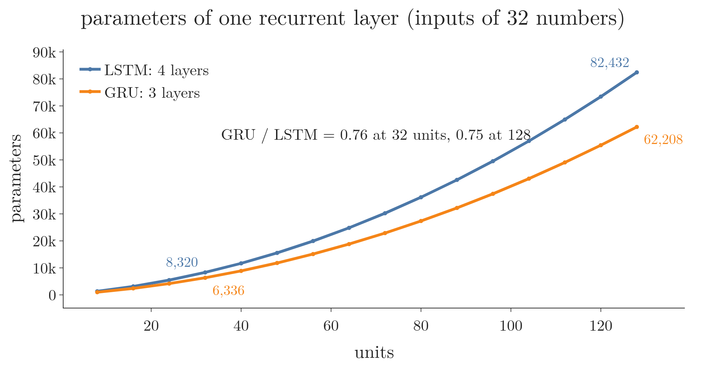
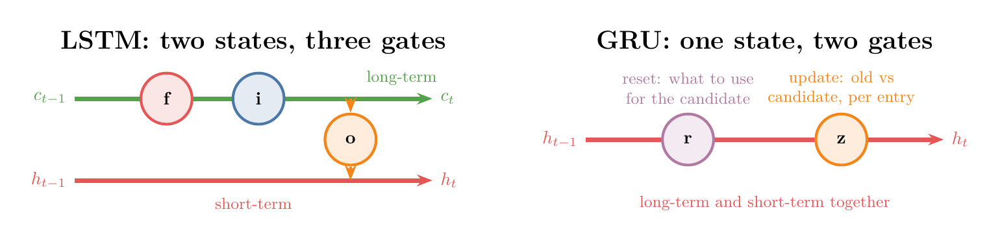
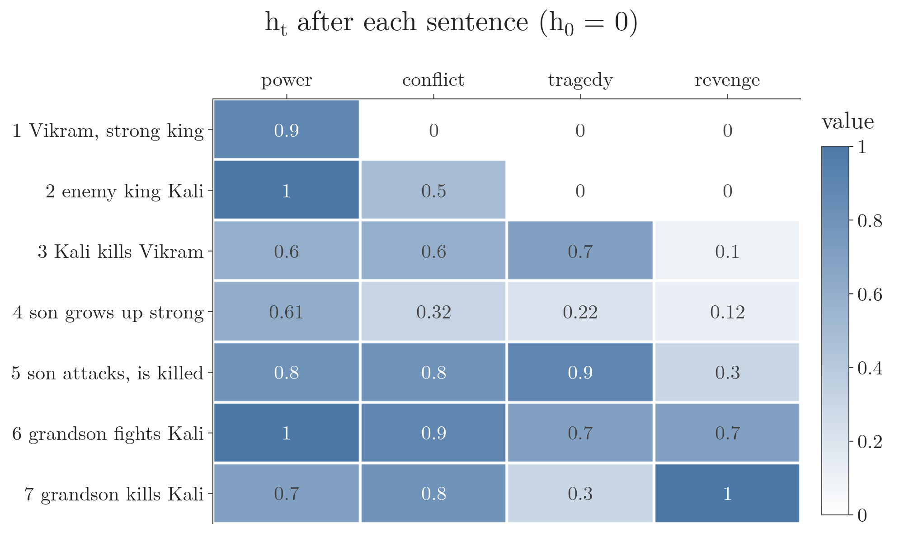
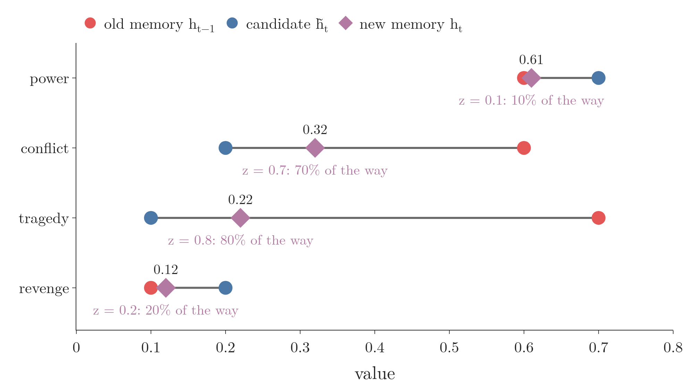
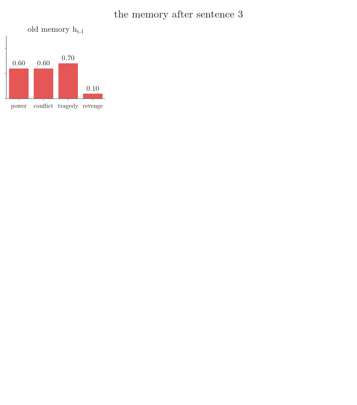
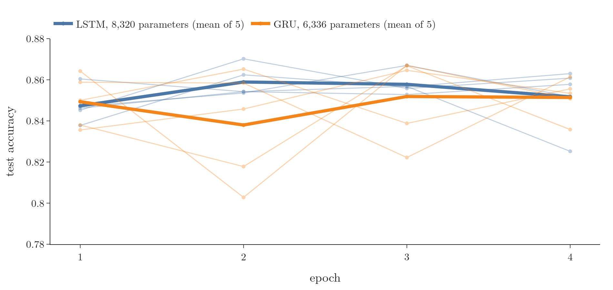

<!-- where-this-fits: generated by course_map/build_map.py; edit concepts.yaml, not this block -->
> **Where this fits:** Pipeline map step 8 (Model). See the [Course map](../01-course-map/note.md).
>
> 
>
> - **Builds on:** Recurrent neural network (RNN) ([Note 1057](../1057-rnn-sentiment-analysis/note.md)); LSTM gates (forget, input, output) and cell state ([Note 1062](../1062-lstm-architecture/note.md)).
> - **Leads to:** Deep (stacked) RNNs ([Note 1065](../1065-deep-rnns/note.md)); Bidirectional RNNs ([Note 1066](../1066-bidirectional-rnn/note.md)).
> - **Compare with:** LSTM (long short-term memory) ([Note 1063](../1063-lstm-next-word-prediction/note.md)).
<!-- /where-this-fits -->

## 1. Overview

> **Key point:** A gated recurrent unit (GRU) is a simpler cousin of the LSTM. A GRU keeps a single memory, the hidden state, and controls it with two gates instead of three: a reset gate and an update gate. A GRU has fewer parameters than an LSTM and performs comparably.

A **gated recurrent unit** (G-826) (**GRU**; Cho et al. 2014) is an RNN architecture for sequential data, like the simple RNN and the LSTM. The simple RNN cannot keep long-term context, because of vanishing and exploding gradients (see the [problems with RNNs Note](../1060-problems-with-rnn/note.md)). The [LSTM](../1061-lstm/note.md) (1997) solved that problem with two memories and three gates. The GRU (2014) asks how much of that machinery is really needed.

{width=100%}

Figure 1 is the whole cell. This Note covers:

- why the GRU exists (section 3);
- the meaning of its hidden state (section 6);
- its four computation steps (sections 7 and 8);
- how it compares with the LSTM, on paper and on real reviews (section 9).

## 2. Prerequisites

- The [LSTM Note](../1061-lstm/note.md): long-term and short-term context, and the story of King Vikram.
- The [LSTM architecture Note](../1062-lstm-architecture/note.md): gates as sigmoid layers, pointwise operations, the concatenation $[h_{t-1}, x_t]$, and the LSTM parameter count.
- The [RNN forward propagation Note](../1056-rnn-forward-propagation/note.md): time steps, row vectors and one-hot word vectors.
- The [activation functions Note](../1027-activation-functions/note.md): sigmoid (0 to 1) and tanh ($-1$ to 1).

## 3. Why the GRU exists

> **Key point:** The LSTM works, but its cell is complex and has many parameters, so it trains slowly on large datasets. The GRU has a simpler cell, fewer parameters and comparable performance.

The LSTM keeps long-term and short-term context on two separate paths and uses three gates (forget, input and output) to control them. Its many parameters are its weakness: more parameters mean more computation, so training takes longer, especially on large datasets.

The GRU offers a simpler cell:

| | LSTM | GRU |
|---|---|---|
| Year | 1997 (Hochreiter and Schmidhuber) | 2014 (Cho et al.) |
| Memories | cell state and hidden state | hidden state only |
| Gates | forget, input, output | reset, update |
| Layers inside the cell | 4 | 3 |

Despite the simpler cell, the GRU performs comparably to the LSTM. Neither is better everywhere: on some datasets the GRU wins, on others the LSTM. Chung et al. (2014) compared the two on music and speech data and "could not make concrete conclusion on which of the two gating units was better". Section 9 runs the same comparison on real movie reviews.

{width=90%}

In Figure 2, compare the two curves at any width: the GRU line stays at about three quarters of the LSTM line, from 8 units to 128.

## 4. The big idea: one state, two gates

> **Key point:** The GRU drops the separate cell state. A single hidden state carries both long-term and short-term context, and two gates manipulate it: the reset gate and the update gate.

The big idea of the LSTM was to keep the short-term and long-term context apart, on the hidden state and the cell state. The GRU says that two states are not needed. Its single **hidden state** (G-891) $h_t$ carries both the long-term and the short-term context from one time step to the next.

Two gates control how the hidden state changes:

- the **reset gate** (G-1679) $r_t$;
- the **update gate** (G-2060) $z_t$.

{width=100%}

In Figure 3, count the lines that leave each cell: two for the LSTM, one for the GRU.

Goodfellow §10.10.2 puts the main difference with the LSTM in one sentence: in a GRU, a single gating unit simultaneously controls the forgetting factor and the decision to update the state unit.

## 5. The parts of the cell

> **Key point:** Everything in Figure 1 is a vector, a neural network layer or a pointwise operation. Every vector except the input has the same length: the number of units.

The parts are the same kinds of things as in the [LSTM architecture Note](../1062-lstm-architecture/note.md).

### 5.1 The vectors

> **Key point:** $h_{t-1}$, $h_t$, $r_t$, $z_t$ and $\tilde h_t$ all have the same length. Only $x_t$ can differ.

| Symbol | Name |
|---|---|
| $h_{t-1}$ | previous hidden state |
| $h_t$ | current hidden state |
| $x_t$ | current input |
| $r_t$ | reset gate |
| $z_t$ | update gate |
| $\tilde h_t$ | **candidate hidden state** (G-343) |

All six are vectors. If $h_{t-1}$ has 4 numbers, so do $h_t$, $r_t$, $z_t$ and $\tilde h_t$. The input $x_t$ can have any length: it is the current word (or sentence) turned into a vector, for example by one-hot encoding as in the [RNN forward propagation Note](../1056-rnn-forward-propagation/note.md).

### 5.2 The layers

> **Key point:** The three boxes are fully connected layers, two with sigmoid and one with tanh. All three have the same number of units, a hyperparameter, and that number is the length of every vector above.

Each box in Figure 1 is a fully connected neural network layer. The number of nodes, the **units** (G-2049), is a hyperparameter we choose, and all three layers have the same number. With 5 units, every vector of section 5.1 except $x_t$ has 5 numbers.

### 5.3 The pointwise operations

> **Key point:** $\times$, $+$ and $1-$ act element by element.

With $a = [a_1, a_2, a_3]$ and $b = [b_1, b_2, b_3]$, the pointwise product is $a \odot b = [a_1 b_1, a_2 b_2, a_3 b_3]$, the pointwise sum is $[a_1 + b_1, a_2 + b_2, a_3 + b_3]$, and $1 - a = [1 - a_1, 1 - a_2, 1 - a_3]$.

## 6. What the hidden state holds

> **Key point:** The hidden state is the network's memory of the sequence so far. Each number can be pictured as one aspect of the context, updated at every time step.

Take the story of King Vikram from the [LSTM Note](../1061-lstm/note.md), fed to a GRU one sentence per time step, with the task of deciding at the end whether the story ends happily. To process each new sentence, the GRU needs a memory of the story so far: the hidden state.

Picture a hidden state of 4 numbers, each holding one aspect of the story: **power**, **conflict**, **tragedy** and **revenge**. This labelling is only a teaching picture: a trained network learns its own aspects, and we usually cannot say what each number means. Starting from $h_0 = [0, 0, 0, 0]$, the context could evolve like this:

| $t$ | Sentence | Power | Conflict | Tragedy | Revenge |
|---|---|---|---|---|---|
| 1 | There was a king, Vikram, very strong and powerful. | 0.9 | 0.0 | 0.0 | 0.0 |
| 2 | He had an enemy king, Kali. | 1.0 | 0.5 | 0.0 | 0.0 |
| 3 | They fought, and Kali killed Vikram. | 0.6 | 0.6 | 0.7 | 0.1 |
| 4 | Vikram's son grew up as strong as his father. | 0.61 | 0.32 | 0.22 | 0.12 |
| 5 | He too attacked Kali, and was killed. | 0.8 | 0.8 | 0.9 | 0.3 |
| 6 | His son grew up and fought Kali. | 1.0 | 0.9 | 0.7 | 0.7 |
| 7 | He killed Kali and avenged his father and grandfather. | 0.7 | 0.8 | 0.3 | 1.0 |

{width=90%}

In Figure 4, read down a column to follow one aspect through the story: tragedy rises at each death (rows 3 and 5), and revenge grows to 1 at the end.

Row 4 is computed step by step in section 8. The final row is the GRU's summary of the story: much conflict, some tragedy, a lot of revenge, and a happy ending. The gates decide how each row becomes the next.

## 7. From old memory to new memory in two stages

> **Key point:** First build a candidate memory from the old memory and the new input (the reset gate helps). Then balance the old memory against the candidate (the update gate decides how).

The GRU goes from $h_{t-1}$ to $h_t$ in two stages.

1. **Build a candidate memory** $\tilde h_t$ from the old memory $h_{t-1}$ and the current input $x_t$. The reset gate $r_t$ decides how much of the old memory takes part.
2. **Balance** the old memory $h_{t-1}$ against the candidate $\tilde h_t$ to get $h_t$. The update gate $z_t$ decides the balance.

Why not take the candidate directly as $h_t$? The candidate leans heavily on the current input, and the current input may not matter much for the story as a whole. The update gate lets important inputs change the memory a lot, and unimportant ones only a little.

In the story, after sentence 3 the memory is $h_{t-1} = [0.6, 0.6, 0.7, 0.1]$. Sentence 4 introduces Vikram's son. A candidate built on that sentence might be $[0.7, 0.2, 0.1, 0.2]$: more power (a new king), less conflict (no fight now), less tragedy, a hint of revenge. The new memory lies between the old one and the candidate.

{width=90%}

In Figure 5, compare power and tragedy: with $z = 0.1$ power barely moves from its old value, while with $z = 0.8$ tragedy moves most of the way to the candidate.

The four computation steps, in order:

| Step | Computes | From |
|---|---|---|
| 1 | reset gate $r_t$ | $h_{t-1}$, $x_t$ |
| 2 | candidate hidden state $\tilde h_t$ | $r_t \odot h_{t-1}$, $x_t$ |
| 3 | update gate $z_t$ | $h_{t-1}$, $x_t$ |
| 4 | new hidden state $h_t$ | $h_{t-1}$, $\tilde h_t$, $z_t$ |

## 8. The four steps of the GRU

> **Key point:** $r_t = \sigma([h_{t-1}, x_t] W_r + b_r)$, $\tilde h_t = \tanh([r_t \odot h_{t-1}, x_t] W_c + b_c)$, $z_t = \sigma([h_{t-1}, x_t] W_z + b_z)$, $h_t = (1 - z_t) \odot h_{t-1} + z_t \odot \tilde h_t$.

We use the notation of the [LSTM architecture Note](../1062-lstm-architecture/note.md): row vectors, and $[h_{t-1}, x_t]$ for the two vectors joined end to end.

### 8.1 Step 1: the reset gate

> **Key point:** A sigmoid layer looks at $h_{t-1}$ and $x_t$ and gives $r_t$, a number between 0 and 1 for every entry of the memory: how much of that entry to keep when building the candidate.

The reset gate is a vector of the same length as $h_{t-1}$, and also a gate: every entry lies between 0 and 1. An entry of 0 closes the gate for that entry of the memory; 1 opens it fully. Based on the current input, the reset gate resets some entries of the old memory.

1. **In words:** join $h_{t-1}$ and $x_t$, pass them through a fully connected layer with sigmoid activation.
2. **Formula:**
   $$r_t = \sigma\big([h_{t-1}, x_t]\thinspace W_r + b_r\big)$$
3. **Example:** with a 4-number memory and a 3-number input, $[h_{t-1}, x_t]$ has 7 numbers. The layer has 4 units, so $W_r$ is $7 \times 4$ (28 weights) and $b_r$ has 4 biases. The shapes: $(1 \times 7)(7 \times 4) + (1 \times 4) = 1 \times 4$.

In the story, sentence 4 talks about a strong new king, with no fight and no death. A trained reset gate might give $r_t = [0.8, 0.2, 0.1, 0.9]$:

- power, 0.8: keep 80%, because it still matters;
- conflict, 0.2: keep only 20%, because nothing in the sentence is about a fight;
- tragedy, 0.1: keep 10%, because the death is an old event by now;
- revenge, 0.9: keep 90%, because it is likely to matter from here on.

### 8.2 Step 2: the candidate hidden state

> **Key point:** Multiply the old memory by the reset gate, join it with the input, and pass it through a tanh layer: $\tilde h_t = \tanh([r_t \odot h_{t-1}, x_t]\thinspace W_c + b_c)$.

First the reset gate scales the old memory, entry by entry. The result, $r_t \odot h_{t-1}$, is the **reset** (or modulated) memory. Then the reset memory and the current input go through a fully connected tanh layer, which gives the candidate.

1. **In words:** reset the old memory, join it with the input, apply a tanh layer.
2. **Formula:**
   $$\tilde h_t = \tanh\big([r_t \odot h_{t-1},\ x_t]\thinspace W_c + b_c\big)$$
   $W_c$ is again $7 \times 4$ in our example, with 4 biases $b_c$.
3. **Example:** the reset memory in the story is
   $$r_t \odot h_{t-1} = [0.8 \times 0.6,\ 0.2 \times 0.6,\ 0.1 \times 0.7,\ 0.9 \times 0.1] = [0.48,\ 0.12,\ 0.07,\ 0.09]$$
   Power is barely reset; conflict and tragedy are reset a lot; revenge is barely reset. Joined with the new sentence and passed through the tanh layer, it might give the candidate $\tilde h_t = [0.7, 0.2, 0.1, 0.2]$.

### 8.3 Step 3: the update gate

> **Key point:** Another sigmoid layer on $h_{t-1}$ and $x_t$ gives $z_t$: for every entry, how much of the candidate to take in.

The candidate leans on the current input, and we do not know in advance how much it deserves.

- Sometimes the current input really matters: the last line of a murder mystery reveals that a different person was the victim, and the whole context changes. Then the candidate should get most of the weight.
- Sometimes it does not: a song in the middle of a film's story changes little. Then the old memory should get most of the weight.

The update gate learns this balance during training, by backpropagation.

1. **In words:** join $h_{t-1}$ and $x_t$, pass them through a fully connected sigmoid layer.
2. **Formula:**
   $$z_t = \sigma\big([h_{t-1}, x_t]\thinspace W_z + b_z\big)$$
3. **Example:** in the story, suppose $z_t = [0.1, 0.7, 0.8, 0.2]$. $W_z$ is $7 \times 4$, with 4 biases.

### 8.4 Step 4: the new hidden state

> **Key point:** $h_t = (1 - z_t) \odot h_{t-1} + z_t \odot \tilde h_t$. A large $z$ takes the candidate; a small $z$ keeps the old memory.

1. **In words:** for each entry, take a share $1 - z$ of the old memory and a share $z$ of the candidate, and add them.
2. **Formula:**
   $$h_t = (1 - z_t) \odot h_{t-1} + z_t \odot \tilde h_t$$
3. **Example:** with $h_{t-1} = [0.6, 0.6, 0.7, 0.1]$, $\tilde h_t = [0.7, 0.2, 0.1, 0.2]$ and $z_t = [0.1, 0.7, 0.8, 0.2]$:
   $$1 - z_t = [0.9,\ 0.3,\ 0.2,\ 0.8]$$
   $$(1 - z_t) \odot h_{t-1} = [0.54,\ 0.18,\ 0.14,\ 0.08], \qquad z_t \odot \tilde h_t = [0.07,\ 0.14,\ 0.08,\ 0.04]$$
   $$h_t = [0.61,\ 0.32,\ 0.22,\ 0.12]$$

Read the result entry by entry. Power rises a little (0.60 to 0.61): another king has appeared. Conflict falls (0.6 to 0.32): no fight is going on. Tragedy falls (0.7 to 0.22): Vikram's death is long past. Revenge grows (0.1 to 0.12): the son may avenge his father.

Each entry of $h_t$ is a weighted average of the old value and the candidate value, with weights $1 - z$ and $z$. With $z = 0.1$, the old memory gets 0.9 of the weight; with $z = 0.8$, the candidate gets 0.8.

{height=55%}

In Figure 6, watch the bottom bars: power and revenge stay close to their old values (small $z$), while conflict and tragedy give most of the weight to the candidate (large $z$) and fall toward its small values.

> **Extra:** The update gate is why a GRU can carry information far. If an entry of $z_t$ is close to 0, that entry of $h_t$ is copied from $h_{t-1}$ almost unchanged, across as many time steps as the gate stays closed. Chung et al. (2014, §3.3) point to this additive update, shared by the LSTM and the GRU and missing from the simple RNN: it lets a feature be kept for a long series of steps, and it creates shortcut paths along which the error can be backpropagated without vanishing too quickly.

### 8.5 The whole cell, by hand and in Keras

> **Key point:** Four formulas make one GRU time step. A NumPy version of them gives exactly the hidden states of Keras' `GRU` layer.

$$r_t = \sigma\big([h_{t-1}, x_t]\thinspace W_r + b_r\big)$$
$$\tilde h_t = \tanh\big([r_t \odot h_{t-1},\ x_t]\thinspace W_c + b_c\big)$$
$$z_t = \sigma\big([h_{t-1}, x_t]\thinspace W_z + b_z\big)$$
$$h_t = (1 - z_t) \odot h_{t-1} + z_t \odot \tilde h_t$$

The Notebook codes these four lines in NumPy with random weights (4 units, 3-number one-hot inputs for the words cat, mat and rat), runs them over "cat mat rat", and loads the same weights into Keras' `GRU` layer. The three hidden states agree to within $10^{-5}$.

> **Python:** A GRU layer in Keras.
>
> ```python
> model = keras.Sequential([
>     keras.Input(shape=(None, 3)),   # any number of time steps
>     keras.layers.GRU(4)])
> kernel, recurrent_kernel, bias = model.layers[0].get_weights()
> # kernel (3, 12): x_t rows; recurrent_kernel (4, 12): h_(t-1) rows
> # columns in the order z, r, candidate
> ```

> **Extra:** Two conventions differ between sources, and Keras follows the original paper on both.
>
> - **Which side $z$ weighs.** Cho et al. (2014, eq. 7) and Keras write $h_t = z_t \odot h_{t-1} + (1 - z_t) \odot \tilde h_t$: $z$ weighs the old memory. Chung et al. (2014, eq. 5) write it the other way round, as we do. The two are the same model: a gate trained one way learns the complement $1 - z$ of the other, because $\sigma(-a) = 1 - \sigma(a)$. The Notebook's check gives Keras the negated update-gate weights and gets identical hidden states.
> - **Where the reset gate acts.** The formula of step 2 (Cho et al. 2014, eq. 8 in the arXiv version; Chung et al. 2014) multiplies the old memory by $r_t$ before the weight matrix. Chung et al. (2014, footnote 1) note that the original GRU applied $r_t$ after the matrix product, $\tanh(x_t W + r_t \odot (h_{t-1} U))$, and that both forms performed as well as each other. Keras' default, `reset_after=True`, is this second form, with a separate bias for the recurrent part; `reset_after=False` gives the form of step 2 (Keras documentation, `GRU`). In the Notebook the two forms give hidden states that differ by at most 0.02 on the same weights.

## 9. GRU or LSTM

> **Key point:** Fewer gates, one memory, three layers instead of four: a GRU has about three quarters of an LSTM's parameters. On real movie reviews the two reach the same accuracy. Which one wins depends on the task, so in practice we try both.

### 9.1 The differences

> **Key point:** Two gates instead of three, one state instead of two, and 3 instead of 4 in the parameter formula.

| | LSTM | GRU |
|---|---|---|
| Gates | input, forget, output | reset, update |
| Memory | cell state $c_t$ and hidden state $h_t$ | hidden state $h_t$ |
| Parameters ($d$ inputs, $u$ units) | $4\thinspace\big((u + d)\thinspace u + u\big)$ | $3\thinspace\big((u + d)\thinspace u + u\big)$ |
| Exposure of the memory | an output gate controls how much is seen | the whole state is exposed |

The last row comes from Chung et al. (2014, §3.3): the LSTM's output gate controls how much of the memory the rest of the network sees, while the GRU exposes its full hidden state at every step.

1. **In words:** each of the GRU's three layers has $(u + d) \times u$ weights and $u$ biases.
2. **Formula:**
   $$\text{GRU parameters} = 3\thinspace\big((u + d)\thinspace u + u\big)$$
3. **Example:** the story's sizes, $u = 4$ and $d = 3$:
   $$3\thinspace\big((4 + 3) \times 4 + 4\big) = 3 \times 32 = 96, \qquad \text{LSTM: } 4 \times 32 = 128$$

Keras counts 96 for `GRU(4, reset_after=False)` and 128 for `LSTM(4)`. Its default `GRU(4)` counts 108, because `reset_after=True` adds a second bias vector to each layer: $3\thinspace\big((u + d)\thinspace u + 2u\big)$.

### 9.2 The two on real reviews

> **Key point:** On IMDB movie reviews, a GRU of 32 units reaches the same test accuracy as an LSTM of 32 units, 0.851 against 0.852, with 6,336 parameters instead of 8,320: about three quarters.

We train both on the same sentiment task. Each **observation** (G-1374) (one record) is a real movie review from the IMDB dataset, and the **target** (G-1949) (the output we predict) is its sentiment, positive or negative. The setup:

- all 25,000 training reviews, 5,000 test reviews, the 10,000 most frequent words;
- the last 200 words of each review (shorter reviews are padded in front), so every sequence has 200 time steps;
- an embedding of 32 numbers per word (see the [RNN sentiment analysis Note](../1057-rnn-sentiment-analysis/note.md)), a recurrent layer of 32 units, a sigmoid output;
- Adam, 4 epochs, batch size 64, 5 seeds per model.

Only the recurrent layer changes: `LSTM(32)` or `GRU(32)`.

{width=100%}

| | LSTM | GRU |
|---|---|---|
| Parameters of the recurrent layer | 8,320 | 6,336 |
| Test accuracy after 4 epochs, mean of 5 runs | 0.852 | 0.851 |
| Range over the 5 runs | 0.825 to 0.863 | 0.836 to 0.861 |
| Best epoch, mean of 5 runs | 0.863 | 0.865 |

The two models are indistinguishable on this task: the difference between their means, 0.001, is far smaller than the spread between runs of the same model. The GRU gets there with 1,984 fewer parameters. The counts follow section 9.1 with $u = 32$ and $d = 32$: the LSTM has $4\thinspace(64 \times 32 + 32) = 8{,}320$, and Keras' default GRU $3\thinspace(64 \times 32 + 2 \times 32) = 6{,}336$.

### 9.3 Which to choose

> **Key point:** Run both and compare. Neither is better on every task.

- **Performance:** comparable. Chung et al. (2014) found the gated units clearly better than the simple tanh unit, but could not say which of the two was better; on some datasets the GRU outperformed the LSTM. Goodfellow §10.10.2 reports that studies of many variants of the LSTM and GRU found no variant that clearly beat both across a wide range of tasks.
- **Cost:** the GRU has fewer parameters, so less computation per time step. How much faster that makes training in seconds depends on the hardware and the implementation.
- **In practice:** Chung et al. (2014) conclude that the choice of gated unit may depend heavily on the dataset and task, so we test both on the data at hand.

## 10. Summary

| | LSTM | GRU |
|---|---|---|
| Memory | cell state + hidden state | hidden state only |
| Gates | forget, input, output | reset $r_t$, update $z_t$ |
| Layers in the cell | 4 (3 sigmoid, 1 tanh) | 3 (2 sigmoid, 1 tanh) |
| Parameters | $4\thinspace((u + d)\thinspace u + u)$ | $3\thinspace((u + d)\thinspace u + u)$ |
| IMDB test accuracy, 32 units | 0.852 (8,320 parameters) | 0.851 (6,336 parameters) |

- A GRU keeps one memory, the hidden state, for both long-term and short-term context.
- Step 1: the reset gate $r_t$ decides how much of each entry of the old memory to use.
- Step 2: the candidate $\tilde h_t = \tanh([r_t \odot h_{t-1}, x_t]\thinspace W_c + b_c)$ proposes a new memory.
- Step 3: the update gate $z_t$ decides, entry by entry, the balance between old memory and candidate.
- Step 4: $h_t = (1 - z_t) \odot h_{t-1} + z_t \odot \tilde h_t$.
- The GRU has about three quarters of an LSTM's parameters and comparable performance; test both.

## 11. Sources

**Built from**

- CampusX, "Gated Recurrent Unit | Deep Learning | GRU | CampusX", YouTube, https://www.youtube.com/watch?v=QQfZAoNGQmE

**Other references**

- Cho, K., van Merriënboer, B., Gulcehre, C., Bahdanau, D., Bougares, F., Schwenk, H. and Bengio, Y. (2014). Learning Phrase Representations using RNN Encoder–Decoder for Statistical Machine Translation. EMNLP 2014. arXiv:1406.1078.
- Chung, J., Gulcehre, C., Cho, K. and Bengio, Y. (2014). Empirical Evaluation of Gated Recurrent Neural Networks on Sequence Modeling. arXiv:1412.3555.
- Goodfellow, I., Bengio, Y. and Courville, A. (2016). *Deep Learning*. MIT Press. §10.10.2 (other gated RNNs). deeplearningbook.org/contents/rnn.html.
- Hochreiter, S. and Schmidhuber, J. (1997). Long Short-Term Memory. *Neural Computation* 9(8), 1735–1780.
- Keras API documentation: `GRU` layer (`reset_after`, gate order), keras.io/api/layers/recurrent_layers/gru; `imdb.load_data`.

## 12. Key terms

| Term | Meaning |
|---|---|
| Gated recurrent unit (GRU) | An RNN architecture with one memory (the hidden state) and two gates, reset and update |
| Hidden state ($h_t$) | The GRU's only memory: its summary of the sequence up to time step $t$ |
| Reset gate ($r_t$) | A sigmoid layer's output that decides how much of each entry of the old memory is used to build the candidate |
| Reset (modulated) memory | $r_t \odot h_{t-1}$: the old memory scaled by the reset gate |
| Candidate hidden state ($\tilde h_t$) | The proposed new memory, built by a tanh layer from the reset memory and the input |
| Update gate ($z_t$) | A sigmoid layer's output that decides, entry by entry, how much of the candidate replaces the old memory |
| Units | The number of nodes in each layer of the cell, and the length of the hidden state |
| Observation | One record of the data, here one review |
| Target | The output we predict, here the sentiment of a review |
| `reset_after` | Keras option: apply the reset gate after (default) or before the matrix product |
