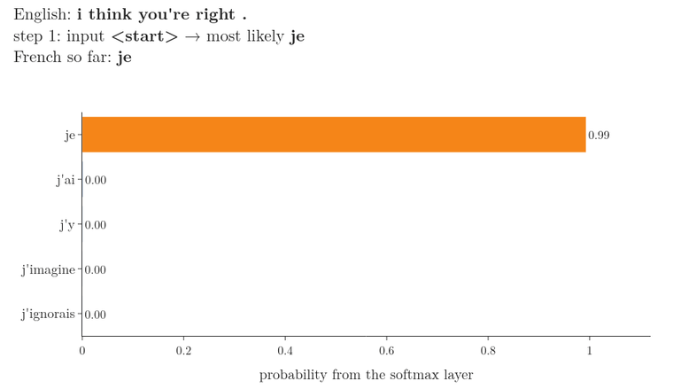
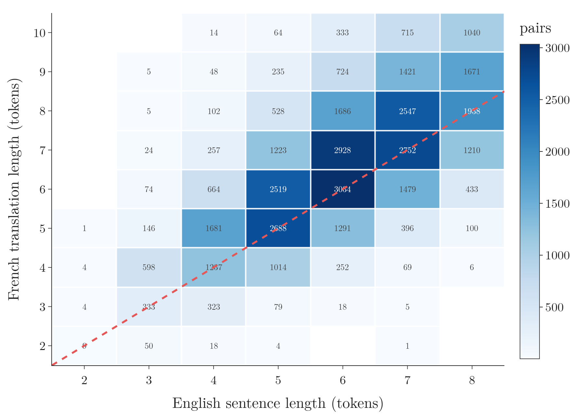
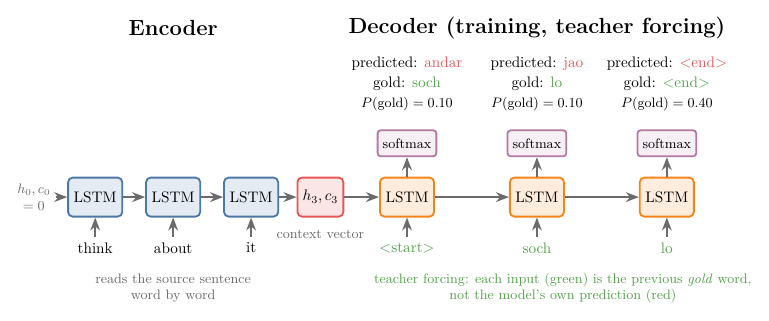
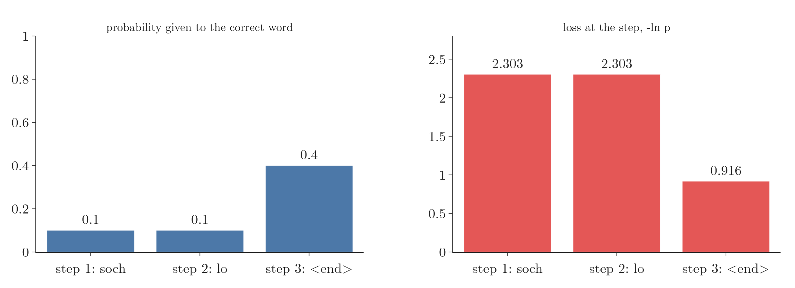
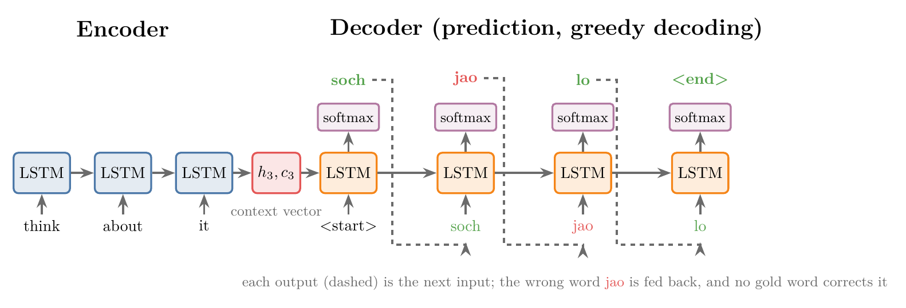
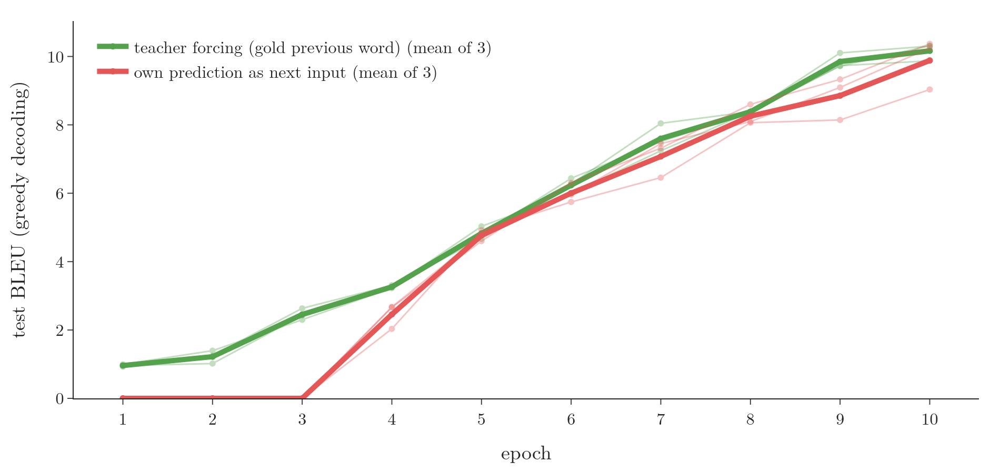
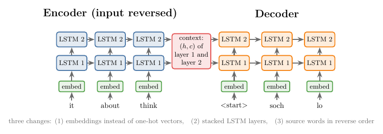
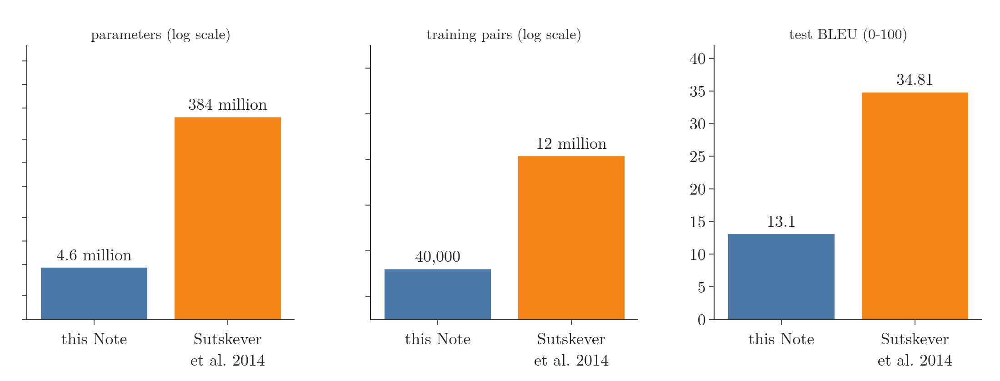

<!-- where-this-fits: generated by course_map/build_map.py; edit concepts.yaml, not this block -->
> **Where this fits:** Pipeline map step 8 (Model). See the [Course map](../01-course-map/note.md).
>
> 
>
> - **Builds on:** Types of RNN (many-to-one, one-to-many, many-to-many) ([Note 1058](../1058-types-of-rnn/note.md)); LSTM (long short-term memory) ([Note 1061](../1061-lstm/note.md)).
> - **Leads to:** Attention mechanism ([Note 1069](../1069-attention-mechanism/note.md)); Transformer ([Note 1071](../1071-introduction-to-transformers/note.md)); Masked self-attention ([Note 1081](../1081-masked-self-attention/note.md)).
<!-- /where-this-fits -->

## 1. Overview

> **Key point:** An encoder–decoder turns one sequence into another of a different length. The **encoder**, an LSTM, reads the input word by word and hands its final state, the **context vector**, to the **decoder**, a second LSTM that writes the output word by word until it produces an end token. During training the decoder is fed the correct previous word (**teacher forcing**); during prediction it is fed its own previous word.

Translating "nice to meet you" into Hindi gives "aap se mil kar achha laga": a sequence goes in and a sequence of a different length comes out. The [history of LLMs Note](../1067-history-of-llms/note.md) calls such tasks **sequence-to-sequence tasks** (G-1772) and places the encoder–decoder (Sutskever et al. 2014) as the first stage of the road to the transformer. This Note opens the architecture up: what sits inside each block, how the whole thing is trained, how it predicts, and the improvements used in the original paper.

{height=55%}

## 2. Prerequisites

- [the LSTM Note](../1061-lstm/note.md): an RNN with a cell state $c_t$ and a hidden state $h_t$ that reads a sequence one step at a time.
- [Types of RNN Note](../1058-types-of-rnn/note.md), section 5.2: many-to-many models whose input and output lengths differ.
- [RNN sentiment analysis Note](../1057-rnn-sentiment-analysis/note.md), section 6: word embeddings and Keras' `Embedding` layer.
- [Loss functions Note](../1014-dl-loss-functions/note.md): categorical cross-entropy and softmax.
- [Backpropagation through time Note](../1059-backpropagation-through-time/note.md): how an unrolled RNN is trained.

## 3. Why sequence-to-sequence is hard

> **Key point:** Three things vary at once: the length of the input, the length of the output, and the relation between the two lengths.

Machine translation is the running example of this Note. Three difficulties come with it:

1. **The input length varies.** One English sentence has 2 words, another 200.
2. **The output length varies.** The Hindi sentences vary in the same way.
3. **The two lengths are not tied.** "Nice to meet you" has 4 words; "aap se mil kar achha laga" has 6. Nothing guarantees that a 3-word input gives a 3-word output.

Figure 2 shows the third difficulty on the real English–French data of section 6. For each English sentence length, the French translations spread over several lengths.

{width=75%}

An LSTM already copes with the first difficulty: it reads one word per step for as many steps as the sentence has. What is new is producing an output whose length the model must decide for itself.

## 4. The architecture

> **Key point:** Two blocks joined by one vector. The encoder summarises the input into the context vector; the decoder turns the context vector into the output, one word per step.

At the highest level the architecture has three parts:

1. **The encoder** (G-682) receives the input sentence one **token** (G-1981; one word, for now) per step and builds a summary of the whole sentence.
2. **The context vector** is that summary: a fixed list of numbers.
3. **The decoder** (G-564) reads the context vector and writes the output sentence one token per step.

### 4.1 The encoder

> **Key point:** One LSTM unrolled over the input words. Its hidden and cell states after the last word form the context vector.

The encoder is a single LSTM unrolled over time, as in [the LSTM Note](../1061-lstm/note.md). At step 1 it reads "think" together with the initial states $h_0, c_0$ and produces $h_1, c_1$; at step 2 it reads "about" with $h_1, c_1$; and so on. Each step updates the states with the new word, so after the last word the pair $(h_n, c_n)$ summarises the whole sentence. This pair is the **context vector** (G-461; Sutskever et al. 2014, section 2; SLP3 §14.7).

The initial states are usually all zeros, which is what Keras uses when no initial state is given (Keras 3.15 `LSTM` docstring). The encoder's outputs at each step are not used; only its final states are.

{height=50%}

Figure 3 pictures the consequence. However long the input, the decoder sees only the fixed-size pair $(h_n, c_n)$; the more words the encoder reads, the less room each word has in it. The [attention Note](../1069-attention-mechanism/note.md), section 7, measures what this costs on long sentences.

A GRU or a plain RNN cell can replace the LSTM. Plain RNNs are rarely chosen because of the vanishing gradient problem (the [problems with RNN Note](../1060-problems-with-rnn/note.md)); the original paper used LSTMs.

### 4.2 The decoder

> **Key point:** A second LSTM, with its own weights, starts from the context vector, receives a `<start>` token first and then its previous output word, and stops when it outputs `<end>`.

The decoder is a different LSTM from the encoder: the two do not share weights. Its initial states are set to the encoder's final states, which is how the decoder learns what the input said. Then:

1. At step 1 it receives a special token, **`<start>`**, which signals "begin writing". The decoder outputs the first word.
2. At step 2 it receives the word from step 1 and the updated states, and outputs the second word.
3. The decoder continues until it outputs the special token **`<end>`**, and then stops.

The `<end>` token is what lets the decoder choose the output length.

To output a word, the decoder's hidden state passes through a dense layer with a **softmax** (G-1830) activation, with one unit per word of the output vocabulary. The softmax gives a probability for every word, and the word with the highest probability is the output of that step.

## 5. Training

> **Key point:** Training uses pairs of sentences. The encoder and decoder are trained together: forward pass, cross-entropy loss at every output step, backpropagation through both LSTMs, weight update.

### 5.1 The data

> **Key point:** A parallel corpus: each observation is a sentence and its translation. Words are turned into numbers; the output vocabulary gets two extra tokens, `<start>` and `<end>`.

Translation data comes as a **parallel corpus** (G-1442): a table with two columns, a sentence in the source language and its translation in the target language. Each row is one **observation** (G-1374; one training example). The source sentence is the input; the translation is the **target** (G-1949), the output we want the model to produce.

To follow the training by hand, take a corpus of two observations:

| English | Hindi |
|---|---|
| think about it | soch lo |
| come in | andar aa jao |

A network needs numbers, so we first **tokenise** (G-1983; split each sentence into tokens) and then encode each token. The simplest encoding is one-hot (the [one-hot encoding Note](../27-one-hot-encoding/note.md)):

- English has 5 distinct words: think, about, it, come, in. "think" is $[1, 0, 0, 0, 0]$, "about" is $[0, 1, 0, 0, 0]$.
- Hindi has 5 distinct words: soch, lo, andar, aa, jao. Two special tokens are added, `<start>` and `<end>`, for 7 in total. `<start>` is $[1, 0, 0, 0, 0, 0, 0]$, "soch" is $[0, 1, 0, 0, 0, 0, 0]$.

### 5.2 The forward pass and teacher forcing

> **Key point:** At every decoder step the input is the correct previous word from the data, whatever the model predicted. Feeding the gold word is called teacher forcing, and it speeds up training.

Both LSTMs start with random weights. The first observation goes through the network (Figure 4):

1. The encoder reads "think", "about", "it", one vector per step, and passes its final states to the decoder.
2. The decoder receives `<start>`. The softmax gives 7 probabilities; with random weights the largest might belong to "andar", while the correct first word is "soch". The prediction is wrong.
3. The next step needs an input. The plan of section 4.2 says: feed the previous output, "andar". During training we feed the **correct** previous word, "soch", instead.
4. The decoder predicts "jao" where "lo" was correct, and again receives the correct word, "lo".
5. The decoder predicts `<end>`, which is correct, and the sentence is complete.

{width=100%}

Feeding the gold word instead of the prediction is called **teacher forcing** (G-1955). If a wrong word were fed back, every later step would build on the mistake, and early in training most predictions are wrong. With teacher forcing every step learns from a correct history, which speeds up training (SLP3 §14.7.1). Teacher forcing also fixes the length during training: the decoder runs for exactly as many steps as the gold sentence has tokens, whether or not it predicted `<end>` at the right step. Section 7 measures the effect.

In code, teacher forcing is just a shift. The decoder's input is the gold target sentence with `<start>` in front; its target is the same sentence with `<end>` at the back:

| Decoder input | `<start>` | soch | lo |
|---|---|---|---|
| **Decoder target** | **soch** | **lo** | **`<end>`** |

### 5.3 The loss

> **Key point:** Each decoder step is a classification over the output vocabulary, so the loss is categorical cross-entropy, summed or averaged over the steps.

At every step the decoder picks one word out of 7: a multi-class classification. The loss is **categorical cross-entropy** (G-349; the [loss functions Note](../1014-dl-loss-functions/note.md)), computed at every step.

1. **In words:** at each step, take minus the natural log of the probability the model gave to the correct word. Add the steps up (or average them).
2. **Formula:** with $V$ words in the vocabulary and the one-hot target $y_t$,
   $$L_t = -\sum_{k=1}^{V} y_{t,k}\thinspace\ln \hat y_{t,k} = -\ln \hat y_{t,\text{gold}}, \qquad L = \sum_{t} L_t$$
3. **Example:** the softmax gave the correct words "soch", "lo" and `<end>` the probabilities 0.1, 0.1 and 0.4.
   $$L_1 = -\ln 0.1 = 2.303, \qquad L_2 = -\ln 0.1 = 2.303, \qquad L_3 = -\ln 0.4 = 0.916$$
   The total is $5.52$ and the mean $1.84$. Keras' `SparseCategoricalCrossentropy` returns the same mean (Notebook).

The two wrong steps cost much more than the correct one, as they should (Figure 5): $-\ln p$ grows quickly as the probability of the correct word falls.

{width=95%}

Keras averages over the steps; padding positions are excluded.

### 5.4 Backpropagation and the update

> **Key point:** The gradient of the loss flows back through the dense layer, the decoder, the context vector and the encoder, so all of them are trained together.

The loss is differentiated with respect to every trainable parameter: the dense layer's weights, the decoder LSTM's weights and the encoder LSTM's weights. The gradient reaches the encoder through the context vector, the only link between the two blocks. The gradients then update the weights with an optimizer such as SGD or Adam, scaled by the learning rate (the [backpropagation through time Note](../1059-backpropagation-through-time/note.md)). The next observation, "come in", goes through the updated network, and so on over the whole corpus for several epochs. SLP3 §14.7.1 calls this training **end to end**: the two blocks are never trained separately.

## 6. Prediction

> **Key point:** With no target available, the decoder feeds back its own most likely word at every step (greedy decoding) until it outputs `<end>`. All weights stay fixed.

After training we translate a new sentence:

1. The encoder reads the sentence and produces the context vector.
2. The decoder receives `<start>` and outputs the most likely word.
3. That word is fed in as the next input; there is no gold word to force.
4. Steps 2 and 3 repeat until the decoder outputs `<end>`.

Choosing the most likely word at each step is called **greedy decoding** (G-870; SLP3 §14.7). No gradients are computed and no weights change. A mistake at one step is fed into the next one; the toy model of section 5, for instance, could translate "think about it" as "soch jao lo" (Figure 6). Compare Figure 4: there the gold word replaced each mistake; here nothing does.

{width=100%}

The Notebook trains a real model of this kind. The data is the English–French corpus of the Keras examples (sentence pairs from the Tatoeba project): 40,000 training pairs with up to 8 English words, with vocabularies of 6,004 English and 8,004 French tokens (the most frequent words plus the 4 special tokens `<pad>`, `<unk>`, `<start>`, `<end>`; rarer words become `<unk>`). Each block has an embedding of size 128 and an LSTM of 256 units: 4.6 million parameters in all, most of them in the two embeddings and the softmax layer. Training for 15 epochs with teacher forcing takes about 5 minutes on a shared GPU. On 1,500 English sentences it never saw, greedy decoding gives, for example:

| English (unseen) | Model's French | A reference translation |
|---|---|---|
| i like your house . | j'aime votre maison . | j'aime votre maison . |
| everyone was horrified . | tout le monde a été `<unk>` . | tout le monde a été horrifié . |
| that doesn't help me . | ça ne me dérange pas . | ça ne m'aide pas . |
| the pain has mostly gone away . | la douleur a été fabriquée en prison . | la douleur a en majeure partie disparu . |

> **Python:** The model in Keras. The decoder's initial states are the encoder's final states; the decoder input is the gold sentence shifted right (teacher forcing).
>
> ```python
> ei = keras.Input((None,), dtype="int32")                  # English word ids
> di = keras.Input((None,), dtype="int32")                  # <start> + French word ids
> x = keras.layers.Embedding(6004, 128, mask_zero=True)(ei)
> _, h, c = keras.layers.LSTM(256, return_state=True)(x)    # context vector (h, c)
> y = keras.layers.Embedding(8004, 128, mask_zero=True)(di)
> y = keras.layers.LSTM(256, return_sequences=True)(y, initial_state=[h, c])
> out = keras.layers.Dense(8004, activation="softmax")(y)   # one softmax per step
> model = keras.Model([ei, di], out)
> model.compile(optimizer="adam", loss="sparse_categorical_crossentropy")
> ```

Short, common sentences come out right. Rare words become `<unk>`, because they are outside the vocabulary. Some outputs are fluent French with the wrong meaning: "ça ne me dérange pas" means "that doesn't bother me", and the last example starts correctly ("la douleur a été", "the pain was") and then drifts into nonsense ("made in prison"). Figure 1 shows the decoding of "i think you're right ." step by step. The model is sure of "je pense que vous êtes", but at step 6 its top two words are "sérieux" (0.059) and "raison" (0.056, the right word). Greedy decoding takes the top word and never revisits the choice, so the output is "je pense que vous êtes sérieux ." ("I think you are serious").

The **BLEU score** (G-315; the [history of LLMs Note](../1067-history-of-llms/note.md), section 4; SLP3 §13.6.2) over the 1,500 test sentences is 13.1 on a 0–100 scale, counting every French translation in the corpus as a reference. The score is far below the 34.81 of Sutskever et al. (2014), who trained a 384-million-parameter model on 12 million sentence pairs (section 9).

## 7. Teacher forcing, measured

> **Key point:** Trained on its own predictions, the decoder produced no useful translation for the first 3 epochs; with teacher forcing it scored from the first epoch. After 10 epochs the teacher-forced model was still slightly ahead (BLEU 10.2 against 9.9).

To see what teacher forcing does, the Notebook writes the same encoder–decoder as an explicit loop over the decoder steps and trains it two ways on the same 40,000 pairs:

- **teacher forcing:** the input at step $t$ is the gold word $t-1$;
- **own predictions:** the input at step $t$ is the model's own most likely word at step $t-1$, as at prediction time.

Everything else is identical. Each way is trained 3 times with different seeds, and after every epoch the model translates the 1,500 test sentences by greedy decoding.

{width=95%}

| Mean test BLEU after epoch | 1 | 2 | 3 | 4 | 5 | 10 |
|---|---|---|---|---|---|---|
| Teacher forcing | 1.0 | 1.2 | 2.5 | 3.3 | 4.8 | 10.2 |
| Own predictions | 0.0 | 0.0 | 0.0 | 2.5 | 4.8 | 9.9 |

Early in training almost every prediction is wrong. A decoder fed its own wrong words learns from inputs that have nothing to do with the target sentence, and in the first 3 epochs its translations score a BLEU of 0. BLEU takes the geometric mean of the precisions for word sequences of length 1 to 4 (Papineni et al. 2002, §2.3 and footnote 5), so it is 0 when, for at least one length from 1 to 4 words, not a single word sequence of that length matches a reference. With teacher forcing every step sees the correct history from the first update, so learning starts at once. Once the predictions become mostly right, the two inputs are often the same word and the curves meet; on these short sentences the advantage of teacher forcing is concentrated in the first epochs. The result matches SLP3 §14.7.1: teacher forcing "speeds up training".

## 8. Three improvements

> **Key point:** Real systems replace one-hot vectors with learned embeddings, stack several LSTM layers, and (for some language pairs) feed the source sentence in reverse.

{width=100%}

### 8.1 Embeddings instead of one-hot vectors

> **Key point:** A one-hot vector is as long as the vocabulary; an embedding is a short, dense, learned vector.

With a vocabulary of 100,000 words, every one-hot input vector has 100,000 numbers, all but one of them 0. An **embedding layer** maps each word to a short dense vector instead, such as 3 or 1,000 numbers, learned so that words used in similar ways get similar vectors (the [RNN sentiment analysis Note](../1057-rnn-sentiment-analysis/note.md), section 6). An embedding layer goes in front of the encoder and in front of the decoder. The vectors can come pre-trained (Word2Vec, GloVe) or be learned with the model, as in the Notebook, where they fit the translation data. Sutskever et al. (2014) used learned embeddings of 1,000 numbers per word.

### 8.2 Deep (stacked) LSTMs

> **Key point:** Several LSTM layers on top of each other in each block. The context vector then has one pair of states per layer, which gives the summary more room.

In a **stacked** LSTM (G-1865) the outputs of one layer at each step are the inputs of the layer above, and each layer passes its own states forward in time (Figure 8). The encoder's context vector is then the final $(h, c)$ of every layer, and each decoder layer starts from the matching encoder layer. Three reasons are given for stacking (the [deep RNNs Note](../1065-deep-rnns/note.md) treats stacking in full):

1. **More room for the summary.** One layer must squeeze a long sentence into one $(h, c)$ pair; several layers give several. Sutskever et al. (2014, section 3.4) found that deep LSTMs "significantly outperform shallow LSTMs, where each additional layer reduced perplexity by nearly 10%, possibly due to their much larger hidden state".
2. **Levels of abstraction.** Lower layers tend to work closer to the words and higher layers closer to the meaning, as early layers of the visual system detect edges that later layers combine into shapes (SLP3 §14.4.1).
3. **More parameters, more capacity.** More weights let the model capture finer patterns in the data, provided there is enough data to avoid overfitting.

The original paper used 4 layers in each block.

### 8.3 Reversing the input

> **Key point:** Feeding "it about think" instead of "think about it" puts the first source words right next to the first target words, which made the original model train much better.

The third trick reverses the order of the source words, but not of the target words. In "think about it" → "soch lo", the word "think" is read first and "soch" is written first, with "about" and "it" in between. Reversed, "think" is the last word the encoder reads, right before the decoder writes "soch". Sutskever et al. (2014, section 3.3) explain the gain this way: the average distance between corresponding words is unchanged, but the first few source words are now very close to the first few target words, so backpropagation "has an easier time establishing communication" between the two sentences. On their English–French task, reversing lowered the test **perplexity** (G-1492) from 5.8 to 4.7 and raised BLEU from 25.9 to 30.6. They also found that LSTMs trained on reversed sentences did much better on long sentences.

## 9. The original model

> **Key point:** Sutskever et al. (2014) translated English to French with two 4-layer LSTMs of 1,000 units, 1,000-number embeddings and reversed input, and beat a strong phrase-based system.

Figure 9 puts the original model next to the Notebook's model. The original had more than 80 times as many parameters and 300 times as many training pairs.

{width=100%}

The details, from Sutskever et al. (2014, sections 3.1–3.6):

- **Task:** English to French translation (WMT'14).
- **Data:** 12 million sentence pairs, with 348 million French words and 304 million English words.
- **Vocabularies:** the 160,000 most frequent English words and the 80,000 most frequent French words; every other word was replaced by an `UNK` token.
- **End token:** one symbol, `<EOS>`, ends every sentence.
- **Input:** source sentences reversed.
- **Embeddings:** 1,000 numbers per word.
- **Network:** 4 LSTM layers in the encoder and 4 in the decoder, with 1,000 units per layer, so the context vector holds 8,000 numbers ($4 \times 1{,}000$ for $h$ and as many for $c$). The model has 384 million parameters.
- **Output:** a softmax over the 80,000 French words.
- **Result:** an ensemble of 5 such LSTMs reached a BLEU score of 34.81, above the 33.30 of the phrase-based statistical system used as a baseline.

## 10. Summary

| Stage | Encoder | Decoder input at step $t$ | Weights |
|---|---|---|---|
| Training | reads the source sentence | gold word $t-1$ (teacher forcing) | updated by backpropagation |
| Prediction | reads the source sentence | own predicted word $t-1$ | fixed |

- The encoder is an LSTM; its final $(h, c)$ is the context vector.
- The decoder is a second LSTM that starts from the context vector, begins with `<start>` and stops at `<end>`.
- Each decoder step is a softmax classification over the output vocabulary; the loss is cross-entropy over the steps.
- Teacher forcing feeds the gold previous word during training; prediction feeds the model's own word (greedy decoding).
- Improvements: embeddings, stacked LSTMs, reversed source sentences.
- The weak point remains the single context vector, which the [attention Note](../1069-attention-mechanism/note.md) removes.

## 11. Sources

**Built from**

- CampusX, "Encoder Decoder | Sequence-to-Sequence Architecture | Deep Learning | CampusX", YouTube, https://www.youtube.com/watch?v=KiL74WsgxoA
- StatQuest with Josh Starmer, "Sequence-to-Sequence (seq2seq) Encoder-Decoder Neural Networks, Clearly Explained!!!", YouTube, https://www.youtube.com/watch?v=L8HKweZIOmg. 13:00–14:30 (teacher forcing: feed the known correct token, and stop at the known sentence length).

**Other references**

- Sutskever, I., Vinyals, O. and Le, Q. V. (2014). Sequence to Sequence Learning with Neural Networks. *NeurIPS 2014*. arXiv:1409.3215. Section 2 (the model, `<EOS>`); 3.1 (dataset); 3.3 (reversing the source); 3.4 (training details); Table 1.
- Jurafsky, D. and Martin, J. H. *Speech and Language Processing*, 3rd ed. draft (19 August 2026), web.stanford.edu/~jurafsky/slp3. Chapter 14 (RNNs and LSTMs): §14.4.1 stacked RNNs; §14.7 the encoder–decoder model, greedy choice; §14.7.1 training, teacher forcing. Chapter 13, §13.6.2 (BLEU). Cited as SLP3.
- Papineni, K., Roukos, S., Ward, T. and Zhu, W.-J. (2002). BLEU: a Method for Automatic Evaluation of Machine Translation. *Proceedings of the 40th Annual Meeting of the ACL*, Philadelphia, 311–318. Section 2.3 (BLEU: geometric mean of the modified n-gram precisions for n = 1 to 4, times a brevity penalty) and footnote 5 (the geometric average is harsh when any precision vanishes).
- Keras 3.15.1, `keras/src/layers/rnn/lstm.py`: the `LSTM` docstring, call argument `initial_state` ("`None` causes creation of zero-filled initial state tensors"), and `LSTMCell.get_initial_state`, which returns zeros. Also keras.io/api/layers/recurrent_layers/lstm.
- Tatoeba project and manythings.org/anki: the English–French sentence pairs, distributed as `fra-eng.zip` with the Keras examples.

## 12. Key terms

| Term | Meaning |
|---|---|
| Sequence-to-sequence task (G-1772) | A task whose input and output are both sequences, possibly of different lengths |
| Encoder | The LSTM that reads the input sequence and summarises it |
| Context vector | The encoder's final hidden and cell states, handed to the decoder |
| Decoder | The LSTM that writes the output sequence, one token per step, starting from the context vector |
| Token | One unit of text the model reads or writes; here, one word |
| `<start>` and `<end>` tokens | Special tokens that tell the decoder to begin writing and mark the end of the output |
| Parallel corpus | A dataset of sentences paired with their translations |
| Observation | One record of the data: here, one sentence pair |
| Target | The output we want the model to produce: here, the translation |
| Teacher forcing | Feeding the gold previous token to the decoder during training instead of its own prediction |
| Greedy decoding | Predicting by choosing the most likely token at each step and feeding it back |
| Stacked (deep) LSTM | Several LSTM layers on top of each other, each feeding its outputs to the next |
| BLEU score | A 0–100 measure of translation quality based on matching word sequences with reference translations |
