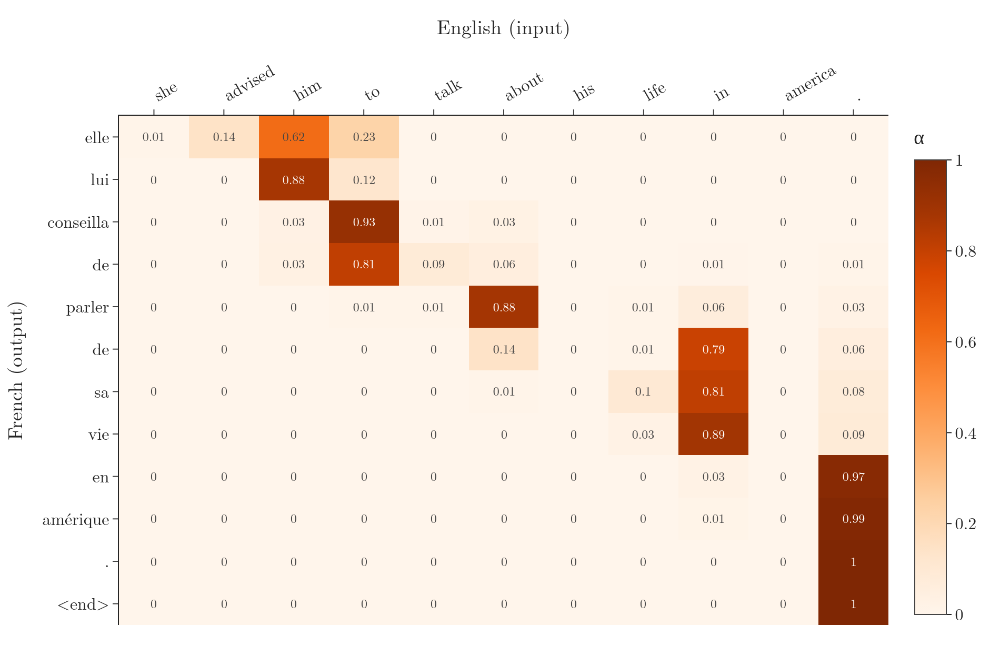
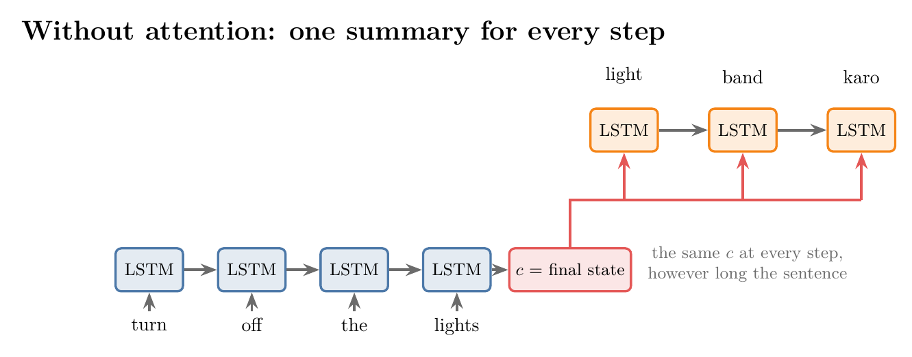
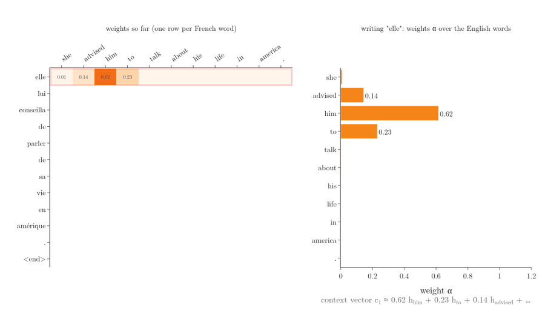
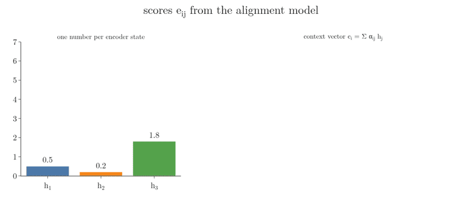

<!-- where-this-fits: generated by course_map/build_map.py; edit concepts.yaml, not this block -->
> **Where this fits:** Pipeline map step 8 (Model). See the [Course map](../01-course-map/note.md).
>
> 
>
> - **Builds on:** Sequence-to-sequence (encoder-decoder) ([Note 1058](../1058-types-of-rnn/note.md)).
> - **Leads to:** Luong (multiplicative) attention ([Note 1070](../1070-bahdanau-vs-luong-attention/note.md)); Self-attention (query, key, value) ([Note 1072](../1072-what-is-self-attention/note.md)).
> - **Compare with:** Luong (multiplicative) attention ([Note 1070](../1070-bahdanau-vs-luong-attention/note.md)); Cross-attention ([Note 1082](../1082-cross-attention/note.md)).
<!-- /where-this-fits -->

## 1. Overview

> **Key point:** In the plain encoder–decoder, the decoder sees one fixed summary of the whole input. With **attention** (G-226), the decoder gets a fresh **context vector** $c_i$ at every step: a weighted sum of all the encoder's hidden states, $c_i = \sum_j \alpha_{ij} h_j$. A small neural network, trained with the rest, decides the weights $\alpha_{ij}$, so each output word can focus on the input words it needs.

The [encoder–decoder Note](../1068-encoder-decoder/note.md) built a translator from two LSTMs joined by a single context vector. This Note explains why that single vector fails on long sentences, and how Bahdanau, Cho and Bengio (2015) fixed it. The fix, attention, is also the central idea of the transformer.

{width=95%}

## 2. Prerequisites

- [Encoder–decoder Note](../1068-encoder-decoder/note.md): encoder, context vector, decoder, teacher forcing, greedy decoding.
- [the LSTM Note](../1061-lstm/note.md): hidden states $h_t$ and how an LSTM reads a sequence.
- [Softmax regression Note](../79-softmax-regression/note.md): softmax turns scores into probabilities.
- [MLP intuition Note](../1009-mlp-intuition/note.md): a small feed-forward network with a hidden layer.

## 3. The problem with one context vector

> **Key point:** Two problems. The encoder must squeeze a whole sentence into one fixed vector, which fails for long sentences. And the decoder gets the same vector at every step, although each output word needs only a few input words.

### 3.1 The encoder side: too much in one vector

> **Key point:** However long the sentence, its summary has the same fixed size.

Read a sentence of 50 words once, close your eyes, and translate it. Few people can: the sentence is too long to hold in memory at once. The plain encoder–decoder is asked to do exactly this. The encoder reads the whole input and must pack it into one vector of fixed size, and the decoder must translate from that vector alone. A single lost word can flip the meaning. In "Don't eat the delicious looking and smelling pizza", an encoder that has forgotten the first word by the end of the sentence hands the decoder the opposite instruction: eat the pizza. For a short sentence the vector is enough; for a long one it is a **bottleneck** (G-326), and information from the start of the sentence is the most likely to be lost (SLP3 §14.8). Measurements show the effect: in Bahdanau et al. (2015, Figure 2) the translation quality of the plain encoder–decoder "dramatically drops as the length of the sentences increases" (see also the [history of LLMs Note](../1067-history-of-llms/note.md), section 4).

### 3.2 The decoder side: the same summary at every step

> **Key point:** Each output word depends on a few input words, but the decoder always receives the whole sentence as one static summary.

Translate "turn off the lights" into Hindi, "light band karo". To write "light", only "lights" is needed. To write "band" (off), only "turn off" is needed. At no step does the decoder need the whole sentence; it needs a particular word or group of words. Yet the plain decoder receives the same context vector at every step and must work out by itself which part of it matters now. The representation is **static** (Figure 2). A better design would let the decoder look at the useful part of the input at each step.

{width=95%}

## 4. The idea: look back at the input while writing

> **Key point:** Keep all the encoder's hidden states, and at each decoder step give the decoder a weighted mix of them, with high weights on the input words that matter for the word being written.

People translate a long text piece by piece. While reading, our eyes and mind keep a small region of focus: the words around the current position are sharp, the rest is blurry, and the focus moves along as we go. Attention brings this into the network. When the decoder writes "light", it should be told that encoder step 4 ("lights") matters most; when it writes "band", that steps 1 and 2 ("turn off") matter most. This information must be computed anew at every decoder step. Figure 3 draws the idea next to Figure 2: each decoder step now has its own context vector, mixed from all four encoder states.

{width=95%}

## 5. The context vector at each step

> **Key point:** $c_i = \sum_j \alpha_{ij} h_j$. The weights are non-negative and sum to 1; $c_i$ has the same size as each $h_j$.

### 5.1 Notation

> **Key point:** $h_j$: encoder hidden states. $s_i$: decoder hidden states. $y_i$: decoder outputs. $c_i$: context vector for decoder step $i$.

Following Bahdanau et al. (2015):

- $h_1, \dots, h_n$ are the encoder's hidden states, one per input word ($n$ words). Each is a vector.
- $s_0, s_1, \dots$ are the decoder's hidden states.
- $y_{i-1}$ is the decoder's input at step $i$: the previous word (the gold word under teacher forcing).
- $c_i$ is the new **context vector** (G-461) for decoder step $i$.

Without attention, decoder step $i$ uses two inputs: $y_{i-1}$ and $s_{i-1}$. With attention it uses three: $y_{i-1}$, $s_{i-1}$ and $c_i$ (Bahdanau et al. 2015, section 3.1: $s_i = f(s_{i-1}, y_{i-1}, c_i)$).

### 5.2 What $c_i$ is

> **Key point:** A vector of the same size as $h_j$: the weighted sum of all encoder states.

$c_i$ has to carry the useful encoder states into decoder step $i$. Sometimes one state is useful, sometimes several. A sum of several states would change the size, unless we add them up: the weighted sum of all states has the same size as a single state, and the weights decide how much each state counts.

1. **In words:** give each encoder state a weight, then add the states up, each multiplied by its weight.
2. **Formula:**
   $$c_i = \sum_{j=1}^{n} \alpha_{ij}\thinspace h_j, \qquad \alpha_{ij} \ge 0, \qquad \sum_{j=1}^{n} \alpha_{ij} = 1$$
3. **Example:** three encoder states of size 4 and the weights $\alpha_{i1} = 0.185$, $\alpha_{i2} = 0.137$, $\alpha_{i3} = 0.678$ (section 6.2 shows where they come from):
   $$c_i = 0.185\thinspace[1.0, 0.5, 0.6, 0.3] + 0.137\thinspace[0.2, 0.9, 0.1, 0.4] + 0.678\thinspace[0.7, 0.1, 0.8, 0.5] = [0.687, 0.284, 0.667, 0.449]$$
   The result is dominated by $h_3$, the state with the largest weight.

Every decoder step has its own weights. With $n$ input words and $m$ output words there are $m \times n$ weights per sentence pair: $4 \times 4 = 16$ for "turn off the lights" → "light band karo `<end>`". The weight $\alpha_{21}$, for example, says how much "turn" ($h_1$) counts when the decoder writes its second word, "band". The weights $\alpha_{ij}$ are the **attention weights** (G-225). They are also called **alignment scores** (G-190): they say which input word each output word lines up with.

{height=60%}

Figure 4 shows the weights being used, one decoder step per frame, in the trained model of section 7 on a real test sentence. Watch the right panel: each French word gets its own weights, so its own context vector, and the large weight moves along the English sentence as the translation goes on.

## 6. Computing the weights

> **Key point:** $\alpha_{ij}$ depends on the encoder state $h_j$ and on the decoder's previous state $s_{i-1}$. A small feed-forward network scores each pair, and softmax turns the scores into weights.

### 6.1 What the weight depends on

> **Key point:** On $h_j$, the input word being judged, and on $s_{i-1}$, everything the decoder has written so far.

$\alpha_{21}$ measures how useful "turn" is for writing the second output word, so it must depend on $h_1$. $\alpha_{21}$ must also depend on the decoder's state before the step, $s_1$. The question is not only "which input word matches the next output word?", but "given everything translated so far, which input word is needed next?". What has been translated so far is stored in the decoder's previous state. So, in general,

$$e_{ij} = a(s_{i-1}, h_j)$$

where $e_{ij}$ is a raw score and $a$ is some function (Bahdanau et al. 2015, eq. 6).

### 6.2 Let a neural network find the function

> **Key point:** Instead of choosing a formula for $a$, use a small **feed-forward network** (G-775), the **alignment model** (G-189), and train it together with the encoder and decoder.

Which mathematical function should $a$ be? We could try many and keep the best. Bahdanau et al. took another route: a feed-forward neural network can approximate a very wide range of functions, so they let a small network be $a$ and trained it jointly with everything else (Bahdanau et al. 2015, section 3.1). The network takes $s_{i-1}$ and $h_j$ as inputs and outputs one number, $e_{ij}$. Its weights are learned by the same backpropagation that trains the two LSTMs.

The raw scores can be any real numbers. A **softmax** (G-1830) over the input positions turns them into weights that are positive and sum to 1:

1. **In words:** exponentiate each score and divide by the sum of all exponentials for that decoder step.
2. **Formula:**
   $$\alpha_{ij} = \frac{\exp(e_{ij})}{\sum_{k=1}^{n} \exp(e_{ik})}$$
3. **Example:** scores $e = (0.5, 0.2, 1.8)$ give $\exp(e) = (1.65, 1.22, 6.05)$ with sum $8.92$, so
   $$\alpha = (0.185, 0.137, 0.678)$$
   The Notebook gets the same numbers. The largest score takes most of the weight. Figure 5 runs this example and then section 5.2's weighted sum, one operation per frame.

   

The full step, for decoder step 2 of "turn off the lights" (Figure 6):

1. Feed $(s_1, h_1)$, $(s_1, h_2)$, $(s_1, h_3)$, $(s_1, h_4)$ through the alignment model: scores $e_{21}, \dots, e_{24}$.
2. Softmax: weights $\alpha_{21}, \dots, \alpha_{24}$.
3. Weighted sum: $c_2 = \sum_j \alpha_{2j} h_j$.
4. The decoder LSTM takes $c_2$, $s_1$ and $y_1$ ("light"), outputs "band" and the new state $s_2$.
5. Repeat for step 3, with $s_2$ in place of $s_1$.

{width=100%}

> **Python:** One decoder step with attention, from the Notebook's model. `hs`: all encoder states, shape (batch, $n$, 256); `h, c`: the decoder's previous states; `Uh = U(hs)` is computed once per sentence.
>
> ```python
> e = tf.squeeze(v(tf.tanh(W(h)[:, None, :] + Uh)), -1)   # scores e_ij, (batch, n)
> a = tf.nn.softmax(e - 1e9 * pad, axis=-1)                # weights; padding gets 0
> ctx = tf.reduce_sum(a[:, :, None] * hs, axis=1)          # context vector c_i
> o, (h, c) = cell(tf.concat([emb_d(word), ctx], -1), [h, c])
> logits = out(tf.concat([o, ctx], -1))                    # next-word scores
> ```

The exact form of the alignment model, Bahdanau's additive score, and the alternative proposed by Luong et al. (2015) are the subject of the [Bahdanau vs Luong attention Note](../1070-bahdanau-vs-luong-attention/note.md).

> **Extra:** Bahdanau et al. (2015, section 3.1) read $\alpha_{ij}$ as a probability: the probability that output word $i$ is aligned to, or translated from, input word $j$. The context vector $c_i$ is then the expected encoder state under that distribution. Because the weights are a smooth function of the scores, the whole model stays differentiable and is trained with ordinary backpropagation.

## 7. Attention against no attention, by sentence length

> **Key point:** On the same data, attention raised the test BLEU from 9.8 to 25.7. Without attention, the score on 14–16-word sentences was 41% of the score on 1–4-word sentences; with attention it was 53%, and the advantage of attention grew with sentence length.

The Notebook trains two encoder–decoders on the same 60,000 English–French pairs (the corpus of the [encoder–decoder Note](../1068-encoder-decoder/note.md)), now with English sentences of up to 16 words. Long sentences are rare in the corpus, so every pair with 9 or more English words is kept (39,070 of the 60,000). Both models have the same encoder, a bidirectional LSTM like Bahdanau et al.'s (section 9), and the same decoder LSTM of 256 units; the only difference is attention. Each is trained 3 times for 12 epochs with teacher forcing. The test set has 200 unseen English sentences in each length group, and the score is the BLEU of greedy translations (the [encoder–decoder Note](../1068-encoder-decoder/note.md), section 6).

{width=95%}

| English words | 1–4 | 5–7 | 8–10 | 11–13 | 14–16 | all |
|---|---|---|---|---|---|---|
| Without attention | 14.3 | 13.9 | 13.7 | 8.3 | 5.9 | 9.8 |
| With attention | 33.3 | 30.4 | 35.9 | 24.3 | 17.5 | 25.7 |
| Ratio (with / without) | 2.3 | 2.2 | 2.6 | 2.9 | 3.0 | 2.6 |

Three things stand out:

1. **Attention helps at every length.** Even on 1–4-word sentences, the decoder does better when it can look at each source word directly than when it works from one summary.
2. **Without attention, quality falls with length.** From 14.3 on the shortest sentences, BLEU falls to 5.9 on the longest: the fixed-size context vector must hold more and more.
3. **The advantage of attention grows with length.** The ratio rises from 2.3 to 3.0: the longer the sentence, the more it matters that no word has to pass through one fixed vector.

The attention model still loses quality on the longest sentences, unlike the model of Bahdanau et al. (2015, Figure 2), which showed "no performance deterioration even with sentences of length 50 or more". Their model had 1,000 hidden units and was trained on 348 million words; ours has 256 units and 60,000 sentence pairs, in a corpus where long sentences are rare.

Attention has a cost in parameters and time. The attention model has 8.4 million parameters against 5.5 million; most of the difference is the output layer, which reads $c_i$ as well as $s_i$, while the alignment network itself has only 65,792. Training took about twice as long, because the decoder must compute $n$ scores at each of its steps.

## 8. Seeing the alignment

> **Key point:** The weights can be drawn as a grid, the **alignment grid** (G-188), output words against input words. In a trained model they form a band from top left to bottom right: the decoder moves through the input as it writes the output.

Each row of the weight grid is one decoder step and sums to 1; each column is one input word. Bahdanau et al. (2015, section 5.2.1 and Figure 3) drew such grids and found that the weights line up English and French words in a sensible way. Figure 1 shows the grid of the Notebook's attention model for a test sentence it translated exactly:

- "she advised him to talk about his life in america ." → "elle lui conseilla de parler de sa vie en amérique ."

The weights form a clear diagonal band: as the decoder writes the French sentence from left to right, its attention moves through the English sentence from left to right, with each step concentrated on one or two words (0.88 or more in most rows). The band sits on the matching word or one to two words to its right: writing "parler" (talk), the model looks mostly at the state of "about"; writing "vie" (life), at the state of "in". Attention weights are not a word alignment: each $h_j$ comes from a bidirectional RNN and is informed by the whole sentence (section 9), and Koehn and Knowles (2017, §3.5) report the same off-by-one-position attention in a trained system of this type whose translations were still of high quality. Here too the translation is exact, because the forward half of the state of "about" has already read "talk". All 12 × 11 = 132 weights of this pair are recomputed for every sentence; nothing in the grid is fixed in advance.

## 9. Notes on the original model

> **Key point:** Bahdanau et al. used a bidirectional encoder, so each $h_j$ also knows the words after position $j$. The attention part is unchanged.

Two details of Bahdanau et al. (2015) differ from the simple picture above:

- **A bidirectional encoder** (G-291; Bahdanau et al. 2015, section 3.2; see the [bidirectional RNN Note](../1066-bidirectional-rnn/note.md)). One RNN reads the sentence forwards and a second reads it backwards; $h_j$ joins the two states at position $j$. Each $h_j$ then summarises the words before and after word $j$, with a focus on the words around it. Attention itself is computed exactly as above. Figure 8 shows the layout.
- **A gated unit, not an LSTM** (appendix A.1.1). Their encoder and decoder use the gated hidden unit of Cho et al. (2014), the unit now called the **GRU** (G-826), which the paper describes as similar to an LSTM unit and, like it, able to learn long-term dependencies.

{width=95%}

The model was trained on English–French translation, with a vocabulary of the 30,000 most frequent words in each language and 1,000 hidden units in each direction of the encoder and in the decoder (section 4.2).

## 10. Summary

| | Plain encoder–decoder | With attention |
|---|---|---|
| What the decoder sees | one context vector, the same at every step | a new context vector $c_i$ at every step |
| Context vector | encoder's final state | $c_i = \sum_j \alpha_{ij} h_j$ over all encoder states |
| Inputs of decoder step $i$ | $y_{i-1}$, $s_{i-1}$ | $y_{i-1}$, $s_{i-1}$, $c_i$ |
| Extra cost | none | $m \times n$ weights per sentence pair |
| Test BLEU in the Notebook | 9.8 | 25.7 |

- One fixed context vector is a bottleneck for long sentences, and it is the same at every decoder step.
- Attention keeps all encoder hidden states and gives each decoder step its own weighted sum of them.
- The weights come from scores $e_{ij} = a(s_{i-1}, h_j)$, made positive and summing to 1 by a softmax.
- The scoring function $a$ is a small feed-forward network, the alignment model, trained with the rest.
- The weights can be plotted as an alignment grid between output and input words.

## 11. Sources

**Built from**

- CampusX, "Attention Mechanism in 1 video | Seq2Seq Networks | Encoder Decoder Architecture", YouTube, https://www.youtube.com/watch?v=rj5V6q6-XUM
- StatQuest with Josh Starmer, "Attention for Neural Networks, Clearly Explained!!!", YouTube, https://www.youtube.com/watch?v=PSs6nxngL6k. 01:00–03:00 (the "Don't eat the delicious looking and smelling pizza" example: forgetting the first word flips the meaning).

**Other references**

- Bahdanau, D., Cho, K. and Bengio, Y. (2015). Neural Machine Translation by Jointly Learning to Align and Translate. *ICLR 2015*. arXiv:1409.0473. Section 3.1 (decoder, eq. 4–6, the alignment model, the probabilistic reading of $\alpha_{ij}$); 3.2 (bidirectional encoder); 4.2 (models: 30,000-word vocabularies, 1,000 hidden units); 5.1 and Figure 2 (BLEU against sentence length); 5.2.1 and Figure 3 (alignments); appendix A.1.1 (gated hidden unit).
- Jurafsky, D. and Martin, J. H. *Speech and Language Processing*, 3rd ed. draft (19 August 2026), web.stanford.edu/~jurafsky/slp3. Chapter 14, §14.8 (attention; the final hidden state as a bottleneck). Cited as SLP3.
- Koehn, P. and Knowles, R. (2017). Six Challenges for Neural Machine Translation. arXiv:1706.03872. Section 2 (Nematus, an attention-based encoder–decoder after Bahdanau et al.); section 3.5 and Figure 9 (attention off by one position).
- Papineni, K., Roukos, S., Ward, T. and Zhu, W.-J. (2002). BLEU: a Method for Automatic Evaluation of Machine Translation. *Proceedings of the 40th Annual Meeting of the ACL*, Philadelphia, 311–318. Section 2.3 (definition).
- Tatoeba project and manythings.org/anki: the English–French sentence pairs, distributed as `fra-eng.zip` with the Keras examples.

## 12. Key terms

| Term | Meaning |
|---|---|
| Attention | A mechanism that gives each decoder step a weighted mix of all encoder states, with weights computed for that step |
| Context vector $c_i$ | The weighted sum of the encoder's hidden states used at decoder step $i$ |
| Attention weight $\alpha_{ij}$ | How much encoder state $j$ counts at decoder step $i$; the weights of one step are non-negative and sum to 1 |
| Alignment score $e_{ij}$ | The raw score of encoder state $j$ for decoder step $i$, before the softmax |
| Alignment model | The small feed-forward network that computes $e_{ij}$ from $s_{i-1}$ and $h_j$ |
| Bottleneck | A single fixed-size vector through which all information about the input must pass |
| Bidirectional encoder | An encoder with one RNN reading forwards and one backwards, whose states are joined at each position |
| Alignment grid | A plot of all $\alpha_{ij}$ of a sentence pair, output words against input words |
