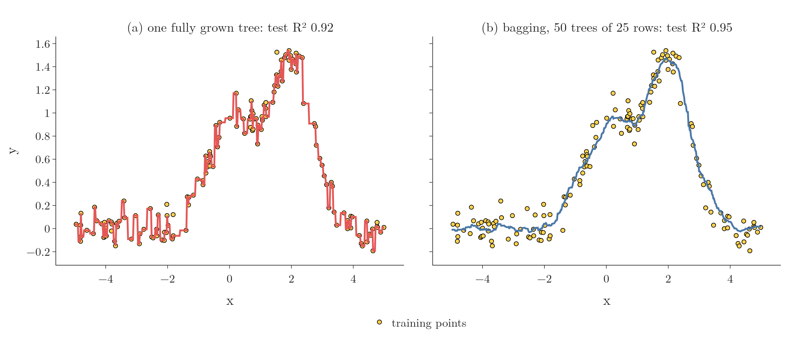

<!-- where-this-fits: generated by course_map/build_map.py; edit concepts.yaml, not this block -->
> **Where this fits:** Pipeline map steps 8 (Model), 9 (Evaluate), 10 (Tune). See the [Course map](../01-course-map/note.md).
>
> 
>
> - **Builds on:** Simple imputation (mean, median, mode, constant) ([Note 37](../37-missing-categorical-data/note.md)); ML pipelines ([Note 38](../38-missing-indicator-random-sample/note.md)); Bias-variance trade-off ([Note 62](../62-bias-variance/note.md)); Overfitting ([Note 91](../91-knn/note.md)); Hyperparameter tuning ([Note 98](../98-decision-tree-hyperparameters/note.md)); Decision trees ([Note 100](../100-dtreeviz/note.md)).
> - **Leads to:** Random forest ([Note 108](../108-random-forest-intro/note.md)).
> - **Compare with:** Boosting ([Note 101](../101-ensemble-learning/note.md)); Voting ensembles ([Note 104](../104-voting-regressor/note.md)); Cross-validation ([Note 104](../104-voting-regressor/note.md)); Random forest ([Note 108](../108-random-forest-intro/note.md)); Optuna ([Note 134](../134-optuna/note.md)); Bayesian optimisation ([Note 134](../134-optuna/note.md)).
<!-- /where-this-fits -->

## 1. Overview

> **Key point:** A bagging regressor works exactly like a bagging classifier, except that aggregation takes the mean of the base models' numbers instead of a majority vote.

The bagging regressor applies **bagging** (G-251) (the [bagging Note](../105-bagging-intuition/note.md)) to regression. Everything carries over from the [bagging classifier Note](../106-bagging-classifier/note.md): the four sampling types and every hyperparameter. This Note covers:

- the one difference, in the aggregation step;
- a demo with curves: one tree against a bagged ensemble;
- `BaggingRegressor` on the Boston housing data, tuned with `GridSearchCV`.

The Notebook (`notebook.ipynb`) runs every experiment. The Dash app `app.py` lets us change the base model and the bagging settings and redraws both curves.

## 2. The core idea

> **Key point:** Bootstrapping is unchanged; aggregation averages the predictions.

In the **bootstrapping** step, each **base model** (G-260), one of the models being combined, is trained on its own **bootstrap sample** (G-319): observations drawn at random with replacement, as in the classifier. The other sampling types carry over too, so pasting, random subspaces and random patches are all available too.

In the **aggregation** (G-183) step, each base model returns a number, since this is regression. The bagging regressor returns their **mean**. Taking the mean is the only change.

{height=30%}

Figure 1 shows the aggregation step on the 50 trees of section 3. Watch how far apart the single trees land at x = -1 (from about 0.0 to 0.9), while the mean sits in the middle of the cloud: no tree is trusted on its own.

scikit-learn's `BaggingRegressor` has exactly the same hyperparameters as `BaggingClassifier` (the [bagging classifier Note](../106-bagging-classifier/note.md), section 6): `estimator`, `n_estimators`, `max_samples`, `max_features`, `bootstrap`, `bootstrap_features` and `oob_score`.

## 3. Seeing it on a curve

> **Key point:** One fully grown tree passes through every training point (test R² 0.92); 50 bagged trees give a smooth curve that follows the pattern (0.95).

The demo data has one **feature** (input variable, one column of the data table). Its **target** (the output we predict) is two Gaussian bumps (a small one at 0 and a larger one at 2) plus a little noise, with 150 training **observations** (points, one row of the table each) and 100 test points. With a single feature there are no features to sample, so the app only offers observation settings: the base model (decision tree, SVR or KNN), `n_estimators`, `max_samples` and `bootstrap`.

{height=40%}

Figure 2 compares a single decision tree with bagging (50 trees, 25 observations each, with replacement):

- **(a) The single regression tree** (G-1654) tries to pass through every training point, outliers included. Such a model is **low bias, high variance** (G-1132): it can follow any pattern, but its prediction swings with the particular training points. Fitting the noise in this way is **overfitting** (G-1429). Test $R^2$: **0.92** (the **R² score** (G-1717): the share of the target's variation the model explains; 1 is perfect).
- **(b) The bagging regressor** gives a smooth curve. The curve does not touch every point; it follows the underlying pattern. Test $R^2$: **0.95**.

Why the mean is smoother, step by step:

1. A regression tree predicts one constant value per leaf, so its prediction is a **step function** (G-1889): flat inside each leaf, with a jump at every split.
2. Each bagged tree saw a different bootstrap sample, so it puts its jumps at different values of x (Figure 3, grey trees).
3. The mean of 50 step functions with jumps in different places has many small steps instead of a few large ones, which looks like a smooth curve.

In the terms of the bias-variance trade-off (G-288), each tree keeps its low bias, and averaging removes much of its **variance** (G-2078), the swing of its prediction from one training sample to another (Breiman, 1996, section 1).

Figure 3 builds the bagging regressor of Figure 2b one tree at a time. Each new tree (green) sees only its 25 drawn points, so its steps fall in different places from the trees before it (grey). Watch the blue mean: wherever the trees disagree, their steps cancel out, and the mean turns from one tree's jagged staircase (test $R^2$ 0.77) into a smooth curve (0.95 with 50 trees).

{height=55%}

Changing the settings makes little difference on this easy data: 100 trees score 0.952, and pasting (75 observations, `bootstrap=False`) scores 0.947.

> **Extra:** Bagging helps unstable models, whose fit swings with small changes in the data, such as trees; it can slightly hurt stable ones, such as nearest-neighbour methods (Breiman, 1996, sections 1 and 6.3; the [bagging classifier Note](../106-bagging-classifier/note.md), section 2.2). The bumps data agrees: bagged KNN (0.832) and bagged SVR (0.871) both do worse than a single KNN (0.954) or SVR (0.894).

## 4. BaggingRegressor on the Boston housing data

> **Key point:** Out of the box, bagged trees (mean test R² 0.84) beat linear regression (0.71), a single tree (0.72) and KNN (0.50).

### 4.1 Three single regressors

> **Key point:** Averaged over 100 random splits: linear regression 0.71, decision tree 0.72, KNN 0.50.

The Boston housing data (the [regression trees Note](../99-regression-trees/note.md), section 7.1) has 506 districts (observations), 13 features and the median house price as the target. We split it into 404 training observations and 102 test observations, and train three single regressors.

A test set of 102 observations is small, so one split gives a noisy score: on our first split, for example, the single tree scores only 0.38. So the Notebook repeats the split 100 times, with a different random shuffle each time, and every number in this section is the mean over those 100 splits:

| Model | Linear regression | Decision tree | KNN |
|---|---|---|---|
| Mean test $R^2$ | 0.708 | 0.716 | 0.504 |

{height=36%}

Figure 4 shows all 100 scores per model, including the two bagging regressors of sections 4.2 and 4.3. Watch the single tree's spread: from about 0.0 to 0.86 depending on the split, while both bagging boxes sit higher and tighter.

### 4.2 A bagging regressor with default settings

> **Key point:** Ten bagged trees, nothing tuned: mean test R² 0.84, above every single model.

> **Python:** A bagging regressor with every setting at its default.
>
> ```python
> from sklearn.ensemble import BaggingRegressor
>
> bag = BaggingRegressor(random_state=1)
> bag.fit(X_train, y_train)
> bag.score(X_train, y_train)    # 0.980 (first split)
> bag.score(X_test, y_test)      # 0.828 (first split)
> ```
>
> The defaults: `estimator=None` (a decision tree), `n_estimators=10`, as many observations per model as the training set (`max_samples=None`), drawn with replacement, and every feature. `score` returns $R^2$ for a regressor.

Without tuning anything, the bagging regressor scores a mean test $R^2$ of **0.841** over the 100 splits (Figure 4, blue), well above all three single models (0.708, 0.716 and 0.504). The ten trees are each as unstable as the single tree, but their average is far steadier. On the first split, the gap between training (0.98) and test (0.83) shows some overfitting remains.

### 4.3 Tuning with GridSearchCV

> **Key point:** A grid search over 144 combinations picks 50 bagged trees on full bootstrap samples; over the 100 splits these settings score 0.857, above the default's 0.841.

Instead of trying **pasting** (G-1463), **random subspaces** (G-1618) and **random patches** (G-1614) by hand, we let `GridSearchCV`, a **grid search** (G-872), try them all (the [KNN Note](../91-knn/note.md), section 4.2):

> **Python:** Searching over the base model and the sampling settings.
>
> ```python
> params = {
>     "estimator": [None, LinearRegression(),
>                   KNeighborsRegressor()],
>     "n_estimators": [20, 50, 100],
>     "max_samples": [0.5, 1.0],
>     "max_features": [0.5, 1.0],
>     "bootstrap": [True, False],
>     "bootstrap_features": [True, False]}
> grid = GridSearchCV(BaggingRegressor(random_state=1),
>                     param_grid=params, cv=3,
>                     n_jobs=-1, verbose=1)
> grid.fit(X_train, y_train)
> grid.best_params_
> ```
>
> The base model itself is a hyperparameter here: `None` stands for the default decision tree. With `bootstrap` and `bootstrap_features` both tried as `True` and `False`, the search covers bagging, pasting, random subspaces and random patches.

The grid holds $3 \times 3 \times 2 \times 2 \times 2 \times 2 = 144$ combinations, each with 3-fold **cross-validation** (G-510; the training data is cut into 3 parts, and each part is scored once by a model trained on the other two): 432 fits, under a minute with `n_jobs=-1`. The best settings:

- base model: **decision tree**;
- `bootstrap=True`: **bagging**, not pasting;
- `bootstrap_features=False`, `max_features=1.0`: **no feature sampling**;
- `max_samples=1.0`: every model gets as many observations as the training set;
- `n_estimators=50`.

Their cross-validation $R^2$ is **0.871**. On the same 100 splits as above, these settings score a mean test $R^2$ of **0.857** (Figure 4, green), close to the cross-validation estimate and above the default bagging regressor (0.841); they beat the default on 79 of the 100 splits.

| Model | Linear regression | Decision tree | KNN | Bagging, default | Bagging, tuned |
|---|---|---|---|---|---|
| Mean test $R^2$ (100 splits) | 0.708 | 0.716 | 0.504 | 0.841 | **0.857** |

> **Extra:** One split can mislead. On the first split alone, the tuned model scores 0.806 and the default 0.828, the opposite order. Over the 100 splits, the tuned settings score anywhere from 0.63 to 0.94, so one 102-observation test score can land far from the average. The search picks settings that do best on average, which is what the mean over many splits measures. Expecting one test score to match `best_score_` exactly is a common mistake.

### 4.4 The out-of-bag score

> **Key point:** With `oob_score=True`, the regressor reports R² on the out-of-bag observations: 0.870 here.

The **out-of-bag score** (G-1411) works for regression too (the [bagging classifier Note](../106-bagging-classifier/note.md), section 4). For a regressor, `oob_score_` is the $R^2$ on the observations each model never saw. With 50 trees on the first split, the OOB $R^2$ is **0.870**, close to the cross-validation score.

## 5. Summary

| | Bagging classifier | Bagging regressor |
|---|---|---|
| Base models | classifiers | regressors |
| Aggregation | majority vote | mean |
| scikit-learn | `BaggingClassifier` | `BaggingRegressor` |
| `score` and `oob_score_` | accuracy | $R^2$ |
| Hyperparameters | `estimator`, `n_estimators`, `max_samples`, `max_features`, `bootstrap`, `bootstrap_features`, `oob_score` | the same |

- Only aggregation changes for regression: the mean replaces the vote.
- On the bumps data, bagging smooths one overfitting tree into a curve that follows the pattern: test $R^2$ 0.92 to 0.95.
- On Boston (mean over 100 splits), default bagged trees score 0.84 against 0.72 for the best single model; a grid search picks plain bagging of 50 trees, which scores 0.86.
- Bagging helps unstable models such as trees; bagged KNN and SVR do worse than single ones.

## 6. Sources

**Built from**

- CampusX, "Bagging Ensemble | Part 3 | Bagging Regressor", YouTube, https://www.youtube.com/watch?v=HYVzrETXbkE

**Other references**

- Breiman, L. (1996). "Bagging Predictors". *Machine Learning* 24(2), 123–140, sections 1 and 6.3.

## 7. Key terms

| Term | Meaning |
|---|---|
| Observation | One record of the data: one row of the data table |
| Feature | An input variable: one column of the data table |
| Target | The output we predict |
| Bagging regressor | A bagging ensemble of regressors that predicts the mean of their predictions |
| BaggingRegressor | scikit-learn class for bagging, pasting, random subspaces and random patches in regression |
