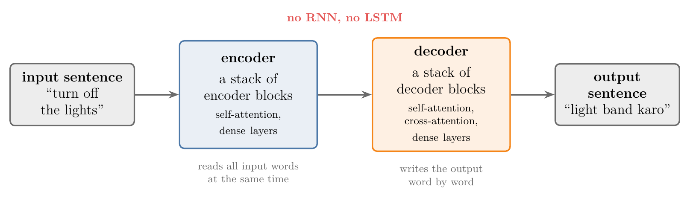
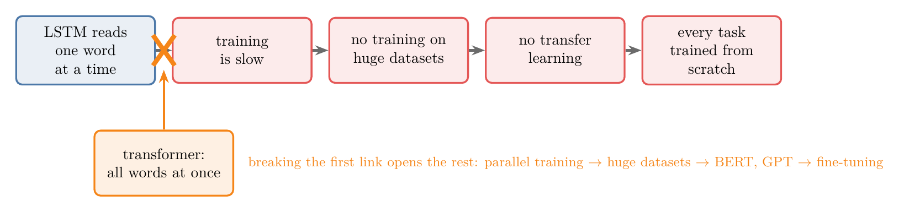
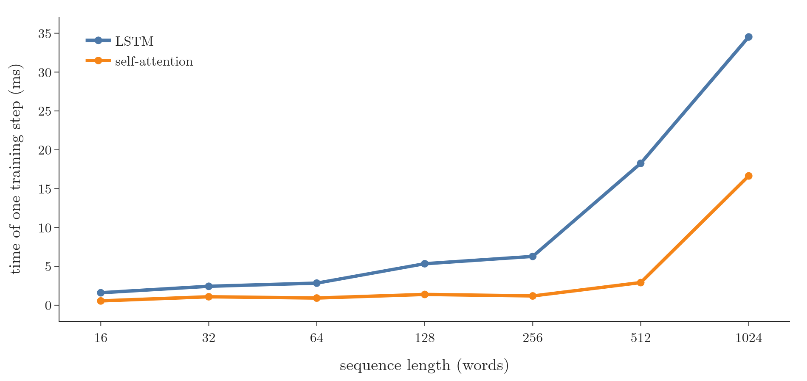
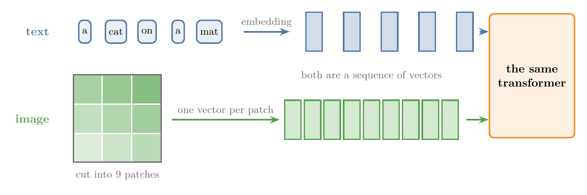
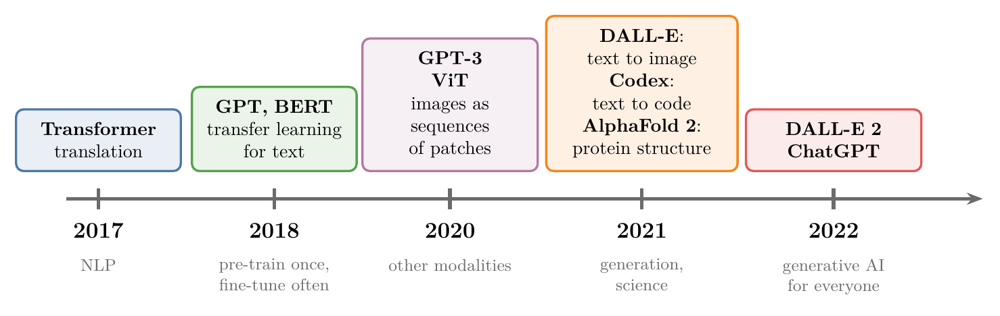
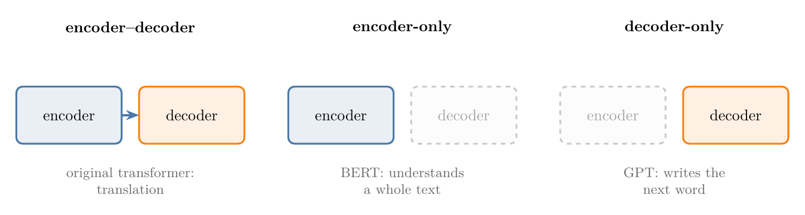
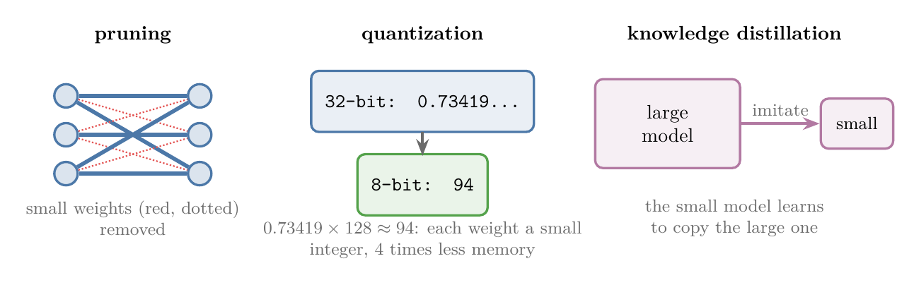

<!-- where-this-fits: generated by course_map/build_map.py; edit concepts.yaml, not this block -->
> **Where this fits:** Pipeline map step 8 (Model). See the [Course map](../01-course-map/note.md).
>
> 
>
> - **Builds on:** Sequence-to-sequence (encoder-decoder) ([Note 1068](../1068-encoder-decoder/note.md)).
> - **Leads to:** Decoder-only GPT ([Note 1087](../1087-decoder-only-gpt/note.md)).
> - **Compare with:** LSTM (long short-term memory) ([Note 1063](../1063-lstm-next-word-prediction/note.md)).
<!-- /where-this-fits -->

## 1. Overview

> **Key point:** A **transformer** (G-2007) is a neural network architecture for sequence-to-sequence tasks. Like earlier models it has an encoder and a decoder, but it contains no RNN or LSTM: it is built on a form of attention called **self-attention** (G-1764), so it processes all the words of a sentence at the same time. Parallel processing makes training fast, fast training makes huge datasets usable, and huge datasets made transfer learning possible for text.

The deep learning Notes so far have met three families of networks, each made for one kind of data: the ANN for tabular data, the CNN for images and the RNN for sequences such as text. The **transformer** is a fourth architecture, made for **sequence-to-sequence** (G-1772) tasks: a sequence goes in and a sequence comes out, as in machine translation, question answering and text summarisation (the [history of LLMs Note](../1067-history-of-llms/note.md), section 3).

Seen from far away, a transformer looks like the earlier sequence-to-sequence models (Figure 1). An **encoder** (G-682) reads the input sentence and a **decoder** (G-564) writes the output sentence. Inside, everything is different. There is no LSTM; the main building block is self-attention, and the encoder can take in all the words of a sentence at once (Vaswani et al. 2017, section 1).

{width=100%}

This Note is the overview. It covers:

- what a transformer is, with a tour of the whole model (section 3);
- why it was needed (section 4);
- a measurement of its main advantage (section 5);
- its impact (section 6) and its applications (section 7);
- its advantages and disadvantages (sections 8 and 9);
- where it is going (section 10).
 How it works inside is the subject of the Notes that follow, starting with the [self-attention Note](../1072-what-is-self-attention/note.md).

## 2. Prerequisites

- [History of large language models](../1067-history-of-llms/note.md): the encoder–decoder, attention, the transformer and transfer learning as stages of one story.
- [Why RNNs are needed](../1055-why-rnn/note.md): sequential data.
- [the LSTM Note](../1061-lstm/note.md): an RNN that reads a sequence one step at a time and keeps a memory.

## 3. What a transformer is

> **Key point:** A transformer is an encoder–decoder network for sequence-to-sequence tasks, built from self-attention and dense layers instead of RNNs.

The transformer was introduced in 2017 in the paper "Attention Is All You Need" by a team from Google Brain, Google Research and the University of Toronto (Vaswani et al. 2017). The paper built it for machine translation, English to German and English to French, and reached the best translation scores of the time (Vaswani et al. 2017, section 7).

Three facts describe a transformer at the level of Figure 1:

1. **Encoder and decoder.** Like the earlier sequence-to-sequence models, it has an encoder that reads the input and a decoder that produces the output.
2. **No recurrence.** The paper calls the transformer "the first sequence transduction model based entirely on attention, replacing the recurrent layers most commonly used in encoder-decoder architectures with multi-headed self-attention" (Vaswani et al. 2017, section 7).
3. **All words at once.** Because no RNN reads the words one by one, the encoder works on every word of the sentence at the same time. Training can therefore be spread over many processors.

Transformers did not stay in translation. Today ChatGPT, which is fine-tuned from a model in OpenAI's GPT-3.5 series (OpenAI 2022), is a transformer, and transformers are used for images, speech, code and science as well (section 6).

### 3.1 A tour of the whole model

> **Key point:** A sentence passes through a short chain of blocks in the encoder, and the decoder then writes the output one word at a time. Each block has one job, and each gets its own Note.

Before any block is explained in detail, Figure 2 follows the sentence "turn off the lights" through the whole model. Watch one block light up per frame; the line under the diagram says what the block does, and the tag beside it names the Note that teaches it.

{height=55%}

The stops of the tour, in order:

1. **Embedding.** Each word becomes a vector of numbers ([what is self-attention](../1072-what-is-self-attention/note.md)).
2. **Positional encoding** (G-1528). A second vector, added to the first, tells the model where the word sits in the sentence ([positional encoding](../1078-positional-encoding/note.md)).
3. **Self-attention.** Every word looks at every other word and takes in what is relevant to it. Several copies run side by side: **multi-head attention** (G-1268) (Notes [1072](../1072-what-is-self-attention/note.md) to [1077](../1077-multi-head-attention/note.md)).
4. **Add and norm.** The block's input is added back to its output, a **residual connection** (G-1681), and the numbers are rescaled by **layer normalisation** (G-1054) ([layer normalisation](../1079-layer-normalization/note.md), [the encoder](../1080-transformer-encoder/note.md)).
5. **Feed-forward network** (G-774). Two dense layers work on each word's vector separately ([the encoder](../1080-transformer-encoder/note.md)).
6. **Masked self-attention** (G-1172). The decoder starts from a start token and looks only at the words it has written so far ([masked self-attention](../1081-masked-self-attention/note.md)).
7. **Cross-attention** (G-507). The decoder looks at the encoder's output, so each output word can use the input sentence ([cross-attention](../1082-cross-attention/note.md)).
8. **Linear layer and softmax.** The decoder's top vector becomes one probability per word of the vocabulary, and the most likely word, "light", is written ([the decoder](../1083-transformer-decoder/note.md)).
9. **Repeat.** The new word goes back into the decoder, and the loop runs until an end token comes out ([inference](../1084-transformer-inference/note.md)).

The encoder's steps 3 to 5 form one block, and the block is repeated several times; the decoder is repeated in the same way. The [end-to-end Note](../1085-transformer-end-to-end/note.md) puts every part back together with all the numbers.

## 4. Why transformers were needed

> **Key point:** Attention fixed the encoder–decoder's memory problem, but the LSTMs inside still had to read one word at a time. Sequential training is slow, slow training rules out huge datasets, and without huge datasets there is no transfer learning, so every new task had to be trained from scratch.

The story has three papers, told in detail in the [history of LLMs Note](../1067-history-of-llms/note.md), sections 4 to 6. In one line each:

1. **Encoder–decoder (Sutskever et al. 2014).** An LSTM squeezes the whole input sentence into one context vector, and a second LSTM writes the output from it. Long sentences do not fit in one vector, and translation quality drops.
2. **Attention (Bahdanau et al. 2015).** The decoder gets a new context vector at every step, a weighted mix of all the encoder's states. Long sentences are translated well.
3. **The transformer (Vaswani et al. 2017).** Attention alone, with no LSTM.

Why was step 3 needed after step 2? Attention fixed translation quality, but not speed. The encoder and decoder were still LSTMs, and an LSTM must finish word 1 before it can start word 2. The paper names the problem: the "inherently sequential nature" of recurrent models "precludes parallelization within training examples" (Vaswani et al. 2017, section 1).

The consequences form a chain:

- Sequential training is **slow**.
- Slow training means a model cannot be trained on **huge datasets**, such as terabytes of text.
- Without training on huge datasets, there is nothing to transfer: **transfer learning** (G-2005) (pre-train once on a large dataset, then fine-tune on a small one; the [history of LLMs Note](../1067-history-of-llms/note.md), section 7) cannot start.
- Without transfer learning, every new task needs a model trained **from scratch**, which costs time, effort and a large labelled dataset, and labelled data costs money.

{width=100%}

The transformer broke the first link of the chain (Figure 3). With no recurrent part, it can be trained in parallel, so it scales to huge datasets, and models such as BERT and GPT could be pre-trained on them and then fine-tuned (the [history of LLMs Note](../1067-history-of-llms/note.md), section 8).

Besides self-attention, the transformer is built from parts that each get their own Note: multi-head attention, positional encoding, residual connections, layer normalisation, a feed-forward network, masked self-attention and cross-attention. The [transformer encoder Note](../1080-transformer-encoder/note.md) puts them together.

## 5. Parallel versus sequential, measured

> **Key point:** On a GPU, the time of an LSTM training step grows with the sequence length from the start, because the steps run one after another. A self-attention layer stays at about 1 millisecond up to 256 words. Beyond that its cost, which grows with the square of the length, takes over.

We can see the difference on a GPU. The Notebook times one training step, a forward pass and a backward pass, of two layers that map a sequence of 64-number vectors to a sequence of the same shape:

- an LSTM layer with 64 units;
- a self-attention layer (Keras' `MultiHeadAttention` with one head), the layer the next Notes build.

{height=55%}

Figure 4 shows the idea first: the LSTM needs 6 steps for 6 words, one after another, while self-attention handles all 6 words in one step. The measurement then puts numbers on it.

The batch has 16 sequences, and the length goes from 16 to 1024 words. Each time is the fastest of 15 calls, averaged over 3 sweeps, on an RTX 4060 laptop GPU.

{width=95%}

| Length | Sequential steps, LSTM | LSTM (ms) | Self-attention (ms) | LSTM / self-attention |
|---|---|---|---|---|
| 16 | 16 | 1.60 | 0.55 | 2.9 |
| 64 | 64 | 2.84 | 0.92 | 3.1 |
| 256 | 256 | 6.28 | 1.19 | 5.3 |
| 512 | 512 | 18.26 | 2.91 | 6.3 |
| 1024 | 1024 | 34.53 | 16.64 | 2.1 |

Two things show in Figure 5 and the table:

1. **The LSTM's time grows with the length.** From 16 to 256 words its time grows 3.9 times. An LSTM over $n$ words is $n$ steps that must run in order, so the GPU cannot do them together. Vaswani et al. (2017, Table 1) count this as $O(n)$ sequential operations for a recurrent layer against $O(1)$ for self-attention: a fixed number, whatever the length.
2. **Self-attention is flat, until the length gets large.** Up to 256 words its time stays near 1 millisecond, because all positions are computed together. But self-attention compares every word with every word: $n^2$ comparisons, 65,536 for 256 words and 1,048,576 for 1024. Vaswani et al. (2017, Table 1) give its work per layer as $O(n^2 \cdot d)$, against $O(n \cdot d^2)$ for a recurrent layer, so self-attention is cheaper only while $n$ is smaller than the vector size $d$ (section 4 of the paper). At 1024 words the GPU is full, and the time jumps.

The first point is the transformer's main advantage; the second is one of its disadvantages (section 9).

> **Python:** One timed training step. `layer(x, x)` is self-attention: the sequence attends to itself.
>
> ```python
> @tf.function
> def step(x):
>     with tf.GradientTape() as tape:
>         y = layer(x, x) if is_attention else layer(x)
>         loss = tf.reduce_sum(y)
>     return tape.gradient(loss, layer.trainable_variables)
> ```

## 6. The impact of transformers

> **Key point:** Transformers changed five things: the state of the art in NLP, who can build NLP applications (transfer learning), the kinds of data a model can handle (multimodal models), generative AI, and the number of architectures deep learning needs.

### 6.1 A revolution in NLP

> **Key point:** Methods for language moved from rules and counts, to statistical models, to embeddings and LSTMs; transformers now give the best results on most NLP tasks.

**Natural language processing** (G-1305) (NLP) is the field of making computers work with human language. It has gone through several generations of methods: hand-written rules and simple counts such as **bag of words** (G-250) and **n-grams** (G-1287); statistical models such as naive Bayes, hidden Markov models and SVMs; then early deep learning with word embeddings, RNNs and LSTMs. Transformers were born in NLP, and the transformer's first results were new best scores in translation and in parsing English sentences (Vaswani et al. 2017, sections 6 and 7). Products such as ChatGPT, and customer-service chatbots that are hard to tell from human agents, come from this progress.

### 6.2 AI for everyone: transfer learning

> **Key point:** Large transformers such as BERT and GPT were pre-trained once on huge datasets and released; anyone can fine-tune one on a small dataset of their own.

Before transformers, an NLP application was usually trained from scratch, which needs a lot of data, time and money, and the results were often still not good. Transformers can be trained efficiently on very large datasets, so large models were pre-trained once and made public. A small company, a startup or a single researcher can download one and fine-tune it on their own small dataset (the [history of LLMs Note](../1067-history-of-llms/note.md), sections 7 and 8). Libraries such as Hugging Face's `transformers` hold a hub of shared pre-trained models; downloading one for fine-tuning or prediction takes two lines of code (Wolf et al. 2020, §4).

### 6.3 Multimodal models

> **Key point:** If an image or a sound is turned into a sequence of vectors, a transformer can process it like text. Models that take or give several kinds of data are **multimodal** (G-1275).

A transformer works on a sequence of vectors. Text becomes such a sequence through embeddings, and researchers found ways to turn other kinds of data into sequences as well. The Vision Transformer (ViT) cuts an image into small square patches and feeds the sequence of patches to a standard transformer; it showed that "a pure transformer applied directly to sequences of image patches can perform very well on image classification tasks" (Dosovitskiy et al. 2021, abstract). The original paper had already planned this direction: "We plan to extend the Transformer to problems involving input and output modalities other than text" (Vaswani et al. 2017, section 7).

{width=100%}

In Figure 6, the transformer on the right never sees words or pixels, only a sequence of vectors; that is why the same architecture can take both.

A kind of data, such as text, images or audio, is a **modality** (G-1250). Today's applications mix them: a chatbot that answers questions about an uploaded photo, a tool that turns a text description into an image, or a tool that turns text into video.

### 6.4 Generative AI

> **Key point:** **Generative AI** (G-841) builds models that create new content: text, images, code, video. Transformers made text generation good enough for products, and the same ideas spread to images.

Generative models existed before, such as generative adversarial networks (GANs) for images, but few became products. Transformers changed text generation first, with ChatGPT. Image generation followed: DALL-E is a transformer that "autoregressively models the text and image tokens as a single stream of data" (Ramesh et al. 2021, abstract), meaning it produces the image one piece at a time after the text. Generative features now also appear in photo editors and phone cameras.

### 6.5 One architecture for many problems

> **Key point:** Deep learning used one architecture per kind of data. Transformers are now used across NLP, generative AI, computer vision, reinforcement learning and science.

The history of deep learning had one architecture per kind of problem: ANNs for tables, CNNs for images, RNNs for sequences, GANs for generating images. Transformers are now used in all of these areas, from translation to image recognition (ViT) to biology (AlphaFold 2, section 7). Deep learning is moving towards one architecture for many problems, even if a better architecture may one day replace the transformer.

## 7. Timeline and applications

> **Key point:** 2017: the transformer. 2018: BERT and GPT bring transfer learning to text. 2020–2021: transformers move to images, code and biology, and generation takes off. 2022: ChatGPT.

{width=100%}

Before 2017, NLP was dominated by RNNs, mostly LSTMs, with the encoder–decoder and attention arriving in 2014–2015 (the [history of LLMs Note](../1067-history-of-llms/note.md)). Figure 7 continues from there. Four well-known applications:

1. **ChatGPT** (OpenAI, November 2022): a chatbot that takes text and returns text: answers, poems, code. ChatGPT is fine-tuned from a model in the GPT-3.5 series, a **Generative Pre-trained Transformer** (OpenAI 2022).
2. **DALL-E 2** (OpenAI, 2022): an image generator driven by a text prompt, such as "an astronaut riding a horse in photorealistic style". It produces several images to choose from. DALL-E 2 builds on CLIP, a model trained to match images with their captions. A decoder-only transformer, the "prior", turns the caption into an image representation, and a diffusion model draws the final image from it (Ramesh et al. 2022, abstract and section 2.2).
3. **AlphaFold 2** (Google DeepMind, 2021): predicts the three-dimensional shape of a protein from its sequence of amino acids, a central problem of structural biology. Its main block, the Evoformer, contains "a number of attention-based and non-attention-based components" (Jumper et al. 2021).
4. **OpenAI Codex** (2021): "a GPT language model fine-tuned on publicly available code from GitHub" that turns natural language into code; "a distinct production version of Codex powers GitHub Copilot" (Chen et al. 2021, abstract).

Many more applications exist; Islam et al. (2023) survey them by field, from NLP and vision to audio, healthcare and the Internet of Things.

## 8. Advantages

> **Key point:** Scalable, transferable, multimodal, flexible, well supported, and easy to combine with other methods.

1. **Scalability.** With no LSTM, training runs in parallel, so it is fast and can use very large datasets (section 5).
2. **Transfer learning.** A transformer can be pre-trained on a huge unlabelled dataset, for example by predicting the next word, then fine-tuned for a specific task with little effort.
3. **Multimodal input and output.** With the right representation, images and speech can go into and come out of a transformer (section 6.3).
4. **Flexible architecture.** Parts can be dropped or rearranged: **encoder-only** (G-683) transformers such as BERT and **decoder-only** transformers such as GPT (the [history of LLMs Note](../1067-history-of-llms/note.md), section 8).
   Figure 8 shows the three layouts side by side.

   {width=100%}

5. **Ecosystem.** A large, active community and well-documented libraries: Hugging Face's `transformers` alone had over 400 outside contributors, documentation and tutorials in 2020 (Wolf et al. 2020, §1).
6. **Combines with other techniques.** A transformer can be one part of a larger system: with a diffusion model in image generators (section 7), with reinforcement learning in game-playing agents, or with CNNs in image captioning and visual search.

## 9. Disadvantages

> **Key point:** High computing cost, need for data, overfitting, energy use, little interpretability, and bias and ethical issues.

1. **High computational cost.** Parallel training needs GPUs, and GPUs are expensive. Self-attention's work also grows with the square of the sequence length: in section 5, its time jumped 14 times from 256 to 1024 words.
2. **Data.** Like any deep network, a transformer needs a lot of data. For language this is easier, because pre-training on text needs no labels. But in a narrow domain with little data, training one well is hard.
3. **Overfitting.** Transformers have many parameters, so with too little or too uniform data they overfit.
4. **Energy.** Training large transformers uses a lot of electricity: an estimated 1,287 megawatt-hours for GPT-3 (the [history of LLMs Note](../1067-history-of-llms/note.md), section 8), with environmental costs.
5. **Interpretability.** A transformer is mostly a black box: it is hard to say why it gave an answer. In banking or healthcare, where decisions must be explained, this is a real obstacle.
6. **Bias and ethics.** A model trained on biased data repeats the bias. Large models are trained on text taken from the internet, and companies have been taken to court over using others' data without permission.

## 10. The future

> **Key point:** Work is under way on smaller and cheaper models, more modalities, responsible development, domain-specific and multilingual models, and interpretability.

1. **Efficiency.** Making models smaller and cheaper while keeping their quality; the wide use of pre-trained transformers has created the need to compress them (Wolf et al. 2020, §1). Three techniques: **pruning** (G-1587), removing the connections whose weights are small and retraining the rest (Han et al. 2015, §3); **quantization** (G-1588), storing weights as 8-bit integers instead of 32-bit floats (Jacob et al. 2018, §1 and Figure 1); and **knowledge distillation**, training a small model to imitate a large one (Hinton et al. 2015, §1–2).
   Figure 9 draws the three techniques.

   {width=100%}

2. **More modalities.** Beyond text, images and speech: sensor data, biometric data such as fingerprints, and time series, possibly all in one model.
3. **Responsible development.** Reducing bias and answering the ethical concerns of section 9.
4. **Domain-specific models.** Transformers trained on the data of one field, such as medicine, law or teaching, which may serve that field better than a general chatbot.
5. **Multilingual models.** Most training text is English; models trained in other languages, including Indian languages such as Hindi, are being built.
6. **Interpretability.** Research into why a transformer gives a particular answer. A model that can explain itself could be used in banking and medicine.

## 11. Summary

| Question | Answer |
|---|---|
| What is a transformer? | An encoder–decoder neural network for sequence-to-sequence tasks, built on self-attention, with no RNN |
| Who introduced it, and when? | Vaswani et al., Google Brain and Google Research, "Attention Is All You Need", 2017 |
| What problem did it solve? | Sequential (one word at a time) training of LSTM-based models, which kept them slow and small |
| Main advantage | Parallel training, so it scales to huge datasets and makes transfer learning possible |
| Main cost | Self-attention compares every word with every word: $n^2$ work for $n$ words |

- Measured on a GPU: an LSTM step grows with the length from the start; a self-attention step stays near 1 ms up to 256 words, then the $n^2$ cost appears.
- Impact: new best results in NLP, AI open to small teams through transfer learning, multimodal models, generative AI, one architecture across deep learning.
- Applications: ChatGPT, DALL-E 2, AlphaFold 2, Codex and GitHub Copilot.
- Disadvantages: computing cost, data, overfitting, energy, interpretability, bias.

## 12. Sources

**Built from**

- CampusX, "Introduction to Transformers | Transformers Part 1", YouTube, https://www.youtube.com/watch?v=BjRVS2wTtcA
- StatQuest with Josh Starmer, "Transformer Neural Networks, ChatGPT's foundation, Clearly Explained!!!", YouTube, https://www.youtube.com/watch?v=zxQyTK8quyY. 01:00–33:30: one short sentence followed through every block of the model (the idea behind Figure 2; the sentence and the drawing are ours).

**Other references**

- Vaswani, A., Shazeer, N., Parmar, N., Uszkoreit, J., Jones, L., Gomez, A. N., Kaiser, Ł. and Polosukhin, I. (2017). Attention Is All You Need. *NeurIPS 2017*. arXiv:1706.03762. Section 1 (sequential computation precludes parallelization); section 4 and Table 1 (complexity per layer, sequential operations); sections 6 and 7 (results; plan to extend to other modalities).
- Sutskever, I., Vinyals, O. and Le, Q. V. (2014). Sequence to Sequence Learning with Neural Networks. *NeurIPS 2014*. arXiv:1409.3215.
- Bahdanau, D., Cho, K. and Bengio, Y. (2015). Neural Machine Translation by Jointly Learning to Align and Translate. *ICLR 2015*. arXiv:1409.0473.
- Dosovitskiy, A. et al. (2021). An Image is Worth 16x16 Words: Transformers for Image Recognition at Scale. *ICLR 2021*. arXiv:2010.11929. Abstract.
- Ramesh, A. et al. (2021). Zero-Shot Text-to-Image Generation. *ICML 2021*. arXiv:2102.12092. Abstract (DALL-E).
- Ramesh, A., Dhariwal, P., Nichol, A., Chu, C. and Chen, M. (2022). Hierarchical Text-Conditional Image Generation with CLIP Latents. arXiv:2204.06125. Abstract; section 2.2 (the diffusion prior is a decoder-only transformer) (DALL-E 2).
- Chen, M. et al. (2021). Evaluating Large Language Models Trained on Code. arXiv:2107.03374. Abstract (Codex, GitHub Copilot).
- Jumper, J. et al. (2021). Highly accurate protein structure prediction with AlphaFold. *Nature* 596, 583–589. Section "Evoformer".
- OpenAI (2022). ChatGPT: Optimizing Language Models for Dialogue. openai.com/blog, 30 November 2022 ("fine-tuned from a model in the GPT-3.5 series").
- Wolf, T. et al. (2020). Transformers: State-of-the-Art Natural Language Processing. *EMNLP 2020: System Demonstrations*. arXiv:1910.03771. Section 1 (community, documentation, need to compress pre-trained models); section 4 (model hub, loading a model in two lines of code).
- Han, S., Pool, J., Tran, J. and Dally, W. J. (2015). Learning both Weights and Connections for Efficient Neural Networks. *NeurIPS 2015*. arXiv:1506.02626. Section 3 (pruning low-weight connections, then retraining).
- Jacob, B. et al. (2018). Quantization and Training of Neural Networks for Efficient Integer-Arithmetic-Only Inference. *CVPR 2018*. arXiv:1712.05877. Abstract (32-bit floating point to lower bit depth); section 1 and Figure 1 (weights and activations as 8-bit integers).
- Hinton, G., Vinyals, O. and Dean, J. (2015). Distilling the Knowledge in a Neural Network. arXiv:1503.02531. Sections 1–2 (distillation: a small model trained on the soft outputs of a large one).
- Islam, S. et al. (2023). A Comprehensive Survey on Applications of Transformers for Deep Learning Tasks. arXiv:2306.07303.

## 13. Key terms

| Term | Meaning |
|---|---|
| Transformer | An encoder–decoder neural network built on self-attention and dense layers, with no RNN, that processes all positions of a sequence at once |
| Self-attention | Attention in which the words of one sequence attend to each other; the transformer's main building block |
| Sequence-to-sequence task | A task with a sequence as input and a sequence as output, such as translation |
| Sequential training | Training in which step $t$ must wait for step $t-1$, as in an RNN; it cannot be spread over many processors |
| Parallel training | Training in which all positions of a sequence are computed at the same time |
| Natural language processing (NLP) | The field of making computers work with human language |
| Transfer learning | Pre-training a model once on a large dataset, then fine-tuning it on a small one for a specific task |
| Modality | A kind of data, such as text, images or audio |
| Multimodal model | A model that takes in or produces more than one modality |
| Generative AI | Models that create new content such as text, images, code or video |
| Encoder-only / decoder-only transformer | A transformer that keeps only the encoder (BERT) or only the decoder (GPT) |
| Vision Transformer (ViT) | A transformer that reads an image as a sequence of small patches |
| Pruning, quantization, knowledge distillation | Ways to make a model smaller: remove weights, store them with fewer bits, or train a small model to imitate a large one |
