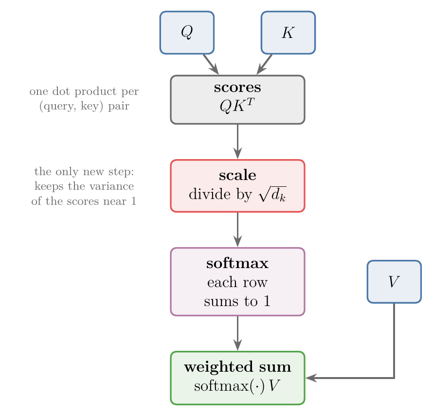
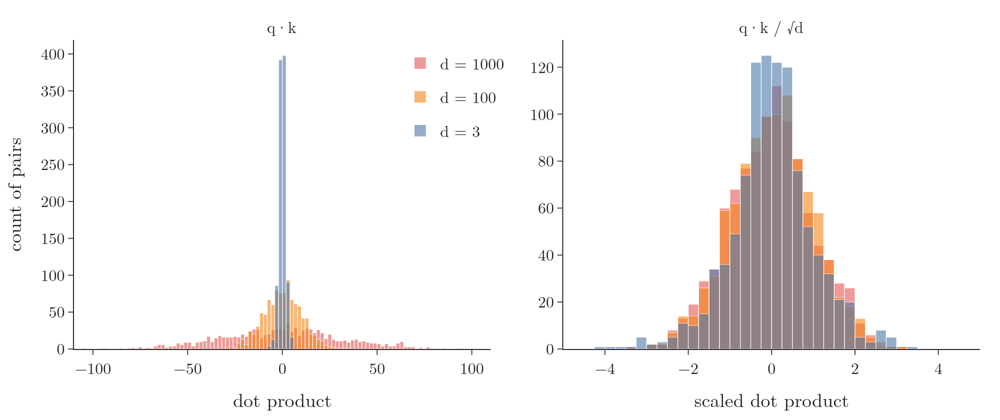
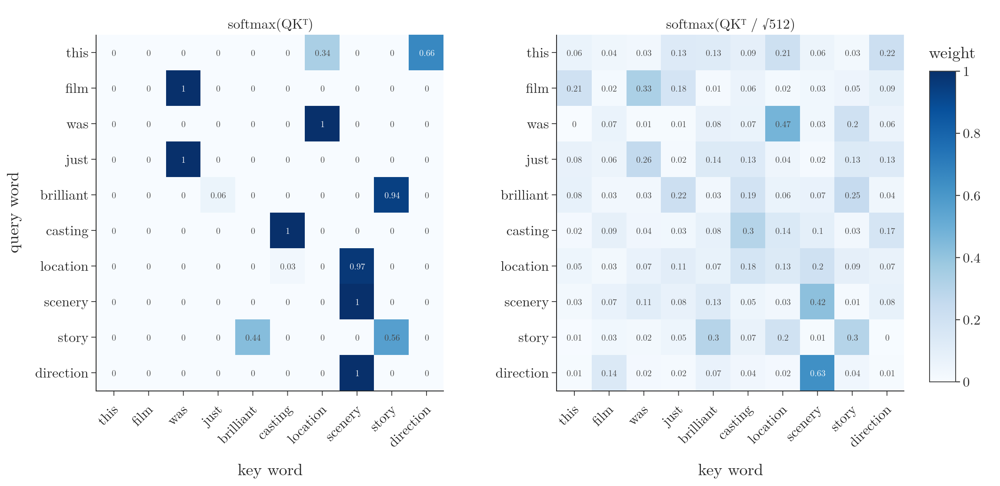

## 1. Overview

> **Key point:** The transformer divides every attention score by $\sqrt{d_k}$, the square root of the length of the key vectors, before the softmax. Without that step, the scores of long vectors spread out so much that the softmax gives almost all the weight to one word, and almost no gradient flows back. Dividing by $\sqrt{d_k}$ brings the variance of the scores back to about 1, whatever the length.

The [self-attention step by step Note](../1073-self-attention-step-by-step/note.md) built self-attention from first principles: every word gets a query, a key and a value vector, and the contextual embeddings are $\text{softmax}(QK^T)\,V$. The paper that introduced the transformer, "Attention Is All You Need", uses the same formula with one extra step (Vaswani et al. 2017, eq. 1):

$$\text{Attention}(Q, K, V) = \text{softmax}\!\left(\frac{QK^T}{\sqrt{d_k}}\right)V$$

Because of that division, the paper calls its attention **scaled dot-product attention**. Figure 1 shows where the new step sits. This Note answers two questions: what $d_k$ is, and why the scores must be divided by exactly $\sqrt{d_k}$.

{width=60%}

## 2. Prerequisites

- [Self-attention step by step Note](../1073-self-attention-step-by-step/note.md): query, key and value vectors, and $\text{softmax}(QK^T)\,V$.
- [Softmax regression Note](../79-softmax-regression/note.md), section 2: the softmax turns a list of scores into weights that sum to 1.
- [Expected value and variance Note](../332-expected-value-and-variance/note.md): the variance of a random variable.
- [Vanishing and exploding gradients Note](../1018-vanishing-exploding-gradients/note.md): why tiny gradients stop a network from learning.

## 3. What $d_k$ is

> **Key point:** $d_k$ is the number of values in each key vector. Every score in $QK^T$ is divided by $\sqrt{d_k}$ before the softmax.

Take the sentence "money bank grows". Each word has an embedding, and multiplying the embedding by the three learned matrices $W_Q$, $W_K$ and $W_V$ gives its query, key and value vectors. With embeddings of 3 numbers and $3 \times 3$ matrices, every key vector has 3 numbers, so $d_k = 3$. With 512-number keys, $d_k = 512$. Queries and keys must have the same length, since we take their dot products; in the transformer paper $d_k = 64$ per attention head (Vaswani et al. 2017, section 3.2.2).

The matrix $QK^T$ holds one dot product for every pair of a query and a key: for 3 words, $3 \times 3 = 9$ scores. Scaling divides each of the 9 scores by $\sqrt{d_k}$; the softmax then works on the scaled scores, row by row.

1. **In words:** compute the query's dot product with every key, divide each by $\sqrt{d_k}$, then apply the softmax.
2. **Formula:** for query $q$ and keys $k_1, \dots, k_n$, the weights are
   $$\alpha_j = \text{softmax}_j\!\left(\frac{q \cdot k_j}{\sqrt{d_k}}\right)$$
3. **Example:** the query of "bank" is $q = (1, 2, 1)$; the keys of "money", "bank", "grows" are $(2, 1, 0)$, $(1, 2, 1)$ and $(0, 1, 0)$. The scores are $4$, $6$ and $2$.
   - Unscaled: $\text{softmax}(4, 6, 2) = (0.117,\ 0.867,\ 0.016)$.
   - Scaled: dividing by $\sqrt{3} = 1.732$ gives $(2.31,\ 3.46,\ 1.15)$, and the softmax gives $(0.223,\ 0.707,\ 0.070)$.

The scaled weights are less extreme: "bank" still attends most to itself, but "money" now gets 22% of the weight instead of 12%. The rest of this Note shows why that matters more and more as $d_k$ grows.

## 4. Longer vectors give more spread-out dot products

> **Key point:** The variance of a dot product grows in proportion to the length of the vectors. Dot products of 1,000-number vectors have about 350 times the variance of those of 3-number vectors.

Each score in $QK^T$ is a dot product of two vectors. Take 1,000 pairs of random vectors, every number drawn independently with mean 0 and variance 1, and compute the 1,000 dot products. Then repeat with longer vectors (Notebook):

| Length $d$ | Range of the 1,000 dot products | Variance |
|---|---|---|
| 3 | $-7.2$ to $5.8$ | 2.9 |
| 100 | $-27.6$ to $32.4$ | 96.7 |
| 1,000 | $-105.7$ to $95.8$ | 1,015.6 |

{width=100%}

The variance is close to $d$ every time (Figure 2, left). The reason is simple: a dot product of length $d$ is a sum of $d$ products, $q \cdot k = q_1k_1 + q_2k_2 + \dots + q_dk_d$, and every extra term adds its own variation. A sum of 3 random terms stays small; a sum of 1,000 random terms can wander far from 0.

### 4.1 The variance grows exactly like $d$

> **Key point:** If the numbers in $q$ and $k$ are independent with mean 0 and variance 1, then $q \cdot k$ has mean 0 and variance exactly $d_k$ (Vaswani et al. 2017, footnote 4).

1. **In words:** each product $q_ik_i$ has variance 1, the $d$ products are independent, and variances of independent terms add up.
2. **Formula:** with $E[q_i] = E[k_i] = 0$ and $\text{Var}(q_i) = \text{Var}(k_i) = 1$, all independent,
   $$\text{Var}(q_ik_i) = E[q_i^2k_i^2] - \left(E[q_ik_i]\right)^2 = E[q_i^2]\,E[k_i^2] - 0 = 1 \cdot 1 = 1$$
   $$\text{Var}(q \cdot k) = \sum_{i=1}^{d_k}\text{Var}(q_ik_i) = d_k$$
3. **Example:** for $d = 1$, 2 and 3, the variance is 1, 2 and 3: a vector one number longer adds one more unit of variance. The Notebook measures 0.99, 1.96, 4.00, 7.99, ... and 1,048 for $d = 1, 2, 4, 8, \dots, 1{,}024$, with 20,000 pairs each (Figure 3, left).

### 4.2 Why high-dimensional vectors are used anyway

> **Key point:** Short vectors would keep the variance low, but they hold too little information about each word. We keep long vectors and fix the variance instead.

One way to avoid the problem would be short embeddings. But a vector of a few numbers cannot capture much about a word's meaning; the transformer paper uses embeddings of 512 numbers (Vaswani et al. 2017, section 3.1). So the vectors stay long, and the variance of the scores must be brought down some other way.

## 5. Why a wide spread is a problem: the softmax saturates

> **Key point:** When the scores spread widely, the softmax puts nearly all the weight on the largest score. Its gradient then becomes almost 0 for every score, and the attention weights hardly learn.

The softmax exponentiates its inputs, so it reacts to differences between scores. Close scores give comparable weights; scores far apart push one weight towards 1 and the others towards 0. A softmax pushed to these extremes is said to be **saturated**. In the example of section 3, the scores $(4, 6, 2)$ already gave "bank" 87% of the weight; with scores ten times larger, $(40, 60, 20)$, it would get more than 99.9999%. Goodfellow et al. (2016, section 6.2.2.3) describe exactly this: the softmax saturates "when the differences between input values become extreme".

A saturated softmax harms training. Gradient descent changes the attention weights through the gradient of the softmax. For weights $\alpha_i = e^{s_i} / \sum_m e^{s_m}$, the quotient rule gives

$$\frac{\partial \alpha_i}{\partial s_i} = \frac{e^{s_i}\sum_m e^{s_m} - e^{s_i}e^{s_i}}{\left(\sum_m e^{s_m}\right)^2} = \alpha_i(1 - \alpha_i), \qquad \frac{\partial \alpha_i}{\partial s_j} = \frac{-e^{s_i}e^{s_j}}{\left(\sum_m e^{s_m}\right)^2} = -\alpha_i\alpha_j \quad (j \neq i)$$

If one weight is close to 1 and the rest close to 0, every entry is close to 0: for the big weight $\alpha_i(1 - \alpha_i) \approx 1 \times 0$, for the small ones $\alpha_i \approx 0$. Little gradient flows back to the scores, and so to $W_Q$ and $W_K$: the same vanishing-gradient problem as in deep networks. Vaswani et al. (2017, section 3.2.1) give this as their reason for scaling: for large $d_k$ the dot products "grow large in magnitude, pushing the softmax function into regions where it has extremely small gradients".

An analogy: a teacher asks a class to raise hands with their questions. If a few children are much taller than the rest, only their hands are seen, and only their questions get answered; the others never take part in the lesson. If all the children are about the same height, the teacher sees every hand. Scaling makes all the scores "about the same height", so every word takes part in training.

The Notebook measures the saturation directly: one random query against 10 random keys, 2,000 times for each length $d$. For each softmax it records the largest weight and the size of the gradient matrix above (Figure 3, middle and right).

{width=100%}

| $d$ | Largest weight, unscaled | Largest weight, scaled | Gradient size, unscaled | Gradient size, scaled |
|---|---|---|---|---|
| 1 | 0.27 | 0.27 | 0.33 | 0.33 |
| 64 | 0.86 | 0.32 | 0.16 | 0.35 |
| 512 | 0.95 | 0.32 | 0.068 | 0.35 |
| 1,024 | 0.97 | 0.32 | 0.046 | 0.35 |

Without scaling, at $d = 1{,}024$ one word takes 97% of the weight on average, and the gradient is 7.6 times smaller than with scaling. With scaling, both numbers stay the same for every $d$.

The same effect shows on a real sentence. Figure 4 takes the first 10 words of the first IMDB training review, with random 512-number embeddings and random $W_Q$, $W_K$, as at the very start of training. Without scaling, 6 of the 10 rows put more than 99% of their weight on a single word. With scaling, no row does, and every word receives some attention.

{width=100%}

## 6. Choosing the scaling factor

> **Key point:** Multiplying a random variable by $c$ multiplies its variance by $c^2$. Since the variance of the scores is $d_k$, dividing by $\sqrt{d_k}$ brings it back to $d_k / d_k = 1$.

To lower the variance of a set of numbers, we divide all of them by the same number.

1. **In words:** scaling every value by $c$ scales every distance from the mean by $c$, so the squared distances, and the variance, by $c^2$.
2. **Formula:** with $\mu = E[X]$,
   $$\text{Var}(cX) = E\big[(cX - c\mu)^2\big] = c^2\,E\big[(X - \mu)^2\big] = c^2\,\text{Var}(X)$$
3. **Example:** the numbers $10, 20, 30, 40, 50, 60, 70$ have mean 40 and variance
   $$\frac{30^2 + 20^2 + 10^2 + 0 + 10^2 + 20^2 + 30^2}{7} = \frac{2800}{7} = 400$$
   Divided by 10 they become $1, 2, \dots, 7$, with variance $400 / 10^2 = 4$.

Which $c$ do we need? The scores have variance $d_k$ (section 4.1), and we want variance 1, the same for every length:

$$\text{Var}\!\left(\frac{q \cdot k}{\sqrt{d_k}}\right) = \frac{1}{(\sqrt{d_k})^2}\,\text{Var}(q \cdot k) = \frac{d_k}{d_k} = 1$$

So $c = 1/\sqrt{d_k}$. For $d_k = 2$ we divide by $\sqrt{2}$, for $d_k = 3$ by $\sqrt{3}$, for $d_k = 64$ by 8. The Notebook confirms it: after scaling, the variance is 0.99, 0.98, 1.00, ..., 1.02 for $d = 1$ to $1{,}024$ (Figure 3, left), and the three histograms of Figure 2 (right) lie on top of each other.

> **Extra:** The derivation assumes independent numbers with mean 0 and variance 1. Trained queries and keys do not follow that exactly; the factor $1/\sqrt{d_k}$ is a choice that keeps the scores at a sensible size, made in the paper "to counteract this effect" (Vaswani et al. 2017, section 3.2.1). Jurafsky and Martin (SLP3 draft, ch. 7, eq. 7.11) give the same reason: exponentiating large values "can lead to numerical issues and loss of gradients during training".

> **Extra:** Before the transformer, two kinds of attention score were common: additive (a small neural network, Bahdanau's) and dot-product (Luong's), compared in the [Bahdanau vs Luong Note](../1070-bahdanau-vs-luong-attention/note.md). Vaswani et al. (2017, section 3.2.1) report that the two perform similarly for small $d_k$, but additive attention does better than unscaled dot-product attention for larger $d_k$. Dot-product attention is "much faster and more space-efficient in practice", because it is one matrix multiplication. Scaling keeps that speed and removes the weakness.

## 7. The full formula in code

> **Key point:** $\text{softmax}(QK^T/\sqrt{d_k})\,V$ computed by hand in NumPy gives exactly the weights and outputs of Keras' `MultiHeadAttention` layer with one head.

Keras implements scaled dot-product attention inside `keras.layers.MultiHeadAttention`. With `num_heads=1` it is a single attention: its weights are $W_Q$, $W_K$, $W_V$ and one extra output matrix that [multi-head attention](../1077-multi-head-attention/note.md) needs. Setting the output matrix to the identity makes the layer compute exactly the formula of this Note.

> **Python:** Scaled dot-product attention by hand, checked against Keras ("money bank grows", 8 numbers per word).
>
> ```python
> mha = keras.layers.MultiHeadAttention(num_heads=1, key_dim=8, use_bias=False)
> mha(X, X)                                          # builds the layer
> Wq, Wk, Wv, Wo = mha.get_weights()                 # shapes (8,1,8) x 3 and (1,8,8)
> mha.set_weights([Wq, Wk, Wv, np.eye(8)[None]])     # output matrix = identity
> out_keras, w_keras = mha(X, X, return_attention_scores=True)
>
> x = X[0]                                           # 3 words x 8 numbers
> Q, K, V = x @ Wq[:, 0], x @ Wk[:, 0], x @ Wv[:, 0]
> A = softmax(Q @ K.T / np.sqrt(8))                  # the attention weights
> Y = A @ V                                          # the contextual embeddings
> ```

The attention weights by hand (rows: "money", "bank", "grows" as queries) are

$$A = \begin{pmatrix} 0.015 & 0.670 & 0.316 \\ 0.159 & 0.575 & 0.267 \\ 0.250 & 0.116 & 0.634 \end{pmatrix}$$

and Keras returns the same matrix. The outputs agree too: the largest difference over the $3 \times 8$ numbers is $2 \times 10^{-7}$, the rounding error of 32-bit numbers (Notebook). The weights here are random, untrained values, so the pattern itself has no meaning yet; training would set $W_Q$, $W_K$ and $W_V$.

## 8. Summary

| Step | Formula | Why |
|---|---|---|
| Scores | $QK^T$ | one dot product per (query, key) pair |
| Scale | divide by $\sqrt{d_k}$ | the scores have variance $d_k$; scaling brings it to 1 |
| Weights | softmax, row by row | each row of weights sums to 1 |
| Output | weights $\times\,V$ | contextual embeddings |

- $d_k$ is the length of the key (and query) vectors.
- The variance of a dot product of independent numbers with mean 0 and variance 1 equals the length of the vectors: 3, 100 and 1,000 gave measured variances 2.9, 96.7 and 1,015.6.
- Widely spread scores saturate the softmax: one weight near 1, a gradient near 0. At $d = 1{,}024$ the largest weight averaged 0.97 and the gradient was 7.6 times smaller than with scaling.
- $\text{Var}(cX) = c^2\,\text{Var}(X)$, so dividing by $\sqrt{d_k}$ makes the variance 1 for every $d_k$.
- Keras' `MultiHeadAttention` with one head computes exactly $\text{softmax}(QK^T/\sqrt{d_k})\,V$.

## 9. Sources

- Vaswani, A. et al. (2017). Attention Is All You Need. *NeurIPS 2017*. arXiv:1706.03762. Section 3.1 ($d_{model} = 512$); section 3.2.1 and eq. 1 (scaled dot-product attention, additive vs dot-product, small gradients); footnote 4 (variance $d_k$); section 3.2.2 ($d_k = 64$).
- Jurafsky, D. and Martin, J. H. *Speech and Language Processing*, 3rd ed. draft (19 August 2026), chapter 7, section on attention, eq. 7.10–7.13.
- Goodfellow, I., Bengio, Y. and Courville, A. (2016). *Deep Learning*. MIT Press. Section 6.2.2.3 (the softmax saturates when the differences between its inputs become extreme).
- Maas, A. L. et al. (2011). Learning Word Vectors for Sentiment Analysis. *ACL 2011*. The IMDB review dataset (via `keras.datasets.imdb`).
- Keras API documentation: `MultiHeadAttention` layer, keras.io/api/layers/attention_layers/multi_head_attention.

## 10. Key terms

| Term | Meaning |
|---|---|
| Scaled dot-product attention | $\text{softmax}(QK^T/\sqrt{d_k})\,V$: self-attention with the scores divided by $\sqrt{d_k}$ |
| $d_k$ | The number of values in each key vector (and query vector) |
| Attention score | The dot product of one query with one key, before the softmax |
| Variance | The average squared distance of values from their mean; a measure of spread |
| Saturated softmax | A softmax whose inputs are so far apart that one weight is near 1 and the rest near 0 |
| Softmax gradient | $\partial\alpha_i/\partial s_i = \alpha_i(1 - \alpha_i)$ and $\partial\alpha_i/\partial s_j = -\alpha_i\alpha_j$; near 0 everywhere when the softmax is saturated |
| Scaling factor | The number $1/\sqrt{d_k}$ that multiplies every score |
| `MultiHeadAttention` | The Keras layer for (multi-head) scaled dot-product attention |
