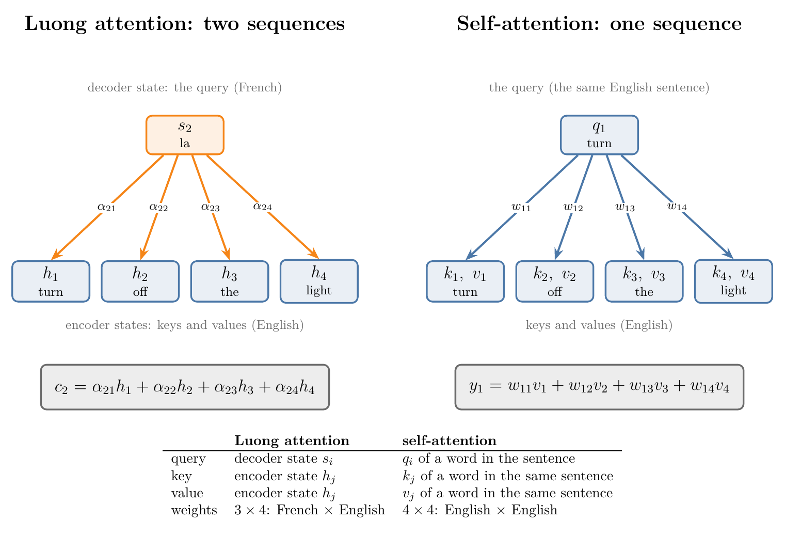

## 1. Overview

> **Key point:** Self-attention is an attention mechanism because it uses the same three equations as Luong's attention in an encoder–decoder: dot-product scores between a query and keys, a softmax, and a weighted sum of values. Self-attention is called "self" because the queries, keys and values all come from one sequence. Luong's attention relates two different sequences, the output and the input; self-attention relates the words of a sentence to each other.

At first sight self-attention looks nothing like the attention of the [attention mechanism Note](../1069-attention-mechanism/note.md). The earlier attention lived inside an encoder–decoder with two LSTMs, and it helped the decoder look back at the input sentence. Self-attention, as built in the [self-attention step by step Note](../1073-self-attention-step-by-step/note.md), has no encoder and no decoder: it takes one sentence and returns a contextual embedding for every word.

This Note answers two questions:

1. Why is self-attention a kind of **attention**?
2. Why is it called **self**?

{width=100%}

## 2. Prerequisites

- [Attention mechanism Note](../1069-attention-mechanism/note.md): a new context vector for every output word, built from all encoder states.
- [Bahdanau vs Luong attention Note](../1070-bahdanau-vs-luong-attention/note.md): Luong's dot-product score.
- [Self-attention step by step Note](../1073-self-attention-step-by-step/note.md): query, key and value vectors.
- [Scaled dot-product attention Note](../1074-scaled-dot-product-attention/note.md): dividing the scores by $\sqrt{d_k}$.

## 3. Attention in the encoder–decoder, in three equations

> **Key point:** For output step $i$, the decoder state $s_i$ is compared with every encoder state $h_j$ by a dot product; the softmax turns the scores into weights $\alpha_{ij}$; the context vector $c_i$ is the weighted sum of the encoder states.

Recall the setting of the [attention mechanism Note](../1069-attention-mechanism/note.md). We translate the English sentence "Turn off the light." into French, "Éteins la lumière.", a pair taken from the English–French dataset used in these Notes. An LSTM encoder reads the 4 English words and keeps a hidden state after each: $h_1, h_2, h_3, h_4$. An LSTM decoder writes the 3 French words, with a hidden state $s_i$ at each step.

The plain encoder–decoder hands the decoder one context vector for the whole sentence. Attention gives the decoder a fresh context vector $c_i$ at every step, a weighted mix of all encoder states. With the dot-product score of Luong et al. (2015), the context vector comes from three equations:

1. **Scores:** $e_{ij} = s_i \cdot h_j$, how well encoder state $j$ matches what the decoder needs at step $i$.
2. **Weights:** $\alpha_{ij} = \text{softmax}_j(e_{ij})$, so the weights of one step sum to 1.
3. **Context vector:** $c_i = \sum_j \alpha_{ij}\,h_j$.

For example, $c_2 = \alpha_{21}h_1 + \alpha_{22}h_2 + \alpha_{23}h_3 + \alpha_{24}h_4$ is the context for writing "la". With 3 output words and 4 input words there are $3 \times 4 = 12$ weights $\alpha_{ij}$. Luong et al. write the same equations with $h_t$ for the decoder state and $\bar{h}_s$ for an encoder state (Luong et al. 2015, section 3: eq. 7 for the weights, eq. 8 for the score); the [Bahdanau vs Luong Note](../1070-bahdanau-vs-luong-attention/note.md) compares this score with Bahdanau's.

## 4. Self-attention in the same three equations

> **Key point:** Self-attention follows the same three steps: query·key scores, a softmax, a weighted sum of values. Only the source of the vectors differs.

Take now only the English sentence, "turn off the light". Self-attention gives every word a query $q_j$, a key $k_j$ and a value $v_j$, and builds the contextual embedding of "turn" like this:

1. **Scores:** $s_{1j} = q_1 \cdot k_j$, for $j = 1, \dots, 4$.
2. **Weights:** $w_{1j} = \text{softmax}_j(s_{1j})$.
3. **Output:** $y_1 = w_{11}v_1 + w_{12}v_2 + w_{13}v_3 + w_{14}v_4$.

Then the same for "off", "the" and "light". Written side by side (Figure 1), the two computations match role for role:

| Role | Luong attention | Self-attention |
|---|---|---|
| Query: the one asking "which words help me?" | decoder state $s_i$ | query $q_i$ of a word |
| Key: compared with the query | encoder state $h_j$ | key $k_j$ of a word |
| Value: mixed into the output | encoder state $h_j$ | value $v_j$ of a word |
| Similarity | $e_{ij} = s_i \cdot h_j$ | $s_{ij} = q_i \cdot k_j$ |
| Weights | $\alpha_{ij} = \text{softmax}_j(e_{ij})$ | $w_{ij} = \text{softmax}_j(s_{ij})$ |
| Output | context vector $c_i$ | contextual embedding $y_i$ |

The decoder state acts as the **query**: at step $i$ the decoder asks which input words will help it write the next word. The encoder states answer as **keys**, and they are also the **values** that get mixed. In Luong attention the key and the value of a word are the same vector $h_j$; self-attention gives each word two different vectors for these two jobs.

## 5. Why self-attention is attention

> **Key point:** The mathematics is the same. One function, and one Keras layer, computes both.

Since the three equations are the same, one function computes both kinds of attention. The Notebook writes it once:

> **Python:** The three equations as one function.
>
> ```python
> def attention(queries, keys, values):
>     A = softmax(queries @ keys.T)      # scores, then weights
>     return A, A @ values               # weights, weighted sums
>
> A_luong, C = attention(S, H, H)        # decoder states ask the encoder states
> A_self, Y = attention(Q / np.sqrt(d), K, V)   # one sentence asks itself
> ```

The Notebook runs it on the sentence pair above, with an (untrained) LSTM encoder and decoder of 8 units:

- **Between two sequences:** `attention(S, H, H)` gives a $3 \times 4$ weight matrix, French words by English words. Keras' `keras.layers.Attention`, which its documentation calls "dot-product attention layer, a.k.a. Luong-style attention", returns exactly the same weights and context vectors.
- **Within one sequence:** with $Q = XW_Q$, $K = XW_K$, $V = XW_V$ from the English embeddings $X$, and the scores divided by $\sqrt{d_k}$, the same function gives a $4 \times 4$ weight matrix, English by English. The same Keras layer again returns the same numbers.

Self-attention is attention because it is the same computation: a query scores keys, the softmax turns the scores into weights, and the weights mix the values. Only the setting, an encoder–decoder or a single sentence, made the two look different.

## 6. Why it is called "self"

> **Key point:** Luong and Bahdanau attention work between two sequences (inter-sequence). Self-attention works within one sequence (intra-sequence): the sequence attends to itself.

In Luong's attention the queries come from one sequence, the French output, and the keys and values from another, the English input. The weights relate the words of two different sentences, so the weight matrix is rectangular: $3 \times 4$, output length by input length.

In self-attention the queries, keys and values all come from the same sentence. Every word is compared with every word of its own sentence, itself included, and the weight matrix is square: $4 \times 4$. Vaswani et al. (2017, section 2) define it this way: "Self-attention, sometimes called intra-attention is an attention mechanism relating different positions of a single sequence in order to compute a representation of the sequence."

{width=100%}

The "self" therefore describes where the inputs come from, not a different calculation. Keras' `MultiHeadAttention` layer shows this directly: it takes a `query` sequence and a `value` sequence. Called with the English sentence as both, it does self-attention and returns $4 \times 4$ weights; called with the French states as the query and the English sentence as the value, the same layer returns $3 \times 4$ weights (Notebook). The second use, between the decoder and the encoder of a transformer, is called **cross-attention** and has its own [cross-attention Note](../1082-cross-attention/note.md).

> **Extra:** The middle panel of Figure 2 shows why self-attention needs its projection matrices. Without $W_Q$ and $W_K$, the query and the key of a word are the same vector, and the dot product of a vector with itself (its squared length) is usually the largest score: "off" and "the" put all their weight on themselves. Jurafsky and Martin (SLP3 draft, ch. 7, section on attention) note the same: in the simple version, "the softmax weight will likely be highest for $x_i$, since $x_i$ is very similar to itself". Separate query, key and value matrices, from the [self-attention step by step Note](../1073-self-attention-step-by-step/note.md), let a word look for something other than itself (right panel).

## 7. Summary

| | Luong attention | Self-attention |
|---|---|---|
| Sequences | two: output and input | one |
| Query | decoder state $s_i$ | $q_i = x_iW_Q$ |
| Keys and values | encoder states $h_j$ (same vector for both) | $k_j = x_jW_K$, $v_j = x_jW_V$ |
| Scaling | none | divide by $\sqrt{d_k}$ |
| Weight matrix | output length $\times$ input length ($3 \times 4$) | length $\times$ length ($4 \times 4$) |
| Output | context vector for the decoder | contextual embedding of every word |

- Self-attention is attention: scores from query·key dot products, a softmax, and a weighted sum of values, the same three equations as Luong's attention.
- It is "self" because one sequence supplies the queries, the keys and the values: attention within a sequence (intra-attention), not between two.
- One function, or one Keras layer, computes both; only the inputs differ.

## 8. Sources

- Luong, M.-T., Pham, H. and Manning, C. D. (2015). Effective Approaches to Attention-based Neural Machine Translation. *EMNLP 2015*. arXiv:1508.04025. Section 3, eq. 7 and 8 (the dot score, the weights $a_t(s)$, the context vector $c_t$).
- Vaswani, A. et al. (2017). Attention Is All You Need. *NeurIPS 2017*. arXiv:1706.03762. Section 2 (self-attention, "sometimes called intra-attention"); section 3.2.1 (scaled dot-product attention).
- Jurafsky, D. and Martin, J. H. *Speech and Language Processing*, 3rd ed. draft (19 August 2026). Chapter 14, section 14.8 (dot-product attention in the encoder–decoder); chapter 7, section on attention (the simple version weighs $x_i$ most).
- Tatoeba Project, English–French sentence pairs, distributed by manythings.org/anki (the Keras `fra-eng` example dataset).
- Keras API documentation: `Attention` layer ("Dot-product attention layer, a.k.a. Luong-style attention") and `MultiHeadAttention` layer, keras.io/api/layers/attention_layers.

## 9. Key terms

| Term | Meaning |
|---|---|
| Query | The vector that asks which other positions are useful: the decoder state in Luong attention, $q_i$ in self-attention |
| Key | The vector compared with the query by a dot product |
| Value | The vector mixed into the output, weighted by the attention weights |
| Luong (dot) attention | Attention between a decoder state and the encoder states, scored by their dot product |
| Self-attention (intra-attention) | Attention in which the queries, keys and values all come from one sequence |
| Inter-sequence attention | Attention between two different sequences, such as an output and an input sentence |
| Cross-attention | The transformer's attention from the decoder (queries) to the encoder (keys and values) |
| `keras.layers.Attention` | Keras' Luong-style dot-product attention layer |
