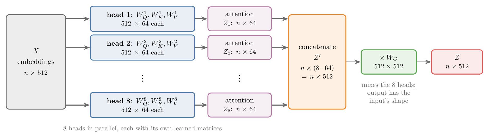
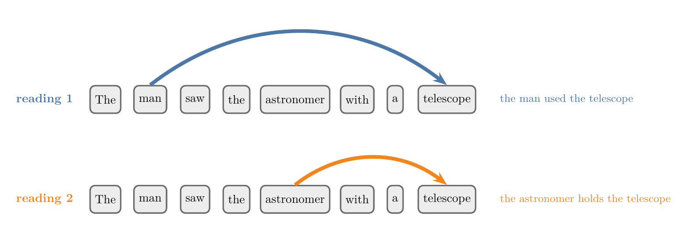
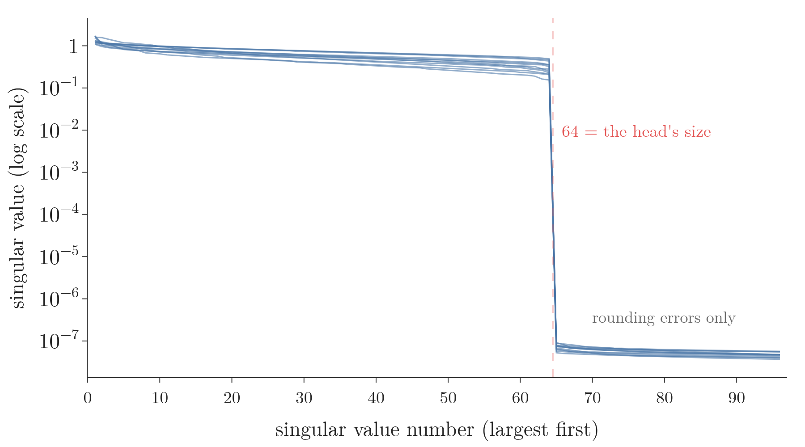
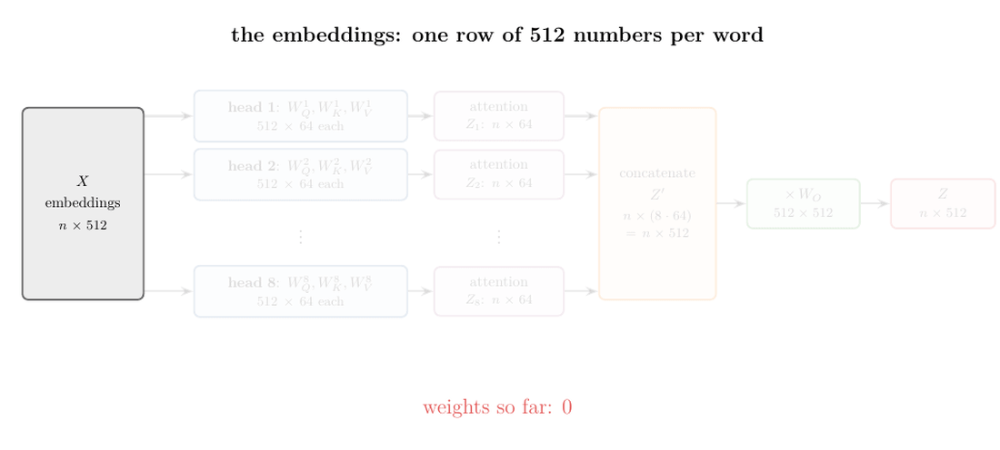
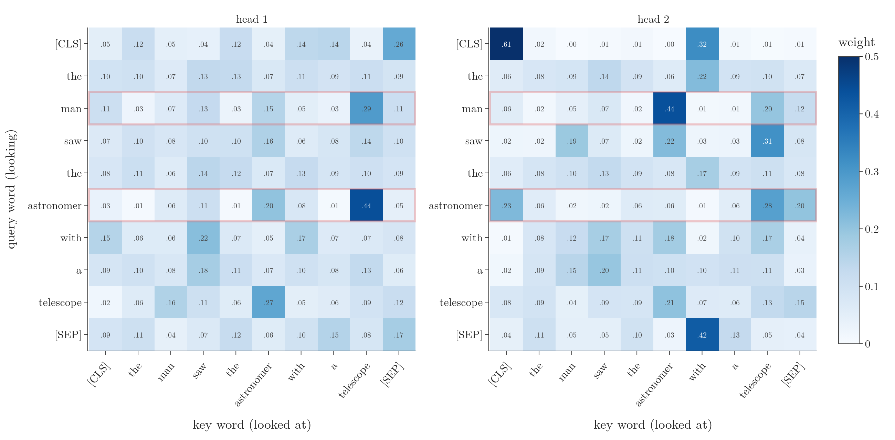
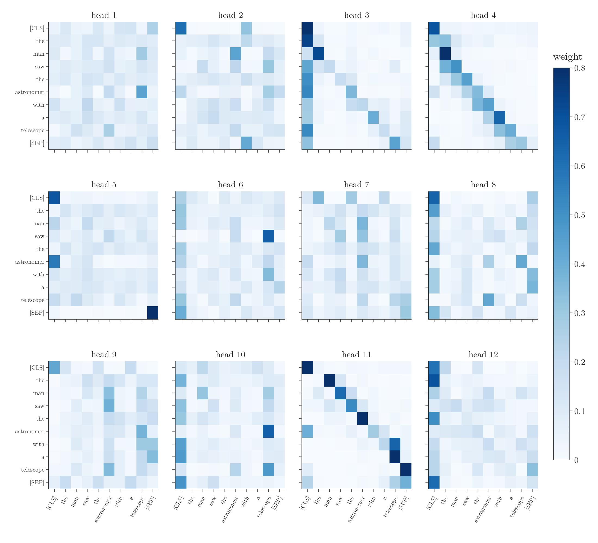

<!-- where-this-fits: generated by course_map/build_map.py; edit concepts.yaml, not this block -->
> **Where this fits:** Pipeline map step 8 (Model). See the [Course map](../01-course-map/note.md).
>
> 
>
> - **Builds on:** Scaled dot-product attention ([Note 1074](../1074-scaled-dot-product-attention/note.md)).
> - **Leads to:** Transformer encoder ([Note 1080](../1080-transformer-encoder/note.md)).
<!-- /where-this-fits -->

## 1. Overview

> **Key point:** One self-attention computes one table of weights per sentence, so it can only look at the sentence from one point of view. **Multi-head attention** (G-1268) runs several self-attentions in parallel, called **heads** (G-883), each with its own $W_Q$, $W_K$ and $W_V$. Their outputs are joined side by side and mixed by one more learned matrix, $W_O$. In the transformer there are 8 heads of 64 numbers each, so the total cost is the same as one head of 512 numbers.

The [self-attention step by step Note](../1073-self-attention-step-by-step/note.md) turned each word's embedding into a **contextual embedding** (G-462): a new vector that depends on the other words of the sentence. The [scaled dot-product attention Note](../1074-scaled-dot-product-attention/note.md) gave the final formula, $\text{softmax}(QK^T/\sqrt{d_k})\thinspace V$.

This Note shows the one limitation of that formula, then the fix that the transformer uses: **multi-head attention** (Vaswani et al. 2017, §3.2.2). Figure 1 shows the whole computation. The Note then:

- counts its cost (section 6);
- checks the computation against Keras (section 7);
- looks at the 12 heads of a real trained model (section 8).


{width=100%}

## 2. Prerequisites

- [Self-attention step by step Note](../1073-self-attention-step-by-step/note.md): query, key and value vectors from $W_Q$, $W_K$, $W_V$; the matrix form for a whole sentence.
- [Scaled dot-product attention Note](../1074-scaled-dot-product-attention/note.md): $\text{softmax}(QK^T/\sqrt{d_k})\thinspace V$, and Keras' `MultiHeadAttention` layer with one head.
- [What is self-attention Note](../1072-what-is-self-attention/note.md): static and contextual embeddings.
- [Linear transformations Note](../500-linear-transformations-and-matrices/note.md): multiplying by a matrix maps a vector to a new vector, possibly of a different length.

## 3. Self-attention in one paragraph

> **Key point:** Self-attention gives each word a query, a key and a value vector, compares every query with every key, and returns each word as a weighted sum of the value vectors.

Take the sentence "money bank". Each word's embedding is multiplied by three learned matrices, $W_Q$, $W_K$ and $W_V$, giving its **query, key and value vectors** (G-1607). The query of "money" is compared with the keys of "money" and "bank" by dot products; the scores are divided by $\sqrt{d_k}$ and turned into **attention weights** (G-225) by the softmax; the weighted sum of the value vectors is the contextual embedding of "money". The same happens for "bank". For all words at once, with the embeddings as the rows of a matrix $X$:

$$Q = XW_Q, \quad K = XW_K, \quad V = XW_V, \qquad Z = \text{softmax}\negthinspace\left(\frac{QK^T}{\sqrt{d_k}}\right)V$$

The full derivation is in the [self-attention step by step Note](../1073-self-attention-step-by-step/note.md) and the [scaled dot-product attention Note](../1074-scaled-dot-product-attention/note.md).

## 4. The problem: one head, one point of view

> **Key point:** Self-attention produces a single table of weights, one weight for every pair of words. A sentence that can be read in two ways needs two different tables.

Read this sentence: "The man saw the astronomer with a telescope." It has two meanings:

1. The man used a telescope to see the astronomer. Then "telescope" belongs with "man" and "saw".
2. The man saw an astronomer who was holding a telescope. Then "telescope" belongs with "astronomer".

Self-attention computes one weight for every pair of words: how much "man" looks at "telescope", how much "astronomer" looks at "telescope", and so on. With one set of $W_Q$, $W_K$, $W_V$, there is exactly one such table for the sentence. If the weights tie "man" strongly to "telescope", the table expresses the first meaning; if they tie "astronomer" to "telescope", the second. One table cannot hold both.

{width=100%}

Figure 2 draws the two links that the two readings need. A single head gives one table of weights, so it has to favour one of the two arrows.

The same limit appears in larger tasks. A tool that summarises a document from a single point of view gives one summary. Ideally we would look at the document from several points of view and combine them.

Vaswani et al. (2017, §3.2.2) state the problem in their own words: with a single attention head, "averaging inhibits" attending to different kinds of information at once. Jurafsky and Martin (SLP3 §7.1) give the intuition for the fix: each head "might be attending to the context for different purposes", for example to different relationships between words.

## 5. The idea: several self-attentions in parallel

> **Key point:** Use several sets of $W_Q$, $W_K$, $W_V$ instead of one. Each set is a **head**: a complete self-attention of its own, with its own table of weights. Every word gets one output per head.

An analogy: one reviewer reads a report and writes one opinion. A panel of reviewers, each reading with a different question in mind, gives several opinions, and the editor combines them into one verdict. In multi-head attention the heads are the reviewers, and the matrix $W_O$ (section 5.3) is the editor.

### 5.1 Two heads on "money bank"

> **Key point:** With two heads, every word gets two query, two key and two value vectors, and so two contextual embeddings.

We keep the two-word sentence "money bank" with embeddings of 4 numbers:

$$e_{\text{money}} = (1, 0, 1, 0), \qquad e_{\text{bank}} = (0, 2, 0, 1)$$

Head 1 has its own $4 \times 4$ matrices $W_Q^1$, $W_K^1$, $W_V^1$; head 2 has a second, different set $W_Q^2$, $W_K^2$, $W_V^2$. In the Notebook their entries are small whole numbers, $-1$, $0$ or $1$, chosen at random. Multiplying each embedding by both sets gives two query vectors per word ($q^1_{\text{money}}$, $q^2_{\text{money}}$), two key vectors and two value vectors.

1. **In words:** each head runs the whole self-attention computation with its own vectors.
2. **Formula:** for head $i$,
   $$\alpha^i_{\text{money},j} = \text{softmax}_j\negthinspace\left(\frac{q^i_{\text{money}} \cdot k_j^i}{\sqrt{d_k}}\right), \qquad z^i_{\text{money}} = \sum_j \alpha^i_{\text{money},j}\thinspace v_j^i$$
3. **Example:** the weights of "money", with $d_k = 4$, so $\sqrt{d_k} = 2$:
   - Head 1: $q^1_{\text{money}} = (0, 1, 0, 0)$, $k^1_{\text{money}} = (0, 1, 0, 0)$, $k^1_{\text{bank}} = (-1, 3, 3, -3)$. The scores are $1$ and $3$, halved to $0.5$ and $1.5$; the softmax gives weights $0.269$ on "money" and $0.731$ on "bank".
   - Head 2: $q^2_{\text{money}} = (-1, 1, 2, 0)$, $k^2_{\text{money}} = (1, -1, 1, 2)$, $k^2_{\text{bank}} = (1, 1, 0, -2)$. Both scores are $0$, so the weights are $0.5$ and $0.5$.

The two heads weigh the same words differently, because their matrices differ. After the weighted sums, "money" has two contextual embeddings:

$$z^1_{\text{money}} = (-2.46, -0.73, -0.54, -0.27), \qquad z^2_{\text{money}} = (1.50, -0.50, -0.50, 0.00)$$

### 5.2 The matrix form

> **Key point:** For a whole sentence, each head turns $X$ into its own $Q_i$, $K_i$, $V_i$ and returns its own output matrix $Z_i$.

Stacking the embeddings as rows gives $X$, of shape $2 \times 4$. Each head works exactly as single-head self-attention:

$$Q_i = XW_Q^i, \quad K_i = XW_K^i, \quad V_i = XW_V^i, \qquad Z_i = \text{softmax}\negthinspace\left(\frac{Q_iK_i^T}{\sqrt{d_k}}\right)V_i$$

$Z_1$ holds the head-1 outputs of "money" and "bank" as its two rows; $Z_2$ holds the head-2 outputs. Both are $2 \times 4$.

### 5.3 Concatenate, then mix with $W_O$

> **Key point:** Join the heads' outputs side by side, then multiply by a learned matrix $W_O$. The result has the same shape as the input.

Each word now has two 4-number vectors. Placing $Z_1$ and $Z_2$ side by side (**concatenation** (G-437)) gives $Z'$, of shape $2 \times 8$. But the output of the layer should have the same shape as its input, $2 \times 4$, so that the next layer can treat it like the embeddings. One more learned matrix, $W_O$ of shape $8 \times 4$, does this:

$$Z = Z'\thinspace W_O = [\thinspace Z_1 \thickspace\thickspace Z_2\thinspace]\thinspace W_O$$

| Step | Shape |
|---|---|
| Embeddings $X$ | $2 \times 4$ |
| $Q_i$, $K_i$, $V_i$ for each of the 2 heads | $2 \times 4$ |
| Head outputs $Z_1$, $Z_2$ | $2 \times 4$ each |
| Concatenated $Z'$ | $2 \times 8$ |
| $W_O$ | $8 \times 4$ |
| Output $Z = Z'W_O$ | $2 \times 4$ |

For "money", the Notebook's $W_O$ turns the 8 numbers $(-2.46, -0.73, -0.54, -0.27, 1.50, -0.50, -0.50, 0.00)$ into the final $(2.66, 1.69, 1.77, 1.58)$.

$W_O$ is learned by backpropagation like $W_Q$, $W_K$ and $W_V$. Each output number is a weighted mix of all 8 numbers from both heads, so training decides how much each head's view counts in the final vector, or how to blend them. The concatenation keeps all the points of view; $W_O$ combines them.

**The same thing, read as a sum.** Cut $W_O$ into two blocks of rows: rows 1 to 4, $W_O^1$, meet the 4 numbers of head 1 in the product, and rows 5 to 8, $W_O^2$, meet the 4 numbers of head 2. Multiplying a row vector by a matrix adds up the matrix's rows, each scaled by one number of the vector, so the product splits into one part per head:

1. **In words:** concatenating and multiplying by $W_O$ is the same as letting each head multiply its own output by its own block of $W_O$, and adding the results.
2. **Formula:**
   $$[\thinspace Z_1 \thickspace\thickspace Z_2\thinspace]\thinspace W_O = Z_1 W_O^1 + Z_2 W_O^2$$
3. **Example:** for "money", head 1 contributes $z^1_{\text{money}} W_O^1 = (1.66, 1.19, 1.27, -0.92)$ and head 2 contributes $z^2_{\text{money}} W_O^2 = (1.00, 0.50, 0.50, 2.50)$. Their sum is $(2.66, 1.69, 1.77, 1.58)$, exactly the output above (Notebook).

So every head proposes its own change to the word's vector, and the layer adds the proposals up (Sanderson 2024, Ch 6). In the transformer, that sum is then added to the word's own vector by the **residual connection** (G-1681) (the [self-attention geometrically Note](../1075-self-attention-geometric-intuition/note.md), section 7.3). Figure 3 runs the whole computation for "money".

{height=55%}

Nothing limits us to two heads. With $h$ heads there are $h$ sets of matrices, $h$ outputs per word, and $Z'$ has $h$ blocks side by side.

### 5.4 Each head's value map is low rank

> **Key point:** Inside one head, a word's vector goes down to a few numbers through $W_V^i$ and back up to full size through the head's block of $W_O$. The pair acts like one big matrix that can only produce changes in a limited set of directions: its rank is at most the head's size.

Follow one head's value vectors through to the output. With $d_{\text{model}}$ numbers per word and heads of $d_v$ numbers (section 6 uses 512 and 64):

1. **In words:** $W_V^i$ maps the word's vector **down** to $d_v$ numbers, and the head's block of rows $W_O^i$ maps those numbers back **up** to $d_{\text{model}}$. Together they form one map from the word's vector to the change this head can write, $W_V^i W_O^i$, of size $d_{\text{model}} \times d_{\text{model}}$.
2. **Formula:** the combined map passes through $d_v$ numbers, so its rank is at most $d_v$ (the [low-rank approximation Note](../612-low-rank-approximation/note.md)): $\text{rank}(W_V^i W_O^i) \le d_v$.
3. **Example:** in BERT-base (768 numbers per word, heads of 64; section 8), each head's map $W_V^i W_O^i$ is $768 \times 768$. For all 12 heads of the first layer, exactly 64 singular values are non-zero; the 65th is below $10^{-7}$, a rounding error (Notebook, Figure 4).

{width=85%}

The two small matrices are much cheaper than one full map: $2 \times 768 \times 64 = 98{,}304$ numbers instead of $768^2 = 589{,}824$. Sanderson (2024, Ch 6) calls the two steps "value down" and "value up". In the paper's names, his value-down matrix is $W_V^i$ and his value-up matrix is head $i$'s block of rows of $W_O$ (Vaswani et al. 2017, §3.2.2); we keep the paper's names.

## 6. Multi-head attention in the transformer

> **Key point:** The transformer uses $h = 8$ heads. Each head projects the 512-number embeddings down to 64 numbers, so the 8 outputs concatenate back to $8 \times 64 = 512$, and $W_O$ is $512 \times 512$.

The transformer paper defines (Vaswani et al. 2017, §3.2.2):

$$\text{MultiHead}(Q, K, V) = \text{Concat}(\text{head}_1, \dots, \text{head}_h)\thinspace W_O, \qquad \text{head}_i = \text{Attention}(QW_Q^i, KW_K^i, VW_V^i)$$

In self-attention $Q$, $K$ and $V$ here are all the embedding matrix $X$, so $\text{head}_i$ is the $Z_i$ of section 5. Two numbers differ from our small example:

- **Embeddings of $d_{\text{model}} = 512$ numbers** per word (Vaswani et al. 2017, §3.1).
- **$h = 8$ heads, each of size $d_k = d_v = d_{\text{model}}/h = 64$.** Each $W_Q^i$, $W_K^i$, $W_V^i$ is $512 \times 64$: it maps a 512-number embedding to a 64-number query, key or value. Every head works in a smaller space than the embedding.

For a sentence of $n$ words (Figure 1):

| Step | Shape |
|---|---|
| Embeddings $X$ | $n \times 512$ |
| $W_Q^i$, $W_K^i$, $W_V^i$, for each of the 8 heads | $512 \times 64$ |
| $Q_i$, $K_i$, $V_i$ | $n \times 64$ |
| Head output $Z_i$ | $n \times 64$ |
| Concatenated $Z'$ | $n \times (8 \cdot 64) = n \times 512$ |
| $W_O$ | $512 \times 512$ |
| Output $Z$ | $n \times 512$ |

The output again has the input's shape: one 512-number vector per word.

### 6.1 Why 64 numbers per head: the same cost as one head

> **Key point:** 8 heads of 64 have exactly as many weights as 1 head of 512, and the same amount of work in the scores. Multiple points of view come at no extra cost.

Two full-size heads, as in section 5, would double the weights. Splitting $d_{\text{model}}$ among the heads avoids that.

1. **In words:** count the weights of the four kinds of matrix, $W_Q$, $W_K$, $W_V$ (all heads together) and $W_O$, plus one bias per output number.
2. **Formula:** with $h$ heads of size $d/h$, the query matrices of all heads together are $h \times d \times (d/h) = d^2$ numbers; the same for keys and values; $W_O$ is $d \times d$. With biases:
   $$\text{parameters} = 4d^2 + 4d$$
   which does not depend on $h$. Likewise every pair of words costs $h \times (d/h) = d$ multiplications in the scores $Q_iK_i^T$, whatever $h$ is.
3. **Example:** $d = 512$: $4 \times 512^2 + 4 \times 512 = 1{,}050{,}624$ parameters.

{width=100%}

In Figure 5, watch the red count: it jumps only when a stage brings learned matrices (the heads, then $W_O$), and it ends on the number that one head of 512 would also need.

{width=100%}

In Figure 6, the first two bars are equal: splitting into 8 heads costs nothing extra, while two full-size heads double the count. The right panel is the paper's measurement of the number of heads, described in the Extra box below.

Keras' `MultiHeadAttention` layer confirms it (Notebook):

| Heads | Size per head | Parameters | Score multiplications per word pair |
|---|---|---|---|
| 1 | 512 | 1,050,624 | 512 |
| 8 | 64 | 1,050,624 | 512 |
| 2 | 512 | 2,100,736 | 1,024 |

The paper puts it this way: "Due to the reduced dimension of each head, the total computational cost is similar to that of single-head attention with full dimensionality" (Vaswani et al. 2017, §3.2.2). Each head does one eighth of the work, and the 8 heads run in parallel.

> **Extra:** The paper also measured the number of heads, keeping the total computation fixed (Vaswani et al. 2017, Table 3, rows A; English-to-German translation, development set). The **BLEU score** (G-315), a translation-quality score, was 24.9 with 1 head of 512, 25.5 with 4 heads of 128, 25.8 with 8 heads of 64, 25.8 with 16 heads of 32, and 25.4 with 32 heads of 16. "Single-head attention is 0.9 BLEU worse than the best setting, quality also drops off with too many heads." Very small heads lose quality: their 16-number queries and keys are too short to compare words well.

## 7. Multi-head attention in code

> **Key point:** Splitting into 8 heads, computing each head's attention, concatenating and multiplying by $W_O$ by hand in NumPy gives exactly the output of Keras' `MultiHeadAttention(num_heads=8, key_dim=64)`.

Keras stores the weights of all heads in one array per role. `MultiHeadAttention(num_heads=8, key_dim=64)` on 512-number inputs holds a query kernel of shape $(512, 8, 64)$: the $W_Q^i$ of the 8 heads side by side. The key and value kernels have the same shape, and the output kernel $(8, 64, 512)$ is $W_O$ reshaped to $512 \times 512$. Each kernel also has a bias.

> **Python:** Multi-head attention by hand, checked against Keras. `X` holds 8 words of 512 numbers each (stand-in embeddings for "the man saw the astronomer with a telescope").
>
> ```python
> mha = keras.layers.MultiHeadAttention(num_heads=8, key_dim=64)
> out_keras, w_keras = mha(X, X, return_attention_scores=True)
> Wq, bq, Wk, bk, Wv, bv, Wo, bo = mha.get_weights()
>
> x, Zs = X[0], []
> for i in range(8):                                 # one head at a time
>     Q = x @ Wq[:, i] + bq[i]                       # (8 words, 64)
>     K = x @ Wk[:, i] + bk[i]
>     V = x @ Wv[:, i] + bv[i]
>     A = softmax(Q @ K.T / np.sqrt(64))             # this head's weights
>     Zs.append(A @ V)                               # this head's output
> Z_cat = np.concatenate(Zs, axis=1)                 # (8 words, 512)
> out_hand = Z_cat @ Wo.reshape(512, 512) + bo       # mix with W_O
> ```

The largest difference between `out_hand` and the Keras output, over all $8 \times 512$ numbers, is $6 \times 10^{-7}$; the weights of all 8 heads agree to $4 \times 10^{-7}$ (Notebook). The differences are rounding errors of 32-bit numbers. Even with random, untrained weights, the heads already weigh the words differently: in head 1 "man" gives its largest weight, 0.21, to the first "the", while in head 2 it gives 0.42 to "saw".

## 8. The heads of a trained model

> **Key point:** In a real trained transformer, the heads of one layer look at the same sentence in visibly different ways. On "the man saw the astronomer with a telescope", one head ties "man" most to "telescope", another ties "man" most to "astronomer".

Random weights only show that heads can differ. To see what trained heads do, we use **BERT** (G-278), a published transformer trained on a large amount of English text (Devlin et al. 2019). BERT-base has 12 layers, 768 numbers per word and 12 attention heads per layer (Devlin et al. 2019, §3), so each head has $768/12 = 64$ numbers. The Notebook downloads only the published weights needed for the first layer's attention (about 7 MB from Hugging Face on its first run, so that run needs an internet connection; later runs use the cached copy), computes the 12 heads' weights in NumPy, and checks them against Keras' `MultiHeadAttention` loaded with the same weights (largest difference $5 \times 10^{-7}$). BERT adds two special tokens to every sentence, `[CLS]` at the start and `[SEP]` at the end, so the sentence has 10 positions.

{width=100%}

Figure 7 shows two heads of the same layer on the same sentence:

| Query word | Head 1: largest weight | Head 2: largest weight |
|---|---|---|
| man | telescope, 0.29 | astronomer, 0.44 |
| astronomer | telescope, 0.44 | telescope, 0.28 |

In head 1, "man" looks most at "telescope". In head 2, "man" looks most at "astronomer", and "astronomer" looks most at "telescope". These two tables match the two readings of section 4: the man with the telescope, and the man looking at an astronomer who has the telescope. A single head would have had to choose one table.

{width=100%}

All 12 heads (Figure 8) differ, and several follow simple patterns. Averaged over the 8 real words (Notebook):

| Head | Typical behaviour | Average weight |
|---|---|---|
| 11 | looks at the next word | 0.60 on the next word |
| 4 | looks at the previous word | 0.49 on the previous word |
| 3 | looks at the previous word and `[CLS]` | 0.38 on the previous word |
| 8, 12 | look mostly at the special tokens | 0.43, 0.42 on `[CLS]` or `[SEP]` |
| 5, 6, 10 | look partly at the special tokens | 0.27, 0.32, 0.35 on `[CLS]` or `[SEP]` |
| 1, 2, 7, 9 | no simple position pattern | at most 0.18 on the next word, the previous word, itself or the special tokens |

Clark et al. (2019) found the same kinds of heads across all 144 heads of BERT: heads that attend to the next or the previous word, heads that attend to `[SEP]`, heads that attend broadly, and heads in which direct objects attend to their verbs. Different heads learn different jobs, which is exactly what one head could not do.

> **Extra:** Attention weights show where a head looks, not what it concludes. Reading head 1 as "the man has the telescope" is an interpretation of one sentence. Head 1 also ties "astronomer" to "telescope" (0.44). Clark et al. (2019) therefore test heads on many sentences against known grammatical relations rather than on one example.

## 9. Summary

| | Self-attention (one head) | Multi-head attention |
|---|---|---|
| Matrices | one $W_Q$, $W_K$, $W_V$ | $h$ sets $W_Q^i$, $W_K^i$, $W_V^i$, plus $W_O$ |
| Tables of weights per sentence | 1 | $h$ |
| Output per word | 1 vector | $h$ vectors, concatenated, then mixed by $W_O$ |
| Transformer sizes | 1 head of 512 | 8 heads of 64, $W_O$ is $512 \times 512$ |
| Parameters ($d = 512$, with biases) | 1,050,624 | 1,050,624 |

- One self-attention gives one table of weights, so one point of view on the sentence.
- Multi-head attention runs $h$ self-attentions in parallel, each with its own matrices.
- The head outputs are concatenated and multiplied by $W_O$, so the output has the input's shape.
- Concatenating and multiplying by $W_O$ is the same as adding one change per head; each head's value map $W_V^i W_O^i$ has rank at most $d_v$ (64 in BERT, measured).
- With heads of size $d_{\text{model}}/h$, the cost equals one full-size head.
- In a trained model (BERT), heads of one layer attend in visibly different ways.

## 10. Sources

**Built from**

- CampusX, "What is Multi-head Attention in Transformers | Multi-head Attention v Self Attention | Deep Learning", YouTube, https://www.youtube.com/watch?v=bX2QwpjsmuA
- Sanderson, G. (3Blue1Brown), "Attention in transformers, step-by-step | Deep Learning Chapter 6", 2024, 3blue1brown.com/lessons/attention, https://www.youtube.com/watch?v=eMlx5fFNoYc. 16:20–18:21 (the value map factored as value-down and value-up, low rank); 20:31–23:08 (each head proposes a change, the changes are summed; $W_O$ holds the value-up matrices of all heads).

**Other references**

- Vaswani, A. et al. (2017). Attention Is All You Need. *NeurIPS 2017*. arXiv:1706.03762. §3.1 ($d_{\text{model}} = 512$); §3.2.2 (multi-head attention, $h = 8$, $d_k = d_v = 64$, the quotes); Table 3, rows A.
- Jurafsky, D. and Martin, J. H. *Speech and Language Processing*, 3rd ed. draft (19 August 2026), ch. 7, §7.1 (multi-head attention, eqs. 7.15–7.19) and §7.3 (eq. 7.38).
- Devlin, J., Chang, M.-W., Lee, K. and Toutanova, K. (2019). BERT: Pre-training of Deep Bidirectional Transformers for Language Understanding. *NAACL 2019*. arXiv:1810.04805. §3 (BERT-base: 12 layers, 768 hidden units, 12 heads). Weights: `bert-base-uncased`, huggingface.co.
- Clark, K., Khandelwal, U., Levy, O. and Manning, C. D. (2019). What Does BERT Look At? An Analysis of BERT's Attention. arXiv:1906.04341. Abstract; §3.1–3.3 (relative-position, `[SEP]` and broad heads); §4 (heads for direct objects of verbs and other relations).
- Keras API documentation: `MultiHeadAttention` layer, keras.io/api/layers/attention_layers/multi_head_attention.

## 11. Key terms

| Term | Meaning |
|---|---|
| Head | One complete self-attention with its own $W_Q$, $W_K$, $W_V$, inside a multi-head attention layer |
| Multi-head attention | Several heads run in parallel on the same input; their outputs are concatenated and multiplied by $W_O$ |
| $h$ | The number of heads; 8 in the transformer |
| $d_{\text{model}}$ | The number of values in each word's vector at the layer's input and output; 512 in the transformer |
| $d_k$, $d_v$ | The size of each head's query and key vectors ($d_k$) and value vectors ($d_v$); $d_{\text{model}}/h = 64$ in the transformer |
| Concatenation | Placing vectors or matrices side by side to form one longer vector or wider matrix |
| $W_O$ | The learned output matrix that mixes the concatenated head outputs back to $d_{\text{model}}$ numbers per word |
| Contextual embedding | A word vector that depends on the other words of the sentence |
| BERT | A published transformer trained on a large amount of English text; BERT-base has 12 layers of 12 heads |
| `[CLS]`, `[SEP]` | The special tokens BERT adds at the start and the end of every sentence |
| `MultiHeadAttention` | The Keras layer for multi-head attention; `num_heads` is $h$, `key_dim` is $d_k$ |
