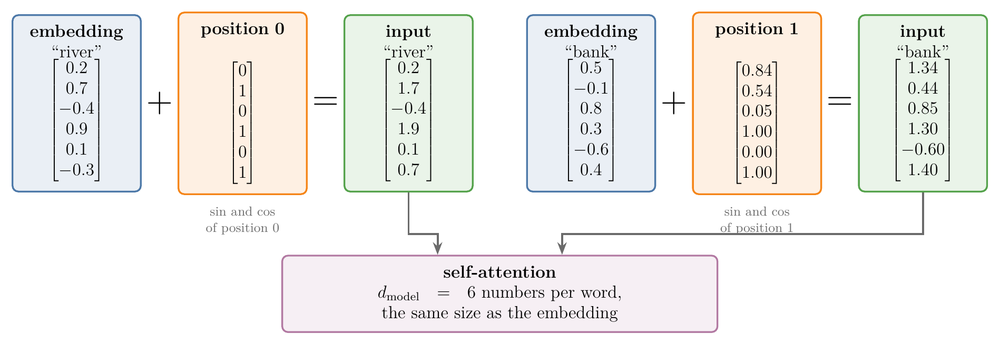
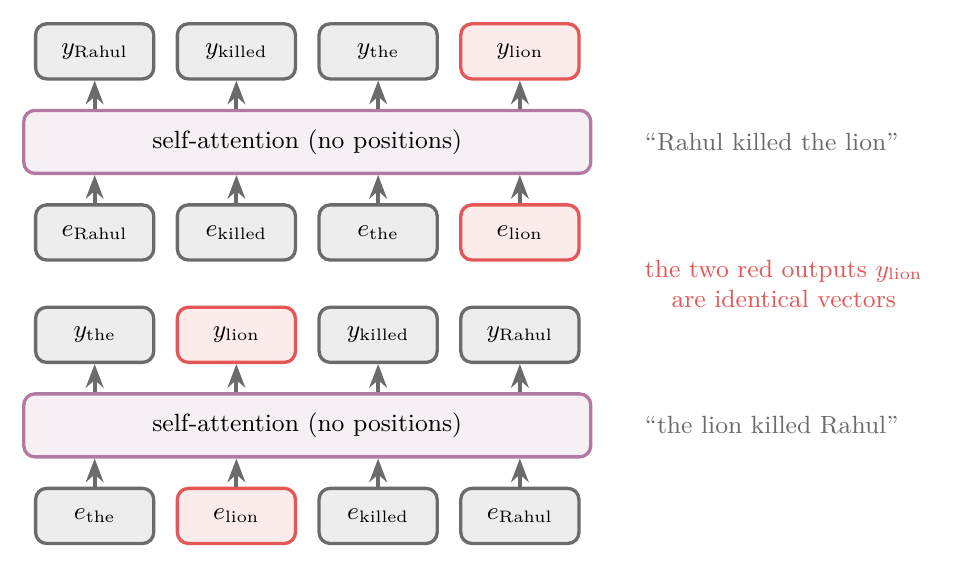
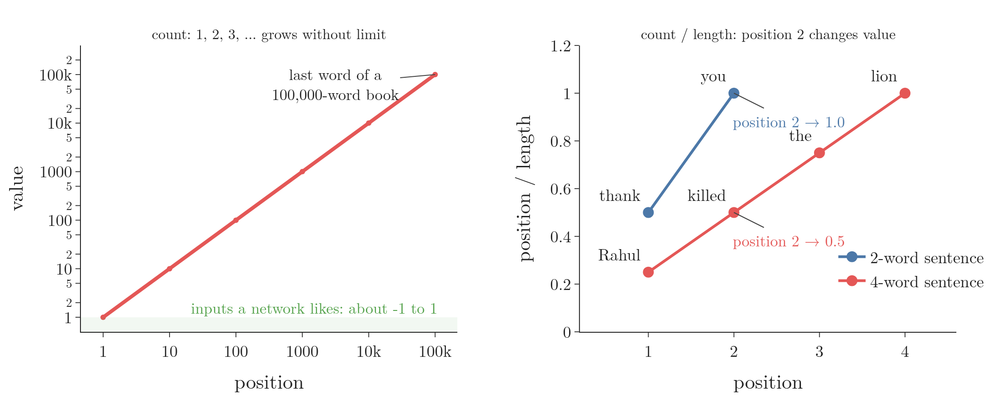
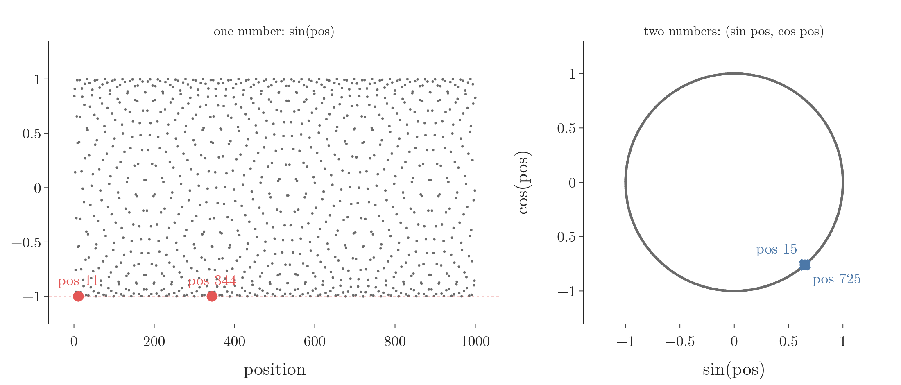
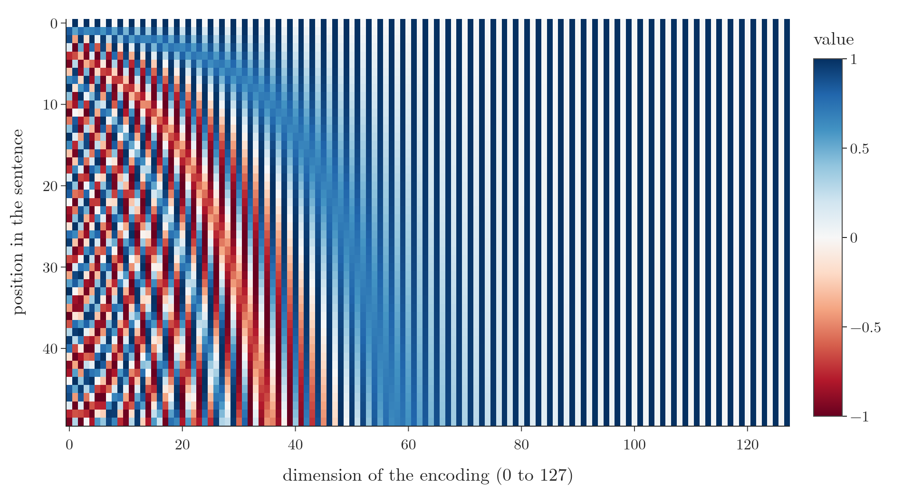
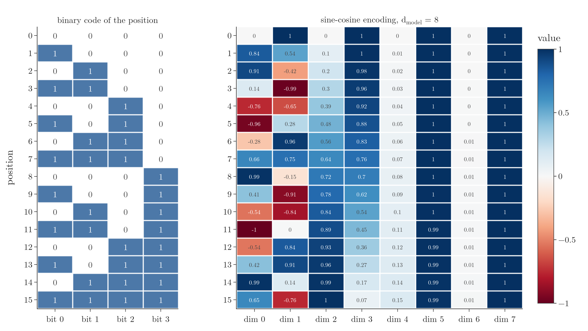
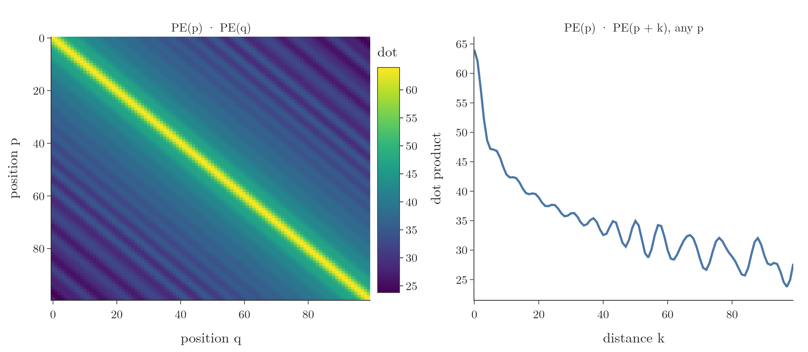

<!-- where-this-fits: generated by course_map/build_map.py; edit concepts.yaml, not this block -->
> **Where this fits:** Pipeline map step 8 (Model). See the [Course map](../01-course-map/note.md).
>
> 
>
> - **Builds on:** Self-attention (query, key, value) ([Note 1072](../1072-what-is-self-attention/note.md)).
> - **Leads to:** Transformer encoder ([Note 1080](../1080-transformer-encoder/note.md)).
<!-- /where-this-fits -->

## 1. Overview

> **Key point:** Self-attention reads all words of a sentence at once, so on its own it cannot tell "Rahul killed the lion" from "the lion killed Rahul". A **positional encoding** (G-1528) fixes this: for every position we build a vector of sines and cosines of different frequencies, of the same size as the word embedding, and add it to the embedding before self-attention.

**Self-attention** (G-1763), taught in the [self-attention Note](../1073-self-attention-step-by-step/note.md), turns the embeddings of a sentence into **contextual embeddings** (G-462): vectors that depend on the other words around each word. It has two strengths: it captures context, and it computes all words in parallel. The second strength has a price. Because all words go in together, self-attention has no idea which word came first.

This Note builds the fix step by step. We start from the simplest idea (count the words), find its problems, and improve it until we reach the formula of "Attention Is All You Need" (Vaswani et al. 2017, §3.5). Figure 1 shows where the result goes: each word's embedding plus its position's encoding becomes the input of self-attention.

{width=100%}

## 2. Prerequisites

- [Self-attention Note](../1073-self-attention-step-by-step/note.md): queries, keys, values and contextual embeddings.
- [Word embeddings](../1057-rnn-sentiment-analysis/note.md), section 6: each word as a dense vector of $d$ numbers.
- [Why RNNs are needed](../1055-why-rnn/note.md): word order carries meaning ("dog bites man" against "man bites dog").
- [Data scaling Note](../1023-data-scaling-in-ann/note.md): why a network trains badly on inputs with very large values.

## 3. Why the transformer needs positions

> **Key point:** Self-attention gives every word the same output whatever the order of the other words. Shuffle the sentence, and the outputs are only shuffled with it.

An RNN reads "Rahul killed the lion" one word per time step: "Rahul" at step 1, "killed" at step 2, and so on. The order is built into the way it reads. Self-attention sends all four embeddings in at the same time, and each output is a weighted sum over all the words. Nothing in that computation says which word stood where. For self-attention, "Rahul killed the lion" and "the lion killed Rahul" are the same set of words, although they mean opposite things.

The Notebook checks this. One self-attention layer (Keras' `MultiHeadAttention`, one head, random weights) reads both sentences, with the same embedding for each word in both. The output vector for "lion" is identical in both sentences, and so is every other word's (Figure 2).

{width=75%}

On a sentence of 12 words shuffled at random, the outputs are the original outputs shuffled in the same way, to within $2 \times 10^{-7}$.

Vaswani et al. (2017, §3.5) state the consequence: since the model "contains no recurrence and no convolution", it must be given "some information about the relative or absolute position of the tokens". A **positional encoding** is that information: a vector that says where a word stands. Once we add positional encodings to the embeddings (section 6), the same word gets different outputs in the two sentences (the Notebook measures changes of up to 1.68 in a single number).

{width=100%}

Figure 3 shows the before and after for the two words that swap roles. In the top row the blue and orange bars are equal: the layer cannot tell who killed whom. In the bottom row every pair differs, by up to 1.32 for "rahul" and 0.33 for "lion": the word order now reaches the output.

## 4. First idea: count the words

> **Key point:** Giving each word its index 1, 2, 3, ... has three problems: the numbers grow without limit, they are whole numbers with nothing in between, and they make distances between words hard to use. Dividing by the sentence length keeps the numbers small but gives the same position different values in different sentences.

The simplest idea is to count. "Rahul" is word 1, "killed" word 2, "the" word 3, "lion" word 4. If each embedding has 512 numbers, we append a 513th number holding the position. Three problems follow.

1. **Unbounded.** The numbers have no upper limit. A book of 500 pages with 200 words per page has 100,000 words, so its last word gets the value 100,000. Networks train best when their inputs are small, roughly between $-1$ and $1$; huge input values make the gradients unstable (see the [data scaling Note](../1023-data-scaling-in-ann/note.md) and the [vanishing and exploding gradients Note](../1018-vanishing-exploding-gradients/note.md)).

   Dividing each position by the sentence length keeps every value between 0 and 1, but it breaks consistency:

   1. **In words:** position $p$ in a sentence of $n$ words gets $p/n$.
   2. **Formula:** $\text{value}(p) = p / n$.
   3. **Example:** in "thank you" ($n = 2$) the values are 0.5 and 1.0. In "Rahul killed the lion" ($n = 4$) they are 0.25, 0.5, 0.75 and 1.0. The second word gets 1.0 in one sentence and 0.5 in the other.

   The network sees the same position with different values in different training sentences, so it cannot learn what "second word" means. The value for a position must not depend on the sentence. Figure 4 shows both counting ideas side by side.

{width=100%}

2. **Discrete.** Positions 1, 2, 3, 4 are whole numbers with nothing in between. A smooth function of the position gives nearby positions nearby values, which helps a model capture that "position 4 in an input is more closely related to position 5 than it is to position 17" (Jurafsky and Martin, SLP3 §7.4).

3. **No relative position.** Counting gives each word a unique **absolute position** (G-158): its place counted from the start. What often matters more is the **relative position** (G-1666) of two words: how far apart they are, such as "the" coming two words after "Rahul". Raw indices give the network no easy way to read off such distances. Section 8 shows how the final encoding makes every distance a simple, fixed operation.

So we want a function of the position that is **bounded** (G-327; its values stay in a fixed range), **continuous** (smooth, defined between whole positions) and **periodic** (G-1489; repeating, which section 8 uses for relative positions).

## 5. From one sine wave to many

> **Key point:** $\sin(\text{pos})$ is bounded, smooth and periodic, but because it repeats, two positions can get almost the same value. Using sine and cosine together, and adding more pairs with lower frequencies, makes every position's vector distinct.

### 5.1 One sine wave

> **Key point:** A sine wave solves all three problems of counting, but it repeats.

The sine function stays between $-1$ and $1$ (bounded), has a value at every $x$ (continuous) and repeats every $2\pi$ (periodic). We use the position as $x$ and $\sin(\text{pos})$ as the encoded value:

| Word | Rahul | killed | the | lion |
|---|---|---|---|---|
| Position | 1 | 2 | 3 | 4 |
| $\sin(\text{pos})$ | 0.84 | 0.91 | 0.14 | $-0.76$ |

Each value is appended to the word's embedding. The problem is the repetition. Each position must get its own value: if two positions had the same value, the model would read them as the same position. Because the sine wave repeats, two positions far apart can land on almost the same height. Among positions 1 to 1,000, positions 11 and 344 differ by only $1.3 \times 10^{-7}$ (Notebook): practically the same value (Figure 5, left).

{width=100%}

### 5.2 A sine and a cosine

> **Key point:** Two numbers per position, $\sin(\text{pos})$ and $\cos(\text{pos})$, turn the encoding from a single number into a vector, and repeats become rarer.

Now each position gets two numbers. For "Rahul" (position 1) the vector is $[\sin 1, \cos 1] = [0.84, 0.54]$; for "killed" it is $[\sin 2, \cos 2] = [0.91, -0.42]$. Both numbers have to match for two positions to collide. Collisions become rarer but do not disappear: positions 15 and 725 still differ by only $6 \times 10^{-5}$ (Figure 5, right).

### 5.3 More pairs, lower frequencies

> **Key point:** Each extra sine-cosine pair turns more slowly than the one before. Two positions must then match in every pair at once, which becomes very unlikely, provided the frequencies are spread far enough apart.

If repeats remain, we add another pair, $\sin(\text{pos}/2)$ and $\cos(\text{pos}/2)$, which turns half as fast. Now four numbers must match. The Notebook measures the closest pair of positions among positions 1 to 1,000:

| Encoding | Numbers per position | Closest positions | Distance between their vectors |
|---|---|---|---|
| $\sin(\text{pos})$ | 1 | 11 and 344 | 0.00000013 |
| $\sin$, $\cos$ of pos | 2 | 15 and 725 | 0.00006 |
| plus $\sin$, $\cos$ of pos/2 | 4 | 398 and 775 | 0.0099 |
| $\sin$, $\cos$ of pos, pos/10, pos/100 | 6 | 51 and 679 | 0.32 |

The third row shows a trap. Positions 398 and 775 are 377 apart, and $377 \approx 60 \times 2\pi = 376.99$: the first pair makes almost exactly 60 full turns between them, and the pair at pos/2 makes almost exactly 30. Frequencies that are simple multiples of each other repeat together. When the frequencies shrink by a large factor each time (1, 1/10, 1/100), the nearest pair of positions is 0.32 apart: every position gets a clearly different vector. The formula of the paper, next, spreads its frequencies in exactly this way.

## 6. The formula of "Attention Is All You Need"

> **Key point:** The positional encoding of a position is a vector of $d_{\text{model}}$ numbers. Each pair of dimensions $(2i, 2i+1)$ holds the sine and cosine of $\text{pos}/10000^{2i/d_{\text{model}}}$, so the **frequency** (G-806) falls as $i$ grows. The vector is added to the embedding.

### 6.1 Same size, added

> **Key point:** The encoding has as many numbers as the embedding, and the two are added element by element, not concatenated.

Vaswani et al. (2017, §3.5) give the positional encodings "the same dimension $d_{\text{model}}$ as the embeddings, so that the two can be summed". Here $d_{\text{model}}$ is the number of values in each embedding: 512 in the paper. Every word therefore gets a positional encoding vector of 512 numbers, and the sum of the two vectors, still 512 numbers, goes into self-attention (Figure 1).

Why add instead of concatenating, as in section 4? Concatenation would double the size of every input vector, from 512 to 1,024. Every weight matrix that reads the input, such as $W_Q$, $W_K$ and $W_V$ in self-attention, would need twice as many rows, so the model would have more parameters and take longer to train. Adding keeps the size unchanged.

### 6.2 The values

> **Key point:** Even dimensions hold sines, odd dimensions hold cosines; dimension pair $i$ uses the angle $\text{pos}/10000^{2i/d_{\text{model}}}$.

1. **In words:** for position $\text{pos}$ (counted from 0) and dimension pair $i = 0, 1, \dots, d_{\text{model}}/2 - 1$, compute an angle by dividing the position by $10000^{2i/d_{\text{model}}}$. Dimension $2i$ gets the sine of the angle, dimension $2i+1$ its cosine.
2. **Formula** (Vaswani et al. 2017, §3.5):
   $$PE_{(\text{pos},\thinspace2i)} = \sin\negthinspace\left(\frac{\text{pos}}{10000^{2i/d_{\text{model}}}}\right), \qquad PE_{(\text{pos},\thinspace2i+1)} = \cos\negthinspace\left(\frac{\text{pos}}{10000^{2i/d_{\text{model}}}}\right)$$
3. **Example:** the sentence "river bank" with $d_{\text{model}} = 6$, so $i = 0, 1, 2$. The angle rates $1/10000^{2i/6}$ are 1, 0.0464 and 0.0022.
   - "river" has $\text{pos} = 0$. Every angle is 0, and $\sin 0 = 0$, $\cos 0 = 1$:
     $$PE(0) = [0,\ 1,\ 0,\ 1,\ 0,\ 1]$$
   - "bank" has $\text{pos} = 1$. The angles are 1, 0.0464 and 0.0022:
     $$PE(1) = [\sin 1,\ \cos 1,\ \sin 0.0464,\ \cos 0.0464,\ \sin 0.0022,\ \cos 0.0022]$$
     $$\phantom{PE(1)} = [0.8415,\ 0.5403,\ 0.0464,\ 0.9989,\ 0.0022,\ 1.0000]$$

   The Notebook computes the same two vectors.

This is the **sinusoidal positional encoding** (G-1815). Each dimension of the encoding is a sinusoid; the wavelengths "form a geometric progression from $2\pi$ to $10000 \cdot 2\pi$" (Vaswani et al. 2017, §3.5). With $d_{\text{model}} = 512$, the first pair repeats every 6.28 positions and the last every 60,611 positions, and each wavelength is 1.0366 times the one before (Notebook). These are the widely spread frequencies that section 5.3 asked for.

{height=55%}

Figure 6 builds the encoding position by position. The fast wave (dimension 0) moves a lot from one position to the next; the slow waves (dimensions 64 and 96) hardly move over 50 positions.

> **Python:** The whole encoding in NumPy, one row per position.
>
> ```python
> import numpy as np
>
> def positional_encoding(n_pos, d_model):
>     pos = np.arange(n_pos)[:, None]
>     i = np.arange(d_model // 2)[None, :]
>     angle = pos / 10000 ** (2 * i / d_model)
>     pe = np.zeros((n_pos, d_model))
>     pe[:, 0::2] = np.sin(angle)       # even dimensions
>     pe[:, 1::2] = np.cos(angle)       # odd dimensions
>     return pe
>
> positional_encoding(2, 6).round(4)    # river, bank
> ```

## 7. Reading the heatmap

> **Key point:** In the heatmap of the encodings, the first dimensions change from position to position and the last ones barely change. Fast waves tell neighbouring positions apart; slow waves tell distant positions apart.

Figure 7 is the standard picture of positional encoding: 50 positions (rows) with $d_{\text{model}} = 128$ (columns), each value coloured from $-1$ (red) to $1$ (blue).

{width=95%}

- **Row 0** alternates white and blue: $0, 1, 0, 1, \dots$, as in the "river" example.
- **The left dimensions** have high frequencies, so their values change at every position. Over the 50 positions, each of dimensions 0 to 7 covers the full range from $-1$ to $1$.
- **The right dimensions** have very low frequencies, so their values hardly change. Over the same 50 positions, dimensions 120 to 127 move by less than 0.009 (Notebook). On those dimensions alone, the 50 positions look the same.

With a longer sentence, the slow waves get room to change as well, and the right-hand dimensions start to differ too.

The pattern is the same as in binary counting (Figure 8). In the binary codes of 0 to 15, the lowest bit flips at every number, the next bit every 2 numbers, the next every 4, the next every 8. The positional encoding does the same with smooth values: its first pair turns fastest, and each later pair more slowly. It is a continuous version of a binary code.

{width=100%}

## 8. Why sine and cosine together

> **Key point:** The sine and cosine of the same angle are a point on a circle. Moving $k$ positions along the sentence turns every such point by a fixed angle, whatever the start. That is what makes distances easy to use.

Section 4 left one problem open: counting gives absolute positions but no easy handle on the distance between two words. Vaswani et al. (2017, §3.5) chose sinusoids "because we hypothesized it would allow the model to easily learn to attend by relative positions, since for any fixed offset $k$, $PE_{\text{pos}+k}$ can be represented as a linear function of $PE_{\text{pos}}$". A **linear function** here means multiplication by a matrix. This section derives that matrix.

### 8.1 One matrix per distance

> **Key point:** For every distance $k$ there is one matrix $M_k$ with $M_k\thinspace PE(p) = PE(p + k)$ for every position $p$. The matrix is a **rotation matrix** (G-1708) for each sine-cosine pair.

Start with the picture. A pair $(\sin \omega p,\ \cos \omega p)$ is a point on a circle of radius 1, like the tip of a clock hand. At position 0 the pair is $(0, 1)$: the hand points to 12 o'clock. As the position $p$ grows, the hand turns clockwise, by the angle $\omega$ per position. Figure 9 shows the four pairs of an encoding with $d_{\text{model}} = 8$, whose angle rates are 1, 0.1, 0.01 and 0.001.

{height=50%}

Watch two things in Figure 9. First, each hand turns 10 times more slowly than the one before, the clock version of the heatmap of section 7. Second, moving 10 positions turns the second hand by 1 radian (57.3 degrees) when we go from position 10 to 20, and by the same 1 radian when we go from 30 to 40. The size of the turn depends on the distance, not on the start. The formal version follows.

Take one pair of dimensions, with angle rate $\omega$ (so the pair holds $\sin \omega p$ and $\cos \omega p$).

1. **In words:** moving from position $p$ to $p + k$ adds $\omega k$ to the angle. Adding a fixed angle is a rotation, and the rotation does not depend on $p$.
2. **Formula:** by the angle-addition rules $\sin(a + b) = \sin a \cos b + \cos a \sin b$ and $\cos(a + b) = \cos a \cos b - \sin a \sin b$,
   $$\begin{bmatrix} \sin \omega(p + k) \cr\cos \omega(p + k) \end{bmatrix} = \begin{bmatrix} \cos \omega k & \sin \omega k \cr-\sin \omega k & \cos \omega k \end{bmatrix} \begin{bmatrix} \sin \omega p \cr\cos \omega p \end{bmatrix}$$
   The $2 \times 2$ matrix contains only $k$, not $p$. Placing one such block for every pair along the diagonal of a $d_{\text{model}} \times d_{\text{model}}$ matrix gives $M_k$, with $M_k\thinspace PE(p) = PE(p + k)$.
3. **Example:** with $\omega = 1$ and $k = 1$, the matrix is $\begin{bmatrix} 0.540 & 0.841 \cr-0.841 & 0.540 \end{bmatrix}$. Applied to position 1, $[\sin 1, \cos 1] = [0.841, 0.540]$:
   $$[0.540 \times 0.841 + 0.841 \times 0.540,\ \ -0.841 \times 0.841 + 0.540 \times 0.540] = [0.909,\ -0.416] = [\sin 2,\ \cos 2]$$

The Notebook builds $M_{10}$ for $d_{\text{model}} = 128$ and checks it on three starting points: it takes $PE(10)$ to $PE(20)$, $PE(30)$ to $PE(40)$ and $PE(40)$ to $PE(50)$. Likewise $M_5$ takes $PE(5)$ to $PE(10)$, $PE(12)$ to $PE(17)$ and $PE(21)$ to $PE(26)$. Every error is below $4 \times 10^{-15}$, which is rounding error. One fixed matrix covers a distance of 10, another a distance of 5, wherever in the sentence we start. Because the attention layers already multiply their inputs by learned matrices, they can learn to use such a fixed relationship.

This is also why the encoding uses sine and cosine together. With only sines, $\sin \omega(p + k)$ cannot be computed from $\sin \omega p$ alone: the rotation needs both coordinates of the point on the circle.

### 8.2 The dot product depends only on the distance

> **Key point:** $PE(p) \cdot PE(p + k) = \sum_i \cos(\omega_i k)$: it is the same for every $p$, and it is largest for $k = 0$.

1. **In words:** for each pair, sine times sine plus cosine times cosine is the cosine of the difference of the angles. The difference of the angles depends only on the distance.
2. **Formula:** using $\sin a \sin b + \cos a \cos b = \cos(a - b)$,
   $$PE(p) \cdot PE(q) = \sum_{i=0}^{d_{\text{model}}/2 - 1} \cos\big(\omega_i (p - q)\big)$$
3. **Example:** with $d_{\text{model}} = 128$ there are 64 pairs. For $k = 0$ every cosine is 1, so the dot product is 64. The Notebook measures, over all starting positions $p$ from 0 to 199:

| Distance $k$ | 0 | 1 | 5 | 10 | 50 |
|---|---|---|---|---|---|
| $PE(p) \cdot PE(p + k)$, every $p$ | 64.00 | 62.09 | 47.19 | 42.82 | 34.96 |

The smallest and largest values over all $p$ agree to four decimals: the dot product depends on $k$ alone. Figure 10 shows the same thing as a picture: in the heatmap of all dot products, every diagonal (fixed distance) has a single colour, and the value falls, with small ripples, as the distance grows. Since self-attention scores words by dot products, this gives it a built-in sense of how far apart two positions are.

{width=100%}

> **Extra:** The sine-cosine encoding is fixed: nothing in it is learned. Vaswani et al. (2017, §3.5 and Table 3, row E) also tried **learned positional embeddings** (G-1066), one trainable vector per position, and "found that the two versions produced nearly identical results". They kept the sinusoids "because it may allow the model to extrapolate to sequence lengths longer than the ones encountered during training": a formula gives a vector for any position, while a learned table stops at the longest training position. Jurafsky and Martin (SLP3 §7.4) describe learned absolute positions as the simplest method, and note that later methods such as rotary position embeddings (RoPE) represent relative position directly inside the attention computation.

## 9. Summary

| Idea | Bounded | Same value for a position in every sentence | Distinct positions | Distance as a fixed operation |
|---|---|---|---|---|
| Count: 1, 2, 3, ... | no | yes | yes | no |
| Count / length | yes | no | yes | no |
| $\sin(\text{pos})$ | yes | yes | no: repeats | no |
| Sine-cosine pairs, frequencies $1/10000^{2i/d}$ | yes | yes | yes | yes: rotation $M_k$ |

- Self-attention computes all words in parallel and ignores their order; shuffling the input only shuffles the output.
- A positional encoding is a vector of $d_{\text{model}}$ numbers per position, added to the word's embedding.
- Dimension $2i$ holds $\sin(\text{pos}/10000^{2i/d_{\text{model}}})$, dimension $2i+1$ the cosine; the wavelengths grow geometrically from $2\pi$ to $10000 \cdot 2\pi$.
- Early dimensions change fast, late dimensions slowly, like the bits of a binary counter.
- For every distance $k$ a fixed matrix takes $PE(p)$ to $PE(p + k)$, and $PE(p) \cdot PE(p + k)$ depends only on $k$.

## 10. Sources

**Built from**

- CampusX, "Positional Encoding in Transformers | Deep Learning | CampusX", YouTube, https://www.youtube.com/watch?v=GeoQBNNqIbM
- StatQuest with Josh Starmer, "Transformer Neural Networks, ChatGPT's foundation, Clearly Explained!!!", YouTube, https://www.youtube.com/watch?v=zxQyTK8quyY (11:30: reversing the word order changes the position-encoded vectors; Figure 3)

**Other references**

- Vaswani, A. et al. (2017). Attention Is All You Need. *NeurIPS 2017*. arXiv:1706.03762. Section 3.5 (formula, same dimension as the embeddings, wavelengths from $2\pi$ to $10000 \cdot 2\pi$, linear function for a fixed offset, learned embeddings nearly identical, extrapolation); Table 3, row (E).
- Jurafsky, D. and Martin, J. H. *Speech and Language Processing*, 3rd ed. draft (19 August 2026). Chapter 7, section 7.4: absolute and sinusoidal position embeddings, "position 4 ... more closely related to position 5 than ... to position 17", RoPE.

## 11. Key terms

| Term | Meaning |
|---|---|
| Positional encoding | A vector added to each word's embedding that tells the model the word's position |
| $d_{\text{model}}$ | The number of values in each embedding and each positional encoding; 512 in the original transformer |
| Absolute position | A word's place counted from the start of the sentence |
| Relative position | The distance between two words, such as "two words later" |
| Bounded function | A function whose values stay within a fixed range, such as $-1$ to $1$ for sine |
| Periodic function | A function that repeats after a fixed interval, its period |
| Frequency and wavelength | How fast a wave repeats, and the distance after which it repeats; one is the inverse of the other |
| Sinusoidal positional encoding | The fixed encoding of Vaswani et al.: sines in even dimensions, cosines in odd ones, frequencies $1/10000^{2i/d_{\text{model}}}$ |
| Learned positional embedding | A trainable vector per position, learned like a word embedding |
| Rotation matrix $M_k$ | The fixed matrix that turns the encoding of any position $p$ into that of $p + k$ |
