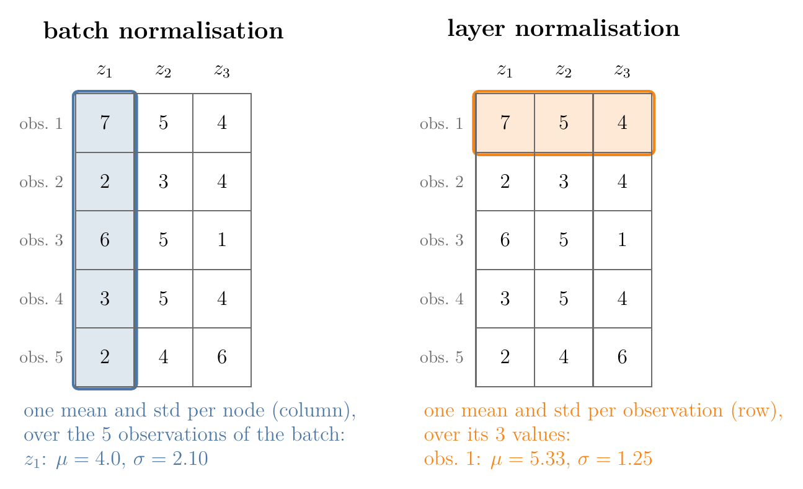
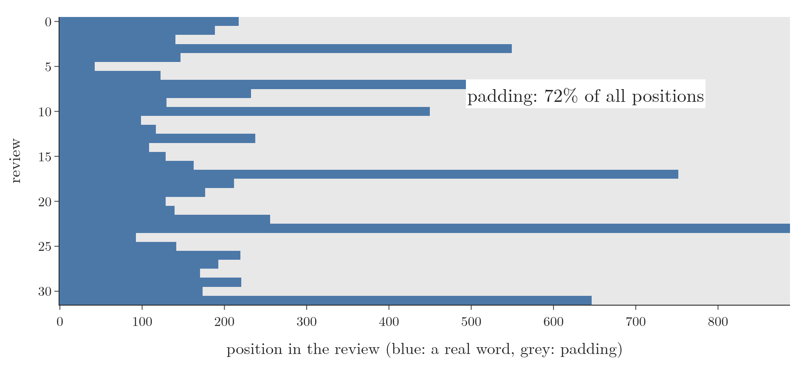

<!-- where-this-fits: generated by course_map/build_map.py; edit concepts.yaml, not this block -->
> **Where this fits:** Pipeline map step 8 (Model). See the [Course map](../01-course-map/note.md).
>
> 
>
> - **Leads to:** Transformer encoder ([Note 1080](../1080-transformer-encoder/note.md)).
> - **Compare with:** Batch normalisation ([Note 1031](../1031-batch-normalization/note.md)).
<!-- /where-this-fits -->

## 1. Overview

> **Key point:** Layer normalisation standardises each observation on its own, across its features, instead of each feature across the batch. In a transformer every word vector is normalised by its own mean and standard deviation, so the padding added to short sentences cannot distort the statistics of real words, as it does with batch normalisation.

The transformer has one component left before its full architecture: normalisation. It uses **layer normalisation** (Ba, Kiros and Hinton 2016), not the batch normalisation of the [batch normalisation Note](../1031-batch-normalization/note.md). Both standardise values to mean 0 and standard deviation 1 and then rescale them with learned $\gamma$ and $\beta$. They differ in which numbers they average over (Figure 1).

{width=85%}

This Note recaps normalisation and batch normalisation, shows why batch normalisation fails on padded sentences, and then builds layer normalisation and its place in the transformer.

## 2. Prerequisites

- [Batch normalisation Note](../1031-batch-normalization/note.md): normalising a node over the mini-batch, $\gamma$ and $\beta$, moving averages.
- [Standardization Note](../24-standardization/note.md): $(x - \mu)/\sigma$ gives mean 0 and standard deviation 1.
- [Self-attention Note](../1073-self-attention-step-by-step/note.md): one contextual vector per word, of the same size as the embedding.
- [RNN sentiment analysis Note](../1057-rnn-sentiment-analysis/note.md): padding reviews to a common length; word embeddings.

## 3. Normalisation in deep learning

> **Key point:** We normalise the inputs and the hidden-layer activations so that their values stay in a fixed range. Training becomes more stable and faster.

**Normalisation** transforms data so that it has chosen statistical properties, usually mean 0 and variance 1. Standardisation (subtract the mean, divide by the standard deviation) is one form; min-max scaling into a fixed range is another.

In a neural network we can normalise two things:

1. **the inputs**, the **features** (input variables, one column each of the data table) given to the first layer (the [data scaling Note](../1023-data-scaling-in-ann/note.md));
2. **the activations** of hidden layers, which are the inputs of the next layer.

The benefits, covered in the [batch normalisation Note](../1031-batch-normalization/note.md), are more stable training, faster convergence, less internal covariate shift (each layer's inputs drifting as earlier weights change) and, for batch normalisation, a mild regularising effect. Batch normalisation and layer normalisation are two ways of normalising activations.

## 4. Batch normalisation, recapped as a table

> **Key point:** Batch normalisation computes one mean and one standard deviation per node, over the observations of the batch: down each column of the table of $z$ values.

Take a network with two input features and one hidden layer of 3 nodes. A batch of 5 **observations** (one record each, one row of the data table) goes in. Each node computes its weighted sum $z$ for every observation, giving the $5 \times 3$ table of Figure 1: column $z_1$ holds node 1's values 7, 2, 6, 3, 2.

Batch normalisation standardises each column separately, then scales by the node's $\gamma$ and shifts by its $\beta$ (the [batch normalisation Note](../1031-batch-normalization/note.md), section 4):

1. **In words:** for node 1, subtract the mean of its 5 values and divide by their standard deviation.
2. **Formula:** $\hat z_{n,j} = \dfrac{z_{n,j} - \mu_j}{\sqrt{\sigma_j^2 + \epsilon}}$, with $\mu_j$ and $\sigma_j^2$ the mean and variance of column $j$ over the batch, then $\gamma_j \hat z_{n,j} + \beta_j$.
3. **Example:** column $z_1$ has $\mu_1 = (7 + 2 + 6 + 3 + 2)/5 = 4$ and $\sigma_1 = 2.10$. The first value becomes $(7 - 4)/2.10 = 1.43$. With $\gamma_1 = 1$ and $\beta_1 = 0$, their starting values, it stays 1.43.

The column means of $z_2$ and $z_3$ are 4.4 and 3.8. After batch normalisation every column has mean 0 and standard deviation 1. Keras' `BatchNormalization` returns the same table to within $3 \times 10^{-7}$ (Notebook).

## 5. Why batch normalisation fails on sentences

> **Key point:** Sentences in a batch have different lengths, so the short ones are padded with zero vectors. Batch normalisation averages over all positions, padding included, so its mean and standard deviation describe mostly padding, not words.

### 5.1 Two padded sentences

> **Key point:** Stacking the word vectors of a padded batch and normalising each column mixes the zeros of the padding into every column's statistics.

In a transformer, the normalisation comes right after self-attention, which turns each word's embedding into a contextual vector of the same size. Self-attention can process several sentences at once as a batch, but every sentence in the batch must have the same number of words. Shorter sentences are filled up with **padding**: extra positions holding zero vectors.

Take a batch of two sentences with 3-number vectors: "hi rahul" (2 words) and "how are you today" (4 words). The first sentence gets two padding rows. The batch is one tensor of shape $(2, 4, 3)$: 2 sentences, 4 positions, 3 numbers per position. Batch normalisation treats each of the 3 numbers as a feature and stacks all 8 positions as rows (the Notebook's example vectors):

| Sentence | Word | dim 1 | dim 2 | dim 3 |
|---|---|---|---|---|
| 1 | hi | 6.1 | 3.2 | 1.3 |
| 1 | rahul | 1.1 | 7.5 | 8.3 |
| 1 | (padding) | 0 | 0 | 0 |
| 1 | (padding) | 0 | 0 | 0 |
| 2 | how | 5.9 | 6.8 | 5.3 |
| 2 | are | 8.5 | 7.5 | 1.0 |
| 2 | you | 7.9 | 1.3 | 6.8 |
| 2 | today | 2.4 | 7.9 | 5.3 |

Each column's mean and standard deviation now include the two rows of zeros:

| | dim 1 | dim 2 | dim 3 |
|---|---|---|---|
| Mean over all 8 rows | 3.99 | 4.28 | 3.50 |
| Mean over the 6 real words | 5.32 | 5.70 | 4.67 |

The padding pulls every mean down by about a quarter. Keras' `BatchNormalization`, applied to the $(2, 4, 3)$ tensor, uses exactly these 8 rows (Notebook). The padding zeros are not part of the data; they exist only so that the sentences fit in one tensor. Statistics computed with them do not represent the data.

### 5.2 A real batch of reviews

> **Key point:** In a batch of 32 real IMDB reviews, 72% of all positions are padding. As the padding grows, the batch-normalised value of a fixed real word keeps changing; its layer-normalised value does not move.

Real batches are far worse than the toy example. The first 32 reviews of the IMDB training set have between 43 and 888 words (median 175). Padded to the longest review, 72% of all positions are padding (Figure 2).

{width=95%}

The Notebook gives every word an 8-number vector (a random embedding with mean 2 and standard deviation 1 stands in for the output of the layer before), sets the padding vectors to zero, and follows one real word: the first word of the first review, feature 1. For this feature, the mean over the real words is 2.05, but batch normalisation, counting the padding, uses 0.58.

Then the same 32 reviews are padded to more positions, as happens when a longer review joins the batch. Nothing about the real words changes:

| Padded to | Share of padding | Batch norm mean | Batch-normalised value of the word | Layer-normalised value of the word |
|---|---|---|---|---|
| 888 | 72% | 0.58 | 1.76 | 1.63 |
| 1,000 | 75% | 0.52 | 1.90 | 1.63 |
| 1,500 | 83% | 0.34 | 2.43 | 1.63 |
| 2,000 | 87% | 0.26 | 2.87 | 1.63 |
| 2,500 | 90% | 0.21 | 3.24 | 1.63 |

{width=95%}

The batch-normalised value of the same word nearly doubles, from 1.76 to 3.24, only because more zeros were added somewhere in the batch (Figure 3). Computed over the real words alone, batch normalisation would give 0.40. The layer-normalised value stays at 1.63, because layer normalisation looks only at the word's own vector (section 6). The two methods answer different questions, so 1.63 and 0.40 are not meant to agree; what matters is that one of them depends on the padding and the other does not.

Ba, Kiros and Hinton (2016, abstract and §3.1) name two more problems of batch normalisation that matter here: its effect "is dependent on the mini-batch size", and "it is not obvious how to apply it to recurrent neural networks", where sentences of different lengths would need separate statistics for every time step.

## 6. Layer normalisation

> **Key point:** Layer normalisation computes one mean and one standard deviation per observation, over its features: along each row of the table. Each feature still has its own $\gamma$ and $\beta$.

### 6.1 How it works

> **Key point:** Same steps as batch normalisation, other direction: standardise each row, then scale and shift each feature with its $\gamma_j$ and $\beta_j$.

Ba, Kiros and Hinton (2016, §3) "compute the layer normalization statistics over all the hidden units in the same layer": all units of one layer share one mean and standard deviation, and different observations get different ones.

1. **In words:** for one observation, average its values over all the nodes of the layer, find their standard deviation, and standardise each value with these two numbers. Then multiply the value of node $j$ by $\gamma_j$ and add $\beta_j$.
2. **Formula:** for observation $n$ with values $z_{n,1}, \dots, z_{n,H}$ over $H$ nodes,
   $$\mu_n = \frac{1}{H}\sum_{j=1}^{H} z_{n,j}, \qquad \sigma_n^2 = \frac{1}{H}\sum_{j=1}^{H} (z_{n,j} - \mu_n)^2, \qquad \text{LN}(z_{n,j}) = \gamma_j\thinspace\frac{z_{n,j} - \mu_n}{\sqrt{\sigma_n^2 + \epsilon}} + \beta_j$$
3. **Example:** observation 1 of Figure 1 has $z = 7, 5, 4$.
   $$\mu_1 = \frac{7 + 5 + 4}{3} = 5.33, \qquad \sigma_1^2 = \frac{1.67^2 + 0.33^2 + 1.33^2}{3} = 1.56, \qquad \sigma_1 = 1.25$$
   $$\hat{z} = \frac{7 - 5.33}{1.25},\ \frac{5 - 5.33}{1.25},\ \frac{4 - 5.33}{1.25} = 1.34,\ -0.27,\ -1.07$$
   With $\gamma = 1$ and $\beta = 0$ these are the outputs. The value 1.34 for the first number used $\gamma_1$ and $\beta_1$, the second $\gamma_2$ and $\beta_2$, the third $\gamma_3$ and $\beta_3$.

Every row now has mean 0 and standard deviation 1, while the columns no longer do. Keras' `LayerNormalization` gives the same table to within $3 \times 10^{-7}$ (Notebook). Like `BatchNormalization`, it starts with $\gamma = 1$ and $\beta = 0$ and uses $\epsilon = 0.001$.

> **Python:** The two layers on the same table. `BatchNormalization` needs `training=True` to use the batch's own statistics.
>
> ```python
> import numpy as np, keras
>
> Z = np.array([[7, 5, 4], [2, 3, 4], [6, 5, 1],
>               [3, 5, 4], [2, 4, 6]], dtype="float32")
> bn = keras.layers.BatchNormalization()(Z, training=True)
> ln = keras.layers.LayerNormalization()(Z)
> # bn: each column has mean 0, std 1
> # ln: each row has mean 0, std 1
> ```

{height=55%}

Figure 4 runs both on the padded batch of section 5.1. Watch the direction of the box: down the columns for batch normalisation, where the two padding rows join every average, and along the rows for layer normalisation, where they cannot.

### 6.2 What changes compared with batch normalisation

> **Key point:** Statistics per observation, so no dependence on the batch: the same computation in training and prediction, and no moving averages to store.

| | Batch normalisation | Layer normalisation |
|---|---|---|
| Mean and variance computed over | the observations of the batch, per feature | the features of one observation |
| Number of means per batch of 5 observations, 3 nodes | 3 (one per node) | 5 (one per observation) |
| $\gamma$ and $\beta$ | one pair per feature | one pair per feature |
| Depends on the other observations of the batch | yes | no |
| Training and prediction | batch statistics, then moving averages | the same computation |
| Stored numbers per feature | 4 ($\gamma$, $\beta$, moving mean, moving variance) | 2 ($\gamma$, $\beta$) |

Because each observation is normalised on its own, layer normalisation "performs exactly the same computation at training and test times" and works even with a batch of one (Ba, Kiros and Hinton 2016, abstract and §3). The Notebook confirms it: Keras' `LayerNormalization` gives identical outputs in training and prediction mode, while `BatchNormalization` gives outputs up to 1.10 apart on the same reviews.

## 7. Layer normalisation in the transformer

> **Key point:** In a transformer, one observation is one word vector. Each word's $d_{\text{model}}$ numbers are normalised by their own mean and standard deviation, so padding positions affect only themselves.

### 7.1 Normalising each word

> **Key point:** Real words are normalised with statistics from real numbers only; a zero padding row turns into $\beta$.

Return to the padded batch of section 5.1. Layer normalisation takes each of the 8 rows on its own and computes its mean and standard deviation from its 3 numbers. The row of "hi", $[6.1, 3.2, 1.3]$, has mean 3.53 and standard deviation 1.97, and becomes $[1.30, -0.17, -1.13]$ before $\gamma$ and $\beta$, whatever the rest of the batch looks like. As Jurafsky and Martin put it, layer norm "is not applied to an entire transformer layer, but just to the embedding vector of a single token" (SLP3 §7.2.2).

A padding row is all zeros, so its mean is 0 and its variance is 0. It becomes $(0 - 0)/\sqrt{0 + \epsilon} = 0$, and after scaling and shifting $\gamma \times 0 + \beta = \beta$. The Notebook sets $\beta = [0.1, 0.2, 0.3]$ and gets exactly $[0.1, 0.2, 0.3]$ for both padding rows. The padding changes only its own rows. The real words never see it.

> **Extra:** The padding rows of section 5.1 are zero vectors by construction. Self-attention without a mask would not keep them at zero: a padding row has a zero query, so all its scores are 0, its attention weights are equal, and its output is the average of the value vectors. The Notebook gets weights of 0.25 for each of the 4 positions and an output equal to the mean of the value vectors. Keras' `MultiHeadAttention` therefore accepts an `attention_mask` that "prevents attention to certain positions", such as padding (Keras documentation, `MultiHeadAttention`).

### 7.2 Where it sits

> **Key point:** Each sub-layer of the transformer, self-attention or feed-forward, is followed by "add and norm": LayerNorm(x + Sublayer(x)).

Vaswani et al. (2017, §3.1) put a layer normalisation after each of the two sub-layers of an encoder block, the self-attention and the feed-forward network: "the output of each sub-layer is LayerNorm(x + Sublayer(x))". The $x +$ part, a **residual connection**, and the full block are explained in the [transformer encoder Note](../1080-transformer-encoder/note.md).

With $d_{\text{model}} = 512$, a `LayerNormalization` layer holds 1,024 parameters: $\gamma$ and $\beta$ for each of the 512 features, all trainable. A `BatchNormalization` layer of the same size holds 2,048, of which 1,024 are the non-trainable moving means and variances (Notebook).

> **Extra:** Two later variations are common. The most common transformer architecture today is the **prenorm** version, which applies the layer norm before the attention and feed-forward sub-layers; the original transformer is the **postnorm** version, with the norm after them (Jurafsky and Martin, SLP3 §7.2–7.3). Current models also often use **RMSNorm** (Zhang and Sennrich 2019, §4, Eq. 4), which divides by the root mean square of the vector and skips subtracting the mean (SLP3 §7.2.2 and §7.8).

## 8. Summary

| | Batch normalisation | Layer normalisation |
|---|---|---|
| Averages over | the batch, for each feature (down a column) | the features, for each observation (along a row) |
| In a transformer, one statistic per | embedding dimension, over all words and padding of the batch | word |
| Affected by padding | yes | no; a padding row only becomes $\beta$ |
| Training vs prediction | different (moving averages) | identical |
| Parameters per feature | 2 trainable + 2 non-trainable | 2 trainable |

- Normalisation keeps inputs and activations in a fixed range, for stable and fast training.
- Padding fills short sentences with zero vectors; in a real IMDB batch, 72% of positions were padding.
- Batch normalisation's statistics include the padding, so a real word's normalised value depends on how much padding the batch has.
- Layer normalisation standardises each word vector by its own mean and standard deviation, then applies a $\gamma_j$ and $\beta_j$ per feature.
- The transformer applies LayerNorm(x + Sublayer(x)) after each sub-layer.

## 9. Sources

**Built from**

- CampusX, "Layer Normalization in Transformers | Layer Norm Vs Batch Norm", YouTube, https://www.youtube.com/watch?v=qti0QPdaelg

**Other references**

- Ba, J. L., Kiros, J. R. and Hinton, G. E. (2016). Layer Normalization. arXiv:1607.06450. Abstract; section 3 (statistics over all hidden units of a layer; no constraint on batch size); section 3.1 (sentences of different lengths in RNNs).
- Vaswani, A. et al. (2017). Attention Is All You Need. *NeurIPS 2017*. arXiv:1706.03762. Section 3.1 (LayerNorm(x + Sublayer(x))).
- Jurafsky, D. and Martin, J. H. *Speech and Language Processing*, 3rd ed. draft (19 August 2026). Chapter 7, sections 7.2–7.3 (layer norm on the vector of a single token; prenorm and postnorm; RMSNorm) and 7.8.
- Zhang, B. and Sennrich, R. (2019). Root Mean Square Layer Normalization. *NeurIPS 2019*. arXiv:1910.07467. Section 4, Eq. 4 (normalise by the root mean square alone, with no mean subtraction).
- Keras API documentation: `LayerNormalization`, `BatchNormalization` and `MultiHeadAttention` layers, keras.io/api/layers.
- Maas, A. L. et al. (2011). Learning Word Vectors for Sentiment Analysis. *ACL 2011*. The IMDB review dataset.

## 10. Key terms

| Term | Meaning |
|---|---|
| Feature | An input variable, one column of the data table; inside a network, one node's value or one dimension of a word vector |
| Observation | One record of the data, one row of the table; in a transformer, one word vector |
| Normalisation | Transforming values to chosen statistics, usually mean 0 and variance 1 |
| Batch normalisation | Standardising each feature over the observations of the mini-batch, then applying $\gamma$ and $\beta$ |
| Layer normalisation | Standardising each observation over its features, then applying $\gamma_j$ and $\beta_j$ per feature |
| Padding | Extra positions, here zero vectors, that make all sentences of a batch the same length |
| $\gamma$ (gain) and $\beta$ (shift) | Learned parameters, one pair per feature, that rescale and shift the normalised values |
| $\epsilon$ (epsilon) | A tiny number added to the variance to avoid dividing by 0; 0.001 in Keras |
| Add and norm | The step after each transformer sub-layer: LayerNorm(x + Sublayer(x)) |
| RMSNorm | A simpler variant that divides by the root mean square and skips subtracting the mean |
