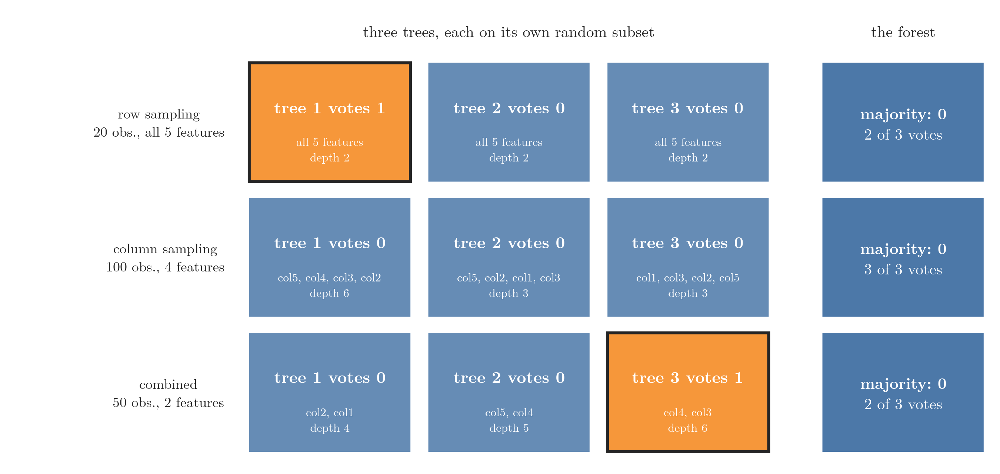
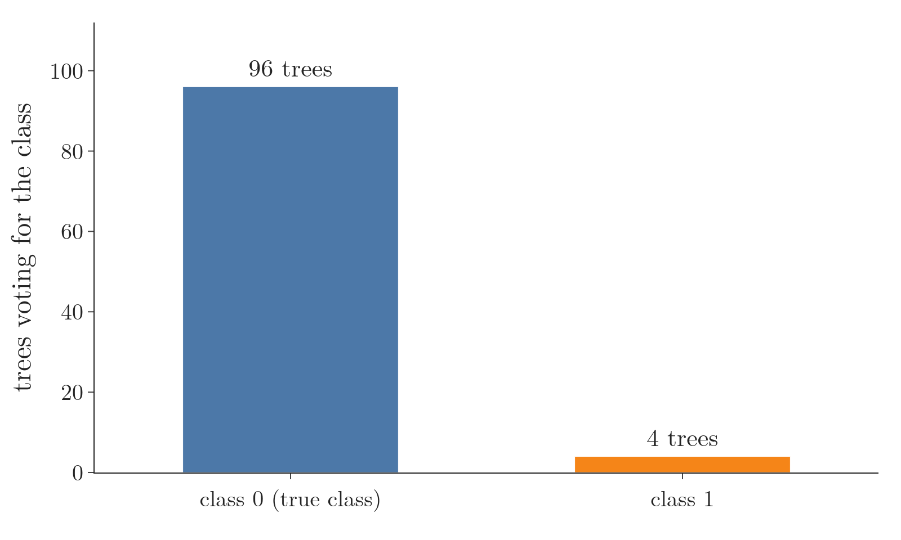

<!-- where-this-fits: generated by course_map/build_map.py; edit concepts.yaml, not this block -->
> **Where this fits:** Pipeline map step 8 (Model). See the [Course map](../01-course-map/note.md).
>
> 
>
> - **Builds on:** Overfitting ([Note 91](../91-knn/note.md)); Hyperparameter tuning ([Note 98](../98-decision-tree-hyperparameters/note.md)); Decision trees ([Note 100](../100-dtreeviz/note.md)); Feature importance ([Note 100](../100-dtreeviz/note.md)); Bagging ([Note 107](../107-bagging-regressor/note.md)); OOB score ([Note 107](../107-bagging-regressor/note.md)).
> - **Leads to:** Balanced random forest ([Note 133](../133-imbalanced-data/note.md)).
> - **Compare with:** Bagging ([Note 107](../107-bagging-regressor/note.md)); Dropout ([Note 1024](../1024-dropout/note.md)).
<!-- /where-this-fits -->

## 1. Overview

> **Key point:** A random forest trains many decision trees, each on a random part of the data, and combines their answers by majority vote (classification) or mean (regression).

{height=48%}

A **random forest** (G-1611) is **bagging** (G-251; the [bagging Note](../105-bagging-intuition/note.md)) with **decision trees** (G-561; the [decision trees Note](../97-decision-trees-intuition/note.md)) as the **base models** (G-260), the models the ensemble combines. Figure 1 shows the whole idea: random subsets of the data go to different trees, each tree predicts, and the forest takes the majority.

This Note covers:

- why random forests are so widely used (section 2);
- where the name comes from (section 3);
- how a random forest works (section 4);
- a small forest of three trees built by hand (section 5).

The next Notes explain:

- why it works so well ([random forest and bias-variance](../109-random-forest-bias-variance/note.md));
- how it differs from plain bagging ([bagging vs random forest](../110-bagging-vs-random-forest/note.md));
- its [hyperparameters](../111-random-forest-hyperparameters/note.md) and their [tuning](../112-random-forest-tuning/note.md);
- the [OOB score](../113-oob-score/note.md) and [feature importance](../114-feature-importance/note.md).

The Notebook (`notebook.ipynb`) runs the forest built by hand.

## 2. Why random forests are so popular

> **Key point:** Strong results on many problems, classification and regression alike, with little tuning.

Three things make the random forest one of the first algorithms to try in a project:

1. **Strong results on many problems.** On many problems a random forest performs about as well as boosting (ESL §15.1), a family of methods (**boosting**, G-318) covered in later Notes. In a comparison of 179 classifiers on 121 datasets, random forests were the best family overall (Fernández-Delgado et al., 2014).
2. **Both problem types.** `RandomForestClassifier` predicts classes and `RandomForestRegressor` predicts numbers.
3. **Little tuning.** Random forests are simpler to train and tune than boosting (ESL §15.1), and the default settings usually give a good result. Little tuning makes the random forest especially friendly for beginners.

> **Extra:** The random forest was published by the statistician Leo Breiman in 2001, in a paper titled *Random Forests* (Breiman, 2001). Breiman had also introduced bagging (Breiman, 1996). The name and the idea of training trees on random subsets of the features came earlier, from Tin Kam Ho's "random decision forests" (Ho, 1995).

## 3. Where the name comes from

> **Key point:** "Forest" because it is a collection of trees; "random" because each tree gets randomly sampled data.

- **Forest:** we train many decision trees together. A group of trees is a forest.
- **Random:** a random forest is a bagging technique, and bagging means **b**ootstrap **agg**regation. Bootstrapping draws a random sample of the data for each tree (the [bagging Note](../105-bagging-intuition/note.md), section 2.1). That random selection gives the "random".

So a random forest is a special case of bagging: bagging lets the base model be any algorithm, and when that algorithm is a decision tree, we call the result a random forest. There is one more, subtler difference, the subject of the [bagging vs random forest Note](../110-bagging-vs-random-forest/note.md).

## 4. How a random forest works

> **Key point:** Step 1, bootstrapping: give each tree a random subset of the observations, features or both, and train it. Step 2, aggregation: send a new point to every tree and take the vote or the mean.

The two steps are those of bagging (the [bagging Note](../105-bagging-intuition/note.md), sections 2 and 6), here with trees:

1. **Bootstrapping:** each tree is trained on its own random subset of the data, made by **row sampling** (G-1712; random **observations**, all features), **column sampling**, also called **feature sampling** (G-413; all observations, random **features**), or **combined sampling** (G-418; both). Here an observation is one record (a row of the data table) and a feature is one input variable (a column). These three ways are the bagging, random subspaces and random patches types of the bagging Note, section 6.
2. **Aggregation** (G-183): a new **query point** (G-1605), the observation we want a prediction for, goes to every tree, and the forest returns the **majority vote** (G-1146; classification) or the mean (regression), as every ensemble does (the [ensemble learning Note](../101-ensemble-learning/note.md), section 3).

Because every tree sees different data, every tree learns a different structure: one splits first on feature 3, another on feature 7, and their split thresholds and depths differ too (Figure 1, middle).

Figure 2 builds a forest of 100 trees this way on the student placement data of the [toy project Note](../13-toy-project/note.md) (two features, CGPA and IQ, 100 students). On the left, each new tree's bootstrap sample: bigger dots were drawn more than once, grey crosses were left out (about a third). The **decision boundary** (G-555) is the line where the predicted class switches from "not placed" to "placed". Watch each single tree put narrow strips of the wrong class around a few points, while the forest's vote map on the right settles into one clean decision boundary near CGPA 6; after about 20 trees, adding more changes it very little.


## 5. A random forest by hand

> **Key point:** Three trees, each trained on its own random subset of a dataset of 100 observations, vote on one query point; with row, column or combined sampling, the majority gets it right even when one tree is wrong.

To see every step, we build a forest of three trees ourselves. Our forest is a simplified version: a real random forest uses many more trees and samples the features in a slightly different way (section 5.4).

### 5.1 The data and the sampling functions

> **Key point:** 100 observations, 5 features, two classes; three small functions draw the subsets.

We make a classification dataset of 100 observations with `make_classification` (the [perceptron code Note](../71-perceptron-code/note.md)): 5 features, in columns `col1` to `col5`, and a **target** (the output we predict) in the column `target`, with classes 0 and 1.

> **Python:** The three ways of sampling.
>
> ```python
> def sample_rows(df, share):
>     n = int(share * len(df))
>     return df.sample(n, replace=True)
>
> def sample_features(df, share):
>     # do not count the target column
>     n = int(share * (df.shape[1] - 1))
>     cols = list(rng.choice(df.columns[:-1], n,
>                            replace=False))
>     return df[cols + ["target"]]
>
> def combined_sampling(df, row_share, col_share):
>     rows = sample_rows(df, row_share)
>     return sample_features(rows, col_share)
> ```
>
> `df.sample(n, replace=True)` draws `n` rows with replacement (the [bagging Note](../105-bagging-intuition/note.md), section 5.2). `rng.choice(columns, n, replace=False)` picks `n` different column names at random; `rng` is NumPy's random generator, `np.random.default_rng(4)`, seeded so every run draws the same subsets. The target column is added back, because every tree needs it to learn.

Each tree is a fully grown `DecisionTreeClassifier`, trained on its subset's features. The query point is observation 7 of the data, whose true class is **0**.

### 5.2 Row sampling

> **Key point:** 20 observations per tree, with replacement: the votes are 1, 0, 0, so the forest says 0.

With `sample_rows(df, 0.2)`, each tree gets 20 observations (20% of 100), drawn with replacement:

| Tree | Observations | Repeated | Depth | Vote |
|---|---|---|---|---|
| 1 | 20 | 2 | 2 | 1 |
| 2 | 20 | 1 | 2 | 0 |
| 3 | 20 | 1 | 2 | 0 |

Tree 1 is wrong, but two trees say 0, so the majority, **0**, is right. Each tree saw different observations, so each placed its decision boundaries in different places (Figure 3, top row).

### 5.3 Column sampling and combined sampling

> **Key point:** 4 of 5 features per tree: all three trees say 0. Half the observations and 2 of 5 features: the votes are 0, 0, 1, so the forest still says 0.

With `sample_features(df, 0.8)` (Figure 3, middle row), each tree gets all 100 observations and 4 of the 5 features (80% of 5). The three trees got different feature sets: (col5, col4, col3, col2), (col5, col2, col1, col3) and (col1, col3, col2, col5). With all the observations, the trees grow deeper (depths 6, 3 and 3), and all three vote **0**.

With `combined_sampling(df, 0.5, 0.5)` (Figure 3, bottom row), each tree gets 50 observations (10 to 14 of them repeats) and 2 of the 5 features (half of 5 is 2.5, and `int` rounds down to 2). Figure 1 shows this setting:

| Tree | Features | Depth | Vote |
|---|---|---|---|
| 1 | col2, col1 | 4 | 0 |
| 2 | col5, col4 | 5 | 0 |
| 3 | col4, col3 | 6 | 1 |

Combined sampling adds the most randomness: the trees differ in both observations and features. The majority is again **0**, the right answer.

{height=40%}

Figure 3 puts the three settings side by side. Watch the black-framed boxes: one tree is wrong in two of the settings, and the majority on the right is still the true class 0 every time.

> **Python:** Asking one tree about the query point.
>
> ```python
> inputs = d.columns[:-1]   # this tree's input columns
> tree = DecisionTreeClassifier().fit(d[inputs], d["target"])
> tree.predict(query[inputs])
> ```
>
> A tree trained on 2 features must be given exactly those 2 columns when it predicts. Selecting `query[inputs]` passes the same columns in the same order.

### 5.4 What a real random forest does differently

> **Key point:** scikit-learn's `RandomForestClassifier` does all this in one line, with 100 trees by default, and samples the features afresh at every split.

> **Python:** A random forest in scikit-learn.
>
> ```python
> from sklearn.ensemble import RandomForestClassifier
>
> rf = RandomForestClassifier(random_state=42)
> rf.fit(df.iloc[:, :5], df["target"])
> rf.predict(query.iloc[:, :5])     # array([0])
> ```

The forest of 100 trees also predicts **0**.

{height=28%}

Figure 4 counts the votes: 96 trees say 0 and 4 say 1. With 100 voters, a few wrong trees barely dent the majority.

Two things differ from our hand-built version:

- **More trees.** Three trees are only enough to show the idea; the default is 100.
- **Column sampling at every split.** Our functions picked the features once per tree. A random forest picks a fresh random set of features at every node of every tree, called **node-level column sampling** (G-1325) (Breiman, 2001, section 4), which makes the trees even less alike (ESL §15.2). Sampling at every split is the main difference between bagging and a random forest, explained in the [bagging vs random forest Note](../110-bagging-vs-random-forest/note.md).

## 6. Summary

| Step | What happens | In our example |
|---|---|---|
| Bootstrapping | each tree gets a random subset: observations, features or both | 3 trees; 20 observations, or 4 features, or 50 observations and 2 features each |
| Training | each subset trains its own fully grown decision tree | trees of depth 2 to 6, all different |
| Aggregation | majority vote (classes) or mean (numbers) | votes 1, 0, 0 and 0, 0, 1: prediction 0 |

- A random forest is bagging with decision trees as the base models.
- "Forest": many trees. "Random": each tree gets randomly sampled data.
- Subsets can be made by row sampling, column sampling or both, with or without replacement.
- A random forest works for classification and regression, and gives strong results with little tuning (ESL §15.1).

## 7. Sources

**Built from**

- CampusX, "Introduction to Random Forest | Intuition behind the Algorithm", YouTube, https://www.youtube.com/watch?v=F9uESCHGjhA
- Starmer, J. (StatQuest). "Random Forests Part 1 - Building, Using and Evaluating." statquest.org. The idea of showing the forest built one bootstrapped tree at a time (Figure 2).

**Other references**

- Breiman, L. (1996). "Bagging Predictors". *Machine Learning* 24(2), 123–140.
- Breiman, L. (2001). "Random Forests". *Machine Learning* 45(1), 5–32.
- Fernández-Delgado, M., Cernadas, E., Barro, S. and Amorim, D. (2014). "Do we Need Hundreds of Classifiers to Solve Real World Classification Problems?" *Journal of Machine Learning Research* 15, 3133–3181.
- Hastie, T., Tibshirani, R. and Friedman, J. (2009). *The Elements of Statistical Learning* (ESL), 2nd ed. Springer, sections 15.1 and 15.2.
- Ho, T. K. (1995). "Random Decision Forests". *Proceedings of the 3rd International Conference on Document Analysis and Recognition*, 278–282.

## 8. Key terms

| Term | Meaning |
|---|---|
| Random forest | Bagging with decision trees as the base models; the trees vote (classification) or are averaged (regression) |
| Observation | One record of the data: one row of the data table |
| Feature | An input variable: one column of the data table |
| Target | The output we predict |
| Row sampling | Giving each base model a random subset of the observations |
| Column sampling (feature sampling) | Giving each base model a random subset of the features |
| Combined sampling | Giving each base model random observations and random features together |
| RandomForestClassifier | scikit-learn's random forest for classification |
| RandomForestRegressor | scikit-learn's random forest for regression |
