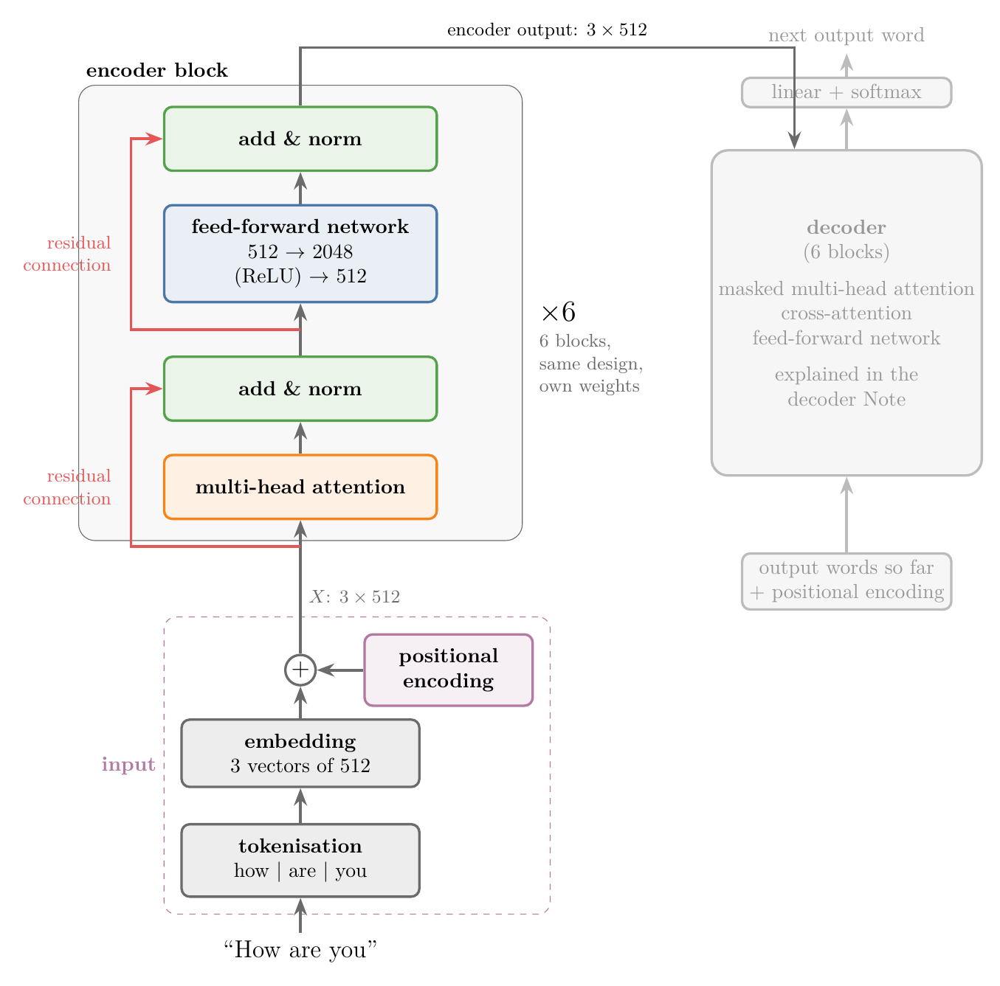

## 1. Overview

> **Key point:** The transformer has two parts, an **encoder** and a **decoder**. The encoder turns a sentence into one context-aware vector per word. It first adds a positional encoding to each word's embedding, then passes the vectors through 6 identical **encoder blocks**. Each block has two **sub-layers**: multi-head attention, then a small **feed-forward network** that works on each word separately. Each sub-layer is wrapped in "add and norm": a **residual connection** adds the sub-layer's input to its output, and a layer normalisation follows. Every vector keeps 512 numbers from start to end.

The earlier Notes built the parts one at a time: self-attention, its scaling, multi-head attention, positional encoding and layer normalisation. This Note puts them together into the encoder of "Attention Is All You Need" (Vaswani et al. 2017, §3.1). The decoder is the subject of the [transformer decoder Note](../1083-transformer-decoder/note.md).

Figure 1 is the whole architecture. The encoder side is drawn in full. The decoder side is greyed out here.

{width=100%}

We follow one sentence, "How are you", through the encoder. Along the way we count shapes and parameters, check a by-hand computation against Keras, and test why each part is there.

## 2. Prerequisites

- [Multi-head attention Note](../1077-multi-head-attention/note.md): 8 heads, concatenation, $W_O$; one 512-number output per word.
- [Positional encoding Note](../1078-positional-encoding/note.md): a 512-number vector per position, added to the word's embedding.
- [Layer normalisation Note](../1079-layer-normalization/note.md): each word's vector normalised by its own mean and standard deviation, then scaled by $\gamma$ and shifted by $\beta$.
- [Self-attention step by step Note](../1073-self-attention-step-by-step/note.md): contextual embeddings from queries, keys and values.
- [Forward propagation Note](../1010-forward-propagation/note.md): a dense layer as a matrix product plus a bias, followed by an activation.
- [Vanishing and exploding gradients Note](../1018-vanishing-exploding-gradients/note.md): why deep networks are hard to train.

## 3. From a black box to the real block

> **Key point:** The transformer is an encoder and a decoder. The encoder is 6 identical blocks in a row. Each block is attention followed by a feed-forward network, with add and norm after each.

The full diagram looks complicated, so we build it up in four steps.

1. **Two boxes.** A transformer is one box holding two boxes: the encoder and the decoder. The encoder reads the input sentence; the decoder writes the output sentence.
2. **Six blocks each.** Next to both boxes the paper's diagram writes "N×". The encoder is a stack of $N = 6$ identical layers, and so is the decoder (Vaswani et al. 2017, §3.1). We call each layer an **encoder block**.
3. **Two sub-layers per block.** Each encoder block has two parts: a multi-head self-attention, then a feed-forward network (Vaswani et al. 2017, §3.1).
4. **Add and norm.** Around each of the two sub-layers sits a residual connection, followed by a layer normalisation: the "add & norm" boxes of Figure 1.

"Identical" means the same design. Every block has its own weights, learned separately (section 6).

The sentence enters at the bottom of the first block. The first block's output is the input of the second block, and so on. The output of the sixth block goes to the decoder.

## 4. The input: from words to vectors

> **Key point:** Three steps happen before the first block: split the sentence into tokens, look up a 512-number embedding for each token, and add the positional encoding of its position. The result is the input matrix $X$, one row per word.

The purple box of Figure 1 does three things to "How are you":

1. **Tokenisation.** The sentence is split into **tokens**, the units the model reads. With word-level tokenisation, each token is a word: "how", "are", "you". The paper itself uses pieces of words, a method called byte-pair encoding (Vaswani et al. 2017, §5.1).
2. **Embedding.** Each token becomes a learned vector of $d_{\text{model}} = 512$ numbers (see the [word embeddings section](../1057-rnn-sentiment-analysis/note.md) of the RNN sentiment Note).
3. **Positional encoding.** The vector of each position, also 512 numbers, is added to the word's embedding, so that the model knows the word order (the [positional encoding Note](../1078-positional-encoding/note.md)).

The three resulting vectors $x_1, x_2, x_3$ are stacked as the rows of a $3 \times 512$ matrix $X$. In practice a batch of many sentences goes in together; here the batch holds one sentence.

## 5. Inside one encoder block

> **Key point:** $X \to$ multi-head attention $\to Z$; add $X$ and normalise $\to Z_{\text{norm}}$; feed-forward network $\to Y$; add $Z_{\text{norm}}$ and normalise $\to Y_{\text{norm}}$. Every one of these matrices is $3 \times 512$, except the hidden layer of the feed-forward network, which is $3 \times 2048$.

Figure 2 shows the path of the three words through one block, with every shape.

{width=100%}

To show real numbers, the Notebook builds a tiny block: $d_{\text{model}} = 4$, 2 heads of 2 numbers, and a feed-forward hidden layer of 8. The embeddings of "how", "are", "you" are made-up values, and the block's weights are Keras' random starting weights. The steps and the formulas are exactly those of the full-size block. We follow the word "how", whose input row, embedding plus positional encoding, is

$$x_{\text{how}} = [0.5,\ 1.0,\ -0.5,\ 0.2] + [0,\ 1,\ 0,\ 1] = [0.5,\ 2.0,\ -0.5,\ 1.2]$$

### 5.1 Multi-head attention

> **Key point:** Multi-head attention turns each word's vector into a contextual vector of the same size, using every word of the sentence.

The first sub-layer is the multi-head attention of the [multi-head attention Note](../1077-multi-head-attention/note.md), with queries, keys and values all taken from $X$. The embedding of a word is the same in every sentence; attention mixes in the other words, so "bank" in "river bank" gets a different vector from "bank" in "money bank". Its output $Z$ has one 512-number row per word, $z_1, z_2, z_3$, each aware of the whole sentence.

For "how" in the tiny block:

$$z_{\text{how}} = [1.08,\ 0.77,\ 0.39,\ -1.21]$$

### 5.2 Add and norm

> **Key point:** Add the sub-layer's input to its output (the residual connection), then apply layer normalisation to each word: $\text{LayerNorm}(x + \text{Sublayer}(x))$.

The paper writes the output of each sub-layer as $\text{LayerNorm}(x + \text{Sublayer}(x))$ (Vaswani et al. 2017, §3.1). Two things happen.

**Add.** Besides going through the attention, $X$ also takes a second path that skips the attention (the red arrow). At the "add" box, the two meet: $Z' = X + Z$. The addition works because both are $3 \times 512$; the paper keeps every sub-layer's output at $d_{\text{model}} = 512$ "to facilitate these residual connections" (Vaswani et al. 2017, §3.1). A path that skips a sub-layer and is added back is a **residual connection** (also called a skip connection). Section 7.1 explains why it is there.

**Norm.** Each row of $Z'$ is then normalised on its own: subtract the row's mean, divide by its standard deviation, multiply by $\gamma$ and add $\beta$ (the [layer normalisation Note](../1079-layer-normalization/note.md)). The result is $Z_{\text{norm}}$.

1. **In words:** add the word's input to its attention output, then standardise the 4 (in the full model, 512) numbers of the sum.
2. **Formula:**
   $$z'_i = x_i + z_i, \qquad z_{\text{norm},i} = \gamma \odot \frac{z'_i - \mu_i}{\sqrt{\sigma_i^2 + \epsilon}} + \beta$$
   where $\mu_i$ and $\sigma_i^2$ are the mean and variance of the numbers in $z'_i$, and $\odot$ multiplies number by number.
3. **Example:** for "how",
   $$z'_{\text{how}} = [0.5 + 1.08,\ 2.0 + 0.77,\ -0.5 + 0.39,\ 1.2 - 1.21] = [1.58,\ 2.77,\ -0.11,\ -0.01]$$
   with mean $\mu = 1.06$ and standard deviation $\sigma = 1.20$. With Keras' starting values $\gamma = 1$, $\beta = 0$:
   $$z_{\text{norm,how}} = \left[\tfrac{1.58 - 1.06}{1.20},\ \tfrac{2.77 - 1.06}{1.20},\ \tfrac{-0.11 - 1.06}{1.20},\ \tfrac{-0.01 - 1.06}{1.20}\right] = [0.44,\ 1.43,\ -0.98,\ -0.89]$$

**Why normalise here.** The outputs of attention have no fixed range, and adding $X$ can make them larger still. Training is more stable when the numbers stay in a small range; layer normalisation brings every word's vector back to mean 0 and standard deviation 1 before the next sub-layer (Ba et al. 2016; the [layer normalisation Note](../1079-layer-normalization/note.md)).

### 5.3 The feed-forward network

> **Key point:** A two-layer network, 512 → 2048 with ReLU → 512 with no activation, applied to each word's vector separately with the same weights: $\text{FFN}(x) = \max(0, xW_1 + b_1)W_2 + b_2$.

The second sub-layer is a small fully connected network (Vaswani et al. 2017, §3.3):

| Layer | Nodes | Activation | Weights | Biases |
|---|---|---|---|---|
| input | 512 | — | — | — |
| hidden | 2048 | ReLU | $W_1$: $512 \times 2048$ | $b_1$: 2048 |
| output | 512 | none (linear) | $W_2$: $2048 \times 512$ | $b_2$: 512 |

1. **In words:** widen each word's vector from 512 to 2048 numbers, set the negative ones to 0 (ReLU), then bring it back to 512 numbers.
2. **Formula:** for the whole matrix at once,
   $$H = \max(0,\ Z_{\text{norm}}W_1 + b_1) \quad (3 \times 2048), \qquad Y = HW_2 + b_2 \quad (3 \times 512)$$
3. **Example:** in the tiny block ($4 \to 8 \to 4$), the row of "how" becomes
   $$h_{\text{how}} = [0.20,\ 0,\ 0.83,\ 0.09,\ 0.21,\ 1.36,\ 0,\ 0.47], \qquad y_{\text{how}} = [-0.78,\ 0.67,\ -0.14,\ -0.31]$$
   Two of the eight hidden values are 0: ReLU cut them off.

The three rows of $Z_{\text{norm}}$ go in together, like a batch of 3 observations (records) for an ordinary network. Each row is still processed on its own. The paper calls the network **position-wise**: it is "applied to each position separately and identically" (Vaswani et al. 2017, §3.3). The Notebook checks both halves of that sentence:

- **Separately:** feeding the three rows one at a time gives exactly the same output as feeding the whole matrix. Changing the vector of "you" changes the output of "you" (by up to 7.13) and leaves the outputs of "how" and "are" exactly as they were.
- **Identically:** the same $W_1, b_1, W_2, b_2$ serve every position.

Words exchange information only in the attention sub-layer: the same change to "you" alters the attention output of every word (by 1.59, 4.12 and 5.75 for "how", "are", "you").

### 5.4 Add and norm again, then the next block

> **Key point:** The feed-forward output gets its own residual connection and layer normalisation. The result, still $3 \times 512$, is the input of the next block.

The second add and norm repeats section 5.2, with $Z_{\text{norm}}$ as the input that skips the sub-layer:

$$Y' = Z_{\text{norm}} + Y, \qquad Y_{\text{norm}} = \text{LayerNorm}(Y')$$

For "how": $y'_{\text{how}} = [0.44 - 0.78,\ 1.43 + 0.67,\ -0.98 - 0.14,\ -0.89 - 0.31] = [-0.34,\ 2.10,\ -1.12,\ -1.20]$, and after normalisation $y_{\text{norm,how}} = [-0.15,\ 1.68,\ -0.73,\ -0.79]$.

$Y_{\text{norm}}$ is the block's output. It plays the role of $X$ for the second block, which runs the same steps with its own weights.

The Notebook repeats the whole block by hand in NumPy, from $X$ to $Y_{\text{norm}}$, and compares with the Keras block built from `MultiHeadAttention`, `LayerNormalization` and `Dense` layers. The largest difference is $4 \times 10^{-7}$: rounding error.

> **Python:** One encoder block as a Keras layer (post-norm, as in the paper).
>
> ```python
> class EncoderBlock(keras.layers.Layer):
>     def __init__(self, d_model, heads, d_ff):
>         super().__init__()
>         self.mha = keras.layers.MultiHeadAttention(num_heads=heads, key_dim=d_model // heads)
>         self.norm1 = keras.layers.LayerNormalization()
>         self.ffn1 = keras.layers.Dense(d_ff, activation="relu")
>         self.ffn2 = keras.layers.Dense(d_model)
>         self.norm2 = keras.layers.LayerNormalization()
>
>     def call(self, x):
>         z_norm = self.norm1(x + self.mha(x, x))          # attention, add & norm
>         return self.norm2(z_norm + self.ffn2(self.ffn1(z_norm)))   # feed-forward, add & norm
> ```

> **Extra:** The paper also applies dropout (the [dropout Note](../1024-dropout/note.md)) with a rate of 0.1 to the output of each sub-layer, before it is added to the sub-layer's input, and to the sum of the embeddings and positional encodings (Vaswani et al. 2017, §5.4, "Residual Dropout"). Dropout only acts during training; the block above leaves it out to keep the computation exact.

## 6. Six blocks: shapes and parameters

> **Key point:** The shape stays $n \times 512$ through all 6 blocks. One block has 3,152,384 parameters, two-thirds of them in the feed-forward network; the encoder's 6 blocks have 18,914,304.

**Shapes.** Every sub-layer maps $3 \times 512$ to $3 \times 512$, so the 6 blocks can be chained, and the encoder's output is again $3 \times 512$: one vector per input word, now informed by the whole sentence. The Notebook passes a $3 \times 512$ input through 6 Keras blocks and gets $3 \times 512$ out. For a sentence of $n$ words, read $n$ for 3.

**Parameters.** The counts follow from the layer sizes, with $d = 512$ and $d_{\text{ff}} = 2048$:

| Part | Formula | Parameters |
|---|---|---|
| Multi-head attention | $4d^2 + 4d$ (the [multi-head attention Note](../1077-multi-head-attention/note.md), section 6.1) | 1,050,624 |
| Feed-forward network | $d \cdot d_{\text{ff}} + d_{\text{ff}} + d_{\text{ff}} \cdot d + d$ | 2,099,712 |
| Two layer normalisations | $2 \times 2d$ ($\gamma$ and $\beta$) | 2,048 |
| **One encoder block** | | **3,152,384** |
| **6 encoder blocks** | | **18,914,304** |

Keras' `count_params()` gives exactly these numbers (Notebook). The embedding layer comes on top and depends on the vocabulary size.

The feed-forward network holds $2{,}099{,}712 / 3{,}152{,}384 = 66.6\%$ of a block's parameters. Geva et al. (2021) open their study of these layers with the same observation: "feed-forward layers constitute two-thirds of a transformer model's parameters".

**Same design, own weights.** The 6 blocks are copies of one design, not of one set of numbers. Each block has its own attention matrices, its own $W_1, b_1, W_2, b_2$ and its own $\gamma, \beta$, all updated separately by backpropagation. The paper says this of the feed-forward networks: the transformations "are the same across different positions", but "they use different parameters from layer to layer" (Vaswani et al. 2017, §3.3). In the Notebook, the first entry of $W_1$ is 0.038 in block 1 and $-0.034$ in block 2.

## 7. Why each part is there

> **Key point:** Residual connections keep a direct path for the input and for the gradient through a deep stack. The feed-forward network adds a non-linear transformation of each word, and holds most of the parameters. Several blocks give the model the depth to represent language; 6 worked best among the sizes the paper tried.

The paper describes the encoder but says little about why each part was chosen. The reasons below come from the papers that introduced the parts, and from experiments.

### 7.1 Why residual connections

RESIDUAL_SECTION

### 7.2 Why the feed-forward network

> **Key point:** Attention mixes words; the feed-forward network transforms each word on its own, with a ReLU in between. Its ReLU is the block's only element-wise activation.

Attention already produces contextual vectors, so why add a second sub-layer? Two observations from the formulas:

- **Attention mixes, the feed-forward network transforms.** Each attention output is a weighted average of the value vectors, and each value vector is a linear function of the input ($v = xW_V$). The feed-forward network does not mix positions: it is "position-wise, meaning that it operates on each token position i independently. This makes a contrast with the attention network, whose job is to mix information from different token positions" (SLP3 §7.2.1). Section 5.3 measured this split.
- **A non-linearity per word.** The ReLU inside the feed-forward network is the only activation function in the block (the [activation functions Note](../1027-activation-functions/note.md) explains why stacked layers need one). It lets the block apply a non-linear transformation to each contextual vector.

What the feed-forward layers learn is an open research topic. One finding: in trained language models they behave like **key-value memories**, where the first layer's weights detect patterns in the input text and the second layer's weights push the prediction towards particular output words (Geva et al. 2021). Jurafsky and Martin add that the feed-forward parameters "seem to encode most of the factual knowledge in the transformer" (SLP3 §7.2.1).

> **Extra:** Most large language models today replace the ReLU network with a **gated** feed-forward layer, using an activation called SwiGLU, which works better than simpler functions such as ReLU (SLP3 §7.2.1).

### 7.3 Why 6 blocks

> **Key point:** One block is not enough to represent a language. The paper tried 2, 4, 6 and 8 blocks; 6 scored best, and other models use other numbers.

Language is complex, and a single block has limited power to represent it. Deep learning builds richer representations by stacking layers, each working on the output of the one before; the transformer stacks whole blocks.

The number 6 is an experimental choice. The paper trained versions with different numbers of blocks (Vaswani et al. 2017, Table 3, rows C, English-to-German translation, development set; BLEU measures translation quality):

| Blocks $N$ | 2 | 4 | 6 (base model) | 8 |
|---|---|---|---|---|
| BLEU | 23.7 | 25.3 | 25.8 | 25.5 |
| Parameters (millions) | 36 | 50 | 65 | 80 |

Going from 2 to 6 blocks adds 2.1 BLEU; going to 8 adds parameters without a gain. The best number depends on the task and the data: BERT-base has 12 blocks and BERT-large 24 (Devlin et al. 2019, §3).

## 8. Summary

| Step | Operation | Shape (3 words) |
|---|---|---|
| Input | tokens → embeddings + positional encodings | $X$: $3 \times 512$ |
| Sub-layer 1 | multi-head self-attention | $Z$: $3 \times 512$ |
| Add & norm | $\text{LayerNorm}(X + Z)$ | $Z_{\text{norm}}$: $3 \times 512$ |
| Sub-layer 2 | feed-forward: $\max(0, Z_{\text{norm}}W_1 + b_1)W_2 + b_2$ | $H$: $3 \times 2048$, then $Y$: $3 \times 512$ |
| Add & norm | $\text{LayerNorm}(Z_{\text{norm}} + Y)$ | $Y_{\text{norm}}$: $3 \times 512$ |
| Repeat | 6 blocks, each with its own weights | $3 \times 512$ to the decoder |

- The encoder is 6 identical blocks; each block is multi-head attention and a position-wise feed-forward network, each followed by add and norm.
- Every vector keeps $d_{\text{model}} = 512$ numbers, which makes the residual additions possible.
- One block has 3,152,384 parameters, two-thirds in the feed-forward network.
- Residual connections give the input and the gradient a direct path through the stack.
- The feed-forward network transforms each word separately, with the block's only ReLU; attention is where words exchange information.

## 9. Sources

- Vaswani, A. et al. (2017). Attention Is All You Need. *NeurIPS 2017*. arXiv:1706.03762. §3.1 (encoder: $N = 6$, two sub-layers, $\text{LayerNorm}(x + \text{Sublayer}(x))$, $d_{\text{model}} = 512$); §3.3 (position-wise feed-forward network, eq. 2, $d_{\text{ff}} = 2048$); §5.1 (byte-pair encoding); §5.4 (residual dropout, $P_{\text{drop}} = 0.1$); Table 3, rows C.
- Jurafsky, D. and Martin, J. H. *Speech and Language Processing*, 3rd ed. draft (19 August 2026), ch. 7, §7.2 (transformer blocks, residual stream) and §7.2.1 (feedforward layer, SwiGLU).
- He, K., Zhang, X., Ren, S. and Sun, J. (2016). Deep Residual Learning for Image Recognition. *CVPR 2016*. arXiv:1512.03385. §1 (degradation problem); §3.1 (identity mappings); §4.1 (plain vs residual networks).
- He, K., Zhang, X., Ren, S. and Sun, J. (2016). Identity Mappings in Deep Residual Networks. *ECCV 2016*. arXiv:1603.05027. §3, eq. 5 (the gradient's direct term).
- Dong, Y., Cordonnier, J.-B. and Loukas, A. (2021). Attention is not all you need: pure attention loses rank doubly exponentially with depth. *ICML 2021*. arXiv:2103.03404. Abstract and §1.
- Ba, J. L., Kiros, J. R. and Hinton, G. E. (2016). Layer Normalization. arXiv:1607.06450.
- Geva, M., Schuster, R., Berant, J. and Levy, O. (2021). Transformer Feed-Forward Layers Are Key-Value Memories. *EMNLP 2021*. arXiv:2012.14913. Abstract.
- Devlin, J., Chang, M.-W., Lee, K. and Toutanova, K. (2019). BERT: Pre-training of Deep Bidirectional Transformers for Language Understanding. *NAACL 2019*. arXiv:1810.04805. §3 (BERT-base 12 layers, BERT-large 24).
- Maas, A. L. et al. (2011). Learning Word Vectors for Sentiment Analysis. *ACL 2011*. The IMDB review dataset.

## 10. Key terms

| Term | Meaning |
|---|---|
| Encoder | The part of the transformer that turns the input sentence into one contextual vector per word |
| Encoder block | One layer of the encoder: multi-head attention and a feed-forward network, each followed by add and norm; the encoder stacks 6 |
| Sub-layer | One of the two parts of an encoder block: multi-head attention or the feed-forward network |
| Token | One unit of text the model reads, such as a word or a piece of a word |
| Tokenisation | Splitting a text into tokens |
| $d_{\text{model}}$ | The number of values in every word vector inside the transformer: 512 in the paper |
| Residual connection | A path that skips a sub-layer and adds the sub-layer's input to its output; also called a skip connection |
| Add and norm | A residual addition followed by layer normalisation: $\text{LayerNorm}(x + \text{Sublayer}(x))$ |
| Feed-forward network (FFN) | Two dense layers, 512 → 2048 with ReLU → 512, inside each block |
| Position-wise | Applied to each word's vector separately, with the same weights for every position |
| $d_{\text{ff}}$ | The number of hidden nodes of the feed-forward network: 2048 in the paper |
| Observation | One record of the data; here, one word's vector in a batch |
| Degradation problem | Deeper plain networks reaching a higher training error than shallower ones |
| Rank collapse | All word vectors of a sentence becoming the same vector after many attention layers without residual connections |
