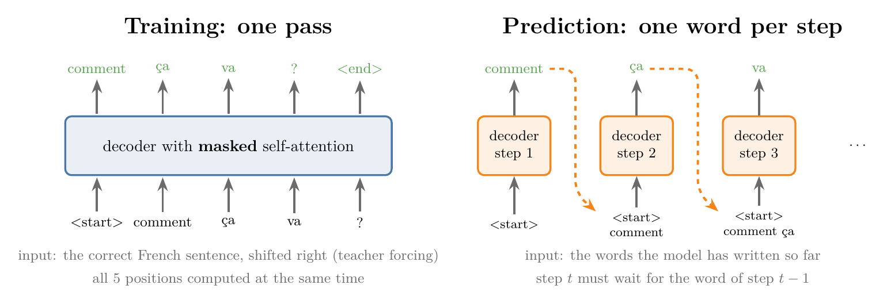
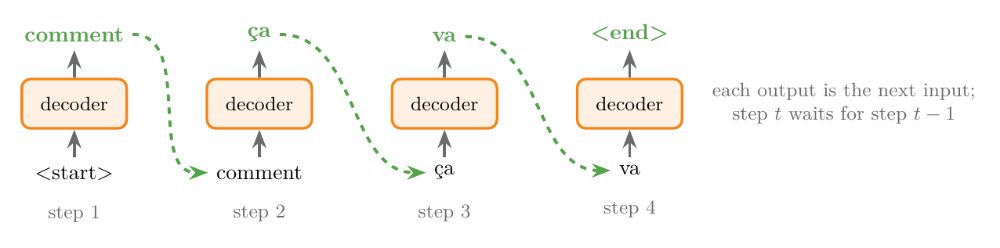
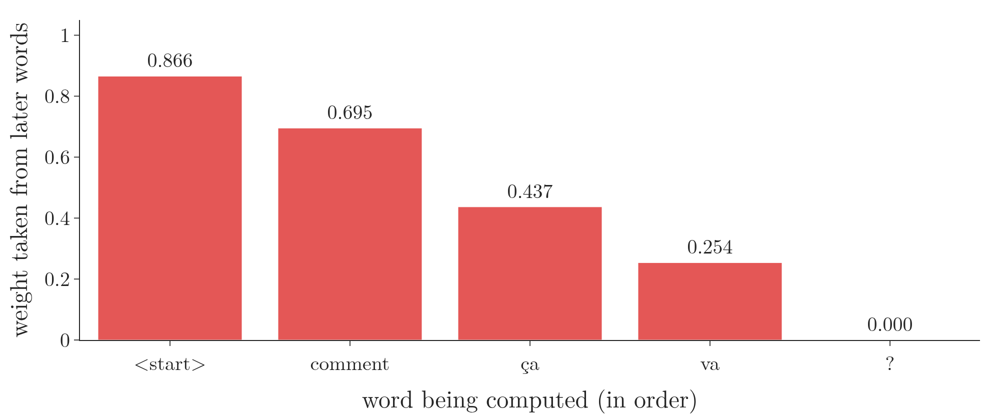
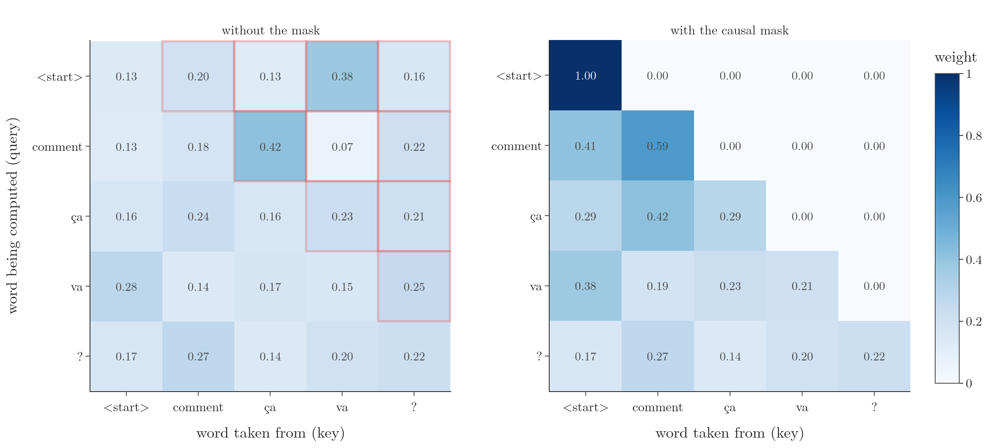
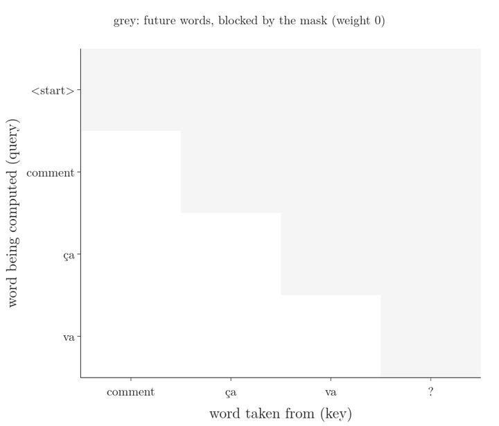
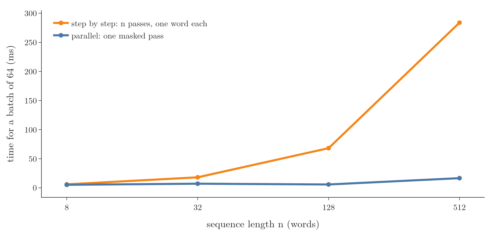
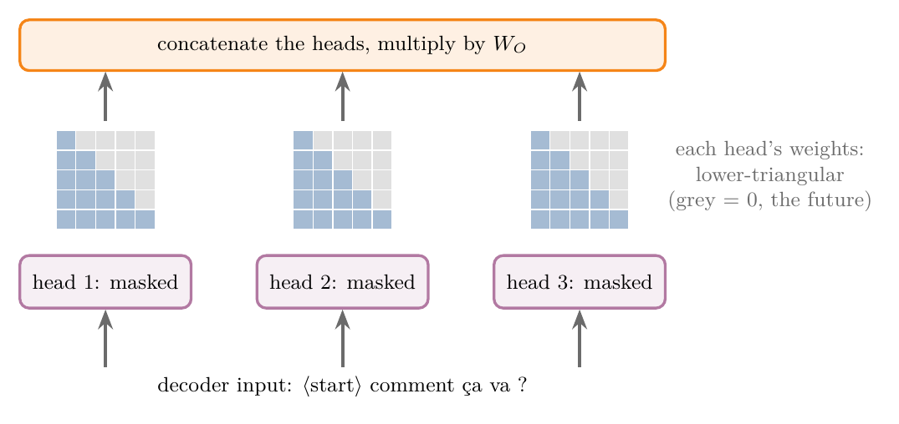

<!-- where-this-fits: generated by course_map/build_map.py; edit concepts.yaml, not this block -->
> **Where this fits:** Pipeline map step 8 (Model). See the [Course map](../01-course-map/note.md).
>
> 
>
> - **Builds on:** Self-attention (query, key, value) ([Note 1076](../1076-why-self-attention/note.md)).
> - **Leads to:** Transformer decoder ([Note 1083](../1083-transformer-decoder/note.md)); Decoder-only GPT ([Note 1087](../1087-decoder-only-gpt/note.md)).
<!-- /where-this-fits -->

## 1. Overview

> **Key point:** The transformer decoder writes its output one word at a time during prediction, because each word needs the words before it. During training the correct output sentence is already known, so all positions can be computed in one pass. The catch: ordinary self-attention would then let every word look at the words after it, which it cannot do at prediction time. **Masked self-attention** (G-1172) blocks those future words by adding $-\infty$ to their scores before the softmax, so their weights become exactly 0.

The [transformer encoder Note](../1080-transformer-encoder/note.md) opened the encoder. The decoder reuses most of its parts, but its first attention layer is different: the paper calls it **masked multi-head attention** (G-1171; Vaswani et al. 2017, Figure 1). One sentence sums up why it is needed:

*The transformer decoder is autoregressive at prediction time and non-autoregressive at training time.*

This Note explains that sentence (Figure 1) and the small change to self-attention that makes it true. The decoder block as a whole is the subject of the [transformer decoder Note](../1083-transformer-decoder/note.md).

{width=100%}

## 2. Prerequisites

- [Encoder–decoder Note](../1068-encoder-decoder/note.md), sections 5.2 and 6: teacher forcing, and the decoder feeding back its own words during prediction.
- [Self-attention step by step Note](../1073-self-attention-step-by-step/note.md): query, key and value vectors, and the weighted sum.
- [Scaled dot-product attention Note](../1074-scaled-dot-product-attention/note.md): $\text{softmax}(QK^T/\sqrt{d_k})\thinspace V$.
- [Multi-head attention Note](../1077-multi-head-attention/note.md): several attention heads side by side.
- [Transformer encoder Note](../1080-transformer-encoder/note.md): the full architecture and the encoder block.

## 3. Autoregressive models

> **Key point:** An autoregressive model produces a sequence one item at a time, and each new item depends on the items it has already produced.

In deep learning, an **autoregressive model** (G-234) generates the items of a sequence one after another, each conditioned on the items generated before it. Choosing the next word from the words already chosen is called **causal** or **autoregressive generation** (SLP3 §7.6).

An example outside text: a model predicts a share price every day. The model predicted 29 for Wednesday and 30 for Thursday. Its prediction for Friday uses those two earlier values. The term comes from time series, where an autoregressive model predicts the next value as a linear function of earlier values; deep learning uses it more loosely for any model that generates step by step from its own earlier outputs (SLP3 §7.6, footnote 4).

We have met such a model already. The LSTM decoder of the [encoder–decoder Note](../1068-encoder-decoder/note.md) writes one word per step, and during prediction the word it wrote at step $t-1$ is its input at step $t$. The transformer decoder works the same way: "at each step the model is auto-regressive, consuming the previously generated symbols as additional input when generating the next" (Vaswani et al. 2017, §3).

Figure 2 draws the loop for the translation used in this Note.

{width=100%}

Text has to be generated this way. Which word comes next depends on the words already written, so a translation cannot be written in one go: the later words depend on the earlier ones.

## 4. Prediction must be step by step; training need not be

> **Key point:** At prediction time, step $t$ needs the word written at step $t-1$, so the steps cannot run at the same time. At training time, teacher forcing gives every step its input from the data, so nothing forces the steps to wait for each other.

### 4.1 Prediction

> **Key point:** The decoder's input at each step is its own previous output, so the steps must run in order.

Suppose the transformer is already trained to translate English into French, and we give it "How are you?". The encoder reads all three English words at once and hands one vector per word to the decoder. The decoder then works step by step:

1. Input `<start>`: the decoder writes its first word, "comment".
2. Input `<start> comment`: it writes "ça".
3. Input `<start> comment ça`: it writes "va".
4. And so on, until it writes `<end>`.

If the model writes a wrong word at some step, the wrong word becomes part of the next input; there is no correct sentence to fall back on. And step 2 cannot start before step 1 has produced its word. At prediction time the decoder has no choice: it must be autoregressive. How the full prediction loop runs is the subject of the [transformer inference Note](../1084-transformer-inference/note.md).

### 4.2 Training step by step would be slow

> **Key point:** Run step by step, training runs the whole decoder once per output word: 301 times for a 300-word paragraph, for every training pair.

Now suppose training also ran step by step. We take the training pair "How are you?" and "Comment ça va ?". The encoder reads the English sentence. The decoder starts with `<start>` and predicts a first word, say "très", which is wrong. Then:

- At step 2, **teacher forcing** (G-1955; the [encoder–decoder Note](../1068-encoder-decoder/note.md), section 5.2) feeds the correct word "comment", not the wrong "très". The decoder predicts the next word.
- At steps 3, 4 and 5 the inputs are again the correct words "ça", "va" and "?".
- The loss compares the five predictions with the correct words, and backpropagation updates the weights.

The decoder ran 5 times for a 4-word target sentence: once per word plus once for `<end>`. Every run passes through all the decoder's layers. A target paragraph of 300 words would need 301 runs, and a dataset has many thousands of pairs. Training this way is slow.

### 4.3 Teacher forcing removes the wait

> **Key point:** With teacher forcing, the input of every step is already in the data. All steps can be computed at the same time.

Look again at the inputs of section 4.2: `<start>`, "comment", "ça", "va", "?". None of them came from the model's own predictions; all of them come from the correct French sentence. The input of step 3 does not depend on what step 2 predicted. Since the whole sentence is known before training starts, there is no reason to wait: all five positions can go into the decoder together, as one matrix, and be computed in a single pass.

| Position | 1 | 2 | 3 | 4 | 5 |
|---|---|---|---|---|---|
| Decoder input | `<start>` | comment | ça | va | ? |
| Target | comment | ça | va | ? | `<end>` |

The decoder input is the target sentence shifted right by one place, with `<start>` in front. Running all positions in one pass is what "non-autoregressive at training time" means. The model still learns to predict each word from the words before it; what changes is that the computation of all positions happens at once. Parallel training of this kind is possible "because we know in advance the desired output" (SLP3 §7.7).

{height=50%}

Figure 3 shows both ways with real weights from the trained translation model of the [transformer inference Note](../1084-transformer-inference/note.md). Watch the right panel: each inference step adds one row, and that row is exactly the row the training pass computed all at once. Section 6 explains how the training pass keeps the later words out.

## 5. The problem: self-attention sees the future

> **Key point:** If the whole target sentence enters self-attention at once, each word's output is built partly from the words after it. At prediction time those words do not exist yet, so the model would learn to rely on information it will never have.

The first layer of the decoder is (multi-head) self-attention. For simplicity, take one head: plain self-attention as in the [self-attention step by step Note](../1073-self-attention-step-by-step/note.md). Each word's output is a weighted sum of the value vectors of **all** the words in the sentence.

The Notebook runs self-attention on our five decoder inputs. Each word gets 8 random numbers as a stand-in for its embedding, and the layer's weights are random (untrained), so only the pattern matters, not the exact values. Without a mask, the weights are:

| Word being computed | `<start>` | comment | ça | va | ? | Weight on later words |
|---|---|---|---|---|---|---|
| `<start>` | 0.134 | 0.201 | 0.126 | 0.380 | 0.158 | 0.866 |
| comment | 0.125 | 0.179 | 0.415 | 0.065 | 0.215 | 0.695 |
| ça | 0.162 | 0.236 | 0.165 | 0.225 | 0.211 | 0.437 |
| va | 0.280 | 0.140 | 0.172 | 0.155 | 0.254 | 0.254 |
| ? | 0.166 | 0.272 | 0.142 | 0.200 | 0.220 | 0 |

Take the row of "comment". Its output takes 0.415 of its mix from "ça", 0.065 from "va" and 0.215 from "?". But at prediction time, when the decoder has written only `<start> comment`, the words "ça", "va" and "?" do not exist. The output for `<start>` is the worst case: 87% of it comes from words that will not exist when it is needed (Figure 4).

{width=90%}

So the model would be trained on information that is missing at prediction time. Training on such information is **data leakage** (G-535; the [toy project Note](../13-toy-project/note.md)): information that will not exist when the model is used reaches it during training. A model trained with leaked information can do well on the training data and badly on real inputs. Here the leak is especially direct. The decoder's job at position 1 is to predict "comment", and with the leak the input of position 1 already contains "comment" itself. "Guessing the next word is pretty simple if you already know it!" (SLP3 §7.3).

We seem stuck:

| Training | Speed | Leakage |
|---|---|---|
| Step by step | slow | none: each step sees only the words before it |
| All positions at once, plain self-attention | fast | every word sees the words after it |

## 6. The fix: mask the future

> **Key point:** Before the softmax, add a mask matrix $M$ with 0 on and below the diagonal and $-\infty$ above it. The softmax turns every $-\infty$ into a weight of exactly 0, so each word takes only from itself and the words before it.

### 6.1 Where the mask goes

> **Key point:** The mask is added to the scaled scores, between the scaling and the softmax.

Recall the steps of scaled dot-product attention (the [scaled dot-product attention Note](../1074-scaled-dot-product-attention/note.md)): compute the scores $QK^T$, divide by $\sqrt{d_k}$, apply the softmax row by row, multiply by $V$. The weights we want to remove are those above the diagonal: row $i$ (the word being computed) must give 0 weight to every column $j > i$ (a later word).

Setting them to 0 after the softmax would not work, because each row of weights must still sum to 1. Instead, one extra step goes in before the softmax. The **mask matrix** (G-1169) $M$ has the same shape as the score matrix:

$$M_{ij} = \begin{cases} 0 & \text{if } j \le i \cr-\infty & \text{if } j > i \end{cases}$$

For our five positions:

$$M = \begin{pmatrix} 0 & -\infty & -\infty & -\infty & -\infty \cr0 & 0 & -\infty & -\infty & -\infty \cr0 & 0 & 0 & -\infty & -\infty \cr0 & 0 & 0 & 0 & -\infty \cr0 & 0 & 0 & 0 & 0 \end{pmatrix}$$

Masked self-attention is then

$$\text{MaskedAttention}(Q, K, V) = \text{softmax}\negthinspace\left(\frac{QK^T}{\sqrt{d_k}} + M\right) V$$

(SLP3 eq. 7.34). The paper puts it in one sentence: "We implement this inside of scaled dot-product attention by masking out (setting to $-\infty$) all values in the input of the softmax which correspond to illegal connections" (Vaswani et al. 2017, §3.2.3). Because it hides everything after the current word, the mask is called a **causal mask** (G-357; look-ahead mask).

### 6.2 One row by hand

> **Key point:** Adding 0 leaves a score unchanged; adding $-\infty$ makes its exponential 0. The remaining weights are the softmax over the allowed words only.

1. **In words:** add the mask row to the scores, take $e$ to the power of each, and divide by their sum. The masked words contribute $e^{-\infty} = 0$ to the top and the bottom.
2. **Formula:** for row $i$,
   $$w_{ij} = \frac{e^{s_{ij} + M_{ij}}}{\sum_{k} e^{s_{ik} + M_{ik}}} = \begin{cases} \dfrac{e^{s_{ij}}}{\sum_{k \le i} e^{s_{ik}}} & j \le i \cr0 & j > i \end{cases}$$
3. **Example:** the row of "ça" (position 3) has the scaled scores $-0.066,\ 0.312,\ -0.048,\ 0.264,\ 0.200$ (Notebook). Adding the mask row $0, 0, 0, -\infty, -\infty$ gives
   $$-0.066,\quad 0.312,\quad -0.048,\quad -\infty,\quad -\infty$$
   The exponentials are $0.936,\ 1.366,\ 0.953,\ 0,\ 0$, with sum $3.255$. The weights are
   $$\frac{0.936}{3.255} = 0.288,\quad \frac{1.366}{3.255} = 0.420,\quad \frac{0.953}{3.255} = 0.293,\quad 0,\quad 0$$
   They sum to 1, and "va" and "?" get exactly 0.

Adding 0 instead of $-\infty$ would change nothing, since $e^{s + 0} = e^{s}$; only $-\infty$ removes a word, because $e^{-\infty} = 0$.

### 6.3 The whole matrix

> **Key point:** Masking leaves a lower-triangular matrix of weights: row $t$ uses only positions 1 to $t$.

{width=100%}

Figure 5 compares the two weight matrices. With the mask, the first row puts all its weight (1.0) on `<start>`, the only word it may see. Row 2 splits between `<start>` and "comment" (0.412 and 0.588), and so on. The last row, "?", is the same as without the mask, because nothing comes after it. In the Notebook every weight above the diagonal is exactly 0, not just small, and every row still sums to 1.

{height=55%}

Figure 6 builds the matrix one row at a time, in the order the words would appear at prediction time. Each row uses only words that already exist when that word is written. Masking gives us both: a single parallel pass, and no word seeing its future.

The weights above come from random, untrained matrices. Figure 7 runs the same steps in a trained model: one attention head of the first decoder block of the translation transformer trained in the [transformer inference Note](../1084-transformer-inference/note.md), on the same input `<start> comment ça va ?`, with $d_k = 32$. Each score is drawn as a dot whose area shows its size. Watch three things: dividing by $\sqrt{32}$ shrinks every dot by the same factor; the mask replaces the whole upper triangle by $-\infty$; and after the softmax every row is a set of weights summing to 1, with nothing above the diagonal. In this head, "ça" takes its weight from `<start>` (0.46) and "comment" (0.51), and "?" takes 0.98 from "ça" (exported by that Note's Notebook, section 8).

{height=55%}

> **Extra:** The grid of dots, with the dot's size for the score, follows Sanderson's "Attention in transformers, step-by-step" (3Blue1Brown, 2024).

## 7. Checking the three claims

> **Key point:** In the Notebook, Keras' causal mask gives the same weights as the hand computation; changing the future words leaves the earlier outputs exactly unchanged; and one masked pass gives the same outputs as feeding the prefixes one at a time, many times faster on a GPU.

### 7.1 Keras' causal mask

> **Key point:** `use_causal_mask=True` in Keras' `MultiHeadAttention` computes exactly the masked attention of section 6.

Keras' `MultiHeadAttention` layer has a `use_causal_mask` (G-154) argument that applies this mask, "a causal mask to prevent tokens from attending to future tokens" (Keras documentation). With one head, the same $W_Q$, $W_K$, $W_V$ as the hand computation and the output matrix set to the identity (as in the [scaled dot-product attention Note](../1074-scaled-dot-product-attention/note.md), section 7), Keras returns the same weights and outputs; the largest difference is $3 \times 10^{-8}$.

> **Python:** Masked self-attention by hand, and with Keras.
>
> ```python
> S = Q @ K.T / np.sqrt(d)                            # scaled scores, 5 x 5
> M = np.triu(np.full((n, n), -np.inf), 1)            # -inf above the diagonal
> A = softmax_rows(S + M)                             # future weights become 0
> Y = A @ V
>
> out, w = mha(X, X, use_causal_mask=True, return_attention_scores=True)
> ```

### 7.2 No information from the future

> **Key point:** With the mask, the output at a position depends only on that position and the ones before it.

If the mask works, changing the later words must not change the earlier outputs. The Notebook replaces the last two inputs, "va" and "?", by two other words (new random vectors) and recomputes the outputs of the first three positions:

| Change in the output of | `<start>` | comment | ça |
|---|---|---|---|
| Without the mask | 0.479 | 1.699 | 0.521 |
| With the mask | 0 | 0 | 0 |

Without the mask, every earlier output moves when the future changes: the leak of section 5. With the mask the first three outputs stay exactly the same, bit for bit. Masked self-attention computes, at every position, only what could be computed at prediction time. Vaswani et al. (2017, §3.1) state the same guarantee: the masking, together with the one-place shift of the decoder input, ensures that "the predictions for position $i$ can depend only on the known outputs at positions less than $i$".

### 7.3 One pass equals many steps

> **Key point:** Running unmasked self-attention on the growing prefix, one word at a time, gives the same numbers as one masked pass over the whole sentence.

At prediction time the decoder sees only the prefix written so far: `<start>`, then `<start> comment`, and so on. The Notebook runs ordinary (unmasked) self-attention on each prefix and keeps the output of its last word. The five outputs agree with the five rows of the single masked pass, up to rounding ($10^{-7}$). The mask lets training compute, in one pass, exactly what prediction computes step by step.

### 7.4 How much faster

> **Key point:** On a GPU, for a batch of 64 sequences, one masked pass over 512 positions took 17 ms; 512 one-word steps took 284 ms.

The Notebook times both ways on the GPU, for a batch of 64 random sequences with $d = 64$. To keep the comparison fair, the step-by-step version does no repeated work: the keys and values of all positions are computed once, and step $t$ computes only the query of position $t$ and its row of weights.

| Length $n$ | One masked pass (ms) | $n$ one-word steps (ms) | Ratio |
|---|---|---|---|
| 8 | 5.1 | 5.9 | 1.2 |
| 32 | 7.0 | 18.0 | 2.6 |
| 128 | 5.7 | 68.1 | 11.9 |
| 512 | 16.5 | 283.9 | 17.2 |

{width=85%}

The masked pass barely changes from 8 to 128 positions, because the GPU computes all positions at the same time; the step-by-step time grows with the number of steps, because each step must wait for the one before (Figure 8). The measurement covers one attention layer; a real decoder repeats it in every layer of every block, for every training pair. Parallel training "making it practical to pretrain on trillions of tokens" rests on exactly this (SLP3 §7.7).

## 8. Masked multi-head attention

> **Key point:** In the decoder, the mask is applied inside every head of multi-head attention. The layer is otherwise the same as in the encoder.

The **decoder** (G-564) uses **multi-head attention** (G-1268), not a single head (the [multi-head attention Note](../1077-multi-head-attention/note.md)). The mask goes inside each head's scaled dot-product attention, exactly as in section 6 (Figure 9) (Vaswani et al. 2017, §3.2.3: the mask is implemented "inside of scaled dot-product attention"). Every head therefore produces a lower-triangular weight matrix. The heads are concatenated and multiplied by $W_O$ as usual.

{width=80%}

This layer is the first sub-layer of every decoder block (Vaswani et al. 2017, §3.1); the rest of the block is in the [transformer decoder Note](../1083-transformer-decoder/note.md).

The encoder has no mask: it reads a whole input sentence that is fully known, both at training and at prediction time, so each word may look at every other word (SLP3 §13.3). The paper agrees: its diagram of scaled dot-product attention marks the mask step as optional, "Mask (opt.)" (Vaswani et al. 2017, Figure 2), and §3.2.3 applies the mask only in the decoder's self-attention.

> **Extra:** The same mask is the core of decoder-only language models such as GPT (the [history of LLMs Note](../1067-history-of-llms/note.md), section 8). Such a model is trained to predict the next word at every position of a text. With the causal mask, one pass over a text of $N$ tokens gives "N training examples from one pass through the network" (SLP3 §7.7): every position predicts its own next word, and none of them can see it.

## 9. Summary

| | Training | Prediction |
|---|---|---|
| Decoder input | the correct target sentence, shifted right (teacher forcing) | the words written so far |
| Positions computed | all at once, in one pass | one per step |
| How future words are hidden | the causal mask | they do not exist yet |
| Autoregressive? | no (parallel computation) | yes |

- An autoregressive model generates one item at a time, each conditioned on the items before it.
- Prediction must be autoregressive: each step needs the previous step's word.
- Teacher forcing makes all training inputs known in advance, so training can compute every position in one pass.
- Plain self-attention in that pass lets every word use the words after it: data leakage.
- The causal mask adds $-\infty$ above the diagonal of the scaled scores; after the softmax those weights are exactly 0 and each row still sums to 1.
- $\text{softmax}(QK^T/\sqrt{d_k} + M)\thinspace V$ gives the same outputs as feeding the prefixes one at a time, and on a GPU it was 17 times faster at 512 positions.

## 10. Sources

**Built from**

- CampusX, "Masked Self Attention | Masked Multi-head Attention in Transformer | Transformer Decoder", YouTube, https://www.youtube.com/watch?v=m6onaKFzF94
- Sanderson, G. (3Blue1Brown), "Attention in transformers, step-by-step | Deep Learning Chapter 6", 2024, 3blue1brown.com/lessons/attention, https://www.youtube.com/watch?v=eMlx5fFNoYc. 8:30–12:42 (the attention pattern as a grid of dots; masking with $-\infty$ before the softmax).

**Other references**

- Vaswani, A. et al. (2017). Attention Is All You Need. *NeurIPS 2017*. arXiv:1706.03762. Section 3 (the decoder is auto-regressive); section 3.1 (masking plus the one-place offset: predictions for position $i$ depend only on positions less than $i$); section 3.2.3 (masking out by setting to $-\infty$ inside scaled dot-product attention); Figure 2, left (the "Mask (opt.)" step).
- Jurafsky, D. and Martin, J. H. *Speech and Language Processing*, 3rd ed. draft (19 August 2026). Chapter 7: section 7.3 and eq. 7.34 (masking out the future, the mask matrix $M$); section 7.6 and footnote 4 (causal or autoregressive generation); section 7.7 (teacher forcing; parallel training because the desired output is known in advance and the causal mask hides it; $N$ training examples per pass). Chapter 13, section 13.3 (the encoder's attention is not masked).
- Keras API documentation: `MultiHeadAttention` layer, `use_causal_mask` argument, keras.io/api/layers/attention_layers/multi_head_attention.
- Keras source code, version 3.15: `keras/src/layers/activations/softmax.py` (masked positions set to $-10^9$ before the softmax and to 0 after it).
- Tatoeba sentence pairs, distributed as the English–French dataset of the Keras examples (fra-eng.zip; manythings.org/anki).

## 11. Key terms

| Term | Meaning |
|---|---|
| Autoregressive model | A model that generates a sequence one item at a time, each item conditioned on the items it generated before |
| Autoregressive (causal) generation | Choosing each next word from the words already chosen |
| Prediction (inference) (G-1548) | Using a trained model on new inputs, with no correct output available |
| Teacher forcing | During training, feeding the decoder the correct previous word instead of its own prediction |
| Data leakage | Training a model with information that will not be available when the model is used |
| Mask matrix $M$ | A matrix added to the attention scores: 0 where attention is allowed, $-\infty$ where it is blocked |
| Causal (look-ahead) mask | The mask with $-\infty$ above the diagonal, so every word attends only to itself and the words before it |
| Masked self-attention | $\text{softmax}(QK^T/\sqrt{d_k} + M)\thinspace V$: self-attention in which no word can take from later words |
| Masked multi-head attention | Multi-head attention with the causal mask in every head; the first sub-layer of the transformer decoder |
| `use_causal_mask` | The argument of Keras' `MultiHeadAttention` that applies the causal mask |
