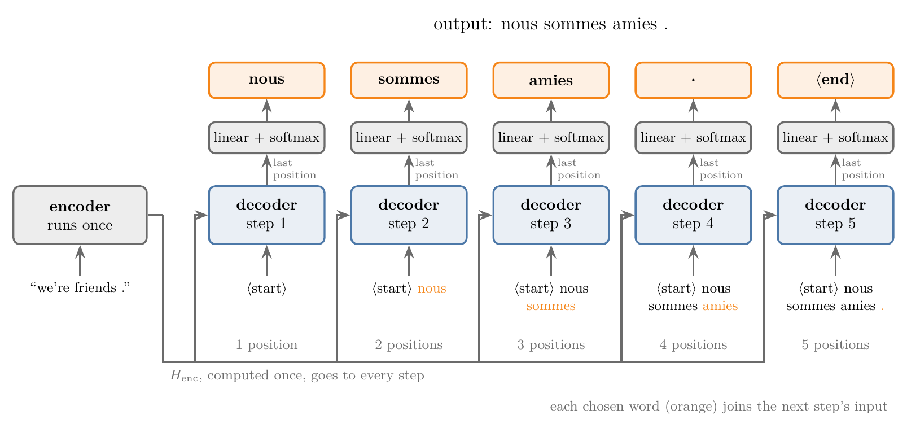
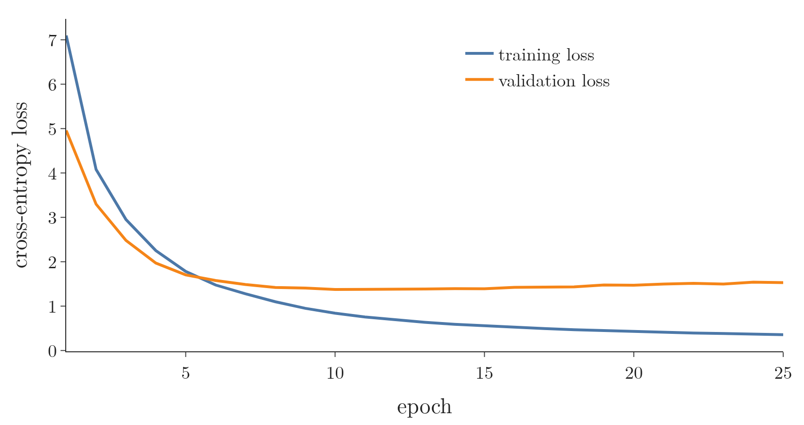
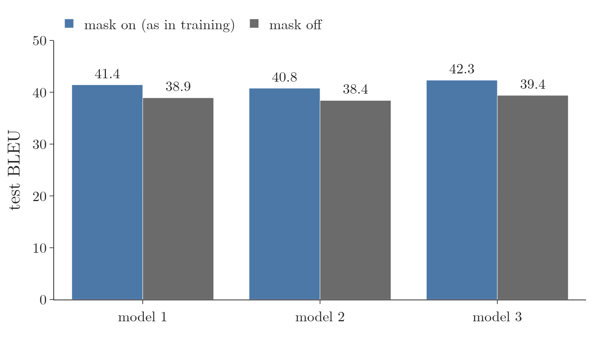

<!-- where-this-fits: generated by course_map/build_map.py; edit concepts.yaml, not this block -->
> **Where this fits:** Pipeline map step 8 (Model). See the [Course map](../01-course-map/note.md).
>
> 
>
> - **Builds on:** Transformer decoder ([Note 1083](../1083-transformer-decoder/note.md)).
> - **Leads to:** The transformer end to end (capstone) ([Note 1085](../1085-transformer-end-to-end/note.md)).
<!-- /where-this-fits -->

## 1. Overview

> **Key point:** At prediction time (**inference**) the transformer has no target sentence. The encoder runs once and turns the input sentence into $H_{\text{enc}}$. The decoder then runs once per output word: at step 1 its input is `<start>` alone; at each later step it is `<start>` plus every word chosen so far. Only the last position's vector goes through the linear layer and the softmax, the most likely word is chosen, and it is appended to the input. The loop stops at `<end>`. The causal mask stays on, exactly as in training.

The [transformer decoder Note](../1083-transformer-decoder/note.md) followed the transformer during training, when the whole target sentence is known and every position is computed in one pass. This Note follows the same trained model when it is used: a new English sentence comes in, and the French translation has to be written word by word (Figure 1).

{width=100%}

The Notebook trains a small transformer on 40,000 English–French sentence pairs and translates sentences it has never seen. The numbers in this Note are that model's real outputs.

## 2. Prerequisites

- [Transformer decoder Note](../1083-transformer-decoder/note.md): the decoder block, the shifted-right input, the output layer and training in one pass.
- [Masked self-attention Note](../1081-masked-self-attention/note.md): the causal mask, and why prediction must be autoregressive.
- [Cross-attention Note](../1082-cross-attention/note.md): queries from the decoder, keys and values from the encoder.
- [Encoder–decoder Note](../1068-encoder-decoder/note.md), section 6: greedy decoding with an RNN decoder.
- [Transformer encoder Note](../1080-transformer-encoder/note.md): the encoder, which works the same way in training and in inference.

## 3. Training and inference side by side

> **Key point:** The encoder does the same thing in training and in inference. The decoder differs: in training it sees the whole shifted target sentence and fills every position at once; in inference it must produce its own input, one word at a time.

| | Training | Inference |
|---|---|---|
| Encoder | runs once on the input sentence | the same |
| Decoder input | `<start>` + the correct target sentence (teacher forcing) | `<start>` + the words chosen so far |
| Decoder runs | once per sentence pair | once per output word |
| Positions used at the output | all (one loss term each) | only the last (it gives the next word) |
| Causal mask | on | on |
| Way of working | **non-autoregressive**: all positions in parallel | **autoregressive**: each new word depends on the earlier ones |

In training the correct French sentence is in the data, so the decoder can receive all of it at once, shifted right. In inference no French sentence exists yet. The word at step 2 depends on the word chosen at step 1, so step 2 cannot start before step 1 ends (the [masked self-attention Note](../1081-masked-self-attention/note.md), section 4). The paper describes the decoder this way: "at each step the model is auto-regressive, consuming the previously generated symbols as additional input when generating the next" (Vaswani et al. 2017, §3).

## 4. The trained model

> **Key point:** A small transformer with the paper's design, trained with teacher forcing for 25 epochs on 40,000 short sentence pairs (about 4 minutes on a GPU), translates unseen sentences with a BLEU score of 41.4.

The data and the test set are those of the [encoder–decoder Note](../1068-encoder-decoder/note.md): sentence pairs from the Tatoeba project, English up to 8 words, French up to 10, vocabularies of 6,004 English and 8,004 French tokens, and 1,500 English sentences held out for testing. The model follows the paper's design (post-norm blocks, sinusoidal positional encodings, embeddings multiplied by $\sqrt{d_{\text{model}}}$, dropout 0.1, Adam with the paper's warm-up learning-rate schedule; Vaswani et al. 2017, §3 and §5.3), at a smaller size:

| | Paper's base model | This Note's model |
|---|---|---|
| Encoder / decoder blocks | 6 / 6 | 2 / 2 |
| $d_{\text{model}}$ | 512 | 128 |
| Heads | 8 | 4 |
| $d_{\text{ff}}$ | 2048 | 512 |
| Parameters | 65 million | 3.75 million |

{width=80%}

Figure 2 shows the training. The training loss keeps falling for all 25 epochs; the validation loss stops improving after about 10 epochs and then creeps up slightly, a first sign of overfitting.

Some translations of test sentences:

| English (unseen) | Model's French | A reference translation |
|---|---|---|
| that doesn't help me . | ça ne m'aide pas . | ça ne m'aide pas . |
| i like your house . | j'aime votre maison . | j'aime votre maison . |
| i'm sorry , but i don't understand . | je suis désolé , mais je ne comprends pas . | je suis désolé mais je ne comprends pas . |
| she is a wonderful woman . | c'est une femme formidable ! | c'est une femme magnifique . |
| they have everything they need . | ils ont tout ce dont elles ont besoin . | ils ont tout ce dont ils ont besoin . |
| the pain has mostly gone away . | la douleur est partie de suite . | la douleur a en majeure partie disparu . |

The **BLEU score** (the [history of LLMs Note](../1067-history-of-llms/note.md), section 4) over all 1,500 test sentences is 41.4. The LSTM encoder–decoder of the [encoder–decoder Note](../1068-encoder-decoder/note.md), on the same test sentences with the same scoring code, reached 13.1; the two models differ in size and training time as well as in architecture, so the gap is not a measure of the architecture alone.

## 5. Step 1: the encoder, then `<start>`

> **Key point:** The encoder turns the English sentence into $H_{\text{enc}}$, once. The decoder receives only `<start>`, runs all its blocks on that one position, and the softmax over the 8,004 French words gives the first word.

Take the new sentence "we're friends .".

**The encoder.** The sentence is tokenised, embedded, given positional encodings and passed through the encoder blocks, exactly as in training (the [transformer encoder Note](../1080-transformer-encoder/note.md)). Out comes $H_{\text{enc}}$: one vector per English token, $3 \times d_{\text{model}}$. The English sentence does not change during the translation, so $H_{\text{enc}}$ is computed once and reused at every decoder step. In the Notebook, translating "we're friends ." takes 1 encoder call and 5 decoder calls.

**The decoder, step 1.** The input is the single token `<start>`:

1. **Input.** `<start>` is embedded and the positional encoding of position 1 is added: $X$ is $1 \times d_{\text{model}}$.
2. **Masked self-attention.** With one position there is one query and one key. The softmax over a single score gives the weight 1, so the output is the value vector of `<start>` itself (multiplied by $W_O$). Add and norm follow.
3. **Cross-attention.** The query of `<start>` is compared with the keys of the 3 English tokens. In the last decoder block of the trained model, averaged over the 4 heads, the weights are 0.78 on "we're", 0.21 on "friends" and 0.01 on ".". The output is the matching weighted sum of the English value vectors. Add and norm follow.
4. **Feed-forward network**, add and norm. Then the next decoder block repeats steps 2 to 4 with its own weights.
5. **Output layer.** The final vector goes through the linear layer ($d_{\text{model}} \to 8{,}004$) and the softmax. The most likely word is "nous", with probability 0.999.

{width=95%}

Figure 3 shows step 1: almost all the probability goes to "nous", and the position that predicts it reads mostly "we're".

Choosing the most likely word at every step is **greedy decoding**, the method the [encoder–decoder Note](../1068-encoder-decoder/note.md) used for its LSTM decoder (section 6; SLP3 §7.6.1).

## 6. Later steps: the input grows by one word

> **Key point:** At step $t$ the decoder's input is `<start>` plus the $t - 1$ words chosen so far. Every position is recomputed with the mask on, but only the last position's vector is turned into a word.

**Step 2.** The input is now `<start> nous`: two tokens, two positions. Everything of step 1 is repeated on two rows:

- the masked self-attention computes a $2 \times 2$ table of weights, with the weight of `<start>` on "nous" set to 0 by the mask;
- the cross-attention computes a $2 \times 3$ table: both French positions against the 3 English words;
- the decoder's output is 2 vectors.

Both vectors could go through the output layer, but the one for `<start>` would only predict "nous" again, which was chosen at step 1. Only the last vector, the one for "nous", is used: it predicts "sommes" with probability 1.000.

**Step 3 and later.** Each step adds one word: `<start> nous sommes` gives "amies" (0.961; the masculine "amis" is second with 0.036), `<start> nous sommes amies` gives "." (1.000), and `<start> nous sommes amies .` gives `<end>` (1.000).

**The stop.** When the chosen word is `<end>`, the translation is finished: "nous sommes amies .". A maximum length stops sentences that never produce `<end>`; the Notebook allows 11 words, the paper allowed the input length plus 50 (Vaswani et al. 2017, §6.1).

Figure 4 shows the same loop on a longer sentence, "i think you're right .", one step per frame: the 5 most likely words at each step, and the cross-attention weights of the position being predicted. The decoder reads "i" and "think" for "je" and "pense", "you're" for "vous" (0.84), and "right" for "raison" (0.81). At step 4 the model is unsure between the formal "vous" (0.670) and the informal "tu" (0.327); greedy decoding takes "vous" and keeps it, and the rest of the sentence follows from that choice ("vous avez raison").

{height=70%}

> **Python:** Greedy inference. The encoder runs once; the decoder runs once per word on the growing input; only the last position's logits choose the word.
>
> ```python
> def translate(src):                               # src: English token ids, shape (1, n)
>     enc = model.encode(src)                       # once
>     tgt = [START]
>     for _ in range(MAX_LEN):
>         logits = model.decode(np.array([tgt]), enc, src)  # mask on
>         word = int(logits[0, -1].argmax())        # last position only
>         tgt.append(word)
>         if word == END:
>             break
>     return tgt[1:]
> ```

## 7. The mask stays on during inference

> **Key point:** Inference uses the causal mask, as training did. With the mask, adding a word never changes the outputs of the earlier positions, and the step-by-step loop computes exactly the numbers that training computed. Without it, the earlier positions change at every step and translation quality drops: from BLEU 41.5 to 38.9, the mean of 3 trained models.

During inference the decoder already knows every word in its input, so the mask can look unnecessary: nothing in the input lies in the future. The mask is used anyway, because the model was trained with it. A general rule of machine learning applies: whatever processing the training data went through, the new data must go through the same.

The Notebook checks what the mask does at inference, on the trained model.

**Earlier positions stay fixed.** At each step of translating "i think you're right .", the Notebook compares the decoder's output vectors for the earlier positions with those of the step before.

| | Largest change of an earlier position's output, per step |
|---|---|
| With the mask | 0 at every step |
| Without the mask | between 4.5 and 11.9 |

With the mask, the vector of `<start>` at step 8 is exactly the vector of `<start>` at step 1: no later word can reach it. Without the mask, every new word flows back into all the earlier positions and changes them.

**Inference repeats training's computation.** One teacher-forced pass over `<start> je pense que vous avez raison .`, the kind of pass used in training, gives at every position the same probabilities as the 8 separate steps of the loop (largest difference $7 \times 10^{-7}$, rounding). The same equality for a single attention layer is section 7.3 of the [masked self-attention Note](../1081-masked-self-attention/note.md); here it holds for the whole trained model. With the mask on, every position at inference sees exactly what it saw in training.

**Without the mask, worse translations.** The Notebook decodes the 1,500 test sentences with the mask switched off at inference, for the model above and for two more models trained from other random starts:

| Model (random start) | BLEU with the mask | BLEU without the mask | Translations unchanged |
|---|---|---|---|
| 1 | 41.4 | 38.9 | 57% |
| 2 | 40.8 | 38.4 | 57% |
| 3 | 42.3 | 39.4 | 58% |
| **Mean** | **41.5** | **38.9** | **58%** |

{width=75%}

All three models lose between 2.4 and 2.9 BLEU points (Figure 5), and more than 4 translations in 10 change. Without the mask, the earlier positions take in words they never saw during training, a kind of input the model was not trained on. Individual sentences can go either way (without the mask, "they are alone ." becomes the correct "ils sont seuls ." instead of "ils sont seule ."), but on average the translations get worse.

> **Extra:** Because the earlier positions never change, their keys and values do not change either. Recomputing them at every step wastes time. The **KV cache** stores the key and value vectors of every position the first time they are computed and reuses them at later steps, so each step only computes the query, key and value of the new word (SLP3 §7.8). The cache is correct only because of the property measured above: with the mask, adding a word does not change what was computed before.

> **Extra:** Greedy decoding never revisits a choice, as the "vous"/"tu" step showed. **Beam search** keeps several candidate sentences at each step and chooses the most probable complete sentence at the end (SLP3 §13.4). The paper's translations used beam search with 4 candidates (Vaswani et al. 2017, §6.1).

## 8. Summary

| Step $t$ | Decoder input | Rows computed | Row used for the next word | Word chosen |
|---|---|---|---|---|
| 1 | `<start>` | 1 | 1 | nous |
| 2 | `<start>` nous | 2 | 2 | sommes |
| 3 | `<start>` nous sommes | 3 | 3 | amies |
| 4 | `<start>` nous sommes amies | 4 | 4 | . |
| 5 | `<start>` nous sommes amies . | 5 | 5 | `<end>`: stop |

- The encoder runs once per sentence; its output $H_{\text{enc}}$ is reused by the cross-attention at every decoder step.
- The decoder runs once per output word. Its input is `<start>` plus the words chosen so far, so it grows by one position per step.
- Only the last position's vector goes through the linear layer and the softmax; the most likely word is chosen (greedy decoding) and appended to the input.
- Generation stops at `<end>` or at a maximum length.
- The causal mask stays on. With it, earlier positions never change and inference computes exactly what training computed; without it, BLEU fell from 41.5 to 38.9.

## 9. Sources

**Built from**

- CampusX, "Transformer Inference | How Inference is done in Transformer? | Deep Learning | CampusX", YouTube, https://www.youtube.com/watch?v=FtsMOzlwxws

**Other references**

- Vaswani, A. et al. (2017). Attention Is All You Need. *NeurIPS 2017*. arXiv:1706.03762. §3 (the auto-regressive decoder); §3.1 (masking and the one-position offset); §5.3 (Adam settings and learning-rate schedule); §6.1 (beam size 4, maximum output length input length + 50); Table 3 (base model, 65 million parameters).
- Jurafsky, D. and Martin, J. H. *Speech and Language Processing*, 3rd ed. draft (19 August 2026), ch. 7, §7.6.1 (greedy decoding) and §7.8 (KV cache); ch. 13, §13.4 (beam search).
- Tatoeba project sentence pairs, as distributed with the Keras examples (fra-eng.zip, from manythings.org/anki), CC BY 2.0.

## 10. Key terms

| Term | Meaning |
|---|---|
| Inference | Using a trained model on new inputs, with no correct output available |
| Autoregressive | Producing one output at a time, each fed back as input for the next; the decoder at inference |
| Non-autoregressive | Producing all output positions at once; the decoder during training |
| $H_{\text{enc}}$ | The encoder's output for the input sentence: one vector per input token, computed once and reused at every step |
| Greedy decoding | Choosing the most probable word at each step |
| Causal mask | The mask that stops each position from attending to later positions; used in training and at inference |
| BLEU score | A measure of translation quality: how many word sequences of a translation match human reference translations |
| KV cache | Storing the key and value vectors of earlier positions so that each new step computes them only for the new word |
| Beam search | A decoding method that keeps several candidate sentences at each step and picks the most probable complete one |
