<!-- where-this-fits: generated by course_map/build_map.py; edit concepts.yaml, not this block -->
> **Where this fits:** Pipeline map steps 8 (Model), 10 (Tune). See the [Course map](../01-course-map/note.md).
>
> 
>
> - **Builds on:** Overfitting ([Note 1026](../1026-regularization-in-dl/note.md)); Adam ([Note 1038](../1038-adam/note.md)); Transformer encoder ([Note 1080](../1080-transformer-encoder/note.md)); Transformer decoder ([Note 1083](../1083-transformer-decoder/note.md)); Transformer inference (autoregressive decoding, KV cache, beam search) ([Note 1084](../1084-transformer-inference/note.md)).
<!-- /where-this-fits -->

## 1. Overview

> **Key point:** The transformer is an encoder and a decoder built from attention alone. The encoder reads the whole input sentence at once and gives every word a context-aware vector. The decoder writes the output one word at a time; at each step it looks at the words it has written (masked self-attention) and at the input (cross-attention). Every part fixes a problem of the models that came before it. The paper "Attention Is All You Need" (Vaswani et al. 2017) adds a training recipe on top: a warm-up learning rate, dropout and label smoothing. With that recipe, the big model beat every earlier translation model in the paper's comparison, at a fraction of their training cost.

The Notes from 1060 to 1084 built the transformer one part at a time. This Note puts the parts back together into one story:

1. **Why** the transformer exists: the chain of problems from RNNs to attention (section 3).
2. **How** one sentence flows through the whole model, with every shape (sections 4 and 5).
3. **Why each part is there**, with the evidence our Notes measured (section 6).
4. **What only the paper teaches:** how it was trained (section 7), what it achieved and what its experiments say about each part (section 8), and where the idea went next (section 9).

Figure 1 is the map of the whole concept. Each box carries the number of the Note that teaches it.

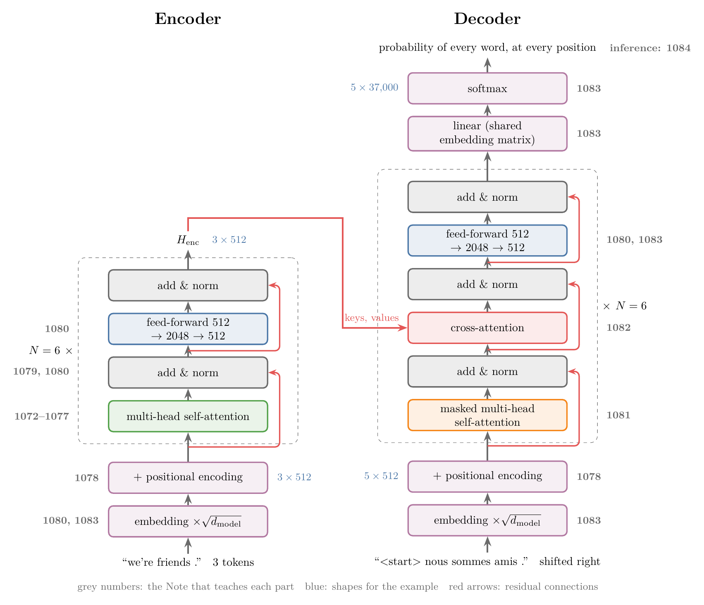{height=70%}

The earlier Notes teach each part in depth. Here each part gets a one-line recap and a link.

## 2. Prerequisites

- [Problems with RNNs](../1060-problems-with-rnn/note.md): vanishing gradients through time.
- [Encoder–decoder](../1068-encoder-decoder/note.md) and [attention](../1069-attention-mechanism/note.md): the context vector, and a fresh one per output word.
- [Self-attention step by step](../1073-self-attention-step-by-step/note.md) and [scaled dot-product attention](../1074-scaled-dot-product-attention/note.md): queries, keys, values, $\text{softmax}(QK^T/\sqrt{d_k})\thinspace V$.
- [Multi-head attention](../1077-multi-head-attention/note.md), [positional encoding](../1078-positional-encoding/note.md), [layer normalisation](../1079-layer-normalization/note.md).
- [Transformer encoder](../1080-transformer-encoder/note.md), [masked self-attention](../1081-masked-self-attention/note.md), [cross-attention](../1082-cross-attention/note.md), [transformer decoder](../1083-transformer-decoder/note.md), [transformer inference](../1084-transformer-inference/note.md).
- [Adam](../1038-adam/note.md), [dropout](../1024-dropout/note.md) and the [loss functions Note](../1014-dl-loss-functions/note.md) (categorical cross-entropy), for section 7.

## 3. The chain of problems that led to the transformer

> **Key point:** Each model in the chain fixed the main problem of the one before and left a new one. RNNs forget long-range information; LSTMs remember better but read one word at a time; the encoder–decoder squeezes a sentence into one vector; attention removes that bottleneck but still runs on an LSTM; self-attention drops the LSTM, so all words are processed at once.

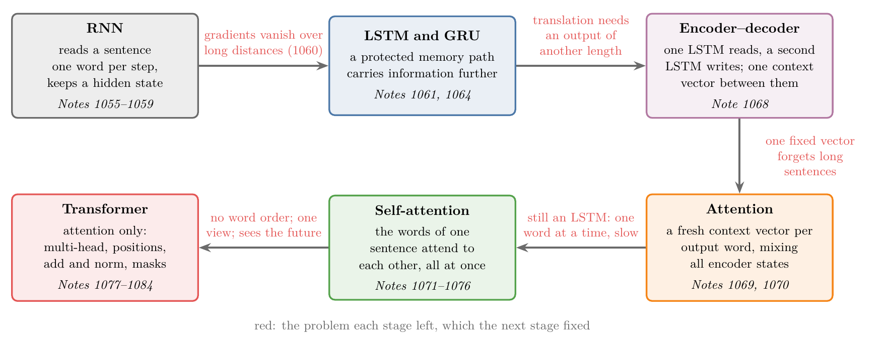{width=100%}

1. **RNNs read word by word, and forget.** An RNN reads one word per step and carries a hidden state forward. During training the gradient is multiplied by the same recurrent weights once per step, so it vanishes over long distances. On IMDB reviews, a simple RNN fell from 0.736 accuracy to 0.488, guessing level, when 80 blank steps separated the review from the prediction (the [problems with RNNs Note](../1060-problems-with-rnn/note.md)).
2. **LSTMs and GRUs remember better, but stay sequential.** An LSTM adds a protected long-term memory, the cell state (the [LSTM Note](../1061-lstm/note.md)); a GRU does the same with one memory and two gates (the [GRU Note](../1064-gru/note.md)). Both still compute step $t$ from step $t-1$. The paper names the cost: "This inherently sequential nature precludes parallelization within training examples" (Vaswani et al. 2017, §1, p. 2).
3. **The encoder–decoder squeezes a sentence into one vector.** Translation needs an output of a different length from the input. An LSTM encoder reads the input into one **context vector** (G-461), and an LSTM decoder writes the output from it (the [encoder–decoder Note](../1068-encoder-decoder/note.md)). Long sentences do not fit: in the [attention Note](../1069-attention-mechanism/note.md), without attention, BLEU fell from 14.3 on the shortest sentences to 5.9 on the longest.
4. **Attention removes the bottleneck.** The decoder gets a fresh context vector at every step, a weighted mix of all encoder states. On the same data, test BLEU rose from 9.8 to 25.7 (the [attention Note](../1069-attention-mechanism/note.md)). Luong's dot-product score was both better and faster than Bahdanau's small network: BLEU 31.6 against 25.1, and 22 against 51 seconds per epoch (the [Bahdanau and Luong Note](../1070-bahdanau-vs-luong-attention/note.md)). But the encoder and decoder were still LSTMs.
5. **Self-attention drops the recurrence.** If attention can relate any two words directly, the LSTM is no longer needed. In **self-attention** (G-1763) the words of one sentence attend to each other, all at the same time (the [what is self-attention](../1072-what-is-self-attention/note.md) and [why "self"](../1076-why-self-attention/note.md) Notes). On a GPU, an LSTM step's time grew 3.9 times from 16 to 256 words, while a self-attention step stayed near 1 millisecond (the [introduction to transformers Note](../1071-introduction-to-transformers/note.md)). The paper's conclusion states the result: "the first sequence transduction model based entirely on attention, replacing the recurrent layers most commonly used in encoder-decoder architectures with multi-headed self-attention" (Vaswani et al. 2017, §7, p. 10).

Self-attention alone brings new problems: it ignores word order, it has one point of view, and in the decoder it would see future words. The rest of the transformer fixes these (section 6).

## 4. One sentence through the model

> **Key point:** We follow "we're friends ." → "nous sommes amis ." through the base model ($d_{\text{model}} = 512$, $h = 8$ heads, $d_{\text{ff}} = 2048$, $N = 6$ blocks per side). Inside the model every word is a 512-number vector from start to end; only the feed-forward hidden layer (2048) and the output layer (one score per vocabulary word) change the width.

Before the shapes, watch the whole flow once in a model that really translates (Figure 3). It is the small trained transformer of the [transformer inference Note](../1084-transformer-inference/note.md): 2 encoder and 2 decoder blocks, 128 numbers per word, 4 heads, trained on 40,000 English–French pairs. Each English word becomes a strip of 128 coloured numbers; the encoder blocks mix the words (the dots are the self-attention weights) and change every strip; then the decoder runs once per French word. At each step, watch three things: the masked self-attention looks only at the words already written, the green lines show how much the newest position reads each English word, and the bars give the 5 most likely next words. The most likely one is appended, and the loop runs again until `<end>` (the predict, append, repeat loop that Sanderson 2024, Ch 5, animates for GPT). The model writes "nous sommes amies .", reading "we're" for "nous" (0.93 of its cross-attention weight in the last block) and "friends" for "amies" (0.85).

{height=60%}

The example pair is the one of the [transformer decoder Note](../1083-transformer-decoder/note.md). The Notebook builds a base-size transformer in Keras with random weights and passes the pair through it. With random weights the outputs mean nothing, but the shapes and the parameter counts are those of the real model. The vocabulary is one shared list of about 37,000 tokens, as in the paper's English–German setup (Vaswani et al. 2017, §5.1, p. 7).

### 4.1 The encoder

> **Key point:** Tokens → embeddings $\times \sqrt{512}$ → + positional encoding → 6 encoder blocks. Out comes $H_{\text{enc}}$: one context-aware 512-number vector per input token.

| Step | What it does | Why it is there | Shape | Taught in |
|---|---|---|---|---|
| Tokens | "we're", "friends", "." | the model reads tokens, not letters | 3 tokens | [1080](../1080-transformer-encoder/note.md), §4 |
| Embedding $\times \sqrt{d_{\text{model}}}$ | looks up a learned vector per token, multiplied by $\sqrt{512} \approx 22.6$ | words become numbers | $3 \times 512$ | [1083](../1083-transformer-decoder/note.md), §5.2 |
| $+$ positional encoding | adds a sine–cosine vector per position | attention alone ignores order | $3 \times 512$ | [1078](../1078-positional-encoding/note.md) |
| Multi-head self-attention | every word mixes in the other words, 8 heads of 64 | context: "bank" next to "river" differs from "bank" next to "money" | $3 \times 512$ (weights: $8 \times 3 \times 3$) | [1073](../1073-self-attention-step-by-step/note.md)–[1077](../1077-multi-head-attention/note.md) |
| Add & norm | $\text{LayerNorm}(x + \text{Sublayer}(x))$ | residual path and stable scale | $3 \times 512$ | [1079](../1079-layer-normalization/note.md), [1080](../1080-transformer-encoder/note.md) |
| Feed-forward | 512 → 2048 (ReLU) → 512, each word separately | a non-linear transformation per word | $3 \times 2048$, then $3 \times 512$ | [1080](../1080-transformer-encoder/note.md), §5.3 |
| Add & norm | as above | as above | $3 \times 512$ | [1080](../1080-transformer-encoder/note.md) |
| Repeat 6 times | same design, own weights | depth | $H_{\text{enc}}$: $3 \times 512$ | [1080](../1080-transformer-encoder/note.md), §6 |

### 4.2 The decoder

> **Key point:** The target sentence, shifted right, gets the same embedding and positional encoding. Each of the 6 decoder blocks runs masked self-attention, then cross-attention to $H_{\text{enc}}$, then a feed-forward network, each with add & norm. A linear layer and a softmax turn each position's vector into a probability for every word.

| Step | What it does | Why it is there | Shape | Taught in |
|---|---|---|---|---|
| Shift right | `<start>` nous sommes amis . | position $i$ holds the word before the one it predicts | 5 positions | [1083](../1083-transformer-decoder/note.md), §5.1 |
| Embedding, positions | as in the encoder | as in the encoder | $5 \times 512$ | [1083](../1083-transformer-decoder/note.md), §5.2 |
| Masked self-attention | each position sees only itself and earlier positions | at prediction time the future words do not exist yet | $5 \times 512$ (weights: $8 \times 5 \times 5$) | [1081](../1081-masked-self-attention/note.md) |
| Cross-attention | queries from the French side, keys and values from $H_{\text{enc}}$ | the only place the decoder reads the input | $5 \times 512$ (weights: $8 \times 5 \times 3$) | [1082](../1082-cross-attention/note.md) |
| Feed-forward | as in the encoder | as in the encoder | $5 \times 512$ | [1083](../1083-transformer-decoder/note.md), §6.5 |
| Add & norm; 6 blocks | after each of the 3 sub-layers | as in the encoder | $5 \times 512$ | [1083](../1083-transformer-decoder/note.md), §7 |
| Linear | one score (logit) per vocabulary word | turn a vector into word scores | $5 \times 37{,}000$ | [1083](../1083-transformer-decoder/note.md), §8 |
| Softmax | scores → probabilities | a probability per word, summing to 1 | $5 \times 37{,}000$ | [1083](../1083-transformer-decoder/note.md), §8 |

In the Notebook every row of the $5 \times 37{,}000$ output sums to 1. The paper shares one weight matrix between the two embedding layers and the final linear layer (Vaswani et al. 2017, §3.4, p. 5); the Notebook does the same.

### 4.3 Parameter count

> **Key point:** One encoder block has 3,152,384 parameters and one decoder block 4,204,032; the 12 blocks and the shared embedding give about 63 million, close to the paper's 65 million.

| Part | Parameters (Notebook, `count_params()`) |
|---|---|
| One encoder block | 3,152,384 |
| One decoder block | 4,204,032 |
| 6 encoder + 6 decoder blocks | 44,138,496 |
| Shared embedding, $37{,}000 \times 512$ | 18,944,000 |
| **Total** | **63,082,496** |

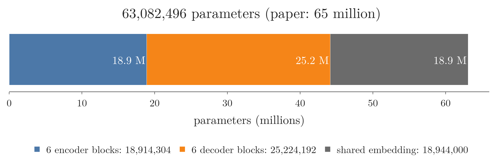{width=95%}

In Figure 4, the decoder blocks hold the largest share, because each one has a cross-attention that the encoder blocks lack. These are the counts of the [encoder](../1080-transformer-encoder/note.md) and [decoder](../1083-transformer-decoder/note.md) Notes. The paper lists 65 million for the base model (Vaswani et al. 2017, Table 3, p. 9); the [transformer decoder Note](../1083-transformer-decoder/note.md), section 7, traces the gap to the exact vocabulary size, which the paper does not give.

## 5. Training and inference

> **Key point:** Training knows the whole target sentence, so all positions are computed in one parallel pass and the loss compares every position with its correct next word. Inference does not know the target, so the decoder runs once per new word, feeding each chosen word back in.

**Training.** The training data are sentence pairs. Each pair is one **observation** (G-1374) (one record of the data): an English sentence and its French translation, the **target** (G-1949) (the output the model must learn to produce).

1. **Teacher forcing.** The decoder input is the correct target, shifted right, not the model's own guesses (the [encoder–decoder Note](../1068-encoder-decoder/note.md), section 5.2).
2. **One pass.** Because all inputs are known in advance, all 5 positions are computed at once. The causal mask keeps the pass honest: in the [masked self-attention Note](../1081-masked-self-attention/note.md), the masked pass gave the same outputs as feeding the prefixes one at a time, and was 17 times faster at 512 positions.
3. **Loss.** Each position is a classification over the vocabulary, scored with categorical cross-entropy and averaged over positions (the [transformer decoder Note](../1083-transformer-decoder/note.md), section 9). The paper changes the target of this loss slightly with label smoothing (section 7.4).

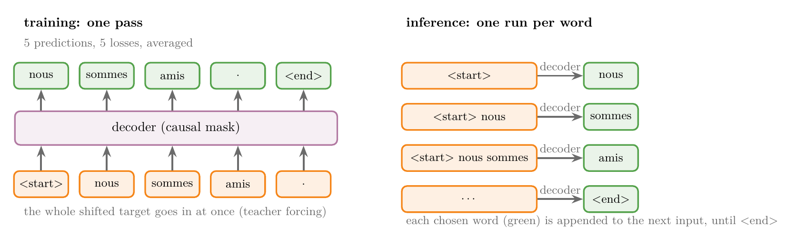{width=100%}

Figure 5 sets the two side by side: one decoder call for the whole sentence in training, one call per word in inference.

**Inference.** The encoder runs once. The decoder starts from `<start>`, picks a word, appends it, and runs again, until it writes `<end>` (the [transformer inference Note](../1084-transformer-inference/note.md)). The mask stays on, so earlier positions never change. Two refinements:

- **KV cache:** the keys and values of earlier positions are stored and reused, so each step computes them only for the new word (the [transformer inference Note](../1084-transformer-inference/note.md), Extra; SLP3 §7.8).
- **Beam search:** several candidate sentences are kept at each step. The paper used 4 candidates and a length penalty $\alpha = 0.6$, and set the maximum output length to the input length + 50 (Vaswani et al. 2017, §6.1, p. 8).

## 6. Why each part is there

> **Key point:** Every part of the transformer answers a specific problem, and our Notes measured most of these problems directly.

| Part | Problem it solves | Evidence | Note |
|---|---|---|---|
| Attention | one context vector forgets long sentences | test BLEU 9.8 without attention, 25.7 with | [1069](../1069-attention-mechanism/note.md) |
| Dot-product scores | an additive scoring network is slow | Luong dot: BLEU 31.6, 22 s per epoch; Bahdanau: 25.1, 51 s | [1070](../1070-bahdanau-vs-luong-attention/note.md) |
| Self-attention | an LSTM reads one word at a time | LSTM time grew 3.9 times from 16 to 256 words; self-attention stayed near 1 ms | [1071](../1071-introduction-to-transformers/note.md) |
| Learned $W_Q$, $W_K$, $W_V$ | plain dot products of embeddings learn nothing | IMDB accuracy 0.84 with learned matrices, 0.69 without | [1073](../1073-self-attention-step-by-step/note.md) |
| Divide by $\sqrt{d_k}$ | long vectors give huge scores and a saturated softmax | unscaled, at $d = 1{,}024$: largest weight 0.97 on average, gradient 7.6 times smaller | [1074](../1074-scaled-dot-product-attention/note.md) |
| Multiple heads | one head gives one point of view | same 1,050,624 parameters as one big head; trained BERT heads attend differently; paper: 1 head is 0.9 BLEU worse | [1077](../1077-multi-head-attention/note.md) |
| Positional encoding | self-attention ignores order | shuffling the input only shuffled the output | [1078](../1078-positional-encoding/note.md) |
| Residual connections | deep stacks lose each word's information | without them, one untrained block gave all 30 words of a review the same vector (similarity 1.00, against 0.09 with them) | [1080](../1080-transformer-encoder/note.md) |
| Layer normalisation | batch normalisation mixes padding into the statistics | 72 percent of the positions in a real IMDB batch were padding | [1079](../1079-layer-normalization/note.md) |
| Feed-forward network | attention only mixes words; it has no per-word ReLU | changing "you" changed only the output of "you"; the network holds two-thirds of a block's parameters | [1080](../1080-transformer-encoder/note.md) |
| Causal mask | in the parallel training pass, a word could see the future | same outputs as step-by-step decoding; 17 times faster at 512 positions | [1081](../1081-masked-self-attention/note.md) |
| Cross-attention | the decoder must read the input | in a trained model, most French words put their largest weight on the English word they translate | [1082](../1082-cross-attention/note.md) |
| Mask at inference | inputs must look like the training inputs | removing it dropped BLEU from 41.5 to 38.9 | [1084](../1084-transformer-inference/note.md) |

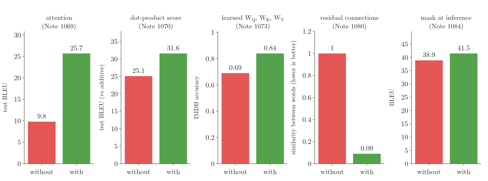{width=100%}

Figure 6 draws five rows of the table as before-and-after bars, each on its own scale. Every part moves its metric in the right direction.

The whole model works: a small transformer trained for about 4 minutes on 40,000 sentence pairs reached a test BLEU of 41.4, against 13.1 for the LSTM encoder–decoder on the same test sentences (the [transformer inference Note](../1084-transformer-inference/note.md)). The two models also differ in size and training time, so that gap is not a measure of the architecture alone.

## 7. How the paper trained the transformer

The parts above are the architecture. The paper also gives a training recipe, which no earlier Note teaches. This section and the next cover it, with the paper's own numbers.

### 7.1 Data and batching

> **Key point:** About 4.5 million English–German sentence pairs and 36 million English–French sentences, split into pieces of words, in batches of about 25,000 source and 25,000 target tokens.

- **English–German:** WMT 2014, "about 4.5 million sentence pairs", encoded with byte-pair encoding into "a shared source-target vocabulary of about 37000 tokens" (Vaswani et al. 2017, §5.1, p. 7).
- **English–French:** WMT 2014, "36M sentences", split into a 32,000 word-piece vocabulary (§5.1).
- **Batches:** sentence pairs of similar length are grouped together; each batch holds about 25,000 source tokens and 25,000 target tokens (§5.1).

Byte-pair encoding splits words into smaller pieces (the [transformer encoder Note](../1080-transformer-encoder/note.md), section 4).

### 7.2 Hardware and training time

> **Key point:** One machine with 8 NVIDIA P100 GPUs: 12 hours for the base model, 3.5 days for the big model.

| Model | Steps | Time per step | Total time |
|---|---|---|---|
| Base | 100,000 | about 0.4 s | 12 hours |
| Big | 300,000 | 1.0 s | 3.5 days |

(Vaswani et al. 2017, §5.2, p. 7.)

The **big** model is wider: $d_{\text{model}} = 1024$, $d_{\text{ff}} = 4096$, 16 heads, dropout 0.3, 213 million parameters, against 65 million for the base model (Table 3, bottom row, p. 9).

**Training cost in FLOPs.** A **FLOP** (G-790) is one floating-point operation, one addition or multiplication of decimal numbers. The paper estimates a model's training cost by "multiplying the training time, the number of GPUs used, and an estimate of the sustained single-precision floating-point capacity of each GPU", with 9.5 trillion operations per second (9.5 TFLOPS) for a P100 (§6.1 and footnote 5, p. 8). For the base model:

$$12 \times 3600 \text{ s} \times 8 \text{ GPUs} \times 9.5 \times 10^{12} \text{ FLOPs per second} = 3.28 \times 10^{18} \text{ FLOPs}$$

and for the big model $3.5 \times 86400 \times 8 \times 9.5 \times 10^{12} = 2.30 \times 10^{19}$ (Notebook). These are the $3.3 \cdot 10^{18}$ and $2.3 \cdot 10^{19}$ of Table 2.

### 7.3 The optimizer and the warm-up learning rate

> **Key point:** The learning rate rises in a straight line for the first 4,000 steps, peaks at about $7 \times 10^{-4}$, then falls in proportion to $1/\sqrt{\text{step}}$. Starting small protects the first updates, when the gradients near the output are large.

The optimizer is Adam (the [Adam Note](../1038-adam/note.md)) with $\beta_1 = 0.9$, $\beta_2 = 0.98$ and $\epsilon = 10^{-9}$ (Vaswani et al. 2017, §5.3, p. 7). The learning rate is not fixed. It changes with the training step:

1. **In words:** for the first 4,000 steps, raise the learning rate in proportion to the step number; after that, lower it in proportion to one over the square root of the step number.
2. **Formula** (§5.3, eq. 3):
   $$\text{lrate} = d_{\text{model}}^{-0.5} \cdot \min\left(\text{step}^{-0.5},\ \text{step} \cdot \text{warmup}^{-1.5}\right), \qquad \text{warmup} = 4000$$
   The two terms inside the min are equal when $\text{step} = \text{warmup}$, so the peak is at step 4,000, with value $(d_{\text{model}} \cdot \text{warmup})^{-0.5} = (512 \times 4000)^{-0.5}$.
3. **Example** with $d_{\text{model}} = 512$ (Notebook):

| Step | 1 | 1,000 | 2,000 | 4,000 | 16,000 | 100,000 |
|---|---|---|---|---|---|---|
| Learning rate | $1.7 \times 10^{-7}$ | $1.75 \times 10^{-4}$ | $3.49 \times 10^{-4}$ | $6.99 \times 10^{-4}$ | $3.49 \times 10^{-4}$ | $1.40 \times 10^{-4}$ |

Doubling the step from 1,000 to 2,000 doubles the rate (the straight-line rise). Multiplying the step by 4, from 4,000 to 16,000, halves it (the inverse square root). By step 100,000, the end of base training, the rate is one fifth of the peak.

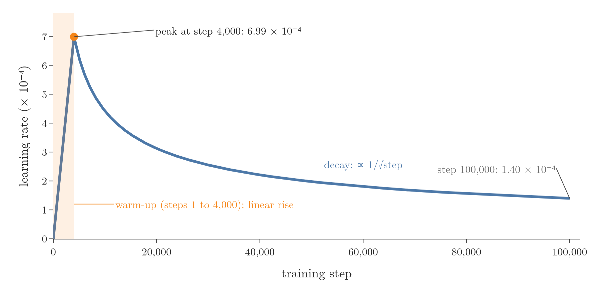{width=95%}

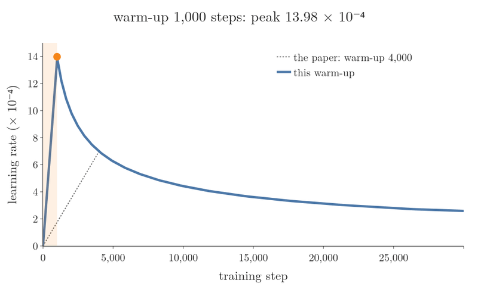{width=95%}

In Figure 8, watch the orange dot as the warm-up gets longer: the peak comes later and is lower, as the formula $(d_{\text{model}} \cdot \text{warmup})^{-0.5}$ says, and after its peak every curve joins the same falling line $1/\sqrt{\text{step}}$. The warm-up length only decides how high the learning rate is allowed to climb before the decay takes over.

**Why start small.** The [improving a neural network Note](../1021-improving-a-neural-network/note.md), section 3.4, met warm-up as a way to train with large batches. For the transformer, Xiong et al. (2020) give a specific reason. In the original transformer, with layer normalisation after each residual addition, "the expected gradients of the parameters near the output layer are large. Therefore, using a large learning rate on those gradients makes the training unstable. The warm-up stage is practically helpful for avoiding this problem" (Xiong et al. 2020, abstract). They also show that moving the layer normalisation inside the residual branch, the **Pre-LN** transformer (G-1545), makes the warm-up unnecessary.

### 7.4 Regularisation: residual dropout and label smoothing

> **Key point:** Dropout with rate 0.1 on every sub-layer's output and on the embeddings, and label smoothing with $\varepsilon = 0.1$: the target puts 0.9 plus a small share on the correct word and spreads the rest over all words, so the model is never pushed to be 100 percent sure.

**Residual dropout.** Dropout (the [dropout Note](../1024-dropout/note.md)) is applied "to the output of each sub-layer, before it is added to the sub-layer input and normalized", and to the sums of the embeddings and positional encodings, with rate $P_{\text{drop}} = 0.1$ for the base model (Vaswani et al. 2017, §5.4, p. 8).

**Label smoothing.** With plain cross-entropy, the target for each position is **one-hot** (G-1380): probability 1 on the correct word, 0 on all others. The loss $-\ln p_{\text{correct}}$ keeps falling as $p_{\text{correct}}$ approaches 1, so training always pushes the model towards complete certainty. Szegedy et al. (2016, §7), who introduced label smoothing, name the two risks of that push: overfitting, because full probability on every training label "is not guaranteed to generalize", and a model that becomes "too confident about its predictions". Label smoothing (G-1031) mixes the one-hot target with a uniform distribution:

1. **In words:** keep $1 - \varepsilon$ of the target on the correct word, and share $\varepsilon$ equally among all $K$ words of the vocabulary, the correct one included.
2. **Formula** (Szegedy et al. 2016, §7):
   $$q'(k) = (1 - \varepsilon)\thinspace\delta_{k,y} + \frac{\varepsilon}{K}$$
   where $y$ is the correct word and $\delta_{k,y}$ is 1 when $k = y$ and 0 otherwise. The loss is the cross-entropy against $q'$: $L = -\sum_k q'(k) \ln p(k)$.
3. **Example:** a vocabulary of $K = 4$ words, nous, sommes, amis, `<end>`, the correct word "nous", and the paper's $\varepsilon = 0.1$ (Notebook):
   $$q' = [0.9 + 0.025,\ 0.025,\ 0.025,\ 0.025] = [0.925,\ 0.025,\ 0.025,\ 0.025]$$

Three predictions, scored both ways (Notebook):

| Prediction $p$ (nous, sommes, amis, `<end>`) | Loss with one-hot target | Loss with smoothed target |
|---|---|---|
| $[0.609,\ 0.224,\ 0.136,\ 0.030]$ (logits 2, 1, 0.5, −1) | 0.495 | 0.633 |
| $[0.925,\ 0.025,\ 0.025,\ 0.025]$ (equal to $q'$) | 0.078 | **0.349** |
| $[0.999,\ 0.0003,\ 0.0003,\ 0.0003]$ (over-confident) | **0.001** | 0.601 |

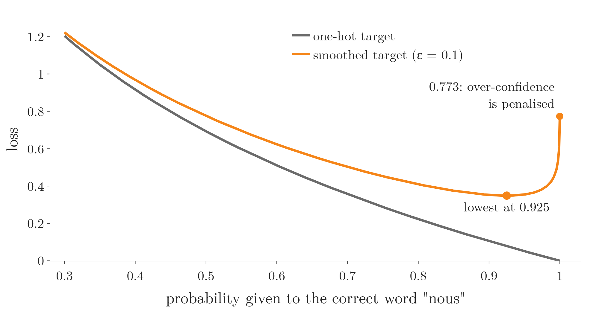{width=90%}

With the one-hot target, the over-confident prediction wins (Figure 9, grey curve). With the smoothed target, the best prediction is $q'$ itself: scanning the probability of "nous" from 0.30 to 0.9999, with the rest shared evenly, the smoothed loss is lowest at exactly 0.925 (Notebook), and at 0.9999 it rises to 0.773. Over-confidence is now penalised.

The paper reports the trade-off: label smoothing "hurts perplexity, as the model learns to be more unsure, but improves accuracy and BLEU score" (Vaswani et al. 2017, §5.4, p. 8). **Perplexity** (G-1492) is the exponential of the mean cross-entropy per token; lower means the model gives the correct tokens higher probability (SLP3 §7.7.1). Table 3, rows (D), shows both effects on the English–German development set:

| $\varepsilon_{ls}$ | 0.0 | 0.1 (base) | 0.2 |
|---|---|---|---|
| Perplexity | 4.67 | 4.92 | 5.47 |
| BLEU | 25.3 | 25.8 | 25.7 |

Perplexity is best without smoothing, because the model is then free to be fully confident; BLEU is best with $\varepsilon = 0.1$.

## 8. What the paper found

### 8.1 Translation results (Table 2)

> **Key point:** The big transformer set new records on both language pairs: 28.4 BLEU on English–German, over 2 BLEU above the best earlier models and ensembles, and 41.8 on English–French. Even the base model beat every earlier English–German model, at the lowest training cost in the table.

The test sets are newstest2014. BLEU (the [history of LLMs Note](../1067-history-of-llms/note.md), section 4) measures how many word sequences of a translation match a human reference. An **ensemble** (G-690) combines the predictions of several trained models (the [ensemble learning Note](../101-ensemble-learning/note.md)).

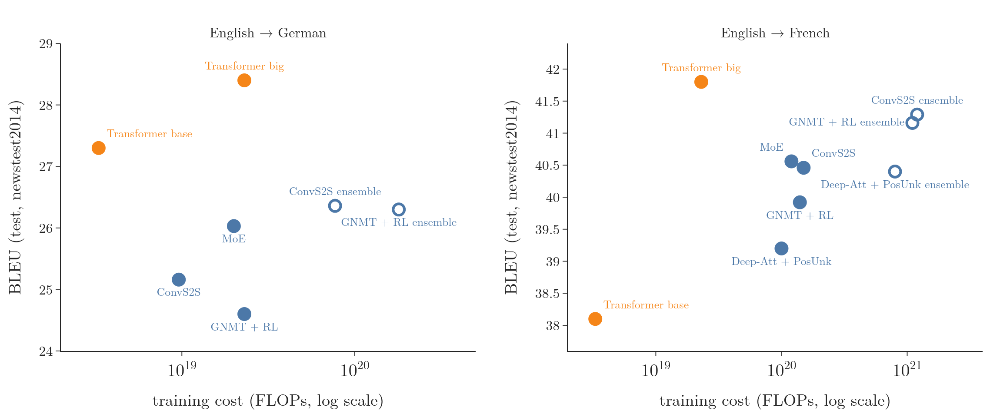{width=100%}

| Model | BLEU EN–DE | BLEU EN–FR | Cost EN–DE (FLOPs) | Cost EN–FR (FLOPs) |
|---|---|---|---|---|
| ByteNet | 23.75 | | | |
| Deep-Att + PosUnk | | 39.2 | | $1.0 \cdot 10^{20}$ |
| GNMT + RL | 24.6 | 39.92 | $2.3 \cdot 10^{19}$ | $1.4 \cdot 10^{20}$ |
| ConvS2S | 25.16 | 40.46 | $9.6 \cdot 10^{18}$ | $1.5 \cdot 10^{20}$ |
| MoE | 26.03 | 40.56 | $2.0 \cdot 10^{19}$ | $1.2 \cdot 10^{20}$ |
| Deep-Att + PosUnk Ensemble | | 40.4 | | $8.0 \cdot 10^{20}$ |
| GNMT + RL Ensemble | 26.30 | 41.16 | $1.8 \cdot 10^{20}$ | $1.1 \cdot 10^{21}$ |
| ConvS2S Ensemble | 26.36 | 41.29 | $7.7 \cdot 10^{19}$ | $1.2 \cdot 10^{21}$ |
| **Transformer (base)** | **27.3** | 38.1 | $3.3 \cdot 10^{18}$ | (same) |
| **Transformer (big)** | **28.4** | **41.8** | $2.3 \cdot 10^{19}$ | (same) |

(Vaswani et al. 2017, Table 2, p. 8; the paper gives one cost per transformer for both language pairs.) From these numbers (Notebook):

- **English–German:** the big model beats the best earlier result, the ConvS2S ensemble, by 2.04 BLEU, at 3.3 times less training cost. The base model beats every earlier model and ensemble at 2.9 times less cost than the cheapest of them with a listed cost, ConvS2S.
- **English–French:** the big model beats every single model, at about a fifth (0.19) of the cost of MoE. The three ensembles score just below it but cost 35 to 52 times more.

The paper also averaged the last 5 saved copies of the weights (checkpoints) for the base model and the last 20 for the big model (§6.1, p. 8).

### 8.2 What changing each part does (Table 3)

> **Key point:** Table 3 changes one setting of the base model at a time and measures English–German BLEU on the development set. Eight heads beat one; shorter keys hurt; bigger models score higher; dropout and label smoothing help; learned and sinusoidal positions tie.

Table 3 is the paper's own evidence on its design choices (Vaswani et al. 2017, Table 3, p. 9; development set newstest2013, beam search but no checkpoint averaging). The base model scores 25.8 BLEU with 65 million parameters.

| Row | What changes | BLEU (dev) | What it shows | Note |
|---|---|---|---|---|
| (A) | heads $h$: 1, 4, 16, 32 (same total size) | 24.9, 25.5, 25.8, 25.4 | one head is 0.9 BLEU worse; "quality also drops off with too many heads" | [1077](../1077-multi-head-attention/note.md) |
| (B) | key size $d_k$: 16, 32 | 25.1, 25.4 | "reducing the attention key size $d_k$ hurts model quality" | here |
| (C) | blocks $N$: 2, 4, 8 | 23.7, 25.3, 25.5 | 6 blocks score best of those tried | [1080](../1080-transformer-encoder/note.md) |
| (C) | $d_{\text{model}}$: 256, 1024 | 24.5 (28 M), 26.0 (168 M) | wider vectors score higher | here |
| (C) | $d_{\text{ff}}$: 1024, 4096 | 25.4 (53 M), 26.2 (90 M) | a wider feed-forward layer scores higher | here |
| (D) | dropout: 0.0, 0.2 | 24.6, 25.5 | "dropout is very helpful in avoiding over-fitting" | [1024](../1024-dropout/note.md) |
| (D) | label smoothing: 0.0, 0.2 | 25.3, 25.7 | section 7.4 | here |
| (E) | learned positions instead of sinusoids | 25.7 | "nearly identical results" | [1078](../1078-positional-encoding/note.md) |
| big | $d_{\text{model}} = 1024$, $d_{\text{ff}} = 4096$, 16 heads, dropout 0.3, 300K steps | 26.4 (213 M) | the best row | here |

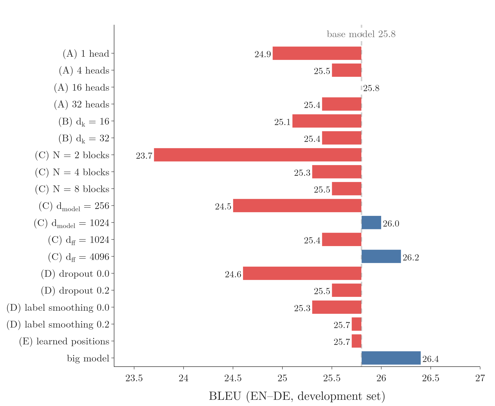{height=60%}

Figure 11 draws the table. The longest red bar is $N = 2$ blocks; the blue bars are all wider or bigger models.

On rows (B), the paper adds: "This suggests that determining compatibility is not easy and that a more sophisticated compatibility function than dot product may be beneficial" (§6.2, p. 9). On rows (C) and (D): "as expected, bigger models are better" (§6.2).

Table 3 changes sizes and settings; it never removes a part such as the residual connections, the layer normalisation or the mask. The evidence for those parts is the table of section 6.

### 8.3 English constituency parsing

> **Key point:** To test whether the transformer works beyond translation, the paper trained it to turn sentences into grammar trees. A 4-block transformer with little tuning scored 91.3 F1 trained on 40,000 sentences and 92.7 with extra data, better than all earlier models except one.

**Constituency parsing** (G-453) finds the grammatical structure of a sentence: which words form a noun phrase, a verb phrase, and so on, as a tree. Vinyals et al. (2015, §2.2 and Figure 2) turned the tree into a sequence by writing it out in depth-first order, so a sequence-to-sequence model can produce it:

> "John has a dog ." → (S (NP NNP )NP (VP VBZ (NP DT NN )NP )VP . )S

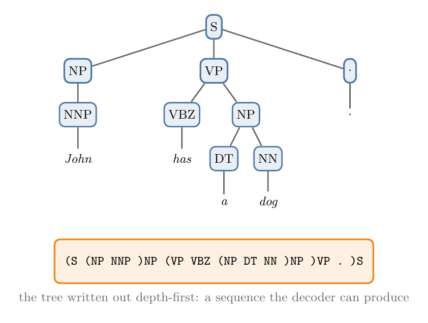{width=80%}

Figure 12 shows the tree and its sequence form. The output is "subject to strong structural constraints and is significantly longer than the input" (Vaswani et al. 2017, §6.3, p. 9).

- **Model:** 4 blocks, $d_{\text{model}} = 1024$; the other settings as the English–German base model, with only "a small number of experiments" to choose dropout, learning rates and beam size (§6.3).
- **Data:** the Wall Street Journal part of the Penn Treebank, "about 40K training sentences"; and a semi-supervised setting with about 17 million extra sentences (§6.3).
- **Score:** F1 (the [precision, recall and F1 Note](../77-precision-recall-f1/note.md)) on section 23 of the WSJ, computed with the standard EVALB tool that compares the predicted tree with the human one (Vinyals et al. 2015, §3.2).

| Training data | Best earlier result in the same setting (Table 4) | Transformer, 4 blocks |
|---|---|---|
| WSJ only (40K sentences) | 91.7 (Dyer et al. 2016) | 91.3 |
| Semi-supervised | 92.1 (McClosky et al. 2006; Vinyals and Kaiser et al. 2014) | 92.7 |

(Vaswani et al. 2017, Table 4, p. 10.) The paper concludes that "despite the lack of task-specific tuning our model performs surprisingly well, yielding better results than all previously reported models with the exception of the Recurrent Neural Network Grammar", and that unlike RNN sequence-to-sequence models it outperforms the BerkeleyParser "even when training only on the WSJ training set of 40K sentences" (§6.3, p. 10).

## 9. Where the idea went next

> **Key point:** The encoder alone became BERT, the decoder alone became GPT, and scaling GPT-style decoders up gave the large language models.

The paper ends with plans: "to extend the Transformer to problems involving input and output modalities other than text" and to make generation "less sequential" (Vaswani et al. 2017, §7, p. 10). What followed is the story of the [history of LLMs Note](../1067-history-of-llms/note.md), section 8:

- **Encoder only: BERT** (Google, October 2018), pre-trained to predict hidden words from the words on both sides.
- **Decoder only: GPT** (OpenAI, June 2018), pre-trained to predict the next word.
- **Scale:** GPT grew from 117 million parameters to 175 billion in GPT-3, and ChatGPT was built on a GPT model (the [history of LLMs Note](../1067-history-of-llms/note.md), sections 8 and 9).

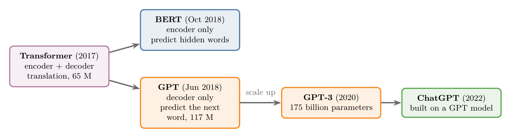{width=100%}

Figure 13 puts the three bullets on one line of descent.

The decoder-only layout is the one behind today's large language models. A **decoder-only transformer** (G-565) has no encoder and therefore no cross-attention: each block keeps the masked self-attention and the feed-forward network, and the model is trained only to predict the next token. The [decoder-only GPT Note](../1087-decoder-only-gpt/note.md) walks through it on GPT-2.

The [introduction to transformers Note](../1071-introduction-to-transformers/note.md), section 6, follows the same architecture into images, proteins and code.

## 10. Reading the paper

> **Key point:** Every section of "Attention Is All You Need" maps onto a Note. With the Notes behind us, the paper can be read from start to end.

| Paper section | Pages | What it says | Note |
|---|---|---|---|
| Abstract | 1 | attention only; 28.4 and 41.8 BLEU; 3.5 days on 8 GPUs | this Note, §8.1 |
| 1 Introduction | 2 | RNNs are sequential; attention used "in conjunction with a recurrent network" | [1071](../1071-introduction-to-transformers/note.md), this Note §3 |
| 2 Background | 2 | convolutional models; self-attention defined | [1072](../1072-what-is-self-attention/note.md), [1076](../1076-why-self-attention/note.md) |
| 3.1 Encoder and decoder stacks | 3 | $N = 6$; sub-layers; $\text{LayerNorm}(x + \text{Sublayer}(x))$; mask | [1080](../1080-transformer-encoder/note.md), [1083](../1083-transformer-decoder/note.md), [1079](../1079-layer-normalization/note.md) |
| 3.2.1 Scaled dot-product attention | 4 | eq. 1; why divide by $\sqrt{d_k}$ | [1073](../1073-self-attention-step-by-step/note.md), [1074](../1074-scaled-dot-product-attention/note.md), [1075](../1075-self-attention-geometric-intuition/note.md) |
| 3.2.2 Multi-head attention | 4–5 | $h = 8$, $d_k = d_v = 64$ | [1077](../1077-multi-head-attention/note.md) |
| 3.2.3 Applications of attention | 5 | encoder self-, masked decoder self-, encoder–decoder attention | [1076](../1076-why-self-attention/note.md), [1081](../1081-masked-self-attention/note.md), [1082](../1082-cross-attention/note.md) |
| 3.3 Position-wise feed-forward | 5 | eq. 2; $d_{\text{ff}} = 2048$ | [1080](../1080-transformer-encoder/note.md) |
| 3.4 Embeddings and softmax | 5 | shared weights; $\times \sqrt{d_{\text{model}}}$ | [1083](../1083-transformer-decoder/note.md) |
| 3.5 Positional encoding | 6 | sines and cosines | [1078](../1078-positional-encoding/note.md) |
| 4 Why self-attention, Table 1 | 6–7 | complexity, sequential operations, path length | [1071](../1071-introduction-to-transformers/note.md), section 5 |
| 5.1–5.2 Data, hardware | 7 | 4.5M pairs; 8 P100 GPUs; 12 hours, 3.5 days | this Note, §7.1–7.2 |
| 5.3 Optimizer | 7 | Adam; warm-up schedule, eq. 3 | [1038](../1038-adam/note.md), this Note §7.3 |
| 5.4 Regularisation | 8 | residual dropout; label smoothing | [1024](../1024-dropout/note.md), this Note §7.4 |
| 6.1 Machine translation, Table 2 | 8 | records at a fraction of the cost; beam search | this Note §8.1, [1084](../1084-transformer-inference/note.md) |
| 6.2 Model variations, Table 3 | 9 | one change at a time | this Note §8.2 |
| 6.3 Constituency parsing, Table 4 | 9–10 | the transformer beyond translation | this Note §8.3 |
| 7 Conclusion | 10 | other modalities; less sequential generation | this Note §9 |

Table 1 in brief: per layer, self-attention costs $O(n^2 \cdot d)$ with $O(1)$ sequential operations and a maximum path length of $O(1)$ between any two positions; a recurrent layer costs $O(n \cdot d^2)$ with $O(n)$ sequential operations and path length $O(n)$ (Vaswani et al. 2017, Table 1, p. 6). Here $n$ is the sentence length and $d$ the vector size. "The shorter these paths between any combination of positions in the input and output sequences, the easier it is to learn long-range dependencies" (§4, p. 6).

## 11. Summary

| Stage | The transformer's answer |
|---|---|
| Words to numbers | embeddings $\times \sqrt{512}$, plus sine–cosine positions |
| Context | multi-head self-attention: 8 heads of 64, scaled by $\sqrt{d_k}$ |
| Stability in depth | residual connection, then layer normalisation, after every sub-layer |
| Per-word processing | feed-forward 512 → 2048 → 512 |
| Writing the output | masked self-attention, cross-attention to $H_{\text{enc}}$, linear, softmax |
| Training | teacher forcing, one parallel pass, cross-entropy with label smoothing 0.1 |
| Optimiser | Adam; learning rate up for 4,000 steps, then down as $1/\sqrt{\text{step}}$ |
| Inference | one word per step, mask on, KV cache, beam search of 4 |

- The transformer is the end of a chain: RNN → LSTM → encoder–decoder → attention → self-attention, each fixing the last one's main problem.
- Every vector inside the base model has 512 numbers; the model has about 63–65 million parameters.
- The warm-up keeps the first updates small, when the gradients near the output are large.
- Label smoothing makes the target 0.925 on the correct word (for 4 words): perplexity gets worse, BLEU better.
- Trained 12 hours on 8 GPUs, the base model beat every earlier English–German model; the big model set records on both language pairs at a fraction of the earlier models' cost.

## 12. Sources

**Built from**

- CampusX, "Transformer Architecture | Part 1 Encoder Architecture | CampusX", YouTube, https://www.youtube.com/watch?v=Vs87qcdm8l0
- CampusX, "Transformer Decoder Architecture | Deep Learning | CampusX", YouTube, https://www.youtube.com/watch?v=DI2_hrAulYo
- CampusX, "Transformer Inference | How Inference is done in Transformer? | Deep Learning | CampusX", YouTube, https://www.youtube.com/watch?v=FtsMOzlwxws
- Sanderson, G. (3Blue1Brown), "Transformers, the tech behind LLMs | Deep Learning Chapter 5", 2024, 3blue1brown.com/lessons/gpt, https://www.youtube.com/watch?v=wjZofJX0v4M. 1:31–5:42 (data flowing through embeddings, attention and MLP blocks to a next-word distribution; predict, append, repeat).
- Vaswani, A., Shazeer, N., Parmar, N., Uszkoreit, J., Jones, L., Gomez, A. N., Kaiser, Ł. and Polosukhin, I. (2017). Attention Is All You Need. *NeurIPS 2017*. arXiv:1706.03762 (v7). Abstract; §1 (sequential computation); §3.1–3.5; Table 1 and §4; §5.1 (data, 4.5M pairs, 37,000 tokens, 36M sentences, 25,000-token batches); §5.2 (8 P100 GPUs, 0.4 s and 1.0 s per step, 12 hours and 3.5 days); §5.3 (Adam settings, eq. 3, 4,000 warm-up steps); §5.4 (residual dropout 0.1, label smoothing 0.1, the perplexity quote); §6.1 and footnote 5 (results, checkpoint averaging, beam search, FLOPs estimate, 9.5 TFLOPS for a P100); Table 2; §6.2 and Table 3; §6.3 and Table 4; §7.
- The earlier Notes of this collection, 1060 to 1084, whose parts this Note puts back together (linked in its text).

**Other references**

- Szegedy, C., Vanhoucke, V., Ioffe, S., Shlens, J. and Wojna, Z. (2016). Rethinking the Inception Architecture for Computer Vision. *CVPR 2016*. arXiv:1512.00567. §7 (label smoothing, $q'(k) = (1-\epsilon)\delta_{k,y} + \epsilon/K$; over-fitting and over-confidence).
- Xiong, R. et al. (2020). On Layer Normalization in the Transformer Architecture. *ICML 2020*. arXiv:2002.04745. Abstract (why the warm-up is needed in the Post-LN transformer; Pre-LN without warm-up).
- Vinyals, O., Kaiser, Ł., Koo, T., Petrov, S., Sutskever, I. and Hinton, G. (2015). Grammar as a Foreign Language. *NeurIPS 2015*. arXiv:1412.7449. §2.2 and Figure 2 (linearising a parse tree); §3.2 (EVALB, F1).
- Jurafsky, D. and Martin, J. H. *Speech and Language Processing*, 3rd ed. draft (19 August 2026), ch. 7, §7.7.1 (perplexity as the exponential of the mean cross-entropy) and §7.8 (KV cache).

## 13. Key terms

| Term | Meaning |
|---|---|
| Transformer | An encoder–decoder built from attention, feed-forward layers and layer normalisation, with no RNN |
| Observation | One record of the data; here, one sentence pair |
| Target | The output the model must learn to produce; here, the French sentence and, at each position, the correct next word |
| Base model | The paper's standard transformer: $N = 6$, $d_{\text{model}} = 512$, 8 heads, $d_{\text{ff}} = 2048$, 65 million parameters |
| Big model | The paper's larger transformer: $d_{\text{model}} = 1024$, $d_{\text{ff}} = 4096$, 16 heads, 213 million parameters |
| Learning-rate warm-up (G-1071) | Starting training with a small learning rate and raising it over the first steps; 4,000 steps in the paper |
| Inverse square root decay | Lowering the learning rate in proportion to $1/\sqrt{\text{step}}$ after the warm-up |
| Residual dropout | Dropout applied to each sub-layer's output before the residual addition |
| Label smoothing | Replacing the one-hot target by $(1-\varepsilon)$ on the correct word plus $\varepsilon/K$ on every word |
| One-hot target | A target with probability 1 on the correct word and 0 on all others |
| Perplexity | The exponential of the mean cross-entropy per token; lower is better |
| FLOP | One floating-point operation; training cost is counted in FLOPs |
| Ensemble | Several trained models whose predictions are combined |
| Checkpoint averaging | Averaging the weights of the last few saved copies of a model |
| Beam search | Decoding that keeps several candidate sentences at each step |
| Constituency parsing | Finding the grammatical tree of a sentence: its phrases and how they nest |
| Pre-LN transformer (G-1545) | A transformer variant with layer normalisation inside the residual branch, which trains without warm-up |
