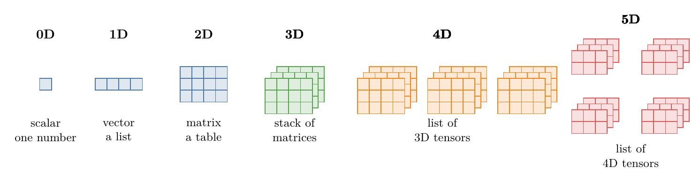
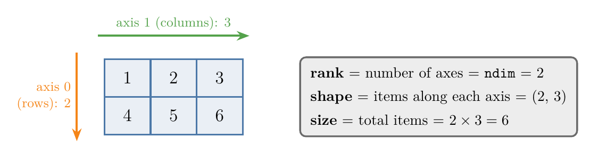
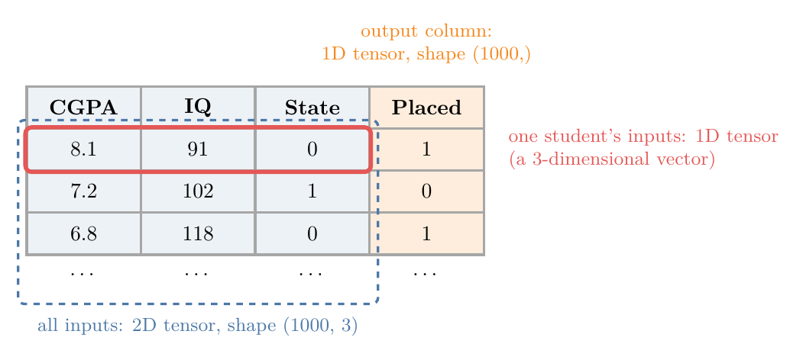
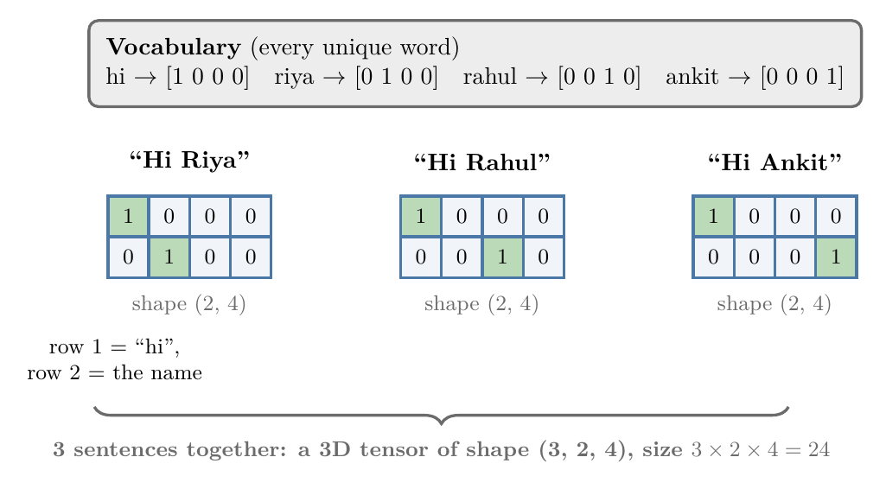
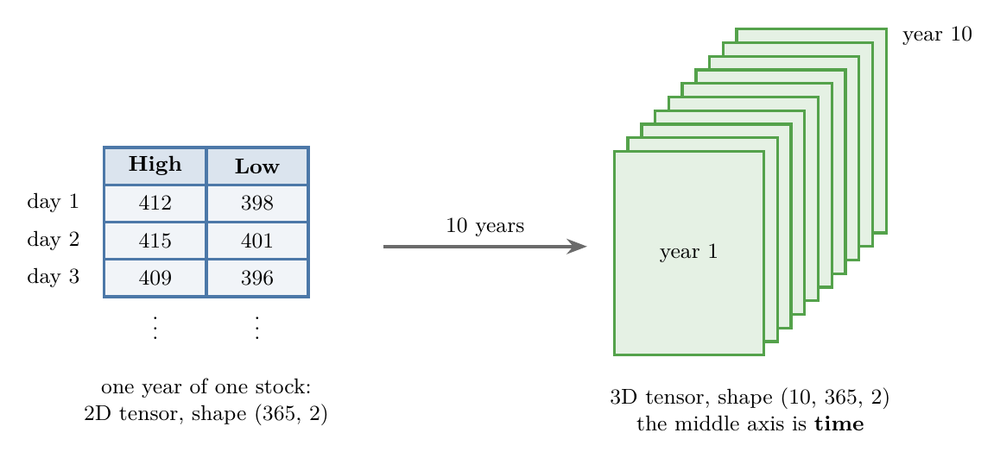
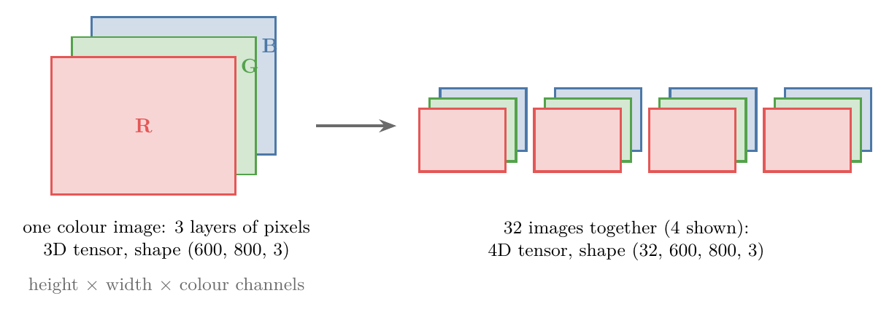

<!-- where-this-fits: generated by course_map/build_map.py; edit concepts.yaml, not this block -->
> **Where this fits:** Pipeline map steps 0 (Foundations), 5 (Engineer features). See the [Course map](../01-course-map/note.md).
>
> 
>
> - **Leads to:** Feature engineering (Video 23, coming).
> - **Compare with:** Ordinal and label encoding (Video 26, coming).
<!-- /where-this-fits -->

## 1. Overview

> **Key point:** A tensor is a container for numbers, organised along one or more axes. All ML data, from tables to videos, is stored as tensors.


Every ML library, such as scikit-learn, TensorFlow and PyTorch, stores data in the same basic structure: the **tensor**. It is so central that Google's deep learning library, TensorFlow, is named after it.



Figure 1 shows the whole family. The rest of this Note explains each one and where it appears in real data.

## 2. What a tensor is

> **Key point:** Scalars, vectors and matrices are all tensors; "tensor" is the general name for any number of dimensions.

A **tensor** is a data structure: a container that stores numbers. (It can store text too, but in ML it almost always holds numbers.)

We have met tensors before under other names:

- a single number is a **scalar**,
- a list of numbers is a **vector**,
- a table of numbers is a **matrix**.

But what do we call a stack of matrices, or a stack of those? Rather than inventing a new name for every case, mathematics and physics use one general term for all of them: tensor.

> **Extra:** Programmers know tensors as **arrays**: a 1D array is a list, a 2D array a list of lists, and so on. In NumPy, the main Python library for numbers, every tensor is an array.

## 3. Tensors from 0D to 5D

> **Key point:** A tensor of one dimension higher is a collection of tensors of the dimension below.

### 3.1 Scalars, vectors and matrices

> **Key point:** 0D = one number, 1D = a list, 2D = a table.

- **0D tensor (scalar):** a single number, e.g. 4.
- **1D tensor (vector):** a list of numbers, e.g. [1, 2, 3, 4].
- **2D tensor (matrix):** rows and columns of numbers, e.g. [[1, 2, 3], [4, 5, 6]].

> **Python:** Creating tensors in NumPy.
>
> ```python
> import numpy as np
>
> scalar = np.array(4)                       # 0D
> vector = np.array([1, 2, 3, 4])            # 1D
> matrix = np.array([[1, 2, 3], [4, 5, 6]])  # 2D
>
> print(matrix.ndim)    # 2: number of axes
> print(matrix.shape)   # (2, 3): items along each axis
> print(matrix.size)    # 6: total items
> ```
>
> `np.array(...)` turns numbers or nested lists into a tensor. `ndim`, `shape` and `size` are explained in Section 4.

### 3.2 Each tensor is built from the one below

> **Key point:** Stack scalars to get a vector, vectors to get a matrix, matrices to get a 3D tensor, and so on.


Figure 2 shows the pattern that runs through all tensors:

1. Line up scalars: a vector (1D).
2. Stack vectors: a matrix (2D).
3. Stack matrices: a 3D tensor.
4. Line up 3D tensors: a 4D tensor.

The pattern never stops: a 5D tensor is a collection of 4D tensors, and so on.

### 3.3 Higher dimensions

> **Key point:** We cannot picture 4D or 5D directly, but we can always picture them as collections of 3D tensors.

- **3D tensor:** several matrices stacked one behind another, like a cube of numbers.
- **4D tensor:** a list of 3D tensors, like several cubes in a row.
- **5D tensor:** a list of 4D tensors, like several rows of cubes.

In ML, we almost always work with tensors from 0D to 5D. Section 6 shows a real example of each.

## 4. Rank, axes, shape and size

> **Key point:** Rank = number of axes; shape = items along each axis; size = total items.

Four words describe any tensor (Figure 3):



- An **axis** is one direction along which the numbers are arranged. A matrix has two: down the rows (axis 0) and across the columns (axis 1).
- The **rank** is the number of axes. It is the same as the number of dimensions of the tensor, and NumPy calls it `ndim`. Scalar: 0, vector: 1, matrix: 2.
- The **shape** lists how many items lie along each axis. The matrix in Figure 3 has shape (2, 3): 2 rows and 3 columns.
- The **size** is the total number of items in the tensor.

**Size**, step by step:

1. **In words:** multiply together all the numbers in the shape.
2. **Formula:** for a tensor of shape $(n_1, n_2, \ldots, n_k)$, $\text{size} = n_1 \times n_2 \times \cdots \times n_k$.
3. **Example:** shape (2, 3) gives $2 \times 3 = 6$ items; shape (3, 2, 4) gives $3 \times 2 \times 4 = 24$ items.

A scalar has shape () and size 1. A vector of 4 numbers has shape (4,) and size 4.

## 5. A 1D tensor can be a 3-dimensional vector

> **Key point:** "Dimensions of a tensor" = number of axes. "Dimensions of a vector" = number of items in it. They are different things.

The word *dimension* is used in two different ways, and mixing them up is a common source of confusion.

- **Dimensions of a tensor:** the number of axes. [1, 2, 3, 4] has one axis, so it is a 1D tensor.
- **Dimensions of a vector:** the number of items in it. [1, 2, 3, 4] has four items, so it is a 4-dimensional vector.

Both statements are true at the same time: [1, 2, 3, 4] is a 1D tensor and a 4-dimensional vector.

*Example: one student.* A student with CGPA 8.1, IQ 91 and state code 0 is described by [8.1, 91, 0]. This is a point in 3-dimensional space, with one axis for each input column (Figure 4). So it is a 3-dimensional vector, but still a 1D tensor.


With 50 input columns, each student would be a 50-dimensional vector, and still a 1D tensor.

## 6. Tensors in real ML data

> **Key point:** Tables are 2D, text and time series are 3D, images are 4D, and videos are 5D.

### 6.1 1D and 2D: tabular data

> **Key point:** One row is a 1D tensor; the whole table of inputs is a 2D tensor.

Most ML data starts as a table (Figure 5). Suppose we have 1,000 students with three input columns (CGPA, IQ, state) and an output column (placed or not):



- **One student's inputs:** [8.1, 91, 0], a 1D tensor of shape (3,).
- **All students' inputs:** a 2D tensor of shape (1000, 3). It is a collection of 1,000 rows, each a 1D tensor.
- **The output column:** a 1D tensor of shape (1000,).

Whenever we work with tabular data, we are working with 1D and 2D tensors.

> **Extra:** The table of all inputs is usually called **X**, and the output column **y**. You will see these names in almost all ML code.

### 6.2 3D: text

> **Key point:** Each word becomes a vector, each sentence a matrix, and a set of sentences a 3D tensor.

ML algorithms work only with numbers, so text must be turned into numbers first. Converting text into vectors is called **vectorization**.

One simple method is **one-hot encoding**:

1. List every unique word: the **vocabulary**. For "Hi Nitish", "Hi Rahul" and "Hi Ankit", it is: hi, nitish, rahul, ankit.
2. Give each word a vector with a 1 in its own position and 0 everywhere else: hi = [1, 0, 0, 0], nitish = [0, 1, 0, 0], and so on.
3. Each sentence becomes a matrix with one row per word. "Hi Rahul" has 2 words, so its shape is (2, 4).



All three sentences together form a 3D tensor of shape (3, 2, 4), with size $3 \times 2 \times 4 = 24$ (Figure 6).

### 6.3 3D: time series

> **Key point:** Measurements taken at regular times stack into a 3D tensor, with one axis for time.

A **time series** is data recorded at regular intervals, such as a stock's price every day.



Figure 7 builds it up:

- **One year:** the daily high and low prices for 365 days form a 2D tensor of shape (365, 2).
- **Ten years:** ten of those yearly tables stacked together form a 3D tensor of shape (10, 365, 2).

The middle axis here is the **time axis**. Much medical and sensor data has this same form.

### 6.4 4D: images

> **Key point:** One colour image is a 3D tensor; a batch of images is a 4D tensor.

An image is a grid of tiny dots called **pixels**, and each pixel is stored as numbers.

- **Black and white:** one number per pixel, so the image is a 2D tensor (height x width).
- **Colour:** each pixel has three numbers, for red, green and blue. These form three layers called **channels**, so a colour image is a 3D tensor of shape (height, width, 3).



A colour image 600 pixels high and 800 wide has shape (600, 800, 3). A batch of 32 such images is a 4D tensor of shape (32, 600, 800, 3) (Figure 8). Image tasks in deep learning, covered later in the course, work with exactly these tensors.

> **Extra:** The order of the axes is a convention. TensorFlow usually puts the channels last, (batch, height, width, channels), while PyTorch puts them first, (batch, channels, height, width). Always check which order a library expects.

### 6.5 5D: video

> **Key point:** A video is a sequence of images, so a batch of videos is a 5D tensor, and an enormous one.

A video is a series of images, called **frames**, shown quickly one after another. Our eyes can tell apart only about 12 separate images per second, so faster sequences look like smooth motion. Videos are usually recorded at 30, 60 or 120 frames per second.

Take 4 videos, each 60 seconds long at 30 frames per second, with frames of 480 x 720 pixels in colour (Figure 9):


- **One frame:** a 3D tensor of shape (480, 720, 3).
- **One video:** $60 \times 30 = 1800$ frames, so a 4D tensor of shape (1800, 480, 720, 3).
- **Four videos:** a 5D tensor of shape (4, 1800, 480, 720, 3).

**Storage**, step by step:

1. **In words:** count the numbers in the tensor, then multiply by the bytes each number takes. A common format stores each number in 32 bits, which is 4 bytes.
2. **Formula:** $\text{storage (bytes)} = \text{size} \times 4$.
3. **Example:** $\text{size} = 4 \times 1800 \times 480 \times 720 \times 3 = 7{,}464{,}960{,}000$ numbers, so storage $= 7{,}464{,}960{,}000 \times 4 = 29{,}859{,}840{,}000$ bytes: about 30 billion bytes.

Converted to gigabytes, that is about 27.8 GB if 1 GB means $1024^3$ bytes (the usual convention in computing), or 29.9 GB if 1 GB means $10^9$ bytes. Either way, four one-minute videos need around 28 to 30 GB when stored raw. This is why video formats such as MPEG and MP4 **compress** the data, storing much less without a visible loss in quality. A one-minute MP4 at this resolution is typically only about 10 to 50 MB: hundreds of times smaller than the raw numbers.

The Notebook for this Note (`notebook.ipynb`) builds every tensor in this Note in NumPy: from a scalar to a real photo (shape (427, 640, 3)) and the video storage calculation.

## 7. Summary

| Rank | Name | Example in ML | Example shape |
|---|---|---|---|
| 0D | Scalar | One number | () |
| 1D | Vector | One student's inputs; an output column | (3,); (1000,) |
| 2D | Matrix | A table of inputs | (1000, 3) |
| 3D | 3D tensor | Sentences; time series; one colour image | (3, 2, 4); (10, 365, 2); (600, 800, 3) |
| 4D | 4D tensor | A batch of colour images | (32, 600, 800, 3) |
| 5D | 5D tensor | A batch of videos | (4, 1800, 480, 720, 3) |

- A tensor is a container for numbers; scalars, vectors and matrices are all tensors.
- Each tensor is a collection of tensors one dimension lower.
- Rank = number of axes (`ndim`); shape = items per axis; size = product of the shape.
- A 1D tensor with *n* items is an *n*-dimensional vector: two different meanings of "dimension".

## 8. Key terms

| Term | Meaning |
|---|---|
| Tensor | A container of numbers arranged along one or more axes |
| Scalar | A single number: a 0D tensor |
| Vector | A list of numbers: a 1D tensor |
| Matrix | A table of numbers: a 2D tensor |
| Array | The programming name for a tensor (as in NumPy) |
| Axis | One direction along which a tensor's items are arranged |
| Rank | The number of axes of a tensor (`ndim` in NumPy) |
| Shape | The number of items along each axis |
| Size | The total number of items: the product of the shape |
| X, y | Usual names for the input table and the output column |
| Vectorization | Converting data such as text into vectors of numbers |
| One-hot encoding | Representing each word or category by a vector with a single 1 |
| Vocabulary | The list of unique words in a set of texts |
| Time series | Data recorded at regular time intervals |
| Pixel | One dot of an image, stored as one or more numbers |
| Channel | One colour layer of an image (red, green or blue) |
| Frame | One image in a video |
| Compression | Storing data in less space |
