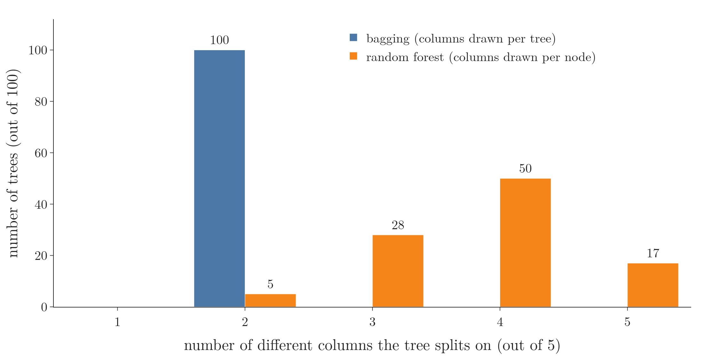

<!-- where-this-fits: generated by course_map/build_map.py; edit concepts.yaml, not this block -->
> **Where this fits:** Pipeline map step 8 (Model). See the [Course map](../01-course-map/note.md).
>
> 
>
> - **Builds on:** Overfitting ([Note 91](../91-knn/note.md)); Hyperparameter tuning ([Note 98](../98-decision-tree-hyperparameters/note.md)); Decision trees ([Note 100](../100-dtreeviz/note.md)); Feature importance ([Note 100](../100-dtreeviz/note.md)); Bagging ([Note 107](../107-bagging-regressor/note.md)); OOB score ([Note 107](../107-bagging-regressor/note.md)).
> - **Leads to:** Balanced random forest ([Note 133](../133-imbalanced-data/note.md)).
> - **Compare with:** Bagging ([Note 107](../107-bagging-regressor/note.md)); Dropout ([Note 1024](../1024-dropout/note.md)).
<!-- /where-this-fits -->

## 1. Overview

> **Key point:** Two differences: bagging can use any base model while a random forest always uses decision trees; and bagging samples features once per tree while a random forest samples them again at every node.


A random forest is built on bagging (the [random forest introduction Note](../108-random-forest-intro/note.md)), but the two are not the same, even when bagging uses decision trees. Figure 1 shows the subtle difference: **where** the **features** (input variables, one column of the data table each) are sampled. Each **observation** (one record, one row of the table) has a value for every feature and a **target**, the class we predict.

This Note covers both differences and checks the second one in code. The Notebook (`notebook.ipynb`) runs every check.

## 2. Difference 1: the base model

> **Key point:** Bagging is a general technique for any algorithm; a random forest is made of decision trees only.

In bagging, the base models can come from any algorithm, as long as they all use the same one: all decision trees, all KNN or all SVMs (the [bagging classifier Note](../106-bagging-classifier/note.md), section 2.2). Decision trees, KNN and SVMs are the usual choices.

In a random forest, the base model is always a decision tree. scikit-learn's classes show this directly:

- `BaggingClassifier` has an `estimator` parameter for choosing the base model; when it is left at `None`, it uses a decision tree.
- `RandomForestClassifier` has `n_estimators`, the number of trees, but **no** parameter for choosing the base model.

> **Extra:** Older documentation and code call this parameter `base_estimator`. It was renamed `estimator` and the old name was removed in scikit-learn 1.4 (the [bagging classifier Note](../106-bagging-classifier/note.md), section 3.2).

## 3. Difference 2: tree-level against node-level feature sampling

> **Key point:** Bagging fixes each tree's features before the tree is grown; a random forest picks a fresh random set of features before every split.

So is a bagging ensemble of decision trees a random forest? **No.** The remaining difference is in how the features are sampled (feature sampling: the [random forest introduction Note](../108-random-forest-intro/note.md), section 4).

Take a dataset with 5 features, and suppose each tree may use 2 of them (`max_features=2` in both classes).

### 3.1 Bagging: tree-level sampling

> **Key point:** Two features are drawn once; every split in that tree uses one of those two.

Before tree 1 is grown, 2 of the 5 features are drawn at random, say col1 and col3. Tree 1 is then trained on those two features only, and every split in it is on col1 or col3 (Figure 1, left). Tree 2 gets its own pair, say col4 and col5; tree 3 col1 and col4; and so on.

Bagging therefore uses **tree-level feature sampling**: the features are decided once, before the tree is built, and no other feature is ever touched by that tree.

### 3.2 Random forest: node-level sampling

> **Key point:** Two features are drawn at every node, so one tree can end up using all five.

In a random forest, the draw happens again **every time a node is about to split** (Figure 1, right). The forest therefore uses **node-level feature sampling**:

- the root draws col2 and col3, and splits on the better of the two, col3;
- the next node draws again, col4 and col5, and splits on col4;
- the next draws col2 and col1, and splits on col1.

Node-level sampling is exactly the `max_features` setting of a single decision tree (the [decision tree hyperparameters Note](../98-decision-tree-hyperparameters/note.md), section 4.6), applied in every tree of the forest. Node-level sampling adds more randomness than tree-level sampling.

### 3.3 Why more randomness helps

> **Key point:** More randomness makes the trees more different from each other, and an ensemble of different models performs better.

From the ensemble Notes (the [voting ensemble Note](../102-voting-ensemble/note.md)): an ensemble works best when its base models are each better than chance and as different from each other as possible. Node-level sampling makes the trees more different, so a random forest usually beats a bagging ensemble of trees.

ESL Figure 15.1 shows this gain on spam email data, and section 4.3 repeats the comparison on the same data.

> **Extra:** Why does difference between the trees matter so much? Suppose each tree's prediction has variance $\sigma^2$ and any two trees are correlated by $\rho$ (0: unrelated, 1: identical).
>
> 1. **In words:** the variance of the average of $n$ trees has a part that more trees can remove and a part, set by the correlation, that they cannot.
> 2. **Formula:**
> $$\text{variance of the average} = \rho\thinspace\sigma^2 + \frac{1 - \rho}{n}\thinspace\sigma^2$$
> 3. **Example:** with $\sigma^2 = 1$ and $n = 100$ trees: for $\rho = 0.6$, $0.6 + 0.4/100 = 0.604$; for $\rho = 0.3$, $0.3 + 0.7/100 = 0.307$.
>
> Adding trees only shrinks the second term. The first term stays, however many trees we add, unless the trees become less alike. Lowering $\rho$ is exactly what node-level sampling does. (ESL §15.2, eq. 15.1)

## 4. Checking it in code

> **Key point:** Every bagged tree splits on exactly 2 features; the forest's trees split on 2 to 5 features, most often 4.

We use a dataset of 100 observations and 5 features, col1 to col5, made with `make_classification`, and give both classes `max_features=2`.

### 4.1 The bagged trees

> **Key point:** The first bagged tree only ever splits on col5 and col1, the two features it was given.

> **Python:** Bagging with 2 features per tree, and the features each tree got.
>
> ```python
> from sklearn.ensemble import BaggingClassifier
>
> bag = BaggingClassifier(max_features=2, random_state=42)
> bag.fit(df.iloc[:, :5], df["target"])
> bag.estimators_features_[0]      # array([4, 0])
> ```
>
> `bag.estimators_[0]` is the first trained tree. `estimators_features_[0]` lists the features it was given (the [bagging classifier Note](../106-bagging-classifier/note.md), section 3.3): positions 4 and 0, that is col5 and col1.

When we print the first tree, every split is on `feature_0` or `feature_1`. Careful: these are **not** col1 and col2. The tree was trained on a 2-column table, so it numbers those two features 0 and 1 itself; `estimators_features_` maps them back to col5 and col1.

> **Python:** Printing a tree with the real feature names.
>
> ```python
> from sklearn.tree import export_text
>
> cols = bag.estimators_features_[0]
> print(export_text(bag.estimators_[0],
>       feature_names=list(df.columns[cols])))
> ```
>
> `export_text` prints a tree as indented text, one line per split. `feature_names` replaces `feature_0`, `feature_1`, ... with names.

All 10 bagged trees use exactly 2 features: (col1, col5), (col1, col3), (col3, col5), and so on.

### 4.2 The forest's trees

> **Key point:** The first forest tree splits on col3, col5, col1 and col2: four different features with `max_features=2`.

The first tree of `RandomForestClassifier(max_features=2)` splits first on col3, then on col5, col1 and col2. Every tree of a forest is trained on all the features, so its feature numbers are the real ones.

{height=30%}

Figure 2 counts, for 100 trees of each kind, how many different features each tree splits on:

- **bagging:** all 100 trees use exactly 2 features;
- **random forest:** 5 trees use 2 features, 28 use 3, 50 use 4, and 17 use all 5.

The counts prove the point: bagging samples features at the tree level, a random forest at the node level.

### 4.3 Does it pay off?

> **Key point:** On real spam data, the random forest scores 0.953, bagging 0.946 with all features and 0.922 with 7 features per tree.

We use the Spambase data (UCI, via OpenML): 4,601 emails, 57 features such as how often words like "free" or "$" appear, and a target of spam or not. ESL §15.2 compares bagging and random forests on the same data. Each model has 200 trees, scored with 5-fold cross-validation repeated 3 times:

| Model | Features | Accuracy |
|---|---|---|
| Bagging | all 57 per tree | 0.946 |
| Bagging | 7 per tree (tree level) | 0.922 |
| Random forest | 7 per node ($\sqrt{57} \approx 7$, the default) | **0.953** |

The random forest makes about 13% fewer mistakes than bagging (4.7% against 5.4% of emails wrong), the same ranking ESL Figure 15.1 shows on this data. Tree-level sampling is the worst of the three: each tree is stuck with 7 random features for its whole life and often misses the most useful words.

> **Extra:** A bagging ensemble of trees that each sample features at every node, `BaggingClassifier(DecisionTreeClassifier(max_features="sqrt"))`, scores 0.953 too. So with node-level sampling, bagged trees **are** a random forest, which is how scikit-learn defines one (scikit-learn User Guide §1.11).

## 5. Summary

| | Bagging | Random forest |
|---|---|---|
| Base model | any algorithm (`estimator`) | decision trees only |
| Feature sampling | once per tree (tree level) | at every node (node level) |
| Features one tree can use, with `max_features=2` of 5 | exactly 2 | up to all 5 |
| Randomness | less | more |
| On the spam data (accuracy) | 0.946 (all features) | 0.953 |

- A bagging ensemble of decision trees is still not a random forest.
- Bagging decides each tree's features before it is grown; a random forest re-draws them before every split.
- More randomness makes the trees less alike, which makes the forest better (spam data: 0.953 against 0.946).
- In a bagged tree, `feature_0`, `feature_1`, ... are positions within that tree's own features; `estimators_features_` maps them back.

## 6. Sources

**Built from**

- CampusX, "Bagging Vs Random Forest | What is the difference between Bagging and Random Forest | Very Important", YouTube, https://www.youtube.com/watch?v=l93jRojZMqU

**Other references**

- Hastie, T., Tibshirani, R. and Friedman, J. (2009). *The Elements of Statistical Learning*, 2nd ed. Springer. §15.2 (eq. 15.1, variance of an average of correlated trees; Figure 15.1, bagging against random forest on the spam data).
- Hopkins, M., Reeber, E., Forman, G. and Suermondt, J. (1999). Spambase \[dataset\]. UCI Machine Learning Repository. archive.ics.uci.edu/dataset/94/spambase
- scikit-learn developers. User Guide, §1.11 "Ensembles", Random forests. scikit-learn.org/stable/modules/ensemble.html

## 7. Key terms

| Term | Meaning |
|---|---|
| Tree-level feature sampling | Drawing one random set of features per tree, before the tree is grown; every split of that tree uses only those features (bagging) |
| Node-level feature sampling | Drawing a new random set of features before every split (random forest) |
| export_text | scikit-learn function that prints a trained tree as indented text |
| Correlation between base models | How alike two base models' predictions are; the less alike, the more an ensemble cuts variance |
