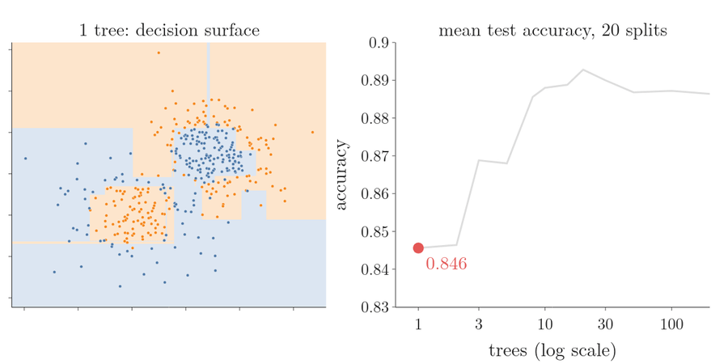
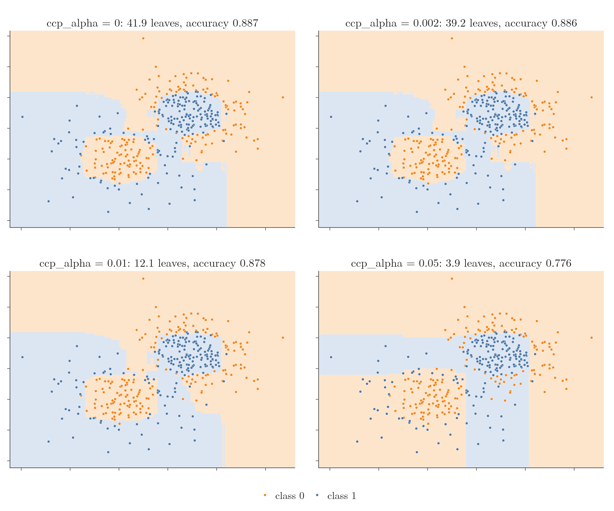
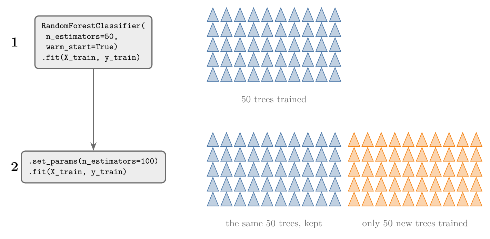

<!-- where-this-fits: generated by course_map/build_map.py; edit concepts.yaml, not this block -->
> **Where this fits:** Pipeline map steps 8 (Model), 10 (Tune). See the [Course map](../01-course-map/note.md).
>
> 
>
> - **Builds on:** Overfitting ([Note 7](../07-challenges-in-ml/note.md)); Grid and random search ([Note 29](../29-pipelines/note.md)); Decision trees ([Note 97](../97-decision-trees-intuition/note.md)); Feature importance ([Note 99](../99-regression-trees/note.md)); Bagging ([Note 105](../105-bagging-intuition/note.md)); OOB score ([Note 105](../105-bagging-intuition/note.md)).
> - **Leads to:** Grid and random search ([Note 112](../112-random-forest-tuning/note.md)); AdaBoost ([Note 115](../115-adaboost-intuition/note.md)); Balanced random forest ([Note 133](../133-imbalanced-data/note.md)); Optuna ([Note 134](../134-optuna/note.md)); Improving a neural network ([Note 1021](../1021-improving-a-neural-network/note.md)); Keras Tuner ([Note 1039](../1039-keras-tuner/note.md)).
> - **Compare with:** Bagging ([Note 107](../107-bagging-regressor/note.md)); Dropout ([Note 1024](../1024-dropout/note.md)).
<!-- /where-this-fits -->

## 1. Overview

> **Key point:** A random forest's hyperparameters fall into three groups: four that shape the forest, the usual decision tree settings for each tree, and a few general ones. Only the first group is new.

{height=36%}

A random forest (the [random forest introduction Note](../108-random-forest-intro/note.md)) is a very flexible algorithm with many **hyperparameters** (G-910): settings we choose before training, as opposed to what the trees learn from the data. Its trees learn from **observations** (records, one row of the data table each); each observation has **features** (input variables, one column each) and a **target** (the output we predict). Figure 1 sorts them into three groups. `RandomForestClassifier` and `RandomForestRegressor` have nearly the same settings, so learning the classifier's covers the regressor too (section 6).

The Notebook (`notebook.ipynb`) runs every experiment. The Dash app `app.py` has a control for each of the four forest-level settings and redraws the decision surface with its test accuracy.

## 2. The three groups

> **Key point:** Forest settings decide which data each tree gets; tree settings decide how each tree grows; general settings handle training and bookkeeping.

1. **Forest-level** (G-792; section 3): `n_estimators`, `max_features`, `bootstrap`, `max_samples`. These tune the forest itself.
2. **Tree-level** (section 4): `criterion`, `max_depth`, `min_samples_split` and the rest. A forest is built from decision trees, and these are the settings of every one of them.
3. **General** (section 5): `n_jobs`, `random_state`, `verbose` and others found in many scikit-learn algorithms.

## 3. The forest-level hyperparameters

> **Key point:** n_estimators sets the number of trees, max_samples the observations per tree, max_features the features considered at each split, and bootstrap whether observations are drawn with replacement.

### 3.1 The four settings

> **Key point:** Two settings size the forest and its samples; two decide how observations and features are drawn.

| Setting | Default | Meaning |
|---|---|---|
| `n_estimators` (G-1291) | 100 | the number of trees in the forest |
| `max_features` (G-1185) | `"sqrt"` (classifier), 1.0 (regressor) | how many features each split considers |
| `bootstrap` | `True` | draw each tree's observations with replacement (`True`) or give every tree the whole training set (`False`) |
| `max_samples` (G-1187) | `None` (as many observations as the training set) | how many observations each tree gets; only used when `bootstrap=True` |

`max_features` and `max_samples` accept a whole number (a count) or a decimal (a share), as in `BaggingClassifier` (the [bagging classifier Note](../106-bagging-classifier/note.md), section 3.2).

### 3.2 How many features max_features means

> **Key point:** "sqrt" takes the square root of the number of features, "log2" its base-2 logarithm, a decimal a share, and `None` all of them; each rounds down.

At every split, a tree draws `max_features` features at random and picks the best split among them (**node-level column sampling**, G-1325: the [bagging vs random forest Note](../110-bagging-vs-random-forest/note.md), section 3.2). With $p$ features:

1. **In words:** turn the setting into a number of features, then round down (but never below 1).
2. **Formula:**
   $$\text{"sqrt"}: \lfloor\sqrt{p}\rfloor \qquad \text{"log2"}: \lfloor\log_2 p\rfloor \qquad \text{decimal } f: \lfloor f \cdot p\rfloor \qquad \text{None}: p$$
   where $\lfloor\cdot\rfloor$ means rounding down.
3. **Example:** with $p = 100$ features: "sqrt" gives $\sqrt{100} = 10$; "log2" gives $\log_2 100 = 6.64$, so **6**; $0.2$ gives 20; `None` gives all 100. The Notebook confirms each one.

With the 2 features of our demo data, "sqrt" gives $\lfloor 1.41 \rfloor = 1$: each split may look at only one randomly chosen feature.

**How to choose it.** Start at the square root of the number of features and try a few values above and below. Train a forest for each value and compare their out-of-bag scores (the [OOB score Note](../113-oob-score/note.md)), or their cross-validation scores (the [tuning Note](../112-random-forest-tuning/note.md)); keep the best.

> **Extra:** Older code also uses `max_features="auto"`, which meant "sqrt" for the classifier and all the features for the regressor. The "auto" option was removed in scikit-learn 1.3 and now raises an error (scikit-learn API docs).

### 3.3 Trying the settings on a demo dataset

> **Key point:** More trees smooth the decision boundary until the score levels off; very few observations per tree hurt; the other settings change little on 2-feature data.

{height=52%}

The demo data has 500 points with 2 features and 2 classes: two rings of points, each around a blob of the other class. We train on 375 points and test on 125. Figure 2 shows the **decision surface** (G-560) of six forests on one such split: every point of the plane is coloured by the class the forest predicts there. The line where the colour changes is the **decision boundary** (G-555). the Dash app lets us try any combination.

With only 125 test points, one point moves the accuracy by 0.008, so a single split is noisy. The numbers below are averages over 20 random splits (100 trees unless the setting says otherwise).

**`n_estimators`.** One tree scores 0.846, 5 trees 0.868 and 10 trees 0.888. Then the score stops rising: 50, 100 and 200 trees all score about 0.887. Adding trees to a forest does not cause overfitting; the score just levels off (ESL §15.3.4).

- With **few trees** the decision boundary is erratic: narrow strips and sharp corners wrap around single training points. Bending around single points is **overfitting** (G-1429) (Figure 2a, b).
- With **more trees** these areas smooth out (Figure 2c).
- Each extra tree costs training time, so beyond the point where the score stops rising, more trees only add cost.



Figure 3 grows the forest. Watch the decision surface lose its narrow strips while the accuracy climbs from 0.846 to about 0.89 by 10 to 20 trees, then runs flat to 200.

**`max_samples`.** Very few observations per tree hurt: 25 observations score 0.827 (Figure 2d) and 50 score 0.867. From 100 observations (about a quarter of 375) on, the score is flat at about 0.89 (100: 0.889, 200: 0.892, all 375: 0.887; Figure 2e). A tree grown on 25 points has too little data to find the rings, and averaging many such weak trees cannot fix that.

**`max_features`.** One feature per split (the default here) scores 0.887, both features 0.884 (Figure 2f). Even with one feature the forest does well, because each split gets a randomly chosen feature, so both features are used across the tree.

**`bootstrap`.** `True` scores 0.887, `False` 0.880. With `True`, each tree gets a **bootstrap sample** (G-319): observations drawn at random with replacement. Without bootstrap every tree sees the same observations, so the trees are more alike and the average removes less variance (the [bagging vs random forest Note](../110-bagging-vs-random-forest/note.md), section 3.3).

> **Extra:** With `bootstrap=False`, every tree is trained on the whole training set: the observations are not drawn without replacement, they are not sampled at all. So `max_samples` cannot be set (scikit-learn raises a `ValueError`). If, on top of that, `max_features=None`, the only randomness left is tie-breaking between equally good splits (scikit-learn API docs, `DecisionTreeClassifier`, `random_state`), and the trees come out nearly identical (45 or 46 leaves each in the Notebook): a forest of copies of one tree.

## 4. The tree-level hyperparameters

> **Key point:** Every tree in the forest takes the usual decision tree settings; they work exactly as for a single tree.

These settings are applied to each tree in the forest. Each is explained, with its effect on overfitting, in the [decision tree hyperparameters Note](../98-decision-tree-hyperparameters/note.md):

| Setting | Default | What it controls |
|---|---|---|
| `criterion` | `"gini"` | how to measure split quality: `"gini"`, `"entropy"` or `"log_loss"` |
| `max_depth` | `None` (fully grown) | the deepest a tree may grow |
| `min_samples_split` | 2 | the fewest observations a node needs before it may split |
| `min_samples_leaf` | 1 | the fewest observations allowed in a leaf |
| `min_weight_fraction_leaf` | 0.0 | the same as `min_samples_leaf`, as a share of all the observations |
| `max_leaf_nodes` | `None` | the most leaves a tree may have |
| `min_impurity_decrease` | 0.0 | the smallest impurity decrease worth a split |
| `ccp_alpha` | 0.0 (no pruning) | cost-complexity pruning (Extra below) |

Most are **pruning** (G-1587) settings: they stop a tree before it fits every training point. In a random forest they are usually left at their defaults, because the trees are meant to be fully grown (**low bias, high variance**, G-1132: each tree can follow any pattern, but swings with its training sample); the forest removes the variance (the [random forest and bias-variance Note](../109-random-forest-bias-variance/note.md)).

> **Extra:** `ccp_alpha` (G-360) prunes a grown tree back. Every subtree is scored by its training error plus `ccp_alpha` times its number of leaves, and the subtree with the lowest score is kept. A larger `ccp_alpha` charges more for each leaf, so the tree gets smaller.
>
> In the Notebook, with 100 trees on the demo data (accuracy averaged over 20 splits): `ccp_alpha=0` gives 41.9 leaves per tree (0.887); 0.002 gives 39.2 (0.886); 0.01 gives 12.1 (0.878); 0.05 only 3.9, and the forest underfits (0.776). Pruning never helps here, which is why the trees of a forest are left fully grown.
>
> {height=50%}
>
> Figure 4 shows the four forests. Watch the surface barely change down to 12 leaves per tree (0.01); at about 4 leaves (0.05) whole blocks of blue points in the lower left fall inside the orange region, because trees that small cannot wrap a ring around a blob.

## 5. The general hyperparameters

> **Key point:** oob_score gives a free accuracy estimate, n_jobs speeds training up, random_state makes runs repeatable, warm_start adds trees, class_weight helps imbalanced data.

| Setting | Default | Meaning |
|---|---|---|
| `oob_score` | `False` | score the forest on its out-of-bag observations (**out-of-bag score**, G-1411) (the [OOB score Note](../113-oob-score/note.md)) |
| `n_jobs` | `None` (1 core) | train trees in parallel on several CPU cores; -1 means all |
| `random_state` | `None` | fixes the random draws of observations and features, so the same settings give the same forest |
| `verbose` | 0 | print progress during training and prediction |
| `warm_start` | `False` | `True` keeps the trees already trained and adds new ones on the next `fit` |
| `class_weight` | `None` | weights for each class, for imbalanced data (as in the [logistic regression hyperparameters Note](../81-logistic-hyperparameters/note.md)) |
| `monotonic_cst` | `None` | forces predictions to only rise (1) or only fall (-1) as a feature grows |

Two of them deserve a closer look:

- **`random_state`.** Without it, training the same forest twice gives slightly different results, because the observations and the features at every split are drawn at random. Fixing it, for example `random_state=42`, makes the results repeatable.
- **`warm_start`** (G-2100). The forest can be trained in stages (Figure 5): train 50 trees, set `n_estimators=100`, call `fit` again, and only the 50 new trees are trained. Training in stages is handy for finding how many trees are enough without retraining from scratch.

> **Python:** Adding trees with warm_start.
>
> ```python
> rf = RandomForestClassifier(n_estimators=50,
>                             warm_start=True, random_state=42)
> rf.fit(X_train, y_train)       # 50 trees
> rf.set_params(n_estimators=100)
> rf.fit(X_train, y_train)       # 50 more: 100 in total
> ```
>
> `set_params` (G-1781) changes a setting of a model after it is created. The new trees are trained on the data passed to the second `fit`.

{height=30%}

Figure 5 shows what the second `fit` does. Watch the blue trees: they are the same in both rows, so only the orange half costs training time.

> **Extra:** `monotonic_cst` (added in scikit-learn 1.4) takes one value per feature: 1, -1 or 0 (no constraint). For example, a model of house prices can be forced to never predict a lower price for a bigger house (scikit-learn API docs).

## 6. The random forest regressor

> **Key point:** Same hyperparameters, except the criterion options and the max_features default.

`RandomForestRegressor` has the same settings as the classifier, with two differences:

- **`criterion`:** `"squared_error"` (the default; mean squared error, the variance reduction of the [regression trees Note](../99-regression-trees/note.md)), `"absolute_error"` or `"poisson"`, instead of Gini and entropy.
- **`max_features`:** the default is 1.0, all the features at every split, instead of "sqrt".

The regressor has no `class_weight`, since there are no classes.

> **Extra:** Older code uses `criterion="mse"` and `"mae"`; these were renamed `"squared_error"` and `"absolute_error"` and the old names were removed in scikit-learn 1.2. The setting `min_impurity_split`, listed as deprecated in old documentation, was removed in 1.0; `min_impurity_decrease` replaces it (scikit-learn API docs).

## 7. Summary

| Group | Settings | Usually |
|---|---|---|
| Forest | `n_estimators` | the default 100, or more until the score stops rising |
| | `max_samples` | the default (all observations); very small samples hurt |
| | `max_features` | "sqrt" (classifier) or all features (regressor); tune it |
| | `bootstrap` | `True` |
| Each tree | `criterion`, `max_depth`, `min_samples_split`, ... | defaults: fully grown trees |
| General | `n_jobs=-1`, `random_state`, `oob_score`, `warm_start`, `class_weight` | as needed |

- On the demo data, accuracy rose from 0.846 (1 tree) to 0.888 (10 trees), then stayed flat.
- 25 observations per tree scored only 0.827; from 100 observations on, about 0.89.
- `bootstrap=False` means every tree gets all the observations; `max_samples` then cannot be set.
- The regressor differs only in its criteria and its `max_features` default.

## 8. Sources

**Built from**

- CampusX, "Random Forest Hyper-parameters", YouTube, https://www.youtube.com/watch?v=WOFVY_wQ9wU
- StatQuest with Josh Starmer, "StatQuest: Random Forests Part 1 - Building, Using and Evaluating", YouTube, https://www.youtube.com/watch?v=J4Wdy0Wc_xQ (choosing the number of features per split, section 3.2)

**Other references**

- Hastie, T., Tibshirani, R. and Friedman, J. (2009). *The Elements of Statistical Learning*, 2nd ed. Springer. §15.3.4 (random forests and overfitting).
- scikit-learn developers. API reference pages for `RandomForestClassifier`, `RandomForestRegressor` and `DecisionTreeClassifier`, versions 0.24, 1.1 and 1.9 (version notes under each parameter).

## 9. Key terms

| Term | Meaning |
|---|---|
| Forest-level hyperparameters | The settings that shape the forest itself: n_estimators, max_features, bootstrap, max_samples |
| ccp_alpha | Cost-complexity pruning strength: the penalty per leaf when a grown tree is pruned back |
| warm_start | Setting that keeps already-trained trees and adds new ones on the next fit |
| set_params | Method that changes a model's settings after it is created |
| monotonic_cst | Setting that forces predictions to only rise or only fall as a feature grows |
