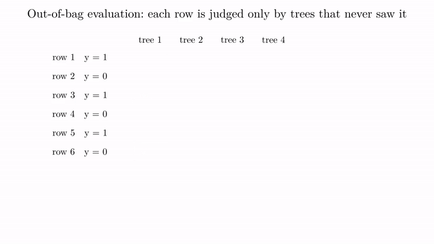
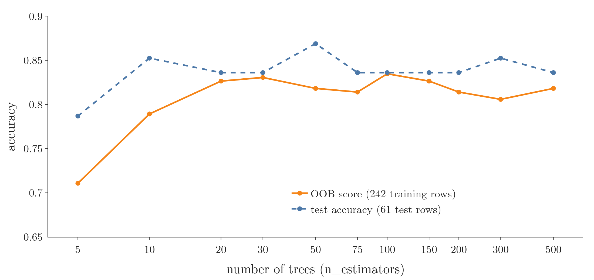

<!-- where-this-fits: generated by course_map/build_map.py; edit concepts.yaml, not this block -->
> **Where this fits:** Pipeline map steps 8 (Model), 9 (Evaluate). See the [Course map](../01-course-map/note.md).
>
> 
>
> - **Builds on:** Overfitting ([Note 91](../91-knn/note.md)); Decision trees ([Note 100](../100-dtreeviz/note.md)); Feature importance ([Note 100](../100-dtreeviz/note.md)); Bagging ([Note 107](../107-bagging-regressor/note.md)); Hyperparameter tuning ([Note 111](../111-random-forest-hyperparameters/note.md)); Grid and random search ([Note 112](../112-random-forest-tuning/note.md)).
> - **Leads to:** Balanced random forest ([Note 133](../133-imbalanced-data/note.md)).
> - **Compare with:** Bagging ([Note 107](../107-bagging-regressor/note.md)); Cross-validation ([Note 112](../112-random-forest-tuning/note.md)).
<!-- /where-this-fits -->

## 1. Overview

> **Key point:** Each tree in a forest never sees about 37% of the training rows. Predicting every row with only the trees that never saw it, and scoring those predictions, gives a free estimate of how the forest will do on new data.



**Out-of-bag (OOB) evaluation** is a way to test a bagging model, such as a random forest, using only its training data. It appears in almost every bagging-based ensemble. Figure 1 shows the whole process on 6 rows and 4 trees.

The OOB score was introduced with the bagging classifier (the [bagging classifier Note](../106-bagging-classifier/note.md), section 4): `oob_score=True`, then `oob_score_`. This Note explains exactly how the score is computed, rebuilds it by hand, and shows when it can be trusted.

The Notebook (`notebook.ipynb`) runs every step.

## 2. Out-of-bag rows

> **Key point:** Drawing with replacement means some rows are drawn several times for a tree and others not at all; the rows a tree missed are out-of-bag for that tree.

Each tree is trained on a bootstrap sample, drawn **with replacement** (`bootstrap=True`), which holds on average about 63.2% of the distinct rows (the [bagging Note](../105-bagging-intuition/note.md), section 2.3). The other **36.8%**, the rows a tree never drew, are its **out-of-bag (OOB) rows**: the tree has never seen them, so they can serve as test data for that tree.

Careful: being out-of-bag is a property of a row **for one tree**, not for the whole forest. A row missed by tree 1 is almost certainly seen by other trees. The chance that one row is missed by all 100 trees is

$$0.368^{100} \approx 10^{-43},$$

so in practice no row is hidden from the whole forest. What OOB evaluation uses is that every row is hidden from **some** trees.

## 3. How the OOB score is computed

> **Key point:** For each row, ask only the trees that never saw it, combine their answers, and compare with the truth; the share of correct answers is the OOB score.

### 3.1 The steps

> **Key point:** Four steps: record each tree's sample, find each row's OOB trees, let them vote, score the votes.

Figure 1 runs these steps on 6 rows and 4 trees:

1. **Record each tree's bootstrap sample.** Blue cells are rows a tree was trained on ("x2": drawn twice); orange cells are its OOB rows. Tree 1 missed rows 3 and 6; tree 4 missed rows 4 and 5.
2. **For each row, find the trees that never saw it.** Row 5 is OOB for trees 2 and 4; row 1 only for tree 2.
3. **Let only those trees vote.** Trees 2 and 4 both say 1 for row 5, so row 5's OOB prediction is 1.
4. **Compare with the truth.** Row 3 is really 1, but its only OOB tree, tree 1, says 0: wrong. The other five rows are right.

### 3.2 The formula

> **Key point:** OOB accuracy is the number of rows whose OOB prediction is right, divided by the number of rows that have an OOB prediction.

1. **In words:** the share of training rows predicted correctly by the trees that never saw them.
2. **Formula:**
   $$\text{OOB score} = \frac{\text{rows whose OOB prediction is correct}}{\text{rows that have an OOB prediction}}$$
3. **Example:** in Figure 1, 5 of the 6 rows are right:
   $$\text{OOB score} = \frac{5}{6} = 0.83$$

For a regressor, the OOB prediction of a row is the **mean** of its OOB trees' numbers, and `oob_score_` is the $R^2$ of those predictions (the [bagging regressor Note](../107-bagging-regressor/note.md), section 4).

> **Extra:** scikit-learn does not count hard votes. Each OOB tree gives its class probabilities for the row (the share of each class in the leaf the row lands in), the probabilities are added up, and the class with the largest total wins. This is **soft voting** (the [voting classifier Note](../103-voting-classifier/note.md)). The totals, divided by the number of OOB trees, are stored in `oob_decision_function_`. On our data, hard votes and soft votes give the same score.

## 4. The OOB score in scikit-learn

> **Key point:** On the heart disease data, the OOB score is 0.835 and the test accuracy 0.836: a close estimate, at no extra cost.

We use the heart disease data of the [tuning Note](../112-random-forest-tuning/note.md): 303 patients, 242 for training and 61 for testing.

> **Python:** A random forest with its OOB score.
>
> ```python
> rf = RandomForestClassifier(oob_score=True,
>                             random_state=42)
> rf.fit(X_train, y_train)
> rf.oob_score_                 # 0.835
> rf.score(X_test, y_test)      # 0.836
> ```
>
> `oob_score=True` must be set **before** `fit`: the OOB predictions are collected while the forest is trained. Without it, `oob_score_` does not exist.

The OOB score, **0.835**, is almost exactly the test accuracy, **0.836**. A 5-fold cross-validation of the same forest on the training set gives 0.806, and needs 5 more forests to be trained. The OOB score needs none.

So the OOB rows act as a **validation set** that comes for free: about 37% of the data, unseen by each tree, without holding out any rows from training.

## 5. Rebuilding the OOB score by hand

> **Key point:** `estimators_samples_` tells us which rows each tree saw; predicting each tree's missing rows and adding up the probabilities reproduces `oob_score_` exactly.

A fitted forest keeps each tree's bootstrap sample in `estimators_samples_` (the same attribute as in the [bagging classifier Note](../106-bagging-classifier/note.md), section 3.3). From it, the Notebook builds a table with one row per tree and one column per training row, marking which rows each tree missed:

- each tree's share of OOB rows is between 35% and 38%, **36.7%** on average, matching the theory's 36.8%;
- every training row is OOB for at least 24 of the 100 trees (36.7 on average, at most 47), so every row gets an OOB prediction.

> **Python:** The OOB predictions, step by step.
>
> ```python
> in_bag = np.zeros((n_trees, n_rows), dtype=bool)
> for t, rows in enumerate(rf.estimators_samples_):
>     in_bag[t, rows] = True
> oob = ~in_bag            # True where tree t missed row i
>
> proba = np.zeros((n_rows, 2))
> for t, tree in enumerate(rf.estimators_):
>     proba[oob[t]] += tree.predict_proba(X_arr[oob[t]])
> (proba.argmax(axis=1) == y_arr).mean()     # 0.835
> ```
>
> `~` flips True and False. `proba[oob[t]] += ...` adds tree t's probabilities only to the rows it missed. `argmax(axis=1)` picks, for each row, the class with the larger total.

The result, **0.835**, is exactly `rf.oob_score_`, and the probabilities match `oob_decision_function_`.

## 6. How many trees the OOB score needs

> **Key point:** With very few trees, some rows have no OOB tree and the estimate is poor; from about 20 trees on, the OOB score tracks the test accuracy.

{height=36%}

Each row is OOB for only about 37% of the trees. With 5 trees, the chance that a row is seen by **every** tree is $0.632^5 \approx 0.10$, so about 10% of the rows get no OOB prediction at all: 27 of the 242 here. scikit-learn warns: "Some inputs do not have OOB scores. This probably means too few trees were used", and still counts those rows, with empty probabilities, in the score.

Figure 2 shows the effect on the heart disease data:

- with **5 trees**, the OOB score is 0.711, far below the test accuracy of 0.787: 27 rows have no OOB prediction, and the rest are judged by only a few trees each;
- from about **20 trees** on, the OOB score settles between 0.81 and 0.84, close to the test accuracy (0.84 to 0.87 on 61 noisy test rows).

The OOB score tends to be a little pessimistic: each OOB prediction comes from only about a third of the forest, a smaller forest than the one that predicts new data.

## 7. When the OOB score is available

> **Key point:** Only with `bootstrap=True`; it works for classifiers, regressors and bagging ensembles alike.

- **It needs bootstrapping.** With `bootstrap=False` (pasting, the [bagging Note](../105-bagging-intuition/note.md), section 6.2) there are no OOB rows, and scikit-learn raises `ValueError: Out of bag estimation only available if bootstrap=True`.
- **It works for regression.** On a 5,000-row sample of the California housing data (`fetch_california_housing` in scikit-learn: districts of California, 8 input columns, the median house value as output), a `RandomForestRegressor` gives an OOB $R^2$ of 0.764 against a test $R^2$ of 0.741. Its per-row OOB predictions are in `oob_prediction_`.
- **It works for any bagging ensemble**: `BaggingClassifier` and `BaggingRegressor` take the same `oob_score` (the [bagging classifier Note](../106-bagging-classifier/note.md) and the [bagging regressor Note](../107-bagging-regressor/note.md)).

> **Extra:** `oob_score` can also be a function instead of `True`, to use another metric than accuracy or $R^2$. For example, `oob_score=balanced_accuracy_score` (imported from `sklearn.metrics`) reports the balanced accuracy of the OOB predictions.

## 8. Summary

| | Value on the heart data | What it needs |
|---|---|---|
| OOB score | 0.835 | `oob_score=True`, `bootstrap=True`, no extra training |
| Test accuracy | 0.836 | a held-out test set |
| 5-fold cross-validation | 0.806 | 5 more forests |

- A tree's OOB rows are the training rows its bootstrap sample missed: about 37%.
- OOB is per tree: practically every row is seen by some trees and missed by others.
- Each row is predicted only by its OOB trees; the share of correct predictions is the OOB score.
- With enough trees (here about 20 or more), the OOB score is a close, free estimate of the test score.

## 9. Key terms

| Term | Meaning |
|---|---|
| Out-of-bag (OOB) evaluation | Testing a bagging model by predicting each training row with only the base models that never saw it |
| OOB prediction | A row's prediction from only the trees whose bootstrap sample missed it |
| oob_score_ | The accuracy (classifier) or $R^2$ (regressor) of the OOB predictions |
| oob_decision_function_ | Each training row's class probabilities from its OOB trees |
| oob_prediction_ | Each training row's OOB prediction, for a regressor |
| Validation set | Data held back from training to check and tune a model before the final test |
