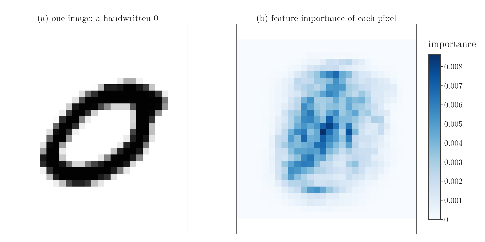
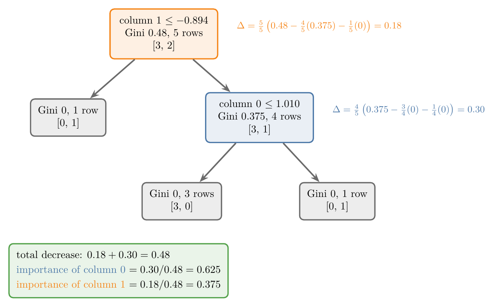
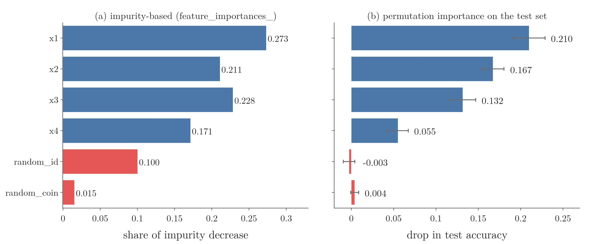

<!-- where-this-fits: generated by course_map/build_map.py; edit concepts.yaml, not this block -->
> **Where this fits:** Pipeline map steps 5 (Engineer features), 8 (Model). See the [Course map](../01-course-map/note.md).
>
> 
>
> - **Builds on:** Overfitting ([Note 91](../91-knn/note.md)); Decision trees ([Note 100](../100-dtreeviz/note.md)); Bagging ([Note 107](../107-bagging-regressor/note.md)); Hyperparameter tuning ([Note 111](../111-random-forest-hyperparameters/note.md)); Grid and random search ([Note 112](../112-random-forest-tuning/note.md)); OOB score ([Note 113](../113-oob-score/note.md)).
> - **Leads to:** Balanced random forest ([Note 133](../133-imbalanced-data/note.md)).
> - **Compare with:** Bagging ([Note 107](../107-bagging-regressor/note.md)); Dropout ([Note 1024](../1024-dropout/note.md)).
<!-- /where-this-fits -->

## 1. Overview

> **Key point:** A trained random forest gives every **feature** (input variable, one column of the data table) a score, its feature importance: the share of all the impurity reduction its splits achieved, averaged over the trees. The scores add up to 1.

{height=40%}

Tree-based algorithms (decision trees, random forests, and later bagging and boosting ensembles such as AdaBoost, gradient boosting and XGBoost) can all tell us how much each feature helped in predicting the **target** (the output we predict) from the **observations** (records, one row of the table each). Figure 1 shows this for handwritten digits: the forest relies on the pixels in the middle of the image and ignores the border.

For a single tree, `feature_importances_` was introduced in the [regression trees Note](../99-regression-trees/note.md), section 7.3. This Note covers why feature importance is useful, how a tree computes it step by step, how a random forest combines its trees, and the method's main weakness, with permutation importance as the alternative.

The Notebook (`notebook.ipynb`) runs every example.

## 2. What feature importance is for

> **Key point:** Feature importance tells us which features a model relies on: useful for dropping weak features (feature selection) and for explaining the model's decisions.

**Feature importance** is a number for each input feature that says how much the model relied on it. Two uses stand out.

### 2.1 Feature selection

> **Key point:** Keep the features with high importance and drop the rest.

Too many features hurt: training slows down, and useless features can mislead the model. **Feature selection** keeps only the useful features (the [feature engineering Note](../23-what-is-feature-engineering/note.md)). Feature importance is one way to do it: compute the importance of every feature, keep the important ones, drop the others.

Take MNIST (the [PCA on MNIST Note](../49-pca-mnist/note.md)): 42,000 images of handwritten digits, each 28 × 28 = 784 pixels, stored as one row of 784 pixel columns plus a label. Digits are written in the middle of the image, so the pixels near the border are almost always blank. Border pixels cannot help tell a 0 from a 4; the central pixels can.

We expect a model to rank the central pixels high and the border pixels near zero. Figure 1b shows exactly that pattern.

### 2.2 Interpretability

> **Key point:** Importances help explain to people why a model decides as it does.

Suppose a bank's model rejects a loan application. The customer will ask why. If the model reports which features matter most, say income, existing debt and credit history, those are the main factors behind its decisions, and the bank can explain them.

A model whose decisions can be explained in this way is **interpretable**. Feature importance gives an overall view: which features matter to the model in general, not why one particular application was rejected.

## 3. Feature importance in code

> **Key point:** After `fit`, `feature_importances_` holds one number per feature; on MNIST, 784 numbers that add up to 1.

> **Python:** The importance of every MNIST pixel.
>
> ```python
> rf = RandomForestClassifier(random_state=42, n_jobs=-1)
> rf.fit(X, y)                     # 42,000 images, 784 pixels
> imp = rf.feature_importances_    # shape (784,), sums to 1
> px.imshow(imp.reshape(28, 28))   # back to the image grid
> ```
>
> `reshape(28, 28)` turns the 784 numbers back into a 28 × 28 grid, row by row, the way the pixels were unrolled. `px.imshow` (Plotly Express) draws a grid of numbers as a heatmap.

Figure 1b is that heatmap. The darkest pixels, the most important, sit near the centre; the largest single importance is 0.0086. **122 pixels have importance exactly 0**: they lie along the border, where every image is blank, so no tree ever splits on them.

The forest was trained on all 42,000 images, with no test set: here we only want to see what it relies on, not to measure its accuracy.

## 4. How a decision tree computes feature importance

> **Key point:** Each split's weighted impurity decrease is credited to the feature it splits on; a feature's importance is its total, divided by the total over all features.

The scikit-learn documentation defines a feature's importance as "the (normalized) total reduction of the criterion brought by that feature", also called **Gini importance** or **mean decrease in impurity (MDI)**. The steps make this concrete.

### 4.1 The decrease at one node

> **Key point:** The same weighted decrease Δ that `min_impurity_decrease` uses.

Each split lowers the impurity. Its **weighted impurity decrease** $\Delta$ was defined, with a worked example, in the [decision tree hyperparameters Note](../98-decision-tree-hyperparameters/note.md), section 4.8:

$$\Delta = \frac{N_t}{N}\left(G_t - \frac{N_L}{N_t}G_L - \frac{N_R}{N_t}G_R\right)$$

Here $N$ is the number of training observations, $N_t$ the observations reaching the node, $N_L$ and $N_R$ the observations in its left and right children, and $G$ the Gini impurities. The factor $N_t / N$ makes a split near the root, which handles many observations, count more than a split deep down.

### 4.2 From node decreases to feature importance

> **Key point:** Add up the Δ of every node that splits on the feature, then divide by the Δ of all nodes.

1. **In words:** a feature's importance is its share of the tree's total impurity decrease.
2. **Formula:**
   $$\text{importance}(j) = \frac{\text{sum of } \Delta \text{ over the nodes that split on column } j}{\text{sum of } \Delta \text{ over all split nodes}}$$
3. **Example:** see section 4.3: feature 0 gets $0.30 / 0.48 = 0.625$.

Dividing by the total **normalizes** the importances: they always add up to 1.

### 4.3 Worked example: 5 observations

> **Key point:** The root, on feature 1, decreases impurity by 0.18; the second split, on feature 0, by 0.30; so feature 0 has importance 0.625 and feature 1 0.375.

{height=46%}

We make a tiny dataset of 5 observations and 2 features (feature 0 and feature 1) with `make_classification` and train a fully grown tree. Figure 2 shows it: two split nodes and three pure leaves.

**The root** splits on feature 1. The root holds all 5 observations (3 of class 0, 2 of class 1), Gini 0.48. Its left child has 1 observation (Gini 0), its right child 4 observations (Gini 0.375):

$$\Delta_{\text{root}} = \frac{5}{5}\left(0.48 - \frac{4}{5}(0.375) - \frac{1}{5}(0)\right) = 0.48 - 0.30 = 0.18$$

**The second node** splits on feature 0. The node holds 4 of the 5 observations, Gini 0.375, and both children are pure:

$$\Delta_{\text{node 2}} = \frac{4}{5}\left(0.375 - \frac{3}{4}(0) - \frac{1}{4}(0)\right) = 0.8 \times 0.375 = 0.30$$

The total decrease is $0.18 + 0.30 = 0.48$, so:

- feature 0: $0.30 / 0.48 = 0.625$;
- feature 1: $0.18 / 0.48 = 0.375$.

These are exactly the values of `tree.feature_importances_`. Feature 0 wins although feature 1 makes the first split: the second split removes more impurity.

### 4.4 Worked example: 15 observations

> **Key point:** When a feature splits several nodes, its decreases are added: feature 0 splits two nodes (0.119 + 0.089) and gets 0.417.

With 15 observations, the tree has three split nodes: the root on feature 1, and two lower nodes on feature 0.

| Node | Feature | Observations | Gini | $\Delta$ |
|---|---|---|---|---|
| root | 1 | 15 | 0.498 | 0.290 |
| 2 | 0 | 9 | 0.346 | 0.119 |
| 4 | 0 | 3 | 0.444 | 0.089 |

Each $\Delta$ comes from the formula of section 4.1 (leaves and pure children contribute 0, so they drop out):

$$\Delta_{\text{root}} = \frac{15}{15}\left(0.498 - \frac{9}{15}(0.346)\right) = 0.290$$

$$\Delta_2 = \frac{9}{15}\left(0.346 - \frac{3}{9}(0.444)\right) = 0.119$$

$$\Delta_4 = \frac{3}{15}(0.444) = 0.089$$

The total is $0.290 + 0.119 + 0.089 = 0.498$, so feature 0 gets $(0.119 + 0.089) / 0.498 = 0.417$ and feature 1 gets $0.290 / 0.498 = 0.583$. `feature_importances_` gives 0.4167 and 0.5833; rounding each step to two digits gives slightly different numbers, such as 0.39 and 0.61, so we keep three.

## 5. Feature importance in a random forest

> **Key point:** Every tree computes its own importances; the forest takes their mean.

A random forest adds nothing new: each tree computes its importances as in section 4, and the forest averages them.

1. **In words:** a feature's importance in the forest is the mean of its importance in each tree.
2. **Formula:** for a forest of $T$ trees,
   $$\text{importance}_{\text{forest}}(j) = \frac{1}{T}\sum_{t=1}^{T} \text{importance}_t(j)$$
3. **Example:** a forest of 2 trees on the 5-observation data. Tree 1 gives (0.625, 0.375); tree 2 splits only on feature 1 and gives (0, 1):
   $$\text{column 0}: \frac{0.625 + 0}{2} = 0.3125 \qquad \text{column 1}: \frac{0.375 + 1}{2} = 0.6875$$
   `rf.feature_importances_` gives exactly (0.3125, 0.6875).

> **Python:** Each tree's importances, and their mean.
>
> ```python
> rf2 = RandomForestClassifier(n_estimators=2, random_state=3)
> rf2.fit(X5, y5)
> for t in rf2.estimators_:
>     print(t.feature_importances_)  # [0.625 0.375], [0. 1.]
> rf2.feature_importances_           # [0.3125 0.6875]
> ```

A single tree's importances can change a lot when the data changes slightly (high variance); the forest's mean over many trees is much more stable. In the Notebook, retraining on 20 resamples of the data of section 6, the forest's importances spread about a third as much as one tree's: the same variance reduction that makes bagging work.

> **Extra:** Two details of scikit-learn's version. Each tree computes its decreases on its own bootstrap sample, not on the full training set. And a tree that never split (only a root) is left out of the mean; the result is divided by its total again so it still sums to 1. (scikit-learn source, `ensemble/_forest.py`)

## 6. The weakness: features with many unique values

> **Key point:** Impurity-based importance favours features with many different values: a feature of pure noise with 1,000 unique values gets 10% of the importance.

The scikit-learn documentation warns that impurity-based feature importances "can be misleading for high cardinality features (many unique values)". High cardinality (the [pandas profiling Note](../22-pandas-profiling/note.md)) here means a feature with very many different values, numeric or categorical. A test shows why.

{height=36%}

We make a dataset of 1,000 observations with four real features, x1 to x4 (52 to 75 unique values each), and add two features of noise that have nothing to do with the target:

- `random_id`: a different number for every observation, 1,000 unique values;
- `random_coin`: 0 or 1 at random, 2 unique values.

A random forest trained on 700 observations scores 0.87 on the other 300. Its impurity-based importances (Figure 3a) give `random_id` **0.100**, more than half as much as the real feature x4, while `random_coin` gets only 0.015.

The reason: importances are computed from the **training** data, where trees are grown until every leaf is pure. A feature with 1,000 different values offers about 1,000 possible thresholds, so deep in a tree it can almost always separate the last few observations by chance. Each such split lowers the training impurity and earns the feature credit, though it means nothing on new data. A feature with 2 values offers one threshold, so it has far fewer chances to fit noise. The bias towards features with many values is well known (Strobl et al., 2007; scikit-learn User Guide §5.2).

> **Extra:** A test of this explanation. If `random_id` earns its credit from the deepest splits, forcing bigger leaves should shrink it. The Notebook changes only `min_samples_leaf`: with leaves of at least 1, 5, 20 and 50 observations, `random_id`'s importance falls from 0.100 to 0.051, 0.032 and 0.021, while the test accuracy barely moves (0.870 to 0.847).

## 7. Permutation importance

> **Key point:** Shuffle one feature in the test set and measure how much the score drops; a feature the model truly uses causes a big drop, a useless feature none.

For data with high-cardinality features, scikit-learn recommends **permutation importance**, `sklearn.inspection.permutation_importance`, instead. Figure 3b shows it for the same forest: the four real features keep clear importances (0.055 to 0.210), and both noise features fall to about 0 (`random_id` −0.003, `random_coin` 0.004).

> **Python:** Permutation importance on the test set.
>
> ```python
> from sklearn.inspection import permutation_importance
>
> perm = permutation_importance(rf, X_test, y_test,
>                               n_repeats=20, random_state=0)
> perm.importances_mean    # one number per column
> perm.importances_std     # their spread over the 20 shuffles
> ```

> **Extra:** How permutation importance works.
>
> 1. Score the trained model on the test set: accuracy 0.870.
> 2. Shuffle one feature's values among the test observations, which breaks its link with the target while keeping its values. Score again: with x1 shuffled, the accuracy drops to 0.720.
> 3. The drop, here 0.15 for this one shuffle, is that feature's importance. Repeat with new shuffles (`n_repeats`) and average; then do the same for every feature.
>
> A noise feature like `random_id` was never truly used, so shuffling it changes almost nothing; its importance is near 0 and can even come out slightly negative by chance. Because it is measured on unseen data, permutation importance cannot be fooled by splits that only fit the training set (scikit-learn User Guide §5.2).
>
> Permutation importance has costs: it needs a test set and many extra predictions, so it is slower. And when two features are strongly correlated, shuffling one barely hurts the model, because the other still carries the same information, so both can look unimportant (scikit-learn User Guide §5.2.3).

If the data has no high-cardinality features, the impurity-based importance of `feature_importances_` is a quick first look that costs nothing: it is computed during training.

## 8. Summary

| | Impurity-based (MDI) | Permutation |
|---|---|---|
| Where | `feature_importances_` | `permutation_importance` |
| Measures | share of the impurity decrease from each feature's splits | drop in score when a feature is shuffled |
| Computed on | the training data, during `fit` | a test set, after training |
| Cost | free | many extra predictions |
| Noise feature with 1,000 values | 0.100 (misleading) | −0.003 (correct) |

- Feature importance scores how much a model relies on each feature; it helps with feature selection and interpretability.
- In a tree, each split's weighted impurity decrease $\Delta$ is credited to its feature; a feature's importance is its share of the total (5 observations: 0.30 / 0.48 = 0.625).
- A random forest averages its trees' importances, which makes them more stable.
- Impurity-based importance favours high-cardinality features; permutation importance on a test set does not.

## 9. Sources

- Strobl, C., Boulesteix, A.-L., Zeileis, A. and Hothorn, T. (2007). Bias in random forest variable importance measures. *BMC Bioinformatics* 8: 25.
- scikit-learn developers. User Guide, §5.2 "Permutation feature importance" (version 1.9). scikit-learn.org/stable/modules/permutation_importance.html
- scikit-learn source code, `sklearn/ensemble/_forest.py`, property `feature_importances_` (version 1.9).

## 10. Key terms

| Term | Meaning |
|---|---|
| Mean decrease in impurity (MDI) | Impurity-based feature importance: a feature's share of the total weighted impurity decrease of its splits, averaged over the trees; also called Gini importance |
| Weighted impurity decrease | A split's impurity drop, weighted by the share of observations reaching the node: the $\Delta$ of `min_impurity_decrease` |
| Interpretability | How well people can understand why a model makes its decisions |
| Permutation importance | The drop in a model's test score when one feature's values are shuffled |
| permutation_importance | scikit-learn function (in `sklearn.inspection`) that computes permutation importance |
| Normalized importances | Importances divided by their total, so they add up to 1 |
