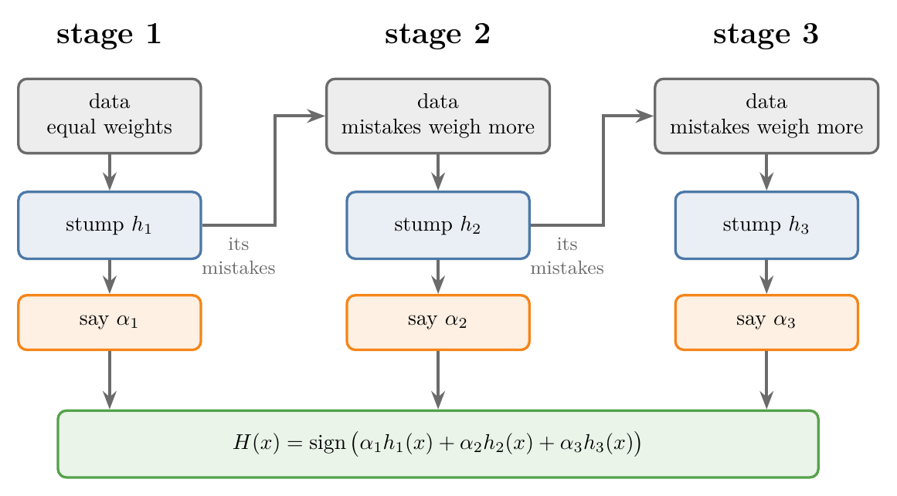
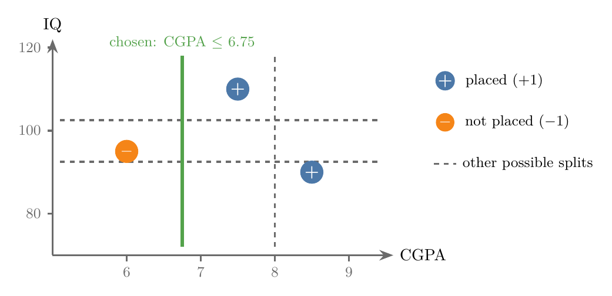
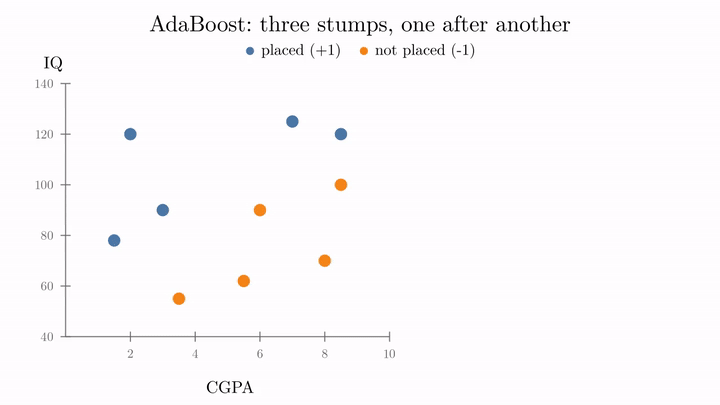

<!-- where-this-fits: generated by course_map/build_map.py; edit concepts.yaml, not this block -->
> **Where this fits:** Pipeline map step 8 (Model). See the [Course map](../01-course-map/note.md).
>
> 
>
> - **Builds on:** Decision trees ([Note 100](../100-dtreeviz/note.md)); Boosting ([Note 101](../101-ensemble-learning/note.md)); Hyperparameter tuning ([Note 111](../111-random-forest-hyperparameters/note.md)).
> - **Compare with:** Gradient boosting ([Note 120](../120-gradient-boosting-intuition/note.md)).
<!-- /where-this-fits -->

## 1. Overview

> **Key point:** AdaBoost trains weak models one after another. Each one pays more attention to the observations the previous one got wrong, and each gets a say based on how accurate it was. The final answer is a weighted vote.

{height=40%}

**AdaBoost** is the first boosting algorithm we study. Boosting was previewed in the [ensemble learning Note](../101-ensemble-learning/note.md), section 4.4: models trained in series, each one focusing on the mistakes of the one before. Figure 1 shows how AdaBoost does it.

This Note gives the core idea for classification, on a picture. The next Notes fill in the numbers: how the say of each model is computed, and how the mistakes are passed on.

> **Extra:** The name is short for **Adaptive Boosting**: each stage adapts to the mistakes of the stages before. Yoav Freund and Robert Schapire published it in 1995 (Freund and Schapire, 1997). One of its first big uses was fast face detection (Viola and Jones, 2001). Deep learning has since taken over that job.

### 1.1 Why learn AdaBoost

> **Key point:** Other boosting algorithms often score higher, but AdaBoost is the simplest, and it teaches the ideas they all build on.

AdaBoost gives good results, but in practice random forests, gradient boosting and XGBoost often beat it. We study it anyway because it is the entry point to boosting. Once AdaBoost is clear, about half of boosting is clear, and gradient boosting and XGBoost become much easier.

## 2. Three ideas we need first

> **Key point:** A weak learner is barely better than guessing; a decision stump is a tree with one split; AdaBoost labels the two classes +1 and -1.

### 2.1 Weak learners

> **Key point:** A weak learner is a model whose accuracy is only a little above 50%.

On a two-class problem, guessing at random is right about 50% of the time, like calling heads or tails on a coin toss. A **weak learner** is a model whose accuracy is just above that: 55%, say. A **strong learner** is a model with high accuracy, 95% or 99%.

AdaBoost builds one strong model by combining many weak learners. Each one alone is poor; together they are good.

### 2.2 Decision stumps

> **Key point:** A decision stump is a decision tree with `max_depth=1`: one question, one split, two regions.

A **decision stump** is a decision tree whose maximum depth is 1. It asks a single question, such as "is CGPA at most 6.75?", and splits the data into two regions. The [decision tree hyperparameters Note](../98-decision-tree-hyperparameters/note.md), section 2.2, showed that such a tree underfits. Here that weakness is exactly what we want: a stump is a weak learner.

{height=34%}

Figure 2 shows three students: two placed (+), one not placed (-).

- A full decision tree can make many cuts, as in the [decision trees Note](../97-decision-trees-intuition/note.md), section 3.
- A stump makes exactly one cut. It is either parallel to the IQ axis (a CGPA threshold) or parallel to the CGPA axis (an IQ threshold).
- With three points there are only a few candidate cuts: one between each pair of neighbouring values, on each axis.

The stump tries every candidate and keeps the one with the largest information gain (the decision trees Note, section 7). In Figure 2, the cut at CGPA 6.75 separates the classes perfectly, so it wins.

AdaBoost can use any algorithm as its weak learner, even a neural network. In practice it almost always uses decision stumps, for two reasons:

1. they give the best results with AdaBoost;
2. each one is easy to read, so we can see what every stage does.

### 2.3 Labels +1 and -1

> **Key point:** In AdaBoost the positive class is +1 and the negative class is -1, not 1 and 0.

Most classifiers name the two classes 1 and 0. AdaBoost uses **+1 and -1**: placed students are +1, students not placed are -1. Section 5 shows why: the final vote adds up the models' answers, and a -1 pulls the total down, while a 0 would add nothing.

## 3. A stage-wise additive model

> **Key point:** "Additive": the final model is a sum of weak learners. "Stage-wise": they are added one at a time, in order.

AdaBoost is often described as a **stage-wise additive method**:

- **additive:** the final model adds up several weak learners;
- **stage-wise:** the weak learners are added one after another, in sequence, each in its own stage.

In Figure 1, each column is a stage. The arrow between the columns is what makes it boosting: each stage hands its mistakes to the next.

## 4. Stage by stage

> **Key point:** In every stage: fit a stump, find its mistakes, give the stump a say, then make its mistakes heavier for the next stage.

We follow 10 students. Each student is an **observation** (one record, one row of the data table). Each has two **features** (input variables, one column each), CGPA and IQ, and a **target** (the output we predict): placed (+1) or not placed (-1). Figure 3 animates the three stages.

{height=55%}

### 4.1 Stage 1: the first stump

> **Key point:** The first stump is the single cut with the largest information gain; it gets some students wrong.

Many stumps are possible on this data. As in section 2.2, we keep the one with the largest information gain: **IQ above 74 means placed** (Figure 3, top left). Above the line is the placed region, below it the not-placed region.

The stump does its job, but not perfectly: two students who were not placed sit in the placed region. These are its **mistakes**.

### 4.2 Passing the mistakes on

> **Key point:** Before the next stage, the misclassified observations are made more important, so the next stump concentrates on them.

The first stump tells the next one, in effect: "I got these students wrong; take extra care with them." AdaBoost does this by raising the **importance** of the misclassified observations in the data and lowering that of the rest.

In Figure 3 this is the dot size: the two mistakes grow, the eight correct students shrink. The exact amounts, and the technique (called upsampling), are the subject of the [AdaBoost step-by-step Note](../116-adaboost-step-by-step/note.md).

### 4.3 The say of each stump: alpha

> **Key point:** Each stump gets a weight, alpha, from how few mistakes it made. Good stumps get a big say in the final vote, poor ones a small say.

At the end of each stage we also compute a number $\alpha$ (alpha) for the stump. Alpha sets how much **say** the stump will have in the final prediction. Few mistakes give a large $\alpha$; many mistakes give a small one. The formula is in the step-by-step Note.

The say is where boosting differs from bagging. In bagging (the [bagging Note](../105-bagging-intuition/note.md)), every base model's vote counts the same, like a democracy. In boosting, each model's vote is weighted by how well it performed.

### 4.4 Stages 2 and 3

> **Key point:** Each new stump fixes the previous stump's mistakes but makes some of its own, which are passed on in turn.

**Stage 2.** The data now has heavier weights on the two missed students. A new stump is fitted: **IQ above 110 means placed** (Figure 3, top right). The new stump gets those two students right, but it makes two new mistakes: two placed students fall in its not-placed region. Again we compute its say, $\alpha_2$, and make its mistakes heavier.

**Stage 3.** The next stump is **CGPA below 3.25 means placed** (Figure 3, bottom left). This third stump fixes stage 2's mistakes and makes two of its own. We compute $\alpha_3$.

We stop at three stumps here. With more stages the process simply repeats.

| Stage | Stump | Mistakes | Weighted error | Say $\alpha$ |
|---|---|---|---|---|
| 1 | IQ > 74: placed | 2 | 0.200 | 0.69 |
| 2 | IQ > 110: placed | 2 | 0.125 | 0.97 |
| 3 | CGPA < 3.25: placed | 2 | 0.071 | 1.28 |

The weighted error is the share of the total weight that sits on the misclassified observations. The weighted error falls from stage to stage because each stump is judged on reweighted data; the step-by-step Note computes it.

## 5. The final prediction: a weighted vote

> **Key point:** Multiply each stump's answer (+1 or -1) by its alpha, add, and take the sign: positive means +1, negative means -1.

After training we have three stumps and three alphas. We write each stump as a function $h_t(x)$, a **hypothesis function**: it takes a student's features $x$ and returns +1 or -1.

1. **In words:** each stump votes +1 or -1; each vote is multiplied by that stump's say; we add the results; the sign of the total is the prediction.
2. **Formula:** with $T$ stumps,
   $$H(x) = \operatorname{sign}\Big(\sum_{t=1}^{T} \alpha_t\thinspace h_t(x)\Big) = \operatorname{sign}\big(\alpha_1 h_1(x) + \alpha_2 h_2(x) + \alpha_3 h_3(x)\big)$$
   The **sign** of a number is +1 if it is positive and -1 if it is negative.
3. **Example:** a new student has CGPA 7.5 and IQ 81. Suppose the three stumps say $h_1 = -1$ (not placed), $h_2 = +1$ (placed), $h_3 = -1$, and their alphas are 2, 10 and 1:
   $$2 \times (-1) + 10 \times (+1) + 1 \times (-1) = -2 + 10 - 1 = 7$$
   The total is positive, so $H(x) = +1$: the student is predicted to be **placed**. Two stumps out of three said "not placed", but the stump with by far the largest say said "placed", and it wins.

The pull of a negative vote is why the classes are +1 and -1: a "not placed" vote pulls the total down by its alpha. With 0 and 1, a "not placed" vote would multiply to 0 and could never outweigh a "placed" vote.

> **Extra:** If the total is exactly 0, the sign is undefined; libraries then pick one class by a fixed rule. scikit-learn's `AdaBoostClassifier` gives the first class in `classes_` (scikit-learn source, `ensemble/_weight_boosting.py`).

## 6. Why it works: the combined boundary

> **Key point:** Each stump draws one straight cut; their weighted vote draws a staircase boundary that none of them could draw alone.

Each stump on its own is a single straight line, parallel to an axis, and each one gets two students wrong. Lay the three cuts on top of each other (Figure 3, bottom right) and they divide the plane into boxes. In each box the weighted vote picks a class.

For our 10 students, the vote of the three stumps is

$$H(x) = \operatorname{sign}\big(0.69\thinspace h_1(x) + 0.97\thinspace h_2(x) + 1.28\thinspace h_3(x)\big)$$

and it classifies **all 10 correctly**. The placed region it draws is an L shape: low CGPA with an IQ above 74, or any CGPA with an IQ above 110. No single stump can draw that shape, and no single stump got every student right.

With more stages, the boundary can bend in more places and fit more complicated data. The [AdaBoost hyperparameters Note](../118-adaboost-hyperparameters/note.md) shows that too many stages can also overfit.

## 7. Summary

| Idea | What it means in AdaBoost |
|---|---|
| Weak learner | each base model is only a little better than guessing |
| Decision stump | the usual weak learner: a tree with one split |
| Labels | +1 and -1 |
| Stage-wise additive | stumps are added one at a time; the final model sums them |
| Mistakes | observations a stump gets wrong become more important for the next stump |
| Alpha | each stump's say in the final vote, larger for fewer mistakes |
| Prediction | $\operatorname{sign}(\sum_t \alpha_t h_t(x))$ |

- AdaBoost trains decision stumps one after another; each focuses on the previous stump's mistakes.
- Each stump gets a say, alpha, based on its error: unlike bagging, the votes are not equal.
- The prediction is the sign of the alpha-weighted sum of the stumps' +1/-1 answers.
- Three stumps on 10 students: each makes 2 mistakes, their weighted vote makes none.

## 8. Sources

- Freund, Y. and Schapire, R. E. (1997). A decision-theoretic generalization of on-line learning and an application to boosting. *Journal of Computer and System Sciences* 55(1): 119–139. (Conference version: EuroCOLT 1995.)
- Viola, P. and Jones, M. (2001). Rapid object detection using a boosted cascade of simple features. *CVPR 2001*.
- scikit-learn source code, `sklearn/ensemble/_weight_boosting.py`, `AdaBoostClassifier.predict` (version 1.9).

## 9. Key terms

| Term | Meaning |
|---|---|
| AdaBoost (Adaptive Boosting) | A boosting algorithm that trains weak learners in sequence on reweighted data and combines them by an alpha-weighted vote |
| Weak learner | A model whose accuracy is only a little better than random guessing |
| Strong learner | A model with high accuracy |
| Decision stump | A decision tree with maximum depth 1: one split, two regions |
| Stage-wise additive model | A model built as a sum of base models added one at a time |
| Alpha (model weight) | A base model's say in AdaBoost's final vote; larger when it made fewer mistakes |
| Hypothesis function | A model written as a function $h(x)$ that maps an input to a prediction |
| Sign function | Returns +1 for a positive number and -1 for a negative one |
