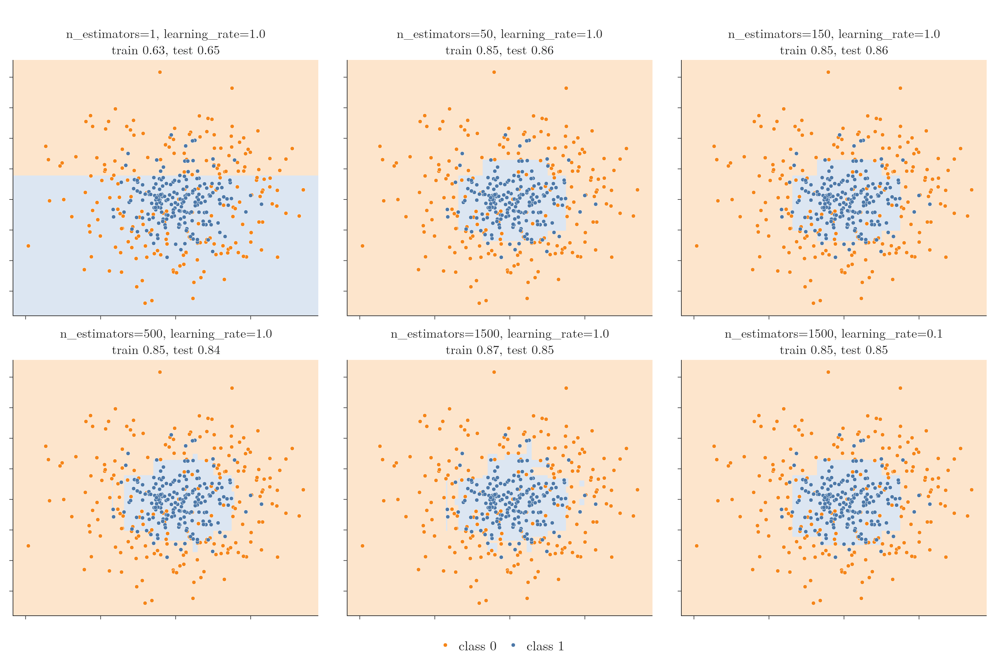
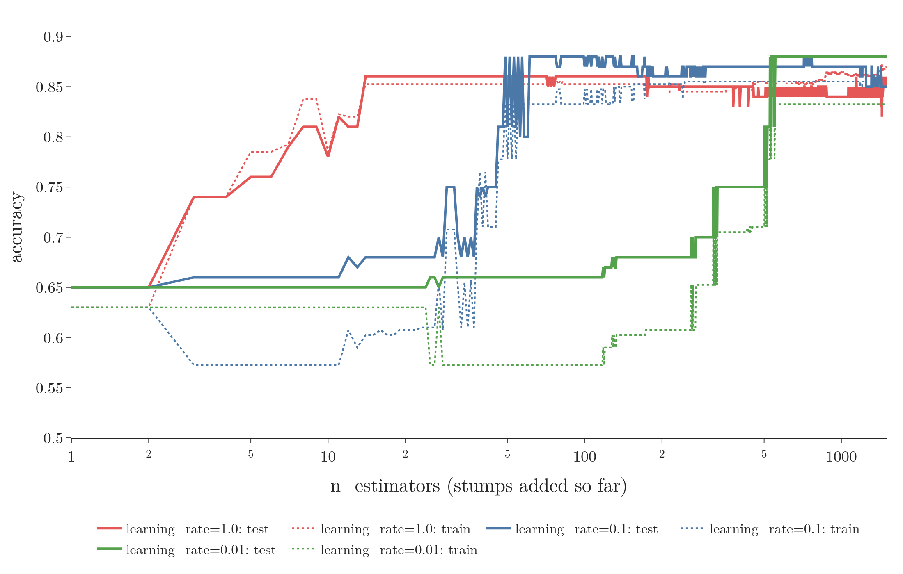

<!-- where-this-fits: generated by course_map/build_map.py; edit concepts.yaml, not this block -->
> **Where this fits:** Pipeline map steps 8 (Model), 9 (Evaluate), 10 (Tune). See the [Course map](../01-course-map/note.md).
>
> 
>
> - **Builds on:** Simple imputation (mean, median, mode, constant) ([Note 37](../37-missing-categorical-data/note.md)); ML pipelines ([Note 38](../38-missing-indicator-random-sample/note.md)); Overfitting ([Note 91](../91-knn/note.md)); Decision trees ([Note 100](../100-dtreeviz/note.md)); Boosting ([Note 101](../101-ensemble-learning/note.md)).
> - **Leads to:** Optuna (Video 134, coming).
> - **Compare with:** Train-test split ([Note 13](../13-toy-project/note.md)); OOB score ([Note 113](../113-oob-score/note.md)); Optuna (Video 134, coming).
<!-- /where-this-fits -->

## 1. Overview

> **Key point:** AdaBoost has few hyperparameters. The two that matter are `n_estimators` (how many stumps) and `learning_rate` (how much say each stump gets); they trade off against each other, and a grid search tunes them together.

{height=50%}

Gradient boosting and XGBoost, covered in later Notes, have many hyperparameters. AdaBoost is simpler: scikit-learn's `AdaBoostClassifier` has only three, plus `random_state`, which only makes the results repeatable.

This Note covers what each one does, shows `n_estimators` and `learning_rate` at work on decision surfaces (Figure 1), and tunes both with `GridSearchCV`. The Notebook (`notebook.ipynb`) runs every experiment. The Dash app `app.py` has a control for each hyperparameter and redraws the decision surface.

## 2. The hyperparameters of AdaBoostClassifier

> **Key point:** `estimator` is the weak learner (a stump by default), `n_estimators` the number of stages (50 by default), `learning_rate` a multiplier on every alpha (1.0 by default).

### 2.1 estimator: the weak learner

> **Key point:** Any classifier that accepts sample weights can be boosted; in practice we almost always keep the default, a decision stump.

`estimator` is the base model that AdaBoost trains at every stage. If we leave it out, it is `DecisionTreeClassifier(max_depth=1)`, a decision stump (the [AdaBoost intuition Note](../115-adaboost-intuition/note.md), section 2.2).

Other algorithms are allowed, such as logistic regression or an SVM, with one condition: the model's `fit` must accept a `sample_weight` argument, because that is how scikit-learn passes the row weights to it (the [AdaBoost from scratch Note](../117-adaboost-from-scratch/note.md), section 10). KNN has no such argument, so AdaBoost refuses it:

> **Python:** KNN cannot be boosted.
>
> ```python
> from sklearn.ensemble import AdaBoostClassifier
> from sklearn.neighbors import KNeighborsClassifier
>
> AdaBoostClassifier(KNeighborsClassifier()).fit(X, y)
> # ValueError: KNeighborsClassifier doesn't
> # support sample_weight.
> ```

In practice, decision trees are used almost every time, and stumps give the best results with AdaBoost. This is a setting we rarely change.

> **Extra:** Older code and older documentation call this parameter `base_estimator`. scikit-learn renamed it to `estimator` in version 1.2 and removed the old name in 1.4, so `AdaBoostClassifier(base_estimator=...)` now fails. Passing the model as the first argument, `AdaBoostClassifier(DecisionTreeClassifier(max_depth=1))`, works in every version.

### 2.2 n_estimators: the number of stages

> **Key point:** The maximum number of weak learners. Training stops earlier only if a stump classifies the training data perfectly.

`n_estimators` is the number of base models, one per stage. It is a maximum: if some stump makes no mistakes on its weighted data, boosting stops there, because there is nothing left to fix (the from-scratch Note, section 7). This is the most important hyperparameter of AdaBoost; section 3 shows its effect.

### 2.3 learning_rate: the say of every stump, scaled

> **Key point:** Every alpha is multiplied by the learning rate. Below 1, each stump's say shrinks and the weights change less at each stage: learning slows down.

`learning_rate` is a number multiplied into every stump's weight. Section 4 explains it in full.

### 2.4 algorithm: removed

> **Key point:** Old versions offered two algorithms, SAMME and SAMME.R; current scikit-learn has only SAMME and no `algorithm` parameter.

Older versions of `AdaBoostClassifier` had a fourth hyperparameter, `algorithm`, with two choices: `"SAMME"` and `"SAMME.R"`. SAMME.R, which used predicted probabilities instead of hard votes, was the default and often converged faster.

> **Extra:** SAMME.R was deprecated in scikit-learn 1.4 and later removed, and then the `algorithm` parameter itself was removed. scikit-learn 1.9, which this Note uses, accepts only `estimator`, `n_estimators`, `learning_rate` and `random_state`, and always runs SAMME. Code that passes `algorithm="SAMME.R"` fails with a `TypeError`; deleting the argument fixes it. This is also why the default model here scores 0.812 rather than the 0.786 that older versions gave with SAMME.R (section 3).

## 3. n_estimators: from underfitting to overfitting

> **Key point:** One stump underfits; tens of stumps fit the circle; very many start drawing small islands around single points, the sign of overfitting.

The data is the noisy concentric circles of the [random forest bias-variance Note](../109-random-forest-bias-variance/note.md): 500 points, a small blue disc inside an orange ring, with so much noise that the classes overlap. We train on 400 points and test on 100.

With the default settings (50 stumps, learning rate 1.0), 10-fold cross-validation (the [pipelines Note](../29-pipelines/note.md), section 8) gives an accuracy of **0.812**. Figure 1 shows what changing `n_estimators` does. Each surface is drawn by predicting a grid of points, as in the [KNN Note](../91-knn/note.md), section 5.

| n_estimators | Surface (Figure 1) | Train | Test |
|---|---|---|---|
| 1 | one straight cut: underfitting | 0.63 | 0.65 |
| 50 | a blocky disc, close to the true shape | 0.85 | 0.86 |
| 150 | about the same disc | 0.85 | 0.86 |
| 500 | small notches appear around single points | 0.85 | 0.84 |
| 1,500 | isolated strips and boxes: overfitting | 0.87 | 0.85 |

- **Too few stumps underfit.** One stump can only cut the plane once; it cannot draw a disc.
- **Too many stumps overfit.** Each extra stage focuses on the rows still misclassified, and on noisy data those are mostly noise. With 1,500 stumps, the surface grows small regions around single points, the training accuracy rises and the test accuracy falls.
- **Training time grows** with the number of stumps: 1,500 stumps take 30 times as long to train as 50.

So `n_estimators` needs a middle value, like `max_depth` for a decision tree (the [decision tree hyperparameters Note](../98-decision-tree-hyperparameters/note.md)).

> **Extra:** On this data the overfitting is mild: a stump is so simple that even 1,500 of them keep a fairly clean surface, and test accuracy only drops from 0.86 to 0.85. On data with more columns, or with deeper base trees, the effect is stronger.

## 4. learning_rate: shrinkage

> **Key point:** The learning rate multiplies every alpha. A smaller alpha means smaller weight updates, so each stage changes less, learning is slower, and overfitting is slower too.

### 4.1 What the learning rate does

> **Key point:** alpha becomes learning_rate times the usual alpha; at the default 1.0 nothing changes.

1. **In words:** each stump's say is the usual alpha (the [AdaBoost step-by-step Note](../116-adaboost-step-by-step/note.md), section 6) times the learning rate $\eta$ (eta).
2. **Formula:**
   $$\alpha_t = \eta \times \frac{1}{2}\ln\left(\frac{1-\text{error}_t}{\text{error}_t}\right)$$
3. **Example:** a stump with error 0.3 has the usual alpha 0.4236 (the from-scratch Note). With $\eta = 0.1$:
   $$\alpha = 0.1 \times 0.4236 = 0.0424$$

In the Notebook, the first stump's weight on the circles data is 0.5322 with $\eta = 1.0$ and 0.0532 with $\eta = 0.1$: exactly ten times smaller.

> **Extra:** scikit-learn's SAMME alpha has no factor 1/2 (the from-scratch Note, section 10), so its first-stump weight 0.5322 corresponds to our 0.2661. The learning rate multiplies whichever version is used.

### 4.2 Why a smaller alpha slows learning

> **Key point:** The weight update uses $e^{\alpha}$ and $e^{-\alpha}$; a small alpha keeps both close to 1, so the weights barely move at each stage.

The weights are updated with $e^{\alpha}$ for mistakes and $e^{-\alpha}$ for correct rows (the step-by-step Note, section 7). With a smaller alpha, both factors stay closer to 1: the update has a smaller **amplitude**. For our error-0.3 stump:

| learning_rate | alpha | mistakes $\times\, e^{\alpha}$ | correct $\times\, e^{-\alpha}$ |
|---|---|---|---|
| 1.0 | 0.4236 | 1.53 | 0.65 |
| 0.1 | 0.0424 | 1.04 | 0.96 |

With smaller updates, the weighted data changes little from one stage to the next, so consecutive stumps differ less. Each stage moves the model only a small step, and the final model is the sum of many small steps.

This is called **shrinkage**: every stump's contribution is shrunk. The idea is to slow learning down, which slows overfitting down even more. Shrinkage returns in gradient boosting.

### 4.3 The trade-off with n_estimators

> **Key point:** A smaller learning rate needs more stumps to reach the same fit, but tends to overfit less; the two are tuned together.

{height=40%}

Figure 2 tracks accuracy as stumps are added (scikit-learn's `staged_score` gives the score after every stage):

- **learning_rate 1.0** (red) learns fast: its best test accuracy, 0.86, comes after only 14 stumps; after that it drifts down to 0.85 by 1,500.
- **learning_rate 0.1** (blue) needs about 50 stumps to get going, peaks at 0.88, and ends at 0.85.
- **learning_rate 0.01** (green) needs over 500 stumps to fit the disc at all, then holds 0.88 up to 1,500.

The smaller the learning rate, the more stumps it takes. In return, the large-`n_estimators` model stays smoother: in Figure 1, 1,500 stumps with learning rate 0.1 (bottom right) have none of the islands of 1,500 stumps with learning rate 1.0 (bottom middle).

So we do not tune the two separately. A large `n_estimators` with a small `learning_rate` is the usual recipe; the grid search finds a good pair.

> **Python:** n_estimators and learning_rate.
>
> ```python
> abc = AdaBoostClassifier(n_estimators=1500,
>                          learning_rate=0.1,
>                          random_state=42)
> abc.fit(X_train, y_train)
> abc.score(X_test, y_test)     # 0.85
> abc.estimator_weights_[:3]    # the first three alphas
> ```
>
> `estimator_weights_` holds every stump's alpha after training. `staged_score(X, y)` yields the accuracy after 1 stump, 2 stumps, and so on.

## 5. Tuning with GridSearchCV

> **Key point:** A grid of 4 values of n_estimators and 5 learning rates, with 10-fold cross-validation, finds 500 stumps at learning rate 0.1: accuracy 0.832, up from 0.812.

Grid search was introduced in the [KNN Note](../91-knn/note.md), section 4.2, and used on a random forest in the [random forest tuning Note](../112-random-forest-tuning/note.md). Here the grid covers the two hyperparameters that matter:

> **Python:** Grid search over AdaBoost.
>
> ```python
> from sklearn.model_selection import GridSearchCV
>
> grid = {
>     "n_estimators": [10, 50, 100, 500],
>     "learning_rate": [0.0001, 0.001, 0.01, 0.1, 1.0],
> }
> grid_search = GridSearchCV(AdaBoostClassifier(random_state=42),
>                            param_grid=grid, n_jobs=-1,
>                            cv=10, scoring="accuracy")
> grid_result = grid_search.fit(X, y)
> grid_result.best_params_
> # {'learning_rate': 0.1, 'n_estimators': 500}
> grid_result.best_score_       # 0.832
> ```
>
> 4 × 5 = 20 combinations, each trained 10 times: 200 fits, about 14 seconds here. `n_jobs=-1` uses every CPU core.

The best pair is **500 stumps at learning rate 0.1**, with a cross-validated accuracy of **0.832**, against 0.812 for the defaults. As section 4.3 predicted, the winner combines many stumps with a small learning rate.

> **Extra:** The depth of the base tree can be tuned too, by listing several trees in the grid: `"estimator": [DecisionTreeClassifier(max_depth=d) for d in (1, 2, 3)]`. On the circles data the search still picks stumps (0.832). Deeper trees fit the training data faster (50 trees of depth 3: training accuracy 0.91, test 0.83; depth 8: training 1.00) without a reliable gain on new data. Deeper base trees make each learner less weak, which goes against the idea of boosting (the [bagging vs boosting Note](../119-bagging-vs-boosting/note.md)).

## 6. Summary

| Hyperparameter | Default | What it controls | Too small | Too large |
|---|---|---|---|---|
| `estimator` | a stump (`max_depth=1`) | the weak learner; must accept `sample_weight` | (rarely changed) | deeper trees overfit sooner |
| `n_estimators` | 50 | number of stages (a maximum) | underfitting | overfitting, slow training |
| `learning_rate` | 1.0 | multiplier on every alpha (shrinkage) | needs many more stumps | fast learning, faster overfitting |
| `algorithm` | removed | (SAMME.R no longer exists) | | |

- `n_estimators` and `learning_rate` trade off: a smaller learning rate needs more stumps but overfits less.
- The learning rate multiplies alpha, so the weight updates have a smaller amplitude and learning slows down: shrinkage.
- On the circles data, the defaults score 0.812 (10-fold cross-validation); a grid search finds 500 stumps at learning rate 0.1, scoring 0.832.

## 7. Key terms

| Term | Meaning |
|---|---|
| n_estimators (AdaBoost) | The maximum number of weak learners, one per boosting stage |
| Learning rate (AdaBoost) | A multiplier on every weak learner's alpha; values below 1 slow learning |
| Shrinkage | Scaling down each base model's contribution so the ensemble learns in small steps and overfits less |
| SAMME.R | An AdaBoost variant that used predicted probabilities; removed from scikit-learn |
| staged_score | A method that gives an ensemble's score after each added stage |
