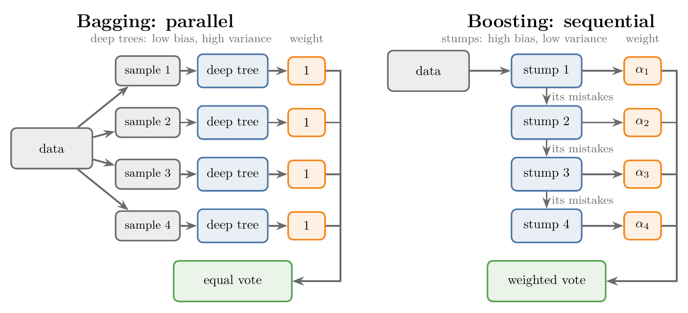

<!-- where-this-fits: generated by course_map/build_map.py; edit concepts.yaml, not this block -->
> **Where this fits:** Pipeline map step 8 (Model). See the [Course map](../01-course-map/note.md).
>
> 
>
> - **Builds on:** Underfitting ([Note 91](../91-knn/note.md)); Ensemble learning ([Note 101](../101-ensemble-learning/note.md)); Bias-variance trade-off ([Note 109](../109-random-forest-bias-variance/note.md)).
> - **Leads to:** Gradient boosting ([Note 120](../120-gradient-boosting-intuition/note.md)).
> - **Compare with:** Bagging ([Note 107](../107-bagging-regressor/note.md)); Stacking and blending ([Note 127](../127-stacking-blending/note.md)).
<!-- /where-this-fits -->

## 1. Overview

> **Key point:** Bagging and boosting differ on three points: the kind of base model (low bias and high variance, against high bias and low variance), the way they learn (in parallel, against in sequence), and the weight of each base model in the vote (equal, against earned).

{height=40%}

Among the best-performing ML models, most are bagging or boosting ensembles. "What is the difference between bagging and boosting?" is also a common interview question.

We have now seen both: bagging in the [bagging Note](../105-bagging-intuition/note.md) and random forests, boosting through AdaBoost in the [AdaBoost intuition Note](../115-adaboost-intuition/note.md). This Note puts them side by side on three points (Figure 1). The Notebook (`notebook.ipynb`) runs a small experiment on the first point.

## 2. Difference 1: the type of base model

> **Key point:** Bagging starts from low-bias, high-variance models and lowers their variance; boosting starts from high-bias, low-variance models and lowers their bias.

We want low bias and low variance, but a single model usually trades one for the other (the [bias-variance Note](../62-bias-variance/note.md)). Bagging takes **low-bias, high-variance** models, such as fully grown trees or KNN with a small k, and averages away much of their variance (the [bagging Note](../105-bagging-intuition/note.md), section 3.2). Boosting attacks the trade-off from the opposite end.

### 2.1 Boosting: high bias, low variance models

> **Key point:** Boosting uses models that are too simple to fit the data well but are stable, such as shallow trees and decision stumps.

Boosting needs base models with **high bias and low variance**:

- a **shallow decision tree**, whose depth is very small;
- above all the **decision stump**, a tree of depth 1 (the AdaBoost intuition Note, section 2.2).

A stump is not good on the training data, but it hardly changes when the data changes. Adding many stumps in sequence, each fixing the last one's mistakes, lowers the bias step by step while the variance stays low.

### 2.2 The rule of thumb

> **Key point:** A model that is very good on the training data but unstable calls for bagging; a model that is stable but weak calls for boosting.

| If the algorithm is... | it is... | so use |
|---|---|---|
| very good on the training data, unstable when the data changes | low bias, high variance | bagging |
| not so good on the training data, stable when the data changes | high bias, low variance | boosting |

This is the most important of the three differences.

> **Extra:** Swapping the base models shows why. On the noisy circles data of the [AdaBoost hyperparameters Note](../118-adaboost-hyperparameters/note.md), with 100 base models each and 10-fold cross-validation:
>
> | Base model | Alone | Bagging | AdaBoost |
> |---|---|---|---|
> | stump | 0.566 | 0.738 | **0.814** |
> | fully grown tree | 0.746 | **0.808** | 0.750 |
>
> Boosting helps stumps most, bagging helps full trees most. AdaBoost with full trees is no better than one tree: the first tree already classifies every training row correctly, its error is 0, and boosting stops after that single tree, since no mistakes are left to pass on.

## 3. Difference 2: parallel against sequential learning

> **Key point:** Bagging trains all its models side by side, independently; boosting trains them one after another, each depending on the one before.

**Bagging is parallel** (Figure 1, left). Bagging stands for bootstrap aggregation (the bagging Note). From a dataset of, say, 1,000 rows, each base model gets its own random sample of rows. No model needs anything from any other, so all of them can be trained at the same time.

**Boosting is sequential** (Figure 1, right). The data goes to model 1, which does its job and passes its mistakes on to model 2. Model 2 does its job and passes its own mistakes to model 3, and so on. Model 2 cannot start before model 1 has finished, because it learns from model 1's mistakes.

> **Extra:** This has a practical side. Bagging can spread its models over every CPU core (`n_jobs=-1` in `BaggingClassifier` and `RandomForestClassifier`); `AdaBoostClassifier` has no `n_jobs`, because its stages must run one at a time.

## 4. Difference 3: the weight of each base model

> **Key point:** In bagging every base model's vote counts the same, like a democracy; in boosting each model's vote is weighted by how well it did.

When a new query point arrives, every trained base model gives its answer. The two methods combine those answers differently.

**Bagging: equal votes.** Suppose four models answer 1, 1, 0 and 1. Every vote has the same weight, like a democracy, so the majority wins: three say 1, the output is 1 (Figure 1, left: every weight is 1).

**Boosting: weighted votes.** Every model carries its own weight, its alpha (the [AdaBoost step-by-step Note](../116-adaboost-step-by-step/note.md), section 6). With weights such as 0.8, 1.5 and 5, the model with weight 5 is listened to far more than the one with 0.8. A model that made fewer mistakes during training earns a larger say.

## 5. Summary

| | Bagging | Boosting |
|---|---|---|
| Base models | low bias, high variance (fully grown trees, KNN with small k) | high bias, low variance (stumps, shallow trees) |
| Mainly reduces | variance | bias |
| Learning | parallel: models trained independently, at the same time | sequential: each model learns from the previous one's mistakes |
| Data each model sees | a random sample of the rows | all rows, reweighted toward earlier mistakes |
| Weight in the vote | equal (democracy) | each model's alpha, earned by its accuracy |
| Examples | bagging, random forest | AdaBoost, gradient boosting, XGBoost |

- Both aim at low bias and low variance, from opposite ends.
- Bagging averages unstable, accurate models; boosting adds up stable, weak ones.
- Bagging trains in parallel and votes equally; boosting trains in sequence and weights each vote.

## 6. Key terms

| Term | Meaning |
|---|---|
| Parallel learning | Training the base models independently, so they can all be trained at once (bagging) |
| Sequential learning | Training the base models one after another, each depending on the previous ones (boosting) |
| Shallow decision tree | A decision tree with a small maximum depth; high bias, low variance |
