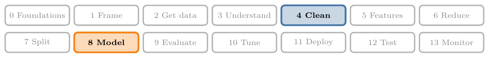
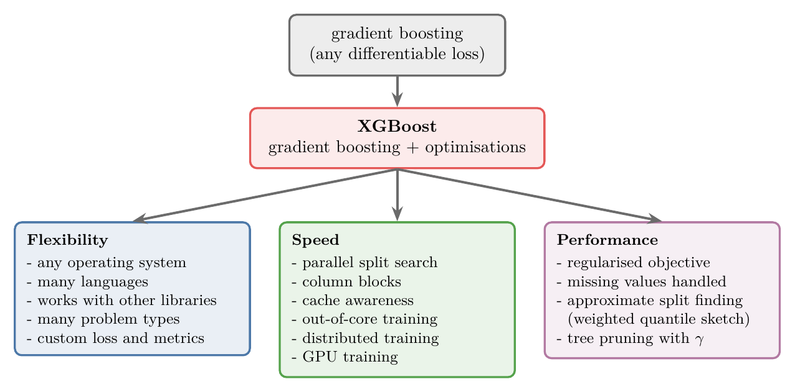
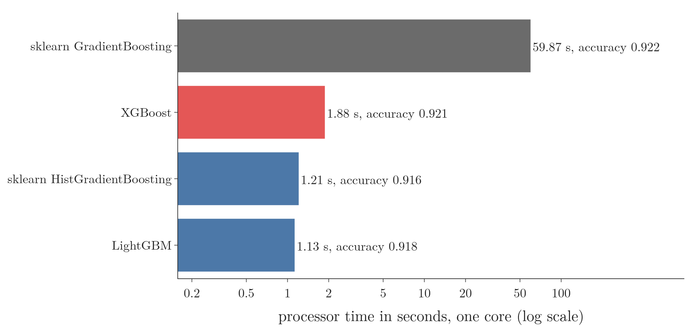
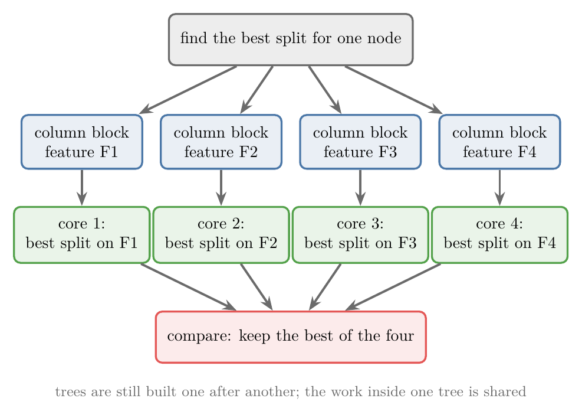
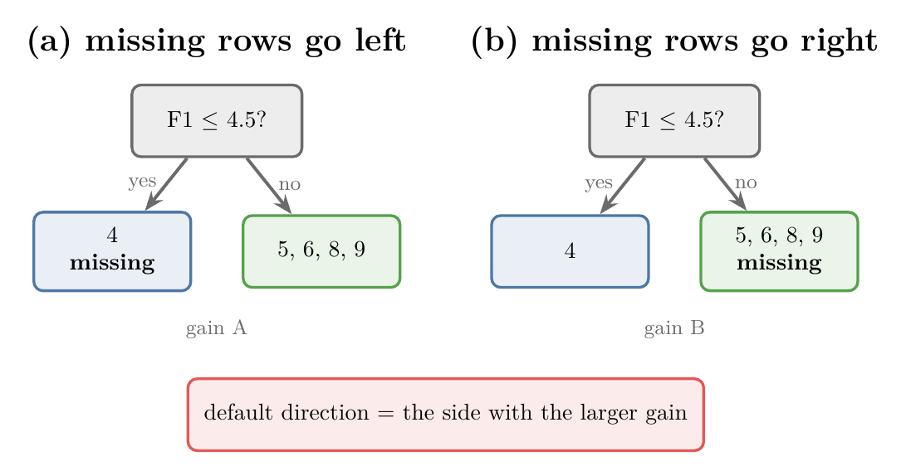

<!-- where-this-fits: generated by course_map/build_map.py; edit concepts.yaml, not this block -->
> **Where this fits:** Pipeline map steps 4 (Clean), 8 (Model). See the [Course map](../01-course-map/note.md).
>
> 
>
> - **Builds on:** Poor-quality data ([Note 9](../09-mldlc/note.md)); Binning and binarization ([Note 32](../32-binning-binarization/note.md)); Regularisation ([Note 63](../63-ridge-regression-intuition/note.md)); Gradient boosting ([Note 122](../122-gradient-boosting-classification/note.md)).
> - **Compare with:** Outliers ([Note 41](../41-what-are-outliers/note.md)).
<!-- /where-this-fits -->

## 1. Overview

> **Key point:** XGBoost is not a new algorithm: it is a library that takes gradient boosting and adds many optimisations, for flexibility, speed and performance.

{height=38%}

**XGBoost** (eXtreme Gradient Boosting) is the gradient boosting of the [gradient boosting Notes](../120-gradient-boosting-intuition/note.md) with a long list of improvements. Some come from machine learning, most from software engineering. Figure 1 sorts them into three areas.

This Note is a map of the whole library: what each improvement is and why it matters, without the maths. The Notes that follow work through the core:

- the XGBoost tree for regression ([XGBoost regression Note](../124-xgboost-regression/note.md)) and classification ([XGBoost classification Note](../125-xgboost-classification/note.md));
- where its formulas come from ([XGBoost maths Note](../126-xgboost-maths/note.md)).

> **Python:** XGBoost is a separate package, `pip install xgboost` (or `conda install -c conda-forge xgboost`), imported as `import xgboost as xgb`. Its `XGBClassifier` and `XGBRegressor` follow the scikit-learn `fit`/`predict` interface.

## 2. Why so many algorithms?

> **Key point:** Early algorithms worked well only on particular kinds of data; the general and powerful algorithms of the 1990s had two problems left: overfitting and speed on large data.

Machine learning has dozens of algorithms: linear regression, logistic regression, Naive Bayes, KNN, SVM and more. Why not one algorithm for every problem? Because each algorithm suits a certain kind of data.

**Specialised algorithms (1970s and 1980s).** Algorithms of this period solve problems well, but only on specific data. Linear regression works well on data with a linear pattern; Naive Bayes is at its best on text.

**General algorithms (1990s).** Random forests, SVMs and gradient boosting are both more powerful and more general: they give good results on many kinds of data. Two problems remained:

1. **overfitting**: they could still fit the training data too closely;
2. **scalability**: from the 2000s the internet made datasets grow fast, and on big datasets these algorithms were slow.

XGBoost was built to fix both: better results and much more speed.

## 3. What XGBoost is

> **Key point:** XGBoost is a library: the gradient boosting algorithm plus software engineering that makes it fast and robust.

A common misunderstanding is that XGBoost is a new algorithm. It is a **library** built on the existing gradient boosting algorithm. Its creator, Tianqi Chen, saw how much potential gradient boosting had. By improving its speed and its results, it could become far more powerful.

So XGBoost is two things together:

- **machine learning**, taken from gradient boosting (with a few changes of its own, section 7);
- **software engineering**: parallel processing, memory handling, distributed and GPU computing (section 6).

## 4. A short history

> **Key point:** Started in 2014, made famous by Kaggle competitions, then open-sourced and grown by a large community.

The history falls into three stages.

1. **The early days (2014).** Tianqi Chen started XGBoost as a research project at the University of Washington (Wikipedia, "XGBoost"). To test it, it was used in the Higgs Boson Machine Learning Challenge on Kaggle, a particle-physics competition. It did very well there, and Kaggle users began to notice a new tool.
2. **The Kaggle years (2015-2016).** More and more winners used it. The XGBoost paper (Chen and Guestrin 2016, §1) reports that 17 of the 29 winning solutions published on Kaggle's blog in 2015 used XGBoost.
3. **Open source (from 2016).** With the code open, engineers worldwide added features and optimisations, support for more platforms and languages, documentation and tutorials. Today XGBoost is a default first try in most competitions and in much industry work.

## 5. Why gradient boosting was the starting point

> **Key point:** Gradient boosting already had flexibility, strong results, robustness and Kaggle success; it lacked only speed on big data.

Several properties made gradient boosting a good base:

- **Flexibility.** It accepts any loss function that can be differentiated ([gradient boosting maths Note](../121-gradient-boosting-regression-maths/note.md)). The same algorithm handles regression, classification, ranking and custom problems.
- **Performance.** On most datasets it gives good results.
- **Robustness.** With proper regularisation its results are stable.
- **Kaggle.** Many winners already used it.

It did nearly everything right. With better results on new data and the ability to handle big datasets, it would become hard to beat. That was the plan behind XGBoost.

## 6. Flexibility

> **Key point:** XGBoost runs on any operating system, in many languages, alongside the usual libraries, and on almost any kind of problem, with our own loss if we want.

The aim was to reach as many people as possible. Four features serve it.

### 6.1 Cross-platform

> **Key point:** The same model runs on Windows, Linux and macOS.

A model trained on Linux can be loaded and used on Windows. Most libraries can do this today, so this is no longer unusual.

### 6.2 Many programming languages

> **Key point:** A model trained in Python can be loaded and used from Java, R, Scala, C++ and others.

Most models live in one language: Python, R or MATLAB. XGBoost has interfaces (wrappers around the same core) for Python, R, Java, Scala, Ruby, Swift, Julia, C and C++.

This matters in practice. Suppose a company's website is written in Java, as many enterprise applications are, and needs a machine learning component. Usually the model is trained in Python and wrapped in a separate web service (an API) that Java calls. With XGBoost, Java can load the saved model and predict directly.

> **Python:** Saving a model in Python for use in another language.
>
> ```python
> import xgboost as xgb
>
> model = xgb.XGBClassifier()
> model.fit(X_train, y_train)
> # JSON format: readable by every XGBoost interface
> model.save_model("model.json")
> ```
>
> In Java, XGBoost4J loads the same file with `XGBoost.loadModel("model.json")` and calls `predict` on new data.

### 6.3 Works with other libraries

> **Key point:** XGBoost fits into every stage of a project, from data analysis to deployment.

- **Model building:** NumPy, pandas and scikit-learn (XGBoost models follow the scikit-learn `fit`/`predict` interface).
- **Distributed computing:** Spark (PySpark) and Dask (section 7.5).
- **Explaining models:** SHAP and LIME.
- **Deployment:** Docker and Kubernetes.
- **Workflow management (MLOps):** MLflow and Apache Airflow.

### 6.4 Many kinds of problems

> **Key point:** Regression, binary and multiclass classification, time series, ranking, anomaly detection, and any custom differentiable loss.

Linear regression only does regression; logistic regression only classification. XGBoost handles:

- regression;
- binary and multiclass classification;
- time series forecasting;
- ranking (ordering items, as in recommender systems);
- anomaly detection.

Because it is gradient boosting underneath, we can also write our own loss function and our own evaluation metric. For example, a loss that charges more for false negatives than for false positives: the [imbalanced data Note](../133-imbalanced-data/note.md), section 9, writes such a loss.

## 7. Speed

> **Key point:** Six engineering tricks make XGBoost much faster than classic gradient boosting: parallel split search, column blocks, cache awareness, out-of-core training, distributed training and GPU training.

### 7.1 How much faster

> **Key point:** On 10,000 rows and 200 columns, scikit-learn's classic gradient boosting trains in 47 seconds; XGBoost in 0.67 seconds, about 70 times faster, for the same accuracy.

{height=36%}

The Notebook builds a synthetic dataset of 10,000 rows and 200 columns and trains the same ensemble, 100 trees of depth 3 with learning rate 0.1, in five implementations. Figure 2 shows the result:

- scikit-learn's classic `GradientBoostingClassifier`: **46.8 seconds**, test accuracy 0.922;
- XGBoost on the CPU (4 cores): **0.67 seconds**, accuracy 0.921;
- XGBoost on the GPU: 1.17 seconds, accuracy 0.921 (section 7.7);
- scikit-learn's `HistGradientBoostingClassifier` (4 cores): 0.47 seconds, accuracy 0.916;
- LightGBM (4 cores, section 9): 0.31 seconds, accuracy 0.918.

The accuracy hardly changes; only the time does. On a dataset that takes 10 hours to train, a speed-up of even 10 times means 1 hour. The last two are other libraries built on the same histogram idea, shown for comparison.

> **Python:** XGBoost with the scikit-learn interface.
>
> ```python
> from xgboost import XGBClassifier
>
> model = XGBClassifier(n_estimators=100, max_depth=3,
>                       learning_rate=0.1,
>                       tree_method="hist", n_jobs=4,
>                       random_state=42)
> model.fit(X_train, y_train)
> model.score(X_test, y_test)        # 0.921
> ```
>
> `tree_method="hist"` (the default in current versions) uses histogram bins (section 8.4); `n_jobs` is the number of processor cores.

Timings depend on the machine and on what else is running, so only the ratios are meaningful.

### 7.2 Parallel processing

> **Key point:** Boosting is sequential, tree after tree; the parallel work is inside one tree, where the best split of every feature can be searched at the same time.

**Parallel processing** means splitting one job among several workers. One builder takes 30 days to build a house; six builders working side by side take far less.

But boosting is sequential: tree 2 learns from the mistakes of tree 1, so it cannot start before tree 1 is done. Where does the parallel work come from? From inside each tree.

To grow a node, a decision tree tries every candidate split on every feature ([decision trees Note](../97-decision-trees-intuition/note.md)). Take two features, age and marks, and three students. For age we sort the values and score a cut between each neighbouring pair; we do the same for marks. Then we keep the best cut of all.

The search over age does not depend on the search over marks. So one processor core can take age while another takes marks (Figure 3). With 200 features and 8 cores, 8 features are searched at once. The number of cores used is the hyperparameter `n_jobs`.

{height=40%}

### 7.3 Column blocks

> **Key point:** XGBoost stores the data column by column, pre-sorted, so each core can take one column and work on it alone.

Most algorithms store data row by row: one block holds every column of row 1, the next every column of row 2. XGBoost stores it in **column blocks**: one block per feature, its values sorted once before training and reused for every tree (Chen and Guestrin 2016, §4.1). A core can pick up one whole column block and search its splits without touching the rest. Column blocks are what make the parallel split search of Figure 3 efficient.

### 7.4 Cache awareness

> **Key point:** Values that are needed again and again are kept in the small, fast cache memory next to the processor, instead of being fetched from RAM each time.

The processor (CPU) does the computing; the data lives in RAM, a separate piece of hardware, and fetching it takes time. **Cache memory** is a small, fast memory inside the processor for things that are used repeatedly. A website's logo that loads faster the second time works the same way: it is kept locally.

XGBoost keeps what it uses most often in the cache, such as the statistics of the histogram bins it builds for each feature (section 8.4). A cook who keeps the most-used spices on the counter, instead of walking to the fridge each time, saves time in the same way.

### 7.5 Out-of-core computing

> **Key point:** A dataset bigger than the RAM is read in chunks; training moves forward chunk by chunk.

Suppose our laptop has 8 GB of RAM and the dataset is 10 GB. It cannot be loaded at once, so normally we could not even start.

**Out-of-core computing** splits the data into chunks, say five of 2 GB, kept on disk. The model trains on chunk 1 and reaches some state; then chunk 2 is loaded and training continues from that state, and so on to chunk 5. XGBoost does this through its external-memory mode, and it works together with cache awareness: what is needed again is kept in the cache while chunks come and go.

### 7.6 Distributed computing

> **Key point:** Several machines each take a part of the data, find their best splits locally, and a master node combines them.

In **distributed computing** a job is shared between several machines, called **nodes**, working in parallel. Out-of-core computing lets one machine handle big data, but it still processes one chunk at a time. With 5 nodes and a 10 GB dataset cut into 5 chunks of 2 GB, all five chunks are processed at the same moment.

1. **Partition** the data: each node gets an equal share.
2. **Work locally**: each node computes, for every feature, the split statistics on its own share.
3. **Aggregate**: a **master node** collects the results, picks the split that helps most overall, and sends the decision back.

This needs outside tools: XGBoost connects to Dask, Spark and Kubernetes for it.

### 7.7 GPU support

> **Key point:** A graphics card has thousands of small cores; XGBoost's histogram building and split search can run on them.

A **GPU** (graphics processing unit, the graphics card) has many cores, each weaker than a CPU core but far more numerous. It is ideal for many small, similar calculations: drawing game graphics, training deep learning models. XGBoost's histogram building and split finding are exactly such work, so XGBoost can run on a GPU, and on large datasets it reaches a given test error much sooner than on a CPU.

On our 10,000 rows the GPU (an RTX 3060 laptop card) took 1.17 seconds against 0.67 on the CPU, so here the GPU was slower. The speed-up described above is for large datasets.

> **Python:** Training on a GPU.
>
> ```python
> model = XGBClassifier(tree_method="hist", device="cuda")
> ```
>
> Older code writes `tree_method="gpu_hist"`; that value is deprecated since XGBoost 2.0, which uses `device="cuda"` instead.

### 7.8 Why "extreme"

> **Key point:** All these engineering tricks taken to the extreme gave the library its name: eXtreme Gradient Boosting.

Parallel processing, special data structures, cache use, out-of-core, distributed and GPU computing: XGBoost pushes software engineering on gradient boosting as far as it goes. Hence the name, eXtreme Gradient Boosting.

## 8. Performance

> **Key point:** Five machine learning changes improve XGBoost's results: a regularised objective, missing-value handling, sparsity-aware splits, approximate split finding with quantile bins, and more ways to prune trees.

### 8.1 A regularised learning objective

> **Key point:** XGBoost's objective is the loss plus a penalty on the tree itself, so every tree is regularised as it is built.

Regularisation adds a penalty to the loss so that the model stays simpler and overfits less, as in ridge regression's L2 penalty ([ridge regression maths Note](../64-ridge-regression-maths/note.md)). Classic gradient boosting accepts any differentiable loss but has no penalty built in. It fights overfitting only with the learning rate ([gradient boosting intuition Note](../120-gradient-boosting-intuition/note.md)) and by limiting or pruning the trees.

XGBoost adds a penalty term to its objective by default. It punishes trees with many leaves and leaves with large output values. When the objective is minimised, the regularisation happens automatically. The formula, with its two hyperparameters $\gamma$ and $\lambda$, is derived in the [XGBoost maths Note](../126-xgboost-maths/note.md).

### 8.2 Sparsity-aware split finding

> **Key point:** At each split, XGBoost tries sending the rows with a missing value left and then right, and keeps the direction with the larger gain.

Data is **sparse** when it has many zeros or missing values. XGBoost first notices the sparsity and then handles it in its splits.

Take one feature F1 with values 4, 5, 6, 8, 9 and one missing value. Candidate cuts are 4.5, 5.5, 7 and 8.5; no cut is placed at the missing value. For the node "F1 at most 4.5", the value 4 goes left and 5, 6, 8, 9 go right. Where does the missing row go?

XGBoost tries both (Figure 4). It sends the missing row left and computes the gain of the split; then right, and computes the gain again. The side with the larger gain becomes the node's **default direction**: at prediction time, any row missing F1 follows it. The gain itself is defined in the [XGBoost regression Note](../124-xgboost-regression/note.md).

{height=34%}

### 8.3 Missing values without imputation

> **Key point:** Because of the default direction, XGBoost trains on data with missing values as they are, with no imputation step.

So far, a dataset with missing values had to be fixed first: rows dropped ([complete case analysis Note](../35-complete-case-analysis/note.md)) or values filled in ([imputing numerical data Note](../36-imputing-numerical-data/note.md)). Most models refuse missing values. XGBoost does not need this step: the default direction of section 8.2 decides where each missing row goes.

The Notebook shows this on the Titanic passengers, where Age is missing for 177 of 891:

- scikit-learn's classic `GradientBoostingClassifier` stops with `ValueError: Input X contains NaN`;
- `XGBClassifier` trains on the data as it is: 5-fold cross-validated accuracy **0.828** (Pclass, Sex, Age, Fare);
- with the missing ages filled by the median first, it scores 0.834, about the same.

We can read the learned default direction from the first tree. One of its nodes asks "Age < 13?", and passengers with no age are sent to the "no" side, together with the passengers aged 13 or more. That side was chosen because it gave the larger gain (section 8.2).

> **Python:** Missing values in XGBoost.
>
> ```python
> import numpy as np
> from xgboost import XGBClassifier
>
> # np.nan marks a missing value (also the default)
> model = XGBClassifier(missing=np.nan)
> model.fit(X_train, y_train)   # no imputation needed
> ```

### 8.4 Approximate split finding with quantile bins

> **Key point:** Instead of trying every value as a split, XGBoost cuts each column into bins and tries only the bin edges; the bins follow quantiles, so they are narrow where the data is dense.

The usual way to find a split, used in the [regression trees Note](../99-regression-trees/note.md), is the **exact greedy algorithm**: sort the column, try the midpoint between every pair of neighbouring values, and keep the best. It always finds the best split, but on a column with ten million values it tries ten million candidates at every node.

**Approximate tree learning** tries far fewer. It cuts the column into bins, for example 1 to 5, 6 to 10, 11 to 15, and tries only the bin edges. The continuous column becomes discrete, as in [binning](../32-binning-binarization/note.md). The split found may be a little worse than the exact best, but training is much faster. Because the bins work like the bars of a histogram, this is also called **histogram-based training**.

Where should the bin edges go? Equal-width bins ignore the data. XGBoost places them at **quantiles** instead (the method is called the **weighted quantile sketch**): where many values crowd together the bins are narrow, and where values are rare they are wide. The bins then describe the data more accurately, and the trees built on them are more accurate too.

On the Titanic fares, a very skewed column, Figure 4 of the [binning Note](../32-binning-binarization/note.md) shows the difference: equal-width bins put almost every passenger in the first bin, while quantile bins share the passengers out evenly, with narrow bins among the many cheap fares.

> **Extra:** "Weighted" means the quantiles are not counted in rows. Each row counts with a weight, its Hessian $h_i$ (the second derivative of the loss, from the [XGBoost maths Note](../126-xgboost-maths/note.md)). For squared error every $h_i = 1$, so the weighted quantiles are the ordinary ones. For log loss $h_i = p_i(1-p_i)$ ([XGBoost classification Note](../125-xgboost-classification/note.md)): largest (0.25) at $p_i = 0.5$, near 0 when $p_i$ is close to 0 or 1. So observations (rows) the model is still unsure about weigh more, and the bins are finer among them. "Sketch" means the quantiles are estimated from a compact summary that can be merged, which lets it work when the data is split over many machines (Chen and Guestrin 2016, §3.3).

Which method to use: the exact greedy algorithm on small data; the approximate algorithm on big data, where scanning every value, especially when the data does not fit in memory, is too slow (Chen and Guestrin 2016, §3.2).

### 8.5 Tree pruning

> **Key point:** Besides the usual pre-pruning and post-pruning settings, XGBoost has $\gamma$: a split is only kept if it lowers the loss by at least $\gamma$.

**Tree pruning** limits how deep and complex the trees grow, which reduces overfitting ([decision tree hyperparameters Note](../98-decision-tree-hyperparameters/note.md)). There are two kinds: pre-pruning stops a tree while it grows, post-pruning grows it fully and cuts it back.

XGBoost offers both kinds of settings, plus one more: $\gamma$ (`gamma`). A new branch is made only if it reduces the loss by a significant amount, at least $\gamma$. How this works is shown in the [XGBoost regression Note](../124-xgboost-regression/note.md). This much control over pruning did not exist in classic gradient boosting, and it helps XGBoost do well on most datasets.

## 9. LightGBM and CatBoost

> **Key point:** XGBoost is not the only strong gradient boosting library: LightGBM is built for speed and low memory, CatBoost for categorical features.

Two other libraries improve on gradient boosting in their own ways:

- **LightGBM** (Light Gradient Boosting Machine, from Microsoft Research): aimed at faster training, lower memory use and sometimes better accuracy. It also offers parallel, distributed and GPU training and handles very large data. Its results are sometimes equal to XGBoost's and sometimes better.
- **CatBoost** (from Yandex; Prokhorenkova et al. 2018): an open-source gradient boosting library on decision trees whose best-known feature is built-in support for categorical columns, with no manual encoding.

scikit-learn's `HistGradientBoostingClassifier` and `HistGradientBoostingRegressor` are modelled on LightGBM (scikit-learn docs). In Figure 2, LightGBM and scikit-learn's version were the fastest of all on our data.

## 10. Summary

| Area | Improvement | What it gives |
|---|---|---|
| Flexibility | cross-platform, many languages | one model usable everywhere, e.g. trained in Python, used in Java |
| Flexibility | library integrations, many problem types, custom loss | fits any project and problem |
| Speed | parallel split search, column blocks | the features of one node are searched at once |
| Speed | cache awareness, out-of-core | less waiting for memory; data bigger than RAM |
| Speed | distributed and GPU training | many machines or thousands of GPU cores |
| Performance | regularised objective, pruning with $\gamma$ | less overfitting |
| Performance | sparsity-aware splits | missing values handled with a learned default direction |
| Performance | approximate splits with quantile bins | fast split search that follows the data |

- XGBoost is a library: gradient boosting plus engineering. Boosting stays sequential; the parallel work is inside each tree.
- It became famous through Kaggle: 17 of the 29 winning solutions published on Kaggle's blog in 2015 used it.
- On 10,000 by 200 rows, XGBoost trained in 0.67 seconds against 46.8 seconds for classic gradient boosting, with the same accuracy.
- Missing values need no imputation: each split learns where to send them.
- Quantile bins are narrow where data is dense; only the bin edges are tried as splits (at most `max_bin` bins per column, 256 by default; XGBoost docs).
- LightGBM and CatBoost are the other major gradient boosting libraries.

## 11. Sources

- Chen, T. and Guestrin, C. (2016). *XGBoost: A Scalable Tree Boosting System*. KDD 2016 (arXiv:1603.02754).
- Wikipedia, "XGBoost" (history section).
- Prokhorenkova, L. et al. (2018). *CatBoost: unbiased boosting with categorical features*. NeurIPS 2018.
- scikit-learn documentation, `HistGradientBoostingClassifier`: "This implementation is inspired by LightGBM."
- XGBoost documentation, *XGBoost Parameters* (`max_bin`, `tree_method`).

## 12. Key terms

| Term | Meaning |
|---|---|
| XGBoost | eXtreme Gradient Boosting: a library that implements gradient boosting with many speed and accuracy optimisations |
| Parallel processing | Splitting one job among several processor cores working at the same time |
| Column block | XGBoost's storage of the data one sorted column per block, so each core can work on one feature |
| Cache memory | A small, fast memory inside the processor that holds data used again and again |
| Out-of-core computing | Training on data bigger than the RAM by loading it chunk by chunk |
| Distributed computing | Sharing one job between several machines (nodes), coordinated by a master node |
| GPU | Graphics processing unit: a processor with thousands of small cores for many small calculations at once |
| Sparsity-aware split finding | Choosing, at each split, the side (left or right) for missing values by comparing the gain of both |
| Default direction | The side of a split that rows with a missing value follow |
| Exact greedy algorithm | Finding a split by trying the midpoint between every pair of neighbouring sorted values |
| Approximate tree learning (histogram-based training) | Finding a split by trying only the edges of bins the column has been cut into |
| Weighted quantile sketch | XGBoost's method for placing bin edges at (Hessian-weighted) quantiles of a column |
| LightGBM | Microsoft's gradient boosting library, aimed at speed and low memory use |
| CatBoost | Yandex's gradient boosting library, with built-in handling of categorical columns |
