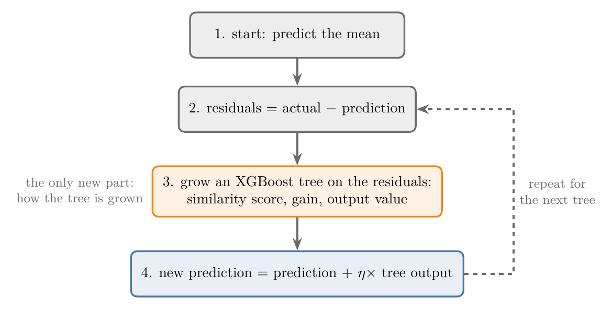
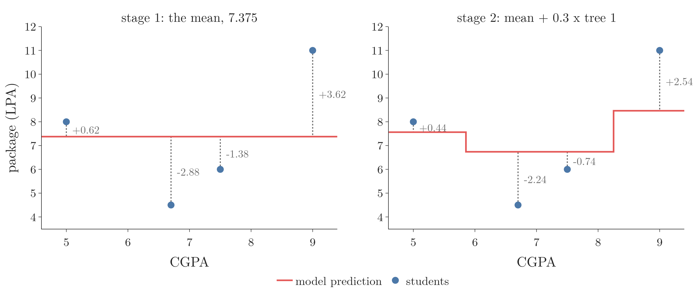
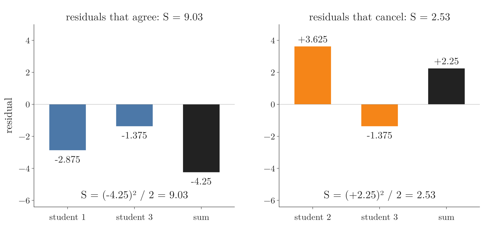
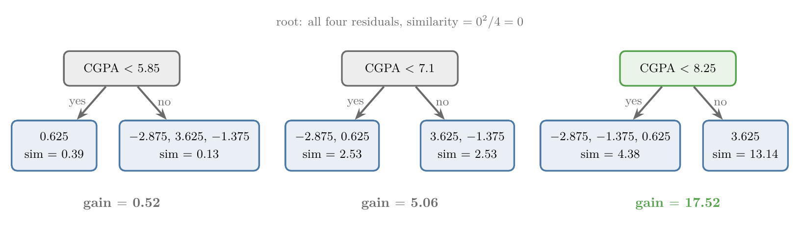
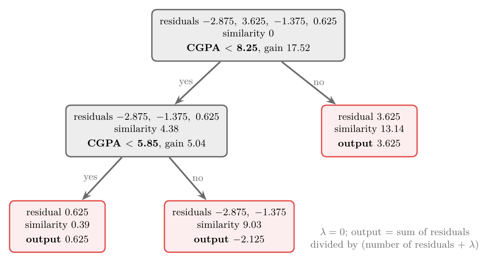
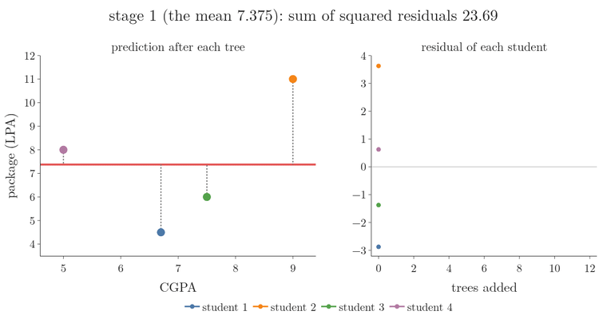
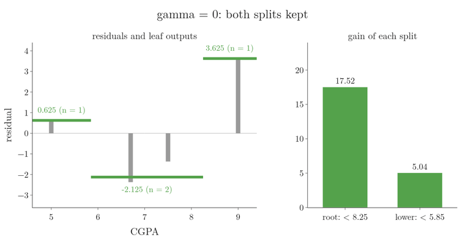

<!-- where-this-fits: generated by course_map/build_map.py; edit concepts.yaml, not this block -->
> **Where this fits:** Pipeline map step 8 (Model). See the [Course map](../01-course-map/note.md).
>
> 
>
> - **Builds on:** Binning and binarization ([Note 32](../32-binning-binarization/note.md)); Regularisation ([Note 63](../63-ridge-regression-intuition/note.md)); Gradient boosting ([Note 122](../122-gradient-boosting-classification/note.md)); Missing values ([Note 123](../123-xgboost-intro/note.md)).
<!-- /where-this-fits -->

## 1. Overview

> **Key point:** XGBoost solves regression exactly like gradient boosting: start from the mean, then add trees that predict the residuals, each scaled by a learning rate. The only new part is how each tree is grown: with a similarity score, a gain and its own formula for the leaf outputs.

{height=36%}

The loop in Figure 1 is the one from the [gradient boosting intuition Note](../120-gradient-boosting-intuition/note.md). Step 3 is where XGBoost differs. A normal regression tree chooses its splits by the drop in squared error ([regression trees Note](../99-regression-trees/note.md)); an XGBoost tree uses a quantity called the **similarity score** (G-1804).

This Note grows one XGBoost tree by hand on four students, then uses it for the next prediction. The [XGBoost introduction Note](../123-xgboost-intro/note.md) lists the speed tricks; here we stay with the core idea. Why the formulas look the way they do is derived in the [XGBoost maths Note](../126-xgboost-maths/note.md).

## 2. The data: CGPA and package

> **Key point:** Four students, one feature (CGPA) and one target (package in LPA, lakhs of rupees per year).

| Student | CGPA | Package (LPA) |
|---|---|---|
| 1 | 6.7 | 4.5 |
| 2 | 9.0 | 11 |
| 3 | 7.5 | 6 |
| 4 | 5.0 | 8 |

Each student is one **observation** (G-1374; one record, a row of the table). CGPA is the only **feature** (G-772; an input variable, one column of the table), and the package is the **target** (G-1949; the output we predict).

The relationship is not a straight line (Figure 2, left). Our goal: given a new student's CGPA, predict the package. One feature keeps every calculation small enough to do by hand.

## 3. Stage 1: the mean and its residuals

> **Key point:** The first model predicts the mean, 7.375, for every student; the residuals are actual minus 7.375.

As in gradient boosting, the first model ignores the feature and predicts the mean of the target:

$$f_0 = \frac{4.5 + 11 + 6 + 8}{4} = \frac{29.5}{4} = 7.375$$

The **residuals** (G-1685; pseudo-residuals, see the [gradient boosting intuition Note](../120-gradient-boosting-intuition/note.md)) are actual minus predicted:

| Student | CGPA | Package | Prediction 1 | Residual 1 |
|---|---|---|---|---|
| 1 | 6.7 | 4.5 | 7.375 | $-2.875$ |
| 2 | 9.0 | 11 | 7.375 | 3.625 |
| 3 | 7.5 | 6 | 7.375 | $-1.375$ |
| 4 | 5.0 | 8 | 7.375 | 0.625 |



Figure 2 (left) shows the residuals as dotted lines. The next model, an XGBoost tree, takes CGPA as input and the residuals as its target.

## 4. The similarity score

> **Key point:** Put all the residuals in one leaf and score it: (sum of residuals)$^2$ divided by (number of residuals + $\lambda$). Residuals that agree in sign score high; residuals that cancel score low.

An XGBoost tree starts as a single leaf holding every residual. The tree then tries to split that leaf so that each part holds residuals that are alike.

1. **In words:** add up the residuals in the leaf, square the sum, and divide by the number of residuals plus $\lambda$.
2. **Formula:**
   $$\text{similarity} = \frac{\left(\sum r_i\right)^2}{n + \lambda}$$
   Here $r_i$ are the residuals in the leaf, $n$ is how many there are, and $\lambda$ (lambda) is a **regularisation parameter** (G-1040). We set $\lambda = 0$ for now; section 12 brings it back.
3. **Example:** the root leaf holds all four residuals:
   $$\text{similarity}_{\text{root}} = \frac{(-2.875 + 3.625 - 1.375 + 0.625)^2}{4 + 0} = \frac{0^2}{4} = 0$$

The residuals from the mean always add up to exactly 0, so the root's similarity is 0. (If we round the mean to 7.3 first, they add up to 0.3 and the root scores $0.3^2/4 = 0.02$; the rounding changes nothing important.)

Why the name? In a leaf such as $\lbrace-2.875, -1.375\rbrace$ the residuals point the same way, the sum is large and the score is high. In $\lbrace3.625, -1.375\rbrace$ they cancel, the sum is small and the score is low.

Figure 3 puts the two leaves side by side. Watch the black sum bar: the same student 3 sits in both leaves, but next to student 1 the sum grows, and next to student 2 it nearly vanishes.

{height=34%}

## 5. Candidate splits

> **Key point:** Sort the CGPA values and try a split at every midpoint: 5.85, 7.1 and 8.25.

Candidate thresholds are found as in the [regression trees Note](../99-regression-trees/note.md), section 4: sort the input, then take the midpoint of each neighbouring pair.

- sorted CGPA: 5.0, 6.7, 7.5, 9.0;
- midpoints: $(5.0 + 6.7)/2 = 5.85$, $(6.7 + 7.5)/2 = 7.1$, $(7.5 + 9.0)/2 = 8.25$.

Each threshold splits the root leaf into a left leaf (CGPA below the threshold) and a right leaf (the rest).

## 6. Gain: choosing the root split

> **Key point:** Gain = similarity of the left leaf + similarity of the right leaf $-$ similarity of the parent. The split with the largest gain wins: CGPA < 8.25, with gain 17.52.

1. **In words:** after a split, add the two children's similarity scores and subtract the parent's score. The result, the **gain** (G-820), is how much more alike the residuals have become.
2. **Formula:**
   $$\text{gain} = S_{\text{left}} + S_{\text{right}} - S_{\text{parent}}$$
3. **Example:** CGPA < 5.85 puts student 4 (residual 0.625) on the left and the other three on the right:
   $$S_{\text{left}} = \frac{0.625^2}{1} = 0.39, \qquad S_{\text{right}} = \frac{(-2.875 + 3.625 - 1.375)^2}{3} = \frac{(-0.625)^2}{3} = 0.13$$
   $$\text{gain} = 0.39 + 0.13 - 0 = 0.52$$



Figure 4 shows all three candidates:

| Split | Left residuals | Right residuals | $S_{\text{left}}$ | $S_{\text{right}}$ | Gain |
|---|---|---|---|---|---|
| CGPA < 5.85 | 0.625 | $-2.875$, 3.625, $-1.375$ | 0.39 | 0.13 | 0.52 |
| CGPA < 7.1 | $-2.875$, 0.625 | 3.625, $-1.375$ | 2.53 | 2.53 | 5.06 |
| CGPA < 8.25 | $-2.875$, $-1.375$, 0.625 | 3.625 | 4.38 | 13.14 | **17.52** |

CGPA < 8.25 wins. The split isolates the one large positive residual (student 2) from the rest, so both leaves hold residuals that mostly agree.

## 7. The second split

> **Key point:** Only the left leaf can be split again; of its two candidates, CGPA < 5.85 has the larger gain (5.04 against 0.04).

The right leaf holds a single residual and cannot be split. The left leaf holds three: $-2.875$ (CGPA 6.7), $-1.375$ (CGPA 7.5) and 0.625 (CGPA 5.0). Its similarity, 4.38, is now the parent score. Two thresholds remain, 5.85 and 7.1.

- **CGPA < 5.85:** left $\lbrace0.625\rbrace$, right $\lbrace-2.875, -1.375\rbrace$.
  $$\text{gain} = \frac{0.625^2}{1} + \frac{(-4.25)^2}{2} - 4.38 = 0.39 + 9.03 - 4.38 = 5.04$$
- **CGPA < 7.1:** left $\lbrace0.625, -2.875\rbrace$, right $\lbrace-1.375\rbrace$.
  $$\text{gain} = \frac{(-2.25)^2}{2} + \frac{(-1.375)^2}{1} - 4.38 = 2.53 + 1.89 - 4.38 = 0.04$$

CGPA < 5.85 wins: it keeps the two negative residuals together. We stop here, at depth 2, because with four observations a deeper tree would only memorise them. XGBoost's default is `max_depth=6`, meant for real datasets.

Figure 5 replays sections 5 to 8 as one search. Watch the dashed threshold slide along CGPA, the residuals switch between the left (blue) and right (orange) leaf, and a gain bar appear at each candidate; the tallest bar locks in as the split, the left leaf is searched the same way, and each final leaf predicts the mean of its residuals.


## 8. Output values of the leaves

> **Key point:** A leaf's output is the sum of its residuals divided by (number of residuals + $\lambda$); with $\lambda = 0$ that is simply their mean.

A normal regression tree predicts the mean in each leaf. An XGBoost leaf has its own formula for its prediction, the **output value** (G-1426), which happens to give the mean when $\lambda = 0$.

1. **In words:** add the residuals in the leaf and divide by their count plus $\lambda$.
2. **Formula:**
   $$\text{output} = \frac{\sum r_i}{n + \lambda}$$
   It is the similarity formula without the square on top.
3. **Example:** the leaf holding $-2.875$ and $-1.375$:
   $$\text{output} = \frac{-2.875 - 1.375}{2 + 0} = \frac{-4.25}{2} = -2.125$$

The other two leaves hold one residual each, so their outputs are 0.625 and 3.625. Figure 6 shows the finished tree.

{height=42%}

## 9. Stage 2: adding the tree with a learning rate

> **Key point:** New prediction = 7.375 + 0.3 $\times$ tree output. Every residual moves towards 0.

The combined model is the mean plus the tree's output scaled by the learning rate. XGBoost calls the learning rate **eta** (G-1068; $\eta$); its default is 0.3. Scaling each tree down is shrinkage, as in the [AdaBoost hyperparameters Note](../118-adaboost-hyperparameters/note.md), section 4.

1. **In words:** start from the mean and add eta times the output of the leaf the student falls into.
2. **Formula:**
   $$\hat{y}^{(2)} = f_0 + \eta \cdot \text{tree}_1(x)$$
3. **Example:** student 1 has CGPA 6.7: "6.7 < 8.25" is yes, "6.7 < 5.85" is no, so the leaf output is $-2.125$:
   $$\hat{y}^{(2)} = 7.375 + 0.3 \times (-2.125) = 7.375 - 0.6375 = 6.7375$$

| Student | CGPA | Package | Leaf output | Prediction 2 | Residual 2 | Residual 1 |
|---|---|---|---|---|---|---|
| 1 | 6.7 | 4.5 | $-2.125$ | 6.7375 | $-2.2375$ | $-2.875$ |
| 2 | 9.0 | 11 | 3.625 | 8.4625 | 2.5375 | 3.625 |
| 3 | 7.5 | 6 | $-2.125$ | 6.7375 | $-0.7375$ | $-1.375$ |
| 4 | 5.0 | 8 | 0.625 | 7.5625 | 0.4375 | 0.625 |

Every residual is closer to 0 than before (Figure 2, right). The model is moving in the right direction, but only 30% of the way at each stage, which leaves room for later trees to correct it.

## 10. The next trees

> **Key point:** Repeat: compute new residuals, grow a new XGBoost tree on them, add eta times its output. Stop after `n_estimators` trees.

Stage 3 grows a second tree on CGPA and residual 2, with the same steps:

1. similarity score of each leaf;
2. gain of each candidate split;
3. best split;
4. output of each leaf.

On our data it chooses the same two splits, with leaf outputs 0.4375, $-1.4875$ and 2.5375. The prediction becomes

$$\hat{y}^{(3)} = 7.375 + 0.3 \cdot \text{tree}_1(x) + 0.3 \cdot \text{tree}_2(x)$$

and the residuals shrink again, to $-1.79$, 1.78, $-0.29$ and 0.31.

Figure 7 runs the loop for 12 trees. Watch the red staircase close in on the four students while every residual line on the right bends towards 0; the sum of squared residuals falls from 23.69 to 0.01.

{height=75%}

The number of trees is the hyperparameter `n_estimators`; the goal is residuals close to 0 without fitting the noise.

## 11. Exact greedy and approximate split finding

> **Key point:** Trying every midpoint is the exact greedy algorithm, good for small data. On large data XGBoost tries only bin edges, the approximate algorithm.

What we did in sections 5 to 7, sorting the values and testing every midpoint, is the exact greedy algorithm of the [XGBoost introduction Note](../123-xgboost-intro/note.md), section 8.4. The exact greedy algorithm finds the best split but checks every value, which is slow on millions of observations.

For large data XGBoost first groups each feature into bins and only tests the bin edges: the **approximate algorithm** (G-207), introduced in the [XGBoost introduction Note](../123-xgboost-intro/note.md).

> **Extra:** With several features, each feature is searched in the same way and the split with the largest gain over all features wins, exactly as in the [regression trees Note](../99-regression-trees/note.md), section 5 (Chen and Guestrin 2016, Alg. 1). Binary and multi-class categorical features are usually encoded as numbers first ([one-hot encoding Note](../27-one-hot-encoding/note.md)); recent XGBoost versions can also split categories directly when `enable_categorical=True` (XGBoost docs, Categorical Data).

## 12. Lambda: shrinking scores and outputs

> **Key point:** $\lambda$ is added to the number of residuals in every denominator. Similarity scores, gains and outputs all shrink, and leaves with few residuals shrink the most.

An everyday picture: we trust a restaurant with one five-star review less than one with twenty. $\lambda$ works like adding $\lambda$ imaginary residuals of 0 to every leaf: they barely move a leaf with many residuals, but pull a leaf with one residual strongly towards 0. On our tree, $\lambda = 1$ halves the one-residual leaves (0.625 becomes 0.31) and cuts the two-residual leaf by a third.

Figure 8 turns $\lambda$ up from 0 to 5 on the same tree. Watch the two one-residual leaves (n = 1) sink towards 0 faster than the two-residual leaf, and both gain bars shrink with them.

{height=75%}

> **Extra:** So far $\lambda = 0$. XGBoost's default is $\lambda = 1$ (`reg_lambda=1`). The same tree with $\lambda = 1$:
>
> | Leaf | Residuals | Output, $\lambda=0$ | Output, $\lambda=1$ |
> |---|---|---|---|
> | CGPA < 5.85 | 0.625 | 0.625 | $0.625/2 = 0.31$ |
> | 5.85 to 8.25 | $-2.875$, $-1.375$ | $-2.125$ | $-4.25/3 = -1.42$ |
> | CGPA $\geq$ 8.25 | 3.625 | 3.625 | $3.625/2 = 1.81$ |
>
> The one-residual leaves lose half their output; the two-residual leaf loses a third. The intuition: a leaf built on a single observation is the least trustworthy, so it is pulled hardest towards 0. The formula shows the same: the fewer observations a leaf has, the harder $\lambda$ pulls it towards 0, because the output is $\frac{n}{n+\lambda}$ times the mean of the residuals, which is $\frac{1}{2}$ of the mean for $n = 1$ and $\frac{2}{3}$ for $n = 2$. The gains shrink too: 17.52 becomes 9.86 at the root, and 5.04 becomes 2.93 at the second split. The shrinking is the same idea as the L2 penalty in ridge regression ([ridge regression maths Note](../64-ridge-regression-maths/note.md)): $\lambda$ pulls the outputs towards 0, which smooths the leaf outputs and so reduces overfitting (Chen and Guestrin 2016, §2.1).

## 13. Gamma: pruning weak splits

> **Key point:** A split is kept only if its gain minus $\gamma$ is positive. Pruning starts from the bottom of the tree; a large $\gamma$ removes weak splits, and a very large one removes them all.

An everyday picture: every split must pay a fee of $\gamma$, the **gamma** (G-823) parameter. A split whose gain cannot pay the fee is removed. On our tree, $\gamma = 6$ removes the lower split (gain 5.04) and keeps the root split (gain 17.52).

Figure 9 raises the fee from 0 to 22. Watch the red line pass the lower bar at 5.04, where the two left leaves merge into one with output $-1.21$, and then the root bar at 17.52, where the whole tree collapses into one leaf with output 0.

{height=75%}

> **Extra:** $\gamma$ (gamma, `gamma` or `min_split_loss` in XGBoost, default 0) is a second regularisation parameter. After the tree is grown, XGBoost checks each split from the bottom up (the Notebook confirms each case with the library):
>
> $$\text{gain} - \gamma < 0 \thickspace\Rightarrow\thickspace\text{remove the split}$$
>
> With $\lambda = 0$ and $\gamma = 6$:
>
> - the lower split, CGPA < 5.85, has $5.04 - 6 = -0.96 < 0$: removed. Its leaf becomes one leaf with residuals $-2.875$, $-1.375$, 0.625 and output $-3.625/3 = -1.21$;
> - the root split, CGPA < 8.25, has $17.52 - 6 = 11.52 > 0$: kept.
>
> With $\gamma = 20$ the root split goes too ($17.52 - 20 < 0$) and the tree is a single leaf with output 0: this stage adds nothing. A parent is only checked after its children; if a child split is kept, the parent stays even with a small gain (the Notebook, section 10, shows this with the library). The [decision tree hyperparameters Note](../98-decision-tree-hyperparameters/note.md) covers pruning in normal trees.

## 14. The same in code

> **Key point:** The Notebook grows this tree from scratch with NumPy, then checks it against the XGBoost library: same splits, same gains, same predictions.

> **Python:** The first tree in XGBoost, with every setting matched to this Note.
>
> ```python
> from xgboost import XGBRegressor
>
> model = XGBRegressor(
>     n_estimators=1,        # one tree for now
>     max_depth=2,           # depth of each tree
>     learning_rate=0.3,     # eta
>     reg_lambda=0,          # lambda (default 1)
>     gamma=0,               # min_split_loss
>     min_child_weight=0,    # minimum rows per leaf
>     base_score=7.375,      # start from the mean
>     tree_method="exact",   # exact greedy search
> )
> model.fit(X, y)            # X: CGPA as a 2D array
> model.predict(X)
> model.get_booster().get_dump(with_stats=True)
> ```
>
> `predict` gives 6.7375, 8.4625, 6.7375 and 7.5625, our stage 2. The dump prints the tree as text: splits `f0<8.25` with `gain=17.52` and `f0<5.85` with `gain=5.04`, the gains of sections 6 and 7. The leaves read 0.1875, $-0.6375$ and 1.0875: XGBoost stores each output already multiplied by eta ($0.3 \times 0.625 = 0.1875$).

The library agrees with the Extras as well. With `reg_lambda=1` the gains become 9.86 and 2.93; with `gamma=6` the lower split disappears. With `n_estimators=2` the predictions are those of section 10.

> **Extra:** With $\lambda = 0$, the gain in section 6 equals the drop in the sum of squared errors when each leaf predicts its mean. For a leaf with $n$ residuals and mean $\bar r$, the squared error is $\sum (r_i - \bar r)^2 = \sum r_i^2 - \frac{(\sum r_i)^2}{n}$. The first term is the same before and after a split, so the drop in squared error is $\frac{(\sum_L r_i)^2}{n_L} + \frac{(\sum_R r_i)^2}{n_R} - \frac{(\sum r_i)^2}{n}$, which is the gain. So the XGBoost tree is the same tree that scikit-learn's squared-error regression tree finds on the residuals: `GradientBoostingRegressor(n_estimators=1, learning_rate=0.3, max_depth=2)` also splits at 8.25 and 5.85 and gives exactly our stage 2. With $\lambda > 0$ or $\gamma > 0$ the two differ.

## 15. Summary

| Quantity | Formula ($\lambda$ = lambda) | Our first tree |
|---|---|---|
| Base model | mean of the output | 7.375 |
| Residual | actual $-$ prediction | $-2.875$, 3.625, $-1.375$, 0.625 |
| Similarity score | $(\sum r)^2 / (n + \lambda)$ | root 0 |
| Gain | $S_{\text{left}} + S_{\text{right}} - S_{\text{parent}}$ | 17.52 for CGPA < 8.25 |
| Output value | $\sum r / (n + \lambda)$ | 0.625, $-2.125$, 3.625 |
| New prediction | previous + $\eta \times$ output | 6.7375, 8.4625, 6.7375, 7.5625 |
| Pruning | remove a split if gain $- \gamma < 0$ | $\gamma = 6$ removes the lower split |

- XGBoost regression follows the gradient boosting loop: mean, residuals, trees on the residuals, learning rate.
- Its trees choose splits by the gain in similarity score, not by Gini, entropy or squared error directly.
- Leaf outputs are the residuals' sum over (count + $\lambda$): the mean when $\lambda = 0$.
- $\lambda$ shrinks scores and outputs; $\gamma$ prunes splits whose gain is too small.
- Trying every midpoint is the exact greedy algorithm; large data uses the approximate one.

## 16. Sources

**Built from**

- CampusX, "XGBoost for Regression | XGBoost Part 2 | CampusX", YouTube, https://www.youtube.com/watch?v=gmp2tS2joaA
- Starmer, J. (StatQuest). "XGBoost Part 1 (of 4): Regression." statquest.org. The idea of sliding the threshold and comparing gains (Figure 5).

**Other references**

- Chen, T. and Guestrin, C. (2016). *XGBoost: A Scalable Tree Boosting System*. KDD 2016 (arXiv:1603.02754).
- XGBoost documentation, *Categorical Data* tutorial; *XGBoost Parameters* (defaults of `eta`, `max_depth`, `reg_lambda`, `gamma`, `min_child_weight`), xgboost.readthedocs.io.

## 17. Key terms

| Term | Meaning |
|---|---|
| Similarity score | (sum of residuals)$^2$ / (number of residuals + $\lambda$): how much a leaf's residuals agree |
| Gain (XGBoost) | Similarity of the two children minus similarity of the parent; the split with the largest gain is chosen |
| Output value (leaf weight) | A leaf's prediction: sum of residuals / (number of residuals + $\lambda$) |
| Eta ($\eta$) | XGBoost's name for the learning rate; default 0.3 |
| Lambda ($\lambda$, `reg_lambda`) | Regularisation parameter added to the denominators; shrinks scores and outputs; default 1 |
| Gamma ($\gamma$, `min_split_loss`) | Minimum gain a split must exceed to be kept; default 0 |
