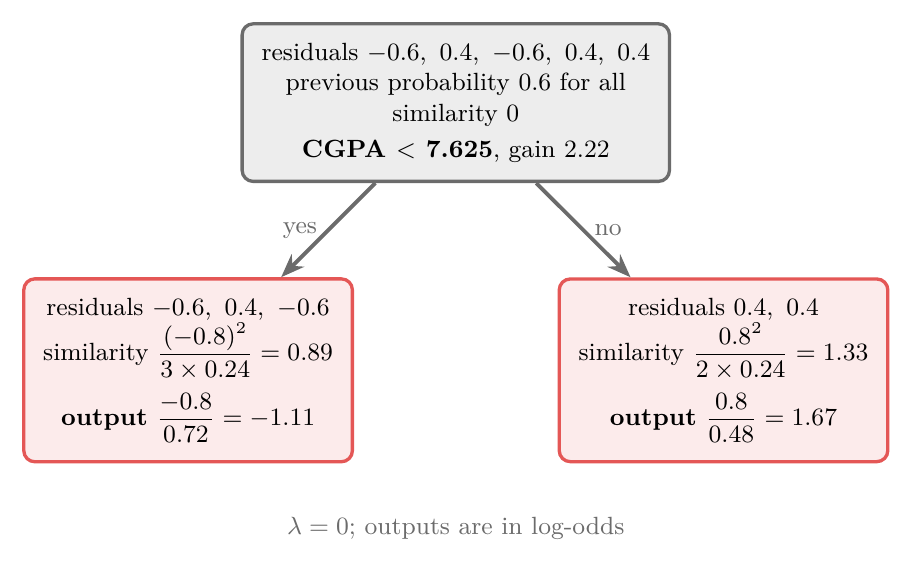
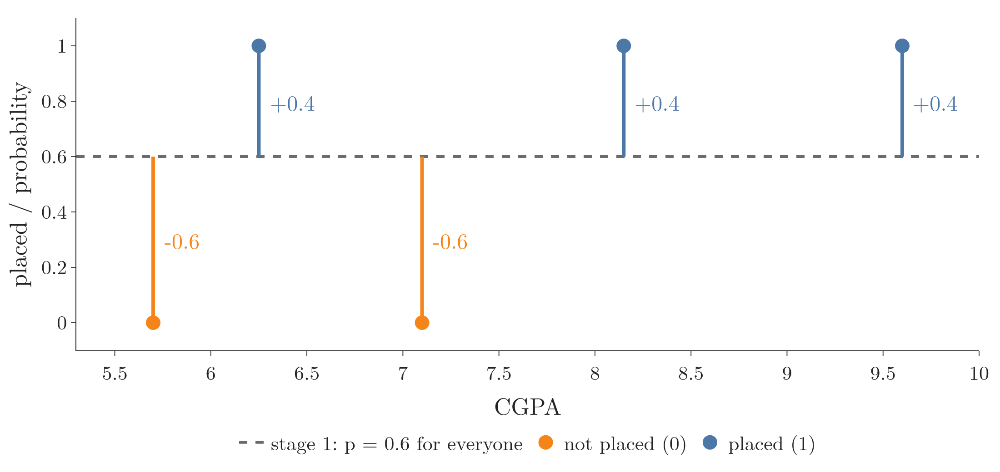
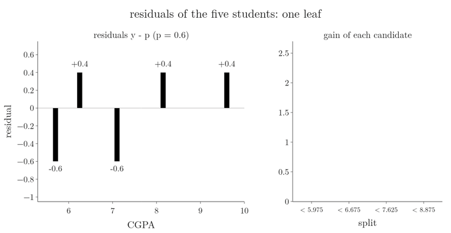
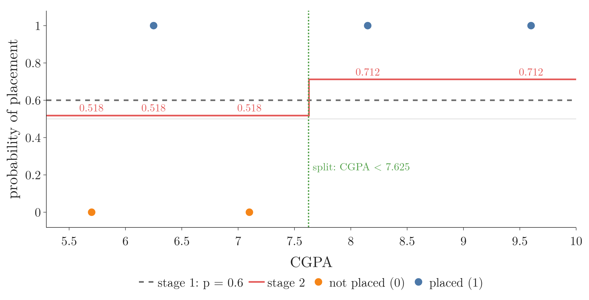
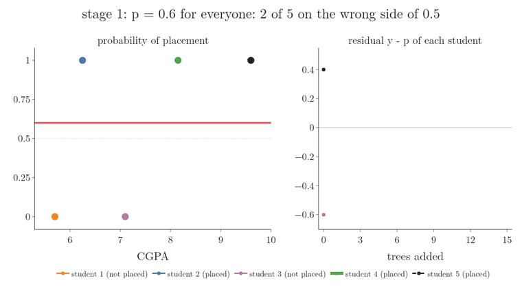
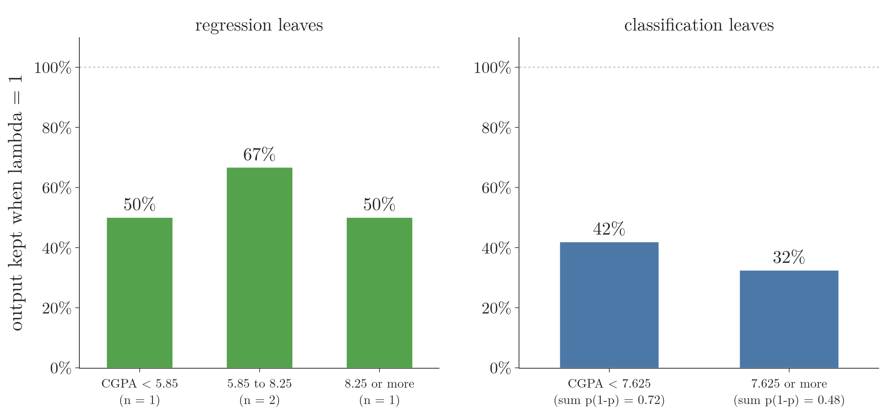

<!-- where-this-fits: generated by course_map/build_map.py; edit concepts.yaml, not this block -->
> **Where this fits:** Pipeline map step 8 (Model). See the [Course map](../01-course-map/note.md).
>
> 
>
> - **Builds on:** Binning and binarization ([Note 32](../32-binning-binarization/note.md)); Regularisation ([Note 63](../63-ridge-regression-intuition/note.md)); Gradient boosting ([Note 122](../122-gradient-boosting-classification/note.md)); Missing values ([Note 123](../123-xgboost-intro/note.md)).
<!-- /where-this-fits -->

## 1. Overview

> **Key point:** XGBoost classifies like gradient boosting for classification: start from the log-odds, turn it into a probability, fit trees to the residuals $y - p$, and add their outputs in log-odds. Its trees use the similarity score and gain from regression, with $\sum p(1-p)$ in place of the number of residuals.

{height=36%}

This Note joins two earlier ones. The flow (log-odds, probabilities, residuals) comes from the [gradient boosting classification Note](../122-gradient-boosting-classification/note.md). The tree (similarity score, gain, output value) comes from the [XGBoost regression Note](../124-xgboost-regression/note.md).

The one real change is the denominator of the formulas, shown in Figure 1. Where the formulas come from is derived in the [XGBoost maths Note](../126-xgboost-maths/note.md) (Chen and Guestrin 2016, §2.2).

## 2. The data: CGPA and placement

> **Key point:** Five students, one feature (CGPA) and a class target: placed (1) or not (0). Three were placed, two were not.

| Student | CGPA | Placed |
|---|---|---|
| 1 | 5.70 | 0 |
| 2 | 6.25 | 1 |
| 3 | 7.10 | 0 |
| 4 | 8.15 | 1 |
| 5 | 9.60 | 1 |

Each student is one **observation** (G-1374; one record, a row of the table). CGPA is the only **feature** (G-772; an input variable, one column of the table), and "Placed" is the **target** (G-1949; the output we predict).

Given a new student's CGPA, the model must say whether they will be placed. The table is already sorted by CGPA, which we will need for the splits.

## 3. Stage 1: the log-odds and its probability

> **Key point:** The base model predicts the log-odds of placement, $\ln(3/2) = 0.405$, for everyone. As a probability that is 0.6.

As in the [gradient boosting classification Note](../122-gradient-boosting-classification/note.md), sections 4 and 5, stage 1 predicts the **log-odds** (G-1116) of class 1, $\ln(p/(1-p))$, and the sigmoid turns it back into a probability. Here 3 of the 5 students were placed, so $p = 3/5$:

$$f_0 = \ln\frac{3/5}{2/5} = \ln 1.5 = 0.405, \qquad p = \frac{e^{0.405}}{1 + e^{0.405}} = \frac{1.5}{2.5} = 0.6$$

So stage 1 says "probability 0.6" for every student, whatever the CGPA. With a threshold of 0.5 it predicts "placed" for all five, which is wrong for students 1 and 3.

## 4. Residuals in probability

> **Key point:** Residual = actual class $-$ predicted probability: $-0.6$ for the two students not placed, $+0.4$ for the three placed.

| Student | CGPA | Placed | Probability 1 | Residual 1 |
|---|---|---|---|---|
| 1 | 5.70 | 0 | 0.6 | $-0.6$ |
| 2 | 6.25 | 1 | 0.6 | 0.4 |
| 3 | 7.10 | 0 | 0.6 | $-0.6$ |
| 4 | 8.15 | 1 | 0.6 | 0.4 |
| 5 | 9.60 | 1 | 0.6 | 0.4 |

A **residual** (G-1685) is the actual class minus the predicted probability. Residuals are always computed from probabilities, never from log-odds. Figure 2 draws them: each residual is the gap from the dashed line at 0.6 to the student's class, 0 or 1.

{height=32%}

The next model, an XGBoost tree, takes CGPA as its feature and these residuals as its target.

## 5. The similarity score for classification

> **Key point:** Similarity = (sum of residuals)$^2$ divided by ($\sum p(1-p) + \lambda$), where $p$ is each observation's previous probability. The root scores 0.

The **similarity score** (G-1804) keeps the numerator of regression. The denominator replaces "number of residuals" with the sum of $p(1-p)$ over the observations in the leaf, the same quantity as in the gradient boosting leaf formula.

1. **In words:** add the residuals in the leaf and square the sum; divide by the sum of $p(1-p)$ over those observations plus $\lambda$.
2. **Formula:**
   $$\text{similarity} = \frac{\left(\sum r_i\right)^2}{\sum p_i(1-p_i) + \lambda}$$
   Here $p_i$ is observation $i$'s predicted probability from the previous stage. As in regression, we take $\lambda = 0$.
3. **Example:** the root holds all five residuals; every $p_i = 0.6$, so $p_i(1-p_i) = 0.6 \times 0.4 = 0.24$:
   $$\text{similarity}_{\text{root}} = \frac{(-0.6 + 0.4 - 0.6 + 0.4 + 0.4)^2}{5 \times 0.24} = \frac{0^2}{1.2} = 0$$

As with the mean in regression, the residuals from the base log-odds add up to exactly 0, so the root scores 0.

Figure 3 shows what each observation adds to the denominator. Watch the red curve stay far below the green line: in regression every observation counts 1, in classification it counts $p(1-p)$, never more than 0.25.

{height=34%}

## 6. Choosing the split

> **Key point:** Four midpoints, 5.975, 6.675, 7.625 and 8.875; the largest gain, 2.22, belongs to CGPA < 7.625.

The candidate thresholds are the midpoints of neighbouring CGPA values: $(5.70 + 6.25)/2 = 5.975$, then 6.675, 7.625 and 8.875. For each, the **gain** (G-820) is the children's similarity minus the parent's, as in the [XGBoost regression Note](../124-xgboost-regression/note.md), section 6.

Worked for CGPA < 5.975: student 1 alone on the left, the other four on the right.

$$S_{\text{left}} = \frac{(-0.6)^2}{0.24} = \frac{0.36}{0.24} = 1.5, \qquad S_{\text{right}} = \frac{(0.4 - 0.6 + 0.4 + 0.4)^2}{4 \times 0.24} = \frac{0.36}{0.96} = 0.375$$

$$\text{gain} = 1.5 + 0.375 - 0 = 1.875$$

| Split | Left residuals | Right residuals | $S_{\text{left}}$ | $S_{\text{right}}$ | Gain |
|---|---|---|---|---|---|
| CGPA < 5.975 | $-0.6$ | 0.4, $-0.6$, 0.4, 0.4 | 1.50 | 0.38 | 1.88 |
| CGPA < 6.675 | $-0.6$, 0.4 | $-0.6$, 0.4, 0.4 | 0.08 | 0.06 | 0.14 |
| CGPA < 7.625 | $-0.6$, 0.4, $-0.6$ | 0.4, 0.4 | 0.89 | 1.33 | **2.22** |
| CGPA < 8.875 | $-0.6$, 0.4, $-0.6$, 0.4 | 0.4 | 0.17 | 0.67 | 0.83 |

CGPA < 7.625 wins. Its right leaf holds only placed students; its left leaf holds both students who were not placed. We stop at depth 1: one split is enough to show the steps on five observations.

Figure 4 runs the same search as an animation, in the style of the split search in the [XGBoost regression Note](../124-xgboost-regression/note.md). Watch the threshold visit the four midpoints, the left (blue) and right (orange) leaves change, and a gain bar appear for each; the tallest bar, 2.22, wins, and the two leaves get their outputs of section 7.

{height=75%}

## 7. Output values in log-odds

> **Key point:** A leaf's output is (sum of residuals) divided by ($\sum p(1-p) + \lambda$): $-1.11$ for the left leaf and $1.67$ for the right. These outputs are log-odds, so they can be added to the base log-odds.

1. **In words:** add the residuals in the leaf and divide by the sum of $p(1-p)$ over its observations plus $\lambda$.
2. **Formula:**
   $$\text{output} = \frac{\sum r_i}{\sum p_i(1-p_i) + \lambda}$$
3. **Example:** the left leaf (students 1, 2, 3) has the **output value** (G-1425)
   $$\text{output}_{\text{left}} = \frac{-0.6 + 0.4 - 0.6}{3 \times 0.24} = \frac{-0.8}{0.72} = -1.11$$
   The right leaf (students 4, 5): $0.8 / 0.48 = 1.67$.

The output formula is the leaf formula of the [gradient boosting classification Note](../122-gradient-boosting-classification/note.md), now with $\lambda$ added. Figure 1 shows the finished tree.

## 8. Stage 2: add in log-odds, read in probability

> **Key point:** New log-odds = 0.405 + 0.3 $\times$ leaf output. The sigmoid turns it into a probability; the residuals shrink.

1. **In words:** add eta times the leaf output to the base log-odds, then apply the sigmoid.
2. **Formula:**
   $$z^{(2)} = f_0 + \eta \cdot \text{tree}_1(x), \qquad p^{(2)} = \frac{1}{1 + e^{-z^{(2)}}}$$
3. **Example:** student 1 (CGPA 5.70 < 7.625, left leaf), with $\eta = 0.3$:
   $$z^{(2)} = 0.405 + 0.3 \times (-1.111) = 0.405 - 0.333 = 0.072, \qquad p^{(2)} = \frac{1}{1 + e^{-0.072}} = 0.518$$
   For students 4 and 5 (right leaf): $z^{(2)} = 0.405 + 0.3 \times 1.667 = 0.905$ and $p^{(2)} = 0.712$.

| Student | Placed | Log-odds 2 | Probability 2 | Residual 2 | Residual 1 |
|---|---|---|---|---|---|
| 1 | 0 | 0.072 | 0.518 | $-0.518$ | $-0.6$ |
| 2 | 1 | 0.072 | 0.518 | 0.482 | 0.4 |
| 3 | 0 | 0.072 | 0.518 | $-0.518$ | $-0.6$ |
| 4 | 1 | 0.905 | 0.712 | 0.288 | 0.4 |
| 5 | 1 | 0.905 | 0.712 | 0.288 | 0.4 |

{height=38%}

Four of the five residuals move towards 0 (Figure 5). Student 2 is placed but sits on the left with the two who were not, so its residual grows a little, from 0.4 to 0.482; later trees must fix that.

## 9. The next trees

> **Key point:** Repeat with the new probabilities: residual 2 and $p^{(2)}(1-p^{(2)})$ go into the next tree's similarity scores and outputs.

Stage 3 grows a tree on CGPA and residual 2. The observations now have different probabilities, so the denominators change from one observation to the next: $0.518 \times 0.482 = 0.250$ on the left, $0.712 \times 0.288 = 0.205$ on the right. On our data the second tree prefers CGPA < 5.975 (gain 1.39), which isolates student 1.

The model after $M$ trees is

$$z = f_0 + \eta \cdot \text{tree}_1(x) + \dots + \eta \cdot \text{tree}_M(x), \qquad p = \frac{1}{1 + e^{-z}}$$

and a new student is predicted "placed" when $p$ is above the threshold, usually 0.5.

Figure 6 repeats the loop for 15 trees. Watch the red probability curve: after one tree students 1 and 3 still sit on the wrong side of 0.5; later trees split again at 5.975 and elsewhere, and after 15 trees all five are on the right side. Students 2 and 3, each placed between two students of the other class, keep the largest residuals.

{height=75%}

## 10. What changed from regression

> **Key point:** Only the base model and the denominators. Everything else, splits, gains, eta, the loop, is the same.

| | Regression | Classification |
|---|---|---|
| Base model | mean of the output | log-odds of class 1 |
| Residual | $y - \hat{y}$ | $y - p$ |
| Similarity | $(\sum r)^2 / (n + \lambda)$ | $(\sum r)^2 / (\sum p(1-p) + \lambda)$ |
| Output value | $\sum r / (n + \lambda)$ | $\sum r / (\sum p(1-p) + \lambda)$ |
| Trees add up in | the output's units (LPA) | log-odds |

> **Extra:** With $\lambda = 1$ (XGBoost's default) the outputs shrink much more than in regression, because the denominators $0.72$ and $0.48$ are small next to 1: the leaves give $-0.8/1.72 = -0.47$ and $0.8/1.48 = 0.54$ instead of $-1.11$ and 1.67.

{height=34%}

Figure 7 compares the two. Watch the blue bars: because $\sum p(1-p)$ is small, the same $\lambda$ removes most of each classification output.

> **Extra:** XGBoost also requires every leaf to have $\sum p(1-p)$ of at least `min_child_weight` (G-117), which is 1 by default. Here each observation contributes 0.24 and all five together only 1.2, so every possible split leaves one child below 1 (the best case is 0.48). XGBoost with default settings therefore does not split this toy data at all: the Notebook's tree is a single leaf, and every probability stays 0.6. Since $p(1-p)$ is at most $0.25$ (at $p = 0.5$), every leaf needs at least 4 observations to reach 1, and more once the predictions move towards 0 or 1. To reproduce this Note, set `min_child_weight=0` (XGBoost docs, Parameters).

## 11. The same in code

> **Key point:** The Notebook grows the tree with NumPy and checks it against the XGBoost library: same split, same gain, same stage-2 log-odds. scikit-learn's gradient boosting classifier agrees on this first tree.

> **Extra:** `GradientBoostingClassifier(loss="log_loss", n_estimators=1, learning_rate=0.3, max_depth=1)` starts from the same log-odds, 0.405, and uses the same leaf outputs with $\lambda = 0$. Its tree picks splits by the squared error of the residuals rather than by XGBoost's gain. On this first tree every observation has the same $p(1-p)$, so both pick CGPA < 7.625 and give exactly the log-odds 0.072 and 0.905. From the second tree on the $p(1-p)$ values differ, so the two can choose different splits: XGBoost divides each leaf's $(\sum r)^2$ by $\sum p(1-p)$, the squared-error split by the number of observations. On our second tree they still agree (both split at CGPA < 5.975).

> **Python:** The first tree in XGBoost, with every setting matched to this Note.
>
> ```python
> from xgboost import XGBClassifier
>
> model = XGBClassifier(
>     n_estimators=1,
>     max_depth=1,
>     learning_rate=0.3,      # eta
>     reg_lambda=0,           # lambda
>     gamma=0,
>     min_child_weight=0,     # see the Extra above
>     base_score=0.6,         # starting probability
>     objective="binary:logistic",
>     tree_method="exact",
> )
> model.fit(X, y)             # X: CGPA, y: 0 or 1
> model.predict(X, output_margin=True)   # log-odds
> model.predict_proba(X)
> model.get_booster().get_dump(with_stats=True)
> ```
>
> For classification `base_score` (G-61) is given as a probability; XGBoost converts it to the log-odds 0.405 itself. The log-odds come out as 0.072 and 0.905. The dump shows the split `f0<7.625` with `gain=2.22` and `cover=1.2`, the **cover** (G-498): the sum of $p(1-p)$ over the five observations. The leaves read $-0.333$ and 0.5: the outputs $-1.11$ and 1.67 already multiplied by eta.

With `n_estimators=2` the library's second tree splits at CGPA < 5.975 with gain 1.39, as in section 9.

## 12. Summary

| Step | What we compute | Our numbers |
|---|---|---|
| Base model | log-odds of class 1 | $\ln 1.5 = 0.405$, $p = 0.6$ |
| Residual | $y - p$ | $-0.6$ or 0.4 |
| Similarity | $(\sum r)^2 / (\sum p(1-p) + \lambda)$ | root 0 |
| Best split | largest gain | CGPA < 7.625, gain 2.22 |
| Leaf outputs | $\sum r / (\sum p(1-p) + \lambda)$ | $-1.11$ and 1.67 |
| Stage 2 | $z = 0.405 + 0.3 \times$ output, then sigmoid | $p = 0.518$ or 0.712 |

- XGBoost classification is gradient boosting classification with XGBoost's trees.
- Trees are fitted to probability residuals, but their outputs are log-odds.
- The similarity score and output use $\sum p(1-p) + \lambda$ in the denominator.
- The sigmoid turns the summed log-odds into the final probability.

## 13. Sources

**Built from**

- CampusX, "XGBoost For Classification | How XGBoost works on Classification Problems | CampusX", YouTube, https://www.youtube.com/watch?v=mELtxVUNNrw

**Other references**

- Chen, T. and Guestrin, C. (2016). *XGBoost: A Scalable Tree Boosting System*. KDD 2016 (arXiv:1603.02754).
- XGBoost documentation, *XGBoost Parameters* (`min_child_weight`, `base_score`), xgboost.readthedocs.io.

## 14. Key terms

| Term | Meaning |
|---|---|
| Similarity score (classification) | (sum of residuals)$^2$ / ($\sum p(1-p) + \lambda$), with $p$ the previous probabilities |
| Output value (classification) | sum of residuals / ($\sum p(1-p) + \lambda$), in log-odds |
| `min_child_weight` | Smallest allowed sum of $p(1-p)$ (in regression: number of observations) in a leaf; default 1 |
| `base_score` | XGBoost's starting prediction; a probability for classification |
| Cover | XGBoost's name for the sum of $p(1-p)$ (in regression: the number of observations) in a node |
