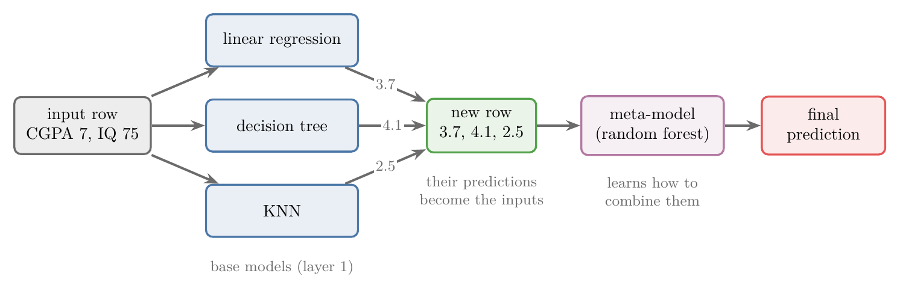
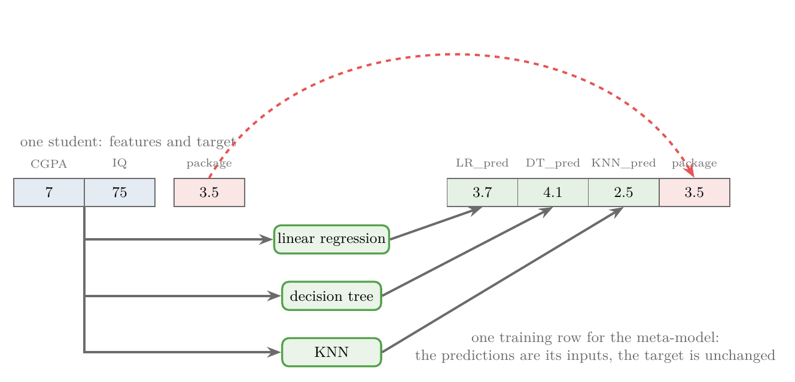
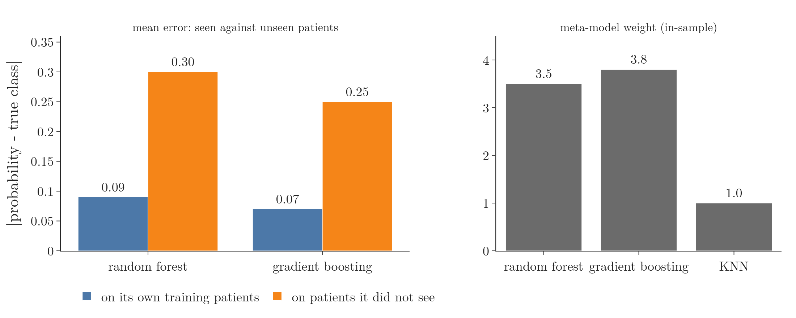
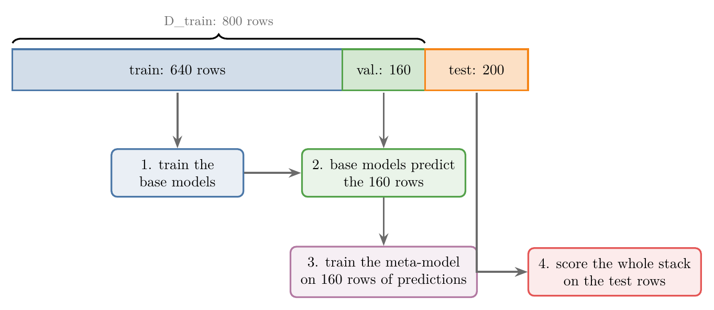
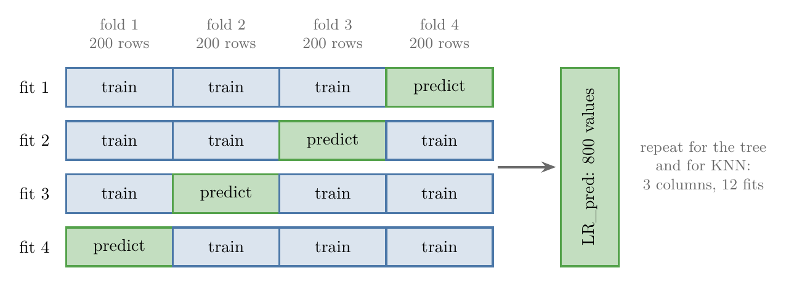
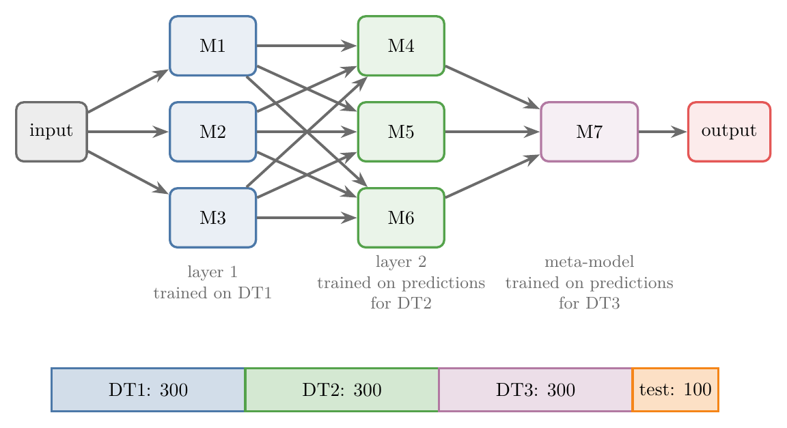
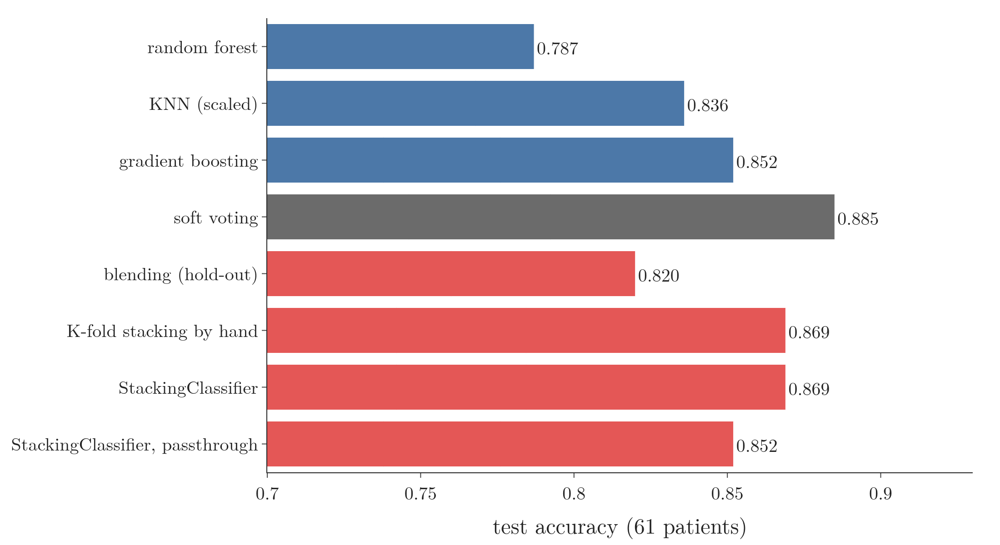
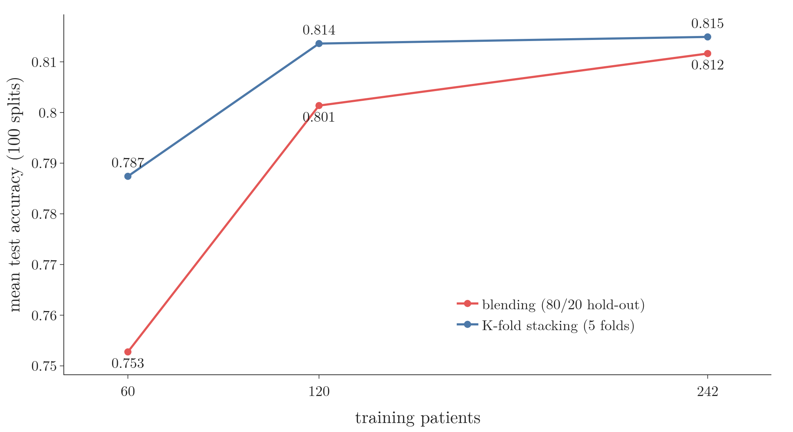

<!-- where-this-fits: generated by course_map/build_map.py; edit concepts.yaml, not this block -->
> **Where this fits:** Pipeline map steps 8 (Model), 9 (Evaluate). See the [Course map](../01-course-map/note.md).
>
> 
>
> - **Builds on:** Ensemble learning ([Note 101](../101-ensemble-learning/note.md)).
> - **Leads to:** Random under- and oversampling ([Note 133](../133-imbalanced-data/note.md)); Optuna ([Note 134](../134-optuna/note.md)).
> - **Compare with:** Train-test split ([Note 13](../13-toy-project/note.md)); Voting ensembles ([Note 104](../104-voting-regressor/note.md)); OOB score ([Note 113](../113-oob-score/note.md)); Boosting ([Note 119](../119-bagging-vs-boosting/note.md)).
<!-- /where-this-fits -->

## 1. Overview

> **Key point:** **Stacking** (G-1866) trains several different models, turns their predictions into the input columns of a new dataset, and trains one more model, the meta-model, on it. To keep the meta-model honest, it must learn from predictions on observations (records) the base models never saw: a hold-out set (blending) or K-fold out-of-fold predictions (stacking).

{height=30%}

Stacking was previewed in the [ensemble learning Note](../101-ensemble-learning/note.md), section 4.2, as voting plus one more model on top. Figure 1 shows the full picture. This Note covers:

- how the new dataset for the meta-model is built;
- why predicting on the training observations ruins it, and the two fixes, blending and K-fold stacking;
- stacking in several layers;
- `StackingClassifier` in scikit-learn, on real heart-disease data.

## 2. From voting to stacking

> **Key point:** Voting combines the base models with a fixed rule (majority or mean); stacking replaces the rule with a model that learns how to combine them.

In a **voting ensemble** (G-2096; [voting ensemble Note](../102-voting-ensemble/note.md), [voting regressor Note](../104-voting-regressor/note.md)) we train different algorithms on the same data and combine their outputs by a fixed rule. For a regression problem, three models predicting 3.5, 4.1 and 2.7 lakh rupees for one student give their mean, 3.43.

Stacking keeps the first half. Instead of averaging, it treats the three outputs as **inputs** for one more machine learning model, the **meta-model** (G-1213; defined in the ensemble learning Note). The meta-model learns from data how much to believe each base model, and in what combination.

### 2.1 One training row for the meta-model

> **Key point:** A student with CGPA 7, IQ 75 and package 3.5 becomes the row (3.7, 4.1, 2.5) with the same target 3.5.

Take one student from the training data: CGPA 7, IQ 75, package 3.5 lakh per annum. The three trained base models predict 3.7, 4.1 and 2.5 for this student.

Each student is one **observation** (G-1374; one record, a row of the data table). CGPA and IQ are **features** (G-772; input variables, the columns), and the package is the **target** (G-1949; the output we predict).

For the meta-model this student becomes a new row (Figure 2): three input columns holding 3.7, 4.1 and 2.5, and the same target, 3.5. Every student gives one such row. The CGPA and IQ themselves are not passed on (section 9 shows the option that does pass them).

{width=100%}

## 3. The basic recipe in three steps

> **Key point:** Train the base models; let them predict every training observation; train the meta-model on those predictions. To predict, run the base models first and the meta-model on their outputs.

Take a dataset of 1,000 students with CGPA, IQ and package, and three base models: linear regression, a decision tree and KNN. The meta-model is a random forest regressor.

1. **Train the base models.** Fit linear regression, the decision tree and KNN on the data, one by one.
2. **Build the new dataset.** Each base model predicts all 1,000 students. The predictions become three columns, `LR_pred`, `DT_pred` and `KNN_pred`; the package column stays the target. The new dataset has 1,000 rows and 4 columns.
3. **Train the meta-model** on the new dataset.

Prediction for a new student (say CGPA 7.7, IQ 100) follows the same path as Figure 1. The three base models predict first; their three numbers go to the meta-model, whose output is the answer.

Classification works the same way. The base models output classes (1 or 0) or probabilities, and the meta-model is a classifier.

## 4. Stacking compared with bagging and boosting

> **Key point:** Stacking mixes different algorithms, and it combines them with a trained model instead of a vote, a mean or a weighted sum.

| | Bagging and boosting | Stacking |
|---|---|---|
| Base models | one algorithm, many copies | different algorithms |
| Combining | majority vote or mean (bagging); weighted sum (boosting) | a meta-model trained on the base models' outputs |

Bagging is covered in the [bagging intuition Note](../105-bagging-intuition/note.md), boosting in the [bagging versus boosting Note](../119-bagging-vs-boosting/note.md).

## 5. The overfitting problem

> **Key point:** In step 2 the base models predict the very observations they were trained on. Those predictions look far better than the base models really are, so the meta-model learns to trust the wrong models.

In the basic recipe, the base models are trained on the 1,000 students and then asked to predict the same 1,000 students. A model that overfits, such as a deep decision tree, reproduces its training targets almost exactly. Its column in the new dataset is then nearly a copy of the target.

The meta-model sees that column and decides the tree is almost always right. On new students the tree is much worse, but the meta-model still trusts it. The overfitting of one base model is passed up to the meta-model, and the whole stack fails.

The Notebook (section 7) measures this on the heart data. On their own training observations, the random forest and gradient boosting are off by only 0.09 and 0.07 on average (the gap between predicted probability and true class); on observations they did not see, by 0.30 and 0.25. The meta-model trained on the in-sample predictions gives those two models weights of 3.5 and 3.8, and KNN only 1.0 (Figure 3).

{width=100%}

There are two ways out. Both make sure the meta-model only learns from predictions on observations the base models did not train on:

- **blending** (G-314): a **hold-out set** (G-901);
- **stacking** in the strict sense: K-fold cross-validation.

Many people call both of them stacking.

## 6. Blending: a hold-out set

> **Key point:** Split the training data again. The base models learn on one part; the meta-model learns from their predictions on the other part.

{height=34%}

**Blending** builds the meta-model's dataset from a **hold-out set**: observations set aside before the base models are trained. With 1,000 students and the same architecture as section 3 (Figure 4):

1. **Split twice.** First 80/20 into D_train (800 observations) and D_test (200 observations). Then D_train again 80/20, into a smaller training set (640 observations) and a **validation set** (G-2067; 160 observations). All splits are random.
2. **Train the base models** on the 640 observations.
3. **Predict the validation set.** Each base model predicts the 160 validation observations. The three columns of predictions plus the true package form a new dataset of 160 rows and 4 columns.
4. **Train the meta-model** on these 160 observations.
5. **Evaluate.** Send the 200 test observations through the whole stack (base models, then meta-model) and compute the **R² score** (G-1717; [regression metrics Note](../52-regression-metrics/note.md)).

The base models never saw the validation observations, so their predictions there are honest. The cost: the base models learn from only 640 observations, and the meta-model from only 160.

## 7. Stacking: K-fold out-of-fold predictions

> **Key point:** Cut D_train into K folds. Each fold is predicted by a copy of the base model trained on the other K-1 folds, so every training observation gets an honest prediction. Then the base models are retrained on all of D_train.

{height=34%}

Stacking in the strict sense uses the idea of K-fold cross-validation ([pipelines Note](../29-pipelines/note.md), section 8). We keep the 800 observations of D_train and the 200 test observations of section 6, and take K = 4 (5 or 10 are more common), so each fold has 200 rows.

1. **Out-of-fold predictions for the first base model** (Figure 5). Train linear regression on folds 1, 2 and 3 (600 observations) and predict fold 4. Train a new linear regression on folds 1, 2 and 4 and predict fold 3. Do the same for fold 2 and fold 1. After four fits every one of the 800 observations has a prediction from a model that did not see it: the column `LR_pred`. These are called **out-of-fold predictions** (G-1415).
2. **Repeat for the other base models.** The same four fits for the decision tree give `DT_pred`, and for KNN give `KNN_pred`. The three base models need 12 fits in all, and each base algorithm was trained 4 times.
3. **Train the meta-model** on the new dataset: 800 rows, the three prediction columns plus the true package.
4. **Retrain the base models on all of D_train.** Which of the 4 linear regressions do we keep? None of them. We train linear regression, the decision tree and KNN once more on all 800 observations, and these are the base models used for prediction.
5. **Evaluate** the stack on the 200 test observations, as in blending.

Note the order: the meta-model is trained first (step 3), the final base models afterwards (step 4).

Compared with blending, nothing is thrown away: every observation of D_train trains the final base models, and every observation also gives the meta-model one example. The price is K times more training. scikit-learn's `StackingClassifier` implements this approach (scikit-learn docs), and it is the one described in the textbooks: the meta-model learns from cross-validated predictions (ESL §8.8; Wolpert 1992).

The intuition: blending is like a student who keeps 20 of 100 practice questions locked away for a mock test, while K-fold stacking lets every question serve both for practice and for a mock test, just at different times. When data is scarce, K-fold cross-validation makes better use of it than one hold-out set (ESL §7.10.1). Section 9.3 shows the gain on the heart data.

> **Extra:** The meta-model learns from predictions of models trained on $(K-1)/K$ of the data, but at prediction time it receives predictions of models trained on all of it. A larger K trains each copy on more observations, so the two kinds of prediction are closer. On 3,000 synthetic observations the Notebook (section 9) finds the difference small: the random forest's out-of-fold log loss is 0.238 with K = 2 and 0.215 with K = 10.

## 8. Stacking in several layers

> **Key point:** The meta-model's inputs can themselves come from a second layer of models. With blending, every extra layer needs its own hold-out set.

{height=40%}

Nothing forces a single layer of base models. In Figure 6, three models M1, M2, M3 form layer 1, three more models M4, M5, M6 form layer 2, and M7 is the meta-model. Every model of layer 1 feeds every model of layer 2: the layers are **fully connected**. This is **multi-layer stacking** (G-1271). Any algorithm can sit anywhere: linear regression, KNN, a decision tree, gradient boosting, XGBoost, a random forest, even a neural network.

With blending, 1,000 students are split into 900 for training and 100 for testing, and the 900 into three sets of 300 (DT1, DT2, DT3):

1. **Layer 1.** Train M1, M2 and M3 on DT1. They predict DT2, giving a dataset of 300 rows with 3 prediction columns and the package.
2. **Layer 2.** Train M4, M5 and M6 on that dataset. To build their predictions on new observations, DT3 first goes through layer 1, then layer 2, giving another 300 rows with 3 columns and the package.
3. **Meta-model.** Train M7 on that last dataset.

Each layer needs fresh observations that the layer below has not seen, so every extra layer costs one more hold-out set. With K-fold stacking, scikit-learn builds extra layers by passing another `StackingClassifier` or `StackingRegressor` as the `final_estimator` (scikit-learn User Guide, Stacked generalization).

Combining different models is common among winning solutions of Kaggle competitions: of the 2015 winning solutions that used XGBoost, most combined it with neural nets in ensembles (Chen and Guestrin 2016, §1).

## 9. StackingClassifier in scikit-learn

> **Key point:** `StackingClassifier(estimators, final_estimator, cv)` does K-fold stacking for us: out-of-fold predictions, the meta-model, and base models refitted on all the training data.

scikit-learn has `StackingClassifier` and `StackingRegressor` (since version 0.22) in `sklearn.ensemble`. Their main parameters:

| Parameter | What it sets |
|---|---|
| `estimators` | the base models, as a list of (name, model) pairs |
| `final_estimator` | the meta-model (default: logistic regression for the classifier, ridge regression with built-in cross-validation for the regressor; scikit-learn docs) |
| `cv` | the number of folds K for the out-of-fold predictions (default 5) |
| `stack_method` | classifier only: which output of each base model is passed on, `"auto"`, `"predict_proba"`, `"decision_function"` or `"predict"` |
| `passthrough` (G-1461) | `False` (default): the meta-model sees only the predictions; `True`: it also sees the original features |
| `n_jobs` | how many processor cores fit the base models in parallel |

With `stack_method="auto"`, each base model passes its probabilities if it has `predict_proba`, otherwise its `decision_function`, otherwise its class predictions. For two classes only the probability of class 1 is kept, so each base model gives one column.

With `passthrough=True`, the meta-model's input row would hold the three predictions plus the CGPA and the IQ of section 2.1.

### 9.1 The heart-disease data

> **Key point:** 303 patients, 13 inputs, a target of 1 (heart disease) or 0 (none); 242 patients train the models and 61 test them.

The data has 303 patients; each patient is one observation. Each patient has 13 medical features (age, sex, chest-pain type, resting blood pressure, cholesterol and so on). The target is 1 for 165 patients with heart disease and 0 for 138 without. We split it 80/20 with `random_state=8`: 242 patients for training and 61 for testing.

### 9.2 The stack

> **Key point:** Random forest, KNN and gradient boosting as base models, logistic regression as the meta-model, 10 folds: 0.869 test accuracy, above every base model alone.

> **Python:** A three-model stack with a logistic regression on top.
>
> ```python
> from sklearn.ensemble import (StackingClassifier,
>     RandomForestClassifier, GradientBoostingClassifier)
> from sklearn.neighbors import KNeighborsClassifier
> from sklearn.linear_model import LogisticRegression
>
> estimators = [
>     ("rf", RandomForestClassifier(n_estimators=10,
>                                   random_state=42)),
>     ("knn", KNeighborsClassifier(n_neighbors=10)),
>     ("gbdt", GradientBoostingClassifier(random_state=42)),
> ]
> clf = StackingClassifier(
>     estimators=estimators,
>     final_estimator=LogisticRegression(max_iter=1000),
>     cv=10,
> )
> clf.fit(X_train, y_train)
> clf.score(X_test, y_test)          # 0.869
> ```
>
> The base models are listed as (name, model) pairs; `fit` runs the 10-fold out-of-fold predictions, trains the logistic regression on them and refits the three base models on all 242 patients. `score` returns the accuracy.

Alone, the three base models reach 0.787 (random forest), 0.639 (KNN) and 0.852 (gradient boosting) on the 61 test patients. The stack reaches **0.869**.

The meta-model's weights show whom it trusts: 2.31 for the random forest's probability, 1.75 for gradient boosting and 0.59 for KNN. The meta-model has learned that the unscaled KNN is the weakest of the three.

> **Extra:** KNN measures distances, and here cholesterol (around 250) dwarfs features such as `sex` (0 or 1). Putting KNN in a pipeline with `StandardScaler` ([standardization Note](../24-standardization/note.md)) lifts it from 0.639 to 0.836 alone. The Notebook uses the scaled KNN from section 4 onwards.

### 9.3 Comparing the options

> **Key point:** On one split, combining the three models matches or beats the best single model (0.852) in four of five ways. One split cannot rank the combining methods, because one test patient is worth 1.6 points of accuracy.

{height=40%}

Figure 7 compares, with the scaled KNN:

- **soft voting** (averaging the three probabilities, [voting classifier Note](../103-voting-classifier/note.md)): 0.885;
- **blending by hand** (193 patients for the base models, 49 for the meta-model): 0.820;
- **K-fold stacking by hand** (4 folds, `cross_val_predict`): 0.869;
- **StackingClassifier** (10 folds): 0.869;
- **StackingClassifier with `passthrough=True`** (16 inputs to the meta-model): 0.852.

On a test set this small, one split cannot rank the methods: soft voting beating stacking by one patient says little. The blending versus stacking question needs many splits, which section 9.4 runs.

> **Python:** Out-of-fold predictions by hand.
>
> ```python
> from sklearn.model_selection import KFold, cross_val_predict
>
> kf = KFold(n_splits=4, shuffle=True, random_state=42)
> oof = np.column_stack([
>     cross_val_predict(m, X_train, y_train, cv=kf,
>                       method="predict_proba")[:, 1]
>     for _, m in estimators
> ])
> meta = LogisticRegression().fit(oof, y_train)
> ```
>
> `cross_val_predict` returns, for every training observation, the prediction of the copy of the model that did not train on that observation's fold: exactly the column of Figure 5. `[:, 1]` keeps the probability of class 1.

### 9.4 Stacking beats blending when data is limited

> **Key point:** Averaged over 100 random splits, K-fold stacking beats blending on the heart data, and the gain is largest when we have the fewest patients: 3.5 points of accuracy with 60 training patients.

Blending gives up data twice: its base models train on only 80% of the training observations, and its meta-model learns from only the other 20%. K-fold stacking uses every observation for both. The less data we have, the more those lost observations hurt.

To see it, we change only the training size: 60, 120 or 242 patients for training, the rest for testing. Both methods use the same three base models (with scaled KNN) and the same logistic regression meta-model; stacking uses 5 folds. We repeat each size on 100 random splits and average the test accuracy (Notebook, section 8).

{height=40%}

Figure 8 shows the result. With 60 training patients, stacking reaches 0.787 and blending 0.753, a gain of 3.5 points. With 120 patients the gain is 1.2 points (0.814 against 0.801). With all 242 patients both methods are close (0.815 against 0.812): with more data, the 20% that blending holds out matters less. The result matches the textbook advice: use cross-validation instead of a single hold-out set when data is scarce (ESL §7.10.1).

> **Extra:** The gain is an average, not a guarantee on every split. With 60 training patients, stacking scores higher on 74 of the 100 splits, ties on 5 and loses on 21; the standard error of the mean gain is 0.6 points. With 242 patients the mean gain, 0.3 points, is no larger than its standard error (0.3 points), so on this data the two methods are level once the training set is that big.

## 10. Summary

| | Basic recipe | Blending | Stacking (K-fold) |
|---|---|---|---|
| Meta-model learns from | predictions on the training observations | predictions on a hold-out validation set | out-of-fold predictions on all training observations |
| Honest inputs for the meta-model | no: overfit models look perfect | yes | yes |
| Observations used by the base models | all | only the training part | all (final refit) |
| Training cost | one fit per base model | one fit per base model | K + 1 fits per base model |
| Heart data, test accuracy (one split) | 0.852 | 0.820 | 0.869 |
| Heart data, 60 training patients (mean of 100 splits) | | 0.753 | 0.787 |

- Stacking feeds the base models' predictions to a meta-model, which learns how to combine them.
- Unlike bagging and boosting, the base models are different algorithms, and the combiner is trained, not a fixed rule.
- Predicting the training observations passes the base models' overfitting to the meta-model; a hold-out set (blending) or K-fold out-of-fold predictions (stacking) fix this.
- In K-fold stacking the meta-model is trained first, then the base models are refitted on all of D_train.
- K-fold stacking uses the data better than blending; on the heart data it beats blending by 3.5 points with 60 training patients, and the gain shrinks as data grows.
- Stacks can have several layers; with blending, each layer needs its own hold-out set.
- `StackingClassifier` and `StackingRegressor` take `estimators`, `final_estimator`, `cv`, `stack_method` (classifier) and `passthrough`.

## 11. Sources

**Built from**

- CampusX, "Stacking and Blending Ensembles", YouTube, https://www.youtube.com/watch?v=O-aDHBGMqXA

**Other references**

- Hastie, T., Tibshirani, R. and Friedman, J. (2009). *The Elements of Statistical Learning* (ESL), 2nd ed. Springer, section 7.10.1 (K-fold cross-validation when data is scarce) and section 8.8 (stacking with cross-validated predictions).
- Wolpert, D. H. (1992). Stacked generalization. *Neural Networks*, 5(2), 241–259.
- Chen, T. and Guestrin, C. (2016). *XGBoost: A Scalable Tree Boosting System*. KDD 2016 (arXiv:1603.02754), §1.
- scikit-learn documentation: `StackingClassifier` API page (defaults, `stack_method`, added in version 0.22); User Guide, *Stacked generalization* (multiple layers), scikit-learn.org.

## 12. Key terms

| Term | Meaning |
|---|---|
| Stacking | An ensemble whose meta-model is trained on the base models' predictions; in the strict sense, with K-fold out-of-fold predictions |
| Blending | Stacking in which the meta-model is trained on the base models' predictions for a hold-out validation set |
| Hold-out set | Observations set aside before training, used only to produce honest predictions or scores |
| Validation set | The hold-out part of the training data in blending, on which the meta-model is trained |
| Out-of-fold prediction | A prediction for an observation made by a model trained on the other folds, never on that observation |
| Multi-layer stacking | Stacking with more than one layer of base models below the meta-model |
| Passthrough | Giving the meta-model the original features as well as the base models' predictions |
