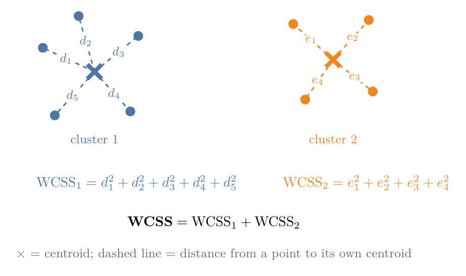
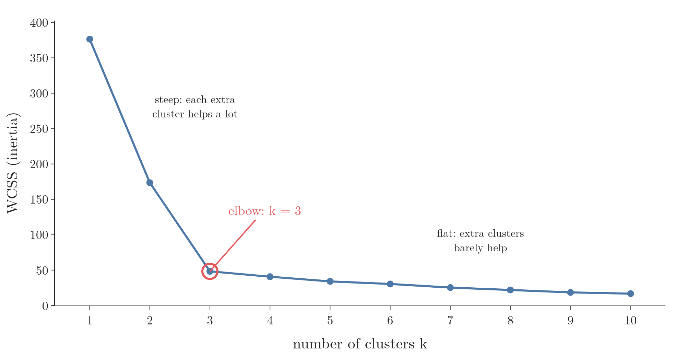

<!-- where-this-fits: generated by course_map/build_map.py; edit concepts.yaml, not this block -->
> **Where this fits:** Pipeline map steps 8 (Model), 10 (Tune). See the [Course map](../01-course-map/note.md).
>
> 
>
> - **Builds on:** Unsupervised learning ([Note 3](../03-types-of-ml/note.md)); Feature scaling ([Note 24](../24-standardization/note.md)).
> - **Leads to:** Hierarchical clustering ([Note 131](../131-hierarchical-clustering/note.md)); DBSCAN ([Note 132](../132-dbscan/note.md)).
> - **Compare with:** Hierarchical clustering ([Note 131](../131-hierarchical-clustering/note.md)); DBSCAN ([Note 132](../132-dbscan/note.md)).
<!-- /where-this-fits -->

## 1. Overview

> **Key point:** k-means splits the data into k clusters by repeating two moves: give every point to its nearest centroid, then move every centroid to the mean of its points. The elbow method helps us choose k.

**K-means** is a clustering algorithm: it puts similar rows in the same group without being told what the groups are (clustering, the [types of ML Note](../03-types-of-ml/note.md), section 3.2). Clustering is used everywhere: e-commerce sites cluster customers, colleges cluster students, photo apps cluster images.

The binning Note ([Note 32](../32-binning-binarization/note.md), section 7.1) already ran k-means on a single column. This Note runs it on two columns, where each point is a row and distances are measured in a plane, and adds the part that was missing there: how to choose k. Figure 1 shows the whole algorithm on 18 students.

{height=48%}

## 2. Prerequisites

- Clustering and unsupervised learning: the [types of ML Note](../03-types-of-ml/note.md).
- k-means on one column, and the word centroid: the [binning Note](../32-binning-binarization/note.md).
- The Euclidean distance: the [KNN imputer Note](../39-knn-imputer/note.md), section 4.1.
- Putting columns on one scale (standardization): the [standardization Note](../24-standardization/note.md).

## 3. Why we need a clustering algorithm

> **Key point:** With two columns we can see the clusters by eye; with ten or a hundred columns we cannot, and k-means does the same job in any number of dimensions.

Take the training and placement cell of a college. It has the CGPA and IQ of every final-year student and wants to split the students into groups, so that each group can be prepared for placements in its own way.

With only two columns, a scatter plot is enough: we look at it and see, say, three groups. No algorithm is needed. Now add marks in class 10, marks in class 12, home state and parents' monthly income: 10 to 15 columns. We can no longer draw the data, so we can no longer see the groups.

This is where k-means earns its place. We explain it in two dimensions, because two dimensions can be drawn, but every step works unchanged in 100 dimensions. Real data usually has many columns, so this is the case that matters.

## 4. The five steps of k-means

> **Key point:** 1 choose k; 2 pick k starting centroids; 3 assign every point to its nearest centroid; 4 move each centroid to the mean of its points; 5 stop if no centroid moved, otherwise go back to step 3.

### 4.1 Step 1: choose k

> **Key point:** k-means cannot find the number of clusters by itself; we must tell it k.

**k** is the number of clusters we want. k-means does not work it out from the data: looking at the students, it cannot decide whether there should be 3 or 4 groups. Choosing k is our job.

This sounds odd: if we cannot plot high-dimensional data, how can we know k? Section 6 answers this with the elbow method. Until then we assume we know it: k = 3 for the students.

### 4.2 Step 2: pick the starting centroids

> **Key point:** k-means picks k points at random and treats them as the first centres of the clusters.

A **centroid** is the centre of a cluster (the [binning Note](../32-binning-binarization/note.md)). At the start there are no clusters yet, so k-means simply picks k points at random and calls them centroids.

In Figure 1 (top left), three students were picked at random. They are marked with crosses: blue, orange and green. Two of them happen to sit in the same group of students, a poor start; the next steps repair it.

### 4.3 Step 3: assign every point to its nearest centroid

> **Key point:** Measure the Euclidean distance from each point to every centroid; the point joins the cluster of the closest one.

For every point we compute its distance to each of the k centroids. The usual measure is the Euclidean distance (the [KNN imputer Note](../39-knn-imputer/note.md), section 4.1): the square root of the summed squared differences, column by column.

The point joins the cluster whose centroid is nearest and takes its colour. With 18 students and 3 centroids, that is $18 \times 3 = 54$ distances per round.

In Figure 1 (top right), the green centroid is nearest to every student on the right and at the bottom, so all of them turn green. The orange centroid wins the top group. The blue centroid has only itself.

> **Extra:** CGPA runs from about 4 to 10, IQ from about 70 to 140. In a raw Euclidean distance a gap of 10 IQ points would swamp a gap of 2 CGPA points, so the clusters would be decided by IQ alone. That is why Figure 1 uses standardized values (the [standardization Note](../24-standardization/note.md)): both columns on mean 0, standard deviation 1. Like KNN (the [KNN Note](../91-knn/note.md), section 7.4), k-means is a distance-based algorithm, so its inputs should be scaled first.

### 4.4 Step 4: move each centroid to the mean of its points

> **Key point:** The new centroid of a cluster is the mean of each column over that cluster's points.

The clusters have changed, so their centres have changed too. For each cluster we take the mean CGPA and the mean IQ of its points; that pair is the new centroid.

For example, a cluster with the points (1, 2), (3, 2) and (2, 5) gets the centroid

$$\left(\frac{1 + 3 + 2}{3},\ \frac{2 + 2 + 5}{3}\right) = (2,\ 3).$$

In Figure 1 (bottom left), the green centroid moves to the middle of its many points, between the right and bottom groups. The orange centroid moves up into the top group.

### 4.5 Step 5: stop when the centroids stop moving

> **Key point:** Compare the new centroids with the old ones: if they moved, go back to step 3; if they did not, the clusters are final.

k-means runs steps 3 and 4 in a loop. After each move we compare the centroids with where they were in the previous round:

- **They moved:** the clusters may still change, so we go back to step 3 and assign every point again.
- **They did not move:** assigning again would give the same clusters, and moving again would give the same centroids. The algorithm has finished.

In Figure 1, round 2 hands most bottom-left students, and the lone orange student on the left, to the blue centroid, which is now nearer to them. Round 3 moves the last one, the student at the very bottom. In round 4 no point changes cluster, so no centroid moves, and three clean clusters remain (bottom right).

A good way to learn the algorithm is to draw 10 to 15 points on paper, pick k and two or three starting points, and run the rounds by hand.

## 5. Why k-means works in any number of dimensions

> **Key point:** k-means needs only two tools, the Euclidean distance and the mean, and both work with any number of columns.

Look back at the five steps. The only geometry used is the distance between two points (step 3) and the mean of some points (step 4).

The Euclidean distance gets one extra squared term per column, and the mean is taken column by column. So nothing changes when we go from 2 columns to 3, 4 or 100. What we did on the plane, the computer does in 100-dimensional space, where we could never see the clusters ourselves.

## 6. Choosing k: the elbow method

> **Key point:** Run k-means for k = 1, 2, 3, ..., plot the WCSS of each, and pick the k where the curve bends from steep to flat.

### 6.1 WCSS: how tight the clusters are

> **Key point:** WCSS adds up, over all clusters, the squared distance from each point to its own centroid. Small WCSS means tight clusters.

**WCSS** (within-cluster sum of squares) measures how far the points sit from their own centroids. scikit-learn calls the same number **inertia**. Figure 2 shows how it is built.

1. **In words:** for every point, take its distance to the centroid of its own cluster and square it. Add these up within each cluster, then add the clusters' totals.
2. **Formula:** with clusters $C_1, \dots, C_k$ and centroids $c_1, \dots, c_k$,
   $$\text{WCSS} = \sum_{j=1}^{k} \ \sum_{x \in C_j} \lVert x - c_j \rVert^2$$
   where $\lVert x - c_j \rVert$ is the Euclidean distance from point $x$ to centroid $c_j$.
3. **Example:** the cluster (1, 2), (3, 2), (2, 5) from section 4.4 has centroid (2, 3). The squared distances are
   $$(1-2)^2 + (2-3)^2 = 2, \quad (3-2)^2 + (2-3)^2 = 2, \quad (2-2)^2 + (5-3)^2 = 4,$$
   so this cluster's WCSS is $2 + 2 + 4 = 8$. If a second cluster had WCSS 5, the total would be $8 + 5 = 13$.

### 6.2 The elbow curve

> **Key point:** The elbow curve plots WCSS against the number of clusters, k = 1 up to about 10 or 20.

To draw the **elbow curve**, we run k-means once for each k and record the WCSS:

1. **k = 1:** all points form one cluster, its centroid is the mean of all the data, and we compute the WCSS.
2. **k = 2:** k-means makes two clusters; we compute WCSS of each and add them.
3. **k = 3, 4, ...:** the same, up to 10, 15 or 20.

Going much beyond 20 is rarely useful. A business will not treat its customers in 50 different ways.

### 6.3 WCSS always falls as k grows

> **Key point:** More clusters means every point sits closer to a centroid, so WCSS shrinks; with one cluster per point it reaches 0.

Is WCSS for 1 cluster bigger than for 2, and for 2 bigger than for 3? Yes. With more centroids, each point can find one closer to it, so the squared distances shrink.

The extreme case proves the trend. Say there are 50 points. The largest possible k is 50: every point is its own cluster and its own centroid. Every distance from a point to its centroid is 0, so WCSS = 0.

So the curve starts high at k = 1 and falls towards 0 as k approaches the number of points. Picking the k with the smallest WCSS would therefore always pick the largest k, which is useless. We need a different rule.

### 6.4 Reading the elbow

> **Key point:** The elbow point is where WCSS stops falling fast: adding one more cluster after it gains little.

Figure 3 is the elbow curve for 150 points that form three groups. WCSS falls from 376 at k = 1 to 174 at k = 2 and 48 at k = 3. After that it hardly moves: 41 at k = 4, 34 at k = 5.

The **elbow point** is where the curve bends, the k after which the fall flattens out. Here it is k = 3:

- Going from 1 to 2 clusters, and from 2 to 3, cut WCSS a lot: these extra clusters were worth it.
- Going from 3 to 4, and beyond, barely helps: the extra clusters only split real groups in pieces.

A memorable picture: imagine the curve is a mountain and we are sliding down it from the left. On the steep part we fall fast and feel scared. The point where the slope suddenly eases and we stop feeling scared is the elbow.

> **Extra:** On real data the bend is often not sharp, and two people may read different elbows from the same curve. Other ways to choose k, such as the silhouette score, exist for this reason; the elbow method stays the most common first look.

## 7. Summary

| Step | What happens | With the students (k = 3) |
|---|---|---|
| 1. Choose k | We decide the number of clusters | k = 3, later checked by the elbow method |
| 2. Initialize | k random points become the centroids | three students picked at random |
| 3. Assign | Every point joins its nearest centroid (Euclidean distance) | 18 × 3 = 54 distances per round |
| 4. Move | Each centroid moves to the mean of its points | mean CGPA, mean IQ per cluster |
| 5. Check | Centroids unchanged: stop; else back to step 3 | stopped after 4 rounds |

- k-means only needs distances and means, so it works the same in 2 or 100 dimensions.
- Scale the columns first: k-means is distance-based.
- WCSS (inertia) = the sum of squared distances from each point to its own centroid.
- WCSS always falls as k grows and reaches 0 when every point is its own cluster.
- The elbow method picks the k where the WCSS curve bends from steep to flat.

## 8. Key terms

| Term | Meaning |
|---|---|
| k-means | A clustering algorithm that repeatedly assigns points to the nearest centroid and moves each centroid to the mean of its points |
| k | The number of clusters k-means makes; chosen by us |
| Centroid initialization | Picking the first k centroids, here at random from the data |
| Convergence (k-means) | The point where the centroids stop moving between rounds, so the algorithm stops |
| WCSS (inertia) | Within-cluster sum of squares: the sum of squared distances from each point to its own centroid |
| Elbow curve | A plot of WCSS against the number of clusters k |
| Elbow method | Choosing k at the point where the elbow curve bends from steep to flat |
| Elbow point | The k after which adding clusters barely lowers WCSS |
