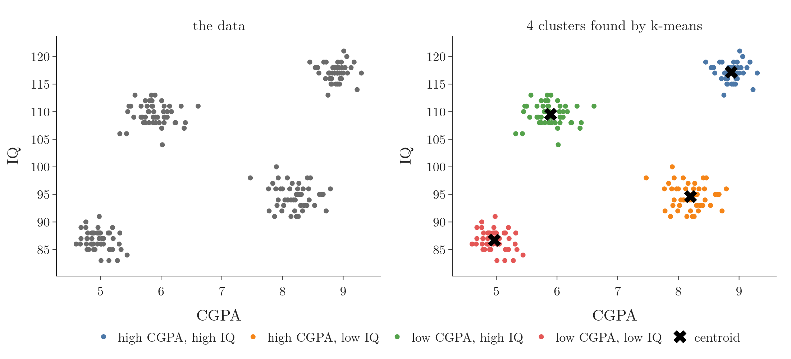
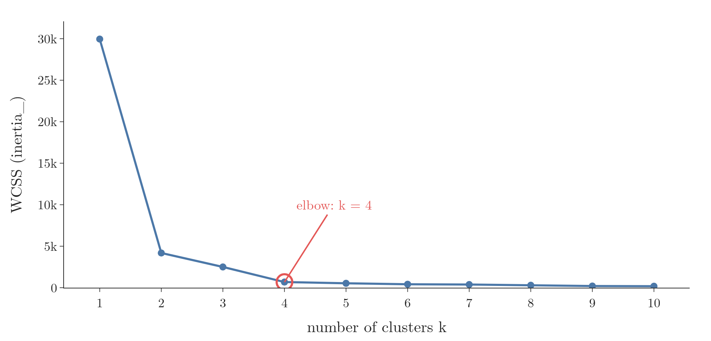
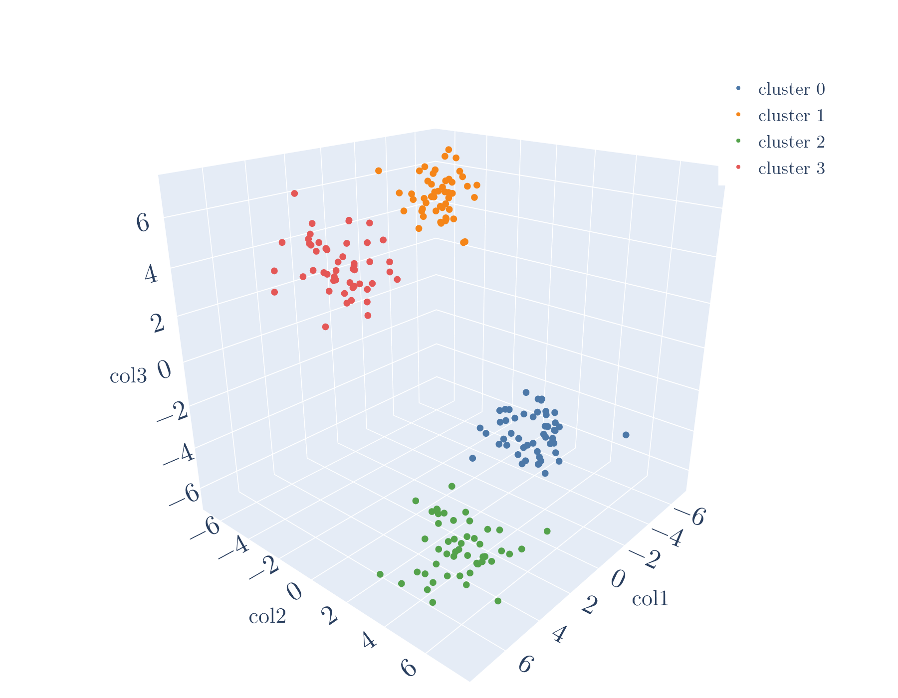

<!-- where-this-fits: generated by course_map/build_map.py; edit concepts.yaml, not this block -->
> **Where this fits:** Pipeline map steps 8 (Model), 10 (Tune). See the [Course map](../01-course-map/note.md).
>
> 
>
> - **Builds on:** Unsupervised learning ([Note 3](../03-types-of-ml/note.md)); Feature scaling ([Note 24](../24-standardization/note.md)).
> - **Leads to:** Hierarchical clustering ([Note 131](../131-hierarchical-clustering/note.md)); DBSCAN ([Note 132](../132-dbscan/note.md)).
> - **Compare with:** Hierarchical clustering ([Note 131](../131-hierarchical-clustering/note.md)); DBSCAN ([Note 132](../132-dbscan/note.md)); Gaussian mixture model (GMM) ([Note 640](../640-gaussian-mixture-models/note.md)).
<!-- /where-this-fits -->

## 1. Overview

> **Key point:** With scikit-learn, k-means takes a few lines: plot the elbow curve with `inertia_`, pick k, call `fit_predict`, and colour the points by cluster.

This Note runs k-means (the [k-means Note](../128-kmeans-intuition/note.md)) on 200 students described by CGPA and IQ. The **elbow method** (G-671) picks k = 4, and k-means finds four groups of students that a placement cell can train in four different ways (Figure 1). Then the same code clusters data with three features.



The Notebook (`notebook.ipynb`) runs every step.

## 2. Prerequisites

- How k-means works and the elbow method: the [k-means Note](../128-kmeans-intuition/note.md).
- pandas, `iloc` and `fit`: the [toy project Note](../13-toy-project/note.md).

## 3. The student data

> **Key point:** 200 final-year students, two features: `cgpa` and `iq`. No target: this is unsupervised learning.

The file `data/student_clustering.csv` holds the CGPA and IQ of 200 final-year students. Each student is an **observation** (G-1374; one record, a row of the table); CGPA and IQ are the two **features** (G-772; input variables, one column each). There is no **target** (G-1949; an output we want to predict), which makes this unsupervised learning. The file is a toy dataset, generated for practice, so its groups are much cleaner than in real data.

> **Python:** Loading the data.
>
> ```python
> import pandas as pd
>
> df = pd.read_csv("data/student_clustering.csv")
> df.shape     # (200, 2)
> df.head()    # columns: cgpa, iq
> ```

CGPA runs from 4.6 to 9.3 and IQ from 83 to 121. Plotted (Figure 1, left), the students form four clear groups. In 2 dimensions we can count them by eye; the elbow method should agree.

## 4. Choosing k with the elbow method

> **Key point:** Fit one `KMeans` per k from 1 to 10, store each model's `inertia_` (its WCSS), and plot them: the curve flattens at k = 4.

`KMeans` lives in `sklearn.cluster`. After fitting, its attribute **`inertia_`** (G-940) holds the WCSS (G-2102) of the clusters it found (WCSS: the [k-means Note](../128-kmeans-intuition/note.md), section 5.1).

> **Python:** The elbow loop.
>
> ```python
> from sklearn.cluster import KMeans
>
> wcss = []
> for i in range(1, 11):
>     km = KMeans(n_clusters=i, random_state=0)
>     km.fit(df)                 # all columns are inputs
>     wcss.append(km.inertia_)   # WCSS of this model
> ```
>
> `n_clusters` is k. `random_state=0` fixes the random start, so every run gives the same numbers. Attributes ending in `_`, like `inertia_`, exist only after `fit`.



Figure 2 plots the ten values. WCSS starts at 29,958 for one cluster and drops to 4,184 for two. WCSS keeps falling to 2,503 at k = 3 and 682 at k = 4. After that it barely moves: 530 at k = 5, 421 at k = 6.

The curve bends twice: a sharp bend at k = 2 and a second one at k = 4. After k = 4 nothing changes much, so k = 4 is the elbow, the same number we counted in Figure 1. With two bends to choose from, the plot of the data in Figure 1 confirms k = 4.

## 5. Training k-means with k = 4

> **Key point:** `fit_predict` trains the model and returns one cluster number per observation, from 0 to k - 1.

> **Python:** Fitting and predicting in one call.
>
> ```python
> X = df.iloc[:, :].values      # the table as a NumPy array
> km = KMeans(n_clusters=4, random_state=0)
> y_means = km.fit_predict(X)
> y_means[:5]                   # array([3, 2, 1, 1, 2])
> km.cluster_centers_           # the 4 centroids
> ```
>
> `.values` turns the DataFrame into a NumPy array, which is easier to slice. `fit_predict` (G-784) is `fit` followed by returning `labels_` (G-1035), the cluster of every training row.

The first student is in cluster 3, the second in cluster 2, and so on. The numbers are only names: another run could call the same group 0 instead of 3. Each cluster holds exactly 50 students, and the **centroids** (G-367; `cluster_centers_`, G-400) are:

| Cluster | Mean CGPA | Mean IQ |
|---|---|---|
| 0 | 8.87 | 117.2 |
| 1 | 8.20 | 94.6 |
| 2 | 5.89 | 109.5 |
| 3 | 4.97 | 86.7 |

Figure 3 replays what happens inside `fit_predict`. Watch the start: each new centroid is drawn from the students, and the farther a student is from the centroids already chosen, the bigger its dot and its chance. Then the assign and update rounds run until no student changes cluster, ending at the four centroids of the table.

{height=40%}

> **Extra:** scikit-learn's `KMeans` does not pick the starting centroids purely at random. Its default `init="k-means++"`, the **k-means++** (G-997) start, picks the first centroid at random from the data. Each next centroid is also a data point, but points far from the centroids chosen so far are more likely to be picked: the chance is proportional to the squared distance. The starting centroids are thus spread out, and bad starts become rare: the expected WCSS of this start is provably close to the best possible (Arthur and Vassilvitskii 2007). scikit-learn runs a "greedy" version that tries a few candidates at each step and keeps the best (scikit-learn `KMeans` docs).
>
> The second default, `n_init="auto"`, sets how many times the whole algorithm restarts from new centroids; the run with the lowest inertia is kept. With `k-means++` it runs once; with `init="random"` it runs 10 times. Other defaults: `n_clusters=8` and `max_iter=300` rounds at most (scikit-learn `KMeans` docs).

> **Extra:** The data was not scaled here, although k-means is distance-based (the [k-means Note](../128-kmeans-intuition/note.md), section 4.3). On this toy data the four groups are so far apart that scaling changes nothing: in the Notebook, k-means on standardized features puts every student in the same group as before. The reason is that, scaled or not, every student is nearer its own group's centroid than any other centroid, so the assign step moves nobody. On real data, where groups are closer, scaling can change the clusters (ESL §14.3.3), so how to scale the features is a choice worth checking.
>
> *Detail:* the two labelings agree exactly (adjusted Rand index 1.0, a score of agreement between two groupings). The smallest ratio of nearest-other-centroid distance to own-centroid distance is 1.08 raw and 2.56 standardized.

## 6. Plotting the clusters with boolean indexing

> **Key point:** `X[y_means == 0, 0]` picks the CGPA of every student in cluster 0; one scatter call per cluster colours the groups.

`y_means == 0` is an array of 200 `True`/`False` values: `True` where the student is in cluster 0. Using it as a row index keeps only those rows; this is **boolean indexing** (G-317). The second index picks the column: 0 for CGPA, 1 for IQ.

![Boolean indexing on the first five students: the labels y_means, the mask y_means == 1, and the CGPA values X[y_means == 1, 0] that the mask keeps](images/boolean_index.png){height=30%}

Figure 4 follows the first five students through the indexing. Watch the orange rows: the mask is True where the label is 1, and only those rows, then only column 0, survive.

> **Python:** One trace per cluster with Plotly.
>
> ```python
> import plotly.graph_objects as go
>
> fig = go.Figure()
> for c in range(4):
>     fig.add_trace(go.Scatter(
>         x=X[y_means == c, 0],   # CGPA of cluster c
>         y=X[y_means == c, 1],   # IQ of cluster c
>         mode="markers", name=f"cluster {c}"))
> fig.show()
> ```

Figure 1 (right) is the result, with the centroids marked as crosses. Every student landed in the group we would have drawn by hand.

## 7. Reading the clusters

> **Key point:** Each cluster is a type of student; naming them turns the clusters into a plan.

A data analyst now names each cluster by its centroid (Figure 1, right):

- **High CGPA, high IQ** (blue): intelligent and hard-working. They need little guidance.
- **High CGPA, lower IQ** (orange): hard-working and sincere. They also need little guidance.
- **Lower CGPA, high IQ** (green): smart but relaxed about studies. They need motivation.
- **Low CGPA, low IQ** (red): they need the most training.

The placement cell can now plan four kinds of preparation. The same idea clusters customers, films or images.

## 8. k-means in three dimensions

> **Key point:** The exact same code clusters data with 3 features, and would with 100.

To see k-means beyond two features, we generate 200 points around four centres in three dimensions with `make_blobs`.

> **Python:** Data with three features.
>
> ```python
> from sklearn.datasets import make_blobs
>
> centroids = [(-5, -5, 5), (5, 5, -5),
>              (3.5, -2.5, 4), (-2.5, 2.5, -4)]
> X3, _ = make_blobs(n_samples=200, centers=centroids,
>                    cluster_std=1, n_features=3,
>                    random_state=1)
> ```
>
> `make_blobs` returns the points and the true group of each; `_` is the usual name for a value we ignore. `cluster_std=1` is the spread of each group.

The elbow loop, run for k = 1 to 20 without changing a line, gives WCSS 11,144, 4,122, 2,552, 593, then 544: the elbow is again at k = 4. Training with k = 4 and colouring by cluster gives Figure 5. In the Notebook, `plotly.express.scatter_3d` draws it as a 3-D plot we can rotate.

{height=45%}

What k-means did in 2 dimensions it does in 3, and in any higher number of dimensions, with the same code. Only the plotting stops at 3.

## 9. Summary

| Task | Code |
|---|---|
| Load the data | `pd.read_csv(...)` |
| WCSS of one model | `KMeans(n_clusters=i).fit(df).inertia_` |
| Elbow curve | loop k = 1 to 10, plot the WCSS |
| Train and get clusters | `y_means = km.fit_predict(X)` |
| Centroids | `km.cluster_centers_` |
| Rows of cluster 0, column 0 | `X[y_means == 0, 0]` |
| 3-D test data | `make_blobs(..., n_features=3)` |

- `inertia_` is scikit-learn's name for WCSS; the elbow on the students is at k = 4.
- `fit_predict` returns one cluster number per observation; the numbers are labels, not ranks.
- `KMeans` starts with `k-means++` and keeps the best of `n_init` runs.
- Name each cluster by its centroid to turn it into a decision.
- The same code works for any number of features.

## 10. Sources

**Built from**

- CampusX, "K-Means Clustering Algorithm in Python | Practical Example | Student Clustering Example | sklearn", YouTube, https://www.youtube.com/watch?v=UPvv9SprgVo

**Other references**

- ESL: Hastie, Tibshirani and Friedman, *The Elements of Statistical Learning*, 2nd ed., Springer, 2009, §14.3.3 (scaling the features changes the clusters).
- Arthur and Vassilvitskii 2007: D. Arthur and S. Vassilvitskii, *k-means++: The Advantages of Careful Seeding*, Proceedings of SODA 2007, 1027–1035.
- scikit-learn `KMeans` docs: the `init` and `n_init` parameters of `sklearn.cluster.KMeans`, scikit-learn 1.9 API reference.

## 11. Key terms

| Term | Meaning |
|---|---|
| KMeans | scikit-learn's k-means class, in `sklearn.cluster` |
| inertia_ | The WCSS of a fitted `KMeans` model |
| fit_predict | Trains a clustering model and returns the cluster of every observation |
| labels_ | The cluster number of every training observation, after fitting |
| cluster_centers_ | The coordinates of the final centroids of a fitted `KMeans` |
| k-means++ | The default start of `KMeans`: centroids picked one by one, far-away points more likely |
| n_init | How many times `KMeans` restarts from new centroids; the run with the lowest inertia is kept |
| Boolean indexing | Selecting rows with an array of True/False values, e.g. `X[y_means == 0]` |
| make_blobs | scikit-learn function that generates points around chosen centres |
