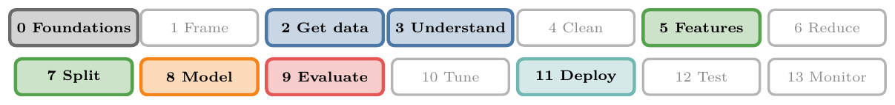
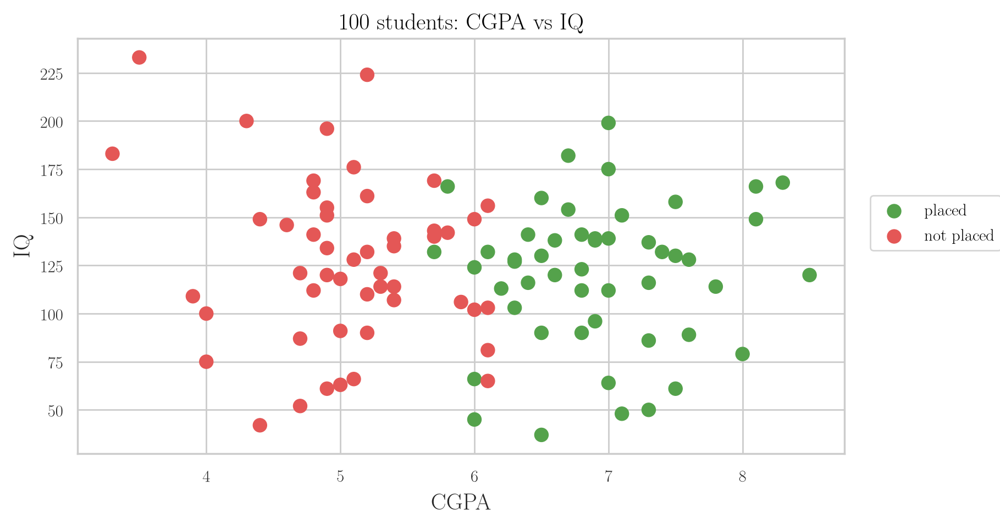
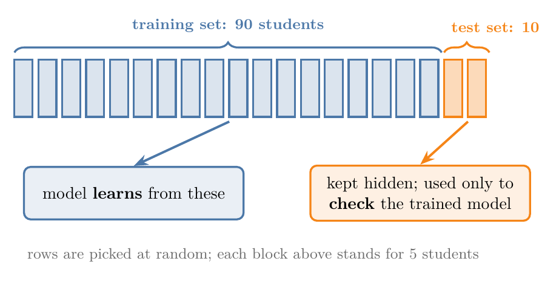
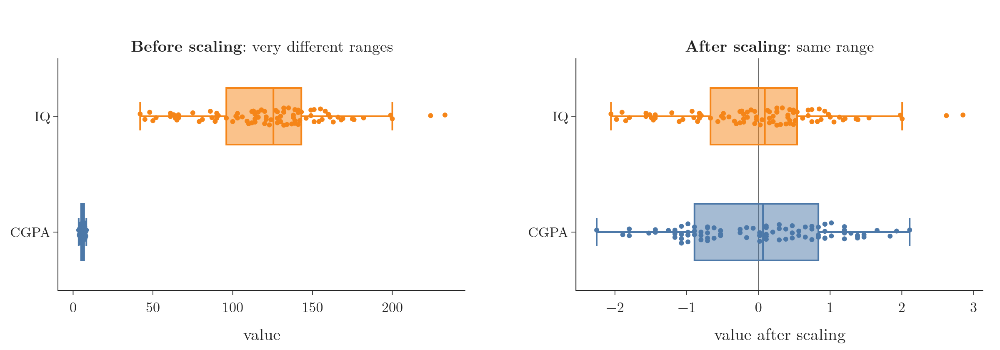
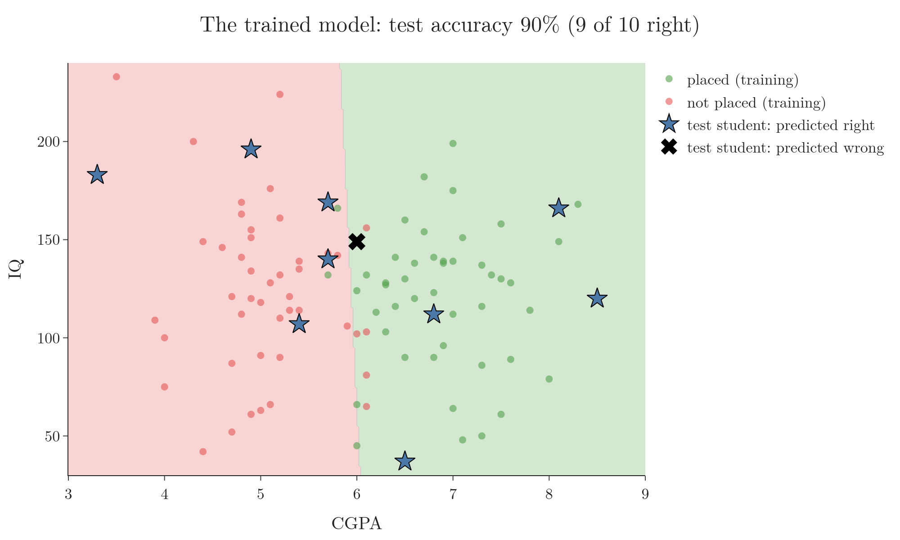

<!-- where-this-fits: generated by course_map/build_map.py; edit concepts.yaml, not this block -->
> **Where this fits:** Pipeline map steps 0 (Foundations), 2 (Get data), 3 (Understand data), 5 (Engineer features), 7 (Split), 8 (Model), 9 (Evaluate), 11 (Deploy). See the [Course map](../01-course-map/note.md).
>
> 
>
> - **Builds on:** Dimensionality reduction ([Note 3](../03-types-of-ml/note.md)); Classification problems ([Note 3](../03-types-of-ml/note.md)); Model-based learning ([Note 6](../06-instance-vs-model-based/note.md)); Feature engineering ([Note 7](../07-challenges-in-ml/note.md)); Software integration ([Note 7](../07-challenges-in-ml/note.md)); Framing an ML problem (Video 9, coming).
> - **Leads to:** Descriptive statistics ([Note 19](../19-understanding-your-data/note.md)); Univariate analysis ([Note 20](../20-univariate-analysis/note.md)); Bivariate and multivariate analysis ([Note 21](../21-bivariate-multivariate-analysis/note.md)); PCA ([Note 47](../47-pca-geometric-intuition/note.md)); K-nearest neighbours (Video 91, coming); Normalization (Video 25, coming).
> - **Compare with:** Web scraping ([Note 7](../07-challenges-in-ml/note.md)); JSON and SQL data ([Note 16](../16-working-with-json-and-sql/note.md)); Feature extraction ([Note 46](../46-curse-of-dimensionality/note.md)); Normalization (Video 25, coming); Decision trees (Video 97, coming); Cross-validation (Video 112, coming).
<!-- /where-this-fits -->

## 1. Overview

> **Key point:** We take a small dataset of students, train a model that predicts placement from CGPA and IQ, check how good it is, and turn it into a website.


This Note walks through a complete ML project on a tiny, clean dataset. Real projects use much larger and messier data, and later Notes cover each step in depth. Here the aim is to see the whole process once, from data to website.

**The task:** we have the CGPA, IQ and placement result (placed or not) of 100 students. We want a model that, given a new student's CGPA and IQ, predicts whether they will be placed. The output is a category, so this is a **classification** problem.

## 2. The workflow

> **Key point:** Clean, explore, choose features, split, scale, train, evaluate, deploy.


Figure 1 shows the steps:

1. **Clean** the data: fix missing values and outliers, remove unneeded columns. This is called **preprocessing**.
2. **Explore** the data with summaries and plots, to spot patterns. This is **exploratory data analysis (EDA)**.
3. **Choose features:** decide which input columns to use (**feature selection**). Here we keep both CGPA and IQ.
4. **Split inputs from output:** X (the inputs) and y (the output).
5. **Split into training and test sets.**
6. **Scale** the inputs to similar ranges.
7. **Train** the model.
8. **Evaluate** the model on the test set.
9. **Deploy** it, for example as a website.

Often we also train several different algorithms and keep the best one. This is called **model selection** and is covered later in the course.

The Notebook for this Note (`notebook.ipynb`) runs every step, in order, on the same data.

## 3. Loading and cleaning the data

> **Key point:** Load the CSV file into a table, check it, and drop the column we do not need.

The data is a **CSV file** (comma-separated values): a plain text table, one row per line, with commas between the values.

> **Python:** Loading and checking a table with pandas.
>
> ```python
> import pandas as pd
>
> df = pd.read_csv("data/placement.csv")  # load the table
> df.head()                                # show the first 5 rows
> df.shape                                 # (100, 4): 100 rows, 4 columns
> df.info()                                # column types, missing values
> ```
>
> **pandas** is the main Python library for tables. A table in pandas is called a **DataFrame**, usually named `df`.

The table has four columns: `Unnamed: 0`, `cgpa`, `iq` and `placement`. `df.info()` shows 100 non-missing values in every column, so there are no **missing values** to fix.

The first column, `Unnamed: 0`, is just a row number left over from how the file was saved. It carries no information, so we drop it:

> **Python:** Keeping only some columns.
>
> ```python
> df = df.iloc[:, 1:]   # all rows, every column from position 1 onwards
> ```
>
> `iloc[rows, columns]` selects by position, starting from 0. `:` means "all", and `1:` means "from position 1 to the end".

That is all the cleaning this dataset needs. Real data usually needs much more, as later Notes show.

## 4. Exploring the data

> **Key point:** A plot shows that placed and not-placed students fall into two regions that a straight line could roughly separate.



Figure 2 plots every student by CGPA and IQ, coloured by placement. Two things stand out:

- Placed students (green) mostly have a CGPA above about 6.
- IQ makes much less difference: both groups have high and low IQs.

The two groups could be separated, roughly, by a straight line. That makes **logistic regression** a good choice of algorithm. It is a classification algorithm that finds the line that best separates the two classes. How it finds that line is covered later in the course.

## 5. Inputs and output

> **Key point:** X holds the inputs (CGPA, IQ); y holds the output (placement).

We separate the table into:

- **X:** the input columns, `cgpa` and `iq`. Also called **independent variables**.
- **y:** the output column, `placement`. Also called the **dependent variable**, because it depends on the inputs.

> **Python:** Separating X and y.
>
> ```python
> X = df.iloc[:, 0:2]   # columns 0 and 1: cgpa, iq
> y = df.iloc[:, -1]    # the last column: placement
> ```
>
> `0:2` means positions 0 and 1 (the end, 2, is not included). `-1` means the last column. X has shape (100, 2) and y has shape (100,).

## 6. Training and test sets

> **Key point:** We hide some students from the model during training, then use them to check how well it learned.

After training, how do we know whether the model learned the right pattern? We cannot release it to users first and wait for complaints. We must check it before deployment.

The standard method is to hold some data back (Figure 3):

- The **training set** (here 90 students) is what the model learns from.
- The **test set** (here 10 students) is hidden during training. Afterwards, we ask the model to predict these students' placement and compare its answers with the real ones.



This is called a **train-test split**. Which rows go where is decided at random. The test set must stay unseen, so it fairly represents new students.

> **Python:** Splitting with scikit-learn.
>
> ```python
> from sklearn.model_selection import train_test_split
>
> X_train, X_test, y_train, y_test = train_test_split(
>     X, y, test_size=0.1, random_state=1)
> ```
>
> **scikit-learn** (imported as `sklearn`) is the main Python library for classical ML. `test_size=0.1` puts 10% of the rows in the test set. `random_state=1` fixes the random shuffle, so the split is the same every time the code runs.

## 7. Scaling the inputs

> **Key point:** Inputs on very different ranges can mislead some algorithms, so we bring them to the same scale.

CGPA ranges from about 3 to 9, while IQ ranges from about 40 to 230 (Figure 4, left). Some algorithms compare data points by measuring distances (like KNN in Note 6). On raw data, a difference of 10 IQ points would count far more than a difference of 2 CGPA points, simply because IQ numbers are bigger. Columns such as salary, in the lakhs, would be even worse.

So we **scale** the inputs: bring every column to a similar range. A common method, **standardization**, shifts each column to centre on 0 with a typical spread of 1. Most values then fall roughly between -2 and 2 (Figure 4, right).



> **Extra:** Standardization, step by step.
>
> 1. **In words:** subtract the column's average, then divide by how spread out the column is (its **standard deviation**).
> 2. **Formula:**
>    $$z = \frac{x - \text{mean}}{\text{standard deviation}}$$
> 3. **Example:** in our training set, CGPA has mean 5.98 and standard deviation 1.10. A CGPA of 7.4 becomes
>    $$z = \frac{7.4 - 5.98}{1.10} \approx 1.29,$$
>    about 1.3 standard deviations above average. Likewise, IQ 132 becomes
>    $$z = \frac{132 - 122.0}{38.9} \approx 0.26.$$

> **Python:** Scaling with `StandardScaler`.
>
> ```python
> from sklearn.preprocessing import StandardScaler
>
> scaler = StandardScaler()
> X_train_scaled = scaler.fit_transform(X_train)  # learn mean and spread, then scale
> X_test_scaled = scaler.transform(X_test)        # scale using the SAME numbers
> ```
>
> `fit` learns each column's mean and standard deviation; `transform` applies the scaling. The scaler learns only from the training set, then applies the same numbers to the test set.

> **Extra:** Why fit the scaler on the training set only? If it also learned from the test set, information about the test students would leak into training, and the test would no longer be a fair check on unseen data. This mistake is called **data leakage**.

## 8. Training the model

> **Key point:** Training means calling `fit` on the training data; the algorithm finds the best separating line by itself.

> **Python:** Training a logistic regression model.
>
> ```python
> from sklearn.linear_model import LogisticRegression
>
> clf = LogisticRegression()
> clf.fit(X_train_scaled, y_train)   # training
> ```
>
> In scikit-learn, every model is trained the same way: create it, then call `fit(inputs, outputs)`. `clf` is a common name for a classifier.

On a dataset this small, training takes a fraction of a second. Training is often this quick and quiet; larger models and datasets take longer.

## 9. Evaluating the model

> **Key point:** The model predicts the test students' placement; accuracy is the share it gets right.

We ask the trained model to predict placement for the 10 hidden test students, and compare with their real results.

**Accuracy**, step by step:

1. **In words:** the fraction of predictions that are correct.
2. **Formula:**
   $$\text{accuracy} = \frac{\text{number of correct predictions}}{\text{total number of predictions}}$$
3. **Example:** the model gets 9 of the 10 test students right, so
   $$\text{accuracy} = \frac{9}{10} = 0.9,$$
   or 90%.

> **Python:** Predicting and measuring accuracy.
>
> ```python
> from sklearn.metrics import accuracy_score
>
> y_pred = clf.predict(X_test_scaled)   # predictions for the test students
> accuracy_score(y_test, y_pred)        # 0.9
> ```



Figure 5 shows what the model learned. Its boundary sits at a CGPA of about 6, barely tilted by IQ: students to the right are predicted *placed*, to the left *not placed*. The stars are the test students; the one cross is the student it got wrong, a student with CGPA 6.0 sitting right on the boundary.

If the accuracy were too low, we would go back and improve an earlier step: more data, better features, or a different algorithm. Here 90% is fine for a demonstration, so we move on.

## 10. Deploying the model

> **Key point:** Save the trained model to a file, load it inside a website, and put the website on a server.

### 10.1 Saving the model

> **Key point:** pickle turns the trained model into a file that other programs can load.

A trained model lives in Python's memory and disappears when the program stops. To use it elsewhere, we save it with **pickle**, a Python module that converts objects into a file and back.

> **Python:** Saving and loading with pickle.
>
> ```python
> import pickle
>
> with open("model.pkl", "wb") as f:   # "wb": write, binary
>     pickle.dump({"scaler": scaler, "model": clf}, f)
>
> with open("model.pkl", "rb") as f:   # "rb": read, binary
>     saved = pickle.load(f)
> ```

> **Extra:** Save the scaler together with the model. The model was trained on scaled inputs, so a website that passes it raw CGPA and IQ values would get wrong answers. Saving both, and scaling every new input with the saved scaler, avoids this. Later in the course, **pipelines** bundle all such steps into one object.

### 10.2 The website

> **Key point:** The website takes CGPA and IQ, scales them, runs the saved model and shows the answer.


Figure 6 shows the path. The website loads `model.pkl`, asks the user for an IQ and a CGPA, and shows *Placed* or *Not placed*. Trying it confirms what Figure 5 showed: the answer depends almost entirely on whether the CGPA is above about 6.

The Notebook builds this website on our own machine with Dash. To let other people use it, it must run on a server, for example on Heroku, AWS or Google Cloud. Deploying to these platforms is covered later in the course.

> **Extra:** Heroku used to offer free hosting for small apps, but its free plan ended in November 2022. AWS and Google Cloud still offer limited free tiers for new accounts.

This model is far from perfect: it learned from only 90 students and was not tuned at all. The rest of the course goes through each step of this workflow in depth.

## 11. Summary

| Step | What we did | Key code |
|---|---|---|
| Load | Read the CSV into a DataFrame | `pd.read_csv` |
| Clean | Dropped the unneeded index column | `df.iloc[:, 1:]` |
| Explore | Plotted CGPA vs IQ by placement | scatter plot |
| Inputs / output | X = cgpa, iq; y = placement | `iloc` |
| Split | 90 training, 10 test students | `train_test_split` |
| Scale | Standardized both inputs | `StandardScaler` |
| Train | Logistic regression | `fit` |
| Evaluate | 9 of 10 test students right: 90% | `accuracy_score` |
| Deploy | Saved scaler + model; website | `pickle`, Dash |

- Always keep a test set hidden from training, to check the model fairly.
- Fit the scaler on the training set only, and save it with the model.
- Accuracy = correct predictions / total predictions.

## 12. Key terms

| Term | Meaning |
|---|---|
| Preprocessing | Cleaning and preparing data before training |
| Exploratory data analysis (EDA) | Exploring data with summaries and plots to find patterns |
| Feature selection | Choosing which input columns to use |
| Model selection | Training several algorithms and keeping the best |
| CSV file | A text file holding a table, with commas between values |
| pandas, DataFrame | Python's main table library, and its name for a table |
| Independent variables | The input columns (X) |
| Dependent variable | The output column (y) |
| Training set | The part of the data the model learns from |
| Test set | The part hidden during training, used to check the model |
| Train-test split | Dividing the data into training and test sets |
| scikit-learn | Python's main library for classical ML |
| Scaling | Bringing input columns to similar ranges |
| Standardization | Scaling a column to mean 0 and standard deviation 1 |
| Standard deviation | A measure of how spread out a column's values are |
| Data leakage | Information from the test set leaking into training |
| Logistic regression | A classification algorithm that finds a separating boundary |
| Accuracy | The fraction of predictions that are correct |
| pickle | A Python module that saves objects to a file and loads them back |
| Pipeline | One object that bundles several processing steps and a model |
