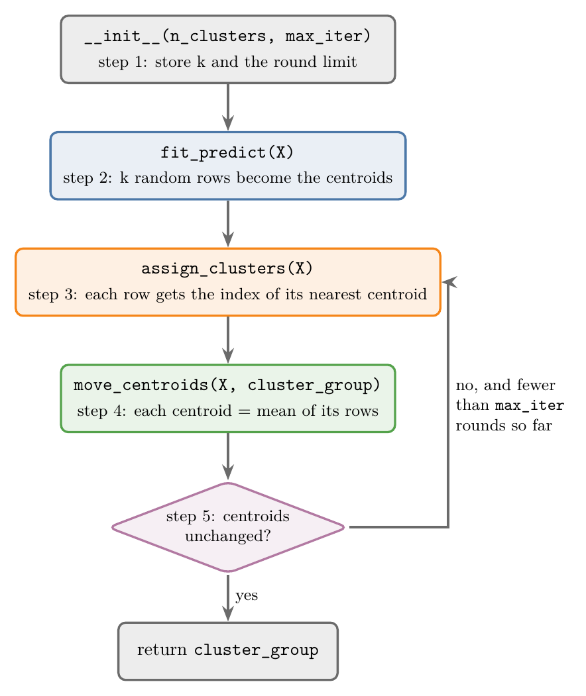
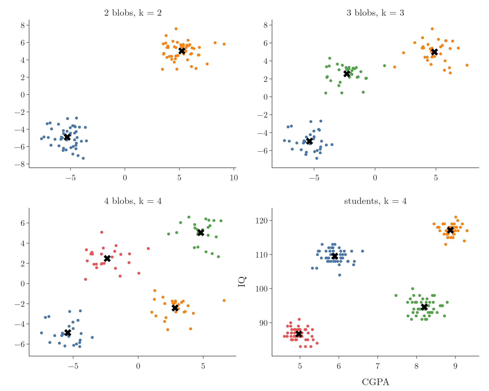

<!-- where-this-fits: generated by course_map/build_map.py; edit concepts.yaml, not this block -->
> **Where this fits:** Pipeline map step 8 (Model). See the [Course map](../01-course-map/note.md).
>
> 
>
> - **Builds on:** Unsupervised learning ([Note 3](../03-types-of-ml/note.md)); Feature scaling ([Note 24](../24-standardization/note.md)); Elbow method and WCSS ([Note 129](../129-kmeans-code/note.md)).
> - **Leads to:** Hierarchical clustering ([Note 131](../131-hierarchical-clustering/note.md)); DBSCAN ([Note 132](../132-dbscan/note.md)).
> - **Compare with:** Hierarchical clustering ([Note 131](../131-hierarchical-clustering/note.md)); DBSCAN ([Note 132](../132-dbscan/note.md)).
<!-- /where-this-fits -->

## 1. Overview

> **Key point:** We write k-means ourselves as a class with one public method, `fit_predict`, and two helpers: `assign_clusters` (step 3) and `move_centroids` (step 4).

Coding an algorithm from scratch is the surest test that we understand it. This Note turns the five steps of k-means (the [k-means Note](../128-kmeans-intuition/note.md), section 4) into about 40 lines of Python. Figure 1 shows how the steps map onto the methods of the class.

{height=50%}

The class is in `kmeans.py` in this Note's folder; running `python kmeans.py` checks that it finds the same clusters as scikit-learn. The Notebook (`notebook.ipynb`) runs every experiment below.

## 2. Prerequisites

- The five steps of k-means and WCSS: the [k-means Note](../128-kmeans-intuition/note.md).
- `KMeans` in scikit-learn, the student data and boolean indexing: the [k-means in Python Note](../129-kmeans-code/note.md).

## 3. The shape of the class

> **Key point:** The constructor stores k and a limit on the number of rounds; `fit_predict` runs the loop and returns one cluster number per row.

We copy scikit-learn's interface, so our class is used exactly like the real one:

> **Python:** Using the class.
>
> ```python
> from kmeans import KMeans
>
> km = KMeans(n_clusters=4, max_iter=100)
> y_means = km.fit_predict(X)   # one cluster number per row
> ```
>
> `from kmeans import KMeans` loads the class from our own file `kmeans.py`, not from scikit-learn.

The constructor takes two settings:

- **`n_clusters`**: k, the number of clusters (step 1). Default 2.
- **`max_iter`**: the largest number of assign-and-move rounds. Default 100. The loop stops earlier if the centroids stop moving.

> **Python:** The constructor.
>
> ```python
> class KMeans:
>     def __init__(self, n_clusters=2, max_iter=100,
>                  random_state=None):
>         self.n_clusters = n_clusters
>         self.max_iter = max_iter
>         self.random_state = random_state
>         self.centroids = None   # set by fit_predict
> ```
>
> `random_state` is our addition: it fixes the random start so that results can be repeated.

## 4. Step 2: random starting centroids

> **Key point:** Pick k different row numbers at random and take those rows as the first centroids.

`X` is a 2-D NumPy array: with 100 points in 2 columns, it holds 100 rows of 2 numbers each. To start, we pick k different row numbers between 0 and 99 at random, then take those rows.

> **Python:** Choosing the starting centroids.
>
> ```python
> rng = np.random.default_rng(self.random_state)
> random_index = rng.choice(X.shape[0],
>                           size=self.n_clusters,
>                           replace=False)
> self.centroids = X[random_index].astype(float)
> ```
>
> `X.shape[0]` is the number of rows. `rng.choice(100, size=2, replace=False)` returns 2 different numbers from 0 to 99, for example `[26, 17]`. `X[[26, 17]]` then picks rows 26 and 17. `astype(float)` lets the centroids hold decimals once they move.

> **Extra:** The same can be written with Python's `random` module: `random.sample(range(X.shape[0]), k)` also returns k different numbers. NumPy's generator is used here because it takes a seed per object, so two models never share random state.

## 5. Step 3: assigning clusters

> **Key point:** For every row, compute its distance to every centroid and record the index of the smallest one.

### 5.1 One distance formula for any number of columns

> **Key point:** The squared Euclidean distance is the dot product of the difference vector with itself, so `np.sqrt(np.dot(a - b, a - b))` works for 2, 3 or 100 columns.

The Euclidean distance (the [KNN imputer Note](../39-knn-imputer/note.md), section 4.1) gains one term per column. Written term by term, the code would have to change whenever the number of columns changes. A vector form avoids that.

1. **In words:** subtract the two points to get the difference vector. Multiply it by itself element by element and add up: that is the dot product, the sum of the squared differences. Take the square root.
2. **Formula:** for points $a$ and $b$,
   $$d(a, b) = \sqrt{(b - a) \cdot (b - a)} = \sqrt{\sum_i (b_i - a_i)^2}$$
3. **Example:** $a = (1, 2)$, $b = (4, 5)$. Then $b - a = (3, 3)$ and $(3, 3) \cdot (3, 3) = 9 + 9 = 18$, so
   $$d = \sqrt{18} \approx 4.24.$$
   Add a third column, $a = (1, 2, 3)$ and $b = (4, 5, 6)$: $b - a = (3, 3, 3)$, the dot product is 27, and $d = \sqrt{27} \approx 5.196$. The code did not change.

> **Python:** The distance in NumPy.
>
> ```python
> np.sqrt(np.dot(b - a, b - a))   # 4.24 for (1, 2), (4, 5)
> ```
>
> `b - a` subtracts element by element. `np.dot(u, v)` multiplies matching elements and adds them up.

### 5.2 The nearest centroid

> **Key point:** With 100 rows and 2 centroids we compute 200 distances; each row gets the index of its smaller one.

A nested loop visits every row and, inside, every centroid. With 100 rows and 2 centroids the inner line runs $100 \times 2 = 200$ times. For each row we keep the position of the smallest distance: 0 if the first centroid is nearer, 1 if the second.

> **Python:** `assign_clusters`.
>
> ```python
> def assign_clusters(self, X):
>     cluster_group = []
>     for row in X:
>         distances = [np.sqrt(np.dot(row - c, row - c))
>                      for c in self.centroids]
>         cluster_group.append(int(np.argmin(distances)))
>     return np.array(cluster_group)
> ```
>
> The square brackets build a list of k distances, one per centroid. `np.argmin` returns the position of the smallest value, the same as `distances.index(min(distances))`. The result has one entry per row, such as `[0, 0, 1, ...]`, and is returned as a NumPy array so it can be used for boolean indexing.

## 6. Step 4: moving the centroids

> **Key point:** For each cluster k, select its rows with `X[cluster_group == k]` and take the mean of each column with `mean(axis=0)`.

The cluster numbers tell us which rows belong to which cluster. The new centroid of a cluster is the mean of each column over its rows (the [k-means Note](../128-kmeans-intuition/note.md), section 4.4).

Take five rows and their clusters:

| Row | Values | Cluster |
|---|---|---|
| 0 | (1, 2) | 0 |
| 1 | (2, 3) | 1 |
| 2 | (3, 4) | 0 |
| 3 | (4, 5) | 0 |
| 4 | (5, 6) | 1 |

`X[cluster_group == 0]` keeps rows 0, 2 and 3. Their column means are $(1 + 3 + 4)/3 = 2.67$ and $(2 + 4 + 5)/3 = 3.67$, so the new centroid of cluster 0 is (2.67, 3.67). Cluster 1 gets $(3.5, 4.5)$.

> **Python:** `move_centroids`.
>
> ```python
> def move_centroids(self, X, cluster_group):
>     new_centroids = []
>     for k in range(self.n_clusters):
>         members = X[cluster_group == k]
>         new_centroids.append(members.mean(axis=0))
>     return np.array(new_centroids)
> ```
>
> `axis=0` averages down each column, giving one mean per column. Without it, `mean()` averages all six numbers into a single value (3.17), which is not a point at all.

> **Extra:** A cluster can end up empty: no row is nearest to its centroid. The mean of zero rows is undefined, and a loop over the cluster numbers that actually occur (for example with `np.unique(cluster_group)`) would silently return fewer than k centroids. The file `kmeans.py` keeps an empty cluster's old centroid instead. scikit-learn moves it to a far-away point.

## 7. Step 5: stopping

> **Key point:** Save the centroids before moving them; if the new ones equal the old ones, break out of the loop.

> **Python:** The loop inside `fit_predict`.
>
> ```python
> for i in range(self.max_iter):
>     cluster_group = self.assign_clusters(X)
>     old_centroids = self.centroids
>     self.centroids = self.move_centroids(X, cluster_group)
>     if np.allclose(old_centroids, self.centroids):
>         break
> return cluster_group
> ```
>
> `break` leaves the loop at once. `np.allclose` is True when every pair of numbers is equal up to a tiny rounding error. `(old == new).all()` also works, but computed means can differ in the last decimal place.

The loop ends in one of two ways (Figure 1): the centroids stop moving, or `max_iter` rounds have run. Either way, `fit_predict` returns the cluster number of every row.

## 8. Testing the class

> **Key point:** On two, three and four blobs, and on the 200 students, the class finds the right groups in 2 to 5 rounds.

We generate test data with `make_blobs` (the [k-means in Python Note](../129-kmeans-code/note.md), section 8): 100 points around 2, 3 or 4 centres, each with spread 1. Then we run our class with the matching k, and finally on the 200 students with k = 4.

{height=55%}

Figure 2 shows all four results: every group found, every centroid in the middle of its group. The loops finished after 2, 5, 3 and 4 rounds. Plotting needs one scatter call per cluster, so the plotting code (not the class) must be extended each time k grows.

> **Python:** The self-check in `kmeans.py`.
>
> ```python
> from sklearn.metrics import adjusted_rand_score
>
> ours = KMeans(n_clusters=3, random_state=1).fit_predict(X)
> theirs = SkKMeans(n_clusters=3, random_state=0).fit_predict(X)
> assert adjusted_rand_score(ours, theirs) == 1.0
> ```
>
> Cluster numbers are only names, so we cannot compare them directly. `adjusted_rand_score` is 1.0 when two labelings put exactly the same points together, whatever the numbers.

## 9. Bad random starts

> **Key point:** If the starting centroids fall badly, k-means gets stuck in poor clusters; more rounds do not help, but restarting from other random points does.

Sometimes the class returns wrong clusters. It is tempting to blame `max_iter` and raise it, but the round counts say otherwise. Across 30 random starts on the four blobs, k-means never needed more than 10 rounds; at most 10 of the 100 allowed rounds were ever used.

Figure 3 shows the real cause on the students. With one random start (left), two centroids end up in the bottom-left group. That group gets split in two, while two real groups, the top ones, have to share one centroid placed in the empty space between them. After 3 rounds nothing changes any more, so the algorithm stops, stuck. Raising `max_iter` to 500 gives exactly the same result.


The two runs can be compared by their WCSS (the [k-means Note](../128-kmeans-intuition/note.md), section 6.1): 2,280 for the bad start and 682 for the good one. Lower is better, so the fix is simple:

1. run k-means from several random starts;
2. keep the run with the lowest WCSS.

In the Notebook, the best of 10 starts is the good clustering (WCSS 682). scikit-learn's `n_init` and `k-means++` start (the [k-means in Python Note](../129-kmeans-code/note.md), section 5) do exactly this job.

> **Extra:** The class also stores the WCSS of its result as `inertia_`, like scikit-learn:
>
> ```python
> self.inertia_ = ((X - self.centroids[cluster_group]) ** 2).sum()
> ```
>
> `self.centroids[cluster_group]` repeats, for every row, the centroid of its own cluster; subtracting, squaring and summing gives the WCSS. With it, the elbow method takes one loop over k. Taking the best of 10 starts for each k, the students give WCSS 29,958, 4,184, 2,363, 682, 514, ...: the elbow is at k = 4, as with scikit-learn.

## 10. Summary

| Method | Step | What it does |
|---|---|---|
| `__init__` | 1 | Stores k (`n_clusters`) and the round limit (`max_iter`) |
| `fit_predict` | 2 | Picks k random rows as the first centroids, then runs the loop |
| `assign_clusters` | 3 | Distance from every row to every centroid; keeps the index of the nearest |
| `move_centroids` | 4 | Each centroid becomes the column means of its rows |
| check in `fit_predict` | 5 | Stops when the centroids no longer move |

- The Euclidean distance for any number of columns: `np.sqrt(np.dot(a - b, a - b))`.
- `X[cluster_group == k].mean(axis=0)` is the new centroid of cluster k.
- k-means usually stops within about 10 rounds; a wrong result comes from a bad random start, not from too few rounds.
- Fix bad starts by restarting several times and keeping the lowest WCSS.

## 11. Key terms

| Term | Meaning |
|---|---|
| Constructor (`__init__`) | The method that runs when an object is created and stores its settings |
| max_iter | The largest number of assign-and-move rounds k-means may run |
| Dot product | The sum of the products of matching elements of two vectors |
| np.argmin | NumPy function returning the position of the smallest value |
| mean(axis=0) | The mean of each column of an array |
| Local optimum (k-means) | A clustering where k-means has stopped but a better one exists, caused by a bad start |
| Adjusted Rand score | A number that is 1.0 when two labelings group the points identically, whatever the label numbers |
