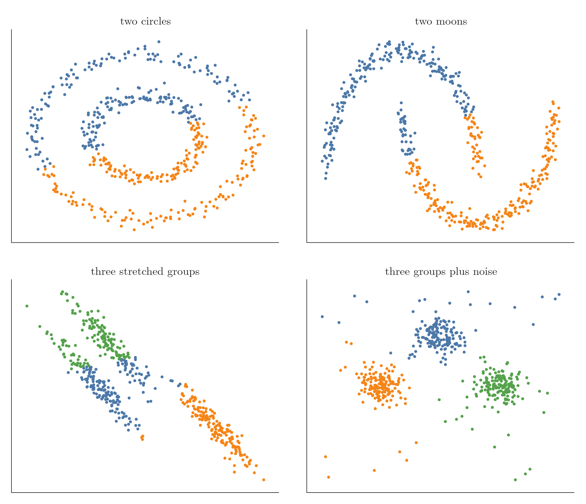
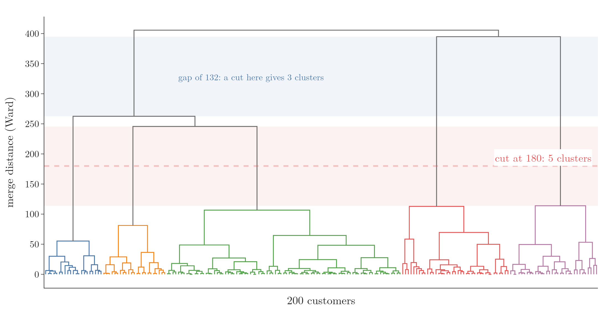
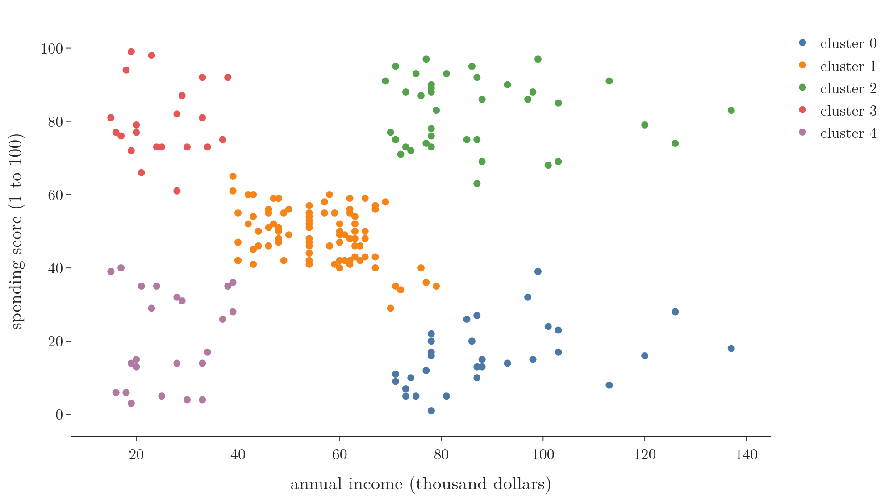

<!-- where-this-fits: generated by course_map/build_map.py; edit concepts.yaml, not this block -->
> **Where this fits:** Pipeline map step 8 (Model). See the [Course map](../01-course-map/note.md).
>
> 
>
> - **Builds on:** Unsupervised learning ([Note 3](../03-types-of-ml/note.md)).
> - **Leads to:** DBSCAN ([Note 132](../132-dbscan/note.md)).
> - **Compare with:** K-means ([Note 130](../130-kmeans-from-scratch/note.md)); DBSCAN ([Note 132](../132-dbscan/note.md)).
<!-- /where-this-fits -->

## 1. Overview

> **Key point:** Agglomerative clustering starts with every point as its own cluster and repeatedly merges the two closest clusters; the record of the merges, the dendrogram, lets us pick any number of clusters afterwards.

k-means works well on round, well-separated groups but fails on many other shapes. **Hierarchical clustering** is a family of clustering methods that build a whole hierarchy of clusters, from single points up to one cluster holding everything. Figure 1 shows the idea on six points.

{height=45%}

This Note covers why we need it, how the merging works, the four ways to measure the distance between two clusters, how to read the number of clusters off the dendrogram, and scikit-learn's `AgglomerativeClustering` on customer data. The Notebook (`notebook.ipynb`) runs every example.

## 2. Prerequisites

- k-means and its centroids: the [k-means Note](../128-kmeans-intuition/note.md).
- The Euclidean distance: the [KNN imputer Note](../39-knn-imputer/note.md), section 4.1.
- The dendrogram as a picture: the [bivariate analysis Note](../21-bivariate-multivariate-analysis/note.md), section 8.

## 3. Where k-means struggles

> **Key point:** k-means builds clusters around centroids, so it finds round blobs; rings, crescents, stretched groups and noise points defeat it.

k-means assigns every point to its nearest centroid (the [k-means Note](../128-kmeans-intuition/note.md)). This works when the groups are compact and well separated. On harder shapes it fails, as Figure 2 shows on four standard test datasets:

- **Two circles**, one inside the other. We want the inner ring and the outer ring; k-means cuts both rings in half, top against bottom.
- **Two moons**, two interleaving crescents. k-means splits the picture with a straight boundary, so each cluster gets parts of both moons.
- **Three stretched groups**, long thin diagonal bands. k-means mixes neighbouring bands.
- **Three groups plus noise.** Some points are noise that belong to no group, but k-means must put every point in some cluster.

{height=50%}

k-means does best on spherical (round) groups. Other clustering methods exist because of these failures. This Note covers hierarchical clustering; density-based clustering, with its algorithm DBSCAN, has its own Note (the [DBSCAN Note](../132-dbscan/note.md)). DBSCAN can also label noise points as noise instead of forcing them into a cluster.

## 4. Two kinds of hierarchical clustering

> **Key point:** Agglomerative clustering merges bottom-up, from single points to one cluster; divisive clustering splits top-down. Agglomerative is the one used in practice.

There are two types:

- **Agglomerative clustering** starts with every point as a cluster and merges, one step at a time, until one cluster is left. It is the common one, and the rest of this Note is about it.
- **Divisive clustering** works the other way round: it starts with one cluster holding everything and splits it, step by step, until every point is alone. Section 6 sketches it.

## 5. Agglomerative clustering, merge by merge

> **Key point:** Start with n clusters, merge the two closest, record the merge, and repeat until one cluster is left.

### 5.1 The merges

> **Key point:** Every merge reduces the number of clusters by one: 6, 5, 4, 3, 2, 1.

Figure 1 runs the algorithm on six points:

1. **Start:** each point is a cluster of its own, so there are 6 clusters.
2. **Merge 1:** points 4 and 5 are the closest pair, so they form a cluster. 5 clusters are left.
3. **Merge 2:** points 1 and 2 are the next closest pair. 4 clusters are left.
4. **Merge 3:** point 3 is close to the cluster {4, 5}, so it joins it: {3, 4, 5}. 3 clusters are left.
5. **Merge 4:** point 6 joins {3, 4, 5}. 2 clusters are left.
6. **Merge 5:** the last two clusters, {1, 2} and {3, 4, 5, 6}, merge into one.

### 5.2 The dendrogram records the merges

> **Key point:** Each merge is drawn as a link whose height is the distance at which the two clusters merged.

The tree on the right of Figure 1 is the **dendrogram** (the [bivariate analysis Note](../21-bivariate-multivariate-analysis/note.md), section 8): it joins the most similar items first, with short links. Here we see how it is built. Every merge adds one link, and the height of the link is the distance between the two clusters when they merged.

Reading the tree, we see at once that 4 and 5 were the closest pair, 1 and 2 the next, that 3 was close to {4, 5}, and that 6 came last before the final merge. The tree shows a hierarchy of clusters inside clusters, which is where the name hierarchical clustering comes from.

### 5.3 Cutting the dendrogram

> **Key point:** A horizontal cut through the dendrogram gives as many clusters as the vertical lines it crosses.

The algorithm always ends with one cluster, but the whole history is kept, so we can stop at any stage:

- **Cut high**, just below the top link (Figure 1, bottom right): it crosses 2 vertical lines, giving 2 clusters: {1, 2} and {3, 4, 5, 6}.
- **Cut a little lower**, below the purple link: 3 clusters: {1, 2}, {6} and {3, 4, 5}.
- **Cut lower again**, below the green link: 4 clusters: {1, 2}, {6}, {3} and {4, 5}.

So one run of the algorithm serves every number of clusters. Section 9 shows how to choose where to cut.

## 6. Divisive clustering in brief

> **Key point:** Divisive clustering starts from one cluster and keeps splitting until every point stands alone.

Take the same six points. Divisive clustering starts with all six in a single cluster and splits it in two, for example {1, 2} and {3, 4, 5, 6}. Then it splits one of the parts again, giving 3 clusters, and so on, until there are 6 clusters of one point each.

The result is the same kind of tree, read from the top down. It is used much less than agglomerative clustering.

## 7. The algorithm: the proximity matrix

> **Key point:** Compute the n × n matrix of distances, merge the closest pair, update the matrix row and column of the new cluster, and repeat until one cluster remains.

To code agglomerative clustering, we need a **proximity matrix**: a table with one row and one column per cluster, holding the distance between every pair. The algorithm is:

1. Compute the proximity matrix of all n points.
2. Make every point a cluster.
3. Repeat until one cluster is left:
   - merge the two closest clusters;
   - update the proximity matrix: remove the two old rows and columns, and add one row and column for the new cluster.

Take five points: $P_1 = (1, 1)$, $P_2 = (2, 2)$, $P_3 = (5, 4)$, $P_4 = (6, 4)$ and $P_5 = (6, 6)$. Their Euclidean distances form the proximity matrix:

|  | P1 | P2 | P3 | P4 | P5 |
|---|---|---|---|---|---|
| **P1** | 0 | 1.41 | 5.00 | 5.83 | 7.07 |
| **P2** | 1.41 | 0 | 3.61 | 4.47 | 5.66 |
| **P3** | 5.00 | 3.61 | 0 | 1.00 | 2.24 |
| **P4** | 5.83 | 4.47 | 1.00 | 0 | 2.00 |
| **P5** | 7.07 | 5.66 | 2.24 | 2.00 | 0 |

The diagonal is 0: every point is at distance 0 from itself. The matrix is symmetric: the distance from P1 to P2 equals the distance from P2 to P1.

The smallest value off the diagonal is 1.00, between P3 and P4, so they merge into a cluster $C_1 = \{P_3, P_4\}$. The matrix shrinks to 4 rows: P1, P2, $C_1$ and P5. The distances between unchanged points (P1 to P2, P1 to P5, P2 to P5) stay as they are. But what is the distance from $C_1$ to P1, P2 or P5? That depends on how we measure the distance between clusters, which is the subject of the next section.

## 8. Linkage: the distance between two clusters

> **Key point:** Single linkage uses the closest pair of points, complete the farthest pair, average the mean of all pairs, and Ward the growth in spread caused by merging.

The rule for the distance between two clusters is called the **linkage**. It is the only thing that differs between the four types of agglomerative clustering in scikit-learn. Figure 3 shows all four.

{height=55%}

### 8.1 Single linkage (min)

> **Key point:** The distance between two clusters is the distance between their two closest points.

1. **In words:** compute the distance from every point of A to every point of B, and keep the smallest.
2. **Formula:**
   $$d_{\text{single}}(A, B) = \min_{a \in A,\, b \in B} d(a, b)$$
3. **Example:** $C_1 = \{P_3, P_4\}$ to $P_5$: the two distances are 2.24 and 2.00, so the single-linkage distance is 2.00. Likewise $C_1$ to $P_1$ is $\min(5.00, 5.83) = 5.00$ and $C_1$ to $P_2$ is $\min(3.61, 4.47) = 3.61$.

With the updated matrix, the next smallest distance is 1.41 (P1 to P2), so they merge into $C_2 = \{P_1, P_2\}$. Then $C_1$ and $P_5$ merge at 2.00 into $C_3 = \{P_3, P_4, P_5\}$. Finally $C_2$ and $C_3$ merge at their closest pair, P2 to P3: 3.61.

Single linkage separates groups well when there is a clear gap between them (Figure 4, top row, first panel: the two moons are found exactly). Its weakness is noise. A few points lying between two groups act as a bridge: the closest-pair rule chains the groups together through them. In Figure 4 (middle row, first panel), the noisy moons become one cluster plus one lonely point.

### 8.2 Complete linkage (max)

> **Key point:** The distance between two clusters is the distance between their two farthest points.

1. **In words:** compute all distances between points of A and points of B, and keep the largest.
2. **Formula:**
   $$d_{\text{complete}}(A, B) = \max_{a \in A,\, b \in B} d(a, b)$$
3. **Example:** $C_1 = \{P_3, P_4\}$ to $P_5$ is $\max(2.24, 2.00) = 2.24$. At the last step, $\{P_1, P_2\}$ to $\{P_3, P_4, P_5\}$ is the largest of six distances: 7.07 (P1 to P5).

Complete linkage copes well with outliers and noise: a stray point cannot pull two groups together, since the farthest pair decides. Its weakness is groups of very different sizes. Merging a big group would create a cluster with a huge farthest-pair distance, so the big group gets broken into pieces instead. In Figure 4 (bottom row, second panel), the big group is cut in half while the small group joins one of the halves.

### 8.3 Average linkage

> **Key point:** The distance between two clusters is the mean of all distances between a point of one and a point of the other.

1. **In words:** compute the distance of every pair (one point from A, one from B), add them, and divide by the number of pairs, $|A| \times |B|$.
2. **Formula:**
   $$d_{\text{average}}(A, B) = \frac{1}{|A|\,|B|} \sum_{a \in A} \sum_{b \in B} d(a, b)$$
3. **Example:** $\{P_1, P_2\}$ to $\{P_3, P_4, P_5\}$ has $2 \times 3 = 6$ pairs:
   $$\frac{5.00 + 5.83 + 7.07 + 3.61 + 4.47 + 5.66}{6} = \frac{31.64}{6} = 5.27.$$

The average lies between the minimum and the maximum, so average linkage behaves between single and complete linkage.

### 8.4 Ward linkage

> **Key point:** Ward merges the two clusters whose merger increases the total squared distance to the centroids the least. It is scikit-learn's default.

1. **In words:** compute the squared distances of all points of A and B to the centroid of the merged cluster, and add them. Subtract the squared distances of A's points to A's own centroid and of B's points to B's own centroid. What remains is how much the spread grows by merging.
2. **Formula:** with $m_{AB}$, $m_A$ and $m_B$ the centroids of $A \cup B$, $A$ and $B$,
   $$\Delta(A, B) = \sum_{x \in A \cup B} \lVert x - m_{AB} \rVert^2 - \sum_{x \in A} \lVert x - m_A \rVert^2 - \sum_{x \in B} \lVert x - m_B \rVert^2$$
3. **Example:** $A = \{P_3, P_4\}$, $B = \{P_5\}$. The merged centroid is $(17/3, 14/3) \approx (5.67, 4.67)$, and the squared distances to it are 0.89, 0.56 and 1.89, together 3.33. A's centroid is (5.5, 4), with squared distances 0.25 and 0.25, together 0.5; B is one point, so 0. Then
   $$\Delta = 3.33 - 0.5 - 0 = 2.83.$$

Each merge thus keeps the clusters as tight as possible, which is the same goal as k-means' WCSS (the [k-means Note](../128-kmeans-intuition/note.md), section 6.1). Like average linkage, Ward sits between single and complete linkage.

> **Extra:** scipy's `linkage` and scikit-learn report the Ward distance as $\sqrt{2\Delta}$, here $\sqrt{2 \times 2.83} = 2.38$. The square root does not change which pair is smallest, so the merges are the same.

### 8.5 The four linkages side by side

> **Key point:** No linkage wins everywhere: single needs clean gaps, complete and Ward prefer compact groups of similar size.

Figure 4 runs all four linkages, with 2 clusters, on three datasets:

- **Moons with a clear gap (top):** only single linkage separates the two moons; the others cut across them.
- **Noisy moons (middle):** single linkage chains everything into one cluster and leaves one point alone. Complete, average and Ward give rough splits.
- **A big and a small group (bottom):** single linkage finds them. Complete and Ward split the big group; average leaves out two outlying points as the second "cluster".

{height=58%}

So the linkage is a real choice that depends on the data. When the groups have odd shapes and also noise, DBSCAN (the [DBSCAN Note](../132-dbscan/note.md)) is often the better tool.

## 9. Choosing the number of clusters from the dendrogram

> **Key point:** Find the longest vertical stretch of the dendrogram that no horizontal line crosses, and cut through it.

As with k-means, we do not know the number of clusters in advance, and high-dimensional data cannot be plotted. For k-means we had the elbow method; here the dendrogram does the job.

The vertical lines of a dendrogram measure distance between clusters: the longer the stretch before the next merge, the more separate those clusters are. The rule is:

1. Extend every horizontal link of the dendrogram across the whole plot.
2. Find the longest stretch of vertical line that none of these horizontal lines crosses.
3. Cut horizontally through the middle of that stretch.
4. The number of vertical lines the cut crosses is the number of clusters.

Figure 5 is the Ward dendrogram of 200 shopping-mall customers (section 10). Ward merge heights near the top are 113.9, 245.7, 262.6, 394.9 and 405.7. The red band, from 113.9 to 245.7, is a gap of 131.8 with no merge inside. A cut at 180 crosses 5 vertical lines: 5 clusters.

{height=48%}

> **Extra:** The rule is a guide, not a proof. The blue band in Figure 5, from 262.6 to 394.9, is almost exactly as wide (132.3), and a cut there gives 3 clusters. The scatter plot of the customers (Figure 6) shows five groups, so 5 is the better choice here; on data we cannot plot, both candidates are worth inspecting.

## 10. AgglomerativeClustering in scikit-learn

> **Key point:** `AgglomerativeClustering(n_clusters, metric, linkage)` plus `fit_predict`; scipy draws the dendrogram first so we can choose `n_clusters`.

### 10.1 The main hyperparameters

> **Key point:** n_clusters, metric, linkage and distance_threshold.

`AgglomerativeClustering` (in `sklearn.cluster`) has four important hyperparameters:

- **`n_clusters`**: how many clusters to return, i.e. where to cut the tree. Default 2.
- **`metric`**: how to measure the distance between two points: `"euclidean"` (default), `"manhattan"`, `"cosine"`, `"l1"` or `"l2"`. Ward linkage accepts only Euclidean.
- **`linkage`**: `"ward"` (default), `"complete"`, `"average"` or `"single"`.
- **`distance_threshold`**: cut the tree at this height instead of at a number of clusters: clusters whose linkage distance is at or above the threshold are not merged. It needs `n_clusters=None`.

> **Extra:** Older code and tutorials write `affinity="euclidean"`. scikit-learn renamed the parameter to `metric` in version 1.2 and removed `affinity` in 1.4, so the old name now raises an error.

### 10.2 Clustering shopping-mall customers

> **Key point:** Two columns, annual income and spending score, give 5 clear groups of customers.

The file `data/shopping_data.csv` describes 200 customers of a shopping mall: ID, gender, age, annual income (thousand dollars) and spending score (1 to 100, given by the mall). We keep the last two columns.

> **Python:** Dendrogram, then clusters.
>
> ```python
> from scipy.cluster.hierarchy import linkage, dendrogram
> from sklearn.cluster import AgglomerativeClustering
>
> data = customers.iloc[:, 3:5].values   # income, score
>
> Z = linkage(data, method="ward")       # all 199 merges
> d = dendrogram(Z, no_plot=True)        # tree coordinates
>
> cluster = AgglomerativeClustering(
>     n_clusters=5, metric="euclidean", linkage="ward")
> labels_ = cluster.fit_predict(data)
> ```
>
> `linkage` returns one row per merge: the two clusters merged, the distance and the new size. `dendrogram(..., no_plot=True)` only computes the line coordinates (`icoord`, `dcoord`), which the Notebook draws with Plotly.

The five clusters have 32, 85, 39, 21 and 23 customers (Figure 6):

- high income, low spending (blue);
- average income, average spending (orange, the largest group);
- high income, high spending (green): the mall's best customers;
- low income, high spending (red);
- low income, low spending (purple).

{height=45%}

A marketing team could now treat each group differently. The same method could, for example, cluster countries by GDP, population and area to see which countries are most similar to India.

## 11. Strengths and limitations

> **Key point:** Hierarchical clustering handles many kinds of data and gives a full tree of similarities, but needs an n × n distance matrix, so it does not scale to big datasets.

Strengths:

- **Widely applicable:** with four linkages to choose from, it can cluster data that k-means cannot.
- **The dendrogram:** it shows, at every level, which point or group is closest to which. k-means only says which cluster a point is in, not which other points are its closest relatives.

Limitation:

- **Big datasets:** the proximity matrix has $n \times n$ entries. With $10^6$ (ten lakh) points that is $10^{12}$ distances. At 8 bytes per number that is 8 terabytes, or 4 terabytes if only the half above the diagonal is stored: far beyond the RAM of any ordinary computer. Hierarchical clustering suits small and medium datasets.

## 12. Summary

| Linkage | Distance between clusters A and B | Good at | Weak at |
|---|---|---|---|
| Single (min) | Closest pair of points | Clear gaps, odd shapes | Noise: chains groups together |
| Complete (max) | Farthest pair of points | Outliers and noise | Breaks big groups |
| Average | Mean of all pair distances | In between | In between |
| Ward (default) | Growth of squared distance to centroids | Compact groups | Odd shapes |

- Agglomerative clustering: every point starts as a cluster; merge the two closest clusters until one is left. Divisive clustering does the reverse.
- The proximity matrix holds the distance between every pair of clusters and is updated after each merge.
- The dendrogram records every merge at its distance; a horizontal cut gives the clusters.
- Choose the cut in the longest vertical stretch no horizontal line crosses; it is a guide.
- scikit-learn: the class `AgglomerativeClustering` with `n_clusters`, `metric` and `linkage`; `metric` replaced `affinity`.
- Memory grows with $n^2$, so big datasets are out of reach.

## 13. Key terms

| Term | Meaning |
|---|---|
| Hierarchical clustering | Clustering that builds a hierarchy of clusters, from single points up to one cluster |
| Agglomerative clustering | Bottom-up hierarchical clustering: start with one cluster per point and merge the closest pair repeatedly |
| Divisive clustering | Top-down hierarchical clustering: start with one cluster and split repeatedly |
| Proximity matrix | An n × n table of the distances between every pair of points or clusters |
| Linkage | The rule for the distance between two clusters |
| Single linkage | Cluster distance = distance of the closest pair of points |
| Complete linkage | Cluster distance = distance of the farthest pair of points |
| Average linkage | Cluster distance = mean of all distances between the two clusters' points |
| Ward linkage | Cluster distance = increase in total squared distance to the centroids caused by merging |
| Cutting the dendrogram | Drawing a horizontal line through the dendrogram; the lines it crosses are the clusters |
| AgglomerativeClustering | scikit-learn's class for agglomerative clustering |
| distance_threshold | Height at which `AgglomerativeClustering` stops merging, instead of a fixed number of clusters |
