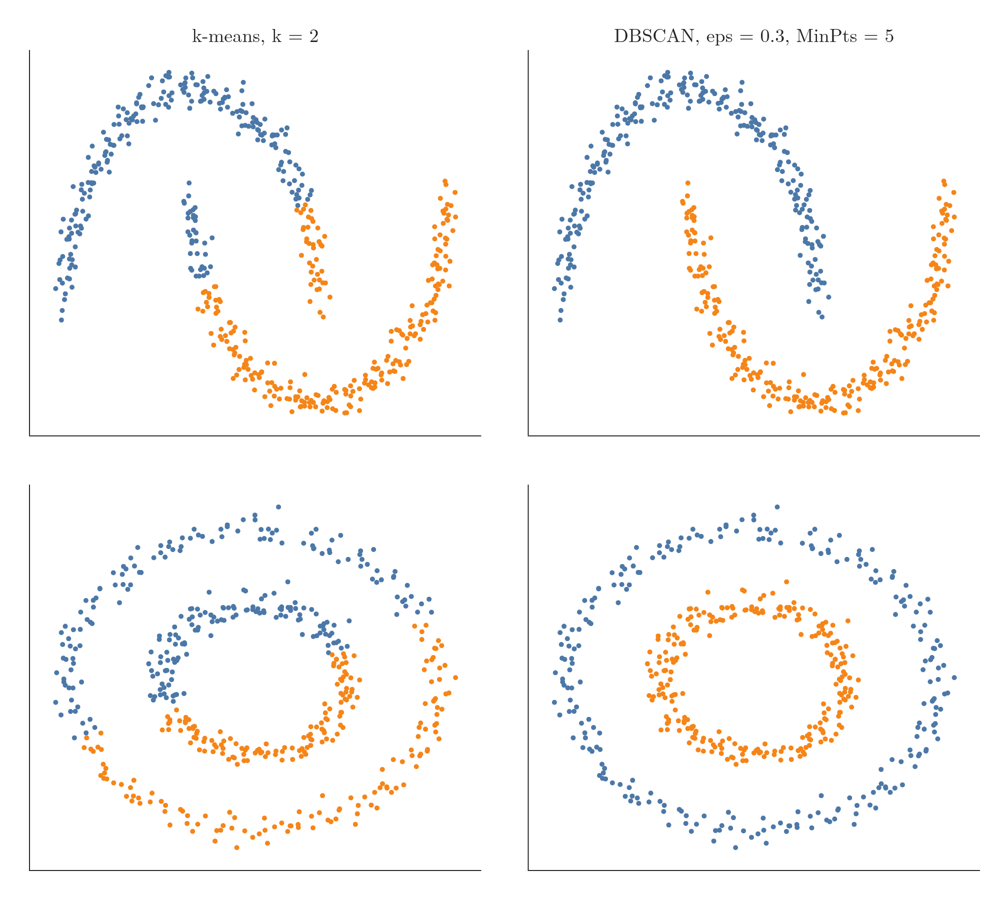
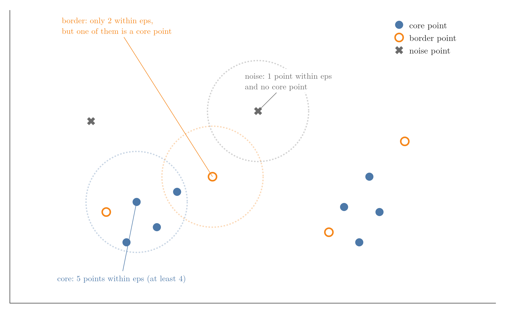
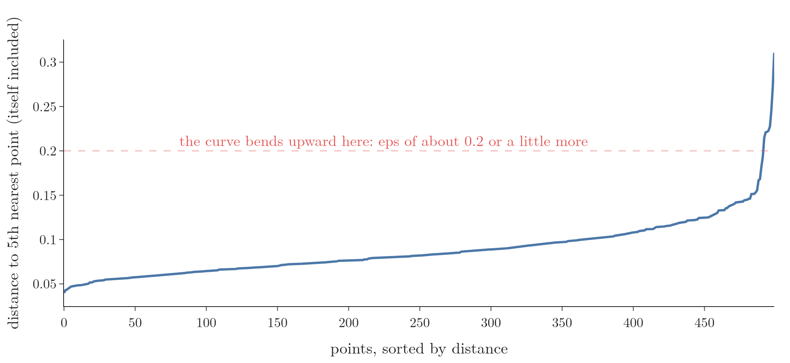

<!-- where-this-fits: generated by course_map/build_map.py; edit concepts.yaml, not this block -->
> **Where this fits:** Pipeline map step 8 (Model). See the [Course map](../01-course-map/note.md).
>
> 
>
> - **Builds on:** Unsupervised learning ([Note 3](../03-types-of-ml/note.md)).
> - **Compare with:** K-means ([Note 130](../130-kmeans-from-scratch/note.md)); Hierarchical clustering ([Note 131](../131-hierarchical-clustering/note.md)).
<!-- /where-this-fits -->

## 1. Overview

> **Key point:** DBSCAN grows clusters through dense regions of points and labels points in sparse regions as noise. It finds the number of clusters by itself and handles any shape, but needs two well-chosen settings: eps and MinPts.

**DBSCAN** (density-based spatial clustering of applications with noise) is a clustering algorithm that groups points lying in dense regions and marks lonely points as noise. Figure 1 shows why it matters: on two moons and two circles, k-means cuts straight across the shapes, while DBSCAN finds them exactly.

{height=50%}

This Note covers why k-means is not enough, the two settings eps and MinPts, the three kinds of points, the algorithm step by step, DBSCAN in scikit-learn, and its strengths and weaknesses. The Notebook (`notebook.ipynb`) runs every example, and `app.py` lets us move eps and MinPts with sliders.

## 2. Prerequisites

- k-means and the elbow method: the [k-means Note](../128-kmeans-intuition/note.md).
- Where k-means fails on odd shapes: the [hierarchical clustering Note](../131-hierarchical-clustering/note.md), section 3.
- What outliers are and why they matter: the [outliers Note](../41-what-are-outliers/note.md).

## 3. Why k-means is not enough

> **Key point:** k-means needs k in advance, is pulled around by outliers, and only finds round clusters.

k-means is a good algorithm, but it has three flaws serious enough to need another one.

### 3.1 We must choose k

> **Key point:** In high dimensions we cannot see the clusters, and the elbow curve is often ambiguous.

k-means must be told the number of clusters before it starts. With 10 columns we cannot plot the data to count them. The elbow method helps (the [k-means Note](../128-kmeans-intuition/note.md), section 6), but on real data the elbow curve often has no clear bend, and then we are guessing.

### 3.2 Outliers pull the centroids

> **Key point:** A centroid is a mean, and one far-away point moves a mean a lot.

k-means computes distances from every point to every centroid and places each centroid at the mean of its points. A mean is sensitive to outliers (the [outliers Note](../41-what-are-outliers/note.md)). Nine points centred on (0, 0) have their mean at (0, 0). Add one outlier at (20, 20) and the mean jumps to (2, 2), outside the group it should describe.

Every point must also belong to some cluster, so the outlier itself is forced into a group where it does not belong.

### 3.3 Only round clusters

> **Key point:** k-means is centroid-based, so it finds spherical groups and fails on rings, crescents and other shapes.

k-means is a **centroid-based** clustering algorithm: everything revolves around centroids. Such an algorithm finds compact, round groups. On non-spherical data it fails completely, as the hierarchical clustering Note showed on circles, moons and stretched groups (its section 3), and as Figure 1 shows here.

So k-means works well on some datasets and badly on many others. DBSCAN addresses all three flaws.

## 4. Density-based clustering

> **Key point:** Clusters are dense regions of points separated by sparse regions; we find the dense regions and call each one a cluster.

**Density-based clustering** groups points by how densely they are packed. In a dataset with two groups, the inside of each group is a **dense region**: many points close together. Between the groups lies a **sparse region** with few points. The sparse region is what separates the two dense regions into two clusters.

This idea does not care about shape. A dense crescent is a cluster just as much as a dense round blob. DBSCAN is the best-known density-based algorithm; another one is **OPTICS**.

The name DBSCAN lists its features: **density-based**, **spatial** (it works on points in space), **clustering of applications with noise** (it labels noise points as noise).

## 5. Measuring density: eps and MinPts

> **Key point:** Around a point, draw a circle of radius eps and count the points inside; if there are at least MinPts, the region is dense.

DBSCAN measures density around each point with two settings:

- **eps** (epsilon): a distance. The circle of radius eps around a point is its **eps-neighbourhood**. The unit is that of the data: eps = 1 could be 1 centimetre or 1 kilometre.
- **MinPts** (minimum points): how many points the eps-neighbourhood must contain for the region to count as dense.

For example, with eps = 1 and MinPts = 4, we draw a circle of radius 1 around a point and count the points inside, the point itself included. 5 points: dense. 2 points: sparse. Doing this for every point measures the density everywhere.

eps and MinPts are DBSCAN's only two hyperparameters, and choosing them well is most of the work of using it.

> **Extra:** Whether the point itself is counted differs between explanations. The original paper and scikit-learn both count it: with `min_samples=4`, a point needs 3 neighbours within eps, plus itself.

## 6. Core, border and noise points

> **Key point:** Core points sit in dense regions; border points are not dense themselves but lie within eps of a core point; noise points are neither.

Using eps and MinPts, DBSCAN puts every point into one of three types (Figure 2):

- A **core point** has at least MinPts points in its eps-neighbourhood. In Figure 2, with eps = 1 and MinPts = 4, the circled blue point has 5. Core points form the inside of a cluster.
- A **border point** has fewer than MinPts points in its eps-neighbourhood, but at least one of them is a core point. The circled orange point has only 2 (itself and one more), and that other one is a core point. Border points sit on the edge of a cluster.
- A **noise point** is neither: too few points around it, and no core point among them. The circled grey cross has only itself. Noise points are the outliers.

{height=45%}

## 7. Density-connected points

> **Key point:** Two points are density-connected if a chain of core points links them, each step no longer than eps; density-connected points belong to the same cluster.

Two points A and B can be far apart and still belong to the same cluster. What matters is whether we can walk from A to B through the dense region.

A and B are **density-connected** if there is a chain of core points from A to B in which every two neighbouring points of the chain are at most eps apart. Density-connected points go in the same cluster.

The chain breaks in two cases:

- **A gap:** two neighbouring points in the chain are more than eps apart.
- **A non-core point in the middle:** the walk passes through a point that is not a core point. A border point can end a chain but cannot pass it on.

If the chain breaks, A and B are not density-connected and go in different clusters.

## 8. The DBSCAN algorithm step by step

> **Key point:** Label every point; grow one cluster from each unclustered core point through all density-connected core points; attach each border point to its nearest core point's cluster; leave noise alone.

Figure 3 runs DBSCAN on 14 points with eps = 1 and MinPts = 4.

0. **Choose eps and MinPts.**
1. **Label every point** as core, border or noise (Figure 3, top left).
2. **Grow the clusters.** Take a core point that is not yet in a cluster and start a new cluster with it. Add every core point that is density-connected to it. When no more core points can be added, the cluster is complete; take the next unclustered core point and start the next cluster (top right).
3. **Attach the border points.** Each border point joins the cluster of its nearest core point (bottom left).
4. **Leave the noise.** Noise points join no cluster (bottom right).

{height=48%}

The result is 2 clusters and 2 noise points. Nobody told DBSCAN there were 2 clusters: the density of the points decided.

> **Extra:** scikit-learn does step 3 slightly differently: a border point joins the cluster of whichever core point reaches it first while the cluster grows, not necessarily the nearest one. A border point within eps of two clusters can therefore land in either. The core points and noise points are always the same.

## 9. DBSCAN in scikit-learn

> **Key point:** `DBSCAN(eps, min_samples).fit(X)`; the result is in `labels_`, where noise gets the label -1.

### 9.1 A six-point example

> **Key point:** With eps = 3 and min_samples = 2, six points give two clusters and one noise point.

scikit-learn calls the two settings `eps` and `min_samples` (MinPts). After `fit`, the attribute `labels_` holds the cluster of every point, and **noise points get the label -1**.

> **Python:** DBSCAN on six points.
>
> ```python
> import numpy as np
> from sklearn.cluster import DBSCAN
>
> X = np.array([[1, 2], [2, 2], [2, 3],
>               [8, 7], [8, 8], [25, 80]])
> db = DBSCAN(eps=3, min_samples=2).fit(X)
> db.labels_                # [ 0,  0,  0,  1,  1, -1]
> db.core_sample_indices_   # [0, 1, 2, 3, 4]
> ```
>
> `core_sample_indices_` lists which points are core points. scikit-learn's defaults are `eps=0.5` and `min_samples=5`; the right values always depend on the data.

The first three points form cluster 0, the next two cluster 1, and the far-away point (25, 80) is noise (Figure 4, left).


### 9.2 Changing min_samples and eps

> **Key point:** A larger min_samples turns small groups into noise; a larger eps merges groups.

- **min_samples = 3** (Figure 4, middle): (8, 7) and (8, 8) have only 2 points within eps, so neither is a core point, and neither is near one. Both become noise. Only the first three points remain a cluster.
- **eps = 10, min_samples = 3** (Figure 4, right): the bigger circle around (2, 3) reaches (8, 7), 7.2 away. The two groups become one cluster of five points. (25, 80) is still noise.

### 9.3 Shapes k-means cannot handle

> **Key point:** On the circles DBSCAN recovers both rings exactly; k-means does no better than chance.

Figure 1 compares k-means and DBSCAN (eps = 0.3, min_samples = 5, on standardized data). We can score each result by how well it matches the true groups, with the adjusted Rand score (1 = identical, 0 = no better than chance):

| Data | k-means | DBSCAN |
|---|---|---|
| Two moons | 0.49 | 1.00 |
| Two circles | 0.00 | 1.00 |

DBSCAN does not care about the shape or size of a cluster, only about density.

## 10. Strengths of DBSCAN

> **Key point:** Robust to outliers, no k to choose, any cluster shape, and only two hyperparameters.

- **Robust to outliers:** noise points are detected and labelled -1 instead of being forced into a cluster. This makes DBSCAN useful for anomaly detection (the [types of ML Note](../03-types-of-ml/note.md)).
- **No k:** DBSCAN finds the number of clusters by itself. In Figure 3 it found 2 without being told.
- **Any shape:** clusters can be rings, crescents or any other shape, because only density matters.
- **Few settings:** just two hyperparameters, eps and MinPts.

## 11. Weaknesses of DBSCAN

> **Key point:** It is sensitive to eps and MinPts, fails when clusters have different densities, and cannot predict the cluster of a new point.

### 11.1 Sensitive to its hyperparameters

> **Key point:** Small changes in eps or MinPts can change the clustering a lot.

Section 9.2 showed it on six points: one change in `min_samples` or `eps` gave a completely different result. We must choose both values with care, and try several.

### 11.2 Clusters of different density

> **Key point:** One eps cannot suit a tightly packed cluster and a loosely spread one at the same time.

Figure 5 has a tightly packed group on the left and a loosely spread group on the right. eps is a single value for the whole dataset:

- **Small eps (0.3):** right for the dense group, but most of the sparse group (93 of its 100 points) becomes noise.
- **Large eps (0.8):** right for the sparse group, but now the two groups merge into one cluster.

{height=34%}

### 11.3 No predictions for new points

> **Key point:** DBSCAN only labels the data it was trained on; scikit-learn's `DBSCAN` has no `predict` method.

DBSCAN labels the points it was given and stops. If a new point arrives tomorrow, it cannot say which cluster the point belongs to: we would have to add the point and run the whole algorithm again, because the new point may itself change which points are core points. So scikit-learn offers `fit` and `fit_predict`, but no `predict`.

## 12. Choosing eps: the k-distance plot

> **Key point:** For every point, measure the distance to its MinPts-th nearest point, sort these distances, and put eps where the curve bends upward.

> **Extra:** A common way to choose eps:
>
> 1. Fix MinPts first. A frequent rule of thumb is at least the number of columns plus 1; for 2-D data, 4 or 5.
> 2. For every point, compute the distance to its MinPts-th nearest point (counting the point itself, as scikit-learn does).
> 3. Sort these distances and plot them (Figure 6).
>
> Points inside clusters have small distances; noise points have large ones. The curve stays low and then shoots up. A value of eps near the bend makes most points core or border points and leaves the rest as noise. On the standardized moons, the bend is at about 0.2, and any eps from 0.2 to 0.4 gives the two moons exactly.
>
> ```python
> from sklearn.neighbors import NearestNeighbors
>
> dist, _ = NearestNeighbors(n_neighbors=5).fit(X).kneighbors(X)
> k_dist = np.sort(dist[:, -1])   # distance to the 5th nearest point
> ```

{height=36%}

## 13. Experimenting with eps and MinPts

> **Key point:** The best way to build intuition is to move eps and MinPts and watch the clusters change.

`app.py`, in this Note's folder, is a small Dash app. Run `python app.py` and open `http://127.0.0.1:8050`. Choose a dataset and move the two sliders; the plot shows the clusters, the noise points and their counts.

Things to try:

- **Two moons, eps from 0.05 to 1.0:** many tiny clusters and much noise, then the two moons, then one big cluster.
- **Three groups plus noise:** find settings where the scattered points become noise and the three groups stay separate.
- **Two densities:** try to find one eps that gives both groups. There is none, which is section 11.2.
- **Any dataset, min_samples from 2 to 20:** larger values call more points noise.

> **Extra:** An online DBSCAN visualiser by Naftali Harris animates the algorithm on about ten datasets, including a smiley face, with sliders for eps and MinPts. It shows the circles spreading from point to point as each cluster grows.

## 14. Summary

| | k-means | DBSCAN |
|---|---|---|
| Idea | centroid-based | density-based |
| Number of clusters | must be given (k) | found automatically |
| Cluster shapes | round only | any shape |
| Outliers | pull centroids; forced into clusters | labelled noise (-1) |
| Clusters of different density | fine | fails: one eps for all |
| Predict new points | yes (`predict`) | no |
| Settings | k | eps, MinPts (`min_samples`) |

- A core point has at least MinPts points within eps (itself included); a border point has fewer but is within eps of a core point; everything else is noise.
- Points linked by a chain of core points, each step at most eps, are density-connected and share a cluster.
- Algorithm: label points, grow clusters from core points, attach border points, leave noise.
- In scikit-learn: `DBSCAN(eps, min_samples).fit(X).labels_`, with -1 for noise.
- Choose eps with care, for example from the bend of the k-distance plot.

## 15. Key terms

| Term | Meaning |
|---|---|
| DBSCAN | Density-based spatial clustering of applications with noise: clusters dense regions and labels lonely points as noise |
| Centroid-based clustering | Clustering built around centroids, such as k-means |
| Density-based clustering | Clustering that finds dense regions of points separated by sparse regions |
| Dense region, sparse region | An area with many points close together; an area with few points |
| eps (epsilon) | The radius of the neighbourhood DBSCAN examines around each point |
| eps-neighbourhood | All points within distance eps of a point |
| MinPts (min_samples) | The number of points an eps-neighbourhood needs for the point to be a core point |
| Core point | A point with at least MinPts points within eps |
| Border point | A point with fewer than MinPts points within eps, but with a core point among them |
| Noise point | A point that is neither core nor border; DBSCAN labels it -1 |
| Density-connected | Linked by a chain of core points with every step at most eps |
| OPTICS | Another density-based clustering algorithm |
| k-distance plot | Sorted distances from every point to its k-th nearest point, used to choose eps |
