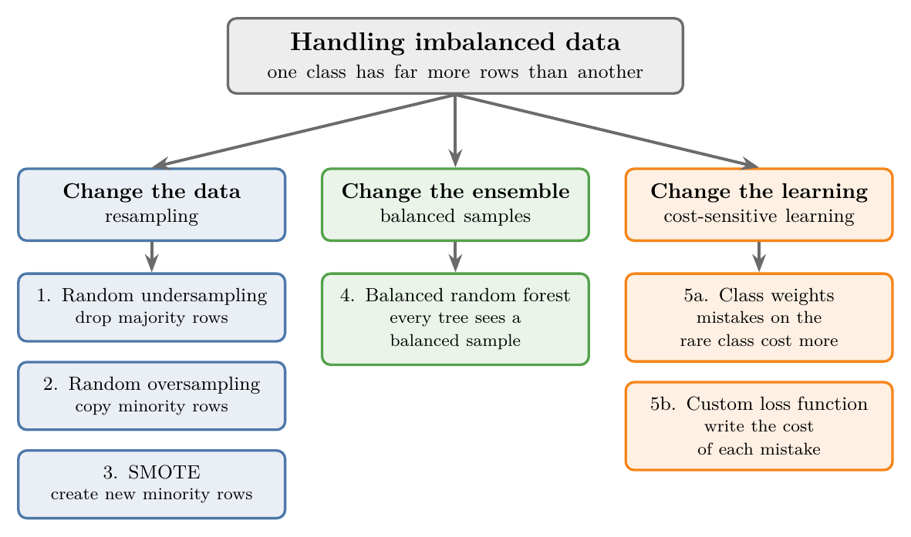
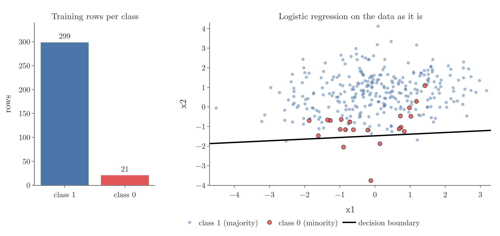
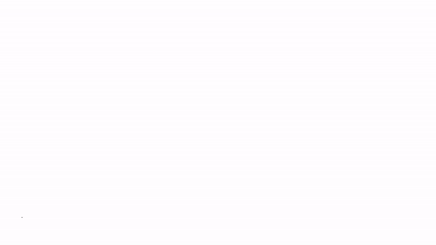
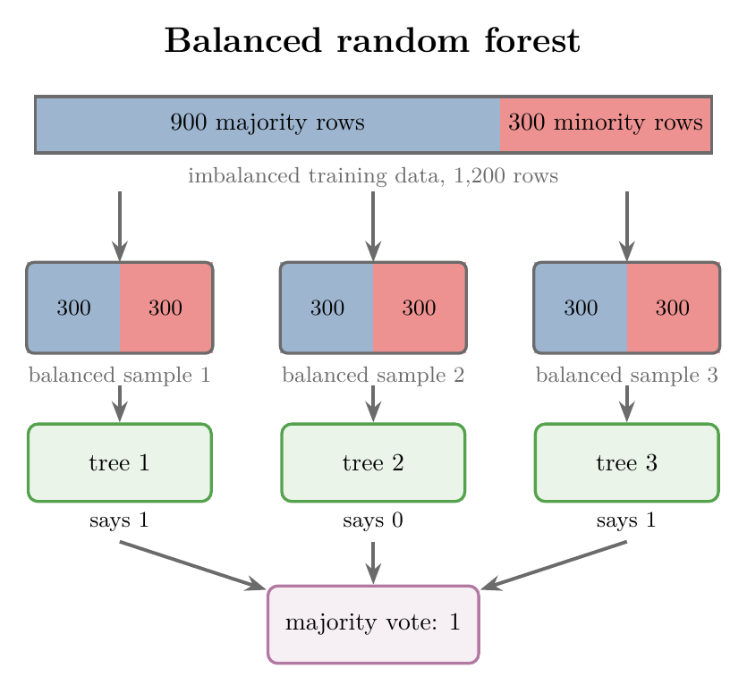
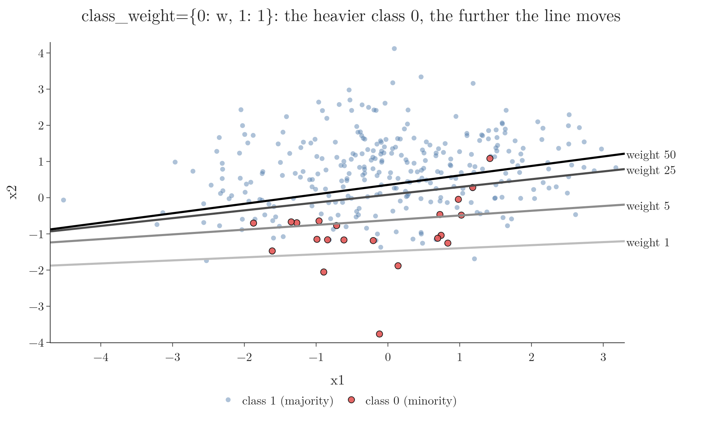

<!-- where-this-fits: generated by course_map/build_map.py; edit concepts.yaml, not this block -->
> **Where this fits:** Pipeline map steps 3 (Understand data), 5 (Engineer features), 8 (Model). See the [Course map](../01-course-map/note.md).
>
> 
>
> - **Builds on:** Log loss (binary cross entropy) ([Note 73](../73-log-loss/note.md)); ROC curve and AUC ([Note 78](../78-roc-auc/note.md)); K-nearest neighbours ([Note 91](../91-knn/note.md)); Random forest ([Note 114](../114-feature-importance/note.md)); Cross-validation ([Note 127](../127-stacking-blending/note.md)).
<!-- /where-this-fits -->

## 1. Overview

> **Key point:** When one class is rare, a model learns mostly the common class; we fix this by changing the data, the ensemble, or the cost of mistakes.

{height=40%}

Imbalanced data was defined in the [accuracy Note](../76-accuracy-confusion-matrix/note.md), section 6: data in which one class is much rarer than another. This Note shows what goes wrong when we train on it and teaches the five techniques of Figure 1:

- **Change the data** (resampling): random undersampling, random oversampling, SMOTE.
- **Change the ensemble:** the balanced random forest.
- **Change the learning** (cost-sensitive learning): class weights and a custom loss function.

The Notebook (`notebook.ipynb`) runs every technique on the same dataset.

## 2. What imbalanced data looks like

> **Key point:** One class (the majority) has far more rows than another (the minority); this happens with two classes or with many.

Take a college where we know each student's CGPA and IQ and whether they were placed. At a top college, most students are placed: out of 500 final-year students, perhaps 450 placed and 50 not. Placed is the **majority class**, the class with many rows; not placed is the **minority class**, the rare one.

The same can happen with three or more classes. Suppose 10 more students did not sit for placements at all, a third class. The data now has one large class and two small ones, and it is still imbalanced.

### 2.1 Our dataset

> **Key point:** 400 rows, two inputs, about 7% in class 0; the training set has 299 rows of class 1 and only 21 of class 0.

To see the effects, we use a synthetic dataset made with scikit-learn's `make_classification`: 400 rows, two inputs `x1` and `x2`, and two classes. Class 1 is the majority and class 0 the minority. After an 80/20 split, the training set has 320 rows (299 of class 1, 21 of class 0) and the test set 80 rows (73 and 7).

> **Python:** Making an imbalanced dataset.
>
> ```python
> from sklearn.datasets import make_classification
>
> X, y = make_classification(
>     n_samples=400, n_features=2, n_informative=2,
>     n_redundant=0, n_clusters_per_class=2,
>     weights=[0.07], class_sep=0.8, flip_y=0,
>     random_state=59)
> ```
>
> `weights=[0.07]` puts about 7% of the rows in class 0. `n_clusters_per_class=2` gives each class two blobs, so no straight line separates them well.

## 3. Two problems with imbalanced data

> **Key point:** The model becomes biased towards the majority class, and accuracy hides it.

### 3.1 Bias towards the majority class

> **Key point:** The algorithm sees mostly majority rows, so it learns them well and the minority badly.

A model learns from the rows it sees. With 299 rows of class 1 and 21 of class 0, almost all of the training signal is about class 1. The model learns to get class 1 right and pays little attention to class 0.

{width=100%}

Figure 2 shows the result for logistic regression. The decision boundary sits low, below almost all the red points. The model keeps every blue point on the correct side and gives up on most of the red ones: it is **biased towards the majority class**.

### 3.2 Accuracy is not reliable

> **Key point:** The model in Figure 2 has 92.5% accuracy but finds only 1 of the 7 minority rows in the test set.

The classification report of the model in Figure 2, on the 80 test rows:

| Class | Precision | Recall | F1 | Rows |
|---|---|---|---|---|
| 0 (minority) | 1.00 | **0.14** | 0.25 | 7 |
| 1 (majority) | 0.92 | 1.00 | 0.96 | 73 |
| Accuracy | | | **0.925** | 80 |

The accuracy, 92.5%, looks excellent. The recall of class 0 is 0.14: of the 7 minority rows, the model found only 1. If class 0 is the class we care about, this model is nearly useless.

A "dumb" model that always answers class 1 already scores 73 / 80 = 91.25% here, the same trap as in the [accuracy Note](../76-accuracy-confusion-matrix/note.md), section 6. So on imbalanced data we judge models by the minority class's precision, recall and F1 ([precision Note](../77-precision-recall-f1/note.md)) and by ROC AUC ([ROC Note](../78-roc-auc/note.md)).

> **Python:** The classification report.
>
> ```python
> from sklearn.linear_model import LogisticRegression
> from sklearn.metrics import classification_report
>
> clf = LogisticRegression().fit(X_train, y_train)
> print(classification_report(y_test, clf.predict(X_test)))
> ```

## 4. Why imbalanced data matters

> **Key point:** Many of the problems classical ML is used for are imbalanced, and in most of them the rare class is the one we need to find.

| Domain | Problem | The rare class |
|---|---|---|
| Finance | fraud detection | fraudulent transactions |
| Finance | credit risk assessment | customers who will not repay a loan |
| Healthcare | rare disease prediction | patients who have the disease (say 1%) |
| Manufacturing | predicting machine failure | machines about to break down |
| Consumer internet | churn prediction | users who will leave the platform next month |
| Environmental science | earthquake or volcano prediction | days with an eruption or quake |

In every row, predicting the minority class correctly is the whole point. A model that is biased towards the majority, like the one in Figure 2, fails exactly where it matters.

## 5. Random undersampling

> **Key point:** Randomly drop majority rows until both classes have the same number of rows.

The simplest fix is to make the data balanced. **Random undersampling** keeps every minority row and draws, at random and without replacement, the same number of majority rows. The other majority rows are thrown away.

With 900 majority and 100 minority rows, we keep 100 random majority rows and all 100 minority rows: 200 rows instead of 1,000. On our training set, 320 rows (299 + 21) become **42** rows (21 + 21).

> **Python:** Random undersampling with the imbalanced-learn library.
>
> ```python
> import numpy as np
> from imblearn.under_sampling import RandomUnderSampler
>
> rus = RandomUnderSampler(random_state=42)
> X_under, y_under = rus.fit_resample(X_train, y_train)
> X_under.shape           # (42, 2)
> np.bincount(y_under)    # [21, 21]
> ```
>
> **imbalanced-learn** (imported as `imblearn`) collects the techniques of this Note behind one method, `fit_resample`, which returns the new inputs and labels. `np.bincount` counts how many labels are 0, 1, and so on.

{width=100%}

Figure 3, left, shows the 42 rows and the new boundary. Logistic regression now treats both classes as equally important, and the line moves up through the middle of the data. The minority recall on the test set rises from 0.14 to **1.00** (all 7 found), while the minority precision falls from 1.00 to 0.33: the model now also flags many majority rows as class 0.

> **Extra:** A straight line cannot separate this data well, because each class has two blobs. Undersampling fixes the bias, not the shape of the boundary; an algorithm that draws curved boundaries, such as a random forest, may do better.

**Advantages:**

- It removes the bias towards the majority class.
- The data gets smaller, so training is faster. With 10 lakh majority and 1 lakh minority rows, we train on 2 lakh rows instead of 11 lakh.

**Disadvantages:**

- We throw data away: here 278 of 320 rows. Those rows may hold information the model needs.
- The sample can be unrepresentative. A random sample is usually fine, but by bad luck it can keep one kind of majority row and drop another.

## 6. Random oversampling

> **Key point:** Randomly copy minority rows until both classes have the same number of rows.

**Random oversampling** goes the other way: keep every row and draw minority rows at random *with replacement* until the minority is as large as the majority. With 900 and 100 rows, we draw 900 minority rows from the 100, so each one appears 9 times on average.

On our training set, 320 rows become **598** (299 + 299). Each of the 21 minority rows now appears between 9 and 21 times. In a scatter plot the copies sit exactly on top of each other, which is why Figure 3, middle, draws each repeated row as one dot whose size grows with the number of copies.

> **Python:** Random oversampling.
>
> ```python
> from imblearn.over_sampling import RandomOverSampler
>
> ros = RandomOverSampler(random_state=42)
> X_over, y_over = ros.fit_resample(X_train, y_train)
> np.bincount(y_over)     # [299, 299]
> ```

The boundary moves up much as with undersampling (Figure 3, middle). The minority recall rises to **0.86** (6 of 7) and the precision falls to 0.32.

**Advantage:** it removes the bias towards the majority class without throwing any data away.

**Disadvantages:**

- The data grows: here from 320 to 598 rows. A 1 GB dataset can become nearly 2 GB.
- Copies are not new information. A row repeated 21 times looks very important to the algorithm, which can **overfit** to it. Decision trees suffer most: they can build a leaf around each repeated point.

## 7. SMOTE

> **Key point:** Instead of copying minority rows, create new ones on the line between a minority row and one of its minority neighbours.

**SMOTE** (Synthetic Minority Over-sampling Technique) is the most popular technique for imbalanced data. It is an oversampling technique: it grows the minority class until the classes are equal. The difference is that it makes new rows instead of copies, so the model does not see the same point again and again.

### 7.1 Interpolation

> **Key point:** A new point is placed a random fraction of the way from a minority point to its neighbour.

SMOTE creates rows by **interpolation**: placing a new point on the straight segment between two existing points.

**The new point, step by step:**

1. **In words:** start at the minority point $x$; move a random fraction $\lambda$ (between 0 and 1) of the way towards its neighbour $n$.
2. **Formula:**
   $$x_{\text{new}} = x + \lambda \, (n - x), \qquad 0 \le \lambda \le 1$$
   With $\lambda = 0$ the new point is $x$ itself; with $\lambda = 1$ it is the neighbour. The same formula is often written $x - \lambda\,(x - n)$.
3. **Example:** $x = (1, 1)$, $n = (2, 2)$ and $\lambda = 0.5$:
   $$x_{\text{new}} = (1, 1) + 0.5 \times \big((2, 2) - (1, 1)\big) = (1, 1) + (0.5, 0.5) = (1.5, 1.5)$$
   The new point lies exactly halfway between the two.

### 7.2 The algorithm

> **Key point:** Find each minority point's 5 nearest minority neighbours, then repeat: random point, random neighbour, random fraction, new point.

{width=100%}

Figure 4 shows the steps:

1. Take only the minority rows, and find the $k$ nearest minority neighbours of each one, usually $k = 5$ (a KNN search, as in the [KNN Note](../91-knn/note.md)).
2. Pick a minority point at random.
3. Pick one of its $k$ neighbours at random.
4. Draw a random $\lambda$ between 0 and 1 and create the new point $x + \lambda\,(n - x)$.
5. Repeat steps 2 to 4 until the minority class is as large as the majority.

> **Python:** SMOTE written by hand in a few lines of NumPy, to see every step.
>
> ```python
> from sklearn.neighbors import NearestNeighbors
>
> def smote(X, y, k=5, seed=42):
>     rng = np.random.default_rng(seed)
>     mino = X[y == 0]
>     # step 1: k nearest minority neighbours
>     # (k + 1, since each point is its own nearest)
>     nn = NearestNeighbors(n_neighbors=k + 1).fit(mino)
>     nbrs = nn.kneighbors(mino, return_distance=False)
>     nbrs = nbrs[:, 1:]
>     n_new = (y == 1).sum() - len(mino)
>     i = rng.integers(len(mino), size=n_new)    # step 2
>     j = nbrs[i, rng.integers(k, size=n_new)]   # step 3
>     lam = rng.random((n_new, 1))               # step 4
>     new = mino[i] + lam * (mino[j] - mino[i])
>     return (np.vstack([X, new]),
>             np.r_[y, np.zeros(n_new)])
> ```
>
> `rng.integers(21, size=278)` draws 278 random positions at once, so all new points are made in one go instead of in a loop.

> **Python:** SMOTE with imbalanced-learn, the version we use in practice.
>
> ```python
> from imblearn.over_sampling import SMOTE
>
> sm = SMOTE(k_neighbors=5, random_state=42)
> X_smote, y_smote = sm.fit_resample(X_train, y_train)
> new = X_smote[len(X_train):]   # the 278 synthetic rows
> ```
>
> imbalanced-learn builds each new point exactly as our function does: a random minority point, one of its `k_neighbors` nearest minority neighbours, and a random factor between 0 and 1. It returns the original rows first and the synthetic rows after them.

On our data, SMOTE creates 278 new rows: 320 rows become 598 (299 + 299). Figure 3, right, shows them in orange, lying on segments between red points. The boundary moves up again; the minority recall rises to **0.71** (5 of 7) and the precision falls to 0.29.

### 7.3 Advantages and disadvantages

> **Key point:** SMOTE reduces bias without copies, but it fails on categorical columns, is slow on big data, depends on k, spreads outliers and may invent unrealistic rows.

**Advantages:**

- It reduces the bias towards the majority class.
- There are no duplicates, so there is less risk of overfitting than with random oversampling.

SMOTE is popular, but whether to use it is much debated, because of five disadvantages:

1. **It cannot handle categorical columns.** Interpolating between category 0 and category 1 can give 0.7, which is not a category (Figure 5, left).
2. **It is slow on large data.** It needs a nearest-neighbour search, which measures many distances and becomes slow with many rows or many columns.
3. **It depends on $k$.** With $k = 1$, every new point lies on the segment to the single nearest neighbour, so the new points have little variety. With a very large $k$, neighbours can be far away and new points appear all over the feature space. The middle is hard to find; $k = 5$ is the usual default, but the best value depends on the data.
4. **It is sensitive to outliers.** A noisy minority point far from the others gets picked too, and the segments to its neighbours cross the majority region, so one noisy row creates more noisy rows (Figure 5, right). Our own data shows this: the red outlier at the bottom of Figure 3, right, pulls a trail of orange points down with it.
5. **The new rows may not be realistic.** Nothing guarantees that the invented points follow the true distribution of the population. They follow the straight lines between existing points, which real data may not.

{width=90%}

> **Extra:** imbalanced-learn has variants that fix some of these problems. `SMOTENC` handles a mix of numeric and categorical columns (for a categorical column it takes the most common category among the neighbours instead of interpolating). `BorderlineSMOTE` creates points only near the class boundary, and `ADASYN` creates more points where the minority is hardest to learn.

### 7.4 Resampling only the training data

> **Key point:** Resample after the split, and inside each cross-validation fold; resampling first makes the scores look far better than they are.

We resample **only the training set**, after the train-test split. The test set must keep its real class balance, or the scores no longer describe real data. And SMOTE points made from test rows would leak test information into training (data leakage, the [toy project Note](../13-toy-project/note.md)).

The same holds inside cross-validation ([pipelines Note](../29-pipelines/note.md)). If we run SMOTE on the whole training set and then cross-validate, a synthetic point and the two real points it was made from can land in different folds. The model is then validated on near-copies of rows it was trained on.

imbalanced-learn's own `Pipeline` fixes this: it runs the resampler only while fitting, so each fold resamples its own training part and validates on untouched rows. On our training set, with 5-fold cross-validation and the F1 score of class 0:

| Setup | Cross-validated F1 (class 0) |
|---|---|
| No resampling | 0.200 |
| SMOTE inside an imblearn `Pipeline` (correct) | **0.426** |
| SMOTE on all rows, then cross-validation (leaky) | 0.885 |

The leaky setup reports more than twice the honest score.

> **Python:** SMOTE inside cross-validation.
>
> ```python
> from imblearn.pipeline import Pipeline
> from sklearn.metrics import f1_score, make_scorer
> from sklearn.model_selection import (StratifiedKFold,
>                                      cross_val_score)
>
> pipe = Pipeline([("smote", SMOTE(random_state=42)),
>                  ("model", LogisticRegression())])
> cv = StratifiedKFold(n_splits=5, shuffle=True,
>                      random_state=42)
> f1_minority = make_scorer(f1_score, pos_label=0)
> cross_val_score(pipe, X_train, y_train, cv=cv,
>                 scoring=f1_minority).mean()   # 0.426
> ```
>
> scikit-learn's own `Pipeline` cannot hold a resampler, because it only knows `fit`/`transform` steps. `StratifiedKFold` keeps the class ratio the same in every fold, so each fold gets some of the 21 minority rows. `make_scorer(f1_score, pos_label=0)` scores the F1 of class 0 instead of class 1.

## 8. Ensemble methods: the balanced random forest

> **Key point:** A balanced random forest trains every tree on a balanced sample: the minority rows (or a bootstrap sample of them) plus the same number of random majority rows.

Ensemble methods ([ensemble learning Note](../101-ensemble-learning/note.md)) such as bagging and random forests can be changed to handle imbalanced data. A random forest ([random forest Note](../108-random-forest-intro/note.md)) trains many decision trees, each on a random sample of the rows, and combines their votes. A **balanced random forest** changes only how each sample is drawn: every sample is balanced, even though the data is not.

{height=42%}

In Figure 6, the training data has 900 majority and 300 minority rows. Each sample takes 300 minority rows and 300 majority rows drawn at random, 600 rows in all, and one tree is trained on it. To predict, every tree votes and the majority vote wins: here 1, 0 and 1 give 1.

Undersampling (section 5) threw most majority rows away for good. Here each tree throws different rows away, so together the trees still see most of the majority class.

> **Python:** A balanced random forest with imbalanced-learn.
>
> ```python
> from imblearn.ensemble import BalancedRandomForestClassifier
>
> brf = BalancedRandomForestClassifier(
>     n_estimators=100, random_state=42)
> brf.fit(X_train, y_train)
> y_pred = brf.predict(X_test)
> ```
>
> It is used like any scikit-learn classifier. By default (`sampling_strategy="all"`, `replacement=True`), every tree gets 21 rows of each class, drawn with replacement: a bootstrap sample of the minority and an equally small random sample of the majority.

On our data, the balanced forest finds 5 of the 7 minority test rows (recall **0.71**, precision 0.28). An ordinary random forest finds 3 (recall 0.43, precision 0.50).

> **Extra:** imbalanced-learn has other balanced ensembles: `BalancedBaggingClassifier` (bagging with a resampler on every sample), `EasyEnsembleClassifier` (boosted models on balanced samples) and `RUSBoostClassifier` (boosting with random undersampling at every round).

## 9. Cost-sensitive learning

> **Key point:** Leave the data alone and change the learning itself, so that mistakes on the minority class cost more.

**Cost-sensitive learning** changes how the algorithm learns, so that it handles imbalanced data better. There are two ways: class weights, and a custom loss function.

### 9.1 Class weights

> **Key point:** Give the minority class a bigger weight; each of its mistakes then adds more to the loss, and the model works harder to avoid them.

`class_weight` was introduced in the [logistic regression hyperparameters Note](../81-logistic-hyperparameters/note.md), section 5.1: it multiplies each row's loss by a weight for its class. Here we set the weights by hand.

With 900 rows of class 1 and 100 rows of class 0, we might give class 0 a weight of 10 and class 1 a weight of 1. Every mistake on class 0 then costs 10 times as much. For an algorithm trained by gradient descent ([gradient descent Note](../57-gradient-descent/note.md)), those mistakes produce 10 times larger updates, so the parameters move more to correct them.

> **Python:** Class weights in logistic regression.
>
> ```python
> clf = LogisticRegression(class_weight={0: 5, 1: 1})
> clf.fit(X_train, y_train)
> ```
>
> The dictionary maps each class label to its weight. `class_weight="balanced"` instead sets each weight to (rows) / (2 × rows of that class): here 320 / 42 = 7.62 for class 0 and 320 / 598 = 0.54 for class 1.

{width=90%}

Figure 7 shows the effect. With weight 1 (no weighting), the line sits below the red points; at 5, 25 and 50 it moves further up into the majority class. The bigger the weight, the more pressure on the model to classify the minority correctly:

| Weight of class 0 | Accuracy | Precision (0) | Recall (0) |
|---|---|---|---|
| 1 | 0.925 | 1.00 | 0.14 |
| 5 | 0.900 | 0.44 | 0.57 |
| 25 | 0.788 | 0.29 | 1.00 |
| 50 | 0.700 | 0.23 | 1.00 |

The weight is a dial: raise it and recall rises while precision falls. We pick the value that gives the best result for the problem, for example by cross-validation.

Most scikit-learn classifiers that minimise a loss accept `class_weight`: `LogisticRegression`, `SVC` ([SVM Note](../92-svm-intuition/note.md)), `DecisionTreeClassifier`, `RandomForestClassifier` ([random forest hyperparameters Note](../111-random-forest-hyperparameters/note.md)). KNN and Naive Bayes do not, because they do not learn by minimising a loss.

> **Extra:** Among scikit-learn's boosting models, `HistGradientBoostingClassifier` accepts `class_weight`, but `GradientBoostingClassifier` and `AdaBoostClassifier` do not. For those, pass weights per row through `fit(X, y, sample_weight=...)`, which almost every scikit-learn model accepts.

### 9.2 A custom loss function

> **Key point:** Some libraries (gradient boosting, XGBoost, LightGBM) let us write our own loss, so we can set exactly how much each kind of mistake costs.

The losses we have used so far are standard ones: mean squared error, log loss ([log loss Note](../73-log-loss/note.md)). Some algorithms let us replace them with a **custom loss function** (also called a custom objective) that fits our problem. Suppose missing a minority row (a false negative, if the minority is the positive class) is worse than a false alarm: we write a log loss that charges more for that mistake.

**The weighted log loss, step by step:**

1. **In words:** the usual log loss, but each row's loss is multiplied by the cost of its class: $a$ for rows of class 1, $b$ for rows of class 0.
2. **Formula:** with $p_i$ the predicted probability of class 1,
   $$L = -\frac{1}{n} \sum_{i=1}^{n} \Big[ a \, y_i \log p_i + b \, (1 - y_i) \log (1 - p_i) \Big]$$
3. **Example:** a class 0 row ($y = 0$) that the model gives $p = 0.9$, so only 0.1 for its true class. With $a = 1$, $b = 3.5$:
   $$\text{loss} = -3.5 \times \log(1 - 0.9) = -3.5 \times (-2.303) = 8.06$$
   instead of 2.303 with $b = 1$: the same mistake now costs 3.5 times as much.

To train with a custom loss, a gradient boosting library needs its derivatives with respect to the model's raw output $z$ (where $p = \sigma(z)$, the sigmoid):

$$\frac{\partial L_i}{\partial z_i} = b\,(1 - y_i)\,p_i - a\,y_i\,(1 - p_i), \qquad \frac{\partial^2 L_i}{\partial z_i^2} = p_i (1 - p_i) \big(a\,y_i + b\,(1 - y_i)\big)$$

> **Python:** The custom loss in XGBoost.
>
> ```python
> import xgboost as xgb
>
> def weighted_logloss(a, b):
>     def objective(z, dtrain):
>         y = dtrain.get_label()
>         p = 1 / (1 + np.exp(-z))          # sigmoid
>         grad = b * (1 - y) * p - a * y * (1 - p)
>         hess = p * (1 - p) * (a * y + b * (1 - y))
>         return grad, hess
>     return objective
>
> dtrain = xgb.DMatrix(X_train, label=y_train)
> booster = xgb.train(
>     {"max_depth": 3, "eta": 0.1, "base_score": 0.5},
>     dtrain, num_boost_round=100,
>     obj=weighted_logloss(a=1, b=3.5))
>
> z = booster.predict(xgb.DMatrix(X_test),
>                     output_margin=True)
> p = 1 / (1 + np.exp(-z))     # probability of class 1
> y_pred = (p > 0.5).astype(int)
> ```
>
> A `DMatrix` is XGBoost's own table format. `obj=` replaces XGBoost's built-in loss: at every round it calls our function with the current raw scores `z` and asks for the **gradient** (first derivative) and **Hessian** (second derivative) of each row's loss. With a custom loss, XGBoost does not know how to turn raw scores into probabilities, so we ask for the raw scores (`output_margin=True`) and apply the sigmoid ourselves.

With $b = 1$ (the ordinary log loss), XGBoost finds 2 of the 7 minority test rows. With $b = 3.5$ it finds 3 (recall **0.43**, precision 0.38).

> **Extra:** For logistic regression, this weighted log loss is exactly what `class_weight={0: b, 1: a}` does. A custom loss pays off when the cost is not one number per class (for example the focal loss, which down-weights rows the model already gets right) or in a library without a `class_weight` setting.

## 10. Comparing the techniques

> **Key point:** Every technique raised the minority recall above logistic regression's 0.14, at the cost of precision; which trade is best depends on the problem.

On our data, with 7 minority rows in the test set:

| Technique | Accuracy | Precision (0) | Recall (0) | F1 (0) | ROC AUC |
|---|---|---|---|---|---|
| Logistic regression, as is | 0.925 | 1.00 | 0.14 | 0.25 | 0.906 |
| Random undersampling | 0.825 | 0.33 | 1.00 | 0.50 | 0.924 |
| Random oversampling | 0.825 | 0.32 | 0.86 | 0.46 | 0.918 |
| SMOTE | 0.825 | 0.29 | 0.71 | 0.42 | 0.910 |
| Random forest, as is | 0.912 | 0.50 | 0.43 | 0.46 | 0.900 |
| Balanced random forest | 0.812 | 0.28 | 0.71 | 0.40 | 0.911 |
| Class weight 5 | 0.900 | 0.44 | 0.57 | 0.50 | 0.910 |
| XGBoost, ordinary log loss | 0.912 | 0.50 | 0.29 | 0.36 | 0.896 |
| XGBoost, custom loss $b = 3.5$ | 0.888 | 0.38 | 0.43 | 0.40 | 0.886 |

Accuracy fell for every technique, and that is expected: the models now flag some majority rows to catch more minority rows. ROC AUC, which does not depend on the threshold, barely moves; what changes is where the model draws the line.

> **Extra:** With only 7 minority test rows, each one found or missed moves the recall by 0.14, so small differences in this table are noise. On real problems, compare techniques with cross-validation, keeping the resampling inside each fold (section 7.4).

### 10.1 Other techniques

> **Key point:** imbalanced-learn offers many more resamplers and ensembles; its API reference lists them.

The techniques here are the most common. imbalanced-learn has many more, grouped the same way:

- **Undersampling:** `TomekLinks`, `NearMiss`, `EditedNearestNeighbours`, `ClusterCentroids` and others, which choose which majority rows to drop instead of dropping them at random.
- **Oversampling:** `RandomOverSampler`, `SMOTE`, `SMOTENC`, `BorderlineSMOTE`, `SVMSMOTE`, `ADASYN`.
- **Combined:** `SMOTETomek`, `SMOTEENN` (oversample, then clean noisy rows).
- **Ensembles:** `BalancedRandomForestClassifier`, `BalancedBaggingClassifier`, `EasyEnsembleClassifier`, `RUSBoostClassifier`.

## 11. Summary

| Technique | What it does | Good | Bad |
|---|---|---|---|
| Random undersampling | drops random majority rows | less bias, faster training | loses data |
| Random oversampling | copies random minority rows | less bias, keeps all data | bigger data, overfitting |
| SMOTE | creates minority rows by interpolation | less bias, no copies | categorical columns, slow, depends on k, outliers, unrealistic rows |
| Balanced random forest | balanced sample for every tree | uses most of the data | only for tree ensembles |
| Class weights | minority mistakes cost more | one setting, no new data | weight must be tuned |
| Custom loss | any cost we can write | full control | needs derivatives, only some libraries |

- Imbalanced data biases a model towards the majority class, and accuracy hides it: judge by the minority's precision, recall, F1 and ROC AUC.
- Many real problems (fraud, credit risk, rare disease, churn) are imbalanced, and the rare class is the one that matters.
- Resampling changes the data, balanced ensembles change each model's sample, and cost-sensitive learning changes the loss.
- SMOTE creates $x + \lambda\,(n - x)$, a point between a minority row and one of its $k$ nearest minority neighbours.
- Resample only the training data, and inside each cross-validation fold.

## 12. Key terms

| Term | Meaning |
|---|---|
| Majority class | The class with the most rows in imbalanced data |
| Minority class | The rare class in imbalanced data, usually the one we need to find |
| Resampling | Changing the number of rows per class to balance the data |
| Random undersampling | Dropping randomly chosen majority rows until the classes are equal |
| Random oversampling | Copying randomly chosen minority rows until the classes are equal |
| SMOTE | Synthetic Minority Over-sampling Technique: new minority rows by interpolation between minority neighbours |
| Interpolation | Placing a new point on the segment between two existing points |
| Synthetic data | Rows created by an algorithm rather than collected |
| Balanced random forest | A random forest in which every tree is trained on a balanced sample |
| Cost-sensitive learning | Changing the learning so that mistakes on some classes cost more |
| Custom loss function | A loss written by the user, passed to libraries such as XGBoost with its gradient and Hessian |
| imbalanced-learn | A Python library (`imblearn`) of resampling techniques and balanced ensembles, with a `fit_resample` method |
