<!-- where-this-fits: generated by course_map/build_map.py; edit concepts.yaml, not this block -->
> **Where this fits:** Pipeline map step 10 (Tune). See the [Course map](../01-course-map/note.md).
>
> 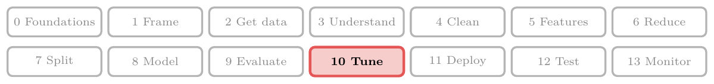
>
> - **Builds on:** Hyperparameter tuning ([Note 118](../118-adaboost-hyperparameters/note.md)); Cross-validation ([Note 127](../127-stacking-blending/note.md)).
> - **Compare with:** Grid and random search ([Note 118](../118-adaboost-hyperparameters/note.md)).
<!-- /where-this-fits -->

## 1. Overview

> **Key point:** Optuna is a hyperparameter tuning library; instead of trying combinations blindly, it uses the results of past trials to choose the next one.

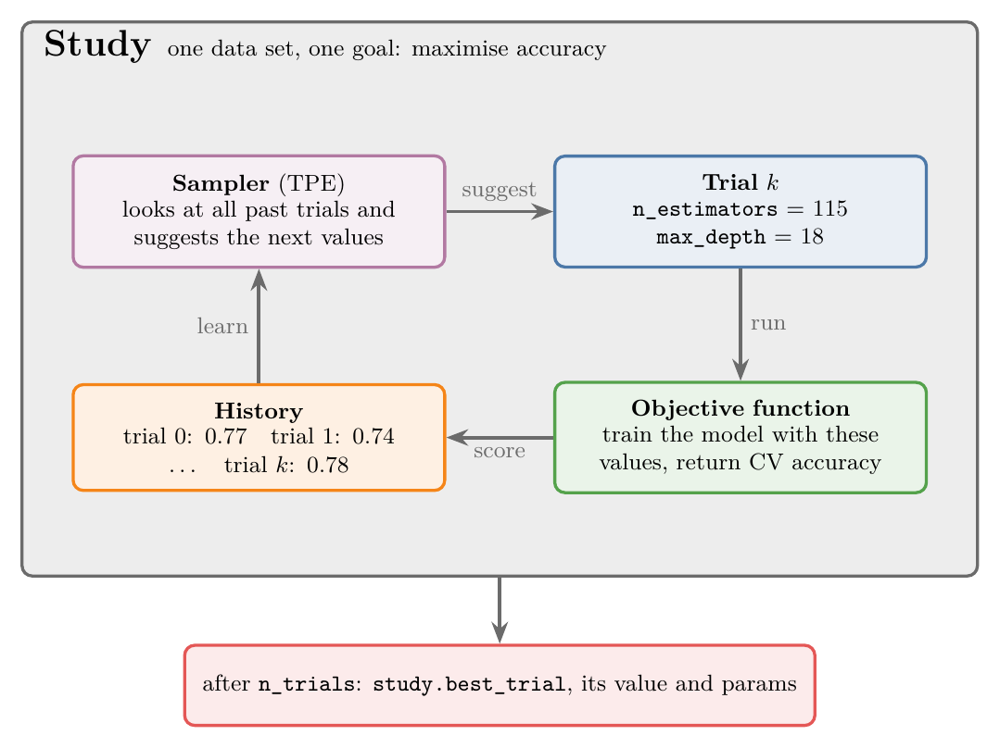{height=45%}

**Optuna** (G-1402) is an open-source Python framework for hyperparameter tuning, used for both machine learning and deep learning. Its main strength is the kind of search it runs: **Bayesian optimisation** (G-270), which learns from every trial where good hyperparameters are likely to be (Figure 1).

This Note covers:

- why grid and random search are not always enough (section 2);
- the idea of Bayesian search (section 3);
- Optuna's vocabulary (section 4) and workflow (section 5);
- its samplers (section 6) and plots (section 7);
- its "define-by-run" search spaces (section 8).

The Notebook (`notebook.ipynb`) runs every Optuna study in this Note, and saves them in `data/optuna.db`.

## 2. Why grid search and random search are not enough

> **Key point:** Grid search trains every combination, which becomes too slow; random search trains a few, which can miss the best one. Neither learns from its earlier trials.

**Hyperparameter** (G-910) tuning, as in the [pipelines Note](../29-pipelines/note.md), tries several hyperparameter values and keeps the best. So far we have done it by **grid search** (G-872) with `GridSearchCV` (the [pipelines Note](../29-pipelines/note.md), section 9) and `RandomizedSearchCV` (the [regression trees Note](../99-regression-trees/note.md), section 7.2); the [random forest tuning Note](../112-random-forest-tuning/note.md) compares them on a forest.

### 2.1 The problem: a random forest for placement

> **Key point:** We want the `max_depth` and `n_estimators` that give the highest accuracy, and we cannot know them in advance.

Take the placement data: predict from a student's CGPA and IQ whether they will be placed, with a random forest. We tune two hyperparameters ([random forest hyperparameters Note](../111-random-forest-hyperparameters/note.md)):

- `max_depth`: how deep each decision tree may grow;
- `n_estimators`: how many trees the forest has.

First we choose a **search space** (G-1756), the values to try, from intuition and domain knowledge: `max_depth` from 1 to 5, and `n_estimators` 50, 100, 150, 200 and 250. These values make a grid of 5 × 5 = 25 combinations.

### 2.2 Both searches are blind

> **Key point:** Grid search pays for every combination; random search can miss the best one; neither learns from its earlier trials.

Grid search would train all 25 models, and the count multiplies with every added value or hyperparameter; random search trains a few, such as 5, and may never draw the best one (the trade-off of the [regression trees Note](../99-regression-trees/note.md), section 7.2, measured on a forest in the [random forest tuning Note](../112-random-forest-tuning/note.md)). Both are "blind": the score of one trial never influences which combination is tried next. Figure 2 shows the two on the 5 × 5 grid: grid search trains every point, random search five points chosen without looking at any score.

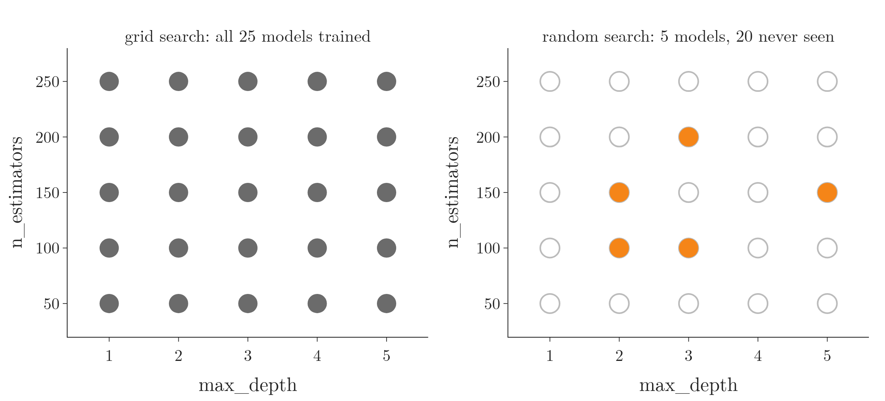

## 3. Bayesian search

> **Key point:** Treat accuracy as an unknown function of the hyperparameters, learn its shape from the trials so far, and try next where it is most likely to be high.

### 3.1 Accuracy is a function of the hyperparameters

> **Key point:** Change `max_depth` or `n_estimators` and the accuracy changes, so accuracy = f(max_depth, n_estimators) for some unknown f.

If we change `max_depth` from 5 to 25, the accuracy changes; if we change `n_estimators` from 10 to 100, it changes too. So there is a relationship between the hyperparameters and the accuracy:

$$\text{accuracy} = f(d,\ m)$$

Here $d$ is `max_depth` and $m$ is `n_estimators`.

We do not know $f$. With two hyperparameters it is a surface over a flat grid: `max_depth` on one axis, `n_estimators` on another, accuracy as the height. If we knew the surface, we would read off its highest point, and with it the best hyperparameters.

### 3.2 Learning the surface from the trials

> **Key point:** Every trial gives one point on the unknown surface; from these points the search guesses the surface and picks the most promising place to try next.

Each trial reveals one point of $f$. For example, `max_depth` = 5 and `n_estimators` = 100 with accuracy 75% is one point on the surface; `max_depth` = 10 and `n_estimators` = 150 with 69% is another.

To see this, drop `n_estimators` and keep one hyperparameter, so the surface becomes a curve (Figure 3):

1. Try `max_depth` = 5, 10 and 15: accuracies 85%, 65% and 84%. These are three points on the hidden curve.
2. From the three points, guess the whole curve, together with how unsure the guess is in each place: little near the points, a lot far from them.
3. Try next where the guess is high, or where it is very unsure and could be high.
4. Add the new point, update the guess, and repeat.

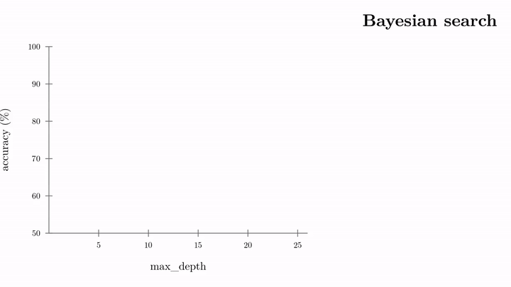{width=100%}

After a few rounds, the guess matches the hidden curve well near its top, and the best trial is close to the true maximum. Most trials end up in the promising region instead of being spread evenly.

### 3.3 Informed search versus blind search

> **Key point:** Grid and random search ignore earlier results; Bayesian search uses every earlier result to choose the next trial.

| | Grid search | Random search | Bayesian search |
|---|---|---|---|
| Next trial chosen | in a fixed order | at random | from the results so far |
| Uses earlier scores | no | no | yes |
| Trials needed | all combinations | as many as we allow | fewer than random search for the same score |

**Bayesian optimisation** is the name of this informed approach. The method is called Bayesian because it puts a prior belief on the unknown function and updates it with each new result into a posterior, as Bayes' theorem updates a probability with new evidence (the [Bayes theorem Note](../85-bayes-theorem/note.md); Shahriari et al. 2016, §II).

> **Extra:** The two parts of Bayesian optimisation have names. The guess of the curve is the **surrogate model** (G-1927): in Figure 3 a **Gaussian process** (G-832), a model that predicts a value and its uncertainty (a mean $\mu$ and a standard deviation $\sigma$) at every point. The rule that picks the next trial is the **acquisition function** (G-163); a common one is the **expected improvement** (G-724; Shahriari et al. 2016; Jones et al. 1998).

> **Extra:** Expected improvement, step by step.
>
> 1. **In words:** how much better than the best score so far we expect a point to be, averaging over the surrogate's uncertainty; a point counts as promising if its predicted mean is high, or if its uncertainty is wide enough that it might be high.
> 2. **Formula:** with best score so far $f^\ast$, predicted mean $\mu$ and standard deviation $\sigma$ at a point, $\Phi$ the normal distribution's cumulative probability and $\phi$ its density:
>    $$z = \frac{\mu - f^\ast}{\sigma}, \qquad \text{EI} = (\mu - f^\ast)\thinspace\Phi(z) + \sigma\thinspace\phi(z)$$
> 3. **Example:** $f^\ast= 0.785$, $\mu = 0.790$, $\sigma = 0.010$:
>    $$z = \frac{0.790 - 0.785}{0.010} = 0.5, \qquad \Phi(0.5) = 0.6915, \qquad \phi(0.5) = 0.3521$$
>    $$\text{EI} = 0.005 \times 0.6915 + 0.010 \times 0.3521 = 0.00346 + 0.00352 = 0.0070$$
>    The two halves are about equal: half of this point's appeal is its high mean, half its uncertainty.

## 4. Optuna's vocabulary

> **Key point:** A study is the whole tuning task; a trial is one run with one set of values; the objective function scores a trial; the sampler chooses the next values.

Five terms appear in every piece of Optuna code (Figure 1):

- **Study** (G-1907): one optimisation session: one dataset, one algorithm (or several), the hyperparameters to tune and the goal. A study is a collection of trials aimed at optimising the objective function.
- **Trial** (G-2016): one run of the objective function with one set of hyperparameter values, for example `max_depth` = 1 and `n_estimators` = 50.
- **Trial parameters:** the hyperparameter values used in a trial, for example `max_depth` = 2 and `n_estimators` = 100.
- **Objective function** (G-1372): the function we want to optimise. The objective takes a trial, builds and trains a model with that trial's values, and returns a score such as accuracy.
- **Sampler** (G-1733): the algorithm that suggests which hyperparameter values to try in the next trial. Optuna's default is **TPE** (G-1995), the Tree-structured Parzen Estimator, a form of Bayesian optimisation (Bergstra et al. 2011).

> **Extra:** How TPE chooses (Bergstra et al. 2011, §4). TPE sorts the past trials into a "good" group (in Optuna, the best 10%, at most 25 trials) and a "bad" group. For each hyperparameter it estimates how its values are spread in each group, $\ell(x)$ for good and $g(x)$ for bad, and tries next the values where $\ell(x) / g(x)$ is highest: values common among good trials and rare among bad ones. TPE was built for "tree-structured" search spaces, in which some hyperparameters exist only for some values of another, as in section 8.

## 5. The Optuna workflow

> **Key point:** Write an objective function, create a study, call optimize; the best trial holds the best score and values.

We tune a random forest on the Pima diabetes data (the [ROC Note](../78-roc-auc/note.md)). Each **observation** (one row of the table) is a patient: 768 in all. Each has 8 **features** (input variables, one column each), medical measurements such as glucose and BMI, and the **target** (the output we predict) is whether the patient has diabetes. We split the data 70/30 into 537 training and 231 test observations. The Notebook (`notebook.ipynb`) runs every step of this section.

### 5.1 The objective function

> **Key point:** Inside the objective, `trial.suggest_int` defines the search space and returns this trial's values; the function trains a model and returns its score.

The objective function does two things:

1. **Defines the search space** and takes this trial's values from it: `n_estimators` between 50 and 200, `max_depth` between 3 and 20.
2. **Runs the training:** builds a random forest with those values, scores it with 3-fold cross-validation (G-510) ([pipelines Note](../29-pipelines/note.md), section 8), and returns the mean accuracy.

> **Python:** The objective function.
>
> ```python
> import optuna
> from sklearn.ensemble import RandomForestClassifier
> from sklearn.model_selection import cross_val_score
>
> def objective(trial):
>     # 1. the search space: this trial's values
>     n_estimators = trial.suggest_int("n_estimators", 50, 200)
>     max_depth = trial.suggest_int("max_depth", 3, 20)
>     # 2. the training
>     model = RandomForestClassifier(
>         n_estimators=n_estimators, max_depth=max_depth,
>         random_state=42, n_jobs=-1)
>     scores = cross_val_score(model, X_train, y_train,
>                              cv=3, scoring="accuracy")
>     return scores.mean()
> ```
>
> `trial.suggest_int(name, low, high)` returns a whole number between `low` and `high`, both included, chosen by the sampler. Every value in the range is allowed, so `n_estimators` can be 51 or 137, not only multiples of 50.

The `trial` object is where the intelligence is hidden: on each call, `suggest_int` asks the sampler, which looks at all earlier trials before answering.

> **Extra:** The other `suggest_` methods: `trial.suggest_float("C", 1e-3, 1e3, log=True)` for decimal values (`log=True` samples on a log scale, so 0.001 to 0.01 gets as much room as 100 to 1000; Optuna docs), and `trial.suggest_categorical("kernel", ["linear", "rbf"])` for a choice from a list.

### 5.2 Creating the study and running the trials

> **Key point:** `create_study(direction="maximize")` for a score like accuracy, `"minimize"` for a loss; `optimize(objective, n_trials=50)` runs the trials.

> **Python:** Two lines run the whole search.
>
> ```python
> study = optuna.create_study(
>     direction="maximize",
>     sampler=optuna.samplers.TPESampler(seed=42))
> study.optimize(objective, n_trials=50)
> ```
>
> `direction="maximize"` because accuracy (or $R^2$) should go up; for a loss such as log loss or mean squared error we would write `"minimize"`. TPE is the default sampler, so `sampler=` can be left out; we pass it to fix its `seed`, so every run tries the same values. `optimize` calls `objective` 50 times, each time with a new `trial`.

While it runs, Optuna prints one line per trial, such as `Trial 5 finished with value: 0.7747 and parameters: {'n_estimators': 53, 'max_depth': 20}. Best is trial 5 with value: 0.7747.` The first 10 trials are random: TPE needs some history before it can model anything, so `TPESampler` samples at random until `n_startup_trials` (default 10) trials have finished (Optuna docs). After that, the trials gather in the regions that scored well. Figure 4 shows this in our study. In the 10 random start trials, `max_depth` lands on 8 or 9 once; in the 40 TPE trials, 12 times, around the best trial so far (115 trees of depth 8, found at trial 9).

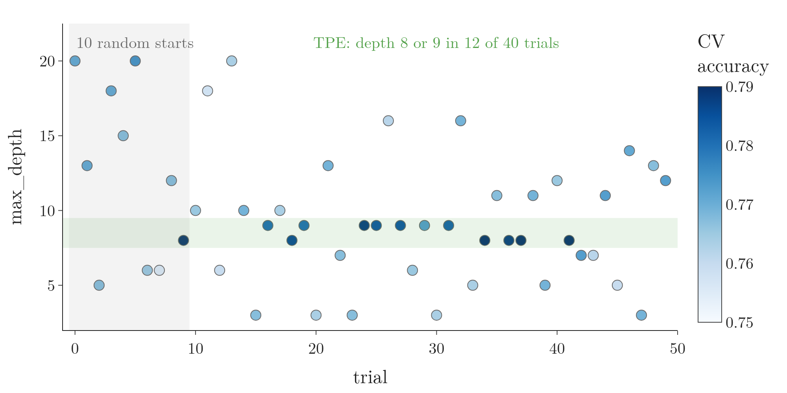

### 5.3 The best trial and the final model

> **Key point:** `study.best_trial.value` is the best score and `study.best_trial.params` its values; we retrain a model with them and test it once.

> **Python:** Reading the result and testing the best model.
>
> ```python
> best = study.best_trial
> best.value     # 0.790, the best mean CV accuracy
> best.params    # {'n_estimators': 115, 'max_depth': 8}
>
> model = RandomForestClassifier(**best.params,
>                                random_state=42)
> model.fit(X_train, y_train)
> model.score(X_test, y_test)   # 0.745
> ```
>
> `**best.params` unpacks the dictionary into keyword arguments: `n_estimators=115, max_depth=8`.

After 50 trials, the best forest has 115 trees of depth 8, with a cross-validated accuracy of **0.790**. Retrained on all 537 training observations, it scores **0.745** on the 231 test observations. The cross-validated score is the one the search maximised, so it is a little optimistic: the search also picks up the random ups and downs of the folds (Cawley and Talbot 2010). Our data agrees: the same forest on 10 other shuffles of the folds averages 0.772, not 0.790 (Notebook). The test score, 0.745, is the honest one.

## 6. Samplers: Bayesian, random or grid

> **Key point:** Swapping the sampler turns the same study into a TPE search, a random search or a grid search.

The objective function stays exactly the same; only the `sampler=` argument changes.

> **Python:** Random search and grid search inside Optuna.
>
> ```python
> # random search: 50 random combinations
> rand = optuna.create_study(
>     direction="maximize",
>     sampler=optuna.samplers.RandomSampler(seed=42))
> rand.optimize(objective, n_trials=50)
>
> # grid search: every combination of an explicit grid
> space = {"n_estimators": [50, 100, 150, 200],
>          "max_depth": [5, 10, 15, 20]}
> grid = optuna.create_study(
>     direction="maximize",
>     sampler=optuna.samplers.GridSampler(space, seed=42))
> grid.optimize(objective, n_trials=16)
> ```
>
> For `GridSampler`, the grid is written outside the objective, and the trial values come from it: 4 × 4 = 16 trials. With grid or random search inside Optuna, we no longer need scikit-learn's `GridSearchCV` or `RandomizedSearchCV`.

Which sampler should we use? The books give a clear answer: Bayesian search reaches a good score in fewer trials than random search, and the saving is largest when each trial is expensive and the good settings fill only a small part of the search space (Shahriari et al. 2016, §I; Bergstra et al. 2011). Section 6.1 tests this under exactly those conditions.

### 6.1 Bayesian search needs fewer trials

> **Key point:** Averaged over 20 runs, TPE reaches in 20 trials the score that random search needs about 42 trials to reach.

Think of a treasure hunt. If gold lies everywhere, any random dig finds some, and clues do not help much. If the gold lies in one small patch, a hunter who uses the clues from earlier digs finds it far sooner than one who digs at random. Bayesian search is the hunter who uses the clues. Our random forest is the first kind of field: almost any depth and tree count scores about the same (see the Extra below). So we tune an RBF-kernel SVM ([kernel trick Note](../95-kernel-trick-intuition/note.md)) on the same diabetes data, over its two settings `C` and `gamma`, each from very small to very large on a log scale; only a narrow band of this space scores well. We run each sampler 20 times with different seeds, 50 trials each, and average the best score so far after every trial (Figure 5).

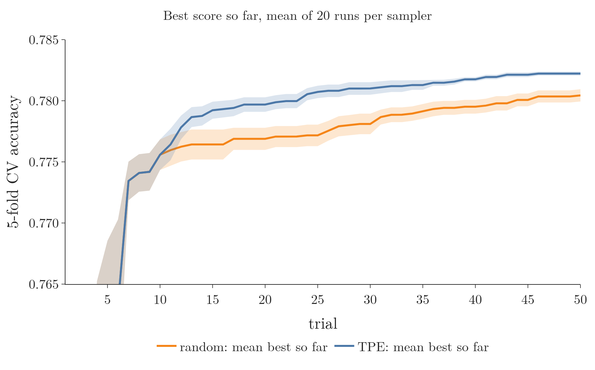{width=100%}

The first 10 trials are identical, because TPE starts at random (section 5.2). From then on, the TPE curve rises faster. After 20 trials TPE averages 0.780; random search reaches that average only at trial 42. TPE finishes ahead in 19 of the 20 runs (Notebook). Fewer trials for the same score is exactly what Bayesian optimisation promises.

> **Extra:** The three samplers on the forest objective of section 5, one study each:
>
> | Sampler | Trials | Best CV | Mean CV | Best values | Test |
> |---|---|---|---|---|---|
> | Grid | 16 | 0.784 | 0.768 | 50 trees, depth 15 | 0.749 |
> | Random | 50 | 0.793 | 0.769 | 56 trees, depth 8 | 0.740 |
> | TPE | 50 | 0.790 | **0.771** | 115 trees, depth 8 | 0.745 |
>
> TPE placed its trials best: 10 of its 50 landed in the best region (`max_depth` 6 to 10, `n_estimators` up to 120), against 7 for random search and 2 for the grid, so its average trial scored highest. The best scores, though, cannot rank the samplers here. On 537 observations, cross-validated accuracy is noisy: one fixed forest, scored on 10 shuffles of the folds, moves between 0.760 and 0.795 (Notebook). The three best CV scores (0.784, 0.790, 0.793) differ by less than that, and the three test accuracies all lie between 0.74 and 0.75. A flat score surface plus noisy scores is the field where clues do not help, which is why section 6.1 uses the SVM, fixed folds and 20 repeated runs.

> **Extra:** Other samplers in `optuna.samplers` (Optuna docs) include `GPSampler` (Gaussian-process Bayesian optimisation, as in Figure 3), `CmaEsSampler` (an evolution strategy for many numeric hyperparameters) and `NSGAIISampler` (for studies with several objectives at once).

## 7. Visualising a study

> **Key point:** `optuna.visualization` draws interactive Plotly charts of a study: the history, where the trials went, and which hyperparameters mattered.

> **Python:** The five main plots; each returns a Plotly figure.
>
> ```python
> from optuna.visualization import (
>     plot_optimization_history, plot_parallel_coordinate,
>     plot_slice, plot_contour, plot_param_importances)
>
> plot_optimization_history([grid, rand, study]).show()
> plot_parallel_coordinate(study).show()
> plot_slice(study).show()
> plot_contour(study).show()
> plot_param_importances(study).show()
> ```
>
> A Plotly figure can be saved as an image with `fig.write_image("history.png")`. The figures below are these plots, with fonts and colours changed to match this Note.

### 7.1 Optimisation history

> **Key point:** Trial number against score, with the best so far as a line; when the line stops rising, more trials are not paying off.

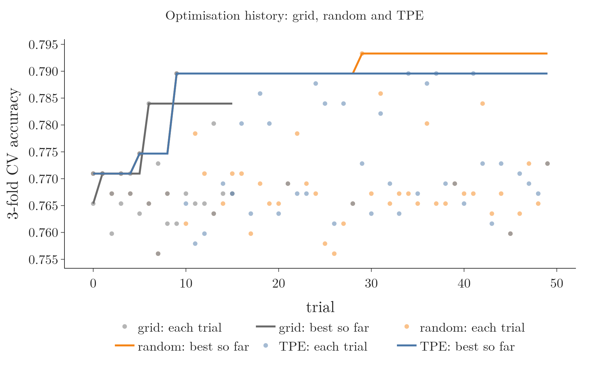{width=100%}

Figure 6 puts the three studies on one chart. TPE's best, 0.790, came at trial 9, still among its first 10 random trials; later it matched that score three more times (trials 34, 37 and 41), all in the same region. Random search found its 0.793 at trial 29. No study improved its best score after trial 29, so on this problem the last 20 trials added nothing; a flat history like this one helps us choose `n_trials` next time.

### 7.2 Parallel coordinates and slices

> **Key point:** One vertical axis per quantity and one line per trial, coloured by score; where the dark lines bunch, the sampler found a promising range.

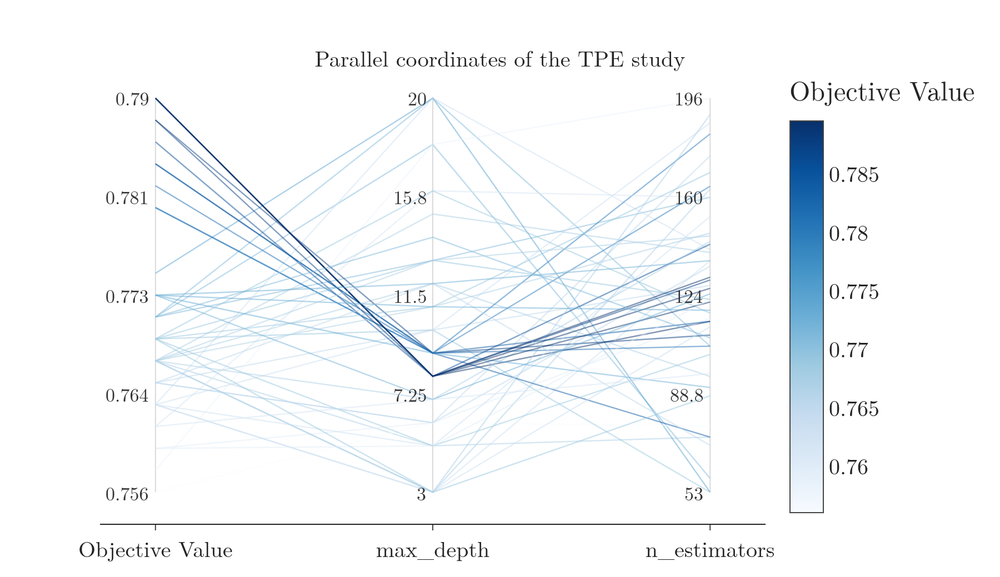{width=100%}

In Figure 7, the darkest lines all run through `max_depth` 8 to 9 and on to `n_estimators` between about 110 and 145. A **slice plot** (`plot_slice`) shows the same thing one hyperparameter at a time: each hyperparameter against the score, one dot per trial, so dense regions show where the sampler spent its trials.

### 7.3 Contour plot

> **Key point:** Two hyperparameters on the axes and the score as coloured contours: the best region of the search space at a glance.

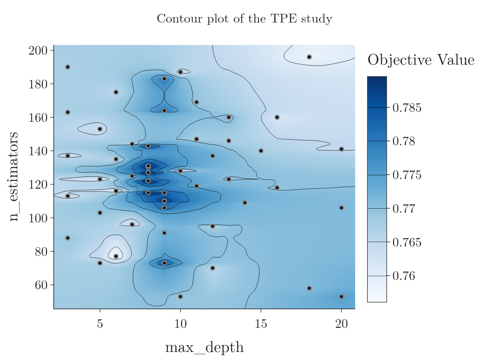{width=90%}

Figure 8 shows the dark region around `max_depth` 8 to 9 and `n_estimators` 105 to 135, and the dots show that TPE placed many of its trials there. Away from that band of depths, the colours are pale whatever the number of trees.

### 7.4 Hyperparameter importances

> **Key point:** How much each hyperparameter affected the score in this study; here `max_depth` matters far more than `n_estimators`.

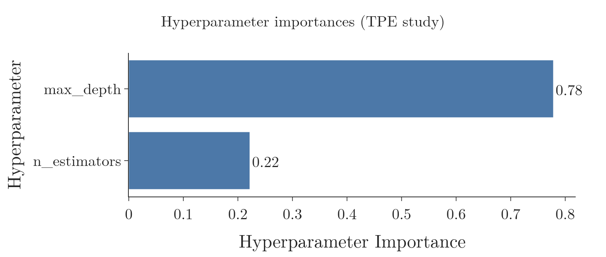{width=75%}

Figure 9 gives `max_depth` a **hyperparameter importance** (G-908) of 0.78 and `n_estimators` 0.22; the values add up to 1. So on this data, when time is short, `max_depth` is the hyperparameter to tune carefully.

> **Extra:** Optuna 5.0 computes these importances with **PED-ANOVA**: roughly, a hyperparameter is important if its values among the best trials look very different from its values among all trials (Watanabe et al. 2023; Optuna docs). The older **fANOVA** method, which fits a random forest predicting the score from the hyperparameters (Hutter et al. 2014), gives 0.88 and 0.12 on the same study: a different split, the same order.

## 8. Define-by-run: searching over algorithms

> **Key point:** Because the search space is built while the objective runs, the algorithm itself can be a hyperparameter, and each algorithm can have its own hyperparameters.

### 8.1 The problem: tuning several algorithms

> **Key point:** Tuning four algorithms one after another means four separate searches.

On a new dataset we rarely know which algorithm will do best: logistic regression, an SVM, a random forest, gradient boosting? Normally we tune each one separately and compare their best scores, which means four full searches.

### 8.2 A dynamic search space

> **Key point:** Make `classifier` a categorical hyperparameter, then use `if`/`elif` to suggest only that classifier's hyperparameters.

In Optuna, the search space is not fixed in advance: it is created by the `suggest_` calls as the objective function runs. Building the space this way is called **define-by-run** (G-575). So the first suggestion can pick the algorithm, and the later suggestions can depend on that choice. A search space whose hyperparameters depend on other hyperparameters is a **dynamic search space** (G-653), also called a conditional search space.

> **Python:** One study over three algorithms.
>
> ```python
> from sklearn.ensemble import GradientBoostingClassifier
> from sklearn.pipeline import make_pipeline
> from sklearn.preprocessing import StandardScaler
> from sklearn.svm import SVC
>
> def make_model(trial):
>     name = trial.suggest_categorical(
>         "classifier",
>         ["SVC", "RandomForest", "GradientBoosting"])
>     if name == "SVC":
>         c = trial.suggest_float("C", 1e-3, 1e3, log=True)
>         kernel = trial.suggest_categorical(
>             "kernel", ["linear", "rbf"])
>         return make_pipeline(StandardScaler(),
>                              SVC(C=c, kernel=kernel))
>     if name == "RandomForest":
>         return RandomForestClassifier(
>             n_estimators=trial.suggest_int(
>                 "n_estimators", 50, 200),
>             max_depth=trial.suggest_int("max_depth", 3, 20),
>             random_state=42)
>     return GradientBoostingClassifier(
>         n_estimators=trial.suggest_int(
>             "gb_n_estimators", 50, 200),
>         learning_rate=trial.suggest_float(
>             "learning_rate", 0.01, 0.3, log=True),
>         max_depth=trial.suggest_int("gb_max_depth", 2, 6),
>         random_state=42)
>
> def objective(trial):
>     return cross_val_score(make_model(trial),
>                            X_train, y_train, cv=3).mean()
>
> study = optuna.create_study(
>     direction="maximize",
>     sampler=optuna.samplers.TPESampler(seed=42))
> study.optimize(objective, n_trials=100)
> study.best_trial.params
> # {'classifier': 'RandomForest',
> #  'n_estimators': 134, 'max_depth': 8}
> ```
>
> Each `if` branch suggests only its own algorithm's hyperparameters, so an SVC trial never draws a `max_depth`. The SVM gets a `StandardScaler` in a pipeline because SVMs are not scale invariant (scikit-learn user guide, SVM tips). Building the model in its own function, `make_model`, lets us rebuild the winner later (section 8.3).

The TPE sampler chooses the classifier like any other hyperparameter. After 100 trials, the best is a random forest with 134 trees of depth 8: cross-validated accuracy **0.788**, test accuracy **0.749**. One study replaced three.

### 8.3 Reading the trials as a table

> **Key point:** `study.trials_dataframe()` gives one row per trial; grouping by the classifier column shows how often each algorithm was tried and how well it did.

> **Python:** The trials as a pandas DataFrame, and the winner rebuilt.
>
> ```python
> df = study.trials_dataframe()
> # columns: number, value, datetime_start, datetime_complete,
> # duration, params_C, params_classifier, ..., state
> df.groupby("params_classifier")["value"].agg(
>     ["count", "mean", "max"])
>
> # FixedTrial answers every suggest_ call from a dictionary
> best = make_model(
>     optuna.trial.FixedTrial(study.best_trial.params))
> best.fit(X_train, y_train).score(X_test, y_test)  # 0.749
> ```
>
> A hyperparameter that a trial never suggested (such as `params_C` in a random forest trial) is NaN in that row.

| Classifier | Trials | Mean CV accuracy | Best CV accuracy |
|---|---|---|---|
| Random forest | 51 | 0.775 | **0.788** |
| Gradient boosting | 36 | 0.765 | 0.780 |
| SVC | 13 | 0.735 | 0.780 |

The counts are uneven because TPE learns. Counting trials in blocks of 20 shows how:

| Trials | Random forest | Gradient boosting | SVC |
|---|---|---|---|
| 0 to 19 | 8 | 8 | 4 |
| 20 to 39 | 1 | 17 | 2 |
| 40 to 59 | 2 | 11 | 7 |
| 60 to 99 | **40** | 0 | 0 |

Figure 10 replays the study trial by trial. Watch the colours: all three appear early, orange (gradient boosting) takes over in the middle, and blue (random forest) fills the last 40 trials.

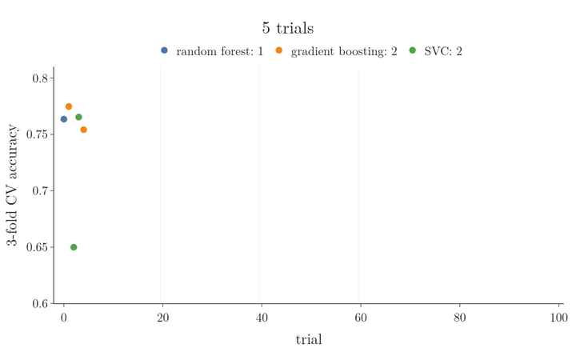

At first it explores all three. For a while it favours gradient boosting, then it settles on the random forest and spends all of the last 40 trials tuning it. A random sampler would have split the trials about evenly, and tuned the winner far less.

> **Extra:** The SVC's low mean and high best go together: its score depends strongly on `C`. Its 13 trials run from 0.650 (`C` of 0.012 or less) to 0.780 (`C` = 0.62). 0.650 is the share of patients without diabetes in the training data, the score of a model that always predicts "no diabetes" (Notebook).

## 9. Other features of Optuna

> **Key point:** Optuna can spread trials over many machines, works with the main ML and DL libraries, and can stop bad trials early.

- **Distributed optimisation:** several processes or machines can run trials of the same study at once, sharing the results through a database, so the search finishes sooner.
- **Integrations:** Optuna works with scikit-learn, Keras, PyTorch, XGBoost, LightGBM and with MLflow (which records experiments).
- **Machine learning and deep learning alike:** the objective function can train anything that returns a score.

> **Python:** A study stored in a database, so several processes can work on it.
>
> ```python
> study = optuna.create_study(
>     study_name="rf-diabetes", direction="maximize",
>     storage="sqlite:///study.db", load_if_exists=True)
> study.optimize(objective, n_trials=50)
> ```
>
> Running the same lines in several terminals at once makes each one add trials to the same study.

> **Extra:** **Pruning** (G-1587) stops unpromising trials early. In a neural network trained for many epochs, the objective reports the score after each epoch with `trial.report(score, epoch)`; if `trial.should_prune()` returns `True` (with the default `MedianPruner`: the trial is worse than the median of earlier trials at the same epoch; Optuna docs), the objective raises `optuna.TrialPruned()` and the study moves on.

## 10. Summary

| | Grid search | Random search | Bayesian search (Optuna TPE) |
|---|---|---|---|
| Chooses the next trial | in order | at random | from all earlier results |
| Cost | all combinations | `n_trials` | `n_trials` |
| Risk | too slow | misses the best | can follow noise on small data |
| Trials to reach 0.780 (SVM, average of 20 runs) | not run | 42 | **20** |
| Average best after 20 trials (SVM, 20 runs) | not run | 0.777 | **0.780** |
| In Optuna | `GridSampler` | `RandomSampler` | `TPESampler` (default) |

- Bayesian optimisation treats the score as an unknown function of the hyperparameters, guesses it from the trials so far, and tries next where the improvement could be largest.
- Optuna's vocabulary: study, trial, trial parameters, objective function, sampler.
- The workflow: an objective with `trial.suggest_*`, then `create_study(direction=...)`, `optimize(objective, n_trials=...)`, `best_trial.params`, retrain and test.
- `optuna.visualization` gives Plotly charts: optimisation history, parallel coordinates, slice, contour, importances.
- Bayesian search needs fewer trials when the good region is small: averaged over 20 runs on an SVM search, TPE reached in 20 trials what random search needed 42 trials for. On the forest, whose scores are nearly flat, the three samplers ended within the noise of cross-validation.
- Define-by-run lets one study choose the algorithm and its hyperparameters together: TPE spent its last 40 of 100 trials on the random forest.

## 11. Sources

**Built from**

- CampusX, "Hyperparameter Tuning using Optuna | Bayesian Optimization using Optuna", YouTube, https://www.youtube.com/watch?v=E2b3SKMw934

**Other references**

- Shahriari et al. 2016: B. Shahriari, K. Swersky, Z. Wang, R. P. Adams and N. de Freitas, *Taking the Human Out of the Loop: A Review of Bayesian Optimization*, Proceedings of the IEEE 104(1), 2016.
- Jones et al. 1998: D. R. Jones, M. Schonlau and W. J. Welch, *Efficient Global Optimization of Expensive Black-Box Functions*, Journal of Global Optimization 13, 1998.
- Bergstra et al. 2011: J. Bergstra, R. Bardenet, Y. Bengio and B. Kégl, *Algorithms for Hyper-Parameter Optimization*, NeurIPS 2011.
- Cawley and Talbot 2010: G. C. Cawley and N. L. C. Talbot, *On Over-fitting in Model Selection and Subsequent Selection Bias in Performance Evaluation*, Journal of Machine Learning Research 11, 2010.
- Watanabe et al. 2023: S. Watanabe, A. Bansal and F. Hutter, *PED-ANOVA: Efficiently Quantifying Hyperparameter Importance in Arbitrary Subspaces*, IJCAI 2023.
- Hutter et al. 2014: F. Hutter, H. Hoos and K. Leyton-Brown, *An Efficient Approach for Assessing Hyperparameter Importance*, ICML 2014.
- Optuna docs: Optuna 5.0 API reference: `TPESampler` (`n_startup_trials`, `default_gamma`), `Trial.suggest_float` (`log`), `optuna.samplers`, `MedianPruner`, `PedAnovaImportanceEvaluator`.
- scikit-learn user guide, SVM tips: scikit-learn user guide, "Support Vector Machines", Tips on Practical Use.

## 12. Key terms

| Term | Meaning |
|---|---|
| Optuna | A Python framework for hyperparameter tuning built around Bayesian optimisation |
| Search space | The ranges or lists of values each hyperparameter may take during tuning |
| Bayesian optimisation | Tuning that models the score as a function of the hyperparameters and uses all earlier trials to choose the next one |
| Surrogate model | The model of the unknown score function that Bayesian optimisation builds from the trials |
| Acquisition function | The rule that picks the next trial from the surrogate, such as expected improvement |
| Expected improvement | How much better than the best score so far a point is expected to be, given the surrogate's mean and uncertainty |
| Gaussian process | A model that predicts a value and its uncertainty at every point; a common surrogate |
| Study | In Optuna, one optimisation session: a collection of trials aimed at optimising the objective function |
| Trial | In Optuna, one run of the objective function with one set of hyperparameter values |
| Objective function | The function a search optimises: it takes a trial's values and returns a score |
| Sampler | In Optuna, the algorithm that suggests the next trial's hyperparameter values |
| TPE | Tree-structured Parzen Estimator, Optuna's default Bayesian sampler |
| Define-by-run | Building the search space while the objective function runs, so it can depend on earlier choices |
| Dynamic search space | A search space in which some hyperparameters exist only for some values of another, such as the algorithm |
| Hyperparameter importance | How much each hyperparameter affected the score in a study; the values add up to 1 |
| Pruning | Stopping an unpromising trial early, before its training finishes |
