<!-- where-this-fits: generated by course_map/build_map.py; edit concepts.yaml, not this block -->
> **Where this fits:** Pipeline map step 1 (Frame the problem). See the [Course map](../01-course-map/note.md).
>
> 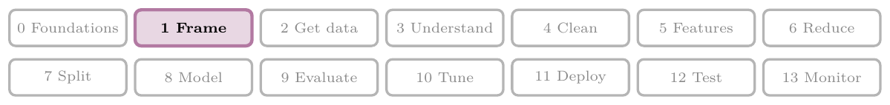
>
> - **Builds on:** Supervised learning ([Note 3](../03-types-of-ml/note.md)); Batch (offline) learning ([Note 4](../04-batch-learning/note.md)); Online learning ([Note 5](../05-online-learning/note.md)).
<!-- /where-this-fits -->

## 1. Overview

> **Key point:** Before any code, we turn a vague business goal into a clear ML task, by answering seven questions in order.

A company rarely asks for "a classification model". The company brings a business problem, such as "we need more revenue". **Framing** (G-802) an ML problem means turning that business problem into a precise ML task that a team can build, measure and improve.

Figure 1 shows the seven framing steps, applied to one running example: Netflix wants to increase its revenue.

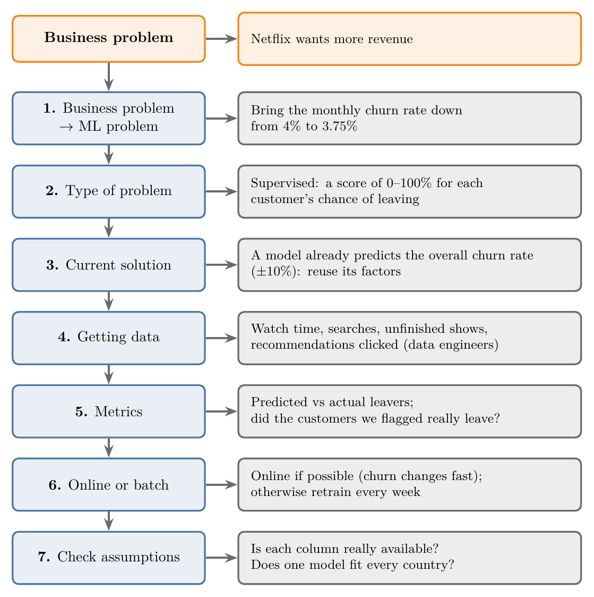{height=65%}

There is no fixed recipe for framing. These seven steps are a good default checklist, and the rest of this Note goes through them one by one.

## 2. Why framing matters

> **Key point:** Junior data scientists get small tasks; leaders plan the whole project, and framing is how they plan it.

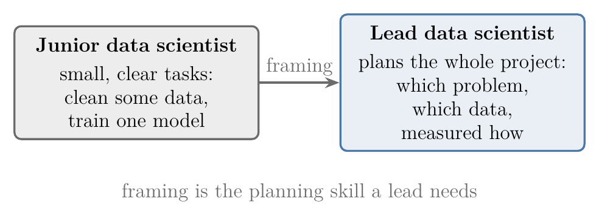{width=75%}

Figure 2 shows the two roles side by side.

In a company, ML work is done by teams. A big project, such as a recommender system, may have 10 to 20 data scientists.

- **A junior data scientist** gets small, well-defined tasks: preprocessing some data, or training one particular model.
- **A lead data scientist** plans the project end to end: which problem to solve, with what data, measured how.

So framing may not be our job on day one. But it is the skill that decides who moves into leadership roles, and it shapes everything the team does afterwards.

## 3. The running example: Netflix revenue

> **Key point:** Netflix can earn more by finding new customers, charging current customers more, or keeping customers who are about to leave. We choose the third.

Suppose we are the lead data scientist at Netflix, the largest video streaming (OTT) platform. In a meeting with the CEO, the CTO and other senior leaders, the question is: *how can Netflix increase its revenue?*

There are three ways:

1. **Bring in new customers**, through better marketing. Winning new customers is hard.
2. **Charge existing customers more.** Raising prices is unfair to them.
3. **Keep the customers who are about to leave.**

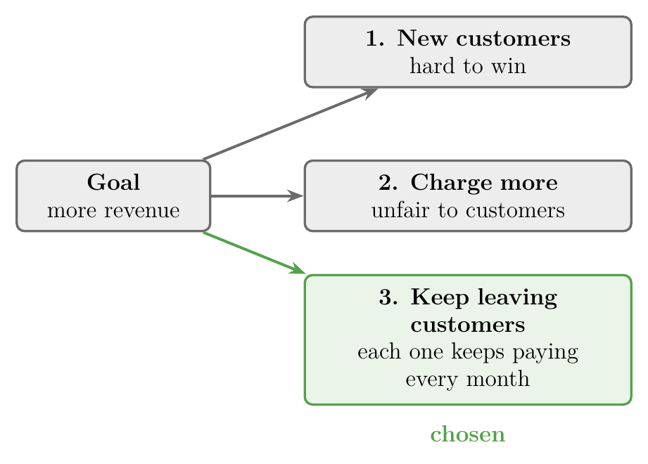{width=65%}

Figure 3 shows the three ways and the one we choose.

The third way looks the most promising. Netflix earns money through a monthly **subscription**, so every customer who stays is one more customer paying each month.

### 3.1 Churn rate

> **Key point:** The churn rate is the percentage of customers who leave in a given period.

Customers leaving a platform is called **churn** (G-387). The **churn rate** (G-386) measures how fast customers leave.

**Churn rate**, step by step:

1. **In words:** out of all the customers at the start of a period (a month or a year), the percentage who leave during that period.
2. **Formula:**
   $$\text{churn rate} = \frac{\text{customers who left during the period}}{\text{customers at the start of the period}} \times 100\ \text{percent}$$
3. **Example:** Netflix has 100 users and a monthly churn rate of 2%. After one month, 2 users have left:
   $$\text{churn rate} = \frac{2}{100} \times 100\ \text{percent} = 2\ \text{percent},$$
   so 98 users remain. The next month, 2% of those 98 leave, so
   $$98 \times 0.98 \approx 96$$
   users remain, and so on.

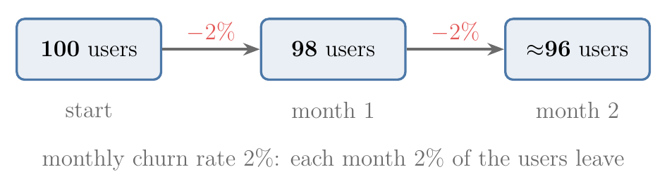{width=75%}

Figure 4 draws the example: the user count drops by 2 percent each month.

A steady churn rate does not mean every company slowly disappears. New customers keep joining too, and usually faster than old ones leave, so the customer base grows over time.

A customer base works like a population. If the death rate is higher than the birth rate, the population shrinks; if the birth rate is higher, it grows. Here, new customers are the births and churn is the deaths.

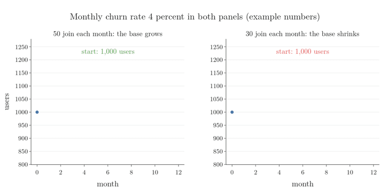

Figure 5 runs the analogy for twelve months on example numbers. Both panels start with 1,000 users and lose 4 percent of them every month, which is 40 users in month 1. Each month follows the same rule: users next month = users now, minus the users who left, plus the users who joined. On the left, 50 users join each month, more than leave, and the base grows to about 1,097. On the right, only 30 join, fewer than leave, and the base shrinks to about 903.

## 4. Step 1: Business problem to ML problem

> **Key point:** "Increase revenue" becomes a number the team can aim at: bring the monthly churn rate down from 4% to 3.75%.

A goal like "increase revenue" is too vague to build anything from. Our first job is to turn it into a **mathematical problem**: a measurable target we can hand to our team.

Suppose Netflix's monthly churn rate is about 4%. Our target becomes: **bring the churn rate down from 4% to 3.75% within the next six months.**

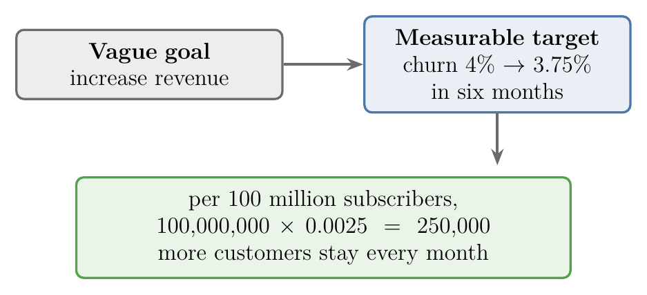{width=75%}

Figure 6 shows the whole step: vague goal, measurable target, and why the small drop matters.

A drop of 0.25 percentage points sounds small. At Netflix's scale, it is large: for every 10 crore (100 million) subscribers,

$$100{,}000{,}000 \times 0.0025 = 250{,}000$$

more customers stay, and keep paying, every month.

So we leave the meeting with a clear goal. In our mind, the task is no longer "increase revenue"; it is "churn rate from 4% to 3.75%".

> **Extra:** The 4% here is an assumed figure for the example, not a published Netflix number.

## 5. Step 2: Type of problem

> **Key point:** We look at the big picture: what product we will build and how it will be used. Only then do we know whether the problem is supervised, and whether it is classification or regression.

Next, we decide what type of ML problem we are solving (Note 3):

- **Supervised or unsupervised?**
- If supervised, **regression or classification?**

To answer this, we must see the **big picture**: what will the end product be, and how will it be used?

### 5.1 Reducing churn is not predicting churn

> **Key point:** Our job is to find *which* customers will leave, not *how many*.

Predicting the overall churn rate ("next month, 4% will leave") is a different task, for a different team. A forecast of the rate does not stop anyone from leaving.

To reduce churn, we must stop the customers who are about to leave. So our main task is to **identify the customers who are going to leave the platform**: for each customer, will they leave, yes or no?

In ML terms, each customer in a given month is one **observation** (G-1374; one record, one row of the data table). Whether that customer leaves is the **target** (G-1949; the output we predict).

### 5.2 The end product: a discount

> **Key point:** In the short term, we offer an instant discount to every customer we expect to leave.

Once we know who is about to leave, we need a way to stop them. The real reason could be many things:

- they cannot find content they like,
- they are older users who find the app hard to navigate,
- the internet in their area is poor.

Finding the real reason can take a month or two, but the customer may leave right away. So the **short-term plan** is simple: as soon as we flag a customer as leaving, we offer them a discount on next month's subscription, for example 50%.

The **long-term plan** is separate work with other teams: better content, a better app, perhaps lower prices.

### 5.3 From yes or no to a score

> **Key point:** Not every leaving customer is equally likely to leave, so we predict a score from 0 to 100% and give larger discounts to higher scores.

At this point, the problem looks like **supervised classification**: for every customer, predict whether they will leave this month (yes or no).

Then a colleague asks: why treat everyone who might leave the same? Some customers are very unhappy, others only a little, and discounts at Netflix's scale are expensive. Figure 7 compares the two ideas.

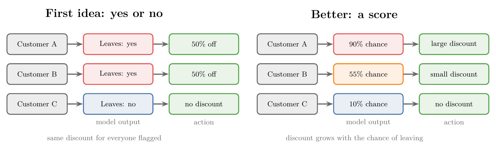

So instead of yes or no, we predict, for each customer, **how likely they are to leave**, as a score from 0 to 100%. The higher the score, the larger the discount. Because the output is now a number, we treat this as a **regression** (G-1655) problem.

> **Extra:** In practice, this task is usually still built as **binary classification** (leaves or stays). Most classifiers, such as logistic regression (Note 13), can output a probability for each class instead of only a label (ESL §4.4; scikit-learn API docs, `LogisticRegression.predict_proba`). That probability is exactly the 0 to 100% score we want, so "classification with probability outputs" and "a score" end up describing the same model.

The framing changed as we thought more about the end product. Such changes are normal: framing is a thinking process, not a fixed formula.

## 6. Step 3: Current solutions

> **Key point:** Check what already exists in the company. Earlier work gives us a head start.

Before building anything, we ask what solutions already exist. The CTO, who knows the company's systems, is a good person to ask.

Suppose we learn that one team already has a model that predicts Netflix's **overall** churn rate for next month (say, around 5% or 6%), and it is accurate to within about 10%. That model solves a different problem from ours, but in the same area.

So we do not have to start from scratch. We can ask that team which factors they used to predict churn, and use them as a starting point.

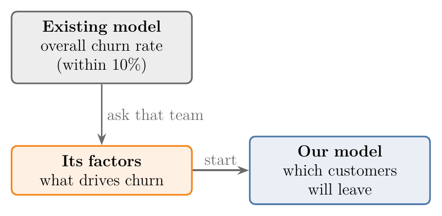{width=65%}

Figure 8 shows how the existing model feeds into ours.

## 7. Step 4: Getting data

> **Key point:** We decide carefully which data we need, then work with data engineers to get it.

Getting data is one of the most important steps. We sit down and think: what data do we need, and which **features** (G-772; input variables, one column each of the data table) should it have?

To predict how likely a customer is to leave, we study how each customer used Netflix in a given month:

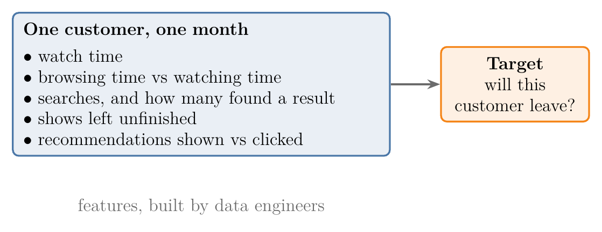{width=85%}

Figure 9 shows one observation; the table below says what each feature tells us.

| Feature (per customer, per month) | What it tells us |
|---|---|
| Watch time (hours on Netflix) | How engaged the customer is |
| Time spent browsing vs time spent watching | Lots of browsing, little watching: they are not finding what they want |
| Number of searches, and how many found a result | Many failed searches: the content they want is missing |
| Movies or shows left unfinished | The content is not holding their interest |
| Recommendations shown vs recommendations clicked | Our suggestions do not match their taste |

For example, a customer who searched 300 times in a month and did not find 300 of the things they searched for is clearly not getting what they want.

Getting these features is a job for a **data engineer** (G-533). Netflix's day-to-day records live in its **OLTP** (G-1378) database (online transaction processing: the system that records every action as it happens). Data engineers copy this data into a **data warehouse** (G-541), where it is organised for analysis, and from there build the dataset we need.

## 8. Step 5: Metrics

> **Key point:** Before we start, we define how we will know whether our work is succeeding.

We need **metrics** (G-1215): numbers that tell us, and our team, whether we are moving in the right direction. Without them, we cannot tell whether six months of work achieved anything.

For the churn project, two checks are natural:

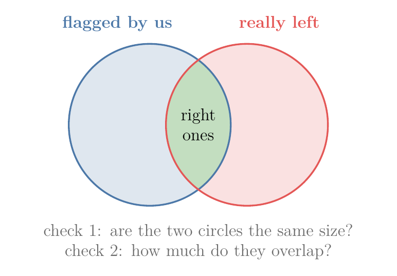{width=55%}

Figure 10 draws both checks as two circles: the customers we flagged and the customers who really left.

- **Predicted vs actual leavers:** compare how many customers we predicted would leave with how many actually left. If the difference is small (say, 0.25%), we are on the right track.
- **The right customers:** check whether the customers we flagged are the same customers who actually left, or different ones.

Choosing metrics deserves real time and thought, just like choosing the data.

> **Extra:** The second check has standard names, covered in Notes 76 and 77. **Precision** (G-1547) asks: of the customers we flagged, how many really left? **Recall** (G-1641) asks: of the customers who really left, how many did we flag? On top of these model metrics, the business metric, the churn rate itself, tells us whether the discounts are working.

## 9. Step 6: Online or batch learning

> **Key point:** Churn changes quickly, so online learning would suit it best; if that is too hard, we retrain in batches, for example every week.

We also decide at the start how the model will learn once it is in production (Notes 4 and 5):

- **Batch learning** (G-265): train on our machine, deploy to the server, and periodically take the model down, retrain it on new data and deploy it again.
- **Online learning** (G-1391): the model keeps learning on the server from data as it arrives.

### 9.1 Why churn suits online learning

> **Key point:** Churn depends on events that change fast, such as lockdowns and holidays.

How much time people spend on Netflix, and whether they leave, is very **volatile**: it changes quickly with events.

- **A lockdown starts:** people have more free time, so more customers join. Many of them later find something else to do and leave, so churn rises too.
- **Holidays:** more customers arrive, and churn may go up or down.

A model trained once would quickly fall out of date. So online learning is the better choice here.

### 9.2 The online flow, and the batch fallback

> **Key point:** Data flows from the app to the OLTP database, to the data warehouse, and into a model that keeps training.

Figure 11 shows the flow we would try to build. New data keeps arriving in the OLTP database, flows on into the data warehouse, and passes through the model, which keeps training and keeps producing a churn score for every customer.

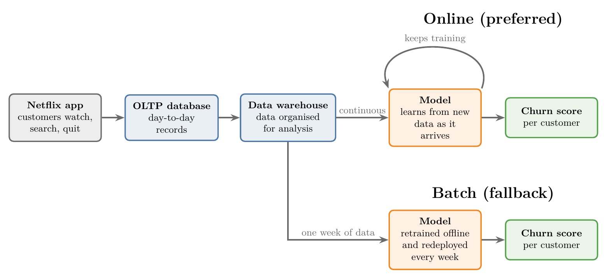

Online learning is hard to build, and our data setup may not allow it. In that case we fall back on batch learning: every week, we take the model offline, retrain it on the latest data, and deploy it again (Figure 11, bottom).

## 10. Step 7: Checking assumptions

> **Key point:** We list what we have taken for granted and check each point before building.

While framing, we make many assumptions without noticing. The last step is to write them down and check them. For the churn project:

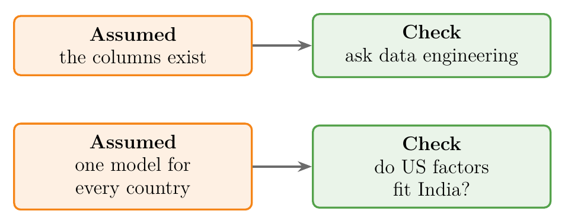{width=70%}

Figure 12 pairs each assumption with its check.

- **Is the data really available?** We assumed columns such as watch time and searches exist. We confirm this with the data engineering team.
- **Does one model work everywhere?** Netflix is a multinational company, and we assumed one model would serve users all over the world. But factors that predict churn in the US may not work as well in India, so we may need separate models for different regions.

There are many more such assumptions in a real project, and each one is cheaper to check now than after the model is built.

## 11. Think before coding

> **Key point:** In a big company, changing direction is slow and expensive, so we plan first and code second.

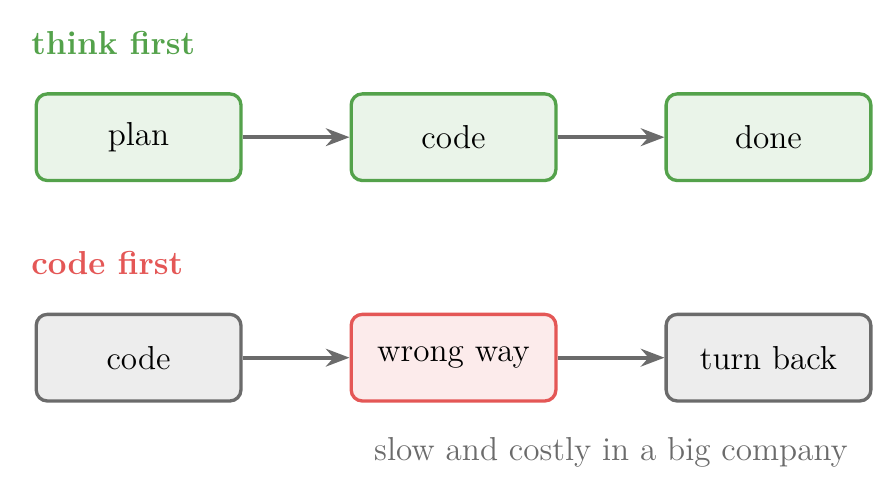{width=70%}

Figure 13 contrasts the two habits.

There is no fixed procedure for framing. What matters is the habit: we do not start coding straight away; we first sit down and think the problem through.

Planning first matters most in big organisations, which have high **inertia**: once a team starts moving in one direction, turning back is slow and costly. People are paid by the hour, so work in the wrong direction is wasted money, and it reflects badly on whoever led it.

The same habit is what separates people over time. Of the thousands of freshers who join a company, only a few become managers five years later: usually those who showed this kind of planning and leadership.

## 12. Summary

| Step | Question to ask | Netflix answer |
|---|---|---|
| 1. Business problem $\rightarrow$ ML problem | What number must change, and by how much? | Monthly churn rate from 4% to 3.75% in six months |
| 2. Type of problem | What will the product be? Supervised or not? Regression or classification? | Supervised: a 0 to 100% score of each customer's chance of leaving; larger score, larger discount |
| 3. Current solution | What already exists that we can learn from? | A model of the overall churn rate (within 10%): reuse its factors |
| 4. Getting data | Which features do we need, and who can get them? | Watch time, browsing vs watching, searches, unfinished shows, recommendation clicks; from data engineers |
| 5. Metrics | How will we know it works? | Predicted vs actual leavers; did the flagged customers really leave? |
| 6. Online or batch | How will the model keep up with new data? | Online (churn is volatile); else retrain weekly |
| 7. Check assumptions | What are we taking for granted? | Columns really available? One model for every country? |

- Framing turns a vague business goal into a **measurable** ML target.
- The **end product** decides the type of problem: here, a score that sets the size of a discount.
- Find out what **already exists**, which **data** is needed, and how success will be **measured**, before building.
- **Check assumptions** early: mistakes found late are expensive.

## 13. Sources

**Built from**

- CampusX, "How to Frame a Machine Learning Problem | How to plan a Data Science Project Effectively", YouTube, https://www.youtube.com/watch?v=A9SezQlvakw

**Other references**

- Hastie, T., Tibshirani, R. and Friedman, J. (2009). *The Elements of Statistical Learning* (ESL), 2nd ed. Springer.
- scikit-learn API reference. `sklearn.linear_model.LogisticRegression`, method `predict_proba`. scikit-learn.org.

## 14. Key terms

| Term | Meaning |
|---|---|
| Framing an ML problem | Turning a business problem into a precise ML task that can be built and measured |
| Churn | Customers leaving a platform or service |
| Observation | One record, one row of the data table |
| Target | The output we predict |
| Feature | An input variable, one column of the data table |
| Churn rate | The percentage of customers who leave during a given period |
| Subscription | A model where customers pay a fixed amount every month (or year) |
| Mathematical problem | A business goal restated as a measurable target, such as a churn rate to reach |
| Big picture | The end product and how it will be used, which decides the type of ML problem |
| Data engineer | The specialist who collects and organises data from company systems |
| OLTP | Online transaction processing: the database that records every action as it happens |
| Data warehouse | A store where data is copied and organised for analysis |
| Metric | A number that tells whether the work is moving in the right direction |
| Precision | Of the cases we flagged, the share that were really positive |
| Recall | Of the real positive cases, the share we flagged |
| Volatile | Changing quickly and unpredictably |
| Inertia | A big organisation's resistance to changing direction once it has started |
