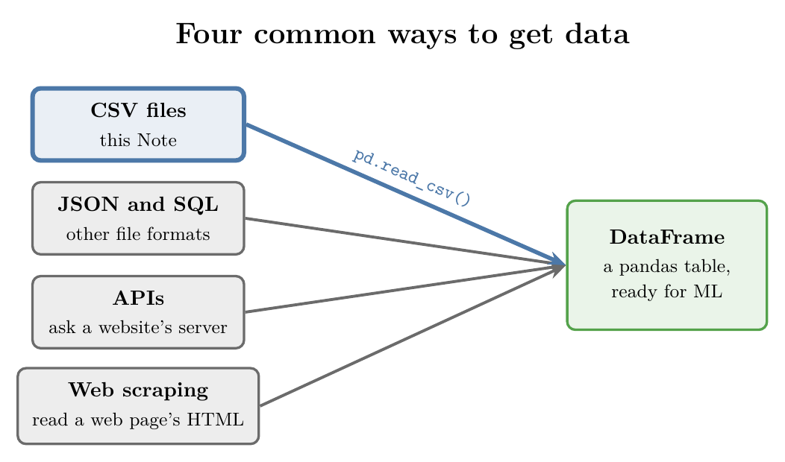
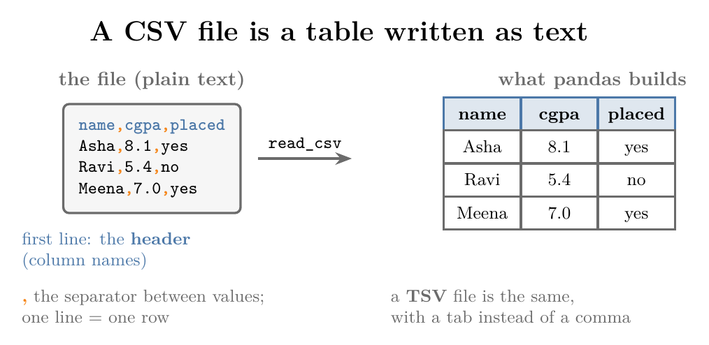
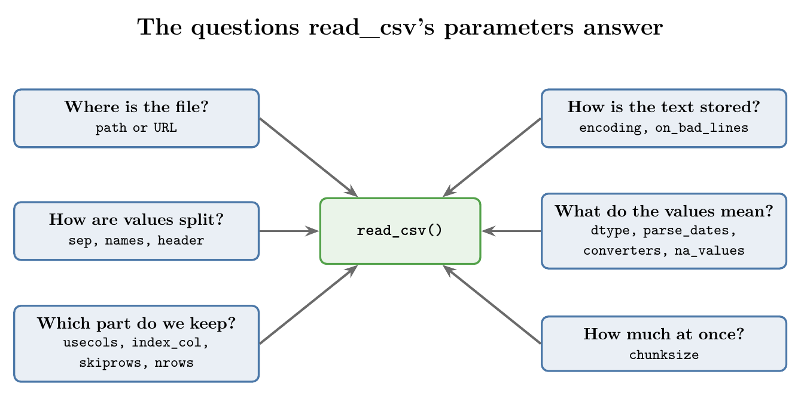
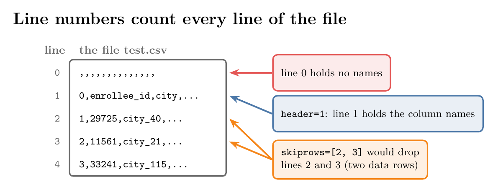

<!-- where-this-fits: generated by course_map/build_map.py; edit concepts.yaml, not this block -->
> **Where this fits:** Pipeline map step 2 (Get data). See the [Course map](../01-course-map/note.md).
>
> 
>
> - **Leads to:** Exploratory data analysis ([Note 19](../19-understanding-your-data/note.md)); Date and time features ([Note 34](../34-date-and-time/note.md)).
> - **Compare with:** Web scraping ([Note 9](../09-mldlc/note.md)); JSON and SQL data ([Note 16](../16-working-with-json-and-sql/note.md)).
<!-- /where-this-fits -->

## 1. Overview

> **Key point:** Most ML data arrives as CSV files, and one pandas function, `read_csv`, turns them into tables, with a parameter for almost every problem a file can have.



Data is the fuel of ML: a good algorithm given too little data performs worse than a weak algorithm given plenty. So before modelling, we must be able to bring in data from wherever it lives. Figure 1 shows the four common sources:

- **CSV files:** plain text tables. The most common format, and the easiest; this Note.
- **JSON and SQL:** JSON is the usual format when programs exchange data; SQL databases store a company's tables.
- **APIs:** a website's server sends us its data on request.
- **Web scraping:** when there is no file and no API, a program reads a web page's HTML and pulls out the useful parts.

Other sources exist, such as cloud data warehouses (for example Google BigQuery) and NoSQL databases. These four cover most projects.

## 2. CSV and TSV files

> **Key point:** A CSV file is a table written as text: one row per line, values separated by commas, and usually a first line of column names.



A **CSV file** (comma-separated values) stores a table as plain text. Each row is one line, and a comma separates each value from the next (Figure 2). The first line is usually the **header**: the column names.

A **TSV file** (tab-separated values) is the same thing with a tab between values instead of a comma. TSV files are less common, but we meet them, so we need to know how to read them too.

## 3. The read_csv function

> **Key point:** `pd.read_csv` reads a CSV file into a DataFrame; its many parameters handle the ways real files differ from the ideal.

Every CSV file in this Note is read with one function, `pd.read_csv`. Called with only a file name, it assumes a well-behaved file: commas between values, column names on the first line, UTF-8 text, and the same number of values on every line.

Real files break these assumptions. The function's **parameters** (the named settings we pass inside the brackets, like `sep=";"`) tell it how this particular file differs. The official pandas documentation lists 44 of them in pandas 3.0; this Note covers the fifteen or so that solve the common problems.



Figure 3 groups them by the question each one answers. The rest of the Note takes them one at a time, each with a small before-and-after example. The Notebook (`notebook.ipynb`) runs every example.

> **Extra:** This Note is written for pandas 3. A few parameters seen in older code no longer exist: `squeeze` (Section 10), `error_bad_lines` (Section 13) and combining date columns inside `parse_dates` (Section 15). Each section shows the current way.

## 4. Opening a file on our machine

> **Key point:** Pass the file's path; if the file sits in the same folder as our code, the name alone is enough.

> **Python:** Reading a local file.
>
> ```python
> import pandas as pd
>
> df = pd.read_csv("aug_train.csv")       # file in the same folder
> df = pd.read_csv("data/aug_train.csv")  # file in a sub-folder "data"
> ```
>
> `"data/aug_train.csv"` is a **relative path**: the location of the file starting from the folder our code runs in.

Our main example file holds job seekers who took a data-science training course: city, gender, education, experience, training hours, and a `target` column (1 if the person was looking for a job change, 0 if not). We use its first 1,000 rows, so `df.shape` is `(1000, 14)`.

## 5. Opening a file from a URL

> **Key point:** `read_csv` also accepts a web address, and downloads the file itself.

> **Python:** Reading a file from a URL.
>
> ```python
> url = ("https://raw.githubusercontent.com/"
>        "cs109/2014_data/master/countries.csv")
> countries = pd.read_csv(url)    # 194 rows, 2 columns
> ```

Some servers refuse requests that do not look like they come from a web browser. Browsers identify themselves with a short text called the **User-Agent**, so we send one too:

> **Python:** Sending a browser-like User-Agent.
>
> ```python
> headers = {"User-Agent": "Mozilla/5.0"}
> pd.read_csv(url, storage_options=headers)
> ```

> **Extra:** Another common recipe downloads the text with the `requests` library, then hands it to pandas as if it were a file:
>
> ```python
> import requests
> from io import StringIO
>
> text = requests.get(url, headers=headers).text
> pd.read_csv(StringIO(text))
> ```
>
> `StringIO` wraps a string so that functions expecting a file can read it. Both ways give the same DataFrame; passing the URL straight to pandas is shorter.

## 6. Separators and column names (sep, names)

> **Key point:** `sep` tells pandas what separates the values; `names` supplies column names when the file has none.

By default `sep=","`. Our movie file is a TSV, and it has no header line. Its first two lines look like this (each gap is a tab):

```
m0   10 things i hate about you   1999   6.90   62847   ['comedy' 'romance']
m1   1492: conquest of paradise   1992   6.20   10421   ['adventure' ...]
```

**Before:** `pd.read_csv("movie_titles_metadata.tsv")` finds no commas, so each whole line becomes a single value in one column. The first line, a movie, becomes the column name.

**After:** we set the separator to a tab, written `"\t"` in Python, and give the six columns names ourselves.

> **Python:** `sep` and `names`.
>
> ```python
> cols = ["sno", "name", "release_year",
>         "rating", "votes", "genres"]
> movies = pd.read_csv("movie_titles_metadata.tsv",
>                      sep="\t", names=cols)
> ```
>
> Square brackets make a **list**: an ordered collection of values, here six strings.

| sno | name | release_year | rating | votes | genres |
|---|---|---|---|---|---|
| m0 | 10 things i hate about you | 1999 | 6.9 | 62847.0 | ['comedy' 'romance'] |
| m1 | 1492: conquest of paradise | 1992 | 6.2 | 10421.0 | ['adventure' ...] |

With `names`, the first line is kept as data: 617 movies. With `sep="\t"` alone, the first movie would be used as the header, leaving 616.

## 7. Choosing the index (index_col)

> **Key point:** `index_col` turns one of the file's columns into the row labels.

Every DataFrame has an **index**: the labels down its left side. By default pandas numbers the rows 0, 1, 2, and so on. Our job-seekers file already has a unique number for each person, `enrollee_id`, so keeping both is redundant.

> **Python:** `index_col`.
>
> ```python
> pd.read_csv("aug_train.csv", index_col="enrollee_id")
> ```

Before (first two rows):

| (index) | enrollee_id | city |
|---|---|---|
| 0 | 8949 | city_103 |
| 1 | 29725 | city_40 |

After:

| enrollee_id (index) | city |
|---|---|
| 8949 | city_103 |
| 29725 | city_40 |

This is a convenience, not a necessity: it saves a column and lets us look rows up by ID.

## 8. Choosing the header line (header)

> **Key point:** `header` says which line of the file holds the column names, counting the first line as 0.

Sometimes whoever saved a file left junk above the column names. In `test.csv` (Figure 4), line 0 is only commas, and the real names are on line 1.



**Before:** `pd.read_csv("test.csv")` uses line 0 as the header. With no names there, pandas invents `Unnamed: 0`, `Unnamed: 1`, and so on, and the real names end up as the first data row.

**After:** `header=1` uses line 1.

> **Python:** `header`.
>
> ```python
> pd.read_csv("test.csv", header=1)
> ```

| 0 | enrollee_id | city | city_development_index | ... |
|---|---|---|---|---|
| 1 | 29725 | city_40 | 0.776 | ... |
| 2 | 11561 | city_21 | 0.624 | ... |

So `header` and `names` solve two different problems:

- The names are on the wrong line: use `header`.
- The file has no names at all: use `names` (Section 6).

## 9. Loading only some columns (usecols)

> **Key point:** If we know which columns we need, `usecols` loads only those and drops the rest at once.

Often we know from the start that we need only a few columns. Loading only those saves memory and a cleaning step.

> **Python:** `usecols`.
>
> ```python
> pd.read_csv("aug_train.csv",
>             usecols=["enrollee_id", "gender", "education_level"])
> ```

| enrollee_id | gender | education_level |
|---|---|---|
| 8949 | Male | Graduate |
| 29725 | Male | Graduate |
| 11561 | NaN | Graduate |

The result has these 3 columns instead of 14. `NaN` ("not a number") is how pandas shows a **missing value**.

## 10. One column as a Series (squeeze)

> **Key point:** A single column can be held as a Series instead of a one-column DataFrame.

A **Series** is pandas' one-column structure: a list of values with an index. A DataFrame is several Series side by side. When we load just one column, a Series is often what we want.

Older pandas had a `squeeze=True` parameter for this. It was removed in pandas 2, and passing it now raises a `TypeError`. Instead, we read normally and then squeeze the result:

> **Python:** Getting a Series.
>
> ```python
> gender = pd.read_csv("aug_train.csv",
>                      usecols=["gender"]).squeeze("columns")
> type(gender)   # pandas.Series
> ```
>
> `.squeeze("columns")` turns a DataFrame with exactly one column into a Series.

This option is rarely needed; most code simply works with DataFrames.

## 11. Skipping rows and limiting rows (skiprows, nrows)

> **Key point:** `skiprows` leaves out chosen lines of the file; `nrows` reads only the first few rows.

### 11.1 skiprows

> **Key point:** `skiprows` takes line numbers of the file, or a rule that picks them.

`skiprows` takes a list of line numbers to leave out. The numbers count lines in the file, as in Figure 4, and line 0 is the header line.

> **Python:** `skiprows`.
>
> ```python
> # drop file lines 1 and 2: the first two data rows
> pd.read_csv("aug_train.csv", skiprows=[1, 2])
> ```

| | Before: first rows (enrollee_id) | After skiprows=[1, 2] |
|---|---|---|
| row 0 | 8949 | 11561 |
| row 1 | 29725 | 33241 |
| row 2 | 11561 | 666 |

The numbers do not have to be next to each other: `skiprows=[1, 5, 9]` works too.

> **Extra:** A common slip is `skiprows=[0]`, meant as "skip the first row". Line 0 is the header line, so this throws away the column names and the first data row (`8949, city_103, ...`) becomes the header instead.

`skiprows` can also take a function: pandas calls it with each line number and skips the line when it returns `True`. This lets us skip by a rule, for example every second row.

> **Python:** A rule for `skiprows`.
>
> ```python
> # keep the header (line 0); skip every even line after it
> pd.read_csv("aug_train.csv",
>             skiprows=lambda i: i > 0 and i % 2 == 0)
> ```
>
> `lambda i: ...` is a **lambda**: a one-line function without a name. `i % 2` is the remainder after dividing by 2, so `i % 2 == 0` means "i is even". The result has 500 of the 1,000 rows.

### 11.2 nrows

> **Key point:** `nrows=100` reads only the first 100 data rows.

> **Python:** `nrows`.
>
> ```python
> pd.read_csv("aug_train.csv", nrows=100).shape   # (100, 14)
> ```

This helps with very large files, with millions of rows. We can load a small piece first to look at the columns and test our code, before committing the memory to the whole file.

## 12. Text encoding (encoding)

> **Key point:** If pandas raises a `UnicodeDecodeError`, the file is not stored as UTF-8, and we must tell `read_csv` its encoding.

A computer stores text as numbers (bytes). An **encoding** is the rulebook that maps characters to bytes and back. Most files use **UTF-8**, which covers almost every character in every language, and it is `read_csv`'s default.

Some files use a different encoding, for example older files, or files in a particular language. Reading them as UTF-8 fails. Our restaurants file (a sample of the Zomato dataset) does this:

**Before:**

```
pd.read_csv("zomato.csv")
UnicodeDecodeError: 'utf-8' codec can't decode byte 0xed
in position 7044: invalid continuation byte
```

**After:** we name the file's encoding.

> **Python:** `encoding`.
>
> ```python
> pd.read_csv("zomato.csv", encoding="latin-1")   # loads: 39 rows
> ```

When we see this error, we have two options:

1. Find out the file's encoding and pass it in `encoding`.
2. Open the file in a text editor (such as Sublime Text or VS Code) and save it again as UTF-8. Characters that cannot be converted may turn into blanks or odd symbols.

> **Extra:** `latin-1` maps every possible byte to some character (Python docs, `codecs`), so it never raises this error. That does not mean the text comes out right. In our file, a restaurant called "Café Daniel Briand" shows up as "Cafí© Daniel Briand", because the file's text was already garbled before it was saved: after "Caf" the file holds the bytes `ED A9`, which are neither the latin-1 "é" (`E9`) nor the UTF-8 "é" (`C3 A9`). If letters look wrong after loading, try other common encodings such as `"cp1252"` (Windows) and compare.

## 13. Skipping bad lines (on_bad_lines)

> **Key point:** A line with more values than the header stops `read_csv` with a `ParserError`; `on_bad_lines="skip"` drops such lines and loads the rest.

Some files are mostly fine but have a few broken lines. For example, a file with 4 columns may have a line with 5 values, often because a value itself contained the separator. Our small books file (separated by `;`) has one:

```
isbn;title;author;year
0060973129;Decision in Normandy;Carlo D'Este;1991
0374157065;Flu; The Story of the 1918 Pandemic;Gina Kolata;1999
```

The title "Flu; The Story of the 1918 Pandemic" contains a `;`, so that line splits into 5 values.

**Before:** `pd.read_csv("books.csv", sep=";")` stops with `ParserError: Expected 4 fields in line 5, saw 5`. A **parser** is the part of a program that reads text and splits it into pieces; a parser error is a strong hint that some lines do not fit.

**After:** we tell pandas what to do with bad lines.

> **Python:** `on_bad_lines`.
>
> ```python
> pd.read_csv("books.csv", sep=";", on_bad_lines="skip")
> ```
>
> `"skip"` drops bad lines silently, `"warn"` drops them and prints which ones, and `"error"` (the default) stops.

The result has 4 books: the broken line is gone.

> **Extra:** Older code writes `error_bad_lines=False`. That parameter was replaced by `on_bad_lines` in pandas 1.3 and removed in pandas 2 (pandas release notes), so it now raises a `TypeError`. Skipping is the quick fix; if many lines are bad, it is worth looking at them, because the real problem may be a wrong `sep`.

## 14. Choosing column types (dtype)

> **Key point:** pandas guesses each column's type; `dtype` lets us set it ourselves, for example to save memory.

Each column has one data type, its **dtype**: whole numbers (`int64`), decimals (`float64`), text (`str`), and so on. `read_csv` guesses each column's dtype from its values, and we can see the guesses with `df.info()`.

In our job-seekers file, `target` holds only 0 and 1, but it is written as `0.0` and `1.0`, so pandas reads it as `float64`. A whole-number type is the natural choice for a 0/1 column.

> **Python:** `dtype`.
>
> ```python
> df = pd.read_csv("aug_train.csv", dtype={"target": "int8"})
> df["target"].dtype    # int8
> ```
>
> Curly brackets make a **dictionary**: pairs of `key: value`. Here the key is the column name and the value is the type we want.

| | dtype | bytes per value | memory for 1,000 rows |
|---|---|---|---|
| Before | float64 | 8 | 8,000 bytes |
| After | int8 | 1 | 1,000 bytes |

> **Extra:** The plain Python type also works, as in `dtype={"target": int}`, but on most computers `int` means `int64`, which takes the same 8 bytes as `float64`, so it saves nothing. `int8` holds whole numbers from -128 to 127, plenty for 0 and 1. The saving matters for files with millions of rows.

> **Extra:** In pandas 3, text columns get the dtype `str`. Older pandas (and older tutorials) show them as `object`.

## 15. Reading dates (parse_dates)

> **Key point:** Dates are read as plain text unless we list them in `parse_dates`; only then can we use date tools on them.

Our second dataset lists all 816 IPL cricket matches from 2008 to 2020, with the date of each match. By default `read_csv` reads `2008-04-18` as text. As text we cannot ask "which month?", "which weekday?" or "how many days between two matches?".

> **Python:** `parse_dates`.
>
> ```python
> ipl = pd.read_csv("ipl_matches_2008_2020.csv",
>                   parse_dates=["date"])
> ipl["date"].dt.day_name()           # Friday, Saturday, ...
> ipl["date"].max() - ipl["date"].min()   # 4589 days
> ```
>
> `.dt` gives access to date tools on a date column, such as `.dt.year` or `.dt.day_name()`.

| | dtype of `date` | Can we do date maths? |
|---|---|---|
| Before | `str` (text) | no |
| After | `datetime64` | yes: years, weekdays, differences |

The table looks the same either way; only `ipl.info()` shows the change in type.

Sometimes the day, month and year sit in three separate columns. Older pandas could merge them while reading, by passing a nested list such as `parse_dates=[["year", "month", "day"]]`. Today we read the file normally and build the date afterwards.

> **Python:** Combining date parts.
>
> ```python
> df["date"] = pd.to_datetime(df[["year", "month", "day"]])
> ```
>
> `pd.to_datetime` builds dates from columns named `year`, `month` and `day`.

> **Extra:** Combining columns inside `parse_dates` (a nested list or a dictionary) was deprecated in pandas 2.2 and removed in pandas 3.0. The `date_parser` parameter is gone too: deprecated in pandas 2.0, removed in 3.0 (pandas release notes). To give a date layout such as day/month/year, use `date_format="%d/%m/%Y"`.

## 16. Transforming values while reading (converters)

> **Key point:** `converters` runs our own function on every value of a column as the file is read.

Sometimes we want to change a column's values, for example to shorten long team names: "Royal Challengers Bangalore" to "RCB", "Mumbai Indians" to "MI". We write a function that takes one value and returns the new one.

> **Python:** A function for one value.
>
> ```python
> def rename(name):
>     if name == "Royal Challengers Bangalore":
>         return "RCB"
>     return name    # any other team: unchanged
> ```
>
> `def` defines a **function**: a named, reusable piece of code. `rename("Royal Challengers Bangalore")` returns `"RCB"`.

Then `converters` maps a column name to the function:

> **Python:** `converters`.
>
> ```python
> ipl = pd.read_csv("ipl_matches_2008_2020.csv",
>                   converters={"team1": rename})
> ```

| team1 before | team1 after |
|---|---|
| Royal Challengers Bangalore | RCB |
| Kings XI Punjab | Kings XI Punjab |

The dictionary can hold several columns, each with its own function, so any number of transformations can happen in one read.

## 17. Marking extra missing values (na_values)

> **Key point:** `na_values` lists values that should count as missing, such as placeholders like `-` or `?`.

Missing values that pandas recognises are easy to handle: functions such as `dropna` (drop them) and `fillna` (fill them) work on them directly. pandas already treats blanks, `NA`, `NaN`, `null` and a few similar strings as missing.

Trouble starts when a file marks missing values some other way, such as `-`, `?` or `not known`. pandas reads these as ordinary text, so they slip past every missing-value tool. `na_values` adds them to the list.

The example below is only a demonstration: we pretend "Male" is a placeholder in the `gender` column.

> **Python:** `na_values`.
>
> ```python
> pd.read_csv("aug_train.csv", na_values=["Male"])
> ```

| gender | count before | count after |
|---|---|---|
| Male | 689 | 0 |
| missing (NaN) | 231 | 920 |
| Female | 67 | 67 |
| Other | 13 | 13 |

Every "Male" became missing: 231 + 689 = 920. In real work we would pass the actual placeholders, for example `na_values=["-", "?"]`.

> **Extra:** The default list can also bite. In the IPL file, the `method` column holds the text `NA`, meaning "not applicable" (no rain rule was used). pandas reads it as missing: 797 values become NaN. To keep them as text, pass `keep_default_na=False`.

## 18. Reading a big file in chunks (chunksize)

> **Key point:** When a file is too big for memory, `chunksize` reads it a few rows at a time, so only one piece is in memory at once.

A file can be larger than our computer's memory (RAM). Loading it whole then fails, or makes the computer crawl. With `chunksize`, `read_csv` returns a **reader** instead of a DataFrame; each time we ask it for more, it reads the next **chunk** (a DataFrame of at most that many rows).


Figure 5 shows our 1,000-row file read with `chunksize=300`: four chunks of 300, 300, 300 and 100 rows. Each chunk is loaded, used, then released before the next one comes in. We never hold more than 300 rows at once.

> **Python:** Looping over chunks.
>
> ```python
> reader = pd.read_csv("aug_train.csv", chunksize=300)
>
> total = 0
> for chunk in reader:      # one chunk per step
>     print(chunk.shape)    # (300, 14) ... (100, 14)
>     total += len(chunk)   # use the chunk
> print(total)              # 1000
> ```
>
> A **for loop** repeats the indented lines once for each item, here once per chunk. `total += len(chunk)` adds the chunk's row count to `total`.

Any work goes inside the loop: counting, filtering, or computing totals that we combine at the end.

> **Extra:** Inside the loop, use the loop's own variable. A loop written `for chunks in reader:` that then prints `chunk.shape` uses a leftover `chunk` from earlier code, and prints the same shape every time. The reader is also used up after one loop; to loop again, call `read_csv` again.

## 19. Summary

| Problem with the file | Parameter | Example |
|---|---|---|
| File is on the web | path or URL | `read_csv(url)` |
| Values separated by tabs, `;`, ... | `sep` | `sep="\t"` |
| No column names | `names` | `names=["a", "b"]` |
| Names on a later line | `header` | `header=1` |
| A column should be the row labels | `index_col` | `index_col="id"` |
| Only a few columns needed | `usecols` | `usecols=["a", "b"]` |
| Want a Series | `.squeeze("columns")` | (was `squeeze=True`) |
| Unwanted lines | `skiprows` | `skiprows=[1, 2]` |
| Only a sample needed | `nrows` | `nrows=100` |
| `UnicodeDecodeError` | `encoding` | `encoding="latin-1"` |
| `ParserError` on a few lines | `on_bad_lines` | `on_bad_lines="skip"` |
| Wrong or wasteful type | `dtype` | `dtype={"target": "int8"}` |
| Dates read as text | `parse_dates` | `parse_dates=["date"]` |
| Values need changing | `converters` | `converters={"team1": rename}` |
| Odd missing-value markers | `na_values` | `na_values=["-", "?"]` |
| File too big for memory | `chunksize` | `chunksize=300` |

- A CSV file is a plain-text table: one row per line, commas between values, column names on the first line.
- `pd.read_csv` reads it into a DataFrame; each parameter fixes one way a real file differs from that ideal.
- Line numbers in `header` and `skiprows` count lines of the file, starting at 0 with the header line.
- In pandas 3, `squeeze`, `error_bad_lines` and date-combining in `parse_dates` are gone; use `.squeeze("columns")`, `on_bad_lines` and `pd.to_datetime`.

## Sources

- pandas release notes. What's new in 1.3.0, 2.0.0, 2.2.0 and 3.0.0. pandas.pydata.org/docs/whatsnew.
- Python documentation. `codecs`: Standard Encodings. docs.python.org.

## 20. Key terms

| Term | Meaning |
|---|---|
| CSV file | A text file holding a table: one row per line, commas between values |
| TSV file | Like a CSV file, with tabs between values |
| Header | The line of a file that holds the column names |
| Parameter | A named setting passed to a function, like `sep=";"` |
| Relative path | A file's location, starting from the folder the code runs in |
| User-Agent | A short text a browser sends to say what it is |
| Separator | The character between values on a line, such as `,` or a tab |
| Index | The row labels of a DataFrame |
| Series | pandas' one-column structure: values with an index |
| Missing value | An empty entry, shown by pandas as `NaN` |
| Encoding | The rulebook that maps text characters to stored bytes |
| UTF-8 | The most common encoding, and `read_csv`'s default |
| Parser | The part of a program that reads text and splits it into pieces |
| dtype | The data type of a column, such as `int64`, `float64` or `str` |
| Chunk | A piece of a file, read as a small DataFrame |
| Reader | What `read_csv` returns with `chunksize`: it hands out one chunk at a time |
| List, dictionary | Python's ordered collection `[...]`, and its `key: value` pairs `{...}` |
| Function, lambda | A named reusable piece of code (`def`), and a one-line unnamed one |
| For loop | Code that repeats once for each item of a collection |
