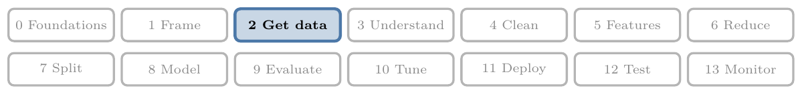
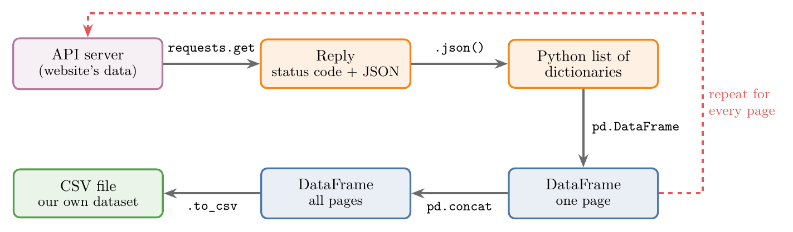
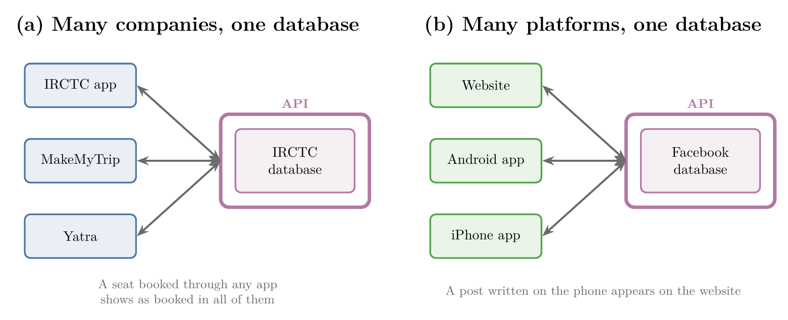
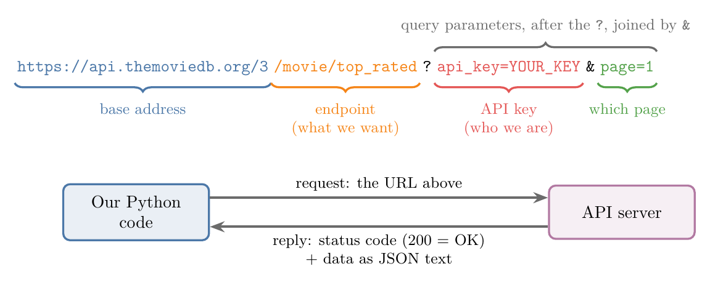
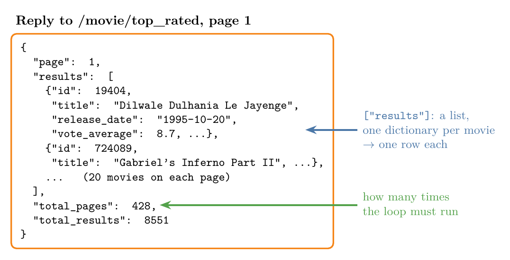
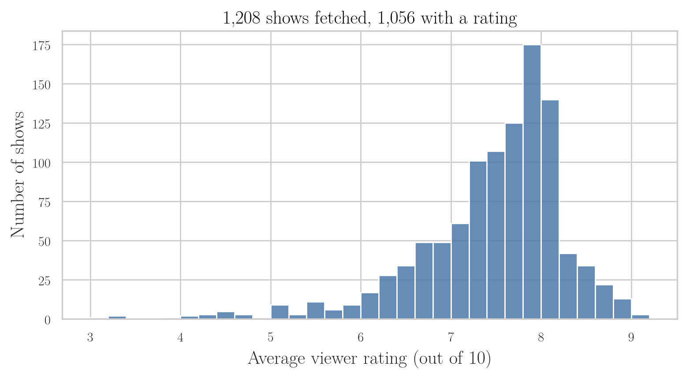

<!-- where-this-fits: generated by course_map/build_map.py; edit concepts.yaml, not this block -->
> **Where this fits:** Pipeline map step 2 (Get data). See the [Course map](../01-course-map/note.md).
>
> 
>
> - **Builds on:** JSON and SQL data ([Note 16](../16-working-with-json-and-sql/note.md)).
> - **Leads to:** Deployment ([Note 29](../29-pipelines/note.md)).
> - **Compare with:** Web scraping ([Note 9](../09-mldlc/note.md)).
<!-- /where-this-fits -->

## 1. Overview

> **Key point:** We can build our own dataset by asking a website's API for its data, page by page, and joining the replies into one DataFrame.

CSV files, JSON files and SQL databases hold data that someone has already collected. Often the data we want is still on a website, and no file exists. Many websites offer an **API** that hands out their data on request, so we can collect it ourselves.

Figure 1 shows the whole process. We send a request, get back a reply in JSON, turn it into a DataFrame, repeat for every page, join the pages and save the result as a CSV file.



The Notebook for this Note (`notebook.ipynb`) runs every step, with saved copies of the data in `data/`.

## 2. What an API is

> **Key point:** An API lets two pieces of software talk to each other; it carries data from one point to another.

**API** stands for **Application Programming Interface**. Almost everything we do today runs through some app, and behind the apps, APIs are what let different programs work together.

The simplest definition: an API lets two pieces of software talk to each other. Another way to see it: an API is a **data pipeline**, a channel that carries information from one point to another.

## 3. Why APIs exist: one database, many apps

> **Key point:** A company wraps its database in an API, so other apps and platforms can use the same data without ever getting the database itself.

### 3.1 Railway tickets

A train seat in India can be booked through many apps: IRCTC's own website, MakeMyTrip, Yatra and others. These are different companies, each with its own database. Yet if we book a seat through IRCTC, a person trying to book the same seat on MakeMyTrip sees it as booked.

IRCTC does not hand its database to MakeMyTrip. Instead, IRCTC writes functions around its database: the API (Figure 2a). When MakeMyTrip calls one of these functions with the right input, such as the train number, the date and the seat, IRCTC's server replies with the answer, in JSON: is the seat free or not?

### 3.2 One company, many platforms

Facebook has a website, a mobile website, an Android app and an iPhone app. All of them work on a single database, through one API (Figure 2b). The shared API is why a post written on the phone appears on the website at once.



> **Extra:** The app that asks is called the **client**, and the computer that answers is the **server**. Building APIs (in Python, for example with Flask or FastAPI) is a skill of its own; in this Note we only use them.

## 4. Asking an API for data

> **Key point:** A request to an API is a web address (URL): which data we want, who we are (the API key), and which page.

Our example website is **TMDB** (The Movie Database, `themoviedb.org`), a large database of movies. Its developer pages (`developers.themoviedb.org`) list many **endpoints**: addresses that each return one kind of data. One of them, `/movie/top_rated`, returns the top-rated movies in TMDB's database.

Figure 3 takes the request apart:

- **Base address:** where the API lives.
- **Endpoint:** what we want, here the top-rated movies.
- **Query parameters:** settings after the `?`, joined by `&`. Here the API key and the page number.



### 4.1 The API key

An **API key** is a secret code that tells the API who is asking. To get a TMDB key, we create a free account, log in, and open Settings, then the API section.

Each key has a limit on how many requests it can make. So every user should create their own key and never share it: if many people use one key, it runs out.

> **Extra:** Keep keys out of code. A key pasted into a notebook gets shared with the notebook, for example on GitHub. A safer way is to store it in an **environment variable**, a named value that lives on our computer, and read it in Python with `os.environ["TMDB_API_KEY"]`. The Python box in Section 6 does this.

## 5. Reading the reply

> **Key point:** The reply is JSON: a dictionary whose `results` key holds a list of dictionaries, one per movie, plus the page count we need for the loop.

If we paste the request URL into a web browser, the reply appears as a long block of text. That text is JSON (see *Working with JSON and SQL*). A **JSON viewer**, such as `jsonviewer.stack.hu`, lays the text out as a tree so we can see its structure.

Figure 4 shows the structure. JSON looks just like a Python dictionary:

- `page`: which page this is, here 1.
- `results`: a list. Inside it, one dictionary per movie, 20 movies per page. The first top-rated movie is *Dilwale Dulhania Le Jayenge*.
- `total_pages`: 428 pages in all.
- `total_results`: 8,551 movies in all.

{height=45%}

### 5.1 Planning the dataset

Before writing code, we decide what the final table should hold. Each movie will be one **observation** (one record, one row of the table). Each value we keep will be a **feature** (a variable describing the movie, one column of the table). From each movie's dictionary we keep 7 columns: `id`, `title`, `overview` (a short plot summary), `release_date`, `popularity`, `vote_average` and `vote_count`.

The plan follows from the reply's structure:

1. Request one page and turn its `results` into a DataFrame of 20 rows.
2. Do this 428 times, once per page, adding each page's rows to one big DataFrame.
3. The final table should have shape (8551, 7).

## 6. Fetching one page in Python

> **Key point:** `requests.get(url)` sends the request; `.json()` turns the reply into Python objects; `pd.DataFrame` turns a list of dictionaries into a table.

We need two libraries: pandas, and **requests**, which sends web requests from Python. Both come with Anaconda.

`requests.get(url)` sends the request and returns a **response** object. The response carries a **status code**, a number that says how the request went (RFC 9110, §15):

| Status code | Meaning |
|---|---|
| 200 | OK: everything worked |
| 401 | Not authorised: missing or wrong API key |
| 404 | Not found: what we asked for does not exist |
| 500 | Server error: the server is down or broken |

`response.json()` reads the JSON text into Python dictionaries and lists. Then `["results"]` picks out the list of movies, and `pd.DataFrame(...)` makes it a table: one row per dictionary, one column per key. Finally, a list of column names keeps only the 7 columns we planned.

> **Python:** One page from TMDB (needs a free key, stored in an environment variable).
>
> ```python
> import os
> import pandas as pd
> import requests
>
> url = "https://api.themoviedb.org/3/movie/top_rated"
> settings = {"api_key": os.environ["TMDB_API_KEY"],
>             "language": "en-US", "page": 1}
> response = requests.get(url, params=settings)
> response.status_code          # 200
>
> movies = response.json()["results"]   # list of 20 dicts
> columns = ["id", "title", "overview", "release_date",
>            "popularity", "vote_average", "vote_count"]
> temp_df = pd.DataFrame(movies)[columns]
> temp_df.shape                 # (20, 7)
> ```
>
> `params=` builds the part after the `?` for us, so the key never sits inside the URL text.

> **Extra:** What changed. TMDB still works, but only with a personal key. Without one it replies with status code 401 and the message "Invalid API key". So the Notebook uses **TVmaze** (`api.tvmaze.com`), a free TV-show database that needs no key. TVmaze returns the same kind of data: shows with a name, premiere date, average rating, popularity score (`weight`) and summary. A saved real reply, `data/tvmaze_shows_page0.json`, lets the Notebook run without internet (checked October 2026).

The TVmaze reply differs from TMDB's in two ways:

- The reply is the list itself, with no `results` key around it, and no total page count.
- Each page holds up to 250 shows (TVmaze API docs); page 0 has 240, because deleted shows leave gaps.

> **Python:** One page from TVmaze (no key).
>
> ```python
> url = "https://api.tvmaze.com/shows?page=0"
> response = requests.get(url, timeout=10)
> shows = response.json()        # list of 240 dicts
>
> page_df = pd.json_normalize(shows)
> columns = ["id", "name", "language", "premiered",
>            "rating.average", "weight", "summary"]
> page_df = page_df[columns]
> page_df.shape                  # (240, 7)
> ```
>
> `timeout=10` gives up after 10 seconds instead of waiting forever.

> **Extra:** In TVmaze, the rating is a small dictionary inside each show: `"rating": {"average": 6.6}`. `pd.DataFrame` would put the whole dictionary into one cell. `pd.json_normalize` opens nested dictionaries into their own columns, so we get a column `rating.average` holding 6.6.

## 7. Looping over every page

> **Key point:** A loop repeats the one-page code for every page; `ignore_index=True` numbers the joined rows 0, 1, 2, ... without repeats.

One page is only a small part of the data. To get everything, we run the one-page code in a **for loop**, once per page, changing only the page number in the URL. For TMDB that is `range(1, 429)`: pages 1 to 428, because `range` stops just before its end value.

Each pass builds a small DataFrame, `temp_df`, and adds it to a list. After the loop, `pd.concat` joins all the pages into one DataFrame. Figure 5 shows this with the first 5 TVmaze pages: 1,208 shows.

{height=45%}

Every page's DataFrame numbers its rows from 0. Joined as they are, the index labels would repeat: 0 to 239, then 0 to 244 again, and so on. With `ignore_index=True`, pandas throws the old labels away and numbers the rows 0 to 1,207 (Figure 5, last frame).

> **Python:** The loop (TVmaze, first 5 pages).
>
> ```python
> import time
>
> frames = []                        # one DataFrame per page
> for page in range(0, 5):
>     url = f"https://api.tvmaze.com/shows?page={page}"
>     response = requests.get(url, timeout=10)
>     if response.status_code != 200:
>         break                      # 404: no more pages
>     temp_df = pd.json_normalize(response.json())[columns]
>     frames.append(temp_df)
>     time.sleep(0.5)                # be gentle with the server
>
> df = pd.concat(frames, ignore_index=True)
> df.shape                           # (1208, 7)
> ```
>
> An **f-string** such as `f"...{page}"` is text in which Python puts the value of `page` in place of `{page}`. `break` leaves the loop early. `frames.append(temp_df)` adds one item to the end of the list.

Fetching all of TMDB's 428 pages takes about two minutes, because each page is a separate trip to the server. The result has 8,551 rows and 7 columns, as planned.

> **Extra:** Older code grew the table inside the loop with `df = df.append(temp_df, ignore_index=True)`. pandas 2.0 removed `DataFrame.append` (pandas release notes); it now fails with `AttributeError`. Collecting the pages in a list and calling `pd.concat` once at the end replaces it, and is also faster.

> **Extra:** Most APIs have a **rate limit**: a maximum number of requests in a given time. TVmaze allows at least 20 requests every 10 seconds (TVmaze API docs) and answers status code 429 ("too many requests") beyond that. `time.sleep(0.5)` waits half a second between pages, which keeps us under the limit. TVmaze has about 380 pages (roughly 90,000 shows); `range(0, 400)` fetches them all, and the 404 after the last page ends the loop.

## 8. Saving the dataset

> **Key point:** `df.to_csv("file.csv")` saves the DataFrame as a CSV file, our own dataset ready for analysis.

Once the loop has finished, one line saves the table, for example as `movies.csv`. From then on we can load it with `read_csv` (see *Working with CSV Files*) without calling the API again.

> **Python:** Saving and reloading.
>
> ```python
> df.to_csv("data/shows.csv", index=False)
> pd.read_csv("data/shows.csv").shape   # (1208, 7)
> ```
>
> `index=False` leaves out the row numbers. Without it, the file gets an extra unnamed first column holding 0, 1, 2, ...

Figure 6 is a first look at the dataset we built: most of the 1,056 rated shows score between 7 and 8.5 out of 10. The other 152 shows have no rating yet (missing values).



## 9. Sharing datasets and finding more APIs

> **Key point:** A dataset built from an API can be shared on Kaggle, and RapidAPI lists many free APIs to build more.

**Kaggle** is a website where people share datasets, notebooks and write-ups, and take part in ML competitions. Uploading a dataset we built ourselves, such as the movies table, adds to our Kaggle profile. A strong profile (datasets, notebooks, competitions, discussions) helps when applying for internships and jobs.

For more data, **RapidAPI** (`rapidapi.com`) keeps a list of free APIs in many categories: football, cities, weather, real estate, Instagram, Amazon and more. Any of them works with the same recipe:

1. Read the API's documentation and find the endpoint.
2. Look at one reply in a JSON viewer and plan the columns.
3. Fetch one page into a DataFrame, then loop over all pages.
4. Save the result as a CSV file.

> **Extra:** Before sharing a dataset, check the API's terms of use. Some APIs allow personal use only, or ask that the data's source be credited. TMDB, for example, asks to be credited as the data source (TMDB API FAQ).

## 10. Summary

| Step | Code | TMDB (original) | TVmaze (Notebook) |
|---|---|---|---|
| Request a page | `requests.get(url)` | needs an API key | no key |
| Read the reply | `response.json()` | dict; movies in `["results"]` | the list itself |
| One page to a table | `pd.DataFrame` / `pd.json_normalize` | 20 rows | up to 250 rows |
| Loop over pages | `for page in range(...)` | 428 pages | about 380 pages (5 in the Notebook) |
| Join the pages | `pd.concat(frames, ignore_index=True)` | 8,551 rows, 7 columns | 1,208 rows, 7 columns |
| Save | `df.to_csv(...)` | `movies.csv` | `data/shows.csv` |

- An API lets two programs talk; companies wrap a database in an API so many apps can share it.
- A request is a URL: base address, endpoint, and query parameters such as the API key and page.
- The status code says how it went: 200 OK, 401 bad key, 404 not found, 500 server error.
- The reply is JSON; a list of dictionaries becomes a DataFrame with one row per dictionary.
- Loop over the pages, collect the DataFrames in a list, then `pd.concat(..., ignore_index=True)`.
- Keep API keys out of code, and respect the API's rate limit.

## 11. Sources

**Built from**

- CampusX, "Fetching Data From an API | Day 17 | 100 Days of Machine Learning", YouTube, https://www.youtube.com/watch?v=roTZJaxjnJc

**Other references**

- Fielding, R., Nottingham, M. and Reschke, J. (2022). HTTP Semantics. RFC 9110, IETF. Section 15: Status Codes. rfc-editor.org/rfc/rfc9110.
- pandas release notes. What's new in 2.0.0. pandas.pydata.org/docs/whatsnew.
- TMDB. API FAQ (attribution). developer.themoviedb.org/docs/faq.
- TVmaze. API documentation (show index, rate limiting). tvmaze.com/api.

## 12. Key terms

| Term | Meaning |
|---|---|
| API (Application Programming Interface) | A way for two programs to talk; a website's API hands out its data on request |
| Observation | One record of the data, one row of the table |
| Feature | A variable describing each observation, one column of the table |
| Data pipeline | A channel that carries data from one point to another |
| Client, server | The program that asks, and the computer that answers |
| Endpoint | One address of an API that returns one kind of data |
| Query parameters | Settings after the `?` in a URL, joined by `&`, such as `page=1` |
| API key | A secret code that tells the API who is asking |
| Environment variable | A named value stored on the computer, outside the code, read with `os.environ` |
| JSON viewer | A tool that lays out JSON text as a tree to show its structure |
| requests | Python library that sends web requests |
| Response | What `requests.get` returns: the status code plus the reply |
| Status code | A number saying how a request went: 200 OK, 401, 404, 500 |
| `json_normalize` | pandas function that turns nested JSON into flat columns |
| f-string | Text starting with `f` in which `{name}` is replaced by a value |
| `pd.concat` | pandas function that joins several DataFrames into one |
| `ignore_index` | Setting of `pd.concat` that renumbers the joined rows from 0 |
| Rate limit | The most requests an API accepts in a given time |
| Kaggle | A website for sharing datasets and notebooks and for ML competitions |
| RapidAPI | A website listing many APIs, including free ones |
