<!-- where-this-fits: generated by course_map/build_map.py; edit concepts.yaml, not this block -->
> **Where this fits:** Pipeline map step 3 (Understand data). See the [Course map](../01-course-map/note.md).
>
> 
>
> - **Builds on:** Descriptive statistics ([Note 19](../19-understanding-your-data/note.md)); Exploratory data analysis ([Note 19](../19-understanding-your-data/note.md)); Univariate analysis ([Note 20](../20-univariate-analysis/note.md)).
> - **Leads to:** Feature selection ([Note 23](../23-what-is-feature-engineering/note.md)); Correlation significance test ([Note 570](../570-choosing-a-hypothesis-test/note.md)).
> - **Compare with:** Pandas Profiling ([Note 22](../22-pandas-profiling/note.md)); Covariance and covariance matrix ([Note 48](../48-pca-step-by-step/note.md)); Correlation and causation ([Note 231](../231-covariance-and-correlation/note.md)).
<!-- /where-this-fits -->

## 1. Overview

> **Key point:** To study two columns together, we first check their types; each pair of types has its own plots.

Univariate analysis looks at one column at a time. Here we look at columns together:

- **Bivariate analysis:** studying two columns together, to find how they are related.
- **Multivariate analysis:** studying more than two columns together in one view.

Each column is a variable. In ML, an input variable is a **feature** (G-772; one column of the data table), the variable we want to predict is the **target** (G-1949), and each row, one record, is an **observation** (G-1374).

The choice of plot depends on the data types of the two columns. Two columns can be numerical + numerical, numerical + categorical, or categorical + categorical. Figure 1 shows the plots that suit each pair.

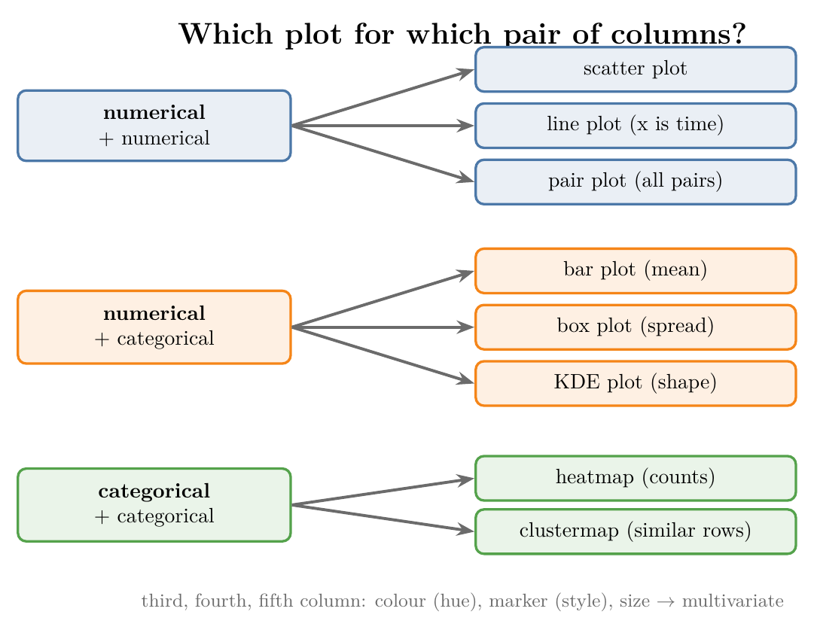{height=45%}

Most plots also take extra settings (colour, marker shape, dot size), each tied to a further column. These settings turn a bivariate plot into a multivariate one. The Notebook (`notebook.ipynb`) draws every plot in this Note, with interactive charts.

## 2. Four datasets for four kinds of plots

> **Key point:** No single dataset suits every plot, so we use four small ones: restaurant tips, Titanic passengers, airline flights and iris flowers.

Each technique works best on a certain kind of data, so the examples come from four datasets:

| Dataset | Rows | One row is | Columns we use |
|---|---|---|---|
| Tips | 244 | one restaurant bill | `total_bill`, `tip` (US dollars), `sex`, `smoker`, `day`, `time`, `size` (people at the table) |
| Titanic | 891 | one passenger | `Survived`, `Pclass`, `Sex`, `Age`, `SibSp`, `Parch`, `Embarked` |
| Flights | 144 | one month of a US airline, 1949 to 1960 | `year`, `month`, `passengers` (thousands) |
| Iris | 150 | one flower | `sepal_length`, `sepal_width`, `petal_length`, `petal_width` (cm), `species` |

The Titanic columns are the same as in the Note on understanding data: `SibSp` counts siblings or spouses aboard, and `Parch` counts parents or children aboard. The iris flowers belong to three species: setosa, versicolor and virginica.

> **Python:** Loading the data.
>
> ```python
> import pandas as pd
>
> tips = pd.read_csv("data/tips.csv")
> titanic = pd.read_csv("data/titanic_train.csv")
> flights = pd.read_csv("data/flights.csv")
> iris = pd.read_csv("data/iris.csv")
> ```
>
> Tips, flights and iris ship with the seaborn library: `sns.load_dataset("tips")` downloads them. We keep local copies in `data/`, so the Notebook runs offline.

## 3. Scatter plot: two numerical columns

> **Key point:** A scatter plot draws one dot per observation, with one numerical column on each axis; the cloud of dots shows how the two are related.

### 3.1 Total bill against tip

> **Key point:** Bigger bills get bigger tips: the dots rise from left to right.

A **scatter plot** (G-1749) puts one numerical column on the x-axis and another on the y-axis, and draws one dot per observation (one row). In the tips data, each dot is one bill: its total on x, its tip on y.

Figure 2 shows the result. The dots rise from left to right: as the total bill grows, the tip grows too. The pattern is a roughly **linear relationship** (G-1095), one that follows a straight line.

The tips themselves explain the line: they are close to a fixed share of the bill. Half of all tips lie between 13% and 19% of the bill, with a median of 15%. A few dots break the trend, such as a 7-dollar bill with a 5-dollar tip, but the general direction is clear.

> **Extra:** Their correlation, from the Note on understanding data, is $r = 0.68$: a clear positive link, but not a perfect line.

### 3.2 Adding more columns: colour, marker and size

> **Key point:** Colour, marker shape and dot size can each show one more column, so one scatter plot can hold five columns.

A scatter plot has room for more information than its two axes. Three settings each tie a visual property to one more column:

- **hue:** dot colour shows a category. Here, blue dots are male customers and orange dots female.
- **style:** marker shape shows a category. Here, circles are non-smokers and crosses smokers.
- **size:** dot size shows a number. Here, bigger dots are bigger parties.

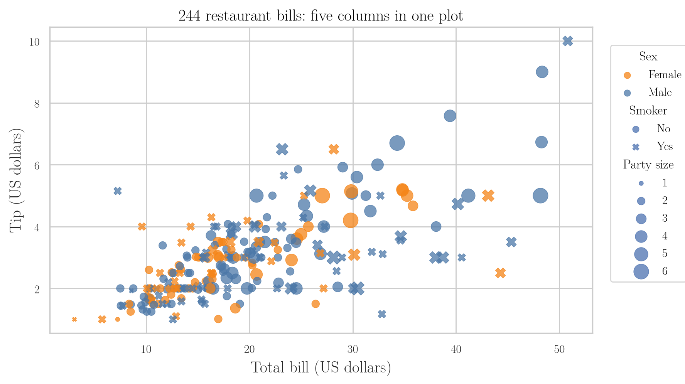

Figure 2 uses all three. Figure 2 shows five columns at once: the bill, the tip, the customer's sex, whether they smoke, and how many people were at the table. Showing more than two columns at once is multivariate analysis.

Reading it, the bills and tips far from the main cloud (the biggest ones) mostly come from male customers. The biggest dots also sit towards the right: larger parties run up larger bills.

> **Python:** A scatter plot with three extra columns.
>
> ```python
> import plotly.express as px
>
> px.scatter(tips, x="total_bill", y="tip",
>            color="sex", symbol="smoker", size="size")
> ```
>
> In Plotly, `color`, `symbol` and `size` play the roles of hue, style and size. In seaborn the same plot is `sns.scatterplot(data=tips, x="total_bill", y="tip", hue="sex", style="smoker", size="size")`.

> **Extra:** More than four or five columns in one plot becomes hard to read. Hue and style work best with few categories (two or three), and size only shows large differences well.

## 4. Bar plot: a numerical column across categories

> **Key point:** A bar plot shows one number per category, by default the mean; each bar's height is the average of the numerical column for that group.

A **bar plot** (G-258) puts a categorical column on the x-axis and a numerical column on the y-axis. Each bar's height is the **mean** (G-1203) of the numerical column for that category.

On the Titanic, we can ask: what was the average age of the passengers in each class? With `Pclass` on x and `Age` on y, the bars give:

| Class | 1st | 2nd | 3rd |
|---|---|---|---|
| Mean age (years) | 38.2 | 29.9 | 25.1 |

First-class passengers were the oldest on average, about 38. Second and third class were younger, and closer to each other.

The hue setting splits each bar by a further column. Figure 3 splits each class by sex: in every class, the men were on average older than the women.

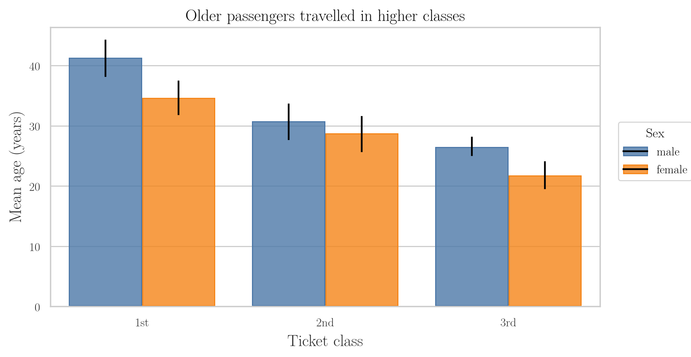

> **Python:** A bar plot of means.
>
> ```python
> mean_age = (titanic
>             .groupby(["Pclass", "Sex"], as_index=False)["Age"]
>             .mean())
> px.bar(mean_age, x="Pclass", y="Age",
>        color="Sex", barmode="group")
> ```
>
> Plotly draws the bars we give it, so we compute the means first with `groupby`. seaborn computes them itself: `sns.barplot(data=titanic, x="Pclass", y="Age", hue="Sex")`.

> **Extra:** The black line on each bar in Figure 3 is a **confidence interval** (G-446): a range in which the true mean most likely lies (by default, with 95% confidence). A short line means many passengers and a reliable mean; a long one means few passengers or very spread-out ages. seaborn draws these lines by default (seaborn docs, `barplot`: `errorbar=("ci", 95)`).

## 5. Box plot: spread of a numerical column across categories

> **Key point:** Side-by-side box plots compare the whole spread of a numerical column across categories, not only its mean.

A **box plot** (G-329) summarises a numerical column by its median, its quartiles and its outliers (it is covered in detail with univariate analysis). Drawn once per category, side by side, it compares whole distributions, not only averages.

Figure 4 puts `Sex` on the x-axis and `Age` on the y-axis, and splits each sex by survival (hue). The plot also shows the outliers: the dots above the boxes, mostly among the men.

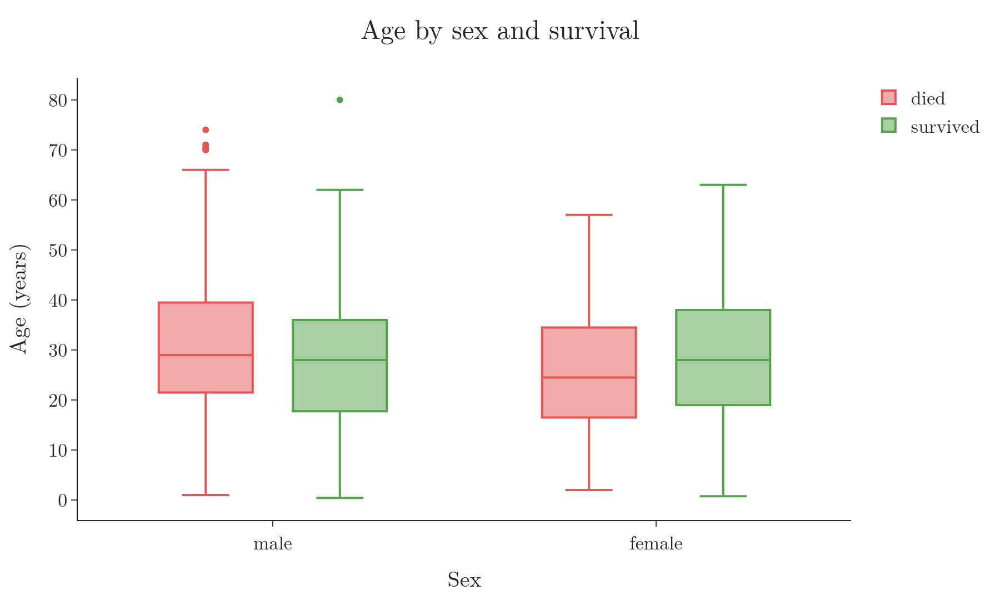

Two patterns stand out:

- **Men:** those who survived were slightly younger (median 28) than those who died (median 29), and their box reaches lower ages.
- **Women:** the opposite: those who survived were older (median 28) than those who died (median 24.5).

> **Python:** Box plots across categories.
>
> ```python
> px.box(titanic, x="Sex", y="Age", color="Survived")
> ```
>
> The seaborn version is `sns.boxplot(data=titanic, x="Sex", y="Age", hue="Survived")`.

## 6. KDE plot: comparing distributions of groups

> **Key point:** Drawing the distribution of a numerical column once per category, on the same axes, shows where the groups differ.

A **KDE plot** (G-1005) draws the smooth density curve (KDE) of a column, the estimate of its PDF from the [univariate analysis Note](../20-univariate-analysis/note.md) (section 7, density plot).

To compare groups, we split the rows by a category and draw one curve per group. Figure 5 shows the ages of the Titanic passengers twice: in red those who died, in green those who survived.

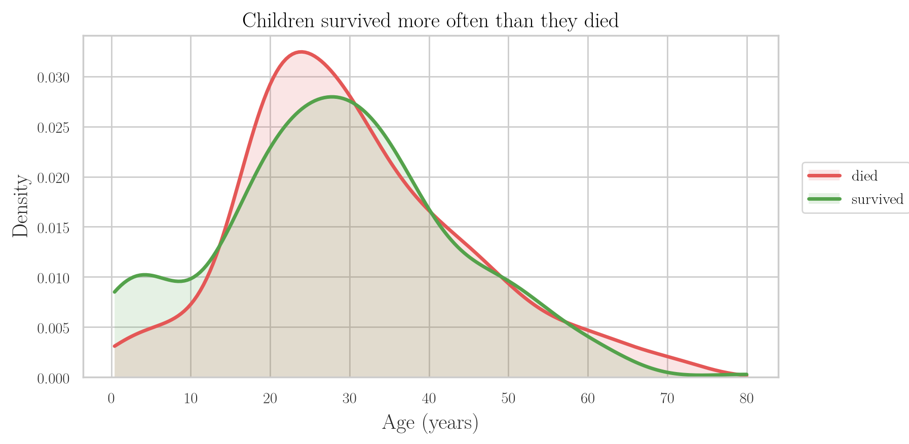

Where one curve lies above the other, that group is more common at those ages:

- **Under about 12:** the green curve is higher. Children were more likely to survive than to die; 61% of passengers under 10 survived. The rule "women and children first" for the lifeboats is the usual explanation (Frey et al. 2011).
- **About 15 to 30:** the red curve is higher. Young adults were more likely to die.
- **Older ages:** the curves cross back and forth, with no clear winner.

Such a pattern is invisible in the raw table of 891 rows. A plot of two columns together brings it out.

> **Python:** One KDE curve per group.
>
> ```python
> import seaborn as sns
>
> sns.kdeplot(data=titanic, x="Age", hue="Survived",
>             common_norm=False)
> ```
>
> `common_norm=False` scales each curve on its own, so both have area 1 and we compare their shapes. The Notebook builds the same curves with `scipy.stats.gaussian_kde` and plots them with Plotly.

> **Extra:** Older code uses `sns.distplot(..., hist=False)`, once per group. `distplot` has been deprecated since seaborn 0.11 (seaborn release notes, v0.11.0); `sns.kdeplot` (curve only) and `sns.histplot` (bars) replace it.

> **Extra:** A KDE curve is built by placing a small bell-shaped bump on every data value and adding the bumps up. Where many values sit close together, the bumps pile up into a peak (Silverman 1986, Ch. 2). The total area under each curve is 1, so a curve shows the share of a group at each age, not the count.

## 7. Heatmap: two categorical columns

> **Key point:** A crosstab counts the rows for every pair of categories; a heatmap colours that table so the largest counts stand out at once.

### 7.1 Crosstab and heatmap

> **Key point:** `pd.crosstab` builds the count table; colour makes it readable at a glance.

With two categorical columns, the first question is how many rows fall into each pair of categories. A **crosstab** (G-511; cross-tabulation) is a table with the categories of one column as rows, those of the other as columns, and a count in every cell.

On the Titanic, a crosstab of class against survival gives:

| Class | Died (0) | Survived (1) |
|---|---|---|
| 1 | 80 | 136 |
| 2 | 97 | 87 |
| 3 | 372 | 119 |

A **heatmap** (G-886) draws such a table as coloured cells: the bigger the number, the darker the cell (Figure 6). With a 3 by 2 table we can still read the numbers; with dozens of rows and columns, colour is the only quick way to spot the large and small cells.

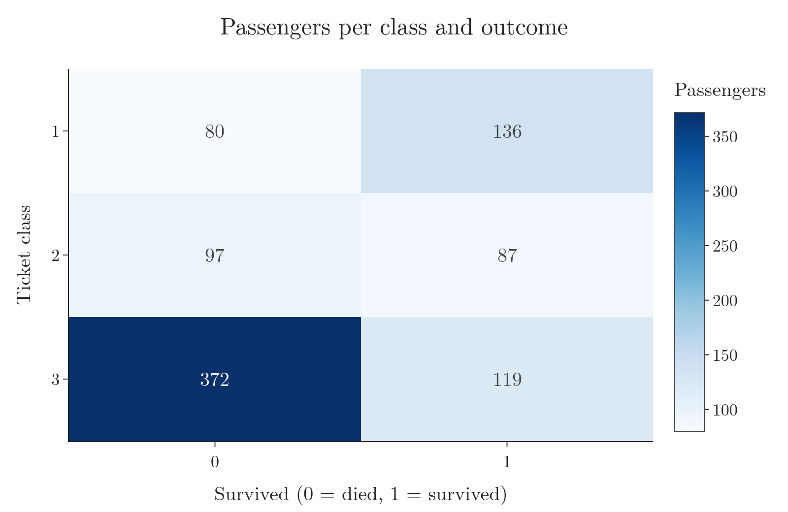

The darkest cell is third class, died: 372 passengers. The next darkest is first class, survived: 136.

> **Python:** Crosstab and heatmap.
>
> ```python
> ct = pd.crosstab(titanic["Pclass"], titanic["Survived"])
> px.imshow(ct, text_auto=True,
>           color_continuous_scale="Blues")
> ```
>
> `text_auto=True` writes the count in each cell. The seaborn version is `sns.heatmap(ct, annot=True)`.

### 7.2 From counts to percentages

> **Key point:** Counts can mislead when groups differ in size; the survival percentage of each group answers the real question.

Counts have a weakness. Third class had the most deaths, but it also carried the most passengers (491, against 216 in first class). To compare classes fairly, we need the share of each class that survived.

`Survived` holds only 0s and 1s, so its mean within a group is the share of 1s. Multiplied by 100, it becomes the survival percentage.

> **Python:** Survival percentage per group.
>
> ```python
> titanic.groupby("Pclass")["Survived"].mean() * 100
> ```
>
> `groupby("Pclass")` splits the rows by class; `["Survived"].mean()` averages the 0/1 column in each group.

Figure 7 shows the result for three columns:

- **Class:** 63% of first-class passengers survived, 47% of second class, and only 24% of third.
- **Sex:** 74% of women survived, but only 19% of men. Women were helped into the lifeboats first (Frey et al. 2011).
- **Port of boarding:** 55% of those who boarded at Cherbourg survived, against 39% at Queenstown and 34% at Southampton.

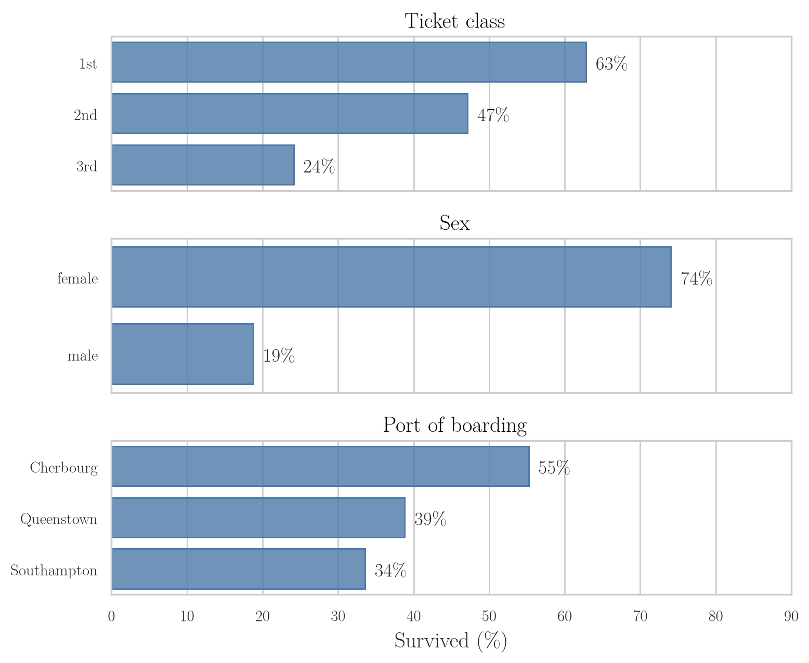

The ports raise a new question: why would the boarding port matter? A plot rarely ends the analysis; each finding suggests the next question to check.

> **Extra:** The next question can be answered with another crosstab. Of the Cherbourg passengers, 51% travelled first class, against 20% at Southampton and 3% at Queenstown; Cherbourg also had a larger share of women (43%, against 32% at Southampton). Class and sex explain most of the port effect. Overall, 55% of Cherbourg passengers survived against 34% from Southampton, but within the same class and sex the gap mostly shrinks: first-class women 98% against 96%, first-class men 40% against 35%. Third-class women are the exception (65% against 38%).

> **Extra:** Older code writes `titanic.groupby("Embarked").mean()["Survived"]`. In pandas 2 and later this raises an error (pandas release notes, 2.0.0), because `mean` cannot average text columns such as `Name`. Selecting the column first, `groupby("Embarked")["Survived"].mean()`, avoids the problem and is faster.

## 8. Clustermap: grouping similar categories

> **Key point:** A clustermap is a heatmap whose rows and columns are reordered so that similar ones sit together, with a tree showing which ones were joined.

A **clustermap** (G-402) starts from the same table as a heatmap. The clustermap then moves the rows so that rows with similar values sit next to each other, and does the same for the columns.

The tree on the side is a **dendrogram** (G-582). The dendrogram joins the most similar rows first, with short branches, and less similar groups later, with longer branches. Rows joined by a short branch behave alike.

Figure 8 applies it to `Parch` (parents or children aboard) against survival. Passengers with 1 or 2 parents or children aboard are joined first: they had similar numbers of deaths and survivals. The rare large families (3 to 6) form another group, and passengers travelling without parents or children (0) stand apart.

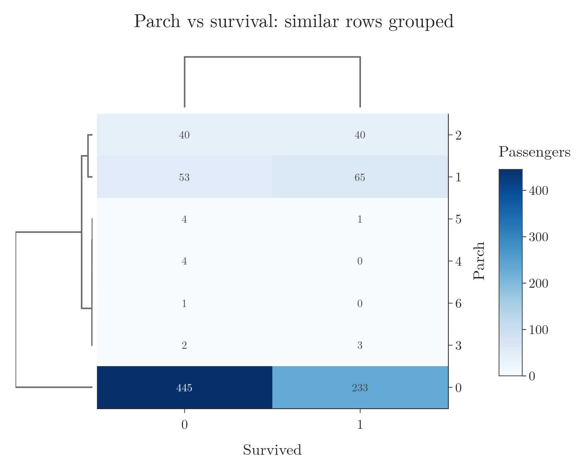{height=45%}

The same works for `SibSp` (siblings or spouses aboard). Those with 1 or 2 siblings or spouses had similar fates: about half survived. Those with 5 or 8 all died.

> **Python:** A clustermap.
>
> ```python
> import seaborn as sns
>
> sns.clustermap(pd.crosstab(titanic["Parch"],
>                            titanic["Survived"]))
> ```
>
> Plotly has no clustermap. The Notebook reorders the rows and columns with `scipy` (the same clustering seaborn uses) and draws the result with `px.imshow`.

> **Extra:** A clustermap groups rows by their raw counts. Rows with many passengers (like `Parch` = 0) differ from all small rows just by size. Dividing each row by its total first (`pd.crosstab(..., normalize="index")`) groups rows by their survival share instead.

## 9. Pair plot: every numerical pair at once

> **Key point:** A pair plot draws a scatter plot for every pair of numerical columns in one grid, and a histogram of each column on the diagonal.

With many numerical columns, drawing a scatter plot for every pair by hand is slow: 4 columns already give 6 pairs. A **pair plot** (G-1437) finds all the numerical columns and draws every pair in one grid.

Figure 9 does this for the four iris measurements. Each cell off the diagonal is a scatter plot of the column above it (x) against the column to its left (y). A column against itself would be a straight line, so the diagonal shows each column's histogram instead.

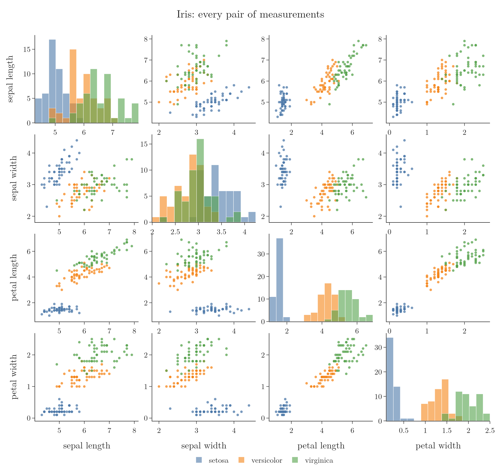{height=70%}

Colouring by species (hue) makes the pair plot multivariate, and shows which measurements separate the species. In the petal length against petal width cell, the three species form three almost separate groups. Petal measurements are therefore the most useful ones for telling the species apart.

> **Python:** A pair plot.
>
> ```python
> sns.pairplot(iris, hue="species")
> ```
>
> In Plotly, `px.scatter_matrix` draws the same grid but leaves out the diagonal histograms:
>
> ```python
> px.scatter_matrix(iris, dimensions=cols, color="species")
> ```
>
> Here `cols` is the list of the four measurement names.

> **Extra:** The grid grows fast: 10 numerical columns give 100 cells. For wide datasets, we pick a few columns first, for example those with the strongest correlation to the target.

## 10. Line plot: a number over time

> **Key point:** A line plot is a scatter plot with the dots joined in order; we use it when the x-axis is time.

A **line plot** (G-1088) joins the dots of a scatter plot from left to right. Joining is only meaningful when the x values have a natural order, such as years, months or dates: the line then shows how the number moves over time. Stock prices and daily case counts are usual examples.

The flights data has one row per month. To plot the passengers of each year, we first add up the 12 months of every year.

> **Python:** Yearly totals and a line plot.
>
> ```python
> yearly = (flights
>           .groupby("year", as_index=False)["passengers"]
>           .sum())
> px.line(yearly, x="year", y="passengers", markers=True)
> ```
>
> `as_index=False` keeps `year` as an ordinary column, so we can pass it as `x`. seaborn: `sns.lineplot(data=yearly, x="year", y="passengers")`.

Figure 10 shows a steady rise: from 1,520 thousand passengers in 1949 to 5,714 thousand in 1960, almost four times as many. The airline grew every single year.

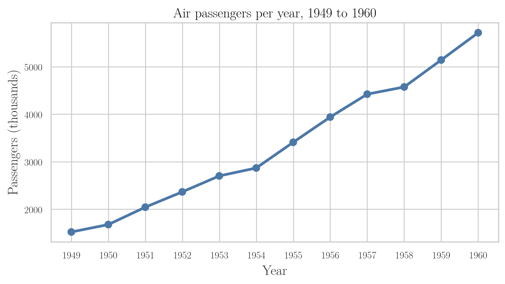

## 11. Pivot table, heatmap and clustermap

> **Key point:** A pivot table lays out a number by two categories (month and year); as a heatmap it shows two patterns at once, and as a clustermap it groups similar months and years.

### 11.1 Pivot table and heatmap

> **Key point:** Colour shows both the yearly growth and the summer peak in one picture.

A **pivot table** (G-1500) reshapes long data into a grid: one column's values become the rows, another's become the columns, and a third fills the cells. For the flights, months become rows, years become columns, and each cell holds that month's passengers.

> **Python:** A pivot table.
>
> ```python
> table = flights.pivot_table(values="passengers",
>                             index="month", columns="year")
> ```
>
> `index` gives the rows and `columns` the columns. If several rows fall into one cell, `pivot_table` averages them; here each cell has exactly one.

> **Extra:** The month names are text, so a CSV file loses their calendar order and the table comes out alphabetical (Apr, Aug, Dec...). `table.reindex(["Jan", "Feb", ..., "Dec"])` puts them back in order. The copy that seaborn downloads keeps the order, because `load_dataset` stores `month` as a category with the months in calendar order (seaborn source, `load_dataset`).

As a heatmap (Figure 11), a 12 by 12 table of numbers becomes easy to read:

- **Left to right:** every row gets darker. Traffic grew year on year.
- **Top to bottom:** in every year, the summer months, July and August, are the darkest. Most people flew in summer.

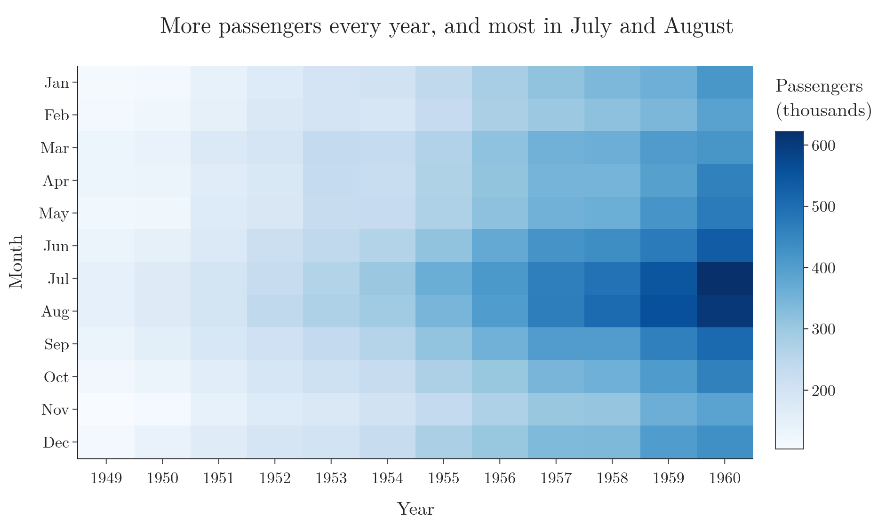

Neither pattern is easy to see in 144 plain numbers.

### 11.2 Clustermap of the flights

> **Key point:** The clustermap groups months with similar traffic (the summer months, the winter months) and years with similar traffic.

Figure 12 is the clustermap of the same table. Its row tree groups the months by traffic:

- **Summer:** July and August are joined, June and September are joined, and the two pairs then form one group.
- **Winter and the rest:** January, February and November form one group; March, April, May, October and December another.

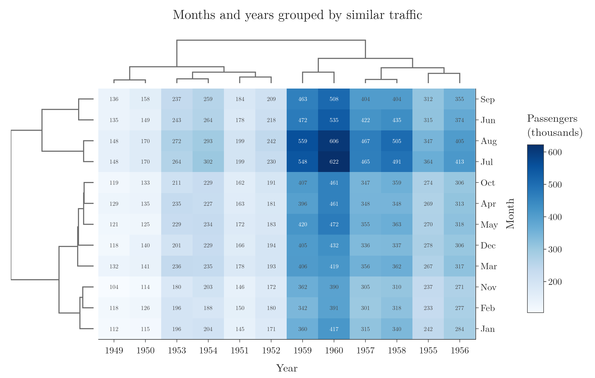{height=50%}

The column tree does the same for the years. Neighbouring years with similar traffic are joined, such as 1949 and 1950, and 1959 and 1960. The busiest years (1955 to 1960) form one large branch and the quieter years (1949 to 1954) another.

## 12. Summary

| Column types | Plot | What it shows | Example |
|---|---|---|---|
| Numerical + numerical | Scatter plot | How two numbers move together | Tip rises with the bill |
| Numerical over time | Line plot | A trend over time | Passengers almost quadruple, 1949 to 1960 |
| Many numerical | Pair plot | Every pair in one grid | Petal sizes separate the iris species |
| Numerical + categorical | Bar plot | The mean per category | 1st class oldest (38 years on average) |
| Numerical + categorical | Box plot | The spread per category | Female survivors older than female victims |
| Numerical + categorical | KDE plot | The distribution per category | Children survived more often than not |
| Categorical + categorical | Heatmap | Counts per pair of categories | 372 third-class passengers died |
| Categorical + categorical | Clustermap | Similar rows and columns grouped | July and August behave alike |

- Bivariate analysis studies two columns together; multivariate analysis adds more with colour (hue), marker (style) and size.
- The types of the two columns decide the plot.
- When groups differ in size, compare percentages, not counts: the mean of a 0/1 column is the share of 1s.
- Each finding raises the next question, such as why Cherbourg passengers survived more often.
- In current pandas and seaborn: pass columns by name (`x=`, `y=`, `hue=`), use `kdeplot` instead of `distplot`, and select the column before `groupby(...).mean()`.

## 13. Sources

**Built from**

- CampusX, "EDA using Bivariate and Multivariate Analysis | Day 21 | 100 Days of Machine Learning", YouTube, https://www.youtube.com/watch?v=6D3VtEfCw7w

**Other references**

- Frey, B., Savage, D. and Torgler, B. (2011). Behavior under Extreme Conditions: The Titanic Disaster. *Journal of Economic Perspectives* 25(1).
- seaborn documentation. `seaborn.barplot`; release notes v0.11.0; source of `seaborn.load_dataset`. seaborn.pydata.org.
- Silverman, B. (1986). *Density Estimation for Statistics and Data Analysis*. Chapman and Hall.
- pandas release notes. What's new in 2.0.0. pandas.pydata.org/docs/whatsnew.

## 14. Key terms

| Term | Meaning |
|---|---|
| Feature | An input variable, one column of the data table |
| Target | The variable we want to predict |
| Observation | One record, one row of the data table |
| Bivariate analysis | Studying two columns together to find how they are related |
| Multivariate analysis | Studying more than two columns together in one view |
| Scatter plot | One dot per row, with one numerical column on each axis |
| Linear relationship | A relationship between two columns that follows a straight line |
| Hue, style, size | Plot settings that show an extra column by colour, marker shape or dot size |
| Bar plot | One bar per category, its height the mean of a numerical column |
| Box plot | A summary of a column's spread by its median, quartiles and outliers |
| KDE plot | A smooth estimate of a column's PDF, built from the data |
| Crosstab | A table counting the rows for every pair of categories of two columns |
| Heatmap | A table drawn as coloured cells, darker for larger values |
| Clustermap | A heatmap with rows and columns reordered so similar ones sit together |
| Dendrogram | A tree showing which rows (or columns) were joined as similar, and in what order |
| Pair plot | A grid of scatter plots of every pair of numerical columns, with histograms on the diagonal |
| Line plot | A scatter plot with the dots joined in order, used when x is time |
| Pivot table | A grid with one column's values as rows, another's as columns, and a third in the cells |
