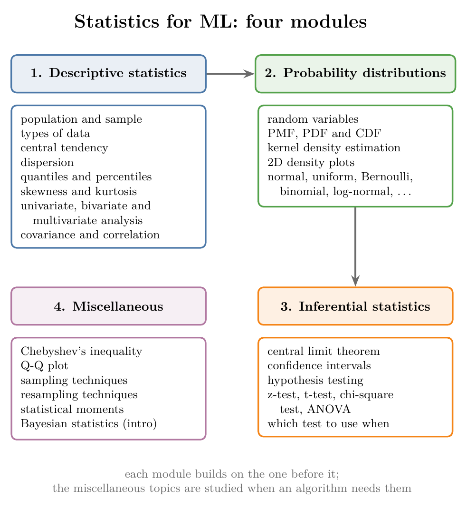

<!-- where-this-fits: generated by course_map/build_map.py; edit concepts.yaml, not this block -->
> **Where this fits:** Pipeline map steps 0 (Foundations), 3 (Understand data). See the [Course map](../01-course-map/note.md).
>
> 
>
> - **Builds on:** Exploratory data analysis ([Note 9](../09-mldlc/note.md)); Population, sample, parameter and statistic ([Note 220](../220-what-is-statistics/note.md)); Frequency tables ([Note 223](../223-frequency-tables-and-graphs/note.md)); Random variables ([Note 240](../240-random-variables-and-distributions/note.md)); Confidence intervals ([Note 280](../280-confidence-intervals-z-procedure/note.md)).
> - **Leads to:** Measures of central tendency ([Note 221](../221-measures-of-central-tendency/note.md)); Variance ([Note 222](../222-measures-of-dispersion/note.md)); Percentiles, quartiles and box plots ([Note 230](../230-percentiles-and-box-plots/note.md)); Correlation ([Note 231](../231-covariance-and-correlation/note.md)); Normal distribution ([Note 240](../240-random-variables-and-distributions/note.md)); Probability mass function (PMF) ([Note 241](../241-pmf-and-discrete-cdf/note.md)).
<!-- /where-this-fits -->

## 1. Overview

> **Key point:** **Statistics** (G-1884) for ML splits into four modules: **descriptive statistics** (G-596), **probability distributions** (G-1571), **inferential statistics** (G-944), and a few miscellaneous tools.

{height=60%}

Figure 1 shows the whole map. Hypothesis testing, in the inferential module, depends on the probability distributions module. This Note says what each module covers, why ML needs it, and where each topic is taught.

## 2. Why ML needs statistics

> **Key point:** Statistics is how we summarise data and draw conclusions from it, and many ML algorithms are built on it.

Statistics turns raw data into summaries and decisions. In data work it shows up in three places (Figure 2):

- **Understanding data:** every exploratory analysis is built from statistical summaries and graphs.
- **Algorithms:** linear regression, logistic regression and Naive Bayes all come out of statistics (ISLR ch. 3, §4.3, §4.4.4).
- **Decisions:** checking whether a new medicine, or a new website design, really works better than the old one needs a statistical test (Bruce et al. 2020, ch. 3).

{width=90%}

## 3. The four modules

> **Key point:** Descriptive statistics summarises the data we have; probability distributions describe the shapes data can take; inferential statistics draws conclusions about data we do not have.

{width=95%}

Figure 3 previews what each module produces: summaries of the data in hand, a smooth shape for a distribution, a statement about a population with its uncertainty, and a diagnostic plot.

### 3.1 Descriptive statistics

> **Key point:** Summarise the data we have, with numbers and graphs.

This module describes data that is already in our hands. Its topics, and where each is taught:

| Topic | Where it is taught |
|---|---|
| Population and sample, types of data | [What is statistics Note](../220-what-is-statistics/note.md) |
| Central tendency (mean, median, mode, ...) | [Measures of central tendency Note](../221-measures-of-central-tendency/note.md) |
| Dispersion (range, variance, standard deviation, ...) | [Measures of dispersion Note](../222-measures-of-dispersion/note.md) |
| Quantiles, percentiles, box plots | [Percentiles and box plots Note](../230-percentiles-and-box-plots/note.md) |
| Skewness | [Univariate analysis Note](../20-univariate-analysis/note.md), [skewness Note](../252-skewness/note.md) |
| Kurtosis | [Kurtosis and Q-Q plots Note](../260-kurtosis-and-qq-plots/note.md) |
| Univariate analysis | [Univariate analysis Note](../20-univariate-analysis/note.md) |
| Bivariate and multivariate analysis | [Bivariate and multivariate analysis Note](../21-bivariate-multivariate-analysis/note.md), [frequency tables and graphs Note](../223-frequency-tables-and-graphs/note.md) |
| Covariance and correlation | [Covariance and correlation Note](../231-covariance-and-correlation/note.md) |

### 3.2 Probability distributions

> **Key point:** A probability distribution describes how likely each value of a feature is; the hypothesis tests of the next module depend on it.

This module studies the shapes data can take. Here a **feature** (G-772) is an input variable, one column of the data table, and an **observation** (G-1374) is one record, one row of that table:

- **Random variables** (G-1620), and the functions that describe them: the PMF (for counts), the PDF (for measurements) and the CDF (for running totals of probability).
- **Kernel density estimation**, the smooth curve over a histogram, met in the density plot of the [univariate analysis Note](../20-univariate-analysis/note.md).
- **2D density plots**, the same idea for two features at once.
- **Named distributions**: normal, uniform, Bernoulli, binomial, log-normal and others. The normal distribution's 68-95-99.7 rule appears in the [z-score outliers Note](../42-outliers-zscore/note.md).

The basic rules of probability are in the [events Note](../330-events-and-types-of-events/note.md) and the [empirical and theoretical probability Note](../331-empirical-and-theoretical-probability/note.md); conditional probability is in the [conditional probability Note](../82-conditional-probability/note.md).

### 3.3 Inferential statistics

> **Key point:** Use a sample to say something about the whole population, and say how sure we are.

This module draws conclusions about a **population** (G-1525) from a **sample** (G-1731):

- **Central limit theorem** (G-364): why averages of samples behave predictably.
- **Confidence intervals:** a range built by a method that captures the true population value in a stated share of repeated samples.
- **Hypothesis testing** (G-913): checking a claim about a population with a sample. The common tests are the z-test, t-test, chi-square test and ANOVA (Bruce et al. 2020, ch. 3), and the module ends with when to use which.

### 3.4 Miscellaneous topics

> **Key point:** A few tools do not fit one module; we study them when an algorithm needs them.

| Topic | Where it is taught |
|---|---|
| Chebyshev's inequality | a later maths Note |
| Q-Q plot | [Function transformer Note](../30-function-transformer/note.md) |
| Sampling techniques | a later maths Note; sampling bias in the [challenges in ML Note](../07-challenges-in-ml/note.md) |
| Resampling (bootstrap) | [Bagging intuition Note](../105-bagging-intuition/note.md) |
| Statistical moments | [Kurtosis and Q-Q plots Note](../260-kurtosis-and-qq-plots/note.md) |
| Bayesian statistics | [Bayes' theorem Note](../85-bayes-theorem/note.md) |

## 4. How to study the roadmap

> **Key point:** About 60 hours, or a month at 2 to 2.5 hours a day; some topics can wait until an algorithm needs them.

The whole roadmap takes roughly 60 hours. At 2 to 2.5 hours a day, that is about one month. Two habits help:

- **Know why each topic matters.** For every topic, note where ML or data analysis uses it.
- **Defer some topics.** A few topics, such as Chebyshev's inequality or Bayesian statistics, can wait until an algorithm needs them. The rest are worth covering now, in the order of the map.

> **Extra:** Good resources for this roadmap:
>
> - **Books:** *An Introduction to Statistical Learning* (James, Witten, Hastie, Tibshirani; statistics through ML), *Practical Statistics for Data Scientists* (Bruce, Bruce, Gedeck; practical, with Python and R), *Think Stats* (Downey; short, Python-based).
> - **Online lessons:** Starmer, J., StatQuest, *Statistics Fundamentals*, statquest.org.
> - **Revision:** a one-page statistics cheat sheet, once the topics are learned.

## 5. Summary

| Module | Question it answers | Main topics |
|---|---|---|
| Descriptive statistics | What does the data we have look like? | central tendency, dispersion, percentiles, graphs, correlation |
| Probability distributions | What shapes can data take? | PMF, PDF, CDF, normal and other distributions |
| Inferential statistics | What can a sample tell us about the population? | central limit theorem, confidence intervals, hypothesis tests |
| Miscellaneous | Extra tools | Q-Q plot, sampling, resampling, moments, Bayes |

- Descriptive statistics comes first; inferential statistics depends on probability distributions.
- About 60 hours covers the whole roadmap.

## 6. Sources

**Built from**

- CampusX, "Statistics Roadmap for Data Science and Data Analysis | Complete Guide | Full Resources | CampusX", YouTube, https://www.youtube.com/watch?v=2GV_ouHBw30

**Other references**

- ISLR: James, G., Witten, D., Hastie, T. and Tibshirani, R. (2021). *An Introduction to Statistical Learning*, 2nd ed. Springer. Chapter 3 (linear regression), sections 4.3 (logistic regression) and 4.4.4 (naive Bayes).
- Bruce, P., Bruce, A. and Gedeck, P. (2020). *Practical Statistics for Data Scientists*, 2nd ed. O'Reilly. Chapter 3, Statistical Experiments and Significance Testing.

## 7. Key terms

This roadmap adds no terms of its own: each term is defined in the Note that teaches it, and listed in the [glossary](../glossary.md).
