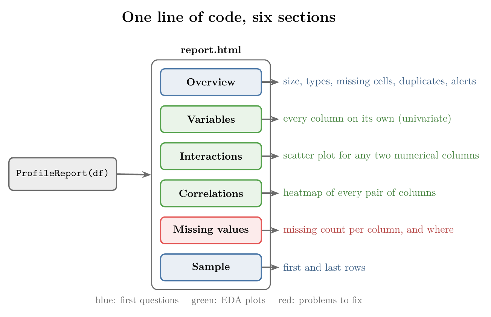
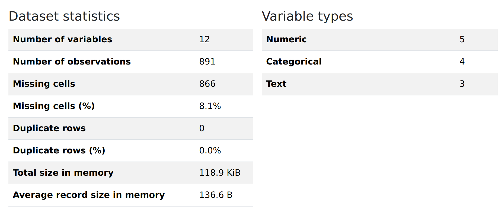
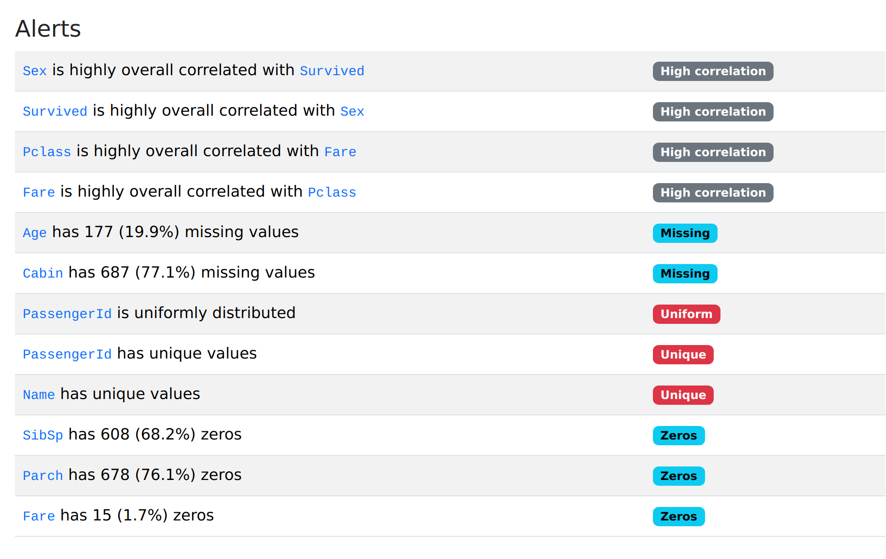
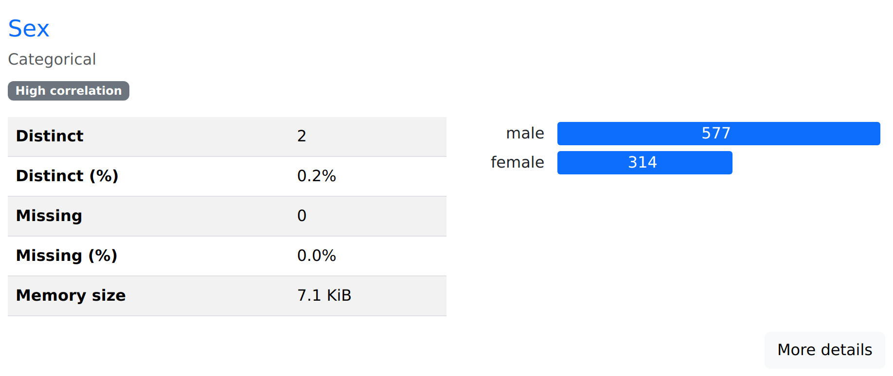
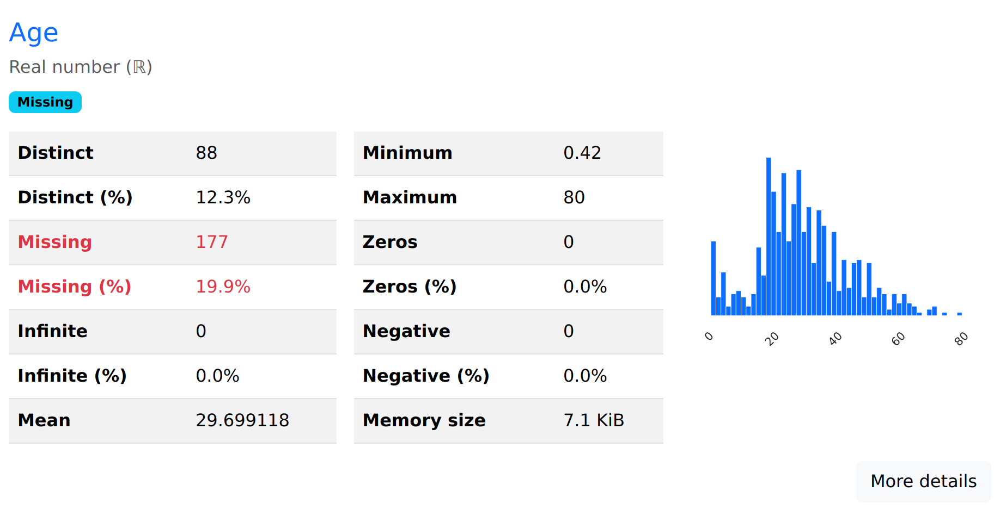
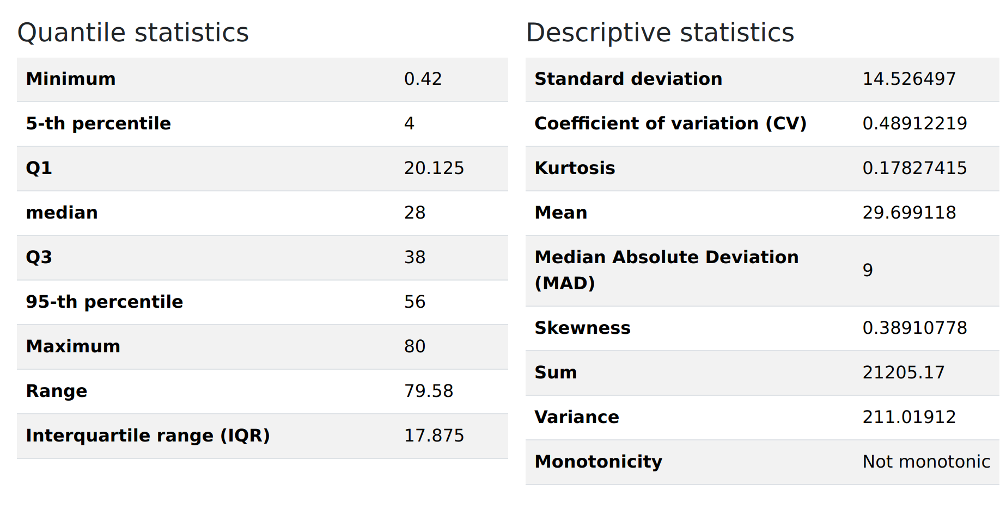
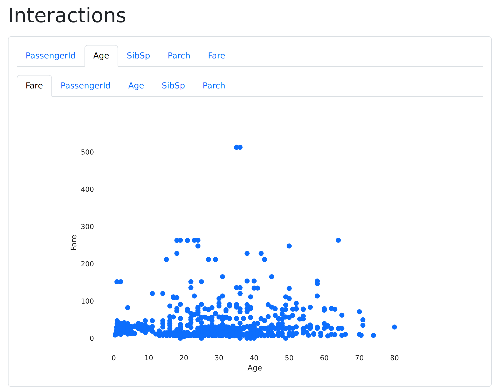
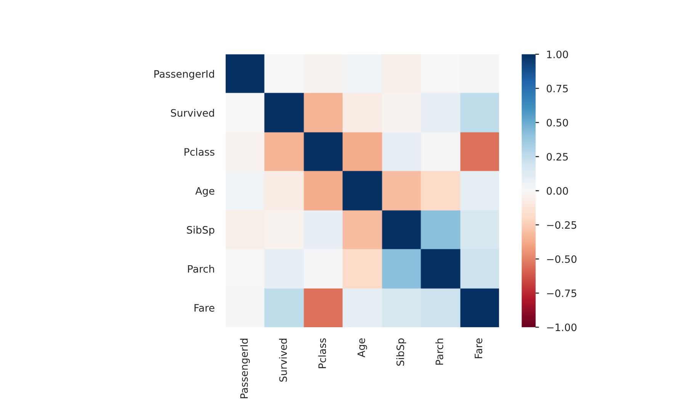
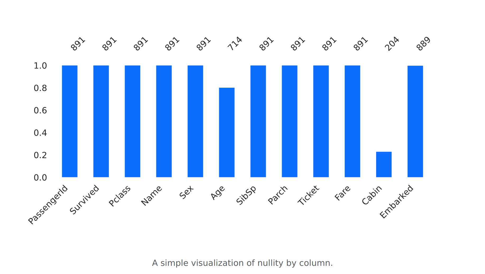
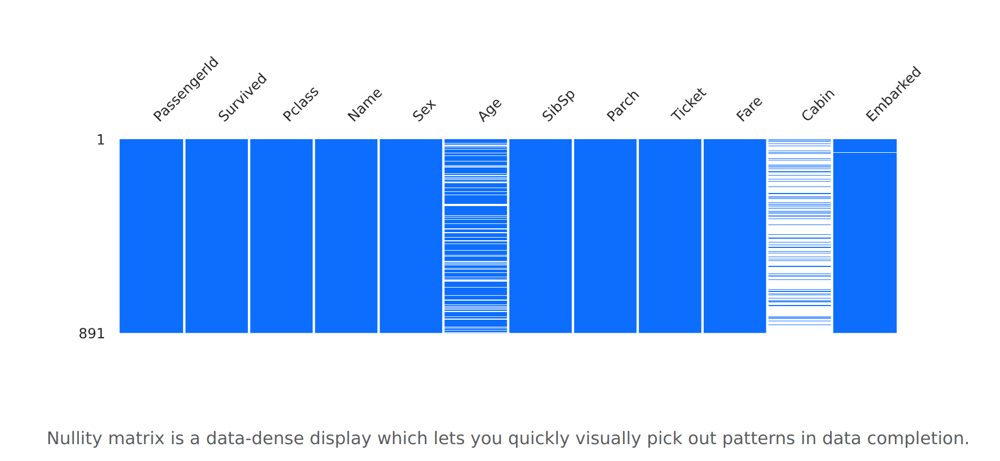

<!-- where-this-fits: generated by course_map/build_map.py; edit concepts.yaml, not this block -->
> **Where this fits:** Pipeline map step 3 (Understand data). See the [Course map](../01-course-map/note.md).
>
> 
>
> - **Builds on:** Setup: conda, Jupyter and Colab ([Note 12](../12-setup-anaconda-jupyter-colab/note.md)).
> - **Leads to:** Q-Q plot ([Note 30](../30-function-transformer/note.md)).
> - **Compare with:** Univariate analysis ([Note 20](../20-univariate-analysis/note.md)); Skewness ([Note 20](../20-univariate-analysis/note.md)); Bivariate and multivariate analysis ([Note 21](../21-bivariate-multivariate-analysis/note.md)).
<!-- /where-this-fits -->

## 1. Overview

> **Key point:** A profiling library runs most of the EDA from the last three Notes by itself and writes the results into one web page.

The last three Notes built EDA by hand: the first questions for a new dataset, univariate analysis, and bivariate and multivariate analysis. Each step took a few lines of pandas or one plot at a time. A **profiling report** does most of this work in one go: we hand it a DataFrame, and it returns a web page that describes every column and every pair of columns.

The library that builds it is known as **Pandas Profiling**. Figure 1 shows what one line of code produces: a report with six sections, each answering questions from the earlier Notes.



We use the same Titanic data as before, 891 passengers. The Notebook (`notebook.ipynb`) builds the report and saves it as `titanic_report.html`; every figure from Figure 2 onwards is a screenshot of that page.

## 2. Building the report

> **Key point:** Install the library once; then three lines build the report and save it as an HTML file.

### 2.1 Installing the library

> **Key point:** One `pip install` command adds the library to our Python setup.

Pandas Profiling is not part of pandas; it is a separate library. We install it once, from a terminal or from a notebook cell. The command downloads the library from PyPI, the public store of Python libraries, and installs it on our machine.

> **Python:** Installing the library.
>
> ```
> pip install fg-data-profiling
> ```
>
> In a Jupyter cell, put `!` in front: `!pip install fg-data-profiling`. The `!` sends the line to the terminal instead of to Python.

> **Extra:** Version clash (October 2026). The library still requires pandas older than 3.0. In a setup that already has pandas 3, a plain `pip install fg-data-profiling` quietly downgrades pandas (and NumPy, SciPy) to older versions. To keep pandas 3, install it with `pip install --no-deps fg-data-profiling` and then install the few small helper libraries it asks for when imported. The report then works with the one-line fix in Section 2.2. In a fresh setup made just for profiling, the plain command is fine.

> **Extra:** The library has changed its name twice. It began as `pandas-profiling` (import `pandas_profiling`). In 2023 it became `ydata-profiling` (import `ydata_profiling`), and in 2026 `fg-data-profiling` (import `data_profiling`). The old names still appear in many tutorials; `pip install pandas-profiling` now installs only an empty package that says to use the new name, and `import ydata_profiling` warns that it gets no more updates. The report itself and the `ProfileReport` call are the same under all three names.

### 2.2 Three lines of code

> **Key point:** `ProfileReport(df)` builds the report; `to_file` saves it as a web page we open in any browser.

Once installed, building a report takes three steps:

1. Import `ProfileReport` from the library.
2. Call `ProfileReport` on our DataFrame. This creates a report object.
3. Save the object as an HTML file with `to_file`.

> **Python:** Building and saving the report.
>
> ```python
> import pandas as pd
> from data_profiling import ProfileReport
>
> df = pd.read_csv("data/titanic_train.csv")
> profile = ProfileReport(df, title="Titanic passengers")
> profile.to_file("titanic_report.html")
> ```
>
> `title` is optional; it becomes the heading of the page. Double-clicking the HTML file opens the report in a browser.

The report takes a few seconds to build. The time grows with the size of the data: behind the scenes, the library computes statistics and draws charts for every column and every pair of columns. For the 891 Titanic rows it takes about ten to fifteen seconds.

> **Extra:** Two more options are useful:
>
> - `ProfileReport(df, minimal=True)` skips the slow parts (correlations, interactions, missing-value charts). On data with many thousands of rows or many columns, the full report can take minutes; the minimal one stays fast.
> - `profile.to_notebook_iframe()` shows the report inside Jupyter instead of saving a file. It stores the whole page in the notebook, which makes the notebook file several megabytes big.

> **Extra:** The library officially supports pandas versions below 3. With pandas 3, building the report fails with the error `'ArrowExtensionArray' object has no attribute 'sum'`. pandas 3 stores text columns in a new format (Arrow arrays) that the library cannot add up. One line before building the report switches text back to plain Python strings:
>
> ```python
> pd.set_option("mode.string_storage", "python")
> ```

The page has six sections, listed in Figure 1. A menu at the top jumps to each one. The sections follow the order of our EDA Notes: first the basic questions, then one column at a time, then pairs of columns.

## 3. Overview: the first questions, answered

> **Key point:** The Overview section answers the first questions about a new dataset (size, types, missing values, duplicates) in one table.

### 3.1 Dataset statistics

> **Key point:** Rows, columns, missing cells, duplicate rows and memory use, all in one table.

The Overview section opens with the dataset as a whole. Figure 2 shows it for the Titanic data. These are the same first questions we asked with `df.shape`, `df.info()`, `df.isnull().sum()` and `df.duplicated().sum()` in the Note on understanding data.



Reading the left table from the top:

- **Number of variables:** 12. The report calls columns **variables**.
- **Number of observations:** 891. The report calls rows **observations**.
- **Missing cells:** 866, which is 8.1% of all cells.
- **Duplicate rows:** 0, so no passenger appears twice.
- **Total size in memory:** 118.9 KiB for the whole table; the **average record size** is 136.6 bytes, the memory one row takes.

The missing-cells percentage is worked out from the whole grid of cells.

> **Extra:** The share of missing cells, step by step.
>
> 1. **In words:** count all cells (rows times columns), then divide the missing cells by that total.
> 2. **Formula:**
>    $$\text{missing cells (\%)} = \frac{\text{missing cells}}{\text{rows} \times \text{columns}} \times 100$$
> 3. **With the Titanic numbers:** the grid has $891 \times 12 = 10{,}692$ cells, so
>    $$\frac{866}{10{,}692} \times 100 = 8.1\%$$
>
> The 866 missing cells come from three columns: 177 in `Age`, 687 in `Cabin` and 2 in `Embarked`.

The right table counts the column types. The report sorts the 12 columns into three kinds:

| Type | Count | Columns |
|---|---|---|
| Numeric | 5 | `PassengerId`, `Age`, `SibSp`, `Parch`, `Fare` |
| Categorical | 4 | `Survived`, `Pclass`, `Sex`, `Embarked` |
| Text | 3 | `Name`, `Ticket`, `Cabin` |

The report decides the type itself, from the values. `Survived` and `Pclass` hold numbers, but only two or three different ones, so the report treats them as categories. This matches the split into numerical and categorical columns from the Note on univariate analysis.

> **Extra:** "Text" is the report's name for a column of free text, where nearly every value is different (every passenger has their own name and ticket number). Older versions of the library put such columns under "Categorical" and flagged them with a **high cardinality** warning: a categorical column with very many different categories.

### 3.2 Alerts

> **Key point:** Alerts are a ready-made list of possible problems, one line per column; each one is a question to check, not a verdict.

The second tab of the Overview section lists **alerts**: warnings about columns that may need attention. Figure 3 shows the ten alerts for the Titanic data.



The alerts fall into five kinds:

- **High correlation:** `Sex` is strongly linked to `Survived`, and `Pclass` to `Fare`. These are the strongest relationships in the data, worth studying first.
- **Missing:** `Age` is missing for 177 passengers (19.9%) and `Cabin` for 687 (77.1%). Nearly a fifth of the ages must be dealt with before training a model. With more than three quarters missing, `Cabin` may be unusable.
- **Uniform:** every value of `PassengerId` occurs equally often (once each). A running number like this carries no information about the passenger.
- **Unique:** every value of `PassengerId` and of `Name` is different. A column that is different for every row cannot reveal a pattern shared by several rows.
- **Zeros:** most passengers have 0 in `SibSp` (68.2%) and `Parch` (76.1%): they travelled without siblings, spouses, parents or children. 15 fares (1.7%) are 0, which is odd for a paid ticket.

In seconds, the alerts point to the columns that need cleaning and the columns that look useless. Each alert still needs a judgement: many zeros in `SibSp` is simply a fact about the passengers, while 15 free tickets deserve a closer look.

> **Extra:** The third tab, Reproduction, records when the report was made, how long it took, and the library version and settings. It lets someone else rebuild exactly the same report later.

## 4. Variables: univariate analysis of every column

> **Key point:** The Variables section gives each column its own block of statistics and a chart, chosen by the column's type.

The second section is the univariate analysis of the earlier Note, done for every column at once. A drop-down menu picks one column, or shows all of them one below the other. What each block contains depends on the column's type.

Some columns are not worth studying. `PassengerId` is just a running number, as its alerts already said, so we skip it.

### 4.1 A categorical column: Sex

> **Key point:** For a categorical column, the report counts each category and draws the counts as bars, like a count plot.

Figure 4 shows the block for `Sex`. On the left, a table gives the basic facts; on the right, a bar for each category with its count.



- **Distinct:** 2 different values, male and female. As a share of the 891 rows, that is 0.2%.
- **Missing:** 0, so every passenger has a recorded sex.
- **The bars:** 577 male and 314 female passengers. This is the count plot from the Note on univariate analysis, drawn sideways.

The "More details" button opens four further tabs:

- **Overview:** the length of the values in characters (here 4 for "male", 6 for "female") and the first five values as a sample.
- **Categories:** every category with its count and percentage (64.8% male, 35.2% female).
- **Words** and **Characters:** the words and characters that make up the values, which matter more for text columns.

### 4.2 A numerical column: Age

> **Key point:** For a numerical column, the report gives the main summary numbers and a histogram; "More details" adds percentiles, spread and the extreme values.

Figure 5 shows the block for `Age`. The missing values are printed in red, because they triggered an alert.



The two tables give, among others:

- **Distinct:** 88 different ages.
- **Missing:** 177 (19.9%).
- **Infinite:** 0. An infinite value can appear after a division by zero, and would break most calculations.
- **Mean:** 29.70 years. **Minimum:** 0.42 (a baby of five months). **Maximum:** 80.
- **Zeros** and **Negative:** 0 each. A negative age would be an error in the data.

On the right is the histogram of `Age`, the same shape as in the Note on univariate analysis.

"More details" opens four tabs: Statistics, Histogram, Common values and Extreme values. The Statistics tab (Figure 6) has two tables.



**Quantile statistics** describe positions in the sorted data:

- **5th and 95th percentile:** 4 and 56. Only 5% of the passengers were younger than 4, and only 5% older than 56.
- **Q1, median, Q3:** 20.125, 28 and 38. Together with the minimum and maximum, these give the five-number summary behind a box plot.
- **Range:** maximum minus minimum, $80 - 0.42 = 79.58$.
- **Interquartile range (IQR):** $38 - 20.125 = 17.875$, the width of the middle half of the ages.

**Descriptive statistics** describe the centre and the spread:

- **Standard deviation:** 14.53, and **variance:** 211.02, its square.
- **Skewness:** 0.39, slightly skewed to the right (from the Note on univariate analysis).
- **Sum:** 21,205.17, all known ages added up.
- **Coefficient of variation**, **kurtosis**, **median absolute deviation** and **monotonicity** are new; the Extra boxes below explain them.

> **Extra:** The **coefficient of variation (CV)** compares the spread with the average.
>
> 1. **In words:** divide the standard deviation by the mean. The result has no units, so it can compare the spread of columns measured in different units (years, rupees).
> 2. **Formula:**
>    $$\text{CV} = \frac{\text{standard deviation}}{\text{mean}}$$
> 3. **With the Age numbers:**
>    $$\text{CV} = \frac{14.53}{29.70} = 0.49$$
>
> So ages typically lie about half the mean (around 15 years) away from the mean.

> **Extra:** The **median absolute deviation (MAD)** is a measure of spread built from medians instead of means.
>
> 1. **In words:** find the median; measure how far each value is from it; the MAD is the median of those distances.
> 2. **Formula:**
>    $$\text{MAD} = \text{median}\big(\,|x_i - \text{median}(x)|\,\big)$$
> 3. **With five values** 1, 2, 3, 4, 10: the median is 3, the distances are 2, 1, 0, 1, 7, and their median is $\text{MAD} = 1$.
>
> The far value 10 hardly changes the MAD, while it would raise the standard deviation a lot. For `Age`, the MAD is 9 years.

> **Extra:** Two more entries in Figure 6:
>
> - **Kurtosis** measures how heavy the tails of a distribution are compared with a normal (bell-shaped) curve. The report gives 0 for a normal curve and a positive value when extreme values are more common than in one. `Age` has 0.18, close to normal.
> - **Monotonicity** says whether the values only ever go up (or only down) from one row to the next. Ages in a passenger list are "not monotonic"; a running number like `PassengerId` is increasing.

The last two tabs deal with single values:

- **Common values:** the ages that occur most often. The top three are 24 (30 passengers), 22 (27) and 18 (26).
- **Extreme values:** the five smallest and five largest values. The smallest ages are 0.42, 0.67, 0.75, 0.75 and 0.83, all babies under a year; the largest are 80, 74, 71, 71 and 70.5.

The extreme values are where outliers show up first. Here they look genuine: babies and elderly passengers really were on board.

## 5. Interactions: a scatter plot for any pair

> **Key point:** The Interactions section draws a scatter plot for any two numerical columns we pick, which is bivariate analysis on demand.

The Interactions section holds a scatter plot for every pair of numerical columns. Two rows of tabs pick the pair: the top row sets the x-axis column, the second row the y-axis column. Figure 7 shows `Age` on the x-axis against `Fare` on the y-axis.

{height=55%}

Most fares are below 100, at every age; the dots do not rise or fall with age, so the two columns are hardly related. A few fares stand far above the rest, the highest at 512. These are the extreme fares that the box plot of `Fare` flagged as outliers in the Note on univariate analysis.

Picking the same column for both axes gives no useful plot: every dot would lie on one diagonal line. Only numerical columns appear here; categorical pairs are covered by the Correlations section.

## 6. Correlations: every pair in one heatmap

> **Key point:** The Correlations section shows the correlation of every pair of columns as a heatmap; dark blue is a strong positive link, dark red a strong negative one.

**Correlation** measures how strongly two columns move together, from $-1$ to $+1$, as defined in the Note on understanding data. The Correlations section computes it for every pair and draws the results as a heatmap. Figure 8 shows **Pearson's r**, the coefficient for straight-line relationships between numbers.

{height=50%}

Each cell is the correlation of its row and its column. The colour bar on the right reads the colours: dark blue near $+1$, white near 0, dark red near $-1$. The diagonal is always dark blue, since each column matches itself perfectly.

Away from the diagonal, a few cells stand out:

- **`Pclass` and `Fare`: $-0.55$.** The strongest link. A higher class number (cheaper class) goes with a lower fare.
- **`SibSp` and `Parch`: $+0.41$.** Passengers with siblings or a spouse aboard often had parents or children aboard too: they travelled as families.
- **`Survived` and `Pclass`: $-0.34$**, and **`Survived` and `Fare`: $+0.26$.** Passengers in better classes, who paid more, survived more often.

So at a glance we learn which inputs relate to the output (`Survived`), and which inputs relate to each other. Both matter later: inputs linked to the output are useful, and inputs strongly linked to each other repeat the same information.

> **Python:** Choosing the coefficients.
>
> ```python
> profile = ProfileReport(df, correlations={
>     "auto": {"calculate": True},
>     "pearson": {"calculate": True},
> })
> ```
>
> By default only the "Auto" tab is computed. The Notebook switches on Pearson's r as well, as above. The same way, `"spearman"`, `"kendall"`, `"phi_k"` and `"cramers"` add more tabs.

> **Extra:** Pearson's r only works for two numerical columns, and only sees straight-line links. Other coefficients cover the other cases:
>
> - **Spearman's** and **Kendall's** coefficients measure whether two columns rise together at all, even along a curve, by comparing the ranks of the values instead of the values.
> - **Cramér's V** measures the link between two categorical columns, from 0 (none) to 1 (complete).
> - **Phik** ($\phi_k$) works for any mix of numerical and categorical columns.
>
> The default "Auto" heatmap picks a suitable coefficient for each pair: Spearman's for two numerical columns, and Cramér's V when a categorical column is involved. That is how it found the strong link between `Sex` and `Survived` in the alerts: `Sex` is text, so Pearson's r cannot include it at all. Every pair above 0.5 on the Auto heatmap gets a "High correlation" alert.

> **Extra:** Next to each Heatmap tab is a Table tab with the exact numbers behind the colours. Older versions of the library also had a button that showed a short explanation of each coefficient.

## 7. Missing values: how many, and where

> **Key point:** The Missing values section shows, per column, how many values are present (Count) and in which rows the gaps are (Matrix).

The fifth section is all about missing values. Its first tab, Count (Figure 9), draws one bar per column; the bar's height is the share of rows that have a value.

{height=40%}

The numbers above the bars are the counts of present values. Most columns are complete, with all 891. Three are not:

- **`Age`:** 714 present, so 177 missing.
- **`Cabin`:** only 204 present, so 687 missing.
- **`Embarked`:** 889 present, so 2 missing.

The second tab, Matrix (Figure 10), draws the whole table as a picture. Each column of the data is a vertical strip, and each row of the data a thin horizontal line through all strips, from row 1 at the top to row 891 at the bottom. A filled line means the value is there; a white line means it is missing.

{height=40%}

The more white, the more missing values. `Cabin` is mostly white, `Age` has white lines scattered all the way down, and `Embarked` has just two. The matrix also shows whether gaps in different columns fall in the same rows; here they do not line up in any clear pattern.

> **Extra:** The third tab, Heatmap, shows whether the gaps in one column tend to occur together with gaps in another. Missing values and how to handle them get their own Notes later (from Note 35 on).

## 8. Sample: a look at the rows

> **Key point:** The Sample section shows the first and last rows of the data, like `df.head()` and `df.tail()`.

The last section shows real rows, in two tabs: First rows and Last rows. They give a feel for what the values look like, as `df.head()` did in the Note on understanding data. The last rows also show whether the end of the file differs from the start, for example a total row or a different format.

## 9. Using the report

> **Key point:** We run a profiling report first on every new dataset, read it section by section, and write down what we notice.

The report covers in seconds what took three Notes by hand. It does not replace understanding: it lists facts, and we decide what they mean. A good way to use it:

1. Build the report as soon as we get a new dataset.
2. Read it in order: Overview and Alerts, then each variable, then Interactions, Correlations and Missing values.
3. Write down every observation, for example "`Cabin` is 77% missing" or "`Pclass` and `Fare` are strongly linked".
4. Turn the observations into tasks: columns to drop, missing values to fill, outliers to check.

Reading reports becomes faster with practice. Running the library on three or four different datasets, and writing down observations each time, builds the habit of knowing where to look.

> **Extra:** The report knows nothing about the meaning of the data. It cannot tell that `Survived` is the output we want to predict, that a 0 fare might be a crew member or a free ticket, or that `PassengerId` is a label rather than a measurement. Those judgements still come from us, and from the hand-made EDA of the earlier Notes when a question needs a closer look.

## 10. Summary

| Section | What it shows | Hand-made equivalent | Titanic example |
|---|---|---|---|
| Overview | Size, types, missing cells, duplicates, memory | `shape`, `info`, `isnull`, `duplicated` | 12 columns, 891 rows, 8.1% missing |
| Alerts (in Overview) | Possible problems, one per line | Reading every column ourselves | `Cabin` 77.1% missing |
| Variables | Each column: statistics and a chart | Univariate analysis | Age: mean 29.70, IQR 17.875 |
| Interactions | Scatter plot of any two numerical columns | Scatter plots | A few fares above 500 |
| Correlations | Correlation of every pair, as a heatmap | `df.corr()` and a heatmap | `Pclass` and `Fare`: $-0.55$ |
| Missing values | Present values per column, and where the gaps are | `isnull().sum()` | `Age` 714, `Cabin` 204 of 891 |
| Sample | First and last rows | `head`, `tail` | |

- `ProfileReport(df).to_file("report.html")` builds a full EDA report as one web page.
- The library has had three names: `pandas-profiling`, `ydata-profiling`, and now `fg-data-profiling` (import `data_profiling`).
- Alerts point to columns to check: high correlation, missing, unique, uniform, zeros.
- "Auto" correlations cover categorical columns too; Pearson's r only covers numbers.
- `minimal=True` keeps the report fast on big data.
- The report lists facts; we still read it, write down observations and decide what to do.

## 11. Key terms

| Term | Meaning |
|---|---|
| Profiling report | An automatic EDA report describing every column and pair of columns of a dataset |
| Pandas Profiling | The library that builds a profiling report from a DataFrame, now named `fg-data-profiling` |
| Variable | The report's word for a column |
| Observation | The report's word for a row |
| Average record size | The memory one row takes, on average |
| Alert | A warning in the report about a column that may need attention |
| High cardinality | A categorical column with very many different categories |
| Coefficient of variation (CV) | Standard deviation divided by mean: spread relative to the average |
| Median absolute deviation (MAD) | The median distance of the values from their median |
| Kurtosis | How heavy the tails of a distribution are compared with a normal curve |
| Monotonicity | Whether a column's values only go up, or only go down, from row to row |
| Pearson's r | The correlation coefficient for straight-line relationships between two numerical columns |
| Cramér's V | A measure of the link between two categorical columns, from 0 to 1 |
| Nullity matrix | A picture of the whole table with missing values drawn as white lines |
