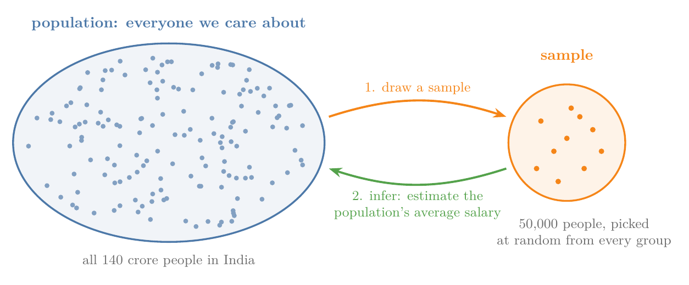
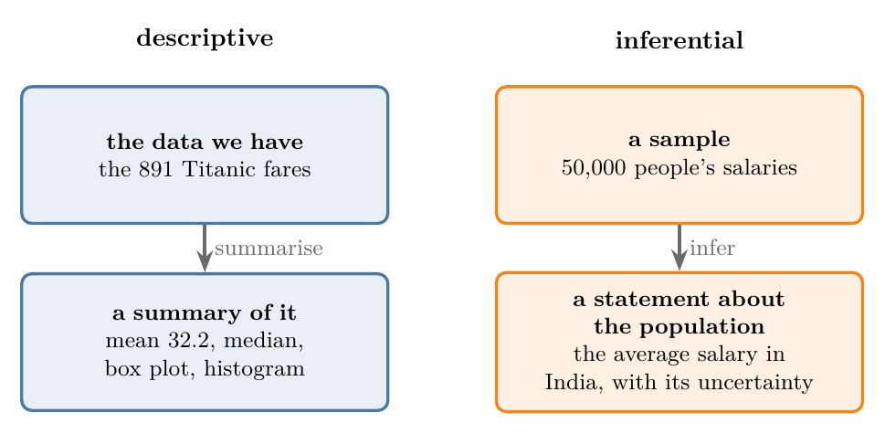
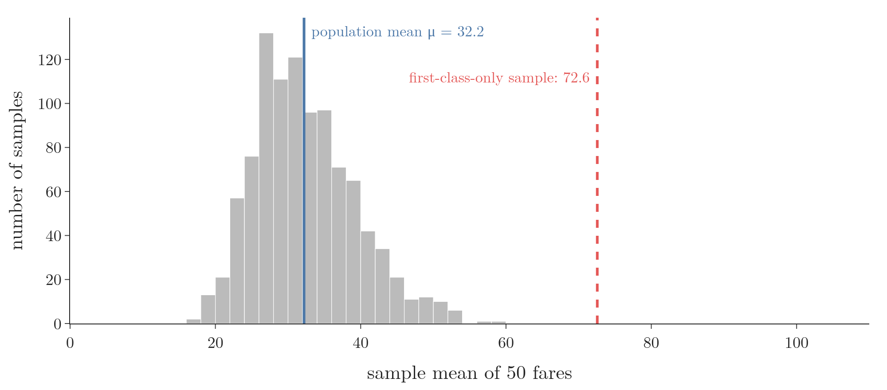
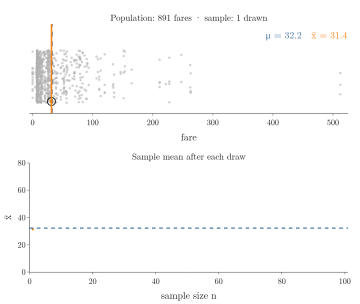
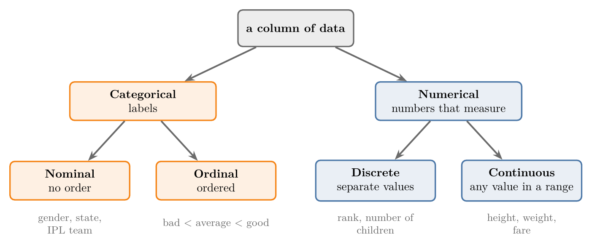

<!-- where-this-fits: generated by course_map/build_map.py; edit concepts.yaml, not this block -->
> **Where this fits:** Pipeline map steps 0 (Foundations), 3 (Understand data). See the [Course map](../01-course-map/note.md).
>
> 
>
> - **Builds on:** Sampling noise and bias ([Note 7](../07-challenges-in-ml/note.md)).
> - **Leads to:** Bessel's correction ([Note 222](../222-measures-of-dispersion/note.md)); Random variables ([Note 240](../240-random-variables-and-distributions/note.md)); Density estimation ([Note 243](../243-density-estimation-kde/note.md)); Sampling distribution and standard error ([Note 271](../271-sampling-distribution-and-clt/note.md)); Hypothesis testing: null and alternative ([Note 290](../290-null-and-alternative-hypotheses/note.md)).
> - **Compare with:** Descriptive statistics ([Note 210](../210-statistics-roadmap/note.md)).
<!-- /where-this-fits -->

## 1. Overview

> **Key point:** Statistics summarises the data we have (descriptive) and uses a sample to draw conclusions about a whole population (inferential); the type of each feature decides which tools we can use.

Figure 1 shows the central idea of statistics: we rarely see the whole group we care about, so we study a part of it and reason back to the whole. This Note defines statistics and its two branches, explains population and sample, and sorts data into four types.

## 2. What statistics is

> **Key point:** Statistics is the branch of mathematics for collecting, organising, summarising and drawing conclusions from data.

**Statistics** (G-1884) is the branch of mathematics that deals with collecting, analysing, interpreting and presenting data. Statistics gives us tools to make sense of large amounts of data, to draw conclusions and to make decisions based on data.

Few branches of mathematics are applied as widely. Some examples:

- **Business and finance:** companies study customer data to find buying patterns, then set prices, plan stock and forecast demand.
- **Medicine:** a new medicine goes through clinical trials, and a statistical test decides whether it works better than the old one.
- **Government and politics:** surveys and opinion polls estimate what a whole country thinks from a few thousand answers.
- **Environmental science:** climate research uses past data to predict future change.
- **Machine learning:** linear regression, logistic regression and Naive Bayes all grow out of statistics.

## 3. Descriptive and inferential statistics

> **Key point:** Descriptive statistics describes the data in hand; inferential statistics predicts things about a larger group from it.

Statistics has two branches (Figure 2):

- **Descriptive statistics** (G-596; see the [understanding your data Note](../19-understanding-your-data/note.md)) summarises and describes the data we already have, without drawing conclusions beyond it. The mean, median, standard deviation, five-number summary and every graph of our data belong here. Descriptive statistics studies the past: what the data says.
- **Inferential statistics** (G-944) uses the data we have to make predictions, or **inferences** (G-943), about a larger group we cannot fully observe.

{width=85%}

Every exploratory data analysis so far, such as the summaries in the [understanding your data Note](../19-understanding-your-data/note.md), was descriptive statistics. Inferential statistics needs one more idea first: population and sample.

## 4. Population and sample

> **Key point:** The population is every individual we want to study; a sample is the part of it we actually measure.

Suppose the government asks us for the average salary in India. India has about 140 crore people. To get the exact answer, we would have to ask every person their salary, add them up and divide by 140 crore. Asking 140 crore people is impossible in practice.

So we pick, say, 50,000 people from different states, regions, genders and age groups. We ask them, compute their average salary, and use it to **infer** the average salary of the whole country (Figure 1).

- The **population** (G-1525) is the entire group of individuals or objects we are interested in studying: here, every person in India.
- A **sample** (G-1731) is a subset of the population, the part we actually measure: here, the 50,000 people.

Inferential statistics is exactly this step: from a sample, say something about the population. Two more examples:

| Population | Sample |
|---|---|
| Every Indian cricket fan who watches a match | The fans watching in the stadium |
| Every student of a college: on campus, online, distance and past students | The students who attend lectures in person |

### 4.1 What makes a good sample

> **Key point:** A sample must be large enough, random and representative, or its conclusions will be wrong.

A badly made sample gives wrong conclusions about the population, however carefully we analyse it. A good sample is:

- **Large enough:** a tiny sample makes the result depend on luck. Such luck-driven error is the **sampling noise** (G-1737) of the [challenges in ML Note](../07-challenges-in-ml/note.md).
- **Random:** every member of the population has a fair chance of being picked. If our salary survey somehow favours rich people, its average is too high. Such a lopsided sample has **sampling bias** (G-1734), from the same Note. Figure 3 shows the effect on the Titanic fares.
- **Representative:** every kind of member is present. For India's average salary we need people from every state, men and women, every age group, business owners and employees.

{width=90%}

Different ways of building samples are called **sampling techniques** (G-1738); a later maths Note covers them.

### 4.2 Parameters and statistics

> **Key point:** A number that describes the population is a parameter (Greek letters); the same number computed from a sample is a statistic (Latin letters).

A number computed from the whole population, such as India's true average salary, is a **parameter** (G-2276). The same number computed from a sample is a **statistic** (G-1880), and we use it as an estimate of the parameter.

The two are generally different. There is no guarantee that the average salary of 50,000 people equals the national average: it can be close, but it can also be very different.

Figure 4 shows this with a population we can see in full: the 891 fares of the Titanic passengers, whose mean is the parameter $\mu = 32.2$. We draw one random sample, one passenger at a time. Watch the orange sample mean $\bar{x}$: after 3 passengers it is 67.0, after 10 it is 65.0, and even after 100 it is 36.4, near $\mu$ but not equal to it.

{height=55%}

Three things follow from Figure 4:

- **A new sample gives a new estimate.** The grey histogram of Figure 3 collects the means of 1,000 different random samples of 50 fares. The means spread out around $\mu$ instead of landing on one value. None of them is wrong; each is one estimate of the same parameter.
- **More data gives a better estimate.** With 3 passengers one expensive ticket drags $\bar{x}$ to 67.0; by 100 passengers the same ticket is outvoted and $\bar{x}$ is 36.4. How far to trust an estimate is exactly what the tools of section 5 measure.
- **A sample is the training data of ML.** In machine learning the rows we train on are the sample, and the population is everything the model will meet later. A model, like $\bar{x}$, is an estimate made from a sample and judged on the population.

So we always keep track of which one we have, and write them differently:

| Quantity | Population (parameter) | Sample (statistic) |
|---|---|---|
| Number of items | $N$ | $n$ |
| Mean | $\mu$ ("mu") | $\bar{x}$ ("x bar") |
| Variance | $\sigma^2$ ("sigma squared") | $s^2$ |
| Standard deviation | $\sigma$ | $s$ |

The mean and variance are covered in the [measures of central tendency Note](../221-measures-of-central-tendency/note.md) and the [measures of dispersion Note](../222-measures-of-dispersion/note.md). For some of them the formula itself changes between population and sample.

## 5. The tools of inferential statistics

> **Key point:** Hypothesis tests, confidence intervals, ANOVA, regression, chi-square tests, sampling and Bayesian statistics are the main tools for reasoning from a sample.

Inferential statistics has a set of standard tools. Each gets its own Note later:

- **Hypothesis testing** (G-913): we make a claim about a population parameter and use a sample to decide whether it holds. For example: is the mean height of a population different from 170 cm? The procedures are called **statistical tests** (G-1881).
- **Confidence intervals** (G-446): we estimate a population parameter from a sample and give a range that most likely contains it.
- **ANOVA** (G-203; analysis of variance): compares the means of several groups at once.
- **Regression:** models how one variable depends on others. The [linear regression Notes](../50-simple-linear-regression/note.md) use it as an ML algorithm.
- **Chi-square test** (G-381): a test designed for categorical variables.
- **Sampling techniques:** ways of drawing a good sample from a population.
- **Bayesian statistics:** reasoning that updates beliefs with data, built on [Bayes' theorem](../85-bayes-theorem/note.md).

## 6. Types of data

> **Key point:** Every feature is categorical (nominal or ordinal) or numerical (discrete or continuous); the type decides which statistics and graphs make sense.

Descriptive statistics starts by asking what type of data each feature holds (Figure 5). We mostly work with tables. A **feature** (G-772) is one variable of the data, one column of the table; an **observation** (G-1374) is one record, one row of the table. So "data" here means the values of one feature.

The first split, into categorical and numerical data, is the one of the [types of ML Note](../03-types-of-ml/note.md): categorical data is labels, numerical data is numbers that measure an amount. Each splits once more.

### 6.1 Nominal and ordinal data

> **Key point:** Nominal categories have no order; ordinal categories do.

Categorical data is nominal or ordinal, as the [ordinal and label encoding Note](../26-ordinal-label-encoding/note.md) explains:

- **Nominal** (G-1330): the categories have no order. Gender, state, religion and favourite IPL team are nominal: no state is "more" than another.
- **Ordinal** (G-1403): the categories have a natural order. Course feedback of bad, average and good is ordinal: bad < average < good.

### 6.2 Discrete and continuous data

> **Key point:** Discrete data takes separate values that we count; continuous data can take any value in a range, decimals included.

Numerical data is discrete or continuous:

- **Discrete data** (G-616) can take only separate values, usually whole numbers that come from counting. A rank is 1, 2 or 3, never 1.5. The number of children in a family, or of siblings on board the Titanic, is discrete.
- **Continuous data** (G-465) can take any value in a range, including every decimal in between. Weight (35.3 kg), height and a ticket fare are continuous.

> **Extra:** Age is a borderline case. We usually record it in whole years (26, 27, 35), which makes the feature discrete. Age itself is continuous, though: the Titanic data stores a baby of five months as 0.42 years. What matters is how the feature is recorded and used.

### 6.3 Why the type matters

> **Key point:** The type of a feature decides which measures and graphs we can apply to it.

Before applying any measure or graph, we ask two questions of a feature: categorical or numerical? Then nominal or ordinal, discrete or continuous? The answers decide what we can do:

- The mean of a nominal feature such as state makes no sense; its most frequent category (the mode) does.
- A median needs an order, so it works for ordinal and numerical data, but not nominal data. The classic rule of measurement scales is the mode for nominal data, the median for ordinal data (Stevens 1946, Table 1).
- Categorical features get bar charts and pie charts; numerical features get histograms and box plots, as the [frequency tables and graphs Note](../223-frequency-tables-and-graphs/note.md) shows.

## 7. Summary

| Idea | Meaning | Example |
|---|---|---|
| Descriptive statistics | Summarising the data we have | Mean fare of the Titanic passengers |
| Inferential statistics | Concluding about a population from a sample | India's average salary from 50,000 people |
| Population | Everyone we want to study | Every person in India |
| Sample | The part we measure | 50,000 people from every state |
| Parameter / statistic | A number of the population / of a sample | $\mu$ / $\bar{x}$ |
| Nominal / ordinal | Categories without / with an order | state / feedback |
| Discrete / continuous | Separate values / any value in a range | rank / weight |

- A good sample is large enough, random and representative.
- Population numbers use Greek letters ($\mu$, $\sigma$); sample numbers use Latin letters ($\bar{x}$, $s$).
- Check each feature's type before choosing a measure or a graph.

## 8. Sources

**Built from**

- CampusX, "Session 38 - Descriptive Statistics Part 1 | DSMP 2023", YouTube, https://www.youtube.com/watch?v=Uv3Blie7F3g
- StatQuest with Josh Starmer, "Population and Estimated Parameters, Clearly Explained!!!", YouTube, https://www.youtube.com/watch?v=vikkiwjQqfU

**Other references**

- Stevens, S. S. (1946). On the Theory of Scales of Measurement. *Science*, 103(2684), 677-680. Table 1.

## 9. Key terms

| Term | Meaning |
|---|---|
| Statistics | The branch of mathematics for collecting, analysing, interpreting and presenting data |
| Inferential statistics | Statistics that draws conclusions about a population from a sample |
| Inference (G-943) | A conclusion about a population drawn from a sample |
| Population | The entire group of individuals or objects we want to study |
| Parameter (G-2276) | A number that describes the population, such as $\mu$ |
| Statistic | A number computed from a sample, such as $\bar{x}$; an estimate of a parameter |
| Sampling techniques | Ways of drawing a good sample from a population |
| Hypothesis testing | Checking a claim about a population parameter with a sample |
| Statistical test (G-1881) | A procedure for hypothesis testing |
| ANOVA | Analysis of variance: a test comparing the means of several groups |
| Chi-square test | A statistical test for categorical variables |
| Feature | One variable of the data, one column of the table |
| Observation | One record, one row of the table |
| Discrete data | Numerical data that takes only separate values, usually counts |
| Continuous data | Numerical data that can take any value in a range |
