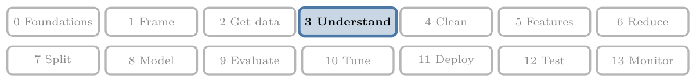
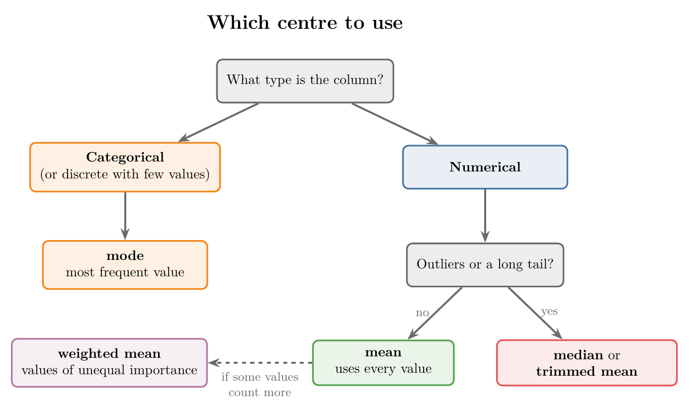

<!-- where-this-fits: generated by course_map/build_map.py; edit concepts.yaml, not this block -->
> **Where this fits:** Pipeline map step 3 (Understand data). See the [Course map](../01-course-map/note.md).
>
> 
>
> - **Builds on:** Exploratory data analysis ([Note 19](../19-understanding-your-data/note.md)).
> - **Leads to:** Variance ([Note 222](../222-measures-of-dispersion/note.md)); Correlation ([Note 231](../231-covariance-and-correlation/note.md)); Z-score outlier method ([Note 251](../251-standard-normal-and-z-table/note.md)); Skewness ([Note 252](../252-skewness/note.md)); Standardization ([Note 1023](../1023-data-scaling-in-ann/note.md)).
> - **Compare with:** Inferential statistics ([Note 220](../220-what-is-statistics/note.md)); Expected value and variance of a random variable ([Note 332](../332-expected-value-and-variance/note.md)).
<!-- /where-this-fits -->

## 1. Overview

> **Key point:** A measure of central tendency gives one number for the centre of a column; the mean, median, mode, weighted mean and trimmed mean each suit different data.



Figure 1 shows which measure fits which column. This Note works through each measure, its formula and its weak spot, in that order.

## 2. What central tendency means

> **Key point:** One typical value that summarises where a column's values sit.

A **measure of central tendency** is a statistical measure that represents a typical, central value of a dataset. It summarises a whole column with the single value that best represents it.

Take the `Age` column of 1,000 passengers. Reading 1,000 ages tells us little. One number for where the ages are centred tells us a lot: "the average salary", "the average package", "a batsman's average" are all such numbers.

There are several such measures. The main ones are the mean, median and mode; the weighted mean and trimmed mean are useful variants.

## 3. Mean

> **Key point:** The mean is the sum of the values divided by how many there are; it uses every value, so one extreme value can drag it far away.

The mean, the sum of the values divided by their count, is worked through in the [understanding your data Note](../19-understanding-your-data/note.md) (section 7.1). What is new here is that the population and the sample get different symbols, as the [what is statistics Note](../220-what-is-statistics/note.md) (section 4.2) explains. For a population of $N$ values and a sample of $n$ values,
$$\mu = \frac{1}{N}\sum_{i=1}^{N} x_i \qquad\qquad \bar{x} = \frac{1}{n}\sum_{i=1}^{n} x_i$$
where $\sum_{i=1}^{n} x_i$ means "add up $x_1, x_2, \dots, x_n$". For the values 3, 4, 1, 2 and 5, $\bar{x} = 15/5 = 3$.

The two formulas do the same arithmetic. They differ in what they describe: $\mu$ is the true centre of the whole population, $\bar{x}$ is the centre of one sample. The two are usually close, but not equal.

### 3.1 The weak spot of the mean: outliers

> **Key point:** One very high or very low value pulls the mean towards it, so the mean stops describing anyone.

As the [what are outliers Note](../41-what-are-outliers/note.md) (section 2.1) shows, one billionaire in a classroom drags the mean salary into the crores. Here is the same effect on a class we will reuse below.

Nine students earn between 28 and 40 thousand rupees a month. A tenth classmate skipped placements, founded a start-up and now earns 20 lakh rupees (2,000 thousand) a month. Figure 2 shows what happens to the mean.


- **Nine students:** the mean is 33.7 thousand rupees, a fair summary.
- **With the founder:** the mean jumps to 230.3 thousand rupees. Nobody in the class earns anything like that.

So before using the mean, we check whether the column has outliers. If it does, the mean is not a good summary of that column.

## 4. Median

> **Key point:** The median is the middle value of the sorted data; extreme values sit at the ends of the sorted list, so they cannot move it.

The median, the middle value of the sorted data, and its position $(n+1)/2$ are in the [understanding your data Note](../19-understanding-your-data/note.md) (section 7.2). With an even number of values there is no single middle one, so we take the mean of the two middle ones. For sorted values $x_{(1)} \le x_{(2)} \le \dots \le x_{(n)}$,
$$\text{median} = \begin{cases} x_{((n+1)/2)} & n \text{ odd} \\[4pt] \dfrac{x_{(n/2)} + x_{(n/2+1)}}{2} & n \text{ even} \end{cases}$$

For example, 1, 2, 3, 4, 5 has median 3. Adding a sixth value, 6, gives 1, 2, 3, 4, 5, 6, and
$$\text{median} = \frac{3 + 4}{2} = 3.5$$
If that sixth value were 60,000 instead of 6, the sorted list would be 1, 2, 3, 4, 5, 60000, and the median would still be 3.5.

That last line is why the median resists outliers. However large an extreme value is, sorting puts it at the end of the list, and the middle stays where it was. In Figure 2, the founder moves the median only from 33 to 34 thousand rupees.

The same reasoning gives practical advice: when comparing colleges or companies, look at the median package, not the average one. One student with a package of 1 crore raises the average for everyone, but leaves the median almost untouched.

> **Python:** Mean and median.
>
> ```python
> import numpy as np
>
> x = np.array([1, 2, 3, 4, 5, 60000])
> np.mean(x)     # 10002.5
> np.median(x)   # 3.5
> ```
>
> On a pandas column we write `df["Age"].mean()` and `df["Age"].median()`.

## 5. Mode

> **Key point:** The mode is the most frequent value; it is the natural centre for categorical and discrete data.

The **mode** is the value that appears most often in the data.

1. **In words:** count how often each value appears; the mode is the one with the highest count.
2. **Formula:** with $f(v)$ the number of times value $v$ appears,
   $$\text{mode} = \text{the value } v \text{ with the largest } f(v)$$
3. **Example:** in 1, 2, 1, 3, 1, 4, 2, 1, the value 1 appears 4 times, 2 appears twice, and 3 and 4 once each. The mode is 1.

The mode is most useful for:

- **Categorical columns,** where the mean and median make no sense. Ask a class which state each student comes from and count; if Maharashtra comes up most often, it is the mode.
- **Discrete columns with few values,** such as the number of siblings on board.

For a continuous column, the mode is rarely useful: with values such as 32.17 and 32.18, almost every value appears only once.

If two values tie for the highest count, both are modes. Data with two modes is bimodal (two peaks, as in the [power transformer Note](../31-power-transformer/note.md)); with more, it is **multimodal**.

> **Python:** The mode.
>
> ```python
> import pandas as pd
>
> pd.Series([1, 2, 1, 3, 1, 4, 2, 1]).mode()   # 1
> pd.Series([1, 1, 2, 2, 3]).mode()            # 1 and 2: a tie
> ```
>
> `mode()` returns every value that ties for first place, so its result is a Series, not a single number.

## 6. Weighted mean

> **Key point:** The weighted mean multiplies each value by its importance before averaging, so more important values count more.

In the ordinary mean, every value counts equally. The **weighted mean** gives each value a **weight**, a number that says how much it counts.

1. **In words:** multiply each value by its weight, add these products, and divide by the sum of the weights.
2. **Formula:** for values $x_i$ with weights $w_i$,
   $$\bar{x}_w = \frac{\sum_{i=1}^{n} w_i\, x_i}{\sum_{i=1}^{n} w_i}$$
3. **Example:** we predict a house price with three models: linear regression says 10 lakh rupees, a random forest 15 lakh, and XGBoost 12 lakh. From past results, we trust them with weights 0.2, 0.3 and 0.5. Then
   $$\bar{x}_w = \frac{0.2 \times 10 + 0.3 \times 15 + 0.5 \times 12}{0.2 + 0.3 + 0.5} = \frac{2 + 4.5 + 6}{1} = 12.5 \text{ lakh rupees}$$
   The plain mean would be $(10 + 15 + 12)/3 = 12.33$ lakh; the weighted mean leans towards XGBoost, the model we trust most.

This is exactly what a voting regressor with weights does (see the [voting regressor Note](../104-voting-regressor/note.md)). The ordinary mean is the special case where every weight is equal.

> **Python:** The weighted mean.
>
> ```python
> np.average([10, 15, 12], weights=[0.2, 0.3, 0.5])   # 12.5
> ```

## 7. Trimmed mean

> **Key point:** The trimmed mean drops a fixed share of the smallest and largest values, then averages the rest, so outliers cannot pull it.

The **trimmed mean** removes a chosen percentage of the smallest and of the largest values, and takes the mean of what is left. The percentage removed from each end is the **trimming percentage**.

1. **In words:** sort the values, remove the lowest $p\%$ and the highest $p\%$, and take the mean of the rest.
2. **Formula:** for $n$ sorted values $x_{(1)} \le \dots \le x_{(n)}$, cut $k = \lfloor p\,n \rfloor$ values from each end ($\lfloor\ \rfloor$ means round down):
   $$\bar{x}_{\text{trim}} = \frac{1}{n - 2k}\sum_{i=k+1}^{n-k} x_{(i)}$$
3. **Example:** the class with the founder has $n = 10$ salaries: 28, 30, 31, 32, 33, 35, 36, 38, 40 and 2000 thousand rupees. A 10% trim cuts $k = \lfloor 0.1 \times 10 \rfloor = 1$ value from each end: 28 and 2000. Then
   $$\bar{x}_{\text{trim}} = \frac{30 + 31 + 32 + 33 + 35 + 36 + 38 + 40}{8} = \frac{275}{8} = 34.375$$
   The plain mean was 230.3; the trimmed mean, 34.4, describes the class again (Figure 2).

The trimmed mean sits between the mean and the median. It uses more values than the median, so it keeps more information, yet it ignores the extremes.

How much to trim depends on the data. We look at its distribution first, for example with a box plot, see how many outliers there are, and trim at least that share from each end.

> **Extra:** With 9 students, a 10% trim cuts $\lfloor 0.9 \rfloor = 0$ values, so in Figure 2 the trimmed mean of the nine equals their plain mean, 33.7. Trimming percentages are usually 5% to 25%; the median is the extreme case, a trim of almost 50% from each end.

> **Extra:** Judged sports such as gymnastics and diving use a trimmed mean: the highest and lowest judges' scores are dropped, so one very generous or very harsh judge cannot decide the result.

> **Python:** The trimmed mean.
>
> ```python
> from scipy import stats
>
> salaries = [28, 30, 31, 32, 33, 35, 36, 38, 40, 2000]
> stats.trim_mean(salaries, 0.1)   # 34.375
> ```
>
> `0.1` is the share cut from each end. `trim_mean` sorts the values itself.

## 8. Choosing a measure

> **Key point:** Use the mode for categories, the mean for numbers without outliers, and the median or trimmed mean when outliers are present.

| Measure | Uses | Affected by outliers? | Best for |
|---|---|---|---|
| Mean | every value | yes, strongly | numerical data without outliers |
| Median | the middle value(s) | almost not | numerical data with outliers or skew; ordinal data |
| Mode | the counts | no | categorical and discrete data |
| Weighted mean | every value and its weight | yes | values of unequal importance |
| Trimmed mean | the values left after trimming | only if trimming is too light | numerical data with a few outliers |

When there are no outliers, the mean is the better summary: it uses every value, while the median uses only one or two. No rule says one measure is always best; we look at the data first. For a skewed column, the [univariate analysis Note](../20-univariate-analysis/note.md) (section 10) shows how the mean is pulled towards the long tail.

> **Extra:** Two more means appear in special cases.
>
> - **Geometric mean** $= \left(x_1 x_2 \cdots x_n\right)^{1/n}$, for growth rates. An investment that grows 10% one year and 50% the next is multiplied by $1.1 \times 1.5 = 1.65$. The geometric mean factor is $\sqrt{1.65} \approx 1.2845$: an average growth of 28.45% a year. The ordinary mean, 30%, is wrong: $1.3 \times 1.3 = 1.69$, not 1.65.
> - **Harmonic mean** $= n / (1/x_1 + \dots + 1/x_n)$, for rates such as speeds. The F1 score is the harmonic mean of precision and recall (see the [precision, recall and F1 Note](../77-precision-recall-f1/note.md)).

## 9. Summary

| Measure | Formula | Example (values) | Result |
|---|---|---|---|
| Mean | $\sum x_i / n$ | 3, 4, 1, 2, 5 | 3 |
| Median | middle of sorted values | 1, 2, 3, 4, 5, 60000 | 3.5 |
| Mode | most frequent value | 1, 2, 1, 3, 1, 4, 2, 1 | 1 |
| Weighted mean | $\sum w_i x_i / \sum w_i$ | 10, 15, 12 with weights 0.2, 0.3, 0.5 | 12.5 |
| Trimmed mean (10%) | mean after cutting each end | the 10 class salaries | 34.375 |

- Population mean $\mu$ and sample mean $\bar{x}$ use the same arithmetic but describe different things.
- The mean is pulled by outliers; the median and the trimmed mean are not.
- Ties give several modes: bimodal or multimodal data.

## 10. Key terms

| Term | Meaning |
|---|---|
| Measure of central tendency | A single number for the typical, central value of a column |
| Population mean ($\mu$) | The mean of every value in the population |
| Sample mean ($\bar{x}$) | The mean of the values in a sample |
| Multimodal | Having more than one mode (two modes: bimodal) |
| Weighted mean | A mean in which each value is multiplied by a weight saying how much it counts |
| Weight | A number saying how much a value counts in a weighted mean |
| Trimmed mean | The mean after removing a fixed share of the smallest and largest values |
| Trimming percentage | The share of values removed from each end for a trimmed mean |
| Geometric mean | The $n$-th root of the product of $n$ values; the average of growth factors |
