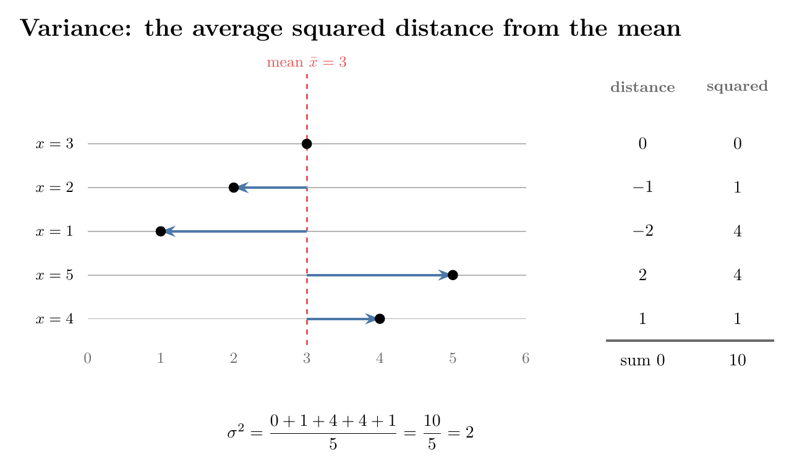
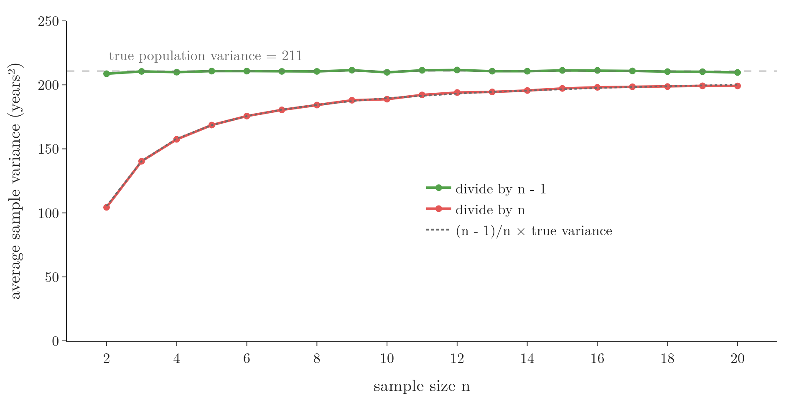
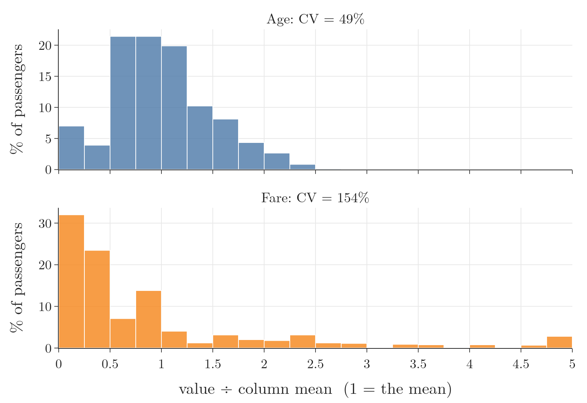

<!-- where-this-fits: generated by course_map/build_map.py; edit concepts.yaml, not this block -->
> **Where this fits:** Pipeline map step 3 (Understand data). See the [Course map](../01-course-map/note.md).
>
> 
>
> - **Builds on:** Exploratory data analysis ([Note 19](../19-understanding-your-data/note.md)); Population, sample, parameter and statistic ([Note 220](../220-what-is-statistics/note.md)).
> - **Leads to:** Correlation ([Note 231](../231-covariance-and-correlation/note.md)); Covariance and covariance matrix ([Note 231](../231-covariance-and-correlation/note.md)); Z-score outlier method ([Note 251](../251-standard-normal-and-z-table/note.md)); Skewness ([Note 252](../252-skewness/note.md)); Student's t-distribution ([Note 282](../282-t-procedure/note.md)); One-way ANOVA ([Note 572](../572-one-way-anova/note.md)).
> - **Compare with:** Inferential statistics ([Note 220](../220-what-is-statistics/note.md)).
<!-- /where-this-fits -->

## 1. Overview

> **Key point:** A measure of dispersion says how spread out a feature is around its centre: range, variance, mean absolute deviation, standard deviation and coefficient of variation each do this differently.



Figure 1 shows the idea behind the most used measure, the variance. This Note goes through five measures of spread in turn, works each with small numbers, and shows why the sample variance divides by $n - 1$.

## 2. Why the centre is not enough

> **Key point:** Two features can share a mean and still be spread very differently.

A **feature** is one variable of the data, one column of the table; an **observation** is one record, one row. Take two features of three observations each: $-5, 0, 5$ and $-10, 0, 10$. Both have mean 0, yet the second is clearly more spread out, as the [PCA intuition Note](../47-pca-geometric-intuition/note.md) (section 5.1) shows. A measure of centre alone cannot tell them apart.

A **measure of dispersion** is a statistical measure that describes the spread, or variability, of a dataset: how the data is distributed around its centre.

## 3. Range

> **Key point:** The range is the largest value minus the smallest; it is simple but ruined by a single outlier.

The **range** is the distance between the two extremes of a feature.

1. **In words:** subtract the smallest value from the largest.
2. **Formula:**
   $$\text{range} = \max(x) - \min(x)$$
3. **Example:** for $-5, 0, 5$ the range is $5 - (-5) = 10$; for $-10, 0, 10$ it is $10 - (-10) = 20$. The range tells the two features apart where the mean could not.

The range uses only two values, the two extremes, so one outlier can blow it up. If a feature's values all lie between 0 and 50 except one at 250, the range jumps from about 50 to 250 because of that one point.

Salaries in India show the problem. Some of the richest people in the world live in India, and so do many people who earn very little. The range of Indian salaries is therefore huge, yet it says nothing about how most people earn. So the range is rarely used on its own.

## 4. Variance

> **Key point:** Variance is the average squared distance from the mean; the sample version divides by $n - 1$ instead of $n$.

The variance is the average squared distance of the values from their mean; the [PCA intuition Note](../47-pca-geometric-intuition/note.md) (section 5) teaches it. Here we add the population and sample versions, work them through, and see why the squares are needed.

1. **Formula:**
   $$\sigma^2 = \frac{1}{N}\sum_{i=1}^{N} (x_i - \mu)^2 \qquad\qquad s^2 = \frac{1}{n - 1}\sum_{i=1}^{n} (x_i - \bar{x})^2$$
   $\sigma^2$ is the population variance, $s^2$ the sample variance.
2. **Example:** for 3, 2, 1, 5, 4 the mean is 3, and the distances are $0, -1, -2, 2, 1$ (Figure 1). Their squares add up to $0 + 1 + 4 + 4 + 1 = 10$. As a population,
   $$\sigma^2 = \frac{10}{5} = 2$$
   As a sample,
   $$s^2 = \frac{10}{5 - 1} = 2.5$$

Variance is in squared units, so doubling the spread multiplies it by four (worked in section 5.2 of the PCA intuition Note).

### 4.1 Why we square the distances

> **Key point:** The plain distances from the mean always add up to zero, so we need squares (or absolute values) to stop them cancelling.

In Figure 1 the distances are $0, -1, -2, 2, 1$: the values below the mean give negative distances, those above give positive ones, and they add up to 0. The zero total is not a coincidence.

> **Extra:** Proof that the distances from the mean always add up to zero.
>
> 1. **In words:** the mean is the balance point of the data, so the negative and positive distances cancel exactly.
> 2. **Formula:** since $\sum_{i=1}^{n} x_i = n\bar{x}$ by the definition of the mean,
>    $$\sum_{i=1}^{n} (x_i - \bar{x}) = \sum_{i=1}^{n} x_i - n\bar{x} = n\bar{x} - n\bar{x} = 0$$
> 3. **Example:** for 3, 2, 1, 5, 4: $0 + (-1) + (-2) + 2 + 1 = 0$.

Spread should add up, never cancel. Squaring makes every distance positive. The absolute value does the same, and gives the mean absolute deviation of Section 5.

### 4.2 Variance and outliers

> **Key point:** Squaring makes a far-away value count enormously, so variance is very sensitive to outliers.

A value far from the mean has a large distance, and its square is larger still. Add 50 to the five values above: the data becomes 3, 2, 1, 5, 4, 50, the mean moves to 10.83, and the population variance jumps from 2 to 308.5. One value multiplied the variance by about 150.

### 4.3 Why the sample variance divides by n - 1

> **Key point:** Dividing by $n$ makes a sample's variance too small on average; dividing by $n - 1$ makes it right on average.

We compute $s^2$ from a sample to estimate the population's $\sigma^2$. If we divided by $n$, the estimate would be too small on average. Dividing by $n - 1$, a correction called **Bessel's correction**, fixes this.

A tiny example shows it exactly. Take the population 1, 2, 3, 4. Its mean is 2.5 and its variance is
$$\sigma^2 = \frac{(-1.5)^2 + (-0.5)^2 + 0.5^2 + 1.5^2}{4} = \frac{5}{4} = 1.25$$

Now draw every possible sample of two values, picking with replacement: (1, 1), (1, 2), ..., (4, 4), 16 samples in all. For a sample $(a, b)$ the mean is $(a+b)/2$ and both values lie $|a - b|/2$ from it, so the squared distances add up to $(a-b)^2/2$. The table counts the 16 samples by their difference:

| Difference $\lvert a - b \rvert$ | Samples | Squared distances, summed | Divide by $n = 2$ | Divide by $n - 1 = 1$ |
|---|---|---|---|---|
| 0 | 4 | 0 | 0 | 0 |
| 1 | 6 | 0.5 | 0.25 | 0.5 |
| 2 | 4 | 2 | 1 | 2 |
| 3 | 2 | 4.5 | 2.25 | 4.5 |
| **Average over 16 samples** | | | **0.625** | **1.25** |

Dividing by $n$ gives 0.625 on average, half the true 1.25. Dividing by $n - 1$ gives exactly 1.25.

Figure 2 repeats the experiment on real data. We treat the 714 known Titanic ages as a population (variance 211) and draw 20,000 random samples of each size from 2 to 20.



Dividing by $n - 1$ (green) lands on the true variance at every sample size. Dividing by $n$ (red) is too small, badly so for small samples; the gap shrinks as $n$ grows, because $n$ and $n - 1$ become almost equal.

> **Extra:** Why the sample is too narrow. The mean of a sample, $\bar{x}$, is the point closest to that sample's values: for any other point $c$, the squared distances are larger. The exact amount is an identity of algebra:
> $$\sum_{i=1}^{n}(x_i - \mu)^2 = \sum_{i=1}^{n}(x_i - \bar{x})^2 + n(\bar{x} - \mu)^2$$
> So measuring distances from $\bar{x}$ instead of the true $\mu$ always loses the amount $n(\bar{x} - \mu)^2$. For 3, 2, 1, 5, 4 and $\mu = 2.5$: the left side is $11.25$, and the right side is $10 + 5 \times 0.5^2 = 10 + 1.25 = 11.25$. Averaged over all samples, the lost amount equals exactly one $\sigma^2$, which leaves $(n-1)\sigma^2$: dividing by $n - 1$ gives back $\sigma^2$. The step "equals one $\sigma^2$" needs the variance of a sample mean, which comes with the central limit theorem in a later maths Note.

> **Python:** Population and sample variance.
>
> ```python
> import numpy as np
>
> x = np.array([3, 2, 1, 5, 4])
> np.var(x)           # 2.0: divides by n (ddof=0)
> np.var(x, ddof=1)   # 2.5: divides by n - 1
> ```
>
> `ddof` ("delta degrees of freedom") is the number subtracted from $n$. NumPy uses `ddof=0` by default; pandas' `.var()` and `.std()` use `ddof=1`.

## 5. Mean absolute deviation

> **Key point:** The mean absolute deviation averages the absolute distances from the mean; it is less sensitive to outliers than variance, but harder to work with mathematically.

The mean absolute deviation averages the distances from the mean without their sign, replacing the square by an absolute value (see the [PCA intuition Note](../47-pca-geometric-intuition/note.md), section 5.4).

1. **Formula:**
   $$\text{MAD} = \frac{1}{n}\sum_{i=1}^{n} \lvert x_i - \bar{x} \rvert$$
2. **Example:** for 3, 2, 1, 5, 4 the absolute distances are $0, 1, 2, 2, 1$, so
   $$\text{MAD} = \frac{0 + 1 + 2 + 2 + 1}{5} = \frac{6}{5} = 1.2$$

Its strength is that a far value counts in proportion to its distance, not its distance squared. So outliers inflate it less than they inflate variance.

Its weakness is inference. A sample's variance lets us estimate the population's variance (section 4.3); a sample's mean absolute deviation is not used that way. So inferential statistics is built on the variance, and the mean absolute deviation is rarely used. The absolute value is also awkward in calculus: it has no derivative at zero (section 5.4 of the PCA intuition Note).

> **Extra:** The abbreviation MAD is also used for the median absolute deviation, a different, even more robust measure (see the [Pandas Profiling Note](../22-pandas-profiling/note.md)). Always check which one is meant.

## 6. Standard deviation

> **Key point:** The standard deviation is the square root of the variance; unlike the variance, it is in the same units as the data.

The standard deviation is the square root of the variance, $\sigma = \sqrt{\sigma^2}$ for a population and $s = \sqrt{s^2}$ for a sample; the [understanding your data Note](../19-understanding-your-data/note.md) (section 7.1) works one through step by step. If we already have the variance, why keep the standard deviation? Because of units.

Four people earn 16, 17, 13 and 14 LPA (lakh rupees per annum). The mean is 15 LPA, the distances are $1, 2, -2, -1$ LPA, and
$$\sigma^2 = \frac{1^2 + 2^2 + (-2)^2 + (-1)^2}{4} = \frac{10}{4} = 2.5 \text{ LPA}^2$$
$$\sigma = \sqrt{2.5} \approx 1.58 \text{ LPA}$$

"2.5 LPA squared" means nothing to anyone: nobody earns a squared rupee. "1.58 LPA" does: a typical salary here is about 1.58 lakh away from the mean of 15 lakh. For 3, 2, 1, 5, 4, the standard deviation is $\sqrt{2} \approx 1.41$.

## 7. Coefficient of variation

> **Key point:** The coefficient of variation divides the standard deviation by the mean, so we can compare the spread of features measured in different units.

The coefficient of variation (CV), $\sigma / \mu$, is the unit-free spread taught in the [Pandas Profiling Note](../22-pandas-profiling/note.md) (section 4.2); here we write it as a percentage, $\sigma / \mu \times 100\%$. Its use is comparing features in different units, such as salaries in lakhs and experience in years.

For the 714 known Titanic ages, the mean is 29.70 years and the standard deviation 14.53 years; for the 891 fares, the mean is 32.20 and the standard deviation 49.69. Then
$$\text{CV}_{\text{Age}} = \frac{14.53}{29.70} \times 100\% \approx 48.9\%$$
$$\text{CV}_{\text{Fare}} = \frac{49.69}{32.20} \times 100\% \approx 154.3\%$$

The fares vary about three times as much as the ages, relative to their means. Figure 3 shows why: dividing each feature by its own mean puts both on one scale, where 1 is the mean. The ages stay within about 0 to 2.7 times their mean; the fares run from 0 to 16 times theirs.



The bigger the CV, the further the data spreads from its mean; the smaller, the more it is concentrated near the mean. The same idea compares two people's scores on different exams, or the spread of the same quantity in different currencies.

> **Extra:** The CV only makes sense for data with a true zero and a positive mean, such as fares, ages or weights; near a mean of 0 it jumps wildly (NIST Dataplot). Celsius has no true zero, so the same days give different CVs in different units: 10, 20, 30 degrees Celsius give 50%, but the same days in Fahrenheit (50, 68, 86) give about 26.5%.

> **Python:** The coefficient of variation.
>
> ```python
> import pandas as pd
>
> df = pd.read_csv("data/titanic_train.csv")
> for col in ["Age", "Fare"]:
>     cv = df[col].std() / df[col].mean() * 100
>     print(col, round(cv, 1))   # Age 48.9, Fare 154.3
> ```
>
> The Notebook for this Note (`notebook.ipynb`) computes every measure of this Note on the Titanic data and reruns the $n - 1$ experiment.

## 8. Summary

| Measure | Formula | Example (3, 2, 1, 5, 4) | Units | Outliers |
|---|---|---|---|---|
| Range | $\max - \min$ | 4 | data units | ruins it |
| Variance | $\sum (x_i - \mu)^2 / N$; sample divides by $n - 1$ | 2 (sample: 2.5) | squared | very sensitive |
| Mean absolute deviation | $\sum \lvert x_i - \bar{x} \rvert / n$ | 1.2 | data units | less sensitive |
| Standard deviation | $\sqrt{\text{variance}}$ | 1.41 | data units | sensitive |
| Coefficient of variation | $\sigma / \mu \times 100\%$ | 47% | none | sensitive |

- Distances from the mean always add up to 0, so variance squares them.
- The sample variance divides by $n - 1$ (Bessel's correction); dividing by $n$ is too small on average.
- The standard deviation is the variance brought back to the data's units.
- The CV compares the spread of features in different units.

## 9. Sources

- NIST/SEMATECH. *Dataplot Reference Manual*: Coefficient of Variation. itl.nist.gov, Dataplot refman2, coefvari.

## 10. Key terms

| Term | Meaning |
|---|---|
| Measure of dispersion | A number that describes how spread out a feature is around its centre |
| Feature | One variable of the data, one column of the table |
| Observation | One record, one row of the table |
| Range | The largest value minus the smallest |
| Bessel's correction | Dividing by $n - 1$ instead of $n$, so the sample variance is right on average |
| ddof | NumPy and pandas argument: the number subtracted from $n$ in the variance's denominator |
