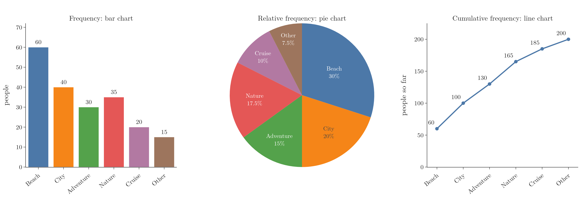
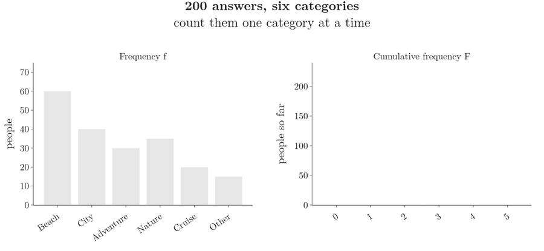
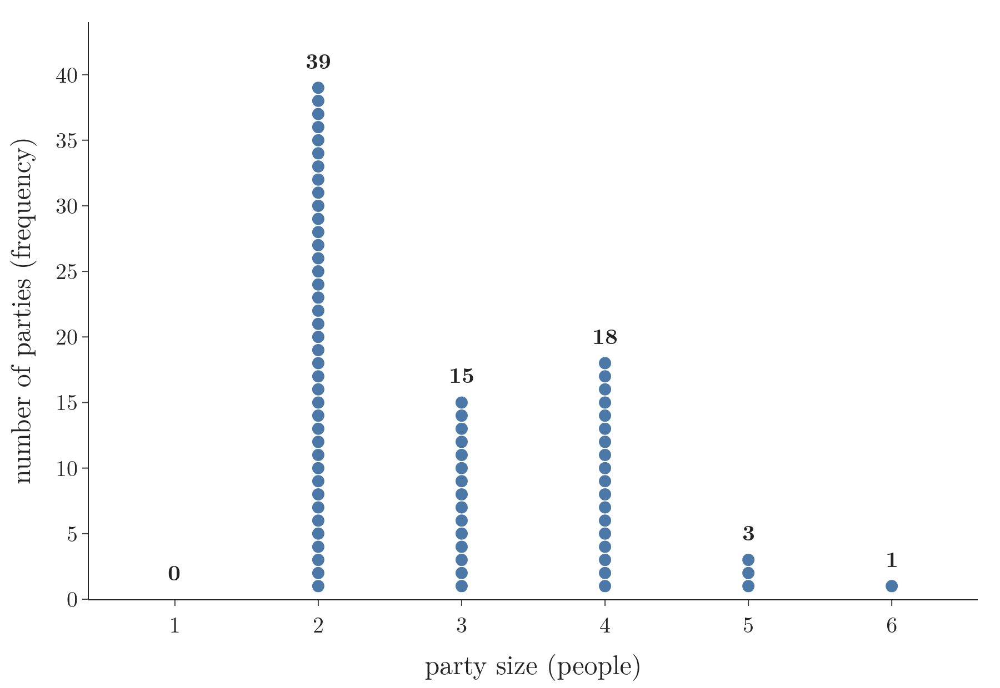
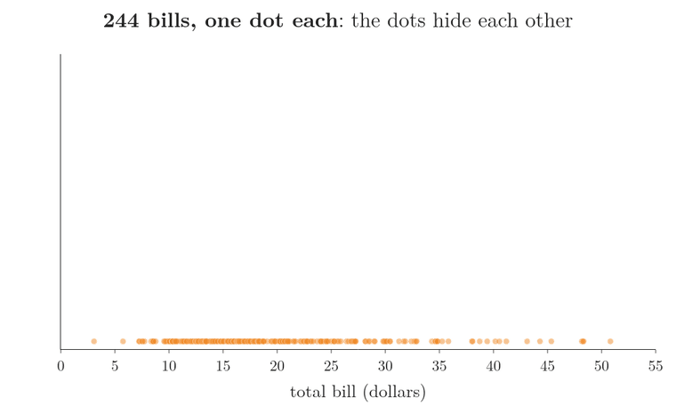
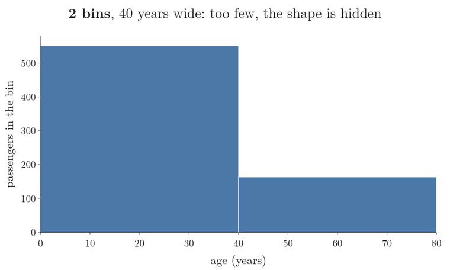
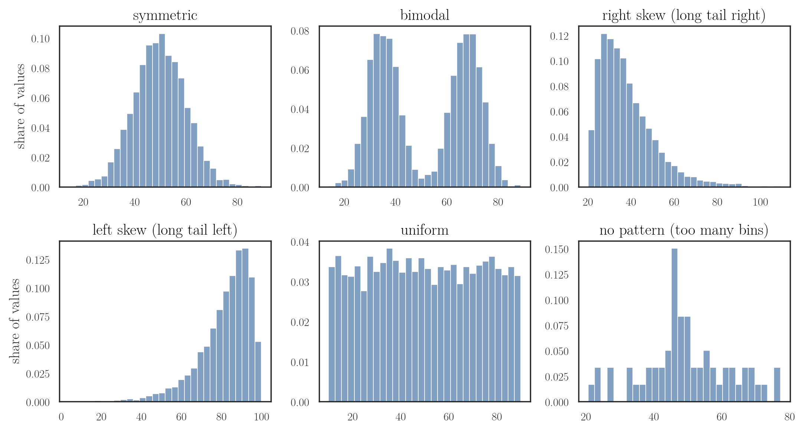
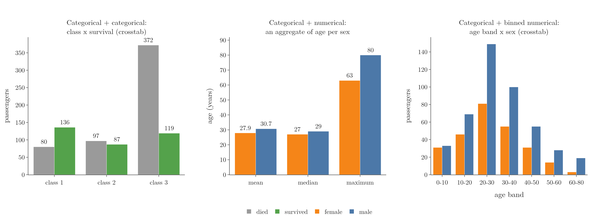
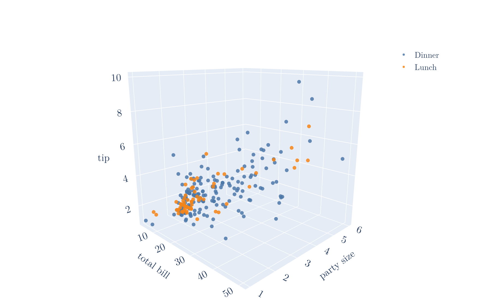
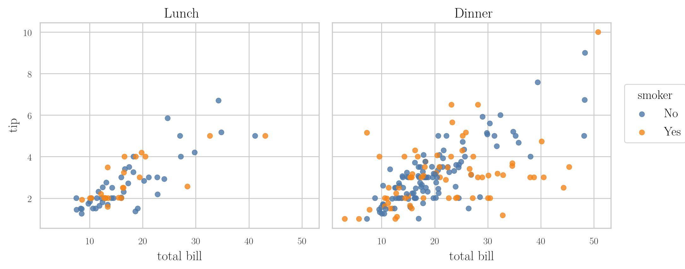

<!-- where-this-fits: generated by course_map/build_map.py; edit concepts.yaml, not this block -->
> **Where this fits:** Pipeline map step 3 (Understand data). See the [Course map](../01-course-map/note.md).
>
> 
>
> - **Builds on:** Exploratory data analysis ([Note 9](../09-mldlc/note.md)).
> - **Leads to:** Percentiles, quartiles and box plots ([Note 230](../230-percentiles-and-box-plots/note.md)); Correlation ([Note 231](../231-covariance-and-correlation/note.md)); Z-score outlier method ([Note 251](../251-standard-normal-and-z-table/note.md)); Skewness ([Note 252](../252-skewness/note.md)); Standardization ([Note 1023](../1023-data-scaling-in-ann/note.md)).
> - **Compare with:** Inferential statistics ([Note 220](../220-what-is-statistics/note.md)); Cumulative distribution function (CDF) ([Note 241](../241-pmf-and-discrete-cdf/note.md)).
<!-- /where-this-fits -->

## 1. Overview

> **Key point:** A categorical feature is summarised by a frequency table and its relative and cumulative versions; a numerical feature by a histogram; two or more features by graphs chosen from their types.



Summarising data and presenting it in a meaningful way is **descriptive statistics** (G-596). Figure 1 shows the three tables we can build from one categorical feature, each with the chart that suits it. A **feature** (G-772) is one variable of the data, one column of the table; an **observation** (G-1374) is one record, one row of the table.

This Note covers:

- the three frequency tables of one categorical feature, and the dot plot of a discrete one (section 2);
- the histogram of one numerical feature, and the shapes it can take (section 3);
- the graphs for two features (section 4);
- the graphs for more than two features (section 5).

## 2. Frequency tables for a categorical feature

> **Key point:** Count each category (frequency), turn the counts into shares (relative frequency), and add them up as we go (cumulative frequency).

### 2.1 Frequency distribution table

> **Key point:** A frequency distribution table lists each category with the number of times it occurs.

We survey 200 people about their favourite type of vacation. Each answer is one of six categories: beach, city, adventure, nature, cruise or other. The data has one observation per person, with their name and their answer.

A **frequency distribution table** (G-807) summarises how many times each value occurs in a dataset. For the survey, we count each category:

| Vacation | Frequency | Relative frequency | Cumulative frequency |
|---|---|---|---|
| Beach | 60 | 0.300 | 60 |
| City | 40 | 0.200 | 100 |
| Adventure | 30 | 0.150 | 130 |
| Nature | 35 | 0.175 | 165 |
| Cruise | 20 | 0.100 | 185 |
| Other | 15 | 0.075 | 200 |
| **Total** | **200** | **1.000** | |

Figure 2 builds the table one category at a time. Watch the left panel fill in the counts, and the right panel keep a running total that ends at 200.



The frequencies are drawn as a bar chart, one bar per category (Figure 1, left). This bar chart is the count plot of the [univariate analysis Note](../20-univariate-analysis/note.md) (section 4), and pandas builds the table with `value_counts()`.

### 2.2 Relative frequency

> **Key point:** Relative frequency is a category's share of all the data: its frequency divided by the total.

The **relative frequency** (G-1664) of a category is its proportion, or percentage, of the data.

1. **In words:** divide the category's count by the total number of observations.
2. **Formula:** for a category with frequency $f$ out of $n$ observations,
   $$\text{relative frequency} = \frac{f}{n}$$
3. **Example:** 60 of the 200 people chose the beach, so
   $$\text{relative frequency of Beach} = \frac{60}{200} = 0.30 = 30\ \text{percent}$$

The relative frequencies always add up to 1 (100%). Summing to 1 makes them the natural input for a **pie chart** (G-1495), whose slices show each category's share (Figure 1, middle).

### 2.3 Cumulative frequency

> **Key point:** Cumulative frequency is the running total of the frequencies, so the last value is always the total.

The **cumulative frequency** (G-517) of a category is its frequency plus the frequencies of all the categories before it.

1. **In words:** walk down the table, keeping a running total of the frequencies.
2. **Formula:** for categories in the table's order with frequencies $f_1, f_2, \dots$, the cumulative frequency of the $k$-th category is
   $$F_k = f_1 + f_2 + \dots + f_k$$
3. **Example:** Beach gives 60; City adds 40, giving 100; Adventure adds 30, giving 130; then 165, 185 and finally 200, the total.

A line chart shows the running total (Figure 1, right). The same running total of the relative frequencies, the **cumulative relative frequency** (G-518), climbs from 0.30 to 0.50, and so on, to 1.

Cumulative frequency is most meaningful when the categories have an order, such as ordinal data or the bins of a histogram: "how many people scored 60 or less?". For unordered categories it depends on the order we list them in.

> **Python:** The three tables with pandas.
>
> ```python
> freq = df["vacation"].value_counts(sort=False)
> rel = freq / freq.sum()          # relative frequency
> cum = freq.cumsum()              # cumulative frequency
> ```
>
> `value_counts(normalize=True)` gives the relative frequencies directly. `cumsum()` is the running total. The Notebook (`notebook.ipynb`) builds all three tables and charts.

### 2.4 A discrete feature: the dot plot

> **Key point:** A numerical feature with only a few separate values gets the same frequency table; drawn with one dot per observation, the table is a dot plot.

A discrete feature, such as the number of people in a restaurant party, has few distinct values, so each value can play the part of a category. For the 76 Sunday parties of the tips data we count each party size:

| Party size | 1 | 2 | 3 | 4 | 5 | 6 |
|---|---|---|---|---|---|---|
| Frequency | 0 | 39 | 15 | 18 | 3 | 1 |

A **dot plot** (G-2230) draws this table with one dot per observation, stacked above its value (Figure 3). The table, the dot plot and the raw list of 76 numbers all hold the same data; the dot plot is the quickest to read.

{height=40%}

Three questions answered straight from Figure 3:

- **Which size is most frequent?** The tallest stack: 2 people, with 39 parties. That value is the mode.
- **What is the range?** The largest size minus the smallest: $6 - 2 = 4$.
- **How many parties had more than 4 people?** Add the stacks to the right of 4: $3 + 1 = 4$ parties.

## 3. Histograms for a numerical feature

> **Key point:** A numerical feature has no categories, so we make our own by cutting its range into bins; the histogram is the frequency table of those bins.

A dot plot fails for a measured feature. Figure 4 starts with the 244 total bills of the tips data, one dot per bill on a number line:

1. **The dots hide each other.** Many bills are close together, so the dots overlap and we cannot see how many there are.
2. **Stacking equal values does not help.** A bill of 13.42 dollars rarely occurs twice. Only 15 of the 244 dots have an equal partner to stack on.
3. **So we stack by range instead.** We cut the line into intervals 5 dollars wide and stack every dot that falls in the same interval. The stacks are the bars of a histogram.



The tallest stack in Figure 4 holds the 67 bills between 15 and 20 dollars; only 1 bill is above 50. So a histogram also says where the next observation will probably fall: in a tall bin, rarely out in the short ones.

In general, a numerical feature such as a bill or an age has no categories to count. So we create them, in three steps:

1. Cut the range into equal intervals, such as 0 to 10, 10 to 20, 20 to 30. Each interval is a **bin** (G-298), also called a bucket.
2. Put each person in the bin that holds their age.
3. Count the people in each bin.

The result is a frequency distribution table on bins instead of categories, and its chart is the **histogram** (G-899; see the [univariate analysis Note](../20-univariate-analysis/note.md), section 6).

A histogram looks like a bar chart with one difference: its bars touch. The categories of a bar chart are separate; the bins of a histogram are continuous ranges, one ending where the next begins.

The number of bins changes the picture, as section 6.1 of that Note shows. Figure 5 cuts the 714 known Titanic ages into 2, 8, 20 and 80 bins:

- **2 bins:** each bar averages over 40 years, so the shape is hidden.
- **8 and 20 bins:** the peak in the twenties and the long tail of older passengers appear.
- **80 bins:** each bar holds only a handful of people, so the bars jump up and down by chance.



We try a few bin counts and keep the clearest; the default of a plotting library is only a starting point.

A histogram trades detail for shape. Figure 4 shows that 67 bills lie between 15 and 20 dollars, but once the dots are replaced by a bar, the exact bills are gone. So a histogram answers "how many values are above 30?" by adding bars, yet it cannot give an exact median, which needs the sorted values themselves. A dot plot keeps every value, and the box plot of the [percentiles and box plots Note](../230-percentiles-and-box-plots/note.md) marks the median directly.

### 3.1 The shapes of a histogram

> **Key point:** Histograms come in a few typical shapes: symmetric, bimodal, skewed to the right or left, uniform, or no clear pattern.

Figure 6 shows six typical shapes.



- **Symmetric:** most values in the middle, fewer and fewer towards both sides.
- **Bimodal** (G-296): two separate peaks, two groups of values where points are dense. With three peaks it is trimodal. Two peaks often mean two groups mixed together, each with its own centre, such as the heights of children and adults (NIST Handbook §1.3.3.14.5).
- **Right or left skew:** a long tail on one side; the shapes and the skewness number are taught in section 10 of the [univariate analysis Note](../20-univariate-analysis/note.md).
- **Uniform:** every bin holds about the same number of values. Too few bins also make data look uniform.
- **No pattern:** the bars jump up and down. Usually there are too many bins for the amount of data, here 30 bins for 60 values.

Named shapes such as the normal and uniform distributions come in the probability distribution Notes.

> **Extra:** Remember the direction of skew by the tail, not by the hump. In a right-skewed histogram the hump is on the left and the long tail points right.

## 4. Graphs for two features

> **Key point:** Two features are categorical + categorical (contingency table), numerical + numerical (scatter plot) or categorical + numerical (an aggregate per category, or a contingency table of bins).

Studying two features together is **bivariate analysis** (G-310); the [bivariate and multivariate analysis Note](../21-bivariate-multivariate-analysis/note.md) (Figure 1) maps each pair of feature types to its plots.

Figure 7 draws one example of each pair on the Titanic.



- **Categorical + categorical:** a **contingency table** (G-464), also called a **crosstab** (G-511): the counts for every pair of categories (that Note, section 7). On the Titanic, a contingency table of class against survival shows 372 of the 549 passengers who died were in third class (Figure 7, left). A side-by-side or stacked bar chart draws it.
- **Numerical + numerical:** a scatter plot (that Note, section 3). Its pattern can show a positive relation, a negative one, or none, which the [covariance and correlation Note](../231-covariance-and-correlation/note.md) measures.
- **Categorical + numerical:** two options, below.

### 4.1 Categorical and numerical: any aggregate per category

> **Key point:** A bar per category whose height is any summary of the numerical feature: mean, median, maximum, standard deviation.

A bar chart of a categorical feature against a numerical one does not show counts. Each bar shows an **aggregate** (G-182), one summary number computed from the numerical values in that category. The bar plot of that Note (section 4) uses the mean, but any summary works:

| Sex | Mean age | Median age | Maximum age |
|---|---|---|---|
| Female | 27.9 | 27 | 63 |
| Male | 30.7 | 29 | 80 |

The mean bars compare typical ages; the maximum bars show that the oldest man (80) was much older than the oldest woman (63) (Figure 7, middle).

### 4.2 Categorical and numerical: a contingency table of bins

> **Key point:** Cutting the numerical feature into bins turns it into a categorical one, so a contingency table works.

We can also bin the numerical feature, as for a histogram, and then count every pair of age band and category:

| Age band | Female | Male |
|---|---|---|
| 0 to 10 | 31 | 33 |
| 10 to 20 | 46 | 69 |
| 20 to 30 | 81 | 149 |
| 30 to 40 | 55 | 100 |
| 40 to 50 | 31 | 55 |
| 50 to 60 | 14 | 28 |
| 60 to 80 | 3 | 19 |

The cell "20 to 30, male" means 149 passengers were men aged over 20 and up to 30. The table shows the men outnumbered the women in every band, most of all among the older passengers (19 against 3 over 60). Figure 7, right, draws the table: the blue bars are taller in every band.

> **Python:** Binning, then a contingency table.
>
> ```python
> bands = pd.cut(df["Age"], bins=[0, 10, 20, 30, 40, 50, 60, 80])
> pd.crosstab(bands, df["Sex"])
> ```
>
> `pd.cut` puts each age in its band; a band such as (20, 30] includes 30 but not 20.

> **Extra:** A crosstab only counts pairs of categories. A **pivot table** (G-1500) can also aggregate a third, numerical feature for each pair: for example, the mean age of the male passengers in first class. Spreadsheets and pandas (`pivot_table`) both offer it; the [bivariate and multivariate analysis Note](../21-bivariate-multivariate-analysis/note.md) (section 11) uses one.

## 5. Graphs for more than two features

> **Key point:** A 3D scatter plot, colour (hue), facet grids, pair plots and bubble charts each fit three or more features into one figure.

Studying more than two features at once is **multivariate analysis** (G-1280). Most of its graphs are bivariate graphs with an extra feature added:

- **Hue** (G-906): colour shows a categorical feature, on a scatter plot, bar plot or box plot. A bar plot of mean age by sex with hue = class shows three features. See section 3.2 of the [bivariate and multivariate analysis Note](../21-bivariate-multivariate-analysis/note.md).
- **Bubble chart:** a scatter plot whose dot size shows a third numerical feature, such as countries by GDP and population with bubble size for literacy rate (the "size" setting of the same section).
- **Pair plot:** a scatter plot for every pair of numerical features, with a histogram on the diagonal (section 9 of that Note).
- **3D scatter plot** and **facet grid:** below.

### 5.1 The 3D scatter plot

> **Key point:** Three numerical features on three axes; colour can add a fourth.

A **3D scatter plot** (G-50) places each observation as a point in three dimensions, one numerical feature per axis. Figure 8 plots the tips data: total bill, party size and tip, with lunch and dinner by colour.



Bigger bills and bigger parties go with bigger tips: the points rise towards the far corner. On paper a 3D plot is hard to read; in the Notebook it can be rotated with the mouse, which is where it is useful.

### 5.2 The facet grid

> **Key point:** The same plot repeated side by side, one panel per category of another feature.

A **facet grid** (G-744) splits the data by a categorical feature and draws the same plot for each part, side by side, on shared axes. Figure 9 draws bill against tip once for lunch and once for dinner, with smokers in orange.



Figure 9 shows four features at once: bill, tip, meal time (the panels) and smoker (the colour). Dinner has more customers and more of the large bills.

> **Python:** 3D scatter plot and facet grid.
>
> ```python
> import plotly.express as px
>
> px.scatter_3d(tips, x="total_bill", y="size", z="tip", color="time")
> px.scatter(tips, x="total_bill", y="tip", color="smoker",
>            facet_col="time")
> ```
>
> In seaborn, `sns.relplot(data=tips, x="total_bill", y="tip", hue="smoker", col="time")` draws the facet grid.

## 6. Summary

| Features | Types | Table | Graph |
|---|---|---|---|
| One | categorical | frequency, relative, cumulative frequency | bar chart, pie chart, line chart |
| One | numerical | frequency table of bins | histogram |
| Two | categorical + categorical | contingency table (crosstab) | side-by-side or stacked bars |
| Two | numerical + numerical | none | scatter plot |
| Two | categorical + numerical | aggregate per category, or crosstab of bins | bar chart of an aggregate, box plots |
| Three or more | any | pivot table | hue, bubble chart, pair plot, 3D scatter, facet grid |

- Relative frequency = frequency / total; cumulative frequency = running total.
- Histogram bars touch because bins are continuous ranges.
- Histogram shapes: symmetric, bimodal, right skew, left skew, uniform, no pattern.

## 7. Sources

**Built from**

- CampusX, "Session 38 - Descriptive Statistics Part 1 | DSMP 2023", YouTube, https://www.youtube.com/watch?v=Uv3Blie7F3g
- StatQuest with Josh Starmer, "StatQuest: Histograms, Clearly Explained", YouTube, https://www.youtube.com/watch?v=qBigTkBLU6g
- Khan Academy, "Frequency tables and dot plots", YouTube, https://www.youtube.com/watch?v=gdE46YSedvE
- Khan Academy, "Comparing dot plots, histograms, and box plots", YouTube, https://www.youtube.com/watch?v=s_w3EJ2Jzw0

**Other references**

- NIST/SEMATECH. *e-Handbook of Statistical Methods*, section 1.3.3.14.5, Histogram Interpretation: Bimodal Mixture of 2 Normals. itl.nist.gov, div898 handbook, histogr5.

## 8. Key terms

| Term | Meaning |
|---|---|
| Feature | One variable of the data, one column of the table |
| Observation | One record, one row of the table |
| Frequency distribution table | A table of each value or category with the number of times it occurs |
| Relative frequency | A category's share of all the data: its frequency divided by the total |
| Cumulative frequency | The running total of the frequencies, up to and including a category |
| Cumulative relative frequency | The running total of the relative frequencies; ends at 1 |
| Dot plot (G-2230) | A frequency table drawn with one dot per observation, stacked over its value |
| Contingency table | A table of counts for every pair of categories of two features; another name for a crosstab |
| Aggregate | One summary number (mean, median, maximum, ...) computed from a group of values |
| 3D scatter plot | A scatter plot of three numerical features on three axes |
| Facet grid | The same plot repeated side by side, one panel per category of another feature |
