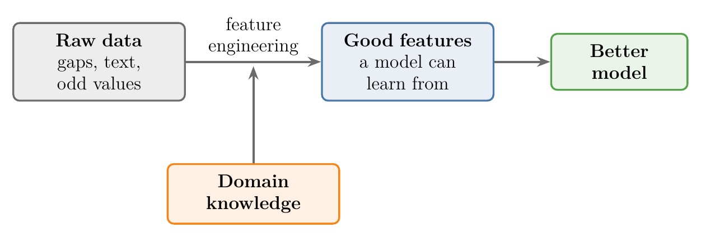
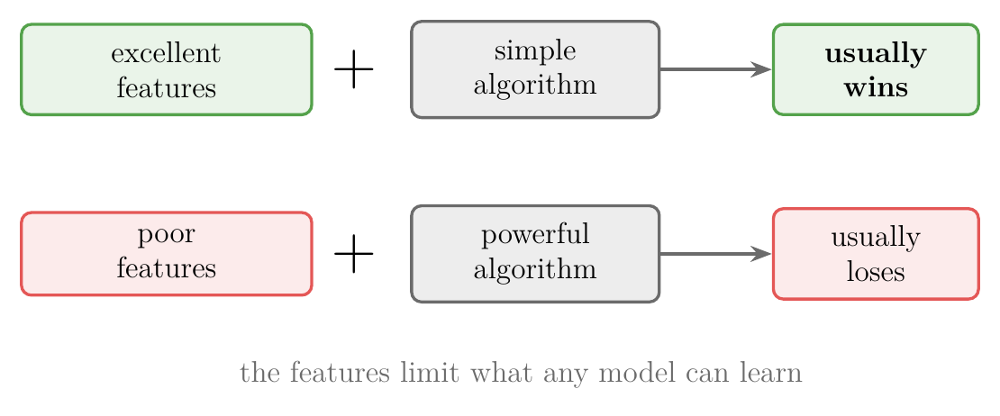
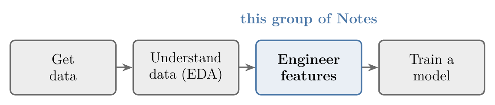
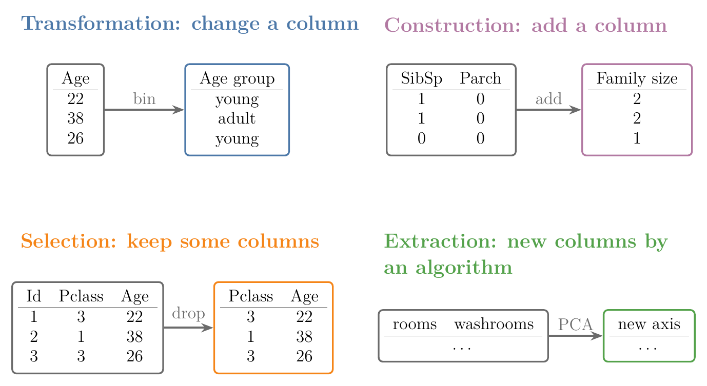
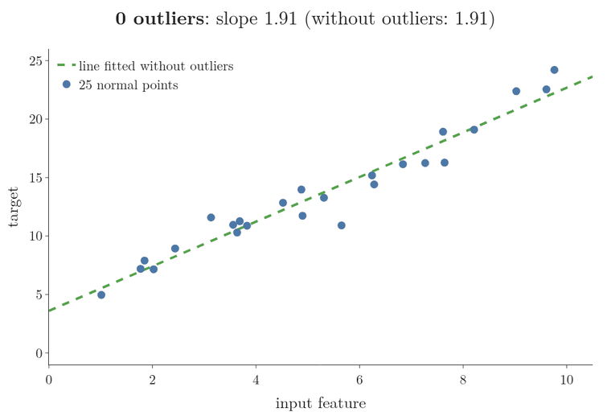
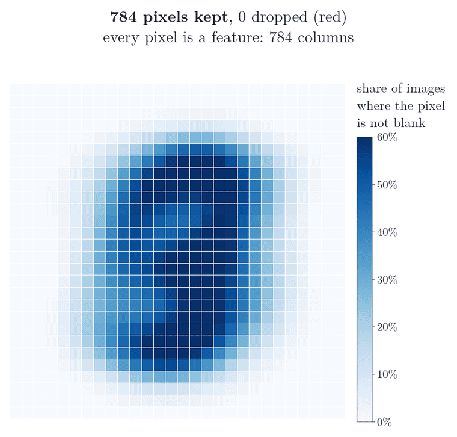
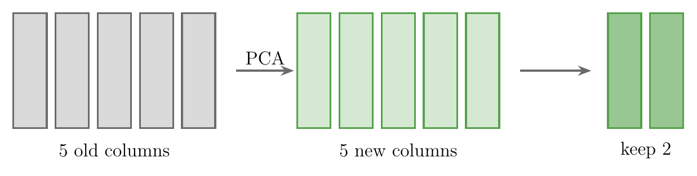
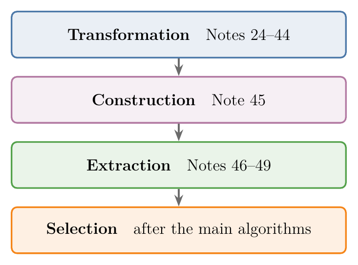

<!-- where-this-fits: generated by course_map/build_map.py; edit concepts.yaml, not this block -->
> **Where this fits:** Pipeline map steps 4 (Clean), 5 (Engineer features), 6 (Reduce dimensions). See the [Course map](../01-course-map/note.md).
>
> 
>
> - **Builds on:** Dimensionality reduction ([Note 3](../03-types-of-ml/note.md)); Poor-quality data ([Note 9](../09-mldlc/note.md)); Features ([Note 11](../11-tensors/note.md)); Train-test split ([Note 13](../13-toy-project/note.md)); Univariate analysis ([Note 20](../20-univariate-analysis/note.md)); Kernel density estimation (KDE) ([Note 20](../20-univariate-analysis/note.md)).
> - **Leads to:** Standardization ([Note 24](../24-standardization/note.md)); Normalization ([Note 25](../25-normalization/note.md)); Ordinal and label encoding ([Note 26](../26-ordinal-label-encoding/note.md)); Column transformer ([Note 28](../28-column-transformer/note.md)); Grid and random search ([Note 29](../29-pipelines/note.md)); Function transformer ([Note 30](../30-function-transformer/note.md)).
> - **Compare with:** Ordinal and label encoding ([Note 26](../26-ordinal-label-encoding/note.md)); Complete case analysis ([Note 35](../35-complete-case-analysis/note.md)); Random sample imputation ([Note 38](../38-missing-indicator-random-sample/note.md)); KNN imputer ([Note 39](../39-knn-imputer/note.md)); Decision trees ([Note 97](../97-decision-trees-intuition/note.md)); Bag of words ([Note 360](../360-vectors-and-feature-vectors/note.md)).
<!-- /where-this-fits -->

## 1. Overview

> **Key point:** Feature engineering turns raw data into features that a model can learn from well. It has four parts: transformation, construction, selection and extraction.

So far we can gather data and study it with exploratory data analysis (EDA, G-732). Before a model can learn from that data, we have to prepare its features. Preparing them is feature engineering, and it fills the next stretch of Notes.

Figure 1 is the map of this whole stretch. Each of the four parts has its own techniques, and each technique gets its own Note later. This Note explains what each part is for, with one example each.

## 2. What feature engineering is

> **Key point:** Feature engineering uses knowledge of the problem to create, change and choose the features given to an ML algorithm, so that the algorithm performs better.

Recall the three basic terms. A **feature** (G-772) is an input variable, one column of the data table. The **target** (G-1949) is the output we predict. An **observation** (G-1374) is one record, one row of the table. A standard textbook (Zheng and Casari 2018) describes **feature engineering** (G-761) as extracting features from raw data and transforming them into formats that suit a machine learning model. In practice we use **domain knowledge** (G-631) to do it, so that the algorithm performs better.

Two ideas matter:

- **Raw data** (G-1637): the data as it arrives, with gaps, text, odd values and unhelpful columns. Having data does not mean we can hand it straight to an algorithm.
- **Domain knowledge:** knowledge of the field the data comes from, such as medicine, property or shipping. Domain knowledge tells us which features make sense and which new ones would help.

A model gives good results only when its features are good. Turning raw data into such features is feature engineering.

{width=80%}

Figure 2 puts the definition in one picture.

## 3. Why feature engineering matters

> **Key point:** Good features with a simple algorithm usually beat poor features with a powerful algorithm.

A well-known saying in ML: give a weak algorithm excellent features and a powerful algorithm poor features, and the weak one usually wins. Domingos (2012, §8) puts the same point plainly: of all the factors that decide whether an ML project succeeds, "easily the most important factor is the features used". Think of a cook: a simple recipe with fresh ingredients beats a fancy recipe with stale ones. The features we give a model limit what it can learn, however clever the model is.

{width=75%}

Figure 3 shows the saying as two pairings.

Feature engineering is also more an art than a science. Like programming, it has known techniques, but each person combines them in their own way.

Two data scientists given the same data will often build different features. The lack of a recipe is why different books teach feature engineering differently: there is no single fixed recipe. The techniques below are the shared toolkit, and experience decides how to use them.

## 4. Where feature engineering sits in an ML project

> **Key point:** Feature engineering comes after the data is gathered, studied and given a first clean-up, and before any model is trained.

In the steps of an ML project, data first arrives and gets some initial preprocessing. Feature engineering comes next. Only then is the prepared data given to an algorithm to train a model.

{width=85%}

Figure 4 marks where feature engineering sits.

| Step | What happens |
|---|---|
| Get data | collect it from files, databases, APIs or the web |
| Understand data | study it with EDA |
| **Engineer features** | prepare the features (this group of Notes) |
| Train a model | give the prepared data to an algorithm |

Some lists of project steps name "feature engineering" and "feature selection" separately. Here both belong to feature engineering: selection is one of its four parts.

## 5. The four parts of feature engineering

> **Key point:** We can change features (transformation), add features (construction), keep only some features (selection), or replace features with new ones made by an algorithm (extraction).

Figure 1 groups everything feature engineering does into four parts:

1. **Feature transformation** (G-770): change a feature into another form, so that the model works better with it.
2. **Feature construction** (G-760): create a new feature by hand, from existing ones, when we think it will give better results.
3. **Feature selection** (G-768): give the algorithm only the useful features and drop the rest.
4. **Feature extraction** (G-762): let an algorithm build completely new features out of the existing ones.

{width=95%}

Figure 5 shows what each part does to a table, using the first three Titanic passengers (the age groups follow the binning table in section 6.3).

The next four sections take the parts in this order.

## 6. Feature transformation

> **Key point:** Feature transformation changes a column's form. Its four main jobs: fill missing values, turn categories into numbers, deal with outliers, and put columns on the same scale.

Sometimes a column is in a form that the algorithm cannot use, or cannot use well. Feature transformation changes it into a better form. Transformation is the first step of feature engineering, and it has many techniques; these four are the most important.

### 6.1 Handling missing values

> **Key point:** Most scikit-learn models do not accept missing values, so we either remove them or fill them in.

Real-world data almost always has gaps. A person may have left a form field blank, or something may have gone wrong while the data was collected.

Gaps are a real problem: most models in scikit-learn, the main ML library in Python, refuse to train on data with missing values (scikit-learn User Guide, "Imputation of missing values"). So before training, we do one of two things:

- **Remove** the observations (rows) with gaps. Removing is fine when only a few rows are affected, since losing them hardly changes the data.
- **Fill** the gaps, when too many rows would be lost. For a numerical column we can use the column's mean or median; for a categorical column, its most common value (the **mode**, G-1251).

Filling in missing values is called **imputation** (G-927). There are many more ways to do it, each with its own uses, and several Notes cover them one by one.

### 6.2 Handling categorical values

> **Key point:** Algorithms work only with numbers, so text categories must be converted into numbers.

A categorical column holds labels rather than numbers, such as the names of animals (see the [types of ML Note](../03-types-of-ml/note.md), section 2.2). One common fix, one-hot encoding, replaces it with one 0/1 column per category; the [one-hot encoding Note](../27-one-hot-encoding/note.md) teaches it, and the [ordinal and label encoding Note](../26-ordinal-label-encoding/note.md) covers the other ways.

### 6.3 Binning: numbers into categories

> **Key point:** Binning goes the other way: it groups a numerical column into ranges, which then act as categories.

Sometimes we convert numbers into categories instead. An `age` column holds exact ages, but the ranges may matter more than the exact values:

| Age range | Group |
|---|---|
| 0 to 15 | child |
| 16 to 30 | young |
| 31 to 45 | adult |
| and so on | |

Grouping numbers into ranges like this is called **binning** (G-307). Binning is one more way of changing a column's form.

### 6.4 Detecting and removing outliers

> **Key point:** A few extreme values can pull a model far away from the pattern in the rest of the data.

An **outlier** (G-1420) is a value very different from the rest. In a class where most students score around 50 out of 100, one student scoring 98 is an outlier.

Outliers are risky because some algorithms are very sensitive to them. **Linear regression** (G-1094) draws the straight line that runs as close as possible to all the points. Figure 6 adds three outliers one at a time and refits the line after each. Watch the red line tilt further with every outlier.

- **Green dashed line:** fitted to the 25 normal points only. It follows the main pattern, with a **slope** (G-1823) of 1.91: the target rises by about 1.9 for each step of the input.
- **Red line:** fitted with the outliers included. The line is chosen to keep the total squared distance to all points small, so the far-away points at the bottom right pull it down. The slope drops to 1.57, then 1.20, then 0.90, and the line no longer follows the other 25 points.

When we use an algorithm that is sensitive to outliers, it is our job to deal with them before training. Dealing with them means first **detecting** them, and then removing or adjusting them. Several Notes cover the methods.

### 6.5 Feature scaling

> **Key point:** When columns have very different ranges, the column with the biggest numbers dominates; scaling puts all columns on a similar range.

When columns have very different ranges, such as `age` in the tens and `salary` in the tens of thousands, distance-based algorithms like KNN let the bigger column decide almost alone (see the scaling section of the [toy project Note](../13-toy-project/note.md), section 7). Figure 2 of the [standardization Note](../24-standardization/note.md) draws the distance between two users split into its age part and its salary part: on raw data the age part is too small to see. **Feature scaling** (G-767) puts all columns on a similar range; its two main techniques, standardization and normalization, are taught in the [standardization Note](../24-standardization/note.md) and the [normalization Note](../25-normalization/note.md).

### 6.6 Other transformations

> **Key point:** Many more transformations exist, such as the log transform and the Box-Cox transform.

Missing values, categories, outliers and scaling are the main jobs, but not the only ones. Mathematical transformations such as the **log transform** (G-1112) and the **Box-Cox transform** (G-331) change the shape of a column's values. Dates and times, and columns that mix numbers with text, also need their own handling.

> **Extra:** Missing values and outliers are also part of *cleaning* the data. On the Course map they sit at the Clean step, just before feature engineering. In practice the two steps overlap, and the same techniques serve both.

## 7. Feature construction

> **Key point:** Feature construction creates a new column by hand from existing ones, guided by domain knowledge, intuition and experience.

Sometimes a useful feature is not in the data at all. If we think such a feature would give better results, we create it ourselves. Creating it by hand is feature construction.

There is no fixed method for it. What we build depends on how well we know the data, on intuition and on experience, so two people may build different columns.

### 7.1 Family size on the Titanic

> **Key point:** Two Titanic columns, `SibSp` and `Parch`, combine into one clearer column: family size.

On the Titanic, `SibSp` (siblings and spouses on board) and `Parch` (parents and children on board) both describe the passenger's family, so we can add them into one `family_size` column and group it into alone, small and large families.

{width=85%}

Figure 7 follows three real passengers through both steps. The [feature construction Note](../45-feature-construction-splitting/note.md), section 3, works this example through with code and measures whether it helps.

### 7.2 Splitting and grouping

> **Key point:** Besides combining columns, we can also split one column into several, or group its values.

Feature construction has a few common patterns:

- **Combining:** several columns into one, as with family size.
- **Splitting:** one column into several, such as a full name into first name and title.
- **Grouping:** values into fewer categories, as with alone, small and large.

## 8. Feature selection

> **Key point:** Feature selection keeps only the important columns and drops the rest, which makes the model better and faster.

Instead of giving the algorithm every feature, we choose the useful ones and remove those that are not important. Choosing them is feature selection.

### 8.1 Pixels as columns: the MNIST dataset

> **Key point:** In image data every pixel is a column, and many pixels, such as those at the edges, carry no information.

The **MNIST dataset** (G-1249) is a well-known collection of 70,000 images of handwritten digits, 0 to 9 (LeCun et al. 1998). Each image is small: 28 × 28 pixels, so 784 pixels in all.

To use images in ML, each image is turned into one row of a table, with one column per pixel (Figure 8). The value in each column is that pixel's brightness. So the MNIST table has 784 features.

Training on 784 columns takes a lot of time. And many of them are useless: the digit is always drawn in the centre, so the pixels near the edges are blank in nearly every image.

Figure 9 measures the claim on all 70,000 images. For each pixel it shows the share of images in which that pixel is not blank, then drops the pixels that are almost always blank:

- **65 pixels** are blank in every one of the 70,000 images, so they carry no information at all;
- **290 pixels** are blank in at least 99 percent of the images;
- **441 pixels** are blank in at least 90 percent, leaving 343 pixels around the centre.

Feature selection keeps the important pixels, the ones in the centre, and drops the rest. The model then works with fewer columns, which brings two gains:

- **better performance**, since useless columns no longer get in the way;
- **more speed**, since there is less data to process.

Common techniques include **forward selection** (G-798; start with no columns, add the best one at a time) and **backward elimination** (G-248; start with all columns, remove the worst one at a time).

## 9. Feature extraction

> **Key point:** Feature extraction builds completely new columns out of the existing ones, then keeps only the most useful new columns.

Feature extraction is the last part. Like feature construction, extraction creates new features. Unlike construction, the new columns are computed by an algorithm, not chosen by hand.

The rooms and washrooms example of the [types of ML Note](../03-types-of-ml/note.md) (section 3.3, Dimensionality reduction) shows the idea: two related columns are replaced by one new column, the flat's area. An extraction algorithm does the same without domain knowledge: it builds the new columns from the data alone.

**PCA** (principal component analysis, G-1469), the best-known extraction technique, rotates the axes so that a few new axes hold most of the information, and keeps those; the [PCA Note](../47-pca-geometric-intuition/note.md), section 4, shows the rotation step by step. If we start with 5 columns, PCA creates 5 new ones; we might keep the 2 most useful, so the number of columns goes down and none of the old columns is used directly.

{width=85%}

Figure 10 draws the 5-column example.

The main extraction techniques are **PCA**, **LDA** (linear discriminant analysis, G-1059) and **t-SNE**. They are especially useful for **high-dimensional data** (G-897), meaning data with very many columns.

## 10. The feature engineering Notes, in order

> **Key point:** The Notes that follow work through the four parts in detail, starting with feature transformation.

{width=60%}

Figure 11 is the short version of the table below.

| Part | Topic | Notes |
|---|---|---|
| Transformation | Feature scaling: standardization, normalization | 24, 25 |
| Transformation | Encoding categorical data: ordinal, label, one-hot | 26, 27 |
| Transformation | Applying transformations to the right columns: column transformer, pipelines | 28, 29 |
| Transformation | Mathematical transforms: log, Box-Cox and others | 30, 31 |
| Transformation | Binning, mixed variables, dates and times | 32 to 34 |
| Transformation | Missing values: removing rows, imputation | 35 to 40 |
| Transformation | Outliers: what they are, detecting and removing them | 41 to 44 |
| Construction | Feature construction and splitting | 45 |
| Extraction | Curse of dimensionality, PCA | 46 to 49 |
| Selection | Forward selection, backward elimination and others | later, after the main algorithms |

The order of the Notes differs a little from the order of this Note. Each Note stands on its own, so it can also be read when the topic comes up in a project.

## 11. Summary

| Part | What it does | Example | Main techniques |
|---|---|---|---|
| Feature transformation | changes a column's form | animal names into 0/1 columns | imputation, encoding, binning, outlier removal, scaling |
| Feature construction | builds a new column by hand | `SibSp` + `Parch` into family size | combining, splitting, grouping |
| Feature selection | keeps only the useful columns | drop the blank edge pixels of MNIST | forward selection, backward elimination |
| Feature extraction | builds new columns with an algorithm | rooms and washrooms into one PCA axis | PCA, LDA, t-SNE |

- Feature engineering uses domain knowledge to turn raw data into features that help a model perform better.
- Good features matter more than a powerful algorithm.
- Feature engineering is partly an art: there are known techniques, but no single fixed recipe.
- Feature engineering comes after the data is gathered and studied, and before a model is trained.
- Transformation's main jobs: missing values, categorical data, outliers and scaling.
- Selection and extraction both reduce the number of columns: selection keeps some old ones, extraction builds new ones.

## 12. Sources

**Built from**

- CampusX, "What is Feature Engineering | Day 23 | 100 Days of Machine Learning", YouTube, https://www.youtube.com/watch?v=sluoVhT0ehg

**Other references**

- Domingos, P. (2012). A Few Useful Things to Know about Machine Learning. *Communications of the ACM* 55(10), 78-87.
- LeCun, Y., Bottou, L., Bengio, Y. and Haffner, P. (1998). Gradient-Based Learning Applied to Document Recognition. *Proceedings of the IEEE* 86(11).
- scikit-learn User Guide. Imputation of missing values. scikit-learn.org.
- Zheng, A. and Casari, A. (2018). *Feature Engineering for Machine Learning*. O'Reilly.

## 13. Key terms

| Term | Meaning |
|---|---|
| Feature | An input variable, one column of the data table |
| Target | The output we predict |
| Observation | One record, one row of the data table |
| Feature engineering | Using domain knowledge to turn raw data into features that improve an ML model |
| Raw data | Data as it arrives, before any preparation |
| Domain knowledge | Knowledge of the field the data comes from |
| Feature transformation | Changing a column into a form the model can use better |
| Imputation | Filling in missing values, for example with the mean, median or mode |
| Mode | The most common value of a column |
| Binning | Grouping a numerical column into ranges that act as categories |
| Outlier | A value very different from the rest of the data |
| Linear regression | An algorithm that fits the straight line closest to all the points |
| Feature construction | Creating a new column by hand from existing ones |
| Feature selection | Keeping only the useful columns and dropping the rest |
| MNIST | A dataset of about 70,000 handwritten-digit images of 28 × 28 pixels |
| Feature extraction | Building completely new columns from the old ones with an algorithm |
| PCA (G-1469) | Principal component analysis: an extraction technique that rotates the axes and keeps the most useful new ones |
