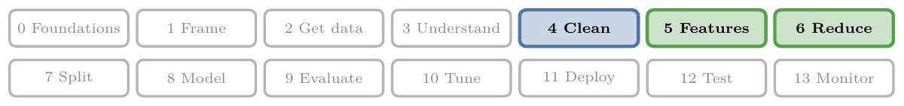
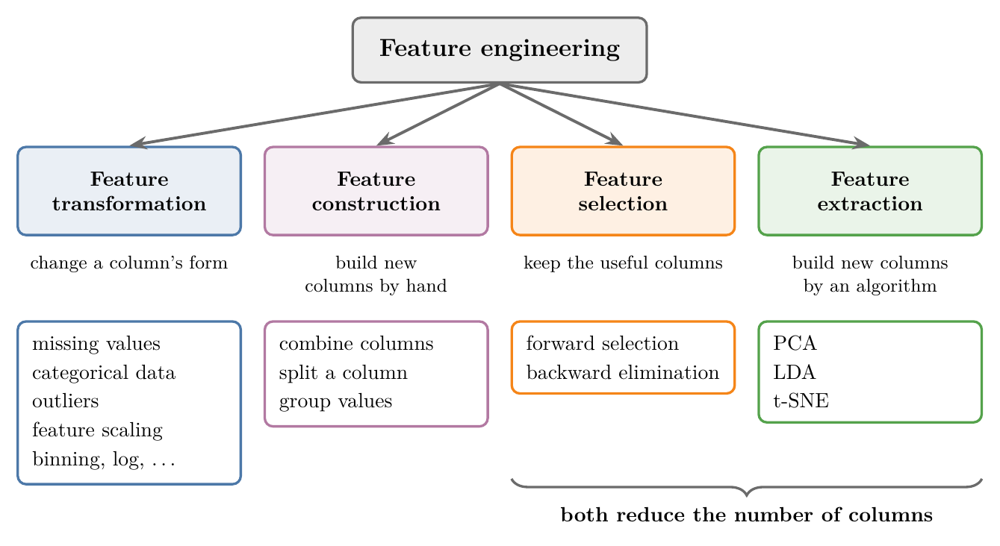
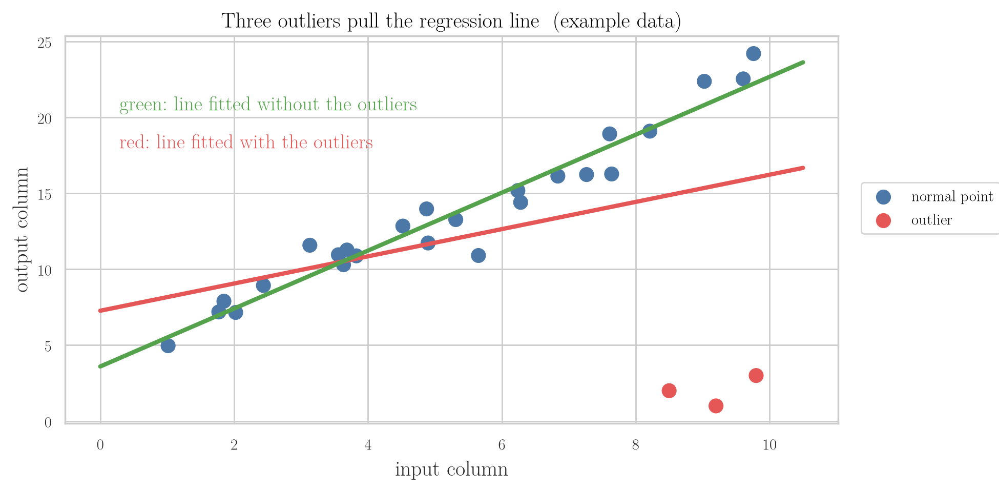
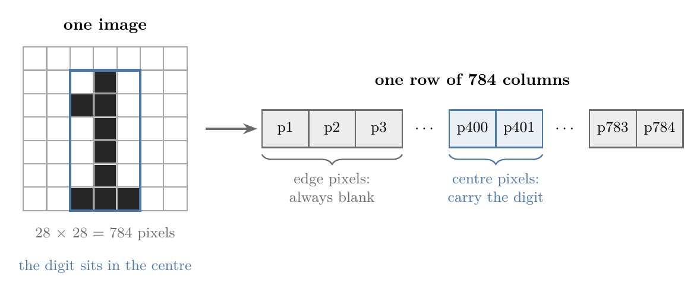
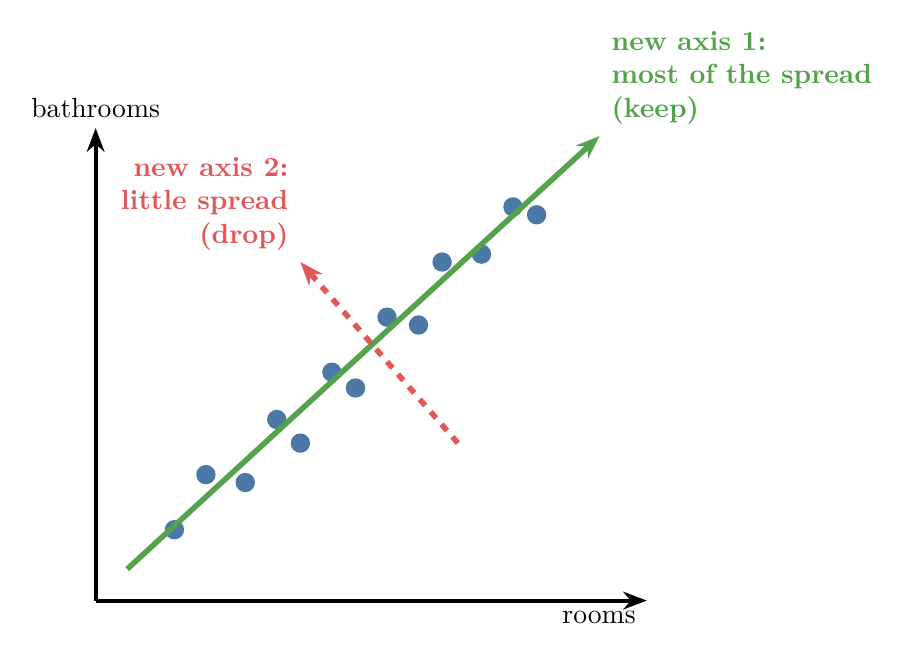

<!-- where-this-fits: generated by course_map/build_map.py; edit concepts.yaml, not this block -->
> **Where this fits:** Pipeline map steps 4 (Clean), 5 (Engineer features), 6 (Reduce dimensions). See the [Course map](../01-course-map/note.md).
>
> 
>
> - **Builds on:** Dimensionality reduction ([Note 3](../03-types-of-ml/note.md)); Poor-quality data ([Note 7](../07-challenges-in-ml/note.md)); Features ([Note 11](../11-tensors/note.md)); Univariate analysis ([Note 20](../20-univariate-analysis/note.md)); Correlation ([Note 21](../21-bivariate-multivariate-analysis/note.md)).
> - **Leads to:** Standardization ([Note 24](../24-standardization/note.md)); Ordinal and label encoding ([Note 26](../26-ordinal-label-encoding/note.md)); PCA ([Note 47](../47-pca-geometric-intuition/note.md)); K-nearest neighbours (Video 91, coming); Normalization (Video 25, coming); Column transformer (Video 28, coming).
> - **Compare with:** Ordinal and label encoding ([Note 26](../26-ordinal-label-encoding/note.md)).
<!-- /where-this-fits -->

## 1. Overview

> **Key point:** Feature engineering turns raw data into columns that a model can learn from well. It has four parts: transformation, construction, selection and extraction.

So far we can gather data and study it with EDA. Before a model can learn from that data, we have to prepare its columns. That work is feature engineering, and it fills the next stretch of Notes.

Figure 1 is the map of this whole stretch. Each of the four parts has its own techniques, and each technique gets its own Note later. This Note explains what each part is for, with one example each.



## 2. What feature engineering is

> **Key point:** Feature engineering uses knowledge of the problem to create, change and choose the columns given to an ML algorithm, so that it performs better.

Recall that a **feature** is one input column of the data. A common definition (from Wikipedia) reads:

> **Feature engineering** is the process of using domain knowledge to extract features from raw data, which can be used to improve the performance of machine learning algorithms.

Two words in it matter:

- **Raw data:** the data as it arrives, with gaps, text, odd values and unhelpful columns. Having data does not mean we can hand it straight to an algorithm.
- **Domain knowledge:** knowledge of the field the data comes from, such as medicine, property or shipping. It tells us which columns make sense and which new ones would help.

A model gives good results only when its input columns are good. Turning raw data into such columns is feature engineering.

## 3. Why feature engineering matters

> **Key point:** Good features with a simple algorithm usually beat poor features with a powerful algorithm.

A well-known saying in ML: give a weak algorithm excellent features and a powerful algorithm poor features, and the weak one usually wins. The columns we give a model limit what it can learn, however clever the model is.

Feature engineering is also more an art than a science. Like programming, it has known techniques, but each person combines them in their own way.

Two data scientists given the same data will often build different columns. This is why different books and courses teach it differently: there is no single fixed recipe. The techniques below are the shared toolkit, and experience decides how to use them.

## 4. Where feature engineering sits in an ML project

> **Key point:** Feature engineering comes after the data is gathered, studied and given a first clean-up, and before any model is trained.

In the steps of an ML project, data first arrives and gets some initial preprocessing. Feature engineering comes next. Only then is the prepared data given to an algorithm to train a model.

| Step | What happens |
|---|---|
| Get data | collect it from files, databases, APIs or the web |
| Understand data | study it with EDA |
| **Engineer features** | prepare the columns (this group of Notes) |
| Train a model | give the prepared data to an algorithm |

Some lists of project steps name "feature engineering" and "feature selection" separately. Here both belong to feature engineering: selection is one of its four parts.

## 5. The four parts of feature engineering

> **Key point:** We can change columns (transformation), add columns (construction), keep only some columns (selection), or replace columns with new ones made by an algorithm (extraction).

Figure 1 groups everything feature engineering does into four parts:

1. **Feature transformation:** change a column into another form, so that the model works better with it.
2. **Feature construction:** create a new column by hand, from existing ones, when we think it will give better results.
3. **Feature selection:** give the algorithm only the useful columns and drop the rest.
4. **Feature extraction:** let an algorithm build completely new columns out of the existing ones.

The next four sections take the parts in this order.

## 6. Feature transformation

> **Key point:** Feature transformation changes a column's form. Its four main jobs: fill missing values, turn categories into numbers, deal with outliers, and put columns on the same scale.

Sometimes a column is in a form that the algorithm cannot use, or cannot use well. Feature transformation changes it into a better form. It is the first step of feature engineering, and it has many techniques; these four are the most important.

### 6.1 Handling missing values

> **Key point:** scikit-learn models do not accept missing values, so we either remove them or fill them in.

Real-world data almost always has gaps. A person may have left a form field blank, or something may have gone wrong while the data was collected.

Gaps are a real problem: scikit-learn, the main ML library in Python, refuses to train a model on data with missing values. So before training, we do one of two things:

- **Remove** the rows with gaps. This is fine when only a few rows are affected, since losing them hardly changes the data.
- **Fill** the gaps, when too many rows would be lost. For a numerical column we can use the column's mean or median; for a categorical column, its most common value (the **mode**).

Filling in missing values is called **imputation**. There are many more ways to do it, each with its own uses, and several Notes cover them one by one.

### 6.2 Handling categorical values

> **Key point:** Algorithms work only with numbers, so text categories must be converted into numbers.

A **categorical** column holds labels rather than numbers, such as the names of animals. scikit-learn models work only with numbers, so the labels must be turned into numbers first.

One common way is to replace the column with one new column per category. In each row, the column of that row's category gets a 1 and all others get a 0. This is called **one-hot encoding**.

Before:

| animal |
|---|
| dog |
| cat |
| sheep |
| horse |
| lion |

After one-hot encoding:

| dog | cat | sheep | horse | lion |
|---|---|---|---|---|
| 1 | 0 | 0 | 0 | 0 |
| 0 | 1 | 0 | 0 | 0 |
| 0 | 0 | 1 | 0 | 0 |
| 0 | 0 | 0 | 1 | 0 |
| 0 | 0 | 0 | 0 | 1 |

The text column has become five numerical columns that hold the same information. Other ways of encoding categories come in later Notes.

### 6.3 Binning: numbers into categories

> **Key point:** Binning goes the other way: it groups a numerical column into ranges, which then act as categories.

Sometimes we convert numbers into categories instead. An `age` column holds exact ages, but the ranges may matter more than the exact values:

| Age range | Group |
|---|---|
| 0 to 15 | child |
| 16 to 30 | young |
| 31 to 45 | adult |
| and so on | |

Grouping numbers into ranges like this is called **binning**. It is one more way of changing a column's form.

### 6.4 Detecting and removing outliers

> **Key point:** A few extreme values can pull a model far away from the pattern in the rest of the data.

An **outlier** is a value very different from the rest. In a class where most students score around 50 out of 100, one student scoring 98 is an outlier.

Outliers are risky because some algorithms are very sensitive to them. **Linear regression** draws the straight line that runs as close as possible to all the points. Figure 2 shows what three outliers do to it.



- **Red line:** fitted to all points. To get close to the three outliers at the bottom right, it tilts away from the clear pattern of the other 25 points.
- **Green line:** fitted after removing the three outliers. It follows the main pattern.

When we use an algorithm that is sensitive to outliers, it is our job to deal with them before training. That means first **detecting** them, and then removing or adjusting them. Several Notes cover the methods.

### 6.5 Feature scaling

> **Key point:** When columns have very different ranges, the column with the biggest numbers dominates; scaling puts all columns on a similar range.

Input columns often have very different ranges. Take two columns: `age`, in the tens, and `salary`, in the tens of thousands.

Some algorithms, such as KNN (which labels a point by its nearest neighbours), compare points by the straight-line distance between them. With these two columns, the salary difference is so large that it decides the distance almost alone. The age column then has almost no say in how the model behaves.

> **Extra:** Euclidean distance, step by step.
>
> 1. **In words:** for two points, take the difference in each column, square each difference, add them up, and take the square root.
> 2. **Formula:** for points $(x_1, y_1)$ and $(x_2, y_2)$,
>    $$d = \sqrt{(x_2 - x_1)^2 + (y_2 - y_1)^2}$$
> 3. **Example:** person A is 25 years old and earns 50,000 rupees; person B is 45 and earns 52,000 rupees. Then
>    $$d = \sqrt{(45 - 25)^2 + (52000 - 50000)^2} = \sqrt{400 + 4{,}000{,}000} \approx 2000.1$$
>    A 20-year age gap adds only 0.1 to the distance. The salary column decides almost everything.

The fix is **feature scaling**: converting all columns to a similar range: for example, squeezing each into 0 to 1, or shifting each to mean 0 with standard deviation 1. We usually scale the columns before giving the data to such an algorithm. The two main techniques, **standardization** and **normalization**, each get their own Note.

> **Extra:** The same example after scaling. Suppose ages run from 20 to 60 and salaries from 20,000 to 100,000 rupees. Rescaling each column to 0 to 1 gives A = (0.125, 0.375) and B = (0.625, 0.4). Now
> $$d = \sqrt{(0.625 - 0.125)^2 + (0.4 - 0.375)^2} = \sqrt{0.25 + 0.000625} \approx 0.50$$
> The age gap now counts: it is large for this range of ages, while the salary gap is small for this range of salaries.

### 6.6 Other transformations

> **Key point:** Many more transformations exist, such as the log transform and the Box-Cox transform.

Missing values, categories, outliers and scaling are the main jobs, but not the only ones. Mathematical transformations such as the **log transform** and the **Box-Cox transform** change the shape of a column's values. Dates and times, and columns that mix numbers with text, also need their own handling.

> **Extra:** Missing values and outliers are also part of *cleaning* the data. On the Course map they sit at the Clean step, just before feature engineering. In practice the two steps overlap, and the same techniques serve both.

## 7. Feature construction

> **Key point:** Feature construction creates a new column by hand from existing ones, guided by domain knowledge, intuition and experience.

Sometimes a useful column is not in the data at all. If we think such a column would give better results, we create it ourselves. This is feature construction.

There is no fixed method for it. What we build depends on how well we know the data, on intuition and on experience, so two people may build different columns.

### 7.1 Family size on the Titanic

> **Key point:** Two Titanic columns, `SibSp` and `Parch`, combine into one clearer column: family size.

The Titanic dataset has two related columns:

- `SibSp`: the number of siblings or spouses travelling with the passenger;
- `Parch`: the number of parents or children travelling with the passenger.

Both describe the same thing: the passenger's family on board. So we can replace them with a single new column, `family_size`.

| Passenger | SibSp | Parch | family_size | family_type |
|---|---|---|---|---|
| Braund, Mr. Owen Harris | 1 | 0 | 2 | small |
| Heikkinen, Miss. Laina | 0 | 0 | 1 | alone |
| Palsson, Master. Gosta Leonard | 3 | 1 | 5 | large |

We can go one step further and turn the number into categories, as in binning:

- **alone:** family size 1;
- **small family:** family size 2 to 4;
- **large family:** family size 5 or more.

Two weak columns have become one meaningful column. Ideas like this come from working with the data and reading about it.

> **Python:** Building the two new columns, on the Titanic file used in Note 19.
>
> ```python
> import pandas as pd
>
> df = pd.read_csv("titanic_train.csv")
> # +1 counts the passenger themself
> df["family_size"] = df["SibSp"] + df["Parch"] + 1
> # bins (0, 1], (1, 4], (4, 20]
> df["family_type"] = pd.cut(
>     df["family_size"], bins=[0, 1, 4, 20],
>     labels=["alone", "small", "large"])
> ```
>
> `pd.cut` puts each value into a range (a bin) and gives that range a label.

> **Extra:** The new column does carry information. In the Titanic training data, 30% of passengers travelling alone survived, 58% of those in small families, and only 16% of those in large families.

### 7.2 Splitting and grouping

> **Key point:** Besides combining columns, we can also split one column into several, or group its values.

Feature construction has a few common patterns:

- **Combining:** several columns into one, as with family size.
- **Splitting:** one column into several, such as a full name into first name and title.
- **Grouping:** values into fewer categories, as with alone, small and large.

## 8. Feature selection

> **Key point:** Feature selection keeps only the important columns and drops the rest, which makes the model better and faster.

Instead of giving the algorithm every column, we choose the useful ones and remove those that are not important. This is feature selection.

### 8.1 Pixels as columns: the MNIST dataset

> **Key point:** In image data every pixel is a column, and many pixels, such as those at the edges, carry no information.

The **MNIST dataset** is a well-known collection of about 70,000 images of handwritten digits, 0 to 9. Each image is small: 28 × 28 pixels, so 784 pixels in all.

To use images in ML, each image is turned into one row of a table, with one column per pixel (Figure 3). The value in each column is that pixel's brightness. So the MNIST table has 784 input columns.



Training on 784 columns takes a lot of time. And many of them are useless: the digit is always drawn in the centre, so the pixels near the edges are blank in nearly every image.

Feature selection keeps the important pixels, the ones in the centre, and drops the rest. The model then works with fewer columns, which brings two gains:

- **better performance**, since useless columns no longer get in the way;
- **more speed**, since there is less data to process.

Common techniques include **forward selection** (start with no columns, add the best one at a time) and **backward elimination** (start with all columns, remove the worst one at a time).

## 9. Feature extraction

> **Key point:** Feature extraction builds completely new columns out of the existing ones, then keeps only the most useful new columns.

Feature extraction is the last part. Like feature construction, it creates new columns. Unlike construction, the new columns are computed by an algorithm, not chosen by hand.

### 9.1 Rooms, bathrooms and area

> **Key point:** Two important columns can be replaced by one new column that holds the information of both.

Take property data with three columns: number of rooms, number of bathrooms, and price. If we had to remove one of the two input columns, which would it be?

Neither is easy to drop, because both help set the price. A property agent might instead suggest using neither, and replacing both with the flat's **area** in square feet. More rooms and bathrooms mean a bigger area, so one new column carries most of what the two old ones said.

| rooms | bathrooms | | area in square feet (new column) |
|---|---|---|---|
| 2 | 1 | $\rightarrow$ | 800 |
| 3 | 2 | $\rightarrow$ | 1,300 |
| 4 | 3 | $\rightarrow$ | 1,900 |

The number of columns went down, and none of the original columns was kept as it was.

### 9.2 New axes

> **Key point:** Extraction algorithms such as PCA rotate the axes so that a few new axes hold most of the information.

Figure 4 shows the same idea geometrically. The points use two columns, rooms and bathrooms, and they lie roughly along a diagonal line.



We draw new axes instead of the old ones:

- **New axis 1** runs along the diagonal. The points are spread out along it, so it holds most of the information. We keep it.
- **New axis 2** runs across the diagonal. The points hardly spread along it, so we can drop it.

Each point is now described by one number, its position on new axis 1, instead of two. This is what **PCA** (principal component analysis), the best-known extraction technique, does: it rotates the axes to create new columns and keeps the most useful ones.

If we start with 5 columns, PCA creates 5 new ones. We might keep the 2 most useful and drop the other 3, so the number of columns goes down and none of the old columns is used directly.

The main extraction techniques are **PCA**, **LDA** (linear discriminant analysis) and **t-SNE**. They are especially useful for high-dimensional data, meaning data with very many columns.

## 10. The feature engineering Notes, in order

> **Key point:** The Notes that follow work through the four parts in detail, starting with feature transformation.

| Part | Topic | Notes |
|---|---|---|
| Transformation | Feature scaling: standardization, normalization | 24, 25 |
| Transformation | Encoding categorical data: ordinal, label, one-hot | 26, 27 |
| Transformation | Applying transformations to the right columns: column transformer, pipelines | 28, 29 |
| Transformation | Mathematical transforms: log, Box-Cox and others | 30, 31 |
| Transformation | Binning, mixed variables, dates and times | 32 to 34 |
| Transformation | Missing values: removing rows, imputation | 35 to 40 |
| Transformation | Outliers: what they are, detecting and removing them | 41 to 44 |
| Construction | Feature construction and splitting | 45 |
| Extraction | Curse of dimensionality, PCA | 46 to 49 |
| Selection | Forward selection, backward elimination and others | later, after the main algorithms |

The order of the Notes differs a little from the order of this Note. Each Note stands on its own, so it can also be read when the topic comes up in a project.

## 11. Summary

| Part | What it does | Example | Main techniques |
|---|---|---|---|
| Feature transformation | changes a column's form | animal names into 0/1 columns | imputation, encoding, binning, outlier removal, scaling |
| Feature construction | builds a new column by hand | `SibSp` + `Parch` into family size | combining, splitting, grouping |
| Feature selection | keeps only the useful columns | drop the blank edge pixels of MNIST | forward selection, backward elimination |
| Feature extraction | builds new columns with an algorithm | rooms and bathrooms into area | PCA, LDA, t-SNE |

- Feature engineering uses domain knowledge to turn raw data into columns that help a model perform better.
- Good features matter more than a powerful algorithm.
- It is partly an art: there are known techniques, but no single fixed recipe.
- It comes after the data is gathered and studied, and before a model is trained.
- Transformation's main jobs: missing values, categorical data, outliers and scaling.
- Selection and extraction both reduce the number of columns: selection keeps some old ones, extraction builds new ones.

## 12. Key terms

| Term | Meaning |
|---|---|
| Feature engineering | Using domain knowledge to turn raw data into features that improve an ML model |
| Raw data | Data as it arrives, before any preparation |
| Domain knowledge | Knowledge of the field the data comes from |
| Feature transformation | Changing a column into a form the model can use better |
| Imputation | Filling in missing values, for example with the mean, median or mode |
| Mode | The most common value of a column |
| Categorical column | A column whose values are labels rather than numbers |
| One-hot encoding | Replacing a categorical column with one 0/1 column per category |
| Binning | Grouping a numerical column into ranges that act as categories |
| Outlier | A value very different from the rest of the data |
| Linear regression | An algorithm that fits the straight line closest to all the points |
| Feature scaling | Converting columns to a similar range so that no column dominates |
| Euclidean distance | The straight-line distance between two points |
| Feature construction | Creating a new column by hand from existing ones |
| Feature selection | Keeping only the useful columns and dropping the rest |
| MNIST | A dataset of about 70,000 handwritten-digit images of 28 × 28 pixels |
| Feature extraction | Building completely new columns from the old ones with an algorithm |
| PCA | Principal component analysis: an extraction technique that rotates the axes and keeps the most useful new ones |
