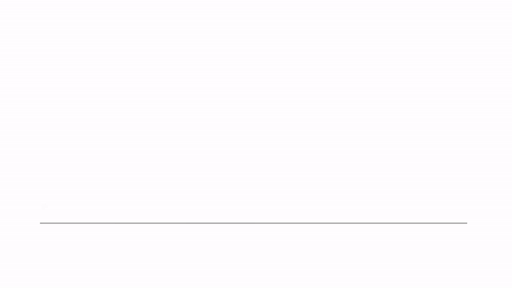
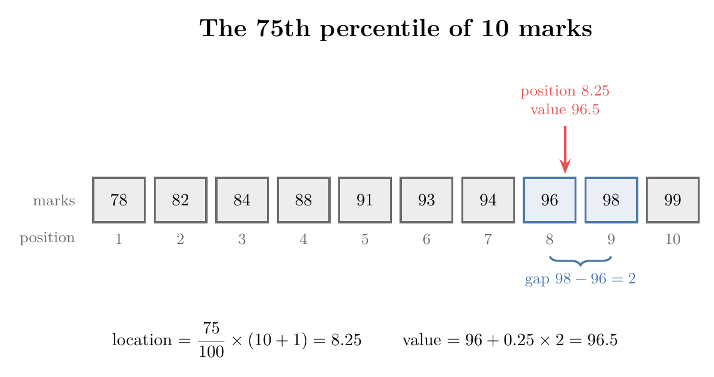
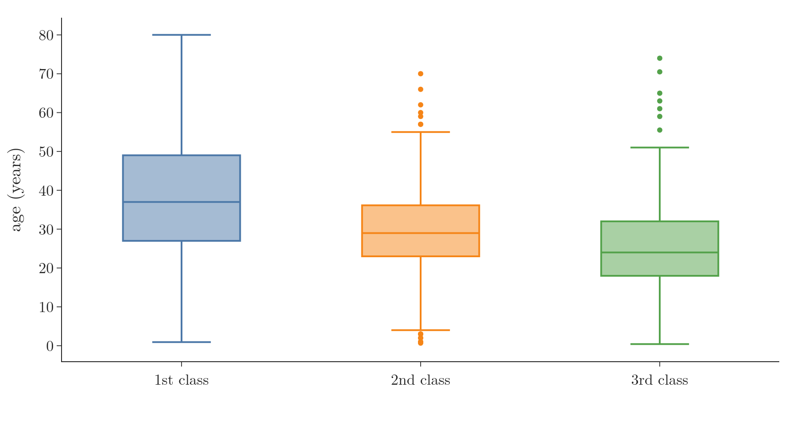

<!-- where-this-fits: generated by course_map/build_map.py; edit concepts.yaml, not this block -->
> **Where this fits:** Pipeline map step 3 (Understand data). See the [Course map](../01-course-map/note.md).
>
> 
>
> - **Builds on:** Exploratory data analysis ([Note 19](../19-understanding-your-data/note.md)); Frequency tables ([Note 223](../223-frequency-tables-and-graphs/note.md)).
> - **Leads to:** Correlation ([Note 231](../231-covariance-and-correlation/note.md)); Z-score outlier method ([Note 251](../251-standard-normal-and-z-table/note.md)); Skewness ([Note 252](../252-skewness/note.md)); Standardization ([Note 1023](../1023-data-scaling-in-ann/note.md)).
> - **Compare with:** Inferential statistics ([Note 220](../220-what-is-statistics/note.md)).
<!-- /where-this-fits -->

## 1. Overview

> **Key point:** Percentiles locate values inside sorted data; five of them make the five-number summary, and the five-number summary draws the box plot.



Figure 1 shows where this Note ends: a box plot built by hand from ten numbers. The way there is a chain of ideas, each needing the one before: quantiles, percentiles and how to compute them, the five-number summary and the IQR, and finally the box plot.

## 2. Quantiles

> **Key point:** Quantiles cut sorted data into equal-sized groups; quartiles make 4 groups, quintiles 5, deciles 10 and percentiles 100.

**Quantiles** are values that divide sorted numerical data into groups of equal size, each holding the same number of observations. They help us understand a distribution, compare columns and spot outliers.

The names are confusing because they sound alike. "Quantile" is the general word; the others are kinds of quantile, named by the number of groups (Figure 2):

- **Quartiles** cut the data into 4 groups, at the 25th, 50th and 75th percentiles: $Q_1$, $Q_2$ (the median) and $Q_3$. The [understanding your data Note](../19-understanding-your-data/note.md) (section 7.2) meets them in `describe()`.
- **Quintiles** cut it into 5 groups, at the 20th, 40th, 60th and 80th percentiles.
- **Deciles** cut it into 10 groups, at the 10th, 20th, ..., 90th percentiles.
- **Percentiles** cut it into 100 groups.


Four facts hold for all of them:

1. **The data must be sorted** from low to high first. Without sorting, no quantile can be found.
2. **A quantile is a location** in the sorted data: we find where the cut falls.
3. **The cut may not be a value in the data.** It can fall between two values, as Section 3 shows.
4. **Every quantile is a percentile.** Quartiles, quintiles and deciles are just particular percentiles, so knowing how to compute percentiles is enough.

## 3. Percentiles

> **Key point:** The $p$-th percentile is the value below which $p\%$ of the data lies; we find it at position $(p/100) \times (n+1)$ of the sorted data.

A percentile (defined in the [understanding your data Note](../19-understanding-your-data/note.md)) is the value below which a given percentage of the observations falls. The 75th percentile has 75% of the data below it and 25% above.

A percentile is not a percentage. A 90% score in a board exam means 90 marks out of 100. A 90th-percentile score, as in the CAT exam, means we did better than 90% of the candidates, whatever our marks were. At the 99th percentile, only 1% of candidates scored higher.

### 3.1 The value at a given percentile

> **Key point:** Compute the position $(p/100) \times (n+1)$; if it falls between two values, move the same fraction of the way from the lower to the upper one.

Ten students scored 78, 82, 84, 88, 91, 93, 94, 96, 98 and 99 (already sorted). How many marks put a student at the 75th percentile? Figure 3 shows the answer.



1. **In words:** sort the data. Compute the percentile's position. If the position is a whole number, the value there is the answer. If it falls between two positions, start at the lower value and add the same fraction of the gap to the next one.
2. **Formula:** for the $p$-th percentile of $n$ sorted values $x_{(1)} \le \dots \le x_{(n)}$, the location is
   $$L = \frac{p}{100}\,(n + 1)$$
   Write $L = k + d$, with $k$ its whole part and $d$ its decimal part. Then
   $$P_p = x_{(k)} + d\,\bigl(x_{(k+1)} - x_{(k)}\bigr)$$
3. **Example:** for the 75th percentile,
   $$L = \frac{75}{100} \times (10 + 1) = 8.25$$
   So $k = 8$ and $d = 0.25$. The 8th mark is 96 and the 9th is 98:
   $$P_{75} = 96 + 0.25 \times (98 - 96) = 96 + 0.5 = 96.5$$

So 96.5 marks puts a student at the 75th percentile, although nobody scored exactly 96.5 (fact 3 of Section 2).

The 50th percentile works the same way: $L = 0.5 \times 11 = 5.5$, halfway between the 5th mark (91) and the 6th (93):
$$P_{50} = 91 + 0.5 \times (93 - 91) = 92$$
This is the median, as it should be.

> **Extra:** Software uses several percentile formulas, and they give slightly different answers on small data. The $(n+1)$ formula above is NumPy's `method="weibull"`. NumPy's and pandas' default, `"linear"`, uses the location $1 + (p/100) \times (n - 1)$ instead: for the ten marks it gives location 7.75 and a 75th percentile of $94 + 0.75 \times 2 = 95.5$, not 96.5. Both are correct conventions; on large data they agree closely. The [understanding your data Note](../19-understanding-your-data/note.md) uses pandas' default.

> **Python:** Percentiles.
>
> ```python
> import numpy as np
>
> marks = [78, 82, 84, 88, 91, 93, 94, 96, 98, 99]
> np.percentile(marks, 75, method="weibull")   # 96.5, the (n+1) rule
> np.percentile(marks, 75)                     # 95.5, the default rule
> ```
>
> In pandas, `df["marks"].quantile(0.75)` takes the percentile as a fraction.

### 3.2 The percentile of a given value

> **Key point:** The percentile rank of a value counts the values below it, plus half of those equal to it, as a share of all values.

The reverse question: a student scored 88. At which percentile is that score?

1. **In words:** count the values below the given value, add half the number of values equal to it, divide by the total, and multiply by 100.
2. **Formula:** with $X$ the number of values below the value, $Y$ the number equal to it, and $n$ the total,
   $$\text{percentile rank} = \frac{X + 0.5\,Y}{n} \times 100$$
3. **Example:** three marks (78, 82, 84) lie below 88, and one mark equals it. So
   $$\text{percentile rank}_{88} = \frac{3 + 0.5 \times 1}{10} \times 100 = 35$$
   A score of 88 is at the 35th percentile. For 99, nine marks lie below it:
   $$\text{percentile rank}_{99} = \frac{9 + 0.5 \times 1}{10} \times 100 = 95$$

Counting half of the equal values puts a value in the middle of its own share of the data. Without the half, the lowest mark would be at the 0th percentile and the highest at the 90th, which is lopsided.

> **Python:** Percentile rank.
>
> ```python
> from scipy import stats
>
> stats.percentileofscore(marks, 88, kind="mean")   # 35.0
> ```
>
> `kind="mean"` is the formula above. Other `kind` values count the equal values fully or not at all.

## 4. The five-number summary and the IQR

> **Key point:** Minimum, Q1, median, Q3 and maximum split the data into four equal parts; the IQR, Q3 - Q1, is the width of the middle half.

The five-number summary (minimum, $Q_1$, median, $Q_3$, maximum) and the IQR are defined in the [univariate analysis Note](../20-univariate-analysis/note.md), section 8. In percentile terms they are the 0th, 25th, 50th, 75th and 100th percentiles, so the location formula of Section 3.1 computes every one of them.

The IQR uses only $Q_1$ and $Q_3$, so making the smallest or largest value more extreme does not change it: in Section 5, replacing 1500 by 15000 leaves the IQR at 94.25. pandas' `describe()` prints all five numbers, along with the count, mean and standard deviation.

## 5. Building a box plot by hand

> **Key point:** Quartiles give the box, fences 1.5 IQR beyond it decide how far the whiskers reach, and any value beyond the fences is drawn as an outlier.

A box plot (box-and-whisker plot) draws the five-number summary; the [univariate analysis Note](../20-univariate-analysis/note.md) (section 8) labels its parts on the Titanic ages. Here we build one ourselves for ten values, step by step as in Figure 1:
$$6,\ 213,\ 241,\ 260,\ 281,\ 290,\ 314,\ 321,\ 350,\ 1500$$

**Step 1: sort.** The values are already in ascending order.

**Step 2: the box.** We need $Q_1$, $Q_2$ and $Q_3$, with the location formula of Section 3.1 and $n + 1 = 11$:

- $Q_2$: $L = 0.5 \times 11 = 5.5$, halfway between 281 and 290:
  $$Q_2 = 281 + 0.5 \times 9 = 285.5$$
- $Q_1$: $L = 0.25 \times 11 = 2.75$, between the 2nd value (213) and the 3rd (241):
  $$Q_1 = 213 + 0.75 \times (241 - 213) = 213 + 21 = 234$$
- $Q_3$: $L = 0.75 \times 11 = 8.25$, between the 8th value (321) and the 9th (350):
  $$Q_3 = 321 + 0.25 \times (350 - 321) = 321 + 7.25 = 328.25$$

The box runs from 234 to 328.25, with the median line at 285.5.

**Step 3: the fences.** The whiskers' limits are not the smallest and largest values. They are computed 1.5 IQR beyond the box (see the [IQR outliers Note](../43-outliers-iqr/note.md), section 3):
$$\text{IQR} = 328.25 - 234 = 94.25, \qquad 1.5 \times \text{IQR} = 141.375$$
$$\text{lower fence} = 234 - 141.375 = 92.625, \qquad \text{upper fence} = 328.25 + 141.375 = 469.625$$

**Step 4: whiskers and outliers.** Each whisker stops at the last real value inside its fence:

- **Left:** the fence is at 92.625; the smallest value inside it is 213. So the whisker ends at 213, and 6, below the fence, is drawn as an outlier dot.
- **Right:** the fence is at 469.625; the last value inside it is 350. The whisker ends at 350, and 1500 is an outlier.

That is the whole construction. Plotting libraries follow the same steps, though their percentile formula can shift the quartiles slightly (Section 3.1).

> **Extra:** Why 1.5 IQR? (The rule's origin is in the [IQR outliers Note](../43-outliers-iqr/note.md).) For normally distributed data, $Q_1$ and $Q_3$ sit 0.674 standard deviations from the mean, so the fences sit $0.674 + 1.5 \times 1.349 \approx 2.70$ standard deviations out. Only about 0.7% of normal data falls outside them, so a dot beyond a fence is genuinely unusual.

> **Python:** The box plot of the ten values.
>
> ```python
> import plotly.express as px
>
> data = [6, 213, 241, 260, 281, 290, 314, 321, 350, 1500]
> px.box(x=data, points="outliers")
> ```
>
> Plotly's default quartile formula can differ slightly from the hand calculation. The Notebook (`notebook.ipynb`) redoes every step in code.

## 6. Reading box plots

> **Key point:** A box plot shows the centre, the spread, the skew and the outliers of a column at once, and side-by-side box plots compare groups.

One box plot answers four questions:

- **Where is the centre?** The median line.
- **How spread out is the data?** The width of the box (the IQR) and the reach of the whiskers.
- **Is it skewed?** If the median sits off-centre in the box, the middle half of the data is lopsided. If one whisker is much longer than the other, one tail of the data is longer.
- **Are there outliers?** The dots beyond the whiskers. The box plot is the standard outlier check for data that is not normally distributed (the IQR method of the [IQR outliers Note](../43-outliers-iqr/note.md)).

Its fifth use is comparison. Splitting a numerical column by a categorical one gives one box plot per category, side by side, as in the [bivariate and multivariate analysis Note](../21-bivariate-multivariate-analysis/note.md) (section 5). Figure 4 splits the Titanic ages by ticket class.



Comparing the three boxes:

- **Centre:** first-class passengers were older (median 37) than second (29) and third class (24).
- **Spread:** the first-class box is the widest (27 to 49), so their ages varied the most.
- **Outliers:** in second and third class, the oldest passengers are outliers, because those boxes are narrow. In first class, ages up to 80 fit inside the whiskers.

## 7. Summary

| Idea | Formula | Example |
|---|---|---|
| Percentile location | $L = (p/100) \times (n+1)$ | 75th of 10 values: 8.25 |
| Percentile value | $x_{(k)} + d\,(x_{(k+1)} - x_{(k)})$ | $96 + 0.25 \times 2 = 96.5$ |
| Percentile rank | $(X + 0.5Y)/n \times 100$ | mark 88: 35th percentile |
| IQR | $Q_3 - Q_1$ | $328.25 - 234 = 94.25$ |
| Fences | $Q_1 - 1.5\,\text{IQR}$, $Q_3 + 1.5\,\text{IQR}$ | 92.625 and 469.625 |

- Quantile is the general word; quartiles (4), quintiles (5), deciles (10) and percentiles (100) are kinds of it.
- A percentile need not be a value in the data.
- Five-number summary: minimum, $Q_1$, median, $Q_3$, maximum.
- Whiskers stop at the last value inside the fences; values beyond are outliers.

## 8. Key terms

| Term | Meaning |
|---|---|
| Quantiles | Values that cut sorted data into equal-sized groups |
| Quintiles | The 20th, 40th, 60th and 80th percentiles: cuts into 5 groups |
| Deciles | The 10th, 20th, ..., 90th percentiles: cuts into 10 groups |
| Percentile location | The position $(p/100) \times (n+1)$ of the $p$-th percentile in sorted data |
| Percentile rank | The percentile at which a given value falls: $(X + 0.5Y)/n \times 100$ |
| Box-and-whisker plot | Another name for a box plot |
