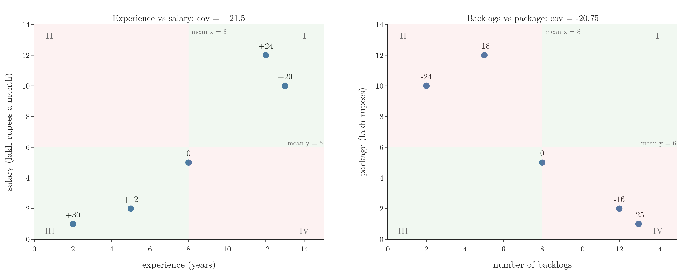
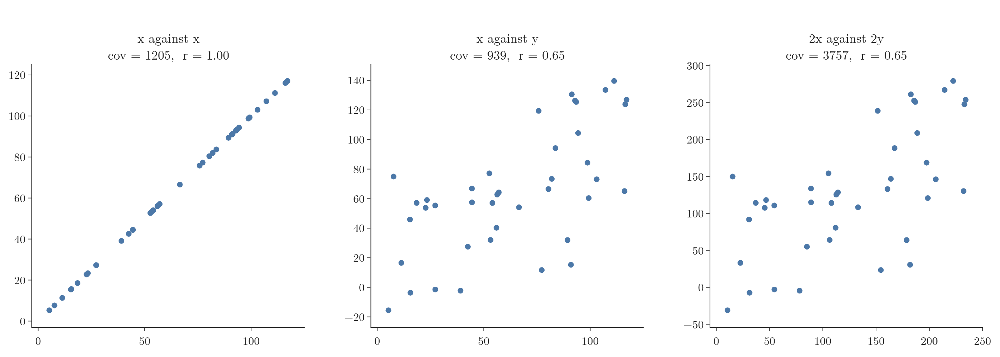
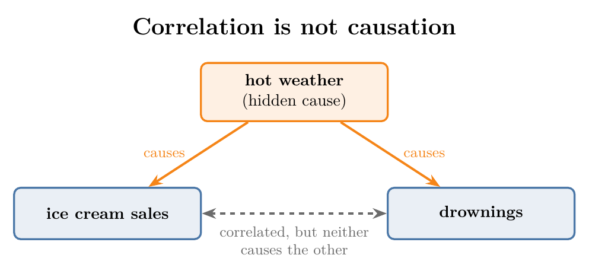

<!-- where-this-fits: generated by course_map/build_map.py; edit concepts.yaml, not this block -->
> **Where this fits:** Pipeline map step 3 (Understand data). See the [Course map](../01-course-map/note.md).
>
> 
>
> - **Builds on:** Variance ([Note 222](../222-measures-of-dispersion/note.md)); Descriptive statistics ([Note 230](../230-percentiles-and-box-plots/note.md)).
> - **Leads to:** Correlation significance test ([Note 570](../570-choosing-a-hypothesis-test/note.md)).
<!-- /where-this-fits -->

## 1. Overview

> **Key point:** Covariance gives the direction of the straight-line relationship between two numerical columns; correlation divides it by the two standard deviations, which adds the strength and removes the effect of units.



A scatter plot shows by eye whether two numerical columns rise together. Covariance and correlation turn that picture into a number. Figure 1 shows the idea behind both: the two mean lines cut the plot into four quadrants, and each point votes positive or negative depending on its quadrant.

## 2. From mean to variance to covariance

> **Key point:** The mean gives the centre, variance gives the spread of one column, and covariance gives how two columns move together.

Each measure fixes a blind spot of the one before:

- **Mean:** gives the centre of a column, but $-10, 0, 10$ and $-20, 0, 20$ have the same mean, 0.
- **Variance:** gives the spread, and tells those two apart (see the [measures of dispersion Note](../222-measures-of-dispersion/note.md)). But it looks at one column at a time.
- **Covariance:** the points $(-1, -1), (0, 0), (1, 1)$ rise from left to right, and $(-1, 1), (0, 0), (1, -1)$ fall. Their $x$ and $y$ variances are identical (2/3 each), as the [PCA step by step Note](../48-pca-step-by-step/note.md) (section 3.1) shows. Only a measure that uses both columns together can tell them apart.

## 3. Covariance

> **Key point:** Covariance averages the product of each point's distances from the two means; positive means the columns rise together, negative means one falls as the other rises, near zero means no straight-line relationship.

Covariance is taught in the [PCA step by step Note](../48-pca-step-by-step/note.md) (section 3.2): the average product of each point's distances from the two means, whose sign gives the direction of a linear relationship (see the [bivariate analysis Note](../21-bivariate-multivariate-analysis/note.md)). That Note divides by $N$, as for a whole population; a sample divides by $n - 1$ instead.

$$\sigma_{xy} = \frac{1}{N}\sum_{i=1}^{N} (x_i - \mu_x)(y_i - \mu_y) \qquad\qquad s_{xy} = \frac{1}{n-1}\sum_{i=1}^{n} (x_i - \bar{x})(y_i - \bar{y})$$

The sample version divides by $n - 1$ for the same reason as the sample variance (see the [measures of dispersion Note](../222-measures-of-dispersion/note.md), section 4.3). For example, five employees (a sample) have experience $x$ = 2, 5, 8, 12, 13 years and monthly salary $y$ = 1, 2, 5, 12, 10 lakh rupees, with means $\bar{x} = 8$ and $\bar{y} = 6$.

| Employee | $x$ | $y$ | $x - \bar{x}$ | $y - \bar{y}$ | Product |
|---|---|---|---|---|---|
| 1 | 2 | 1 | $-6$ | $-5$ | 30 |
| 2 | 5 | 2 | $-3$ | $-4$ | 12 |
| 3 | 8 | 5 | 0 | $-1$ | 0 |
| 4 | 12 | 12 | 4 | 6 | 24 |
| 5 | 13 | 10 | 5 | 4 | 20 |
| **Sum** | | | | | **86** |

$$s_{xy} = \frac{86}{5 - 1} = 21.5$$

The covariance is positive: more experience goes with a higher salary.

### 3.1 Reading covariance from the quadrants

> **Key point:** Points in quadrants I and III add to the covariance, points in II and IV subtract from it; whichever side holds more weight sets the sign.

The two mean lines split the scatter plot into four quadrants (Figure 1, left):

- **Quadrant I** (top right): both distances are positive, so the product is positive.
- **Quadrant III** (bottom left): both distances are negative, and negative times negative is positive.
- **Quadrants II and IV:** one distance is positive and one negative, so the product is negative.

So if most points lie in I and III, the covariance is positive; if most lie in II and IV, it is negative. If the points spread evenly over all four, the products cancel and the covariance is near 0. We can often guess the sign just by imagining the two mean lines on a scatter plot.

The right side of Figure 1 shows the opposite case. Five students have 2, 5, 8, 12 and 13 backlogs and packages of 10, 12, 5, 2 and 1 lakh rupees: more backlogs, lower package. With means 8 and 6, the products are $-24, -18, 0, -16, -25$, so
$$s_{xy} = \frac{-24 - 18 + 0 - 16 - 25}{4} = \frac{-83}{4} = -20.75$$

A third case: if every student got the same package of 10 lakh, whatever their backlogs, then $y - \bar{y} = 0$ for every point. Every product is 0, and the covariance is exactly 0: no linear relationship.

### 3.2 The flaw: covariance depends on the scale

> **Key point:** Multiplying a column by a number multiplies the covariance by it too, so the size of a covariance says nothing about how strong the relationship is.

Covariance tells the direction of the relationship, but not its **strength**: how closely the points follow a straight line. Its size depends on the units of the columns.

1. **In words:** if every $x$ is multiplied by $a$ and every $y$ by $c$, every distance from the mean is multiplied too, so every product, and the covariance, is multiplied by $a \times c$.
2. **Formula:**
   $$\text{cov}(a\,x,\ c\,y) = a\,c\ \text{cov}(x, y)$$
3. **Example:** measuring the employees' experience in months instead of years multiplies $x$ by 12:
   $$\text{cov} = 12 \times 21.5 = 258$$
   Measuring salary in rupees instead of lakhs multiplies the covariance by 100,000: $2{,}150{,}000$. The employees are the same; only the units changed.

Figure 2 shows the problem with 40 random points. The left panel plots a column against itself, a perfect straight line, with covariance 1205. The middle panel plots $x$ against a noisier $y$, a weaker relationship, with covariance 939. The right panel doubles both columns: the picture is identical to the middle one, yet the covariance jumps to 3757, larger than for the perfect line.



So a large covariance does not mean a strong relationship. Covariance is reliable only for its sign. Its main use is as the building block of correlation.

> **Extra:** The covariance of a column with itself is its variance. With $y = x$ the formula becomes $\sum (x_i - \bar{x})(x_i - \bar{x}) / (n-1) = \sum (x_i - \bar{x})^2 / (n-1)$, the sample variance. This is why the covariance matrix of the [PCA step by step Note](../48-pca-step-by-step/note.md) has the variances on its diagonal, and why Figure 2's left panel shows the variance of $x$, 1205.

## 4. Correlation

> **Key point:** Correlation is covariance divided by the two standard deviations; it always lies between -1 and +1, gives both direction and strength, and does not change with the units.

The Pearson correlation coefficient $r$ appears in the [understanding your data Note](../19-understanding-your-data/note.md) (section 9.1). Here we build it from covariance, which shows why it fixes the scale problem.

1. **In words:** divide the covariance by the standard deviation of $x$ and by the standard deviation of $y$.
2. **Formula:**
   $$r = \frac{\text{cov}(x, y)}{s_x\, s_y}$$
   For a population, $\rho = \sigma_{xy} / (\sigma_x \sigma_y)$. The $n - 1$ in the covariance and in the two standard deviations cancel, so both versions give the same number.
3. **Example:** for the five employees, $s_{xy} = 21.5$, $s_x = 4.637$ years and $s_y = 4.848$ lakh, so
   $$r = \frac{21.5}{4.637 \times 4.848} = \frac{21.5}{22.48} \approx 0.957$$
   For the backlogs data, $r = -20.75 / (4.637 \times 4.848) \approx -0.923$.

Both relationships are strong; one rises and one falls.

### 4.1 Reading a correlation

> **Key point:** The sign gives the direction and the distance from 0 gives the strength; +1 and -1 are perfect straight lines.

The scale of $r$, from $-1$ to $+1$, is read as in the [understanding your data Note](../19-understanding-your-data/note.md) (section 9.1): the sign gives the direction, and the closer $|r|$ is to 1, the closer the points lie to a straight line, so the stronger the relationship. Unlike covariance, which can be any number (1205, 3757, $-5000$), $r$ never leaves that range.

In Figure 2, $x$ against itself gives $r = 1.00$. $x$ against $y$ gives $r = 0.65$: positive, but the points scatter around the line, so it is clearly below 1.

> **Extra:** Common rules of thumb call $|r|$ above about 0.7 strong, 0.3 to 0.7 moderate and below 0.3 weak. These cut-offs are conventions, not laws; fields such as physics and social science use different ones.

### 4.2 Correlation does not depend on the scale

> **Key point:** Scaling a column scales its standard deviation by the same amount, which cancels the change in the covariance.

In Figure 2, doubling both columns quadrupled the covariance but left $r$ at 0.65. This always holds.

> **Extra:** Proof that correlation ignores the units.
>
> 1. **In words:** multiplying $x$ by $a$ multiplies the covariance by $a$ and the standard deviation of $x$ by $a$ too, so the two cancel. The same holds for $y$. (Adding a constant changes nothing at all, since it moves the mean by the same amount.)
> 2. **Formula:** for $a, c > 0$,
>    $$r(a\,x,\ c\,y) = \frac{a\,c\ \text{cov}(x, y)}{(a\,s_x)(c\,s_y)} = \frac{\text{cov}(x, y)}{s_x\, s_y} = r(x, y)$$
>    If $a$ or $c$ is negative, the sign of $r$ flips but its size stays.
> 3. **Example:** experience in months: $\text{cov} = 258$ and $s_x = 12 \times 4.637 = 55.64$, so $r = 258 / (55.64 \times 4.848) \approx 0.957$, as before.

Because it gives both the direction and the strength, and does not depend on units, correlation is the measure we use to study the linear relationship between two numerical columns, for example before linear regression. Covariance is still needed, as the step that computes it.

> **Python:** Covariance and correlation.
>
> ```python
> import numpy as np
>
> x = np.array([2, 5, 8, 12, 13])
> y = np.array([1, 2, 5, 12, 10])
> np.cov(x, y)[0, 1]        # 21.5 (divides by n - 1)
> np.corrcoef(x, y)[0, 1]   # 0.957
> ```
>
> Both return a 2 by 2 matrix; `[0, 1]` picks the value for the pair. In pandas, `df["a"].cov(df["b"])` and `df["a"].corr(df["b"])`. The Notebook (`notebook.ipynb`) reruns the scale experiment of Figure 2.

## 5. Correlation does not imply causation

> **Key point:** Two columns can move together without one causing the other, often because a hidden third factor drives both.

**Causation** is a cause-and-effect relationship: a change in one thing produces a change in the other. A correlation only says two things move together. The phrase "correlation does not imply causation" means that a correlation, however strong, is not evidence that one variable causes the other.

Two examples:

- **Firefighters and fire size.** At bigger fires, more firefighters are present: a strong positive correlation. Reading it as "more firefighters make bigger fires" is obviously wrong; the size of the fire decides how many firefighters are sent. Here the direction is clear, but in many datasets it is not.
- **Ice cream and drownings.** On days when more ice cream is sold, more people drown. Ice cream does not cause drowning. Hot weather drives both: people buy more ice cream and swim more (Figure 3).



A hidden factor that drives two variables, like the weather here, is called a **confounding variable** (or confounder). Experience and salary are a subtler case: they are correlated, but the salary may come from skills that grow with experience, not from the years themselves.

Establishing causation needs more than data that happens to be collected: controlled experiments such as **randomised controlled trials**, where a random half of the subjects gets a treatment and the other half does not, or carefully designed observational studies. Until then, a correlation is a hint worth investigating, not a conclusion.

## 6. Summary

| Measure | Formula | Range | Tells | Depends on units? |
|---|---|---|---|---|
| Covariance (sample) | $\sum (x_i - \bar{x})(y_i - \bar{y}) / (n-1)$ | any number | direction | yes |
| Correlation $r$ | $\text{cov}(x, y) / (s_x s_y)$ | $-1$ to $+1$ | direction and strength | no |

| Example | Covariance | $r$ |
|---|---|---|
| Experience vs salary | 21.5 | 0.957 |
| Backlogs vs package | $-20.75$ | $-0.923$ |
| Same package for everyone | 0 | undefined (no spread in $y$) |

- Points in quadrants I and III push the covariance up; II and IV push it down.
- $\text{cov}(a x, c y) = ac\,\text{cov}(x, y)$, but $r$ stays the same.
- The covariance of a column with itself is its variance.
- Correlation does not imply causation; a confounding variable can drive both columns.

## 7. Key terms

| Term | Meaning |
|---|---|
| Population covariance ($\sigma_{xy}$) | Covariance of a whole population, dividing by $N$ |
| Sample covariance ($s_{xy}$) | Covariance of a sample, dividing by $n - 1$ |
| Strength of a relationship | How closely the points follow a straight line; measured by $\lvert r \rvert$ |
| Causation | A cause-and-effect relationship: changing one thing changes the other |
| Confounding variable | A hidden factor that drives two variables and makes them correlated |
| Randomised controlled trial | An experiment that assigns a treatment at random, to test causation |
